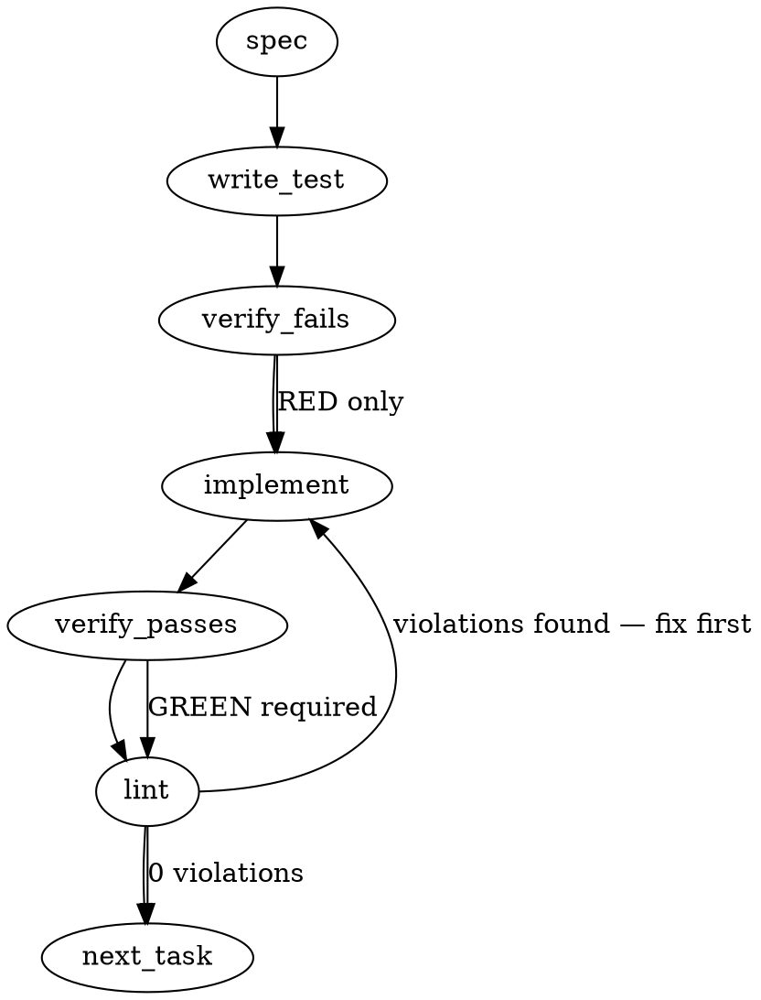

### Problem Statement
The `totem spec` command drafts unanchored specs for free-text topics without concrete grounding anchors, allowing empty or unanchored run artifacts to satisfy the strict pre-commit gate. We must enforce strict grounding anchors (`issue` or `--from <record>`), publish anchor metadata and retrieval scores in the grounding schema, reject unanchored free-text topics falling below similarity floors, and upgrade the hook/pre-commit gate to validate anchored, non-empty specs.

### Architectural Context
Ruled under strategy 2026-08-30. The directive mandates that `totem spec` writes a contract only when grounded, and its output is a retrieval input, never the contract itself. It aligns with mmnto-ai/totem#2691 (the strict pre-commit gate) and mmnto-ai/totem#2692 (the shared hook reader logic). Built to resolve recent issues where 4/4 slug-topic runs confabulated and empty drafts satisfied the gate.

### Files to Examine
1. `packages/cli/src/commands/spec.ts` — Command implementation where input parsing, topic resolution, and LLM orchestration are executed.
2. `packages/cli/src/commands/install-hooks.ts` — Location of the pre-commit gate script compilation logic.
3. `packages/core/src/artifacts/grounding.ts` — Grounding bundle structures and metadata schemas including item provenances.
4. `packages/cli/src/utils.ts` — Helper methods including `buildRetrievalGroundingBundle` where artifact schemas are created.
5. `packages/cli/src/commands/install-hooks.test.ts` — Contains the spec-evidence unit testing for pre-commit gate behavior.
6. `tools-hook-parity.test.ts` — Verification tests for parity across scripts and compiled pre-commit tools.

### Technical Approach & Contracts
1. **Schema & Contract Updates**:
   - Enhance `grounding.ts` to support the anchor schema: `grounding.anchor: { kind: "issue" | "record" | "free-text", ref: string, sha256?: string }`.
   - Extend individual retrieval item schemas to include an optional `score: number` field representing vector similarity.
2. **Grounding & CLI Enforcements**:
   - Map issues to anchor `kind: "issue"`.
   - Support `--from <path>` to ground on hand-authored design records. Read the target path, compute its sha256, and register anchor `kind: "record"` with `sha256` and `ref`.
   - For free-text slugs with no issue/record, map anchor `kind: "free-text"`.
   - If any free-text topic run yields no knowledge retrieval results above the configured minimum floor, terminate immediately with a non-zero exit code, print the floor threshold and its configuration source, and write no run artifact JSON.
3. **Gate/Hook Reader Upgrades**:
   - Upgrade the hook generator in `install-hooks.ts` and `tools/pre-commit` to inspect the latest spec artifact's `grounding.anchor.kind` property, asserting that it belongs to the set `{"issue", "record"}`.
   - Assert that `output.content` contains a drafted document that is non-empty by content (at least 200 characters of trimmed, non-whitespace body).

### Edge Cases & Traps
1. **Backward Compatibility**: Existing or legacy spec artifacts will lack the `grounding.anchor` structure. The upgraded hook reader must handle missing properties gracefully (treating them as unanchored/invalid rather than throwing runtime exceptions).
2. **Refusal Hallucinations**: An LLM refusing to write a spec might output a refusal message over 200 bytes. Requiring `grounding.anchor.kind` to be strictly `issue` or `record` prevents these runs from qualifying as valid spec evidence.
3. **Checksum Stability**: The SHA256 of hand-authored design records must be calculated on normalized file content (e.g., handling line-ending differences) to guarantee cross-platform build consistency.

### Implementation Tasks
- [ ] **Task 1: Extend Grounding and Retrieval Schema Contracts**
      Update the Zod schemas and type definitions in `packages/core/src/artifacts/grounding.ts` to include the `anchor` field and optional similarity `score` in grounding items. Verify that legacy artifacts without these properties parse with safe fallback defaults.
      - Name the files to modify: `packages/core/src/artifacts/grounding.ts`
      - Write test -> verify fails -> implement -> verify passes -> lint.

- [ ] **Task 2: Implement Refusal and Similarity Floor Enforcements in `totem spec`**
      Modify `buildRetrievalGroundingBundle` in `packages/cli/src/utils.ts` and the main command in `packages/cli/src/commands/spec.ts` to enforce the minimum similarity score floor. If the highest retrieval score is below the threshold, exit non-zero, output the threshold value and its configuration source, and generate no artifact.
      - Name the files to modify: `packages/cli/src/commands/spec.ts`, `packages/cli/src/utils.ts`
      > TEST DIRECTIVE: Before implementing, write a failing test named `rejectsUnanchoredTopicBelowFloor` that proves a free-text run below the score floor exits non-zero and writes no artifact file.
      - Write test -> verify fails -> implement -> verify passes -> lint.

- [ ] **Task 3: Implement `--from <record>` Anchor Binding**
      Add `--from <path>` parsing support. When provided, verify path existence, compute its SHA256, and populate the grounding anchor with `kind: "record"`, `ref: path`, and `sha256: computedHash`.
      - Name the files to modify: `packages/cli/src/commands/spec.ts`
      - Write test -> verify fails -> implement -> verify passes -> lint.

- [ ] **Task 4: Upgrade the Hook Generator and Gate Script**
      In `packages/cli/src/commands/install-hooks.ts`, modify the compiled `tools/pre-commit` template block. Ensure the parser verifies the latest spec artifact is anchored (`kind: "issue"` or `kind: "record"`) and has a non-empty `output.content` (> 200 characters of trimmed text).
      - Name the files to modify: `packages/cli/src/commands/install-hooks.ts`
      > TEST DIRECTIVE: Before implementing, write a failing test named `gateRejectsEmptyOrUnanchoredArtifacts` that feeds the hook reader an unanchored run or an empty-content run and proves the gate fails.
      - Write test -> verify fails -> implement -> verify passes -> lint.

- [ ] **Task 5: Update Gate Test Suites and Hook Parity**
      Update testing fixtures and mock artifacts in the gate verification test suite to ensure they correctly mirror and pass the new hook validations.
      - Name the files to modify: `packages/cli/src/commands/install-hooks.test.ts`, `tools-hook-parity.test.ts`
      - Write test -> verify fails -> implement -> verify passes -> lint.

### Execution Flow (structural constraint)

### Verification (MANDATORY — do not skip)
All implementation efforts must be verified sequentially:
1. Execute `totem lint` to ensure 100% compliance with repository formatting, type-safety, and structural constraints.
2. Execute `totem review` to inspect implementation changes through advisory lanes.
3. Run all unit and integration tests inside `packages/cli/src/commands/install-hooks.test.ts` and `tools-hook-parity.test.ts` to prove correct gate behaviors.

### Test Plan
1. **Artifact Metadata Verification**: Assert grounding bundles preserve and correctly parse `anchor` metadata and retrieval scores.
2. **Floor Constraint Verification**: Verify running `totem spec` with a free-text slug below the similarity score limit results in non-zero exit codes, error transparency, and zero minted artifacts.
3. **Binding Record Verification**: Ensure passing `--from <path>` binds the target file's path and SHA256 accurately in the resulting grounding artifact.
4. **Gate Compliance Verification**: Test that `tools/pre-commit` successfully rejects runs that are empty, only contain whitespace, contain refusal messages with no valid structures, or have an anchor kind of `free-text`.
