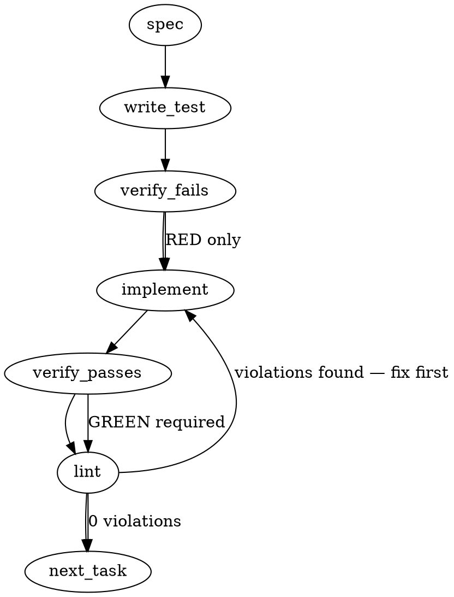

### Problem Statement
The `totem spec` command confabulates when run on unanchored free-text slug topics, and the strict pre-commit gate accepts these discarded drafts (or even completely empty runs) as valid spec evidence. We must update `totem spec` to refuse unanchored free-text topics that fall below a similarity floor (and print the floor information without writing an artifact), implement `--from <record>` to bind hand-authored specs, and upgrade the pre-commit gate to strictly require a non-empty spec run anchored to an `issue` or `record`.

### Architectural Context
- **Core Principle:** "`totem spec` writes a contract only when it is grounded; its output is one retrieval input, never the contract."
- **Ritual Constraint:** "spec-first is a ritual with a gate, not a text to obey."
- **Grounding Limitation:** Currently, all runs are summarized as `similarity-only:8` because anchor metadata is not preserved in the grounding artifact. We must publish the anchor as a first-class field (`grounding.anchor`) and preserve the similarity scores of individual retrieved items.

### Files to Examine
- `packages/core/src/artifacts/grounding.ts` — Location of the grounding artifact schemas, types, and the `provenanceSummary` derivation logic.
- `packages/cli/src/commands/spec.ts` — Command definition for `totem spec`, including topic resolution, vector database retrieval, and artifact emission.
- `packages/cli/src/utils.ts` — Implements retrieval grounding bundle preparation (`buildRetrievalGroundingBundle`).
- `packages/cli/src/commands/install-hooks.ts` — Generates the git hook scripts (including `tools/pre-commit`) and the embedded JS runner that reads spec runs.
- `packages/cli/src/commands/install-hooks.test.ts` — Integration tests verifying the pre-commit hook and spec-evidence verification.

### Technical Approach & Contracts

#### 1. Schema Extensions
In `packages/core/src/artifacts/grounding.ts`, we must add Zod schemas and TypeScript interfaces for the grounding anchor and update the retrieval items to store their similarity scores:

```typescript
import { z } from 'zod';

export const GroundingAnchorSchema = z.object({
  kind: z.enum(['issue', 'record', 'free-text']),
  ref: z.string(),
  sha256: z.string().optional(), // Used when kind is "record" to bind hand-authored specs
});

export type GroundingAnchor = z.infer<typeof GroundingAnchorSchema>;

export const GroundingItemSchema = z.object({
  provenance: z.string(),
  contentHash: z.string(),
  sourceType: z.string(),
  filePath: z.string(),
  score: z.number().optional(), // Store similarity score of each retrieved item
});

// Update GroundingBundleSchema to require the anchor
export const GroundingBundleSchema = z.object({
  anchor: GroundingAnchorSchema,
  items: z.array(GroundingItemSchema),
  provenanceSummary: z.string(),
});
```

#### 2. Spec Refusal & Grounding Flow
We will adapt the core flow in `packages/cli/src/commands/spec.ts`:

```
              [totem spec <slug>]
                       │
             Does --from exist?
             ├── Yes: Read and hash hand-authored record. Skip LLM/retrieval.
             │        Write run artifact with anchor kind "record". Exit 0.
             └── No:
                      │
            Resolve anchor kind:
            - Issue ref/URL -> "issue"
            - Free-text/slug -> "free-text"
                      │
             Retrieve top hits.
             Are there hits >= configured floor?
             ├── Yes: Populate grounding.anchor and item scores.
             │        Run LLM to draft spec. Write artifact. Exit 0.
             └── No & anchor kind is "free-text":
                      │
                      Reject: Throw error, print floor + source.
                      Exit non-zero. DO NOT write artifact.
```

- **Similarity Floor Configuration:** The floor threshold should be read from `config.embedding.similarityFloor` (defaulting to `0.7` if not configured).
- **Refusal Output:** When refusing, print:
  `Error: No knowledge hits above similarity floor of <floor> (configured in <source>). Highest score found: <highestScore>`.

#### 3. Pre-Commit Gate Evidence Upgrade
The generated pre-commit hook script inside `packages/cli/src/commands/install-hooks.ts` must parse the newest `.totem/artifacts/runs/*.json` where `admission.runMetadata.caller === "spec"` (sorted descending by `createdAt`) and perform two strict checks:
1. `grounding.anchor.kind` must be either `"issue"` or `"record"`.
2. `output.content` must be a string and contain a body longer than `100` bytes of non-empty content:
   ```javascript
   const isValidBody = specRun.output && 
                       typeof specRun.output.content === 'string' && 
                       specRun.output.content.trim().length > 100;
   ```

### Edge Cases & Traps
- **Empty Hand-Authored Records:** If `--from <path>` points to an empty or too-short file (< 100 bytes), the tool must exit non-zero immediately rather than writing an artifact that would fail the pre-commit gate anyway.
- **FS Path Resolution:** The path passed to `--from` must be resolved relative to the current workspace root (using the `resolveGitRoot` shared helper) to guarantee consistency regardless of where the CLI is executed.
- **Race Conditions in Artifact Sorting:** Sorting by file modification time (`mtime`) can be unreliable. We must parse and sort using the `createdAt` ISO timestamp or equivalent metadata inside the JSON payload.
- **Silent Pin Failures:** If the CLI fails to write the artifact when it should, there must be a clean loud error so the developer knows immediately.

### Implementation Tasks

- [ ] **Task 1: Update Grounding and Run Schemas**
  - Modify `packages/core/src/artifacts/grounding.ts` to define and export `GroundingAnchorSchema`, `GroundingAnchor`, and update `GroundingItemSchema` to include an optional `score: number` field.
  - Update `GroundingBundleSchema` to include the `anchor` field.
  - Update the run artifact schemas to incorporate these modifications.
  > TEST DIRECTIVE: Before implementing, write a failing test named `rejectsGroundingArtifactWithoutAnchor` in grounding serialization tests.
  - Write test -> verify fails -> implement -> verify passes -> lint

- [ ] **Task 2: Inject Scores and Anchor during Retrieval Bundle Creation**
  - Update `buildRetrievalGroundingBundle` in `packages/cli/src/utils.ts` to accept the `anchor` object and the raw retrieval items with their associated similarity scores.
  - Map these scores correctly into the returned grounding bundle items.
  - Write test -> verify fails -> implement -> verify passes -> lint

- [ ] **Task 3: Refuse Unanchored Specs & Handle `--from` in `totem spec`**
  - Modify `packages/cli/src/commands/spec.ts` to add the `--from <path>` CLI option.
  - Implement the logic for `--from`: verify path, ensure file contains > 100 bytes, calculate SHA256, create run artifact with `kind: "record"`, bypass LLM, save artifact, and exit 0.
  - Implement the similarity floor logic for `free-text` anchors: if no hit is above the threshold (e.g., `config.embedding.similarityFloor`), throw a clear error disclosing the highest score and the floor value/source, and do not save any run artifact.
  - Ensure regular issue paths correctly bind `kind: "issue"`.
  > TEST DIRECTIVE: Before implementing, write a failing test named `refusesFreetextSpecUnderFloorWithoutArtifact` verifying no JSON is outputted to `.totem/artifacts/runs` when falling below the similarity floor.
  - Write test -> verify fails -> implement -> verify passes -> lint

- [ ] **Task 4: Upgrade the Git Hook Pre-Commit Gate Template**
  - Modify the inline validation script template in `packages/cli/src/commands/install-hooks.ts`.
  - Update the reader to find the latest spec run, parse it, and ensure `grounding.anchor.kind` is in `["issue", "record"]` and `output.content.trim().length > 100`.
  - Make sure validation failures print descriptive diagnostics naming the run ID, anchor kind, and body length.
  - Write test -> verify fails -> implement -> verify passes -> lint

- [ ] **Task 5: Update Hook and Spec Evidence Verification Tests**
  - Modify the test suites in `packages/cli/src/commands/install-hooks.test.ts`.
  - Add test scenarios for:
    - Failing on an unanchored `free-text` spec run.
    - Failing on an empty spec run (e.g., < 100 characters of content).
    - Passing when a valid `"issue"` or `"record"` anchored run is present.
  - Write test -> verify fails -> implement -> verify passes -> lint

### Execution Flow (structural constraint)


### Verification
1. Run `totem lint` to ensure zero deterministic rule violations.
2. Run `totem review` to execute the AI verification lanes over the diff and fix critical feedback.

### Test Plan
- **Grounding Serialization:** Verify that serialization and parsing of `GroundingBundle` validates presence of the `anchor` schema correctly.
- **Similarity Floor Refusal:** Mock embedding scores and confirm `totem spec` aborts with a non-zero exit code and appropriate error output when all scores are below the threshold.
- **Design Record Binding (`--from`):** Assert that passing `--from <path>` yields a correctly constructed artifact with `kind: "record"`, the record content as output, the SHA256 of the file, and no calls to the LLM agent.
- **Hook Isolation:** Assert that the pre-commit hook successfully passes when presented with an anchored, populated spec run and rejects any empty, missing, or `"free-text"` anchored runs.