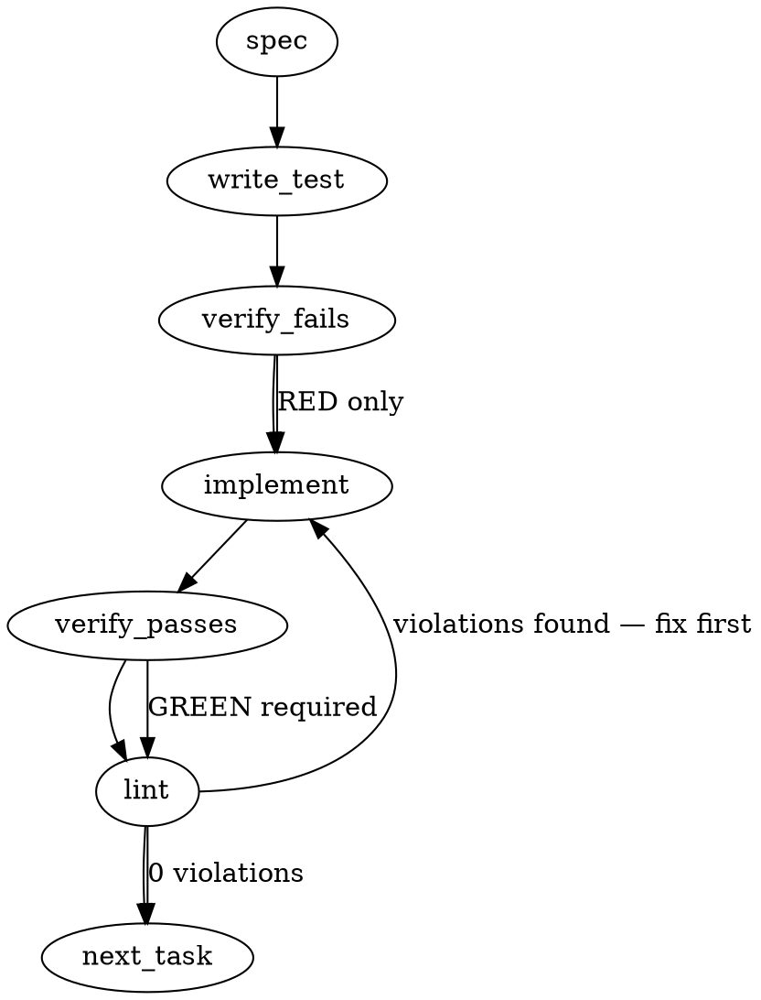

### Problem Statement
The `totem spec` command currently allows unanchored free-text topics (which lead to context-free hallucinations/confabulations over arbitrary vector hits) and writes spec artifacts that lack clear grounding metadata. Furthermore, the pre-commit gate accepts these unanchored or empty specs because it only checks for the existence of any recent run metadata, rather than validating anchor kind and non-empty content.

### Architectural Context
* **Grounding Principles:** "‘totem spec’ writes a contract only when it is grounded; its output is one retrieval input, never the contract" and "spec-first is a ritual with a gate, not a text to obey".
* **Maturity Alignment:** Pre-commit hooks must remain highly deterministic, offline-first, and perform zero-network evaluations of git-tracked or local cache states.

### Files to Examine
* `packages/core/src/artifacts/grounding.ts` — Location where the grounding bundle schemas, `provenanceSummary` extraction, and grounding structures are defined.
* `packages/cli/src/commands/spec.ts` — Command logic for resolving issue/topic inputs, orchestrating LLM execution, and saving run metadata.
* `packages/cli/src/utils.ts` — Grounding bundle builders (e.g., `buildRetrievalGroundingBundle`) where similarity items are packaged.
* `packages/cli/src/commands/install-hooks.ts` — Code generating the `tools/pre-commit` script, including logic that parses the run artifact.
* `packages/cli/src/commands/install-hooks.test.ts` — Test coverage for the pre-commit hook generation and the spec evidence validation suite.

### Technical Approach & Contracts

#### 1. Contract Changes (Zod & Type Schemas)
Modify `packages/core/src/artifacts/grounding.ts` (and any sibling schema modules) to declare the new grounding anchor schema and update the item payload to include scores:

```typescript
import { z } from 'zod';

export const GroundingAnchorSchema = z.object({
  kind: z.enum(["issue", "record", "free-text"]),
  ref: z.string(),
  sha256: z.string().optional(), // Populated only when kind is 'record' (representing the design record file hash)
});

export type GroundingAnchor = z.infer<typeof GroundingAnchorSchema>;

export const GroundingItemSchema = z.object({
  provenance: z.string(),
  contentHash: z.string(),
  sourceType: z.string(),
  filePath: z.string(),
  score: z.number(), // Explicit similarity/retrieval score
});

// Update GroundingBundle schema to encompass anchor and item updates:
export const GroundingBundleSchema = z.object({
  anchor: GroundingAnchorSchema,
  items: z.array(GroundingItemSchema),
  provenanceSummary: z.string(),
});
```

#### 2. Input Resolution & Fallback Logic (`totem spec`)
* Add `--from <path>` to `spec` options.
* Resolve input according to these priorities:
  1. If `--from <path>` is provided: verify path exists, calculate `sha256`, and set `anchor = { kind: "record", ref: path, sha256 }`. Do not trigger draft creation or overwrite the record; bind it directly.
  2. If the input matches an issue format (issue URL, ID, or `owner/repo#ID`): set `anchor = { kind: "issue", ref: input }`.
  3. If the input is free-text / slug:
     * Query similarity hits.
     * If the highest score among retrieved hits falls below the configured floor (e.g., 0.70 / `similarity-only:8` with no high-confidence signals), exit non-zero, print a refusal showing the floor and highest hit score, and **do not write** any run artifact.
     * If hits are acceptable: set `anchor = { kind: "free-text", ref: input }`.

#### 3. Pre-Commit Hook Logic (`tools/pre-commit`)
Upgrade the Node-based JSON parser rendered in `install-hooks.ts`:
* It must read the newest JSON run artifact from `.totem/artifacts/runs/` where `admission.runMetadata.caller === "spec"`.
* Extract `grounding.anchor.kind`. Fails verification if `kind` is not `"issue"` or `"record"`.
* Inspect `output.content`. Fails verification if `output.content` is empty or lacks structural elements of a generated spec (e.g., length < 200 characters, or missing Markdown section skeleton headers like `## ` or `# `).

---

### Edge Cases & Traps
* **Backward Compatibility of Artifacts:** Older runs in checkouts won't have the `anchor` field. The hook parser must handle undefined properties gracefully, treating missing fields as "no evidence" or failing safely without throwing uncaught runtime exceptions in the git hook.
* **Refusal Generation Bypass:** A 400-token model refusal text (e.g., "I cannot write this spec because...") is technically non-empty but is invalid. The content check must enforce syntactic patterns (such as containing valid Markdown headings matching the spec command skeleton) in addition to bare character count checks.
* **Pre-commit Performance:** Parsing JSON must use synchronous, optimized filesystem functions (e.g., using `@mmnto/totem` shared helper `readJsonSafe` where applicable in test suites, and fast lightweight standard library operations in the generated shell script).

---

### Implementation Tasks

- [ ] **Task 1: Grounding Types and Schema Upgrades**
  * Modify `packages/core/src/artifacts/grounding.ts` to include `GroundingAnchorSchema`, update retrieval items to contain `score`, and integrate them into the primary grounding interfaces.
  * Update tests in `packages/core/src/artifacts/grounding.test.ts` (or matching test suite) to assert correct parsing of the new schema elements.
  > TEST DIRECTIVE: Before implementing, write a failing test named `rejects_grounding_without_anchor` that ensures serialization fails if `anchor` metadata is absent.

- [ ] **Task 2: Update Retrieval Bundling and CLI Spec Resolver**
  * Modify `packages/cli/src/utils.ts` (`buildRetrievalGroundingBundle`) to pass the similarity score down to the grounding schema.
  * In `packages/cli/src/commands/spec.ts`, update option definitions to accept `--from` and calculate SHA-256 for hand-authored design records.
  * Implement the floor-check refusal mechanism for free-text slugs when scores are insufficient, printing the exact floor and refusing to emit run artifacts.
  * Ensure `totem spec` correctly assigns and writes `grounding.anchor` inside the run artifact.

- [ ] **Task 3: Upgrade Pre-Commit Gate Evidence Check**
  * Modify `packages/cli/src/commands/install-hooks.ts` inside the generated pre-commit logic.
  * Upgrade the artifact selection logic to check that `grounding.anchor.kind` is strictly in `['issue', 'record']` AND that the output contains non-empty markdown structure (minimum 200 non-whitespace bytes containing Markdown headers).
  > TEST DIRECTIVE: Before implementing, write a failing test named `pre_commit_rejects_unanchored_and_empty_specs` verifying the hook correctly blocks commits with dummy or empty spec runs.

- [ ] **Task 4: Update Verification & Parity Tests**
  * Update `packages/cli/src/commands/install-hooks.test.ts` and `tools-hook-parity.test.ts` to mock and assert both success and failure cases of the upgraded pre-commit hook validator.
  * Verify that older run formats missing the anchor block commits as expected.

---

### Execution Flow



---

### Verification

Every implementation MUST end with these steps:
1. `totem lint` — deterministic rule check (zero LLM, ~2s). Fixes any violations.
2. `totem review` — supplementary AI lanes over the diff (~18s, advisory). Address critical findings.

---

### Test Plan

* **Unit Tests (Grounding & Validation):**
  * Assert `GroundingAnchorSchema` validates issues, records (with hashes), and correctly rejects arbitrary objects.
  * Mock low-similarity runs to verify the CLI exits non-zero, logs the hit scores vs floor, and writes no JSON artifact.
* **Integration Tests (Hook Execution):**
  * Mock `.totem/artifacts/runs/` directory states containing:
    * An unanchored free-text run.
    * An empty/one-token spec run.
    * A high-confidence issue-anchored spec run.
  * Execute the pre-commit script logic against each state, confirming only the issue/record anchored, structurally populated artifacts successfully pass the gate.