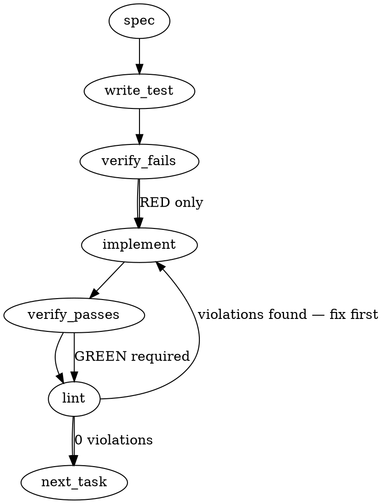

### Problem Statement

The `resolvePackCallback` function currently crashes the application by unconditionally invoking `require()` on resolved pack paths, which fails for "data-only" packs (e.g., workflow/template libraries) that intentionally omit a runtime entry point (`main`, `exports`, or `index.js`). The function needs to detect when a pack has no exported entry point and gracefully return a no-op register callback instead of throwing.

### Architectural Context

This fix directly supports the **1.26.0 Pack Ecosystem Graduation** initiative (referenced in active work and roadmap), which focuses on completing the "publishes-and-wires arc for bot packs." Data-only bot packs are a critical use case in this ecosystem, allowing non-developer authors to distribute pure rules, workflows, and templates without requiring a boilerplate TypeScript/JavaScript initialization file.

### Files to Examine

1. `packages/core/src/pack-discovery.ts` — Contains `resolvePackCallback`, the exact function requiring the structural change.
2. `packages/core/tests/pack-discovery.test.ts` (or equivalent test file) — Must be updated to simulate both code-backed and data-only packs during discovery.

### Technical Approach & Contracts

To detect a data-only pack without building a fragile, custom `package.json` parser (which would need to manually traverse `exports` maps, `main`, and default `index.js` resolution), rely on Node's native module resolution via `require.resolve()`.

1. **Resolution Probe**: Wrap `require.resolve(resolvedPath)` in a precise `try/catch` block before attempting to load the code.
2. **Error Code Detection**: If `require.resolve` throws an error with `err.code === 'MODULE_NOT_FOUND'` or `err.code === 'ERR_PACKAGE_PATH_NOT_EXPORTED'`, it signifies the pack exists on disk (already checked by the preceding `fs.existsSync`) but has no resolvable entry point.
3. **No-Op Contract**: In the catch block for the above codes, return a no-op function: `() => {}` which cleanly satisfies the `PackRegisterCallback` signature.
4. **Pass-Through Loading**: If `require.resolve` succeeds, proceed with `require(targetPath)` (or `require(resolvedPath)`) and extract the register callback as usual.

**Trade-off considered**: Using the shared helper `readJsonSafe` to inspect `package.json` vs using `require.resolve`.
_Recommendation_: Use `require.resolve`. `readJsonSafe` would require manually replicating Node's complex resolution algorithm (e.g., implicit `index.js` fallbacks, nested `exports` conditions). Node's resolver is deterministic and future-proofs against newer resolution behaviors.

### Edge Cases & Traps

- **Masking Legitimate Failures**: If you wrap the _actual_ `require()` in a broad `try/catch`, you will accidentally swallow `MODULE_NOT_FOUND` errors that originate from _inside_ the pack's code (e.g., if the pack's entry point tries to require a missing dependency). **Trap Prevention**: You MUST only wrap `require.resolve()` in the `try/catch`, ensuring any errors during code execution still bubble up normally.
- **ESM Packages**: If a pack is published as pure ESM (`"type": "module"`) with no valid `require` exports, `require()` throws `ERR_REQUIRE_ESM`. If the engine is strictly CommonJS for registration, this error should _not_ be swallowed, as it indicates a malformed code pack, not a data-only pack.

### Implementation Tasks

- [ ] **Task 1: Add failing test for data-only pack resolution**
  - Open `packages/core/tests/pack-discovery.test.ts` (or create if missing).
    > TEST DIRECTIVE: Before implementing, write a failing test named `returns no-op callback for data-only packs without an entry point` that proves the regression is caught. Mock or point to a fixture directory containing a `package.json` with no `main` and no `index.js`.
  - Add another test named `bubbles up MODULE_NOT_FOUND if pack code throws internally` to ensure we don't regress on the error masking trap.
  - write test (or update existing) → verify fails → implement (Task 2) → verify passes → lint

- [ ] **Task 2: Implement safe entry point detection in `resolvePackCallback`**
  - Open `packages/core/src/pack-discovery.ts`.
  - Locate `resolvePackCallback`.
  - Above the existing `require(resolvedPath)` call, introduce a `try/catch` using `require.resolve(resolvedPath)`.
  - Catch errors where `e.code` is `MODULE_NOT_FOUND` or `ERR_PACKAGE_PATH_NOT_EXPORTED`.
  - Return a no-op callback `() => {}` in these specific cases.
  - Re-throw the error for any other codes.
  - Change the actual requirement to use the successfully resolved path (or leave as `resolvedPath` since it's known safe now).
  - write test (or update existing) → verify fails → implement → verify passes → lint

### Execution Flow (structural constraint)

### Verification (MANDATORY — do not skip)

Every implementation MUST end with these steps:

1. `totem lint` — deterministic rule check (zero LLM, ~2s). Fixes any violations.
2. `totem review` — AI-powered architectural review (~18s). Addresses any critical findings.
3. If using MCP, call `verify_execution` to confirm compliance before declaring the task done.

### Test Plan

1. **Valid Code Pack**: Verify a pack with a valid `main` script and a `register` function loads and executes properly.
2. **Data-Only Pack**: Verify a pack directory containing only a `workflows/` directory (no `index.js`, no `main` field) correctly returns a `() => {}` no-op function and does not crash discovery.
3. **Internal Missing Dependency (Masking Check)**: Verify a pack that _does_ have a valid entry point, but whose entry point contains `require('./this-file-does-not-exist.js')`, continues to throw a `MODULE_NOT_FOUND` error. This asserts the `try/catch` block is sufficiently tight.

---

## Implementation Design

### Scope

**Will:** restore loading of data-only packs (workflows + templates only, no `main`/`exports`/`register.*`) by detecting "no entry point" via `require.resolve` probe and returning a no-op `PackRegisterCallback`. Single-site change in `resolvePackCallback` at `packages/core/src/pack-discovery.ts:372`. Add tests covering the data-only path + masking-check + ESM-still-throws regression. Ship as 1.30.1 patch.

**Will NOT:** introduce a `packType: "data"` field on `package.json` (065 Option 2 deferred — explicit declaration is cheaper to add later if auto-detect proves insufficient); amend ADR-097 § 5 Q5 in this PR (tracked as a follow-up if the new archetype warrants formal documentation); introduce `installed-packs.json` schema changes; change `mmnto-ai/totem#1771` ESM-pack scope; alter `pack-manifest-writer.ts` discovery logic.

### Data model deltas

**No new types or fields.** `LoadedPack`, `InstalledPacksManifestSchema`, and `PackRegisterCallback` are unchanged. The data-only case is detected at runtime in `resolvePackCallback` and produces an inline `() => {}` no-op closure — no persisted state.

The change is purely behavioral inside one function. No collision hazards (no reserved keys, no sentinel values).

### State lifecycle

No new state. The detection runs once per pack at boot time, inside `resolvePackCallback`, before the engine seal. The no-op callback closure is captured by `loadInstalledPacks`'s registration loop, invoked once with `PackRegistrationAPI`, returns void, and is discarded. Identical lifecycle to a code-pack callback that registers nothing.

### Failure modes

| Failure                                                                                                           | Category | Agent-facing surface                          | Recovery                                                                         |
| ----------------------------------------------------------------------------------------------------------------- | -------- | --------------------------------------------- | -------------------------------------------------------------------------------- |
| `require.resolve(resolvedPath)` throws `MODULE_NOT_FOUND` (no `main`/`exports`/`index.js`)                        | runtime  | silent success — return `() => {}` no-op      | none needed; data-only pack is the intended shape                                |
| `require.resolve(resolvedPath)` throws `ERR_PACKAGE_PATH_NOT_EXPORTED` (`type:module` with no matching `exports`) | runtime  | silent success — return `() => {}` no-op      | none needed; same case as above for ESM packs that intentionally export no entry |
| `require.resolve` throws any other code (e.g., resolver-internal failure)                                         | runtime  | hard error (re-throw with same wrap as today) | re-install pack / re-run `totem sync`                                            |
| `require(resolvedPath)` throws `ERR_REQUIRE_ESM` (after resolve succeeded — pack ships ESM-only entry)            | runtime  | hard error (existing wrap)                    | pack must ship CJS-compatible register entry per `mmnto-ai/totem#1771`           |
| `require(resolvedPath)` throws any other error (e.g., pack code throws on import)                                 | runtime  | hard error (existing wrap)                    | fix the pack                                                                     |
| Resolved module exports neither `default` nor named `register` of type function                                   | runtime  | hard error (existing path)                    | pack must export a registration callback per ADR-097 § 5 Q5                      |

**Tenet 4 (Fail Loud) consideration:** The new "silent success" rows are NOT a Fail-Loud violation because the data-only pack is doing exactly what it's structurally designed to do — provide workflows + templates with no boot-time registration. The pack's content is consumed by other surfaces (session-start hooks, `totem describe`, future bot-hook wiring per `mmnto-ai/totem#1672`) which fail loud independently if those consumers are missing what they need.

**Bounded soft regression:** A code pack that forgot to ship its built `dist/register.cjs` would now silently no-op instead of throwing. Mitigated by: (a) pack publish flow runs `npm pack`/`pnpm publish` which surfaces missing files at publish-time; (b) consumers running `totem lesson compile` after install will notice rules don't fire (a pre-existing detection vector); (c) `mmnto-ai/totem#1771` ESM lift would add explicit packType declaration as a hardening follow-up. Not blocking 1.30.1.

### Invariants to lock in via tests

1. **Data-only pack returns no-op callback, no throw.** A pack on disk with `package.json` containing only `{name, files: ['workflows']}` (no `main`, no `exports`, no `register.*`) loads successfully. `loadInstalledPacks` returns `[pack]` with `engineSealed === true`. The pack's callback executes without error and registers nothing.
2. **MODULE_NOT_FOUND inside pack code is NOT swallowed.** A pack with a valid `main: "./register.cjs"` whose `register.cjs` contains `require('./does-not-exist')` throws — the `MODULE_NOT_FOUND` originates inside `require()`, not `require.resolve`, so the existing wrap fires. Asserts the new `try/catch` is scoped to `require.resolve` only.
3. **ERR_REQUIRE_ESM still surfaces loud.** A pack with a `package.json` `main: "./register.mjs"` (pure ESM entry) still throws `ERR_REQUIRE_ESM` per ADR-097 § 5 Q5 + `mmnto-ai/totem#1771`. The `try/catch` for `require.resolve` does NOT swallow this code.
4. **Existing "missing callback shape" guard fires for code packs that resolve but export wrong shape.** A pack with `main: "./register.cjs"` that `module.exports = {}` (no default, no `register` function) still throws "did not export a registration callback." The new code path doesn't bypass the shape check — only the no-resolution case returns no-op.
5. **Behavioral equivalence to LC consumer scenario.** A pack matching the `@mmnto/pack-bot-coderabbit@0.2.0` shape (`type: module`, `files: ["workflows", "templates"]`, no `main`, no `exports`) loads successfully. This is the regression-reproduction test.

### Open questions

1. **Question:** Should the data-only no-op log a debug-level message on registration so operators can see "data-only pack X registered with no callbacks" in verbose mode?
   - **Options:**
     - Add `process.env.TOTEM_DEBUG`-gated `console.error` line emitting `[pack-discovery] '${name}' registered as data-only (no entry point)` from inside `resolvePackCallback`.
     - Skip — keep the no-op silent; data-only is the intended steady state.
   - **Recommendation:** Skip in 1.30.1. If observability turns out to be needed, add it as a separate hardening PR with proper `TOTEM_DEBUG` plumbing alongside other diagnostic instrumentation.

2. **Question:** Should we file an ADR-097 amendment ticket as a follow-up to formally document the third pack archetype (data-only)?
   - **Options:**
     - File now (Tier-3) for traceability — ADR-097 § 5 Q5 currently only describes code packs.
     - Defer until the next pack-archetype design call surfaces (e.g., `mmnto-ai/totem#1771` ESM lift may want to amend § 5 Q5 anyway).
   - **Recommendation:** File Tier-3 follow-up after 1.30.1 ships. Cheap to write while context is fresh; documentation lag is its own kind of substrate decay.

3. **Question:** Use `require.resolve` (Gemini spec recommendation) vs read `package.json` and check for `main`/`exports`/`register.*` presence directly?
   - **Options:**
     - `require.resolve` probe — delegates to Node's resolution algorithm; future-proofs against new resolution rules.
     - Direct `package.json` inspection — more explicit; readable; no try/catch on a thrown-error happy path.
   - **Recommendation:** `require.resolve` probe per Gemini's analysis. Reasoning: Node's resolver handles implicit `index.js`, `exports` conditions, conditional `import`/`require` keys correctly. Hand-rolled inspection would need to replicate that complexity and would drift as Node's resolver evolves. The throw-as-control-flow pattern is acceptable here because (a) it's bounded to one site, (b) the alternative is provably more fragile, (c) error-code branching makes intent clear.
