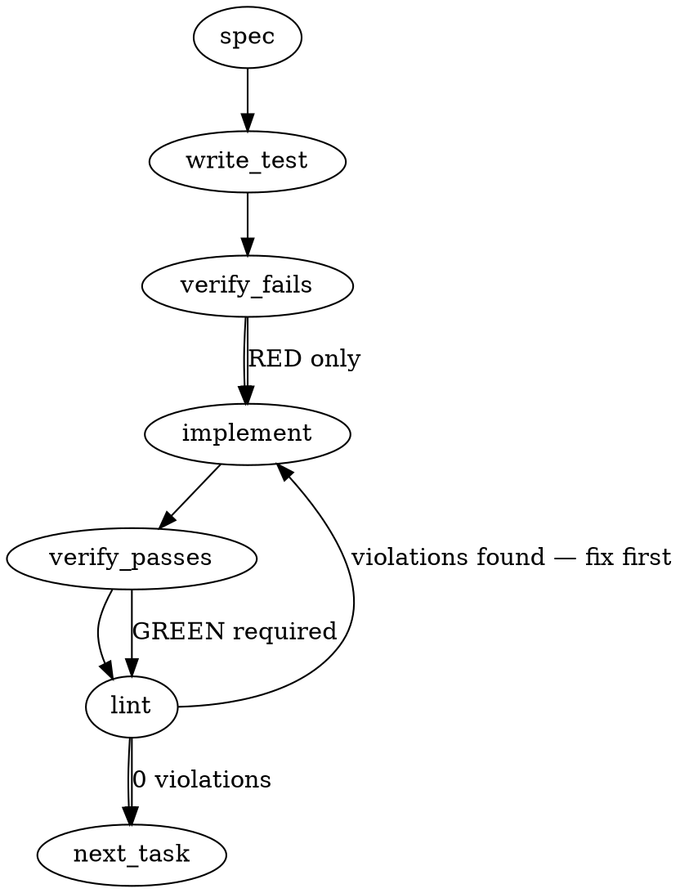

### Problem Statement

The process of authoring new Totem proposals and Architecture Decision Records (ADRs) requires tribal knowledge regarding file naming conventions, boilerplate template structures, and post-creation dashboard updates. This feature introduces `totem proposal new` and `totem adr new` commands to automatically scaffold correctly numbered files, apply templates, and execute `docs:inject` to ensure dashboard indices never fall out of sync.

### Architectural Context

This enhancement follows the structural prevention pattern established in #1285 (wind tunnel SHA hook ordering): rather than catching stale dashboards after the fact (via pre-push hooks), the system enforces consistency by integrating the dashboard generation directly into the authoring workflow. It mirrors the existing `totem lesson add` workflow.

### Files to Examine

1. `packages/cli/src/commands/docs.ts` — Examine for existing command setup patterns and imports.
2. `packages/cli/src/index.ts` (or equivalent CLI router) — To see where new top-level commands (`proposal`, `adr`) must be registered.

### Technical Approach & Contracts

1. **Directory Resolution**: The command must identify whether it is running in a main Totem repository (where files live in `.strategy/proposals/active` and `.strategy/adr`) or standalone in the strategy repository (`proposals/active` and `adr`). It will use the `resolveGitRoot` shared helper to anchor these checks.
2. **Auto-Increment Logic**: Scan the resolved target directory for files matching `^(\d{3})-(.+)\.md$`. Parse the prefixes to integers, find the maximum, and add 1 (zero-padded to 3 digits). If no files exist, start at `001`.
3. **Template Resolution**: Look for `.strategy/templates/proposal.md` (or `adr.md`). If missing, fall back to a hardcoded string template containing standard frontmatter (Status, Author, Date, Milestone) and structural headers.
4. **Execution Sequence**:
   - Resolve target path and next ID.
   - Kebab-case the user-provided title to form the filename: `NNN-kebab-title.md`.
   - Read template and inject standard variables (e.g., replace `{{TITLE}}` with the raw title, `{{DATE}}` with `YYYY-MM-DD`).
   - Write the file.
   - Run the injection script using `safeExec('npm', ['run', 'docs:inject'])` (or preferred package manager equivalent).
   - Stage the newly created file and the updated dashboard files (typically `README.md`) using `safeExec('git', ['add', ...])`. Stop short of committing to fulfill the "not committed without user confirmation" AC.

**Data Contracts:**

```typescript
interface ScaffoldOptions {
  type: 'proposal' | 'adr';
  title: string;
  cwd: string;
}

interface GovernancePaths {
  targetDir: string;
  templatePath: string;
}
```

### Edge Cases & Traps

- **Missing `docs:inject` Script**: If the user's repository does not have a `docs:inject` script defined, `safeExec` will throw. The command must catch this specifically, emit a warning, but successfully complete the scaffolding.
- **Gap Numbering**: If the directory contains `001-a.md` and `003-b.md`, the next number must be `004`, not `003`. Simply counting array length is a trap; explicit `Math.max` on parsed prefixes is required.
- **Title Sanitization**: Titles with special characters (e.g., `LLM caching (v2) / Verifier`) must be safely transformed into valid git filenames (e.g., `llm-caching-v2-verifier`).
- **Unstaged Working Tree**: Running `docs:inject` might modify `README.md`. When executing `git add`, only stage the exact generated proposal file and specifically `README.md` to avoid accidentally staging unrelated working tree changes.

### Implementation Tasks

- [ ] **Task 1: Build Git Path & Directory Resolver**
  - Create/Update `packages/cli/src/utils/governance.ts`.
  - Implement a `resolveGovernancePaths(cwd: string, type: 'proposal' | 'adr')` utility using `resolveGitRoot`.
  - Check for existence of the `.strategy/` prefix vs root-level structural folders to support both standalone and submodule contexts.
    > TEST DIRECTIVE: Before implementing, write a failing test named `resolves standalone strategy path when submodule prefix is missing` that proves context-aware path resolution works.
  - write test → verify fails → implement → verify passes → lint

- [ ] **Task 2: Implement Auto-Increment and Name Sanitization**
  - Implement a `getNextArtifactId(targetDir: string)` utility that reads the directory and computes the next 3-digit padded number.
  - Implement a `formatArtifactFilename(id: string, title: string)` utility.
    > TEST DIRECTIVE: Before implementing, write a failing test named `calculates correct next id when numerical gaps exist in directory` that proves gap-handling logic.
  - write test → verify fails → implement → verify passes → lint

- [ ] **Task 3: Template Generation Engine**
  - Implement the template reader: check `templates/` dir first, falling back to a hardcoded minimal default markdown schema.
  - Implement variable replacement for `{{TITLE}}`, `{{DATE}}`, and `{{AUTHOR}}`. (For MVP author, "Totem CLI" or an empty prompt is acceptable if git config lookup is complex).
    > TEST DIRECTIVE: Before implementing, write a failing test named `generates fallback template when physical template file is missing`.
  - write test → verify fails → implement → verify passes → lint

- [ ] **Task 4: Post-Scaffold Hook Orchestration**
  - Create a runner utility for post-generation hooks using `safeExec`.
  - Attempt to execute `npm run docs:inject` in the git root. Catch errors and warn gracefully instead of crashing.
  - Execute `git add <new-file-path> README.md` to stage changes.
    > TEST DIRECTIVE: Before implementing, write a failing test named `stages artifact and readme without crashing if docs:inject fails`.
  - write test → verify fails → implement → verify passes → lint

- [ ] **Task 5: CLI Command Wiring**
  - Create `packages/cli/src/commands/proposal.ts` and `packages/cli/src/commands/adr.ts`.
  - Register `totem proposal new <title>` and `totem adr new <title>`.
  - Wire them to invoke the orchestrator from Tasks 1-4.
  - Add standard user-facing console output (e.g., "Scaffolded 219-title.md. Dashboard updated and staged.").
  - write test → verify fails → implement → verify passes → lint

### Execution Flow (structural constraint)



### Verification (MANDATORY — do not skip)

Every implementation MUST end with these steps:

1. `totem lint` — deterministic rule check (zero LLM, ~2s). Fixes any violations.
2. `totem review` — AI-powered architectural review (~18s). Addresses any critical findings.
3. If using MCP, call `verify_execution` to confirm compliance before declaring the task done.

### Test Plan

- **Happy Path (Proposal):** Run `totem proposal new "Feature Branch Workflow"`. Assert that `proposals/active/001-feature-branch-workflow.md` is created, `docs:inject` is called, and the file is staged.
- **Happy Path (ADR):** Run `totem adr new "Database Sharding"`. Assert `adr/001-database-sharding.md` is created.
- **Gap Numbering:** Seed directory with `001-alpha.md` and `004-beta.md`. Run command. Assert `005-charlie.md` is created (verifying gap logic).
- **Graceful Degradation:** Run command in a repository without `docs:inject` configured in `package.json`. Assert the markdown file is still successfully created, numbered, and staged, with a warning log emitted regarding the skipped hook.

---

## Implementation Design

### Scope

Ship `totem proposal new <title>` and `totem adr new <title>` scaffolding commands that write the next NNN-numbered artifact under `.strategy/proposals/active/` or `.strategy/adr/`, fill the template with Status/Date frontmatter matching ADR-091's convention, run `pnpm run docs:inject` to refresh the dashboard, and stage (not commit) the new file plus updated README.md.

Does NOT cover: `list` / `status` / `promote` subcommands, PR-opening integration, `--from-outline` LLM-assisted drafting, or cross-repo discovery flags. All explicitly deferred per the ticket's own "Deferred to 1.15.0+" section.

### Data model deltas

Two new types in `packages/cli/src/utils/governance.ts` (new file):

- **`ScaffoldOptions`** = `{ type: 'proposal' | 'adr'; title: string; cwd: string }`
  - Holds: command invocation args.
  - Written by: command entry point (`proposal.ts`, `adr.ts`).
  - Read by: `scaffoldGovernanceArtifact()`.
  - Invariants: `type` is one of two literals; `title` is a non-empty string; `cwd` is absolute (resolved from `process.cwd()`).

- **`GovernancePaths`** = `{ rootDir: string; targetDir: string; templatePath: string; dashboardFile: string }`
  - Holds: resolved filesystem paths for this invocation.
  - Written by: `resolveGovernancePaths()`.
  - Read by: scaffolding engine.
  - Invariants: `rootDir` is either `<totem>/.strategy/` (submodule case) or `<cwd>` itself (standalone strategy repo case); `targetDir` is `<rootDir>/proposals/active` or `<rootDir>/adr`; `templatePath` may not exist on disk (fallback handled); `dashboardFile` is `<rootDir>/README.md`.

No module-level state. No reserved keys or sentinel values. Template defaults are hardcoded exported string constants (`DEFAULT_PROPOSAL_TEMPLATE`, `DEFAULT_ADR_TEMPLATE`) to guarantee the heading convention matches ADR-091 (`# ADR NNN: Title` with a space separator, not a hyphen).

### State lifecycle

No persistent or long-lived state. Each command invocation:

- Creates one markdown file.
- Mutates `README.md` indirectly via `docs:inject`.
- Mutates git index via `git add` on the two specific paths.
- Owns all mutations within the command function; no shared module state.

No state crosses lifecycle boundaries. One-shot, per-invocation scope throughout.

### Failure modes

| Failure                                                                               | Category  | Agent-facing surface                                                            | Recovery                         |
| ------------------------------------------------------------------------------------- | --------- | ------------------------------------------------------------------------------- | -------------------------------- |
| `cwd` not inside a git repo                                                           | init      | hard error (`TotemError` with hint)                                             | user navigates into a repo       |
| Strategy dir not found (no `.strategy/` submodule AND no standalone `proposals/` dir) | init      | hard error with hint                                                            | user clones or links strategy    |
| Target dir not writable                                                               | permanent | hard error                                                                      | user fixes permissions           |
| Template file exists but malformed (missing `{{TITLE}}`)                              | runtime   | warning, continue with unreplaced variables visible in output file              | user fixes template              |
| Directory has non-NNN-prefixed files mixed in                                         | runtime   | silent (regex-filtered)                                                         | none needed                      |
| Next-number overflow (>999)                                                           | permanent | hard error "NNN-prefix format saturated"                                        | unreachable in practice          |
| `docs:inject` script missing from `package.json`                                      | transient | warning "dashboard not refreshed; run manually" + exit 0                        | user runs `pnpm run docs:inject` |
| `docs:inject` exits non-zero                                                          | runtime   | warning + stderr forwarded + exit 0 (file created)                              | user debugs script               |
| `git add` fails                                                                       | runtime   | warning "file created but not staged" + exit 0                                  | user runs `git add` manually     |
| Title sanitization produces empty slug (all-special-char title)                       | runtime   | hard error "title must contain at least one alphanumeric char" (loud, pre-disk) | user provides valid title        |
| Exact filename collision (same title re-run)                                          | permanent | hard error "file already exists at <path>"                                      | user chooses different title     |

Two "silent degradation" rows for `docs:inject` failure and `git add` failure, both justified against Tenet 4: the primary action (file creation) succeeded, so the scaffolded artifact is on disk and visible to the user; secondary regen/stage steps warn-loud via stderr so the user knows they need manual follow-up. Failing the whole command in that case would strand a file on disk with no feedback, which is a worse failure mode.

### Invariants to lock in via tests

- Next-ID computation respects gaps: `001-a.md` + `003-b.md` yields `004`, never `002` or `003`.
- Filename kebab-case is deterministic: same title string produces same kebab slug across runs.
- ADR heading emits as `# ADR NNN: Title` (space separator, matches ADR-091 exactly).
- Proposal heading emits as `# Proposal NNN: Title`.
- Status line defaults to `**Status:** Draft`.
- Date line defaults to today in ISO `YYYY-MM-DD`.
- `docs:inject` absence does not prevent file creation (warn-and-continue path).
- `git add` failure does not prevent file creation.
- `git add` stages only the new file plus README.md, never `-A` or `.` (per lesson-8067935e and lesson-4a01b498).
- Strategy dir resolution covers both submodule case (`<totem>/.strategy/`) and standalone case (`<cwd>`).
- Title with empty post-sanitization slug throws loud error BEFORE touching disk.
- Exact filename collision on retry throws loud error without overwriting.

### Open questions

- **Question:** Package manager for `docs:inject` invocation — spec says `npm run docs:inject`, but CLAUDE.md mandates pnpm-only for this repo.
  - **Options:** (a) hardcode `pnpm run docs:inject`; (b) detect `packageManager` field in strategy `package.json`; (c) universal `npm run` fallback.
  - **Recommendation:** (a) hardcode `pnpm`. Matches CLAUDE.md. Strategy repo already uses pnpm (`pnpm-lock.yaml` present).

- **Question:** Template variable set for MVP — just `{{TITLE}}` + `{{DATE}}`, or include `{{AUTHOR}}` / `{{MILESTONE}}`?
  - **Options:** (a) MVP = `{{TITLE}}` + `{{DATE}}` only; (b) add `{{AUTHOR}}` via `git config user.name` lookup; (c) add `{{MILESTONE}}` interactive prompt.
  - **Recommendation:** (a). Matches the ticket's "Minimum viable" framing. `{{AUTHOR}}` adds a git-config-missing failure path; `{{MILESTONE}}` is explicitly deferred in the ticket body.

- **Question:** Collision behavior when the exact filename already exists (same title re-run).
  - **Options:** (a) refuse with hard error (safest); (b) auto-bump to next NNN (already possible via gap logic but user intent is unclear); (c) support `--force` overwrite.
  - **Recommendation:** (a). The auto-increment already handles "same title, next number" if the user actually wants a new artifact by re-running. Refusing collision protects against accidental overwrite of in-progress work. `--force` deferred to a later patch.

- **Question:** Should the command support a `--no-stage` flag for users who want the file but not the git-index mutation?
  - **Options:** (a) always stage (per spec); (b) add `--no-stage` for MVP; (c) defer the flag.
  - **Recommendation:** (c) defer. The ticket AC is explicit: "New file is staged in git (but not committed without user confirmation)". If a user wants the file without staging, they can `git reset HEAD <file>` post-hoc. Keep MVP scope tight.
