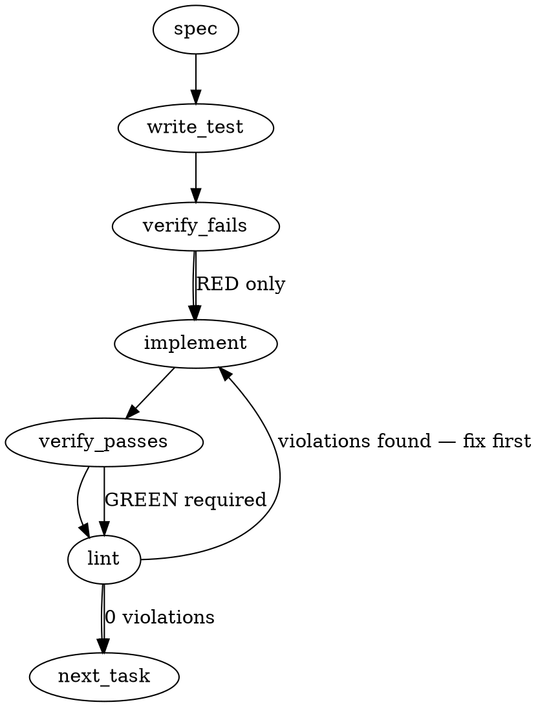

### Problem Statement

The `packages/core/src/rule-engine.ts` module uses top-level mutable variables (`coreLogger`, `shieldContextDeprecationWarned`) to track logging configuration and deprecation warnings. This breaks functional isolation during concurrent rule evaluations or federated searches, causing race conditions where one rule's execution state bleeds into another.

### Architectural Context

This fix addresses a Tier-1 bug surfaced during the pre-1.15-review Gemini audit (Finding #3). As Totem moves towards the 1.15.0 "Distribution Pipeline" and Pack Ecosystem, functional isolation of the AST linting phase is paramount. Federated packs running through the same engine must not share state, as cross-pack state leakage is a structural trust violation.

### Files to Examine

1. `packages/core/src/rule-engine.ts` — Contains the mutable module-level state (`let coreLogger`, `let shieldContextDeprecationWarned`) and the configuration exports to remove.
2. `packages/core/src/__tests__/rule-engine.test.ts` — Will contain tests relying on `setCoreLogger` and `resetShieldContextWarning` that need to be rewritten.

### Technical Approach & Contracts

We will remove module-scoped mutable state and replace it with a per-call execution context.

**Contract Changes:**
Introduce a new interface for execution context in `packages/core/src/rule-engine.ts`:

```typescript
export interface CoreLogger {
  warn: (msg: string) => void;
  // ... any other existing methods
}

export interface RuleEngineContext {
  logger: CoreLogger;
  state: {
    hasWarnedShieldContext: boolean;
  };
}
```

**Implementation Steps:**

1. Delete `let shieldContextDeprecationWarned`, `let coreLogger`, `export function setCoreLogger`, and `export function resetShieldContextWarning`.
2. Update the signature of `applyAstRulesToAdditions` (and any other entry points) to accept `RuleEngineContext` as an explicit, required parameter.
3. Update internal helper functions like `warnShieldContextDeprecation` to accept `RuleEngineContext` and use `ctx.state.hasWarnedShieldContext` to prevent duplicate warnings _per execution_, rather than globally.
4. Refactor all calling code (in tests and potentially in the CLI package) to instantiate and pass down the `RuleEngineContext` object instead of calling `setCoreLogger`.

### Edge Cases & Traps

- **Cross-Package Breaking Changes:** Removing `setCoreLogger` is an internal API break. You must search the entire monorepo (`packages/cli`, `packages/mcp`) for `setCoreLogger` and update them to pass the logger via the new context parameter.
- **Optional Parameter Trap:** Do _not_ make `RuleEngineContext` optional with a fallback to `console`. By making it strictly required, TypeScript will force you to update all call sites, guaranteeing no blind spots are left.
- **Test Setup Bleed:** Existing tests likely rely on `resetShieldContextWarning()` in `afterEach` blocks. These hooks should be removed, and tests should instantiate fresh mock loggers and contexts per test case.

### Implementation Tasks

- [ ] **Task 1: Define RuleEngineContext and Remove Global State**
  - **Files:** `packages/core/src/rule-engine.ts`, `packages/core/src/__tests__/rule-engine.test.ts`
    > TEST DIRECTIVE: Before implementing, write a failing test named `isolates warning state across distinct rule engine executions` in `rule-engine.test.ts` that provides two separate context objects to two sequential calls, asserting that the logger's `warn` method is invoked on _both_ mock loggers (proving the state is no longer globally shared).
  - Define the `RuleEngineContext` interface.
  - Delete `shieldContextDeprecationWarned`, `coreLogger`, `setCoreLogger`, and `resetShieldContextWarning` from `rule-engine.ts`.
  - Update `warnShieldContextDeprecation` to accept `ctx: RuleEngineContext`.
  - write test → verify fails → implement → verify passes → lint

- [ ] **Task 2: Inject Context into Entry Points**
  - **Files:** `packages/core/src/rule-engine.ts`
  - Modify `applyAstRulesToAdditions` (and any other exported linting entry points in this file) to require a `ctx: RuleEngineContext` parameter.
  - Plumb the `ctx` object through to `warnShieldContextDeprecation` and any logger invocations.
  - write test (or update existing) → verify fails → implement → verify passes → lint

- [ ] **Task 3: Refactor Core Tests**
  - **Files:** `packages/core/src/__tests__/rule-engine.test.ts` (and any other core test file that fails to compile)
  - Remove all `beforeEach`/`afterEach` calls to `setCoreLogger` and `resetShieldContextWarning`.
  - Update all calls to `applyAstRulesToAdditions` in tests to inline a mock `RuleEngineContext`: `{ logger: mockLogger, state: { hasWarnedShieldContext: false } }`.
  - write test (or update existing) → verify fails → implement → verify passes → lint

- [ ] **Task 4: Fix Cross-Package Consumers**
  - **Files:** Grep for `setCoreLogger` across `packages/cli` and `packages/mcp`
  - Update CLI/MCP commands that previously called `setCoreLogger(logger)`.
  - Have them pass `{ logger, state: { hasWarnedShieldContext: false } }` down into `applyAstRulesToAdditions`.
  - write test (or update existing) → verify fails → implement → verify passes → lint

### Execution Flow (structural constraint)



### Verification (MANDATORY — do not skip)

Every implementation MUST end with these steps:

1. `totem lint` — deterministic rule check (zero LLM, ~2s). Fixes any violations.
2. `totem review` — AI-powered architectural review (~18s). Addresses any critical findings.
3. If using MCP, call `verify_execution` to confirm compliance before declaring the task done.

### Test Plan

- **Concurrency Isolation Test:** Trigger two instances of rule evaluations sequentially (or concurrently via `Promise.all`) using distinct `RuleEngineContext` objects containing different mock loggers. Assert that both mock loggers receive the deprecated warning exactly once.
- **Type Safety Validation:** Ensure running `tsc --noEmit` across the monorepo passes, proving no rogue calls to `setCoreLogger` or missing context arguments exist in `packages/cli` or `packages/mcp`.

---

## Implementation Design

### Scope (2 sentences)

Replace module-level `coreLogger` and `shieldContextDeprecationWarned` state in `rule-engine.ts` with a required `RuleEngineContext` threaded through every public entry point that can reach the legacy `shield-context:` deprecation path. Does NOT change violation detection semantics, rule-event observability, the `CoreLogger` interface shape, or the warning message text — this is a plumbing change, not a feature.

### Data model deltas

**New type — `RuleEngineContext`** (exported from `rule-engine.ts`):

```typescript
export interface RuleEngineContext {
  logger: CoreLogger;
  state: { hasWarnedShieldContext: boolean };
}
```

- **Holds:** the logger to call on deprecation + a single mutable flag.
- **Written by:** `warnShieldContextDeprecation(ctx)` flips the flag on first call within a ctx lifetime.
- **Read by:** `warnShieldContextDeprecation(ctx)` gates on the flag.
- **Invariant:** callers own ctx lifetime. Within one ctx, `logger.warn` for the legacy directive fires at most once. Across distinct ctx instances, warnings are independent.
- **No reserved keys / sentinels.** Two named fields, both required.

**Removed surface (breaking):**

- `export function setCoreLogger(logger: CoreLogger): void` — gone.
- `export function resetShieldContextWarning(): void` — gone (was `@internal`).
- Module-level `let coreLogger`, `let shieldContextDeprecationWarned` — gone.

**Modified signatures (breaking; all require `ctx: RuleEngineContext` as first param — TS1016 forbids required-after-optional, and several signatures end with `onRuleEvent?`):**

| Function                                                        | Status                          |
| --------------------------------------------------------------- | ------------------------------- |
| `applyRulesToAdditions(ctx, rules, additions, onRuleEvent?)`    | exported, regex path            |
| `applyAstRulesToAdditions(ctx, rules, additions, onRuleEvent?)` | exported, ast path              |
| `applyRules(ctx, rules, diff, excludeFiles?)`                   | exported, convenience wrapper   |
| `extractJustification(ctx, line, precedingLine)`                | exported, reachable legacy path |

Internal helpers (`hasContextDirective`, `matchContextDirective`, `warnShieldContextDeprecation`, `isSuppressed`) also take `ctx` but stay private — not part of the public break.

### State lifecycle

- **Scope:** per-call. Caller instantiates `{ logger, state: { hasWarnedShieldContext: false } }` once per linting invocation.
- **Lifetime:** created before the first `applyRules*` / `extractJustification` call, mutated in place as the engine processes additions, discarded when the linting invocation returns.
- **Ownership:** `run-compiled-rules.ts` owns ctx creation in the CLI path; tests own ctx creation per `it` block.
- **No cross-boundary leak.** ctx never escapes the stack of the public entry point.

### Failure modes

| Failure                                                | Category | Agent-facing surface                                                                                                        | Recovery                           |
| ------------------------------------------------------ | -------- | --------------------------------------------------------------------------------------------------------------------------- | ---------------------------------- |
| Caller forgets `ctx` arg                               | init     | hard TypeScript compile error                                                                                               | fix callsite                       |
| Caller passes shared ctx across concurrent invocations | runtime  | warning suppression behaves per-ctx (degraded but not wrong — flag still flips atomically in JS single-threaded event loop) | document: one ctx per invocation   |
| Logger throws inside `warn`                            | runtime  | exception propagates out of `applyRules*`                                                                                   | caller wraps; no change from today |
| Legacy `shield-context:` directive appears             | runtime  | one warning per ctx, flag latches                                                                                           | by design                          |

No silent-degradation rows. Every failure surface is hard-fail.

### Invariants to lock in via tests

1. Two distinct ctx instances threaded through sequential `applyRulesToAdditions` calls each observe their own deprecation warning exactly once (concurrency isolation — the headline invariant from the ticket).
2. One ctx reused across two sequential legacy-directive hits emits `logger.warn` exactly once (flag-latching semantics preserved from pre-refactor behavior).
3. `extractJustification(..., ctx)` with a legacy directive flips `ctx.state.hasWarnedShieldContext` and calls `ctx.logger.warn`.
4. Deleting `setCoreLogger` / `resetShieldContextWarning` from `index.ts` + `compiler.ts` barrel exports does not orphan any other caller (monorepo-wide `tsc --noEmit` clean).
5. `run-compiled-rules.ts` no longer calls `setCoreLogger`; it constructs ctx once and threads it into `applyRules` / `applyAstRulesToAdditions`.

### Resolved questions

- **Position of `ctx`:** **First param** across all four signatures. TypeScript forbids required-after-optional (TS1016), and `applyRulesToAdditions` + `applyAstRulesToAdditions` already end with `onRuleEvent?`. Options-object ceremony would add weight for a single extra required field. DI-style first-position context injection wins.
- **`applyRules` `excludeFiles?`:** Stays optional. Out of scope.
- **Barrel re-exports:** Yes — `RuleEngineContext` re-exported from `compiler.ts` and `index.ts`, matching the existing `CoreLogger` pattern.
