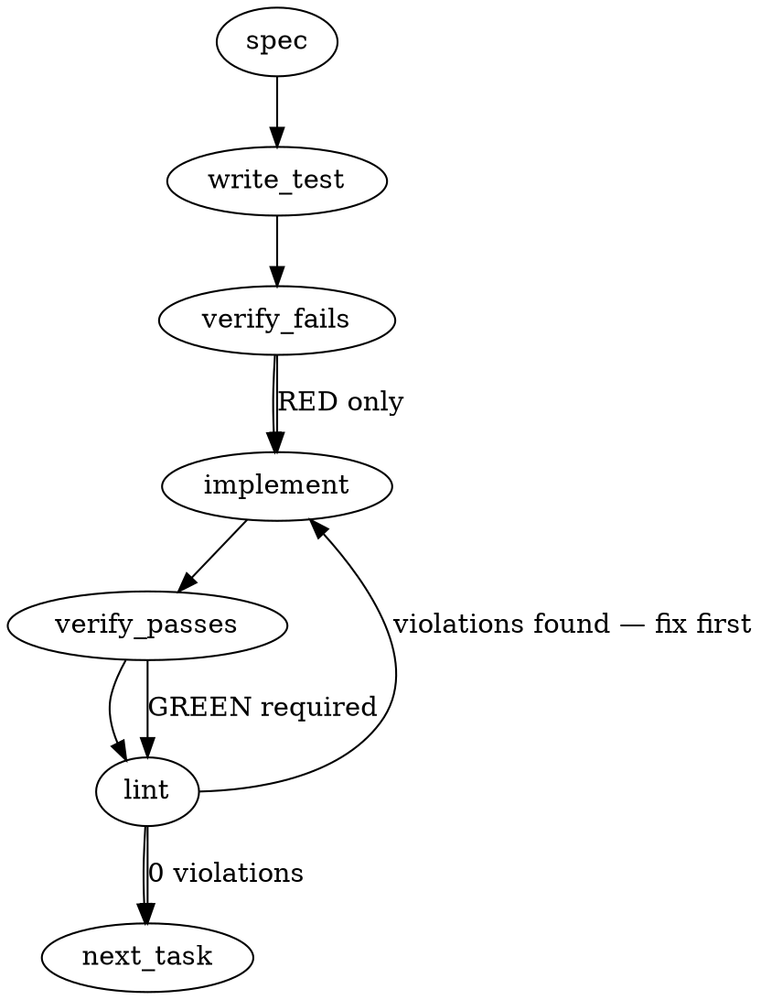

### Problem Statement

Claude Code's auto-compaction feature can trigger mid-work and clear active context, leading to hallucinated line numbers and lost momentum. We must implement a mechanical `PreCompact` bash script hook that forces a state-snapshot (branch, commit, modified files) to disk before compaction, strictly ensuring the hook never returns an exit code of `2` to avoid blocking the compaction process.

### Architectural Context

- **Anti-Pattern Acknowledged**: As noted in the `cloud-compile` lesson, performing LLM calls in local hooks introduces latency, API failures, and possible hangs. The solution must strictly adhere to **Option A (mechanical only)**—no LLM calls are permitted in the hook script.
- **Consumer Hooks Out of Scope**: Per the issue, do _not_ update `packages/cli/src/commands/init.ts` (`scaffoldClaudeHooks`) to scaffold this for consumers. This is scoped strictly to the current repository's internal Claude Code configuration.

### Files to Examine

1. `scripts/pre-compact.sh` (to be created) — The mechanical signoff hook implementation.
2. `.claude/settings.json` — The Claude config file where the `PreCompact` hook must be registered.
3. `packages/cli/src/commands/init.ts` — Read to understand existing hook scaffolding, but _do not modify_ (consumer parity is out of scope).

### Technical Approach & Contracts

**1. Hook Implementation (`scripts/pre-compact.sh`)**

- Create a pure Bash script to minimize overhead.
- **Trap Contract**: The script must use an `EXIT` trap to coerce any failing exit code (especially `2`, which Bash often uses for syntax errors and Claude Code uses to block) to `1`.
- **Artifact Contract**: Write a markdown snapshot to `.totem/cache/.pre-compact-signoff-<timestamp>.md`. It must contain:
  - Timestamp (ISO 8601 or Unix epoch)
  - Branch name (`git branch --show-current`)
  - HEAD SHA (`git rev-parse HEAD`)
  - Changed files (`git status --short`)
- If `.totem/cache` does not exist, the script must create it.
- If the directory is unwritable or git is unavailable, the script must safely error out (exit code `1`), dumping a warning to `stderr`.

**2. Configuration Update (`.claude/settings.json`)**

- Update the root or `hooks` object (depending on current schema) to map the `PreCompact` lifecycle event to `"bash scripts/pre-compact.sh"`.

### Edge Cases & Traps

- **Exit Code 2 Regressions**: Bash throws exit code `2` for built-in command syntax errors. If an unhandled exit code `2` escapes, Claude Code will block the context compaction, effectively bricking the agent's memory management. The trap must intercept this globally.
- **Missing Cache Directory**: The hook will fail to write the artifact if `.totem/cache/` isn't explicitly `mkdir -p`'d first.
- **Missing Git Context**: Running `git` commands outside a git repo, or without an initial commit, returns non-zero. The script must tolerate this and still output whatever context it can without returning `2`.
- **Throwaway Testing**: The specification requires throwing intentional errors during a local throwaway session (`settings.local.json`) to prove that failing scripts log to stderr and permit compaction.

### Implementation Tasks

- [ ] **Task 1: Write exit-code compliance test for the PreCompact script**
  - Files to modify: `tests/scripts/pre-compact.test.ts` (create new)
  - > TEST DIRECTIVE: Before implementing, write a failing test named `coerces all non-zero exit codes to 1, never 2` that proves the bash script trap catches simulated failures without returning 2.
  - Step 1: Write a Jest/Vitest test utilizing the shared helper `safeExec` from `@mmnto/totem` to execute `scripts/pre-compact.sh` while passing a mock environment variable (e.g., `FORCE_FAIL_CODE=2`).
  - Step 2: Assert that the returned execution result yields an exit code of `1` and not `2`.
  - Step 3: Write another test asserting the happy-path exit code is `0` and a file is written to `.totem/cache/`.
  - write test → verify fails → implement → verify passes → lint

- [ ] **Task 2: Implement the mechanical PreCompact bash script**
  - Files to modify: `scripts/pre-compact.sh` (create new)
  - > TOTEM INVARIANT (LLM calls in a local hook is a known anti-pattern): Ensure the script relies purely on local binaries (`date`, `git`, `mkdir`). No `curl` or AI extraction logic.
  - Step 1: Add a shebang `#!/usr/bin/env bash` and `set -e`.
  - Step 2: Implement an `EXIT` trap mapping: `trap 'rc=$?; if [ $rc -eq 2 ]; then exit 1; elif [ $rc -ne 0 ]; then exit 1; else exit 0; fi' EXIT`.
  - Step 3: Implement early exit checking `FORCE_FAIL_CODE` to satisfy the tests from Task 1.
  - Step 4: Add `mkdir -p .totem/cache`.
  - Step 5: Gather git data and redirect to `.totem/cache/.pre-compact-signoff-$(date +%s).md`.
  - write test (or update existing) → verify fails → implement → verify passes → lint

- [ ] **Task 3: Wire into settings and verify locally**
  - Files to modify: `.claude/settings.json`
  - Step 1: Add the hook mapping: `"PreCompact": "bash scripts/pre-compact.sh"`.
  - Step 2: Following the locked scope requirements, manually edit `.claude/settings.local.json` to temporarily wire an unwritable directory or syntax error, run `/compact` in Claude Code, and verify the compaction proceeds with a warning (does not halt). Document this exact drill in the resulting PR.
  - write test (or update existing) → verify fails → implement → verify passes → lint

### Execution Flow (structural constraint)

### Verification (MANDATORY — do not skip)

Every implementation MUST end with these steps:

1. `totem lint` — deterministic rule check (zero LLM, ~2s). Fixes any violations.
2. `totem review` — AI-powered architectural review (~18s). Addresses any critical findings.
3. If using MCP, call `verify_execution` to confirm compliance before declaring the task done.

### Test Plan

1. **Happy Path:** Run the test suite proving `scripts/pre-compact.sh` correctly parses `git branch`, `git rev-parse HEAD`, and `git status`, outputting to the required `.totem/cache` location with exit code `0`.
2. **Coercion Path:** Execute `scripts/pre-compact.sh` with simulated failure states (e.g., `FORCE_FAIL_CODE=2` injected by the test suite). Verify the process correctly maps the error to exit code `1`.
3. **Manual Validation Drill:** Execute a `/compact` command inside Claude Code with the modified `.claude/settings.local.json`. Prove that the artifact generates successfully and the compaction event isn't blocked. Modify the script locally to throw an error, repeat `/compact`, and confirm compaction still executes with a console warning. Document findings in PR.

---

## Implementation Design

### Scope (2 sentences)

Wire a mechanical bash hook at `.claude/hooks/pre-compact.sh` that writes a session-state breadcrumb to disk immediately before Claude Code performs context compaction. The hook does not synthesize prose via LLM, does not block compaction under any code path, and is dev-only: consumer init templates stay untouched.

### Data model deltas

**Signoff artifact file** (new state container on disk):

- What it holds: plain-text markdown snapshot of session state. Fields: ISO 8601 timestamp, current git branch, HEAD SHA, `git status --short` output, recent commit subjects from `git log --oneline -5`, optional session title from `SESSION_TITLE` env var if present.
- Who writes it: `.claude/hooks/pre-compact.sh`, invoked by Claude Code on the `PreCompact` lifecycle event.
- Who reads it: humans (manual post-mortem of what a prior session was doing). Future `.claude/hooks/post-compact.sh` iterations could read and surface it; not part of this PR.
- Invariants: file is append-only (never rewritten); content is text only (no binary); file name includes a per-event timestamp so overlapping session writes never collide.

**Settings entry** (new field on existing config shape, not a new schema):

- What it holds: one `PreCompact` hook entry in `.claude/settings.json` under `hooks`, using the existing nested shape `{matcher, hooks: [{type, command}]}`. `matcher` is empty (PreCompact has no tool sub-types to filter).
- Who writes it: this PR.
- Who reads it: Claude Code at startup / settings reload.
- Invariants: structurally identical shape to existing `SessionStart` and `PostCompact` entries.

No new in-memory state, no module variables, no singletons. The only new state is a file on disk, per-compaction-event.

### State lifecycle

**Signoff artifact file:**

- Scope: persistent on disk under `.totem/cache/`.
- Lifetime: created by the hook on each compaction event. Never mutated after creation. Never cleared by the hook itself. GC policy for `.totem/cache/` is a separate concern.
- Ownership: `.claude/hooks/pre-compact.sh` owns the write. Nothing currently owns the read.

**Settings PreCompact entry:**

- Scope: server-lifetime (loaded by Claude Code at boot, invalidated on settings reload).
- Lifetime: committed config file, read by the Claude Code runtime.
- Ownership: repo owns the file content; Claude Code owns the runtime reading.

**Cross-lifecycle concern:** the hook runs synchronously before compaction. If the hook is interrupted mid-write, the artifact may be partial. Acceptable: partial content is interpretable as "session ended mid-signoff" and is strictly better than no artifact.

### Failure modes

| Failure                                                  | Category  | Agent-facing surface                                                      | Recovery                                                |
| -------------------------------------------------------- | --------- | ------------------------------------------------------------------------- | ------------------------------------------------------- |
| `.totem/cache/` not writable (permissions, read-only FS) | runtime   | warning on stderr, hook exits 1                                           | compaction proceeds; next compaction retries            |
| `git` binary missing or not on PATH                      | init      | warning on stderr, hook writes timestamp-only artifact, exits 1           | compaction proceeds; artifact has timestamp only        |
| `git` commands fail (not a git repo, no initial commit)  | runtime   | warning on stderr, hook writes the fields that succeeded, exits 0         | compaction proceeds with degraded artifact              |
| Hook script has a bash syntax error                      | init      | bash emits exit 2 by default; EXIT trap coerces to exit 1                 | compaction proceeds; next push catches via routine lint |
| Hook script hangs on a git command                       | transient | `timeout 2s` wrapper forces exit via SIGTERM; EXIT trap coerces to exit 1 | compaction proceeds; next compaction retries            |
| Claude Code passes malformed stdin                       | runtime   | hook ignores stdin; exits 0                                               | no recovery needed; hook is input-agnostic              |
| Disk full on `.totem/cache/` write                       | runtime   | warning on stderr, hook exits 1                                           | compaction proceeds; user clears space                  |
| Multiple concurrent compactions (theoretical)            | transient | each compaction writes its own timestamped file; no collision             | no recovery needed                                      |

No silent-degradation rows: every failure either writes a useful partial artifact (exit 0 on git-content failure) or emits a stderr warning (exit 1 on disk/permission/syntax failure). The only silent-affect path is hook hang, which the design addresses via explicit `timeout` wrappers.

### Invariants to lock in via tests

- Hook never exits 2 under any code path. Every non-zero exit is coerced to 1 by the EXIT trap.
- Hook writes under `.totem/cache/` and creates the directory if it does not already exist.
- Hook completes within 10 seconds in the worst case. After that it fails fast with exit 1 rather than hanging. Per-git-call budget is 2 seconds.
- Hook output includes timestamp + branch + HEAD + git-status even when one or two data-collection steps fail. Degraded artifact is preferred over no artifact.
- Hook ignores stdin content. No assumption about Claude Code passing any particular JSON shape.
- Hook does not invoke any network call, LLM API, or external service. Validated by a static check (grep for `curl`, `wget`, API domains) in the test file.

These become test assertions in `packages/cli/src/commands/pre-compact-hook.test.ts` (alongside `config-drift.test.ts`, matching its `readRoot` pattern for root-relative hook scripts).

### Open questions

- **Question:** Should the hook wrap git calls in `timeout 2s` to protect against a hung git process stalling compaction?
- **Options:** (a) Yes, wrap every git invocation in `timeout 2s`; exit 1 if any call exceeds it. (b) No, rely on Claude Code's own compaction timeout if one exists.
- **Recommendation:** (a). We cannot assume Claude Code has a compaction-level timeout, and a hung hook defeats the whole point of the feature. Cost is one `timeout 2s` wrapper per git call, three git calls total.

- **Question:** Where should the signoff artifact live?
- **Options:** (a) `.totem/cache/.pre-compact-signoff-<epoch>.md` (rolling per-event file). (b) `.totem/cache/.pre-compact-log.md` (single append-only file, grows unbounded). (c) `.strategy/.journal/precompact/<date>.md` (lands in the strategy repo).
- **Recommendation:** (a). Matches the breadcrumb-per-event model; simple inspection; easy to GC later. (b) has unbounded growth. (c) pollutes the strategy journal with automation output mixed among human journal entries.

- **Question:** Should the hook also update `MEMORY.md` or some personal-memory pointer?
- **Options:** (a) No, keep the hook strictly mechanical with no cross-file writes. (b) Yes, update a specific pointer field.
- **Recommendation:** (a). Touching memory files from a bash hook is opinionated and would reintroduce race-condition surfaces against manual edits. Next-session startup can walk the signoff files on disk if desired, as a follow-up.

- **Question:** Should signoff artifacts be gitignored?
- **Options:** (a) `.totem/cache/` is already in `.gitignore`; artifacts inherit. (b) New explicit gitignore entry.
- **Recommendation:** (a), verified by inspecting `.gitignore` during implementation. If `.totem/cache/` is not already ignored, add it as part of this PR. Artifacts are session-local and should never be committed.

- **Question:** Should the throwaway-session drill be documented verbatim in the PR body, or linked to a strategy journal entry?
- **Options:** (a) Verbatim in PR body. (b) Strategy journal link.
- **Recommendation:** (a). Reviewer should not need to fetch the strategy repo to evaluate a hook PR with this blast radius. The drill has three scenarios and fits in the PR body.
