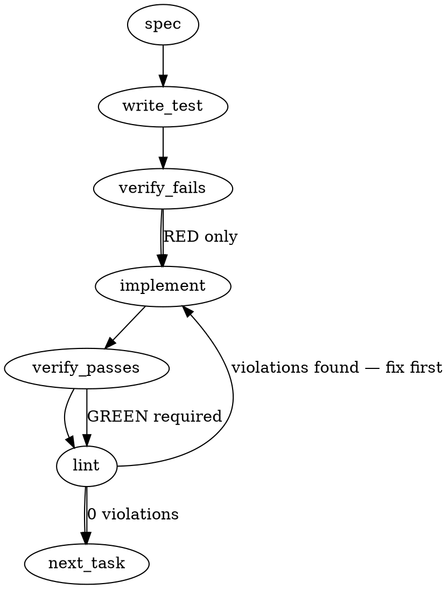

### Problem Statement

Implements ADR-088 Phase 1 Layers 3 and 4 by extending the compile pipeline to explicitly flag rules generated without Example Hit blocks as `unverified` (downgrading their default severity, or hard-failing if they are security rules), and upgrading `nonCompilable` ledger entries from simple 2-tuples to machine-readable objects carrying explicit `reasonCode`s.

### Architectural Context

- **ADR-088 Phase 1 (Layers 3 & 4)**: Establishes the "second-class path" for unverified rules and strict telemetry for skipped lessons. Security rules have a zero-tolerance policy for missing examples.
- **PR #1282**: Introduced the original `{hash, title}` 2-tuple for non-compilable entries.
- **lesson-400fed87.md (Read-path/Write-path schema invariants)**: Dictates that when migrating data formats via Zod, the "Read Schema" must use transforms (e.g., `z.union().transform()`) to accept legacy data, but a separate strict "Write Schema" must be defined without transforms to ensure data written back to disk conforms exactly to the modern standard without mutating dynamically.

### Files to Examine

1. `packages/core/src/schemas.ts` — Requires defining the new reason code enums, updating `CompiledRule`, and implementing the Read/Write schema invariant for `nonCompilable` entries.
2. `packages/core/src/compile-lesson.ts` — The core logic where the `unverified` flag is evaluated, security zero-tolerance is enforced, and reason codes are injected into all failure paths.
3. `packages/cli/src/commands/compile.ts` — To verify how `nonCompilable` entries are currently aggregated and ensure the new object shape passes through correctly.

### Technical Approach & Contracts

**Data Contracts:**

1. **`CompiledRule` Update:**
   Add `unverified: z.boolean().optional()` (defaults to `false` logically, but keep it optional so `undefined` prevents `canonicalStringify` from mutating existing hashes).
2. **`ReasonCode` Enum:**
   ```typescript
   export const NonCompilableReasonCode = z.enum([
     'no-pattern-generated',
     'pattern-syntax-invalid',
     'pattern-zero-match',
     'verify-retry-exhausted',
     'security-rule-rejected',
     'no-pattern-found',
     'out-of-scope',
     'missing-badexample',
     'legacy-unknown',
   ]);
   ```
3. **`NonCompilableEntry` (Read/Write Separation):**

   ```typescript
   export const NonCompilableEntryWriteSchema = z.object({
     hash: z.string(),
     title: z.string(),
     reasonCode: NonCompilableReasonCode,
     reason: z.string().optional(),
   });

   // Read schema accepts three shapes: legacy opaque string (pre-#1280),
   // legacy `{hash, title}` 2-tuple (#1280 to #1481), and modern 4-tuple
   // (#1481+). Union ordering puts the modern shape before the 2-tuple so
   // richer payloads do not silently lose `reasonCode`/`reason` when Zod
   // matches left-to-right.
   export const NonCompilableEntryReadSchema = z
     .union([
       z.string(),
       NonCompilableEntryWriteSchema,
       z.object({ hash: z.string(), title: z.string() }),
     ])
     .transform((val) => {
       if (typeof val === 'string') {
         return { hash: val, title: '(legacy entry)', reasonCode: 'legacy-unknown' };
       }
       if (!('reasonCode' in val)) {
         return { hash: val.hash, title: val.title, reasonCode: 'legacy-unknown' };
       }
       return val;
     });
   ```

**Implementation Logic (`compileLesson`):**

- Evaluate `hasExampleHit = !!lesson.exampleHit?.trim()`.
- If `!hasExampleHit`:
  - Check security context: if `deps.securityContext === true` or the built rule declares `immutable === true`, immediately reject with `reasonCode: 'security-rule-rejected'` and emit no rule.
  - For standard rules: set `rule.unverified = true`. Severity passes through from the LLM output or manual pattern. A doctor advisory for `unverified: true` rules authored with `severity: 'error'` is tracked as #1483.
- Intercept all existing return paths in `compileLesson` that yield a "non-compilable" state and explicitly map them to the correct `reasonCode` defined in the ADR.

### Edge Cases & Traps

- **Security Rule Identification:** Checking `rule.immutable === true` isn't enough if the LLM drops the flag. Ensure you also check if the _lesson metadata_ or `deps` indicates the rule is bound for the security pack.
- **Hash Stability:** Do NOT default `unverified` to `false` in the literal output object for existing rules. `undefined` is required to ensure `canonicalStringify` yields the same hash for legacy rules.
- **Empty Example Hits:** A lesson might have an empty code block for an example hit (e.g., just `typescript \n `). `trim()` must be applied before checking length.
- **Loss of Legacy Data:** If the CLI saves state back to disk using the Read Schema instead of the strict Write Schema, the transform might loop or type-check incorrectly. Enforce the strict Write Schema upon save.

### Implementation Tasks

- [ ] **Task 1: Extend Schemas with Read/Write Invariant**
      Modify `packages/core/src/schemas.ts`.

  > TOTEM INVARIANT (Read-path/Write-path schema invariants): When migrating schemas, use Zod transforms to gracefully parse legacy shapes on the Read Schema, but define a strict Write Schema to enforce modern shapes on serialization.
  > TEST DIRECTIVE: Before implementing, write a failing test named `migrates legacy 2-tuple and enforces strict write schema` proving that a legacy array parses into the object, but fails validation against the write schema.
  - Add `unverified?: boolean` to the `CompiledRule` schema.
  - Define `NonCompilableReasonCode` enum.
  - Define `NonCompilableEntryWriteSchema` and `NonCompilableEntryReadSchema`.
  - Write test (or update existing) → verify fails → implement → verify passes → lint

- [ ] **Task 2: Enforce Security Zero-Tolerance for Missing Examples**
      Modify `packages/core/src/compile-lesson.ts`.

  > TEST DIRECTIVE: Before implementing, write a failing test named `rejects security rule compilation if example hit is missing` proving the compiler throws or returns a non-compilable object with `security-rule-rejected`.
  - Detect `!lesson.exampleHit?.trim()`.
  - Detect if the rule is a security rule (check `rule.immutable` or lesson pack context).
  - Return the new `{ hash, title, reasonCode: 'security-rule-rejected' }` shape if a security rule violates the requirement.
  - Write test (or update existing) → verify fails → implement → verify passes → lint

- [ ] **Task 3: Apply Unverified Flag and Warning Downgrade**
      Modify `packages/core/src/compile-lesson.ts`.

  > TEST DIRECTIVE: Before implementing, write a failing test named `flags non-security rule as unverified and defaults to warning without example` proving the `unverified` flag is set and severity adjusted.
  - For non-security rules missing an Example Hit, set `unverified: true` on the compiled output.
  - If the LLM did not explicitly request `error` severity, forcefully default to `warning`.
  - Write test (or update existing) → verify fails → implement → verify passes → lint

- [ ] **Task 4: Inject Explicit Reason Codes Across Compilation Failures**
      Modify `packages/core/src/compile-lesson.ts` and `packages/cli/src/commands/compile.ts` if needed.
  > TEST DIRECTIVE: Before implementing, write a failing test named `returns specific reason code instead of generic unknown on parse failure` proving an ast-grep syntax error yields `pattern-syntax-invalid`.
  - Audit all exit points in `compileLesson` where a non-compilable tuple was previously returned.
  - Map LLM returning no code to `no-pattern-generated`.
  - Map ast-grep/regex parse throw to `pattern-syntax-invalid`.
  - Map pure prose to `no-pattern-found` / `out-of-scope`.
  - Return the modern object shape for all.
  - Write test (or update existing) → verify fails → implement → verify passes → lint

### Execution Flow (structural constraint)



### Verification (MANDATORY — do not skip)

Every implementation MUST end with these steps:

1. `totem lint` — deterministic rule check (zero LLM, ~2s). Fixes any violations.
2. `totem review` — AI-powered architectural review (~18s). Addresses any critical findings.
3. If using MCP, call `verify_execution` to confirm compliance before declaring the task done.

### Test Plan

1. **Schema Migration Tests:** Pass a legacy `[hash, title]` tuple to the read schema, verify it transforms to `{hash, title, reasonCode: 'legacy-unknown'}`. Pass the same to the Write Schema and assert it strictly rejects it.
2. **Security Zero Tolerance:** Pass a lesson payload with `immutable: true` (or destined for `@totem/pack-agent-security`) with an empty string `exampleHit`. Assert the result is skipped with reason `security-rule-rejected`.
3. **Unverified Fallback:** Pass a standard lesson lacking `exampleHit`. Assert the resulting `CompiledRule` has `unverified: true` and `severity: 'warning'`.
4. **Failure Reason Matrix:** Trigger a parser failure (e.g., invalid yaml in LLM output or ast-grep syntax error) and verify the skip ledger entry explicitly contains `reasonCode: 'pattern-syntax-invalid'`. Trigger an LLM response containing no pattern blocks and verify `no-pattern-generated`.

## Implementation Design

### Scope

PR A extends `CompiledRule` with an `unverified` flag, upgrades `nonCompilable` entries from 2-tuple to 4-tuple with a machine-readable `reasonCode`, and wires both changes through the compile pipeline so every skip path populates a specific code. PR A does NOT add `--verbose` compile output (#1482), doctor stale-rule detection (#1483), or backfill the Example Hit block on the 136 pre-existing lessons (#1414).

### Data model deltas

| New / changed                        | What it holds                                                                                                                                                                                                                                                                                                    | Writer                                                                                                         | Reader                                                 | Invariant                                                                                                                                                                                                                                                                                        |
| ------------------------------------ | ---------------------------------------------------------------------------------------------------------------------------------------------------------------------------------------------------------------------------------------------------------------------------------------------------------------- | -------------------------------------------------------------------------------------------------------------- | ------------------------------------------------------ | ------------------------------------------------------------------------------------------------------------------------------------------------------------------------------------------------------------------------------------------------------------------------------------------------ |
| `CompiledRule.unverified?: boolean`  | `true` when the rule was compiled without an Example Hit block; absent otherwise                                                                                                                                                                                                                                 | `buildCompiledRule` (Pipeline 2/3), `buildManualRule` (Pipeline 1)                                             | Loader, doctor, manifest hash via `canonicalStringify` | Absent means `false`. Never write literal `false`; absence preserves pre-1.14.12 manifest hashes.                                                                                                                                                                                                |
| `CompiledRule.severity` semantics    | (existing field) For `unverified: true` non-security rules, severity passes through from the LLM output or manual pattern. A doctor advisory for `unverified: true` rules authored with `severity: 'error'` ships with #1483. For `unverified: true` security rules, compile rejects outright and emits no rule. | `buildCompiledRule` / `buildManualRule`                                                                        | Runtime lint, doctor                                   | Security + unverified is unrepresentable in the output schema. Compile rejects at the source.                                                                                                                                                                                                    |
| `NonCompilableEntry` write-shape     | `{ hash, title, reasonCode, reason? }`                                                                                                                                                                                                                                                                           | Every ledger write site (`compile.ts` local + cloud paths; `pruneStaleNonCompilable`; `install.ts` pack merge) | Loader                                                 | Every write emits all three required fields. `reason` optional free-form string.                                                                                                                                                                                                                 |
| `NonCompilableEntry` read-shape      | Union of legacy string, legacy 2-tuple `{hash, title}`, and new 4-tuple. Transform normalizes to 4-tuple with `reasonCode: 'legacy-unknown'` for legacy shapes.                                                                                                                                                  | N/A (read-only transform)                                                                                      | Loader, `CompiledRulesFileSchema.parse`                | Read schema is permissive (accepts all three shapes). Write schema accepts the full 4-tuple shape including `'legacy-unknown'` so migrated data round-trips to disk safely. The constraint that fresh compile paths never emit `'legacy-unknown'` is behavioral (producer-side), not structural. |
| `NonCompilableReasonCode` enum       | `no-pattern-generated \| pattern-syntax-invalid \| pattern-zero-match \| verify-retry-exhausted \| security-rule-rejected \| no-pattern-found \| out-of-scope \| missing-badexample \| legacy-unknown`                                                                                                           | Compile pipeline (one code per return path)                                                                    | Loader, future doctor aggregation                      | Every non-`legacy-unknown` code names a specific compile outcome. `legacy-unknown` exists only to migrate pre-1.14.12 entries and is never written by fresh compile.                                                                                                                             |
| `CompileLessonReasonCode` (internal) | Expands from 4 values to match the public enum. `'non-compilable'` renames to `'out-of-scope'`; `'security-verify-rejected'` renames to `'security-rule-rejected'`.                                                                                                                                              | compile-lesson return paths                                                                                    | compile.ts ledger writers                              | Internal reasonCodes map 1:1 to persisted enum. No mapping table.                                                                                                                                                                                                                                |

**Reserved keys / sentinel values:** `reasonCode: 'legacy-unknown'` is a migration sentinel. Fresh compile runs MUST NOT emit it, but the Write schema accepts it so migrated legacy tuples can be persisted on the first post-upgrade compile. Linting that fresh producers never emit `'legacy-unknown'` could land as a follow-up (#1483 doctor check is a natural home).

### State lifecycle

| State                          | Scope                                 | Lifetime                                                                                                | Owner                                                      |
| ------------------------------ | ------------------------------------- | ------------------------------------------------------------------------------------------------------- | ---------------------------------------------------------- |
| `CompiledRule.unverified`      | Persistent (in `compiled-rules.json`) | Set at compile; cleared when lesson gains an Example Hit and is recompiled                              | `buildCompiledRule` / `buildManualRule`                    |
| `nonCompilableMap` (in-memory) | Per-compile-run                       | Created at `compileCommand` start; populated during Pipeline 1/2/3 traversal; serialized to file at end | `compile.ts`                                               |
| `NonCompilableEntry` (on-disk) | Persistent                            | Written on every compile run; entries pruned by `pruneStaleNonCompilable` when source lesson vanishes   | `compile.ts` write path                                    |
| Read-side normalization        | Per-load                              | One Zod transform at parse time                                                                         | `CompiledRulesFileSchema.parse` in `loadCompiledRulesFile` |

**Cross-lifecycle risk:** The legacy-migration transform runs on every load. A rule-based self-healing cycle that reads legacy data, mutates it, and writes it back MUST route the write through the strict Write schema, not the Read schema — otherwise the parse-transform-write loop silently legitimizes `'legacy-unknown'` forever. Lesson `400fed87.md` (read/write schema invariants) is the cited precedent; it surfaced 5 times on PR #1282 and is the single most important landmine here.

### Failure modes

| Failure                                                                                                                   | Category | Agent-facing surface                                                                                                                   | Recovery                                                         |
| ------------------------------------------------------------------------------------------------------------------------- | -------- | -------------------------------------------------------------------------------------------------------------------------------------- | ---------------------------------------------------------------- |
| Lesson has no Example Hit, non-security context                                                                           | Runtime  | Rule ships with `unverified: true`; severity preserved (doctor advisory for `unverified: true` + `severity: 'error'` tracked in #1483) | Author adds Example Hit block, recompiles; `unverified` clears   |
| Lesson has no Example Hit, security context (`deps.securityContext === true` OR lesson output declares `immutable: true`) | Runtime  | Hard error: rule NOT emitted, `nonCompilable` entry with `reasonCode: 'security-rule-rejected'`                                        | Author adds Example Hit block to the security lesson, recompiles |
| Lesson has Example Hit but LLM emits no pattern                                                                           | Runtime  | `nonCompilable` entry with `reasonCode: 'no-pattern-generated'`                                                                        | Refine lesson; `totem compile --upgrade <hash>`                  |
| LLM emits pattern with syntactic errors (regex unparseable, ast-grep napi rejects)                                        | Runtime  | `nonCompilable` entry with `reasonCode: 'pattern-syntax-invalid'`                                                                      | Refine or upgrade                                                |
| Pattern parses but Example Hit zero-match after verify-retry exhausted                                                    | Runtime  | `nonCompilable` entry with `reasonCode: 'verify-retry-exhausted'`                                                                      | Refine Example Hit or pattern                                    |
| LLM emits structured response but omits `badExample` field                                                                | Runtime  | `nonCompilable` entry with `reasonCode: 'missing-badexample'`                                                                          | Refine lesson prose so LLM echoes the bad snippet                |
| LLM classifies lesson as conceptual / architectural                                                                       | Runtime  | `nonCompilable` entry with `reasonCode: 'out-of-scope'`                                                                                | Expected; lesson is informational not enforceable                |
| Lesson is prose-only, no detectable pattern shape pre-LLM                                                                 | Runtime  | `nonCompilable` entry with `reasonCode: 'no-pattern-found'`                                                                            | Expected or refine                                               |
| Schema load hits legacy 2-tuple                                                                                           | Init     | Read transform normalizes to 4-tuple with `reasonCode: 'legacy-unknown'`                                                               | Automatic; next write persists the migrated shape                |
| Schema save accidentally passes Read-schema-shaped data                                                                   | Runtime  | Strict Write schema parse fails loudly with Zod error                                                                                  | Trace write-site; route through strict schema                    |

No "silent degradation" rows. Every failure surfaces either as a rejected rule or a ledger entry with a named reason.

### Invariants to lock in via tests

1. A rule compiled with an Example Hit block and no security context has `unverified` absent from its serialized JSON (preserves pre-PR manifest hashes).
2. A non-security rule compiled without an Example Hit has `unverified: true`. Severity passes through from the LLM output or manual pattern untouched. A doctor advisory for `unverified: true` rules authored with `severity: 'error'` ships with #1483.
3. A security-context lesson without an Example Hit produces no rule and yields a ledger entry with `reasonCode: 'security-rule-rejected'`. The ledger entry shape is the full 4-tuple.
4. Loading a legacy string-only `nonCompilable` array yields 4-tuples with `reasonCode: 'legacy-unknown'` and `title: '(legacy entry)'`.
5. Loading a legacy 2-tuple `{hash, title}` array yields 4-tuples with `reasonCode: 'legacy-unknown'` and the original `title` preserved.
6. Every `CompileLessonResult.status === 'skipped'` return path carries a `reasonCode` that maps to one of the enum values other than `'legacy-unknown'`.
7. No compile-pipeline code path emits `reasonCode: 'legacy-unknown'` on a fresh entry. The Write schema MUST accept `'legacy-unknown'` so migrated legacy tuples round-trip safely to disk; the behavioral invariant is enforced at the producer, not the schema. (Fatal-flaw carveout: if the Write schema rejected `'legacy-unknown'`, the first compile run on any pre-PR user's repo would load legacy 2-tuples, transform them in memory, then crash on save. The schema gate is the wrong place for this invariant.)
8. `pruneStaleNonCompilable` preserves `reasonCode` and `reason` fields through the prune (does not drop them back to 2-tuple).
9. `install.ts` pack-merge path emits 4-tuple shape on the merged output.
10. Manifest hash via `canonicalStringify` is stable across a round-trip of a CompiledRule with `unverified: undefined` and the same rule before this PR (backward-compat anchor test).

### Open questions

1. **`missing-badexample` reasonCode — include in the public enum or fold into `no-pattern-generated`?**
   - **Options:** (a) Add as a 9th code. It's a distinct outcome: LLM emitted a pattern but dropped the required `badExample` field. (b) Fold into `no-pattern-generated` since from Layer 4's POV the rule couldn't be emitted without the field. (c) Fold into `pattern-syntax-invalid` since the structured output was malformed.
   - **Recommendation:** (a) Add as a 9th code. It's already an internal `CompileLessonReasonCode` value and carries distinct remediation advice ("refine lesson prose so the LLM echoes the bad snippet" vs "rewrite the lesson").

2. **Pipeline 1 (manual) rules without Example Hit — also flagged `unverified`?**
   - **Options:** (a) Yes, for consistency. (b) No, manual rules are human-authored and the author accepted the responsibility.
   - **Recommendation:** (a). The ticket says "compiled from a lesson lacking an Example Hit block" without restricting to Layer 3. Consistency > author intent. #1414 backfill sweep will eliminate the population anyway.

3. **Security-context signal for the missing-Example-Hit check — which signal wins?**
   - **Options:** (a) `deps.securityContext === true` only. (b) `rule.immutable === true` on the LLM-emitted output only. (c) OR both.
   - **Recommendation:** (c). `deps.securityContext` is the compile-orchestrator signal (set when compiling inside `@totem/pack-agent-security`); `rule.immutable === true` is the per-rule flag. Either should trigger the hard-fail. The ticket's AC names both.

4. **Rename `security-verify-rejected` → `security-rule-rejected` in `CompileLessonReasonCode`?**
   - **Options:** (a) Rename to match ticket. (b) Keep existing name, map at ledger-write time.
   - **Recommendation:** (a). The internal type is not exported outside the compile pipeline; rename is contained.

5. **Does PR A ship the `.strategy` pointer bump (6f88a92 → 4dfa0f0) or punt to PR B?**
   - **Options:** (a) Ship in the first commit of PR A per the banner. (b) Wait for PR B.
   - **Recommendation:** (a). The banner explicitly names "next substantive PR's first commit" and PR A qualifies.
