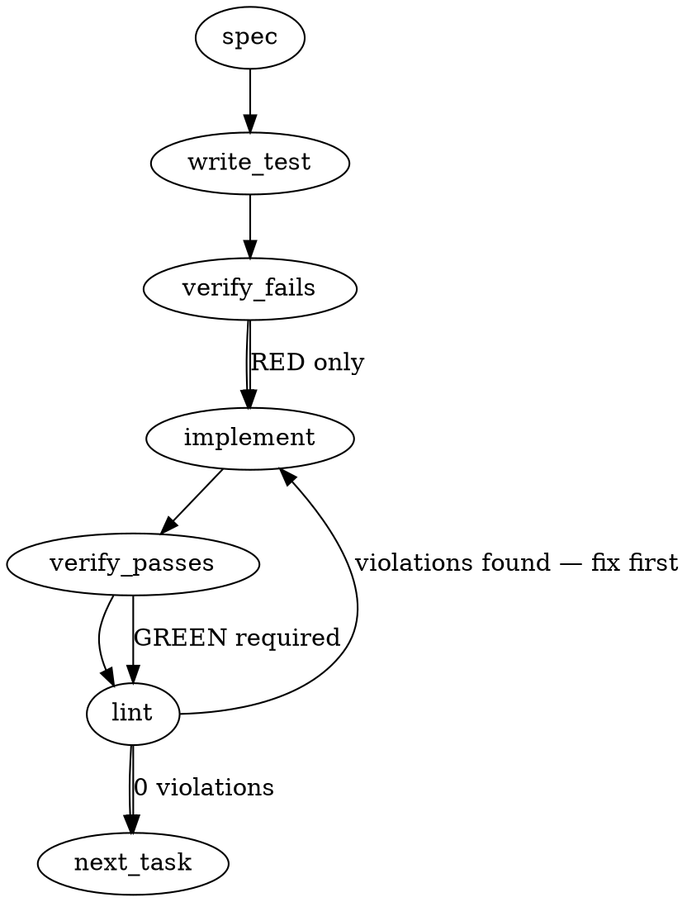

### Problem Statement
The system requires two new diagnostic surfaces: a `--verbose` flag for `totem compile` to emit a structured, per-lesson fallback trace showing the LLM layer decisions and verify-retry loops; and a `totem doctor` diagnostic that scans `compiled-rules.json` to identify and flag zero-match "stale" rules that have not fired over a configurable rolling window of lint runs.

### Architectural Context
None found in provided context directly dictating new architectures, but the codebase emphasizes compound ast-grep rule generation and a rigid distribution pipeline (1.15.0). The addition of `compileLesson` traces implies an update to `CompileLessonResult`, and the `doctor` update must parse shipped artifacts robustly, interacting with the existing `contextCounts` object introduced in 1.13.0.

### Files to Examine
1. `packages/core/src/compile-lesson.ts` — Core logic for rule compilation; requires updating `CompileLessonResult` to bubble up trace events without writing directly to stdout.
2. `packages/cli/src/commands/compile.ts` — CLI handler; needs the `--verbose` flag and atomic console output logic to prevent interleaved traces.
3. `packages/cli/src/commands/doctor.ts` — CLI handler; needs to process `compiled-rules.json` and evaluate the stale rule condition.
4. `packages/core/src/config.ts` (or equivalent config types file) — Needs the new `doctor.staleRuleWindow` schema.

### Technical Approach & Contracts

**1. `totem compile --verbose`**
We will avoid printing directly from `compileLesson` to prevent interleaved output during concurrent rule compilations. Instead, `CompileLessonResult` will be expanded to include an array of standard trace events. The CLI will format and atomically dump this array when a lesson finishes.

*Contract Update (CompileTrace):*
```typescript
export interface LayerTraceEvent {
  layer: number;
  action: string;
  result: string; // e.g., "zero-match", "MATCH (2 hits)"
  patternHash?: string;
}

// Added to existing CompileLessonResult
export interface CompileLessonResult {
  // ... existing fields ...
  trace?: LayerTraceEvent[]; 
  outcome: 'compiled' | 'nonCompilable' | 'error';
  reasonCode?: string; // from Ticket C
  reasonText?: string;
}
```

**2. `totem doctor` Stale Rule Detection**
We will extend the `totem.config.ts` schema to include the `doctor` settings. `totem doctor` will use the shared `readJsonSafe` helper to ingest `compiled-rules.json`. It will analyze the historical context arrays (or total evaluations if rolling window array is not available, assuming `contextCounts.code` acts as the aggregate and `lintRuns` tracks total evaluations).

*Contract Update (Doctor Config):*
```typescript
const DoctorConfigSchema = z.object({
  staleRuleWindow: z.number().int().default(10),
  minRunsToEvaluate: z.number().int().default(3)
}).default({});
```

*Contract Assumption (Compiled Rule):*
Rules currently track `contextCounts.code: number` (hits) and should track total lint executions (`evaluations: number` or an array of recent hits). If the history is an array of length `N`, we sum it. If it's a running total, we check if `evaluations >= minRunsToEvaluate && contextCounts.code === 0`.

### Edge Cases & Traps
- **Interleaved Output Race Condition:** `totem compile` processes multiple lessons asynchronously. Writing trace logs inside the deeply nested compilation steps will result in unreadable, interleaved console output. **Solution:** Collect events in memory per-lesson and write them via a single synchronous `console.log` block in the CLI command at the end of the lesson's lifecycle.
- **Doctoring Corrupt Files:** `totem doctor` might run in an environment where `compiled-rules.json` is malformed. You MUST use the shared `readJsonSafe` helper with a Zod schema to prevent unexpected crashes.
- **Rule Metadata Missing:** Security tagging might not be explicitly boolean; it could be derived from `pack` names or `unverified` status. The logic must fail closed (treat uncertain rules as standard, not security) unless explicitly tagged as immutable/security.
- **Division by Zero / Fresh Rules:** A newly compiled rule with 0 evaluations must not trigger a stale warning. The check `evaluations >= 3` must strictly enforce this.

### Implementation Tasks

- [ ] **Task 1: Extend Config Schema for Doctor Stale Rule Window**
  - Update the Totem config Zod schema (likely in `packages/core/src/config.ts` or `packages/core/src/schema.ts`) to include `doctor.staleRuleWindow` (default 10) and an internal `minRunsToEvaluate` (default 3).
  > TEST DIRECTIVE: Before implementing, write a failing test named `parses doctor config with defaults and overrides` that proves the new configuration block correctly merges with user settings.
  - write test (or update existing) → verify fails → implement → verify passes → lint

- [ ] **Task 2: Define Trace Contracts and Update `compileLesson`**
  - Update `CompileLessonResult` in `packages/core/src/compile-lesson.ts` (or `types.ts`) to include `trace: LayerTraceEvent[]`.
  - Inside `compileLesson`, push events to a local `trace` array during Layer 3 free-form generation, verify loops, and retries. Return this array in the result. Ensure `nonCompilable` paths populate `reasonCode` and `reasonText`.
  > TEST DIRECTIVE: Before implementing, write a failing test named `returns ordered trace events for a verify-retry-exhausted outcome` that proves the trace captures the correct sequence of retry attempts without mutating stdout.
  - write test (or update existing) → verify fails → implement → verify passes → lint

- [ ] **Task 3: Implement `--verbose` flag in `totem compile`**
  - Update `packages/cli/src/commands/compile.ts` to accept the `--verbose` boolean flag (and pass it through to `--upgrade` flows).
  - After a lesson completes (or fails), if `--verbose` is true, format the `trace` array into the multi-line string specified in the Acceptance Criteria. Print it using a single atomic `console.log` call.
  > TEST DIRECTIVE: Before implementing, write a failing test named `emits atomic formatted trace block to stdout when verbose flag is active` that intercepts stdout and proves no partial lines are emitted.
  - write test (or update existing) → verify fails → implement → verify passes → lint

- [ ] **Task 4: Implement Stale Rule Analysis in `totem doctor`**
  - Modify `packages/cli/src/commands/doctor.ts`. Use `import { readJsonSafe } from '@mmnto/totem';` to load `compiled-rules.json`. Do NOT use `fs.readFileSync` combined with `JSON.parse`.
  - Implement the stale rule logic: Iterate over rules, check `evaluations >= minRunsToEvaluate` and `contextCounts.code === 0` (or sum the rolling history array if that is the underlying implementation of `contextCounts`).
  - Format the advisory output. Differentiate security rules by checking if `rule.pack?.includes('security')` or `rule.tags?.includes('security')`. Apply a red/critical terminal color for security rules and yellow/warn for standard rules.
  > TEST DIRECTIVE: Before implementing, write a failing test named `flags stale rules but ignores fresh rules under the evaluation threshold` using a fixture JSON.
  - write test (or update existing) → verify fails → implement → verify passes → lint

### Execution Flow (structural constraint)


### Verification (MANDATORY — do not skip)
Every implementation MUST end with these steps:
1. `totem lint` — deterministic rule check (zero LLM, ~2s). Fixes any violations.
2. `totem review` — AI-powered architectural review (~18s). Addresses any critical findings.
3. If using MCP, call `verify_execution` to confirm compliance before declaring the task done.

### Test Plan
1. **Compile Trace Format (Unit):** Mock `compileLesson` behavior to simulate a successful compile on the second retry. Assert that the returned `CompileLessonResult` contains exactly 3 trace events (Initial, Retry 1, Retry 2).
2. **Atomic Output Validation (Integration):** Run `totem compile --verbose` with a fixture containing 3 rules that compile concurrently. Capture stdout and assert via regex that the trace block for each rule (`lesson-{hash} "{title}":\n Layer 3...`) is printed as a contiguous block without interleaving text from other rules.
3. **Doctor Zod parsing (Unit):** Feed a malformed `compiled-rules.json` to the doctor stale-rule extraction function. Prove that `readJsonSafe` gracefully catches it and emits a `TotemParseError` rather than a raw JS TypeError.
4. **Doctor Stale Rules Evaluation (Unit):** Create a fixture array of 4 compiled rules:
    - Rule A: 0 hits, 2 evaluations (Fresh - should be ignored)
    - Rule B: 0 hits, 15 evaluations (Stale Standard - flagged warn)
    - Rule C: 0 hits, 12 evaluations, scoped to `security-pack` (Stale Security - flagged critical)
    - Rule D: 5 hits, 15 evaluations (Healthy - ignored)
   Assert the doctor output strictly returns warnings for B and C, omitting A and D.

## Implementation Design

### Scope

PR B adds a `--verbose` flag to `totem compile` that emits a structured per-lesson layer-trace block, and adds a stale-rule advisory to `totem doctor` that flags rules whose `contextCounts.code` stayed at zero after enough evaluation cycles. PR B does NOT auto-archive stale rules (advisory only; the existing `totem doctor --pr` minAgeDays GC path stays untouched), add Layer 1 or Layer 2 trace support (those slots are reserved for a future ADR-088 Phase 2 landing), or change the compile flow's actual decisions.

### Data model deltas

| New / changed | What it holds | Writer | Reader | Invariant |
|---|---|---|---|---|
| `LayerTraceEvent` (new interface) | Single step inside the Layer 3 compile loop: `{ layer: number, action: 'generate' \| 'verify' \| 'retry' \| 'result', outcome: string, patternHash?: string, reasonCode?: NonCompilableReasonCode }` | `compileLesson` appends during pipeline traversal | CLI verbose renderer | Trace events are append-only during one `compileLesson` call; never mutated after |
| `CompileLessonResult.trace?: LayerTraceEvent[]` | Ordered list of layer events for this lesson's compile attempt | `compileLesson` populates before returning | CLI `compileCommand` when `--verbose` is set | Optional; absence means verbose was off (zero runtime cost) |
| `RuleMetric.evaluationCount: number` | Count of lint runs that loaded and evaluated this rule | `runCompiledRules` increments once per rule per lint run | `doctor` staleness check | Defaults to `0` for pre-#1483 metrics; new rules start at `0`; monotonically increases |
| `TotemConfig.doctor.staleRuleWindow: number` (new) | Minimum `evaluationCount` before a rule can be flagged stale. Default `10`. | User config | `doctor` staleness check | Integer ≥ 1 |
| `TotemConfig.doctor.minRunsToEvaluate: number` (new) | Hard floor below which doctor never flags a rule as stale regardless of hits. Default `3`. | User config | `doctor` staleness check | Integer ≥ 1, must be ≤ staleRuleWindow |
| CLI `--verbose` flag on `totem compile` | Boolean toggle | User invocation | `compileCommand` routing | Default `false`; opt-in only |

**Reserved keys / sentinel values:** The trace `layer` field uses `3` exclusively in this PR (Pipeline 2 is the only layer that emits trace today). Layers 1 and 2 are reserved values for future ADR-088 phases. Trace rendering MUST tolerate unknown layer numbers so a future phase can land without breaking the renderer.

### State lifecycle

| State | Scope | Lifetime | Owner |
|---|---|---|---|
| `LayerTraceEvent[]` in `CompileLessonResult` | Per-lesson | Created at `compileLesson` entry, returned in result, rendered or discarded by CLI | `compileLesson` and `compileCommand` |
| `evaluationCount` on `RuleMetric` | Persistent | Incremented once per lint run per rule; never reset | `runCompiledRules` |
| `doctor.staleRuleWindow` / `doctor.minRunsToEvaluate` | Static config | Load-time from `totem.config.ts` | Config schema loader |

**Cross-lifecycle risk:** `evaluationCount` crosses the lint-run / compile-run boundary. A rule that gets recompiled (same `lessonHash` but new content) keeps its metric. That's intentional — the lesson is recognized by hash, not by rule identity — but the `evaluationCount` should arguably reset on significant rule change. For this PR, keep the simple monotonic counter and flag reset-on-pattern-change as a followup. The practical risk is small: a recompile that keeps the same pattern won't regress behavior, and a new pattern that starts at evaluationCount > 0 but triggers normally won't be flagged stale.

### Failure modes

| Failure | Category | Agent-facing surface | Recovery |
|---|---|---|---|
| `--verbose` rendering fails (unexpected layer number, malformed trace event) | Runtime | Render that event as `(unknown)` and continue; never crash the compile run | Next rendering attempt fresh |
| `rule-metrics.json` missing `evaluationCount` on load | Init | Zod default sets it to `0`; staleness check skips the rule until it accrues enough runs | Automatic migration on first lint run |
| Stale rule lookup encounters a rule with absent `contextCounts` | Runtime | Treat `contextCounts?.code ?? 0` as zero hits; the rule still needs `evaluationCount ≥ minRunsToEvaluate` before flagging | Rule exercises through normal lint runs |
| Doctor advisory for a security rule (immutable or `category: security`) | Runtime | Flag with higher severity label; never recommend archival | User refines or revisits |
| `doctor.staleRuleWindow < minRunsToEvaluate` in user config | Init | Zod `superRefine` rejects config with a clear error | Fix config |
| `evaluationCount` overflow (practical impossibility at plain lint-run frequency) | Permanent | Not guarded; `Number.MAX_SAFE_INTEGER` is beyond any realistic lint-run total | N/A |

No "silent degradation" rows. Every failure either short-circuits with a clear error or surfaces in advisory output.

### Invariants to lock in via tests

1. A lesson that compiles cleanly on the first try produces a trace with one `generate` event, one `verify` event with `outcome: 'MATCH'`, and one terminal `result` event.
2. A lesson that exhausts verify-retry produces `MAX_VERIFY_ATTEMPTS` generate events interleaved with verify failures, plus one terminal `result` event carrying `reasonCode: 'verify-retry-exhausted'`.
3. Without `--verbose`, `compileLesson` still populates `trace` (cheap; an array append per step), but the CLI never renders it, and stdout contains no trace output.
4. `--verbose` output is emitted as a single block per lesson (atomic `console.log` or equivalent), not interleaved line-by-line.
5. A rule with `evaluationCount === 0` is never flagged stale regardless of other signals.
6. A rule with `evaluationCount >= minRunsToEvaluate` AND `contextCounts.code === 0` is flagged as stale-standard.
7. A rule meeting stale conditions whose `category === 'security'` OR `immutable === true` is flagged as stale-security with a visually distinct severity label.
8. `evaluationCount` increments exactly once per rule per lint run, regardless of how many matches fire.
9. Loading a pre-#1483 `rule-metrics.json` (no `evaluationCount` field) succeeds and treats missing counts as `0`.
10. Config validation rejects `doctor.staleRuleWindow` less than `doctor.minRunsToEvaluate`.

### Open questions

1. **`evaluationCount` vs `compiledAt`-age proxy for the "exercised" gate?**
   - **Options:** (a) Add `evaluationCount` to `RuleMetric` (schema extension, writes at lint time). (b) Proxy with rule age via `compiledAt` (no schema change; flag rules older than N days with zero hits).
   - **Recommendation:** (a). The ticket AC literally says "across the most recent N lint runs," and age is a weak proxy (a dormant repo could have a 90-day-old rule that never ran). `evaluationCount` is one integer field and Zod handles the migration.

2. **Should `evaluationCount` reset on pattern change (recompile with different pattern text)?**
   - **Options:** (a) Never reset (simple monotonic counter). (b) Reset when pattern hash changes across recompile.
   - **Recommendation:** (a) for this PR. Reset-on-pattern-change is a cleanup improvement; file a follow-up if we decide we want it. The practical risk is small.

3. **`--verbose` flag name — `--verbose` or `--trace`?**
   - **Options:** (a) `--verbose` per the ticket AC. (b) `--trace` which is more precise (trace output specifically, not general verbosity).
   - **Recommendation:** (a) `--verbose`. The ticket calls it out explicitly and other totem commands use `--verbose` for extra output.

4. **Should `compileLesson` populate `trace` unconditionally, or gate it on a `deps.trace === true` flag?**
   - **Options:** (a) Unconditional; cost is tiny (array appends). (b) Gated to avoid even the minor cost on the hot path.
   - **Recommendation:** (a). Cost of empty-or-single-element arrays per-lesson is negligible, and gating creates a test fork.

5. **Does PR B ship its changeset as patch or minor?**
   - **Options:** (a) Patch (consistent with #1544 downgrade reasoning; keeps 1.15.0 free for Pack Distribution). (b) Minor (new flag on a public CLI command, new config field).
   - **Recommendation:** (a) Patch. `--verbose` and stale advisory are additive and non-breaking; consumers don't need to adopt anything to stay compatible. Same rationale as PR #1548.

6. **Trace for Pipeline 1 (manual) and Pipeline 3 (Bad/Good snippets) — include or defer?**
   - **Options:** (a) Trace Pipeline 2 only (the Layer 3 LLM path). (b) Trace all three pipelines consistently.
   - **Recommendation:** (b). Consistency avoids "why doesn't my manual rule show a trace" surprise. Pipeline 1 trace is a single `result` event; Pipeline 3 adds one `generate` + one `verify` event. Cheap to do.