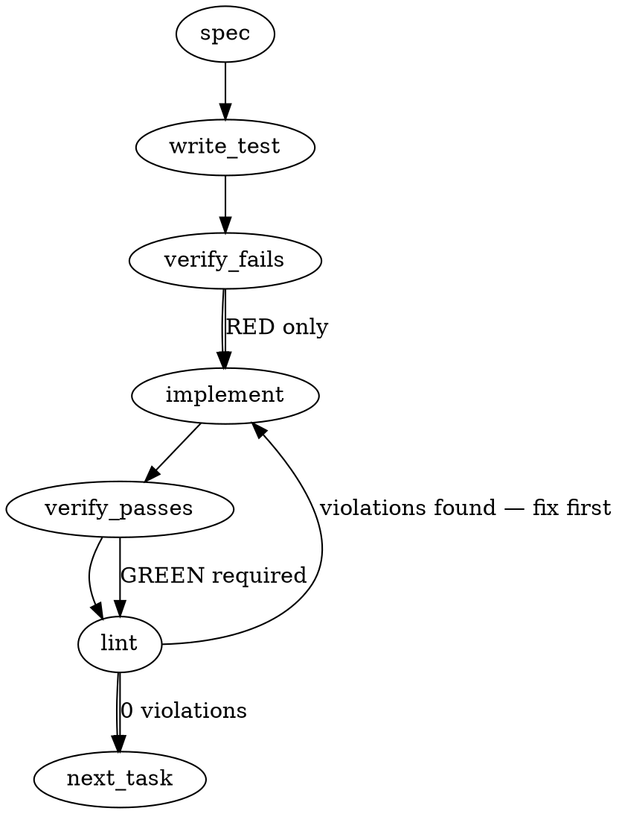

### Problem Statement

Create the structural scaffolding for the `@totem/pack-agent-security` package, which serves as the distribution mechanism for Zero-Trust Agent Governance rules, and wire it into the monorepo's build, test, and release pipelines without implementing the rule content itself.

### Architectural Context

This is the foundational deliverable for ADR-089 (Zero-Trust Agent Governance) utilizing the 1.15.0 Pack Distribution infrastructure (ADR-085).

_Note: Existing core packages operate under the `@mmnto/` scope (e.g., `@mmnto/cli`). The issue explicitly introduces the `@totem/` namespace for packs. This namespace distinction is intentional per the issue description._

None found in provided context regarding specific code drift lessons.

### Files to Examine

1. `packages/cli/package.json` — To reference standard monorepo dependency versions, test runner configuration, and npm publishing configurations.
2. `pnpm-workspace.yaml` (or equivalent workspace root config) — To verify standard glob patterns (e.g., `packages/*`) cover the new directory.
3. `.changeset/config.json` — To locate the fixed version group array to ensure the new package publishes synchronously with the core tools.
4. `turbo.json` — To verify standard task graph pipelines (`build`, `test`, `lint`) will execute against the new package without circular dependencies.

### Technical Approach & Contracts

1. **Directory Structure**: Create standard package scaffolding in `packages/pack-agent-security/`.
2. **Package Config Contract**: The `package.json` must:
   - Declare `"name": "@totem/pack-agent-security"`.
   - Provide an exact `"exports"` map explicitly declaring `./compiled-rules.json` and `./.totemignore`.
   - Contain strictly `devDependencies` for the test runner. No dependencies on `@mmnto/cli` to satisfy the "no circular dependency" requirement.
3. **Static Assets Contract**:
   - `compiled-rules.json` must be strictly an empty array `[]` representing valid JSON.
   - `.totemignore` must contain the literal strings `scripts/`, `.github/**`, `**/*.test.*`, `**/*.spec.*` separated by newlines.
   - `README.md` must state the pack's risk coverage boundaries per ADR-089.
4. **Integration Approach**: Add the new package name to the existing fixed release group in `.changeset/config.json`.
5. **Test Strategy**: Rely on `readJsonSafe` (from `@mmnto/totem`) within the new package's unit tests to parse and validate `compiled-rules.json` and the root `.changeset/config.json`.

### Edge Cases & Traps

- **Namespace Regression**: Do not instinctively name the package `@mmnto/pack-agent-security`. It must strictly be `@totem/pack-agent-security`.
- **Changeset Divergence**: Failing to add the new package to the `.changeset/config.json` fixed group will cause it to version independently, destroying the unified 1.15.0 release strategy.
- **Export Resolution Failures**: Node `exports` maps require explicit `./` prefixes for paths. Omitting these will cause resolvable package exports to fail silently until integrated in Ticket L.
- **Turborepo Caching**: If `compiled-rules.json` and `.totemignore` are not explicitly listed in package `files` array, they may be excluded from the packed tarball, breaking distribution.

### Implementation Tasks

- [ ] **Task 1: Package Scaffolding & Export Verification**
  - Files to modify: `packages/pack-agent-security/package.json`, `packages/pack-agent-security/test/structure.test.ts`, `packages/pack-agent-security/compiled-rules.json`, `packages/pack-agent-security/.totemignore`, `packages/pack-agent-security/README.md`
  - > TEST DIRECTIVE: Before implementing, write a failing test named `validates pack structure exports and schema` in `packages/pack-agent-security/test/structure.test.ts` that uses `readJsonSafe` from `@mmnto/totem` to assert `compiled-rules.json` is an empty array, reads `.totemignore` to assert all 4 required exemptions are present, and validates that `package.json` exports are correctly defined.
  - Steps:
    1. Initialize `packages/pack-agent-security/package.json` with the required name, `files` array, testing scripts, and `exports`.
    2. Write the failing test structure using `readJsonSafe`.
    3. Implement the missing files (`compiled-rules.json` as `[]`, `.totemignore`, `README.md`).
  - write test → verify fails → implement → verify passes → lint

- [ ] **Task 2: Monorepo & Changeset Integration**
  - Files to modify: `.changeset/config.json`, `packages/pack-agent-security/test/monorepo.test.ts`
  - > TEST DIRECTIVE: Before implementing, write a failing test named `enforces package is in the core changeset fixed group` that reads the root `.changeset/config.json` (using `readJsonSafe`) and asserts `@totem/pack-agent-security` is included in the same fixed group array as `@mmnto/cli`.
  - Steps:
    1. Write the test verifying the changeset linkage.
    2. Update `.changeset/config.json` to link the package.
    3. Verify `turbo.json` task graph does not require specific inputs for packs; if it does, add the package.
  - write test → verify fails → implement → verify passes → lint

### Execution Flow (structural constraint)

### Verification (MANDATORY — do not skip)

Every implementation MUST end with these steps:

1. `totem lint` — deterministic rule check (zero LLM, ~2s). Fixes any violations.
2. `totem review` — AI-powered architectural review (~18s). Addresses any critical findings.
3. If using MCP, call `verify_execution` to confirm compliance before declaring the task done.

### Test Plan

- Run the full monorepo test suite via `turbo run test` to verify the task graph executes the new package's tests in parallel without hanging or cyclical errors.
- Ensure `packages/pack-agent-security/test/structure.test.ts` confirms `.totemignore` contains exact matches for `scripts/`, `.github/**`, `**/*.test.*`, and `**/*.spec.*`.
- Ensure `packages/pack-agent-security/test/monorepo.test.ts` acts as a sentinel test to prevent developers from accidentally removing the pack from the changesets fixed group in the future.

## Implementation Design

### Scope

**In scope.** Create the `@totem/pack-agent-security` npm package under `packages/pack-agent-security/` with a minimal, publishable shape: `package.json` with `exports` + `files` + `scripts`, `compiled-rules.json` containing the canonical empty manifest (`{ version: 1, rules: [] }`, NOT bare `[]`), `.totemignore` template with the four required path exemptions, `README.md` stating coverage boundaries honestly per ADR-089 risk assessment, and two unit tests. Add `@totem/pack-agent-security` to the `fixed` group in `.changeset/config.json`.

**Out of scope.** No rule content (tickets H/I/J/K ship rules). No `totem install` integration (ticket L). No Sigstore signing (ticket M). No `immutable` flag support (ticket G). No `@totem` npm-scope registration or first-publish attempt — this PR only lands the source tree; publish happens when the pack is ready and scope is claimed.

### Data model deltas

- **New package directory:** `packages/pack-agent-security/`
- **New `package.json`:**
  - `name`: `@totem/pack-agent-security`
  - `version`: `0.0.0` (pre-publish; changesets controls bumps)
  - `description`: single sentence referencing ADR-089
  - `license`: matches root license
  - `repository`, `homepage`, `bugs`: mirror `@mmnto/cli`'s shape
  - `files`: `["compiled-rules.json", ".totemignore", "README.md"]`
  - `exports`: `{ "./compiled-rules.json": "./compiled-rules.json", "./.totemignore": "./.totemignore" }`
  - `scripts`: `test: "vitest run"`
  - `devDependencies`: `vitest`, `@mmnto/totem` (workspace:\*), no runtime deps
  - NO `"type": "module"` (no executable JS)
- **New `compiled-rules.json`:** `{ "version": 1, "rules": [] }`. Matches `CompiledRulesFileSchema` from `packages/core/src/compiler-schema.ts:162`.
- **New `.totemignore`:** plain text, 4 lines, one glob per line: `scripts/`, `.github/**`, `**/*.test.*`, `**/*.spec.*`.
- **New `README.md`:** coverage-boundary framing per ADR-089. Must state that the pack is a baseline (not a comprehensive solution) and that four attack surfaces are covered.
- **Modified `.changeset/config.json`:** `@totem/pack-agent-security` added to the `fixed` array alongside `@mmnto/totem`, `@mmnto/cli`, `@mmnto/mcp`.

No reserved keys or sentinel values. No new TypeScript types.

### State lifecycle

The package files are **built-artifact state** (published to npm, consumed by downstream repos via package managers).

- **Scope:** persistent (lives in npm cache + consumer `node_modules` across machines)
- **Lifetime:** created at publish time, immutable per version (new versions get new directory content). Changesets handles bumps; the fixed group ensures this pack ships in lockstep with `@mmnto/cli` / `@mmnto/totem` / `@mmnto/mcp`.
- **Ownership:** Totem maintainers write; `totem install` (ticket L) reads via pack resolver.

The only state crossing a boundary is the fixed-group declaration: changing `.changeset/config.json` controls publish timing. Sentinel test (`monorepo.test.ts`) pins this so future PRs cannot silently remove the pack from the group.

### Failure modes

| Failure                                                     | Category           | Agent-facing surface                                              | Recovery                                                                                 |
| ----------------------------------------------------------- | ------------------ | ----------------------------------------------------------------- | ---------------------------------------------------------------------------------------- |
| `@totem` npm scope not registered at publish time           | init (maintainer)  | `npm publish` hard error                                          | maintainer registers scope with npm org; this PR does NOT publish                        |
| `compiled-rules.json` not valid JSON or wrong schema        | init (dev)         | `structure.test.ts` fails                                         | fix schema; reject PR                                                                    |
| `.totemignore` missing one of the 4 required exemptions     | init (dev)         | `structure.test.ts` fails                                         | fix file content                                                                         |
| Package not in `.changeset/config.json` fixed group         | init (dev)         | `monorepo.test.ts` fails                                          | add to fixed group                                                                       |
| `exports` map missing `./` prefix on path                   | runtime (consumer) | silent `require.resolve` failure                                  | declare with explicit `./` prefix                                                        |
| Package declares runtime dep on `@mmnto/cli`                | build (dev)        | turbo detects circular graph                                      | keep deps as `devDependencies` only                                                      |
| `files` array omits `compiled-rules.json` or `.totemignore` | publish (runtime)  | npm-packed tarball missing assets; `totem install` fails silently | enumerate both in `files`; `structure.test.ts` verifies                                  |
| `compiled-rules.json` ships with non-empty rules array      | scope creep        | CR / GCA blocks PR                                                | explicit assertion in `structure.test.ts` that the rules array is empty at scaffold time |

Every row above has an explicit recovery. No silent-degradation rows.

### Invariants to lock in via tests

1. `compiled-rules.json` parses through `CompiledRulesFileSchema` and yields `{ version: 1, rules: [] }` (not bare array, not non-empty).
2. `.totemignore` contains exactly 4 lines, each matching one of the required exemptions (`scripts/`, `.github/**`, `**/*.test.*`, `**/*.spec.*`). Order not asserted.
3. `package.json`'s `exports` map declares `./compiled-rules.json` and `./.totemignore` with explicit `./` path prefixes.
4. `package.json`'s `files` array contains `compiled-rules.json`, `.totemignore`, and `README.md`. Nothing else ships.
5. `package.json` declares no runtime `dependencies` (empty or absent). Only `devDependencies` allowed, and only `vitest` + `@mmnto/totem` are permitted.
6. `.changeset/config.json`'s `fixed` array contains `@totem/pack-agent-security` in the same group as `@mmnto/cli`, `@mmnto/totem`, `@mmnto/mcp`.

### Open questions

- **Question:** Should the test import from `@mmnto/totem` (using `readJsonSafe` per the spec's Task 1 directive) or use plain `fs.readFileSync` + `JSON.parse`?
  - **Options:**
    - Use `@mmnto/totem.readJsonSafe` — exercises the workspace dep, matches spec's directive.
    - Use plain `fs.readFileSync` — zero dependency coupling, clearest intent.
  - **Recommendation:** Use `@mmnto/totem.readJsonSafe`. The spec's directive is deliberate; having the pack's own test exercise the workspace dep is a light form of dogfooding, and `readJsonSafe` gives cleaner error messages if the file is malformed.

- **Question:** Is the `@totem` npm scope registered? If not, does that block this PR from merging?
  - **Options:**
    - Block PR until scope is claimed.
    - Merge source-tree scaffolding; do scope-registration as a separate out-of-band maintainer task.
  - **Recommendation:** Merge the scaffolding. First publish of this pack isn't attempted until ticket L + ticket M are done; scope registration can happen any time before then. Add a one-line note to the PR body flagging the dependency so it doesn't get forgotten.

- **Question:** Should the package.json include a `publishConfig` block now, or defer until publishing is wired?
  - **Options:**
    - Include `publishConfig: { access: "public" }` explicitly.
    - Rely on `.changeset/config.json`'s `access: "public"` setting.
  - **Recommendation:** Rely on changesets. Duplicating the config in two places invites drift. Changesets already handles `access: public` globally.

- **Question:** Does the README need any structural template beyond "coverage boundaries"?
  - **Options:**
    - Full template with sections for Install, Usage, Rules, License, Contributing.
    - Minimal README with Coverage Boundaries + a pointer to the main Totem README.
  - **Recommendation:** Minimal README for scaffolding. Fuller content lands when the actual rules land (tickets H/I/J/K). An empty pack doesn't need a Usage section yet.
