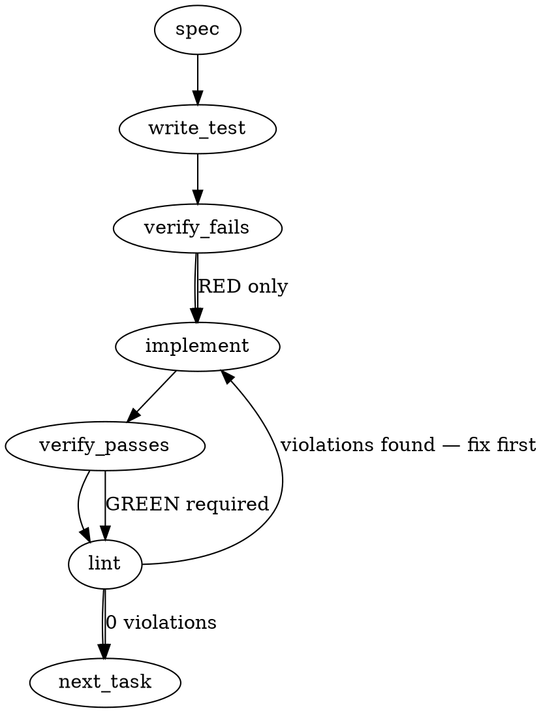

### Problem Statement

Implement two foundational security rules (ADR-089 attack surfaces 1 and 2) as `immutable: true` compile-time gates with `error` severity. Rule #1486 detects unauthorized child process spawning (exempting build paths via `.totemignore`), and Rule #1487 detects dynamic code evaluation using non-literal arguments, both leveraging the new compound ast-grep engine.

### Architectural Context

- **ADR-089 Security Baseline Pack:** These rules form the first layer of the zero-trust governance model for preventing injection vulnerabilities.
- **ADR-087 Compound ast-grep Rules:** Determines the contract. Rules must be defined using full `NapiConfigSchema` structural shapes via `astGrepYamlRule` (or its markdown equivalent) instead of standard flat strings, as seen in `packages/core/src/lesson-pattern.ts`.
- **Pre-1.15.0 Review Pipeline:** These changes are critical precursors for the Phase B "Distribution Pipeline".

### Files to Examine

1. `packages/core/src/lesson-pattern.ts` — Review the `ManualPattern` interface (specifically the mutually exclusive nature of `pattern` and `astGrepYamlRule`).
2. `packages/core/src/compiler-schema.ts` — Ensure `RuleEventContext` and schema definitions correctly consume `severity` and `immutable` flags.
3. `packages/pack-agent-security/.totemignore` — the pack-shipped template exempts `scripts/`, `.github/**`, `**/*.test.*`, and `**/*.spec.*`. PR1 mirrors these exclusions inside each rule's `fileGlobs` (belt-and-suspenders).
4. `packages/cli/src/commands/run-compiled-rules.ts` — Review how rule failures are collected and emitted to verify the integration test approach.

### Technical Approach & Contracts

We will implement these rules as Totem `.md` lesson files (or pack YAML configurations, following standard convention) in the security pack directory.

**Contract 1: Frontmatter Configuration**
Each rule must define the following metadata contract to satisfy ticket G and acceptance criteria:

```yaml
immutable: true
severity: error
```

**Contract 2: Spawning Rule (Rule #1486) ast-grep Structure**
Use a compound `any` rule matching various process execution mechanisms:

- Standard `require` calls for `child_process` and `node:child_process`.
- Named imports mapped to `spawn`, `exec`, `execSync`, `execFile`, `fork`.
- Third-party equivalents (e.g., `execa`).
  _Note: Path exclusion is strictly handled by `.totemignore` per the ADR, not within the AST query._

**Contract 3: Dynamic Eval Rule (Rule #1487) ast-grep Structure**
Use a compound rule targeting `eval(...)`, `new Function(...)`, and `vm.runIn*Context(...)`.
Crucially, use ast-grep's `not` clause to filter out static strings:

- Match argument `$ARG`.
- Filter out: `not: { kind: string }`
- Filter out template strings _without_ interpolations: `not: { kind: template_string, pattern: '`$STR`' }` (depending on the exact AST tree for tree-sitter-typescript).

### Edge Cases & Traps

- **Prefix Evasion:** Attackers often use `node:child_process` instead of `child_process`. The ast-grep rule must catch both.
- **Indirect Eval:** Catching `(0, eval)(userInput)` or `const e = eval; e(userInput)`. Ensure the ast-grep rule accounts for aliased or indirect invocations where possible within a single compound rule, or explicitly note limits.
- **Template Literals as "Literals":** A backtick string without variables (`` `static` ``) is a literal and should pass. If the rule blindly flags the `template_string` AST node, it will create false positives.
- **Aliased Imports:** `import { spawn as runCmd } from 'child_process'; runCmd(userInput);`. Tree-sitter handles local scopes to an extent, but explicit aliases might require specific ast-grep relational matching.
- **Test execution pollution:** In integration tests, use the shared helper `safeExec` instead of `execSync` to invoke `totem lint`, guaranteeing proper cross-platform timeout and error handling.

### Implementation Tasks

- [ ] **Task 1: Scaffold Rule #1486 (Unauthorized Process Spawning)**
  - Create the rule definition file in the security pack directory (e.g., `packs/security/rules/unauthorized-process-spawning.md`).
  - Add frontmatter defining `immutable: true` and `severity: error`.
  - Define the compound ast-grep YAML block targeting `child_process` (with and without `node:` prefix) and `execa`.
  - Include a `badExample` and `goodExample` section per acceptance criteria.
    > TOTEM INVARIANT (Compound ast-grep schema): The rule definition must use `astGrepYamlRule` shape (NapiConfigSchema) as flat pattern strings cannot handle the relational complexity required.
    > TEST DIRECTIVE: Before implementing, write a failing unit test named `detects node-prefixed child_process spawn` and `detects standard child_process spawn`.
  - Write test (or update existing) → verify fails → implement → verify passes → lint

- [ ] **Task 2: Configure `.totemignore` and Unit Tests for Rule #1486**
  - Verify or update `.totemignore` to ensure `scripts/` and `build/` are ignored.
  - Create standard test fixtures `bad.ts` (spawn call in `src/`) and `good.ts` (spawn in `scripts/`).
  - Write test (or update existing) → verify fails → implement → verify passes → lint

- [ ] **Task 3: Scaffold Rule #1487 (Dynamic Eval with Non-Literals)**
  - Create the rule definition file (e.g., `packs/security/rules/dynamic-eval-non-literal.md`).
  - Add `immutable: true` and `severity: error` frontmatter.
  - Define the compound ast-grep YAML block matching `eval`, `new Function`, and `vm.runInNewContext`.
  - Implement the `not` filter to explicitly allow string literals and static template literals.
    > TEST DIRECTIVE: Before implementing, write a failing test named `rejects eval with identifier argument` and `allows eval with static template string`.
  - Write test (or update existing) → verify fails → implement → verify passes → lint

- [ ] **Task 4: Unit Tests for Rule #1487**
  - Create test fixtures `bad.ts` (`eval(req.body.code)`, `new Function(userInput)`) and `good.ts` (`eval('2 + 2')`, ``eval(`2 + 2`)``).
  - Write test (or update existing) → verify fails → implement → verify passes → lint

- [ ] **Task 5: End-to-End Integration Tests**
  - Modify the CLI test suite (`packages/cli/tests/run-compiled-rules.test.ts` or equivalent integration file).
  - Use the shared helper `import { safeExec } from '@mmnto/totem'` to run `totem lint` against a temporary directory mimicking the project structures.
  - Assert that `totem lint` exits with a non-zero code for `src/` spawning and dynamic eval, but exits with `0` for `scripts/release.ts` spawning.
  - Write test (or update existing) → verify fails → implement → verify passes → lint

### Execution Flow (structural constraint)



### Verification (MANDATORY — do not skip)

Every implementation MUST end with these steps:

1. `totem lint` — deterministic rule check (zero LLM, ~2s). Fixes any violations.
2. `totem review` — AI-powered architectural review (~18s). Addresses any critical findings.
3. If using MCP, call `verify_execution` to confirm compliance before declaring the task done.

### Test Plan

- **Unit Test (Rule #1486):** Parse AST against `bad.ts` (catches `const { spawn } = require('node:child_process')` and `execa('cmd')`). Assert `good.ts` parses clean.
- **Unit Test (Rule #1487):** Parse AST against `bad.ts` (catches `eval(foo)`, `eval('1' + bar)`, `new Function(x)`). Assert `good.ts` (evaluating `"1+1"` and `` `1+1` ``) passes.
- **Integration Test:** Run `safeExec('totem lint')` on the repository itself. Ensure zero false positives occur on existing codebase (proving `.totemignore` exempts legitimate internal scripts).
- **Smoke Gate Assertions:** Ensure compile-time pipeline validates `badExample` triggers rule and `goodExample` avoids rule for both definitions.
