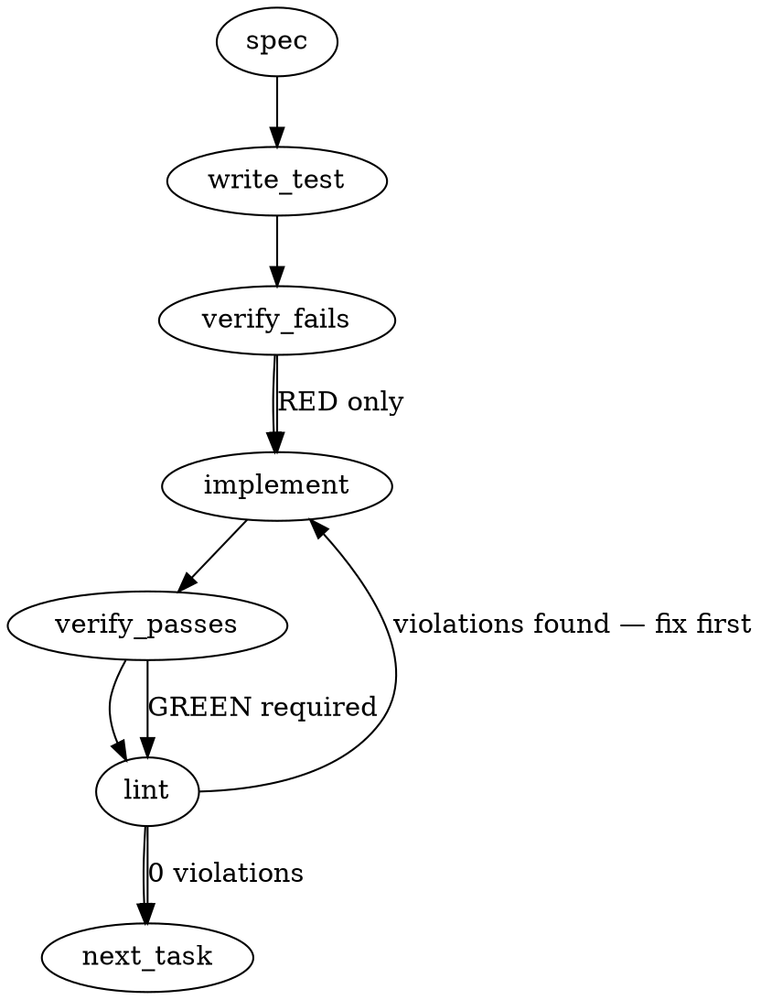

### Problem Statement

Implement a security rule to detect obfuscated string concatenation and assembly primitives (e.g., character array joins, `fromCharCode` abuse) commonly used to dynamically construct malicious shell commands or URLs while evading static analysis. The rule implementation must strictly follow the validated pattern catalog generated by spike #1489 and ensure zero false positives on the Totem repository.

### Architectural Context

- **ADR-089:** This addresses attack surface 4 of 4, restricting runtime instrumentation and operating strictly at the commit-boundary.
- **Rule Upgrades & Cache Eviction:** Based on the Pipeline Engine Wiki, noisy rules can be upgraded using context telemetry via `totem compile --upgrade <hash>`. Ensure the rule ID and metadata (like `immutable: true` and `severity: error|warning`) are correctly established so telemetry and compilation routing function correctly if this rule needs future refinement.
- **Rule Event Context:** The rule engine surfaces rule failures with specific AST contexts (`RuleEventContext` in `compiler-schema.ts`). The rule must correctly target the AST nodes (e.g., strings, code arrays) so the runtime engine maps the context accurately.

### Files to Examine

1. `packages/core/src/compiler-schema.ts` — Review `RuleEventContext` and standard Totem rule metadata structures to ensure correct schema compliance (e.g., `immutable`, `severity`).
2. `packages/core/src/semgrep-adapter.ts` — Review `parseSemgrepRules` to understand how the rule YAML will be parsed and what causes skipped rules (ensure valid YAML syntax and required fields).
3. `Spike #1489 output` (Jira/GitHub issue) — **CRITICAL**: Do not proceed without reading the validated pattern catalog from this spike.

### Technical Approach & Contracts

**Approach**:

1. **Catalog Retrieval**: Extract the validated `ast-grep` or `semgrep` patterns from Spike #1489.
2. **Rule Definition**: Create a new YAML rule definition. The rule must target specific AST primitives such as:
   - Character code mapping (e.g., `String.fromCharCode(...)`)
   - Single-character array joins (e.g., `['b','a','s','h'].join('')`)
   - Obfuscated binary string concatenations resolving to execution sinks (`exec`, `spawn`, `fetch`).
3. **Metadata Contract**: The YAML must include:
   - `id`: `pack-security-obfuscated-string-concat`
   - `severity`: `error` (default). If the spike catalog indicates residual false positive risk, set to `warning` and document the `totem doctor` escalation path in the message.
   - `metadata`: `immutable: true`
   - `badExample` and `goodExample` blocks derived directly from the spike.

**Contracts**:

- Output rule schema must strictly conform to the parser logic in `parseSemgrepRules` / standard Totem rule schema.

### Edge Cases & Traps

- **Trap — False Positives on Legitimate Code:** Standard string concatenation (e.g., `const path = dir + '/' + file`) or legitimate array joins must not trigger the rule. The pattern must tightly match _obfuscation_ characteristics (e.g., highly fragmented literals, hex escapes mapped to variables).
- **Trap — Premature Execution:** Starting implementation before Spike #1489 is definitively closed and its pattern catalog is published.
- **Race Condition in Shell Assembly Tests:** If writing integration tests that actually evaluate obfuscated strings, ensure no actual malicious commands are executed locally or in CI environments. Always stub execution sinks.
- **AST Node Misses:** Template literals vs. standard string concatenation. The rule must account for `${'b'}${'a'}${'s'}${'h'}` style obfuscation if included in the spike catalog.

### Implementation Tasks

- [ ] **Task 1: Scaffold Rule Definition & Apply Spike Patterns**
  - Read the validated patterns from spike #1489.
  - Create the new rule file (e.g., `packages/pack-security/rules/obfuscated-string-concat.yml` or standard rule directory).
  - Define the rule ID, `severity` (based on spike FP analysis), and set `immutable: true` in metadata.
  - Insert the YAML patterns corresponding to the spike catalog.
  - Populate `badExample` and `goodExample` fields verbatim from the spike.
  - write test (or update existing) → verify fails → implement → verify passes → lint

- [ ] **Task 2: Implement Unit Tests for Obfuscation Primitives**
  - Create or update the relevant rule test file (e.g., `packages/pack-security/tests/obfuscated-string-concat.test.ts`).
    > TEST DIRECTIVE: Before implementing, write a failing test named `rejects array join string obfuscation targeting shell execution` that proves the rule catches `['e','x','e','c'].join('')`.
  - Add specific assertions ensuring the rule catches `String.fromCharCode` abuse and heavily fragmented string concatenation.
  - Ensure tests assert that standard path concatenation (`base + '/' + filename`) passes without triggering the rule.
  - write test (or update existing) → verify fails → implement → verify passes → lint

- [ ] **Task 3: Repository-wide Zero-FP Validation**
  - Run the new rule against the entire Totem repository (e.g., via `totem check` or the internal CLI equivalent).
    > TEST DIRECTIVE: Before implementing, write a failing test named `emits zero false positives across the totem codebase` if applicable to your integration test suite, or perform the manual run.
  - If false positives occur:
    - If the spike guaranteed zero FPs: Refine the rule's AST patterns to eliminate the FP.
    - If the spike accepted residual risk: Downgrade severity to `warning`, implement the `totem doctor` escalation string in the rule message, and add necessary inline exceptions or `.totemignore` entries.
  - write test (or update existing) → verify fails → implement → verify passes → lint

### Execution Flow (structural constraint)

### Verification (MANDATORY — do not skip)

Every implementation MUST end with these steps:

1. `totem lint` — deterministic rule check (zero LLM, ~2s). Fixes any violations.
2. `totem review` — AI-powered architectural review (~18s). Addresses any critical findings.
3. If using MCP, call `verify_execution` to confirm compliance before declaring the task done.

### Test Plan

- **True Positives**: Ensure the rule catches `['w', 'g', 'e', 't'].join('')`, `String.fromCharCode(119, 103, 101, 116)`, and fragmented concat `const a = 'sh'; const b = 'ba'; exec(b+a)`.
- **True Negatives**: Ensure standard template literals used for logging or standard variable concatenation used for pathing (`__dirname + '/foo'`) do not flag.
- **Integration**: Run the rule engine against the `goodExample` and `badExample` strings embedded in the YAML to ensure the semgrep/ast-grep adapter processes the AST nodes accurately and maps the `RuleEventContext` correctly. Verify `0` false positives across the `totem` monorepo itself.
