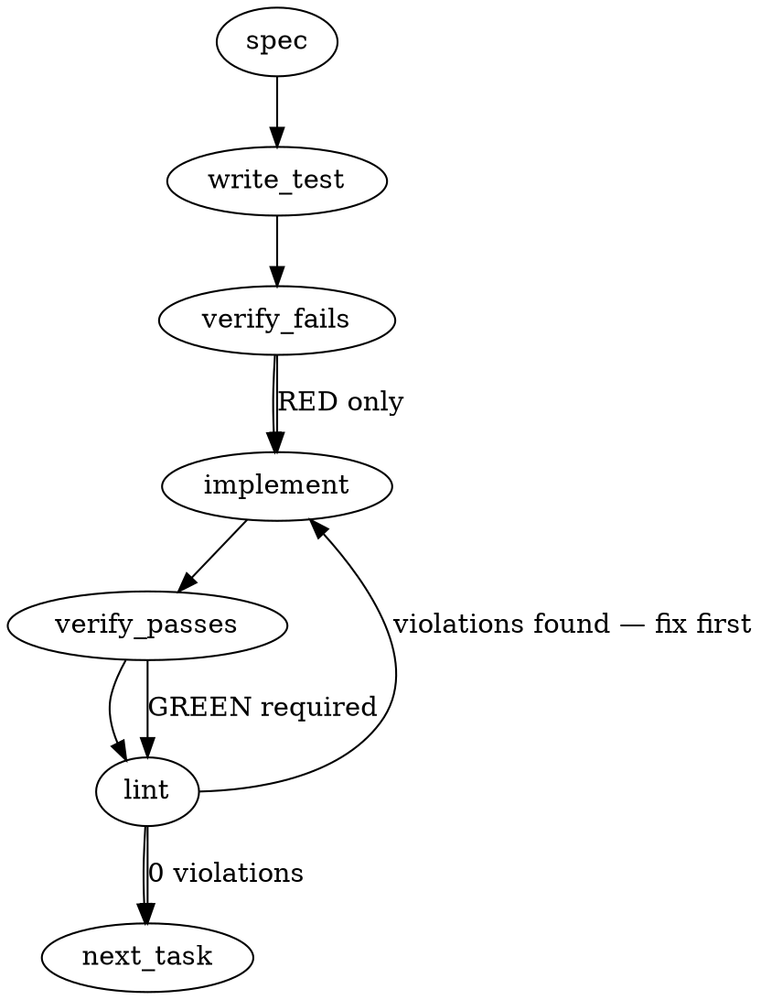

### Problem Statement

The MCP `describe_project` endpoint must be expanded to return a rich, structured "session briefing" payload without requiring multiple round-trip tool calls or LLM context lookups. This change introduces an opt-in rich payload containing Git state, package versions, rule/lesson counts, and milestone data strictly aggregated from local caches, manifests, and Git history.

### Architectural Context

- **ADR-090 (State Substrate vs. Orchestration):** This endpoint operates purely as a "substrate" capability. It reports state without attempting to route agents, evaluate capabilities, or interpret the meaning of the data.
- **Embedder Trap (Lite Tier):** Existing logic in `getDescriptionFromContext` (from `packages/mcp/src/tools/describe-project.ts`) can throw on the Lite tier because it attempts to load an embedder. The new rich state extraction MUST avoid any LLM, embedder, or live registry calls. It must rely entirely on local storage (`.totem/store/*`, git, filesystem).
- **Active Work Tracking:** Totem currently tracks release metadata, test counts, and pre-release gates in `docs/active_work.md` and compiled rules in `.totem/store/compile-manifest.json` (as seen in the "Active Work Summary" context).

### Files to Examine

1. `packages/mcp/src/schemas/describe-project.ts` — To define the expanded input/output Zod contracts.
2. `packages/mcp/src/tools/describe-project.ts` — To locate the tool registration and modify the handler logic.
3. `packages/cli/src/commands/briefing.ts` — To observe how Git state and PRs are currently extracted for standard human briefings, providing a template for MCP adaptation.

### Technical Approach & Contracts

**Backward Compatibility Strategy:** Add an optional `includeRichState: z.boolean().default(false)` parameter to the existing tool input schema. If `false` or omitted, return the legacy slim payload. If `true`, append the rich state payload.

**Data Contracts:**

```typescript
// packages/mcp/src/schemas/describe-project.ts

export const DescribeProjectInputSchema = z.object({
  includeRichState: z.boolean().optional().default(false),
  // ... existing input parameters ...
});

export const RichProjectStateSchema = z.object({
  strategyPointer: z.object({
    sha: z.string().nullable(),
    latestJournal: z.string().nullable(),
  }),
  packageVersions: z.record(z.string()), // e.g., { "@mmnto/cli": "1.14.10" }
  ruleCounts: z.object({ active: z.number(), archived: z.number(), nonCompilable: z.number() }),
  lessonCount: z.number(),
  testCount: z.number().nullable(),
  milestone: z.object({ name: z.string().nullable(), openTickets: z.number().nullable() }),
  gateTickets: z.array(z.string()), // list of pre-1.15-review tickets
  gitState: z.object({
    branch: z.string().nullable(),
    uncommittedFiles: z.array(z.string()),
  }),
  recentPrs: z.array(
    z.object({
      title: z.string(),
      date: z.string(),
      squashSha: z.string(),
    }),
  ),
});

export const DescribeProjectOutputSchema = z.intersection(
  LegacyDescribeProjectOutputSchema,
  z.object({
    richState: RichProjectStateSchema.optional(),
  }),
);
```

**Extraction Mechanisms:**

- **Git State:** Use shared helpers: `resolveGitRoot(cwd)` to verify repository presence, `getGitBranch(cwd)` for branch, and `safeExec('git', ['status', '--porcelain'])` parsed into a file list for uncommitted files (do NOT extract diff content).
- **Strategy Pointer:** Check `.strategy` submodule or `.totem/store/strategy.json`. If missing, fallback safely to `null`.
- **Package Versions:** Use `readJsonSafe` on root `package.json` (workspaces) or individual `packages/*/package.json` to extract versions for the fixed group (`@mmnto/cli`, `@mmnto/totem`, `@mmnto/mcp`).
- **Rules/Lessons:** Use `readJsonSafe` on `.totem/store/compile-manifest.json` and `.totem/store/non-compilable.json`.
- **Recent PRs:** Execute `safeExec('git', ['log', '-n', '5', '--grep=#[0-9]\\+', '--format=%s|%cI|%h'])` to capture squash-merged PRs.

### Edge Cases & Traps

- **Trap — Running Outside a Git Repository:** If `resolveGitRoot(process.cwd())` returns `null`, Git commands will throw. Git operations must be guarded.
- **Trap — Caching and Missing Files:** Local cache files (`compile-manifest.json`, `test-results.json`) or `docs/active_work.md` might not exist in a fresh clone. `readJsonSafe` throws on failure unless caught, or unless you verify file existence first. State extractors must catch `TotemParseError` or `ENOENT` and return `0`/`null` instead of crashing the MCP server.
- **Trap — Heavy I/O Blocking:** This endpoint will be hit frequently. Do not execute heavy recursive filesystem walks. Only access explicitly known paths.
- **Edge Case — Missing Shared Helpers:** Do NOT reimplement shell execution or JSON parsing. `safeExec` and `readJsonSafe` must be utilized.

### Implementation Tasks

- [ ] **Task 1: Define Extended Zod Contracts**
  - Modify `packages/mcp/src/schemas/describe-project.ts`.
  - Add `includeRichState` to the input schema.
  - Define `RichProjectStateSchema` and append it optionally to the output schema.
    > TEST DIRECTIVE: Before implementing, write a failing test named `validates rich state input and parses expected structure` that proves the schema accepts legacy requests and rejects invalid rich state shapes.
  - write test → verify fails → implement → verify passes → lint

- [ ] **Task 2: Build Safe Manifest & File Extractors**
  - Create a new extractor file, e.g., `packages/mcp/src/utils/state-extractors.ts`.
  - Implement functions to extract package versions, rule/lesson counts, and milestone data.
    > TOTEM INVARIANT (Substrate Performance): Data extractors must only read from local paths. Under no circumstances should they invoke live package registries or LLM services.
  - Use `readJsonSafe` for `package.json` and `.totem/store/compile-manifest.json`. Handle missing files by returning zeroes/nulls gracefully.
  - Parse `docs/active_work.md` lightly with regex to extract milestone strings and the `pre-1.15-review` ticket list (or default to empty if parsing fails).
    > TEST DIRECTIVE: Before implementing, write a failing test named `extracts manifest data gracefully handling missing files` that asserts fallback behavior when `.totem/store` is empty.
  - write test → verify fails → implement → verify passes → lint

- [ ] **Task 3: Build Safe Git State Extractors**
  - In `packages/mcp/src/utils/state-extractors.ts`, add Git extraction logic.
  - Use `resolveGitRoot(cwd)` to gate all git logic. If null, return empty/null git state.
  - Use `getGitBranch(cwd)` for current branch.
  - Use `safeExec` to run `git status --porcelain` (map to file names) and `git log` (map to recent PR objects).
    > TEST DIRECTIVE: Before implementing, write a failing test named `returns null git state when resolveGitRoot is null` to prevent crashes in non-repo environments.
  - write test → verify fails → implement → verify passes → lint

- [ ] **Task 4: Wire Tool Implementation & Opt-in Logic**
  - Modify `packages/mcp/src/tools/describe-project.ts`.
  - Update `registerDescribeProject` input parsing to accept `includeRichState`.
  - If `includeRichState` is true, invoke the extractors from Tasks 2 & 3 concurrently (using `Promise.all` for performance) and attach the `richState` object to the response.
    > TEST DIRECTIVE: Before implementing, write a failing test named `does not include rich state by default ensuring backwards compatibility` that proves standard callers get the legacy shape.
  - write test → verify fails → implement → verify passes → lint

- [ ] **Task 5: End-to-End Integration Test**
  - Add an integration test in `packages/mcp/test/integration/describe-project.test.ts`.
  - Call the handler simulating an MCP request with `{ includeRichState: true }`.
  - Verify that the returned payload contains the schema structure populated with real data from the Totem repository itself (e.g., package versions for `@mmnto/cli` exist, recent PRs array is populated).
  - write test → verify fails → implement → verify passes → lint

### Execution Flow (structural constraint)



### Verification (MANDATORY — do not skip)

Every implementation MUST end with these steps:

1. `totem lint` — deterministic rule check (zero LLM, ~2s). Fixes any violations.
2. `totem review` — AI-powered architectural review (~18s). Addresses any critical findings.
3. If using MCP, call `verify_execution` to confirm compliance before declaring the task done.

### Test Plan

- **Unit (Contracts):** Validate `DescribeProjectInputSchema` and `DescribeProjectOutputSchema` strictly reject malformed config payloads.
- **Unit (Extractors - Missing State):** Mock filesystem (`readJsonSafe` throwing) and Git (`resolveGitRoot` returning null) to prove graceful degradation to `null`/`0` values instead of hard crashes.
- **Unit (Extractors - Valid State):** Supply mocked git logs and `compile-manifest.json` strings, assert accurate data aggregation (branch name, uncommitted files array, N=5 PR array mapping).
- **Integration (Self-Host Test):** Invoke the full `describe_project` handler with `includeRichState: true` targeting the live Totem repository. Assert that package versions, recent PRs, and branch data resolve accurately. Verify the tool executes in < 500ms (fast substrate response).

## Implementation Design

### Scope

**In scope.** Add opt-in `includeRichState: boolean` input parameter to the existing `describe_project` MCP tool. When true, the handler appends a `richState` field to its JSON payload containing git state, strategy submodule pointer, package versions (fixed group only), rule and lesson counts, milestone + gate-ticket summary parsed from `docs/active_work.md`, and the five most recent merged PRs from `git log`. Introduce a dedicated extractor module (`packages/mcp/src/state-extractors.ts`) with per-section functions that degrade gracefully to null/zero/empty when source files are missing. Zod schemas move to a new `packages/mcp/src/schemas/describe-project.ts`.

**Out of scope.** Caching GitHub milestone or label state (file follow-up for `.totem/store/github-state.json` + a `totem gh-sync` command). Live test-count measurement (null for v1; file follow-up for postmerge-stamped `.totem/store/test-stats.json`). Multi-repo federation (the endpoint returns one repo's state). Legacy slim-payload consumers change at all.

### Data model deltas

**New file `packages/mcp/src/schemas/describe-project.ts`:**

- `DescribeProjectInputSchema = z.object({ includeRichState: z.boolean().optional().default(false) })`. Defaults via `.default(false)` so empty-input legacy calls are byte-identical to today.
- `StrategyPointerSchema = z.object({ sha: z.string().nullable(), latestJournal: z.string().nullable() })`. SHA is short-form (7 chars). `latestJournal` is the filename with no path.
- `GitStateSchema = z.object({ branch: z.string().nullable(), uncommittedFiles: z.array(z.string()), truncated: z.boolean() })`. `uncommittedFiles` is capped at 50; `truncated: true` when cap exceeded.
- `RecentPrSchema = z.object({ title: z.string(), date: z.string(), squashSha: z.string() })`. Date is ISO-8601 string. SHA is short-form.
- `MilestoneStateSchema = z.object({ name: z.string().nullable(), gateTickets: z.array(z.string()), bestEffort: z.literal(true) })`. `bestEffort` marker signals that parsing came from `active_work.md` regex and may miss ground truth.
- `RuleCountsSchema = z.object({ active: z.number().int().nonnegative(), archived: z.number().int().nonnegative(), nonCompilable: z.number().int().nonnegative() })`.
- `RichProjectStateSchema = z.object({ strategyPointer, gitState, packageVersions: z.record(z.string()), ruleCounts, lessonCount, testCount: z.number().nullable(), milestone, recentPrs: z.array(RecentPrSchema) })`.
- `DescribeProjectOutputSchema = LegacyProjectDescriptionSchema.extend({ richState: RichProjectStateSchema.optional() })`. Backward-compat: `richState` is optional; legacy shape unchanged when omitted.

**New file `packages/mcp/src/state-extractors.ts`:**

Eight per-section async functions, each returning the appropriate schema shape or falling back to null/zero/empty:

- `extractGitState(cwd): Promise<z.infer<typeof GitStateSchema>>`
- `extractStrategyPointer(cwd): Promise<z.infer<typeof StrategyPointerSchema>>`
- `extractPackageVersions(cwd): Promise<Record<string, string>>` — walks fixed-group entries only
- `extractRuleCounts(cwd, totemDir): z.infer<typeof RuleCountsSchema>` — reads `.totem/compiled-rules.json` with `CompiledRulesFileSchema` from core
- `extractLessonCount(cwd, totemDir): number`
- `extractMilestoneState(cwd): z.infer<typeof MilestoneStateSchema>` — regex-parses `docs/active_work.md`
- `extractTestCount(cwd): number | null` — v1 always returns null
- `extractRecentPrs(cwd, n = 5): Promise<RecentPr[]>` — `git log -n 5 --grep="#[0-9]+" --format="%s|%cI|%h"`

No new module-level state. No singletons. No reserved keys.

### State lifecycle

All state is **per-request**. Every tool invocation re-reads source files and re-runs git commands. No caching across requests. This is deliberate: the endpoint is meant to reflect current truth at call time; caching would drift immediately because the underlying files (git HEAD, compile-manifest, active_work) change frequently.

- Scope: per-request
- Lifetime: one MCP handler invocation, ~50-200ms
- Ownership: each extractor owns its section; tool handler composes via `Promise.all`

No state crosses lifecycle boundaries.

### Failure modes

| Failure                                                 | Category            | Agent-facing surface                                                                                                                                     | Recovery                                                    |
| ------------------------------------------------------- | ------------------- | -------------------------------------------------------------------------------------------------------------------------------------------------------- | ----------------------------------------------------------- |
| `includeRichState: true` on cwd outside a git repo      | runtime             | `richState.gitState: { branch: null, uncommittedFiles: [], truncated: false }` + `strategyPointer: { sha: null, latestJournal: null }` + `recentPrs: []` | null/empty payload sections; no throw                       |
| `.strategy` submodule absent                            | runtime             | `strategyPointer: { sha: null, latestJournal: null }`                                                                                                    | null payload section                                        |
| `.totem/compiled-rules.json` missing or malformed       | runtime             | `ruleCounts: { active: 0, archived: 0, nonCompilable: 0 }`                                                                                               | zero counts; no throw                                       |
| `.totem/lessons/` missing                               | runtime             | `lessonCount: 0`                                                                                                                                         | zero count                                                  |
| `docs/active_work.md` missing                           | runtime             | `milestone: { name: null, gateTickets: [], bestEffort: true } `                                                                                          | null + empty + best-effort marker                           |
| `docs/active_work.md` present but regex parse fails     | runtime             | same as missing                                                                                                                                          | null + empty + best-effort marker                           |
| `git log` fails (hangs, permission, empty history)      | runtime             | `recentPrs: []`                                                                                                                                          | empty array                                                 |
| Uncommitted files exceed cap (50)                       | runtime             | `gitState.uncommittedFiles.length === 50`, `truncated: true`                                                                                             | truncation marker; agent knows to not rely on the file list |
| Package version extraction fails on one package         | runtime             | `packageVersions` omits that package                                                                                                                     | partial; no throw                                           |
| `safeExec` returns non-zero on `git status --porcelain` | transient           | `gitState.uncommittedFiles: []`, `truncated: false`                                                                                                      | empty array                                                 |
| Malformed `compiled-rules.json` (Zod parse fail)        | runtime             | zeros + debug log via `console.warn`                                                                                                                     | no throw; counts default to zero                            |
| Lite-tier embedder failure in legacy path               | (existing behavior) | legacy fallback already handles                                                                                                                          | unchanged from today                                        |

Every row returns a partial payload with explicit null/empty/zero values. No silent degradation that hides failure. The `bestEffort: true` flag on milestone is the one case where downstream agents see "yes we tried, trust this loosely."

### Invariants to lock in via tests

1. `describe_project({})` returns the legacy shape byte-identical to today's output (no `richState` field in JSON).
2. `describe_project({ includeRichState: false })` returns legacy shape (same as above).
3. `describe_project({ includeRichState: true })` returns legacy shape plus a `richState` field whose JSON parses through `RichProjectStateSchema`.
4. Outside a git repository, `richState.gitState.branch === null` and `richState.gitState.uncommittedFiles.length === 0`, without throwing.
5. When `.totem/compiled-rules.json` is absent, `richState.ruleCounts === { active: 0, archived: 0, nonCompilable: 0 }`.
6. `richState.gitState.uncommittedFiles.length <= 50` always, and `truncated: true` whenever real count exceeded 50.
7. `richState.recentPrs.length <= 5` always, ordered newest-first by commit date.
8. `richState.testCount === null` on v1 (explicit null, not undefined).
9. Integration test on the live Totem repo: `richState.packageVersions['@mmnto/cli']` is a non-empty string matching the current `1.14.10` or newer. `richState.strategyPointer.sha` is a 7-char hex. Handler completes in < 500ms.
10. Schema contract: the wire JSON is parseable by both a strict-Zod client and a permissive JSON.parse client. No custom serialization.

### Open questions

- **Question:** Extract milestone + gate-ticket info via fragile regex on `docs/active_work.md`, or leave those fields null for v1 and file a follow-up for a proper cached-GH-state source?
  - **Options:**
    - (a) Regex-parse `active_work.md`. Captures "1.15.0" and the `pre-1.15-review` ticket list today. Drifts silently when the doc layout changes.
    - (b) Null for v1. Clean but the main briefing-cost-reduction goal loses a chunk of value until the cache lands.
    - (c) Regex-parse WITH a `bestEffort: true` marker on the milestone payload so agents know to treat it as hint-quality, not ground truth. Follow-up ticket files a proper `.totem/store/github-state.json` sync command.
  - **Recommendation:** (c). Delivers the value now, honestly flags the limitation, teed up replacement. Follow-up ticket gets filed in the PR body.

- **Question:** Single endpoint with opt-in param (`includeRichState`), or a separate endpoint (`describe_project_full` / `get_project_briefing`)?
  - **Options:**
    - (a) Single endpoint + opt-in param. Clean, one registration, legacy callers unchanged.
    - (b) Separate endpoint. Legacy surface untouched but two tools with overlapping semantics.
  - **Recommendation:** (a). Matches spec. Two tools with overlapping semantics is a maintenance footgun.

- **Question:** Uncommitted-files cap value?
  - **Options:** 50, 100, 200.
  - **Recommendation:** 50. Enough to see scope; small enough to not blow up the payload on a dirty tree. Adjustable via a constant; cap exceedance signals `truncated: true` so agents can fetch details via a separate tool if needed.

- **Question:** Where to house the extractor module?
  - **Options:** `packages/mcp/src/state-extractors.ts` (flat), `packages/mcp/src/utils/state-extractors.ts` (subdirectory).
  - **Recommendation:** Flat. The mcp package currently has a single `utils.ts` at root and no `utils/` subdirectory. Keep structure flat until forced.
