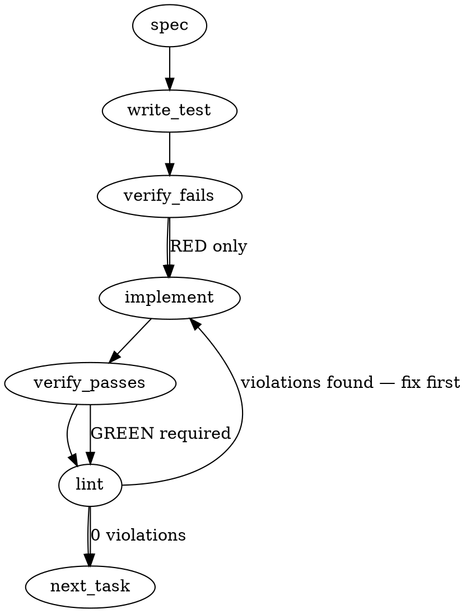

### Problem Statement

The `totem spec <topic>` command currently outputs generated specifications to `stdout` by default, breaking automated preflight workflows that expect the file to automatically land in `.totem/specs/<topic>.md`. The command needs to default to saving to this disk location based on the Git repository root, introduce a `--stdout` flag for the legacy piping behavior, and log a success message to `stderr` when saving to disk.

### Architectural Context

- **Workflow Automation / Preflight Skill Gap**: Documented in the provided Totem Knowledge, AI agents (Claude) rely on the `/preflight <issue>` skill which explicitly expects `.totem/specs/<issue-number>.md` to exist after running `totem spec`. Failing to persist this file costs ~60s LLM round trips and breaks downstream phases.

### Files to Examine

1. `packages/cli/src/commands/spec.ts` — Contains `specCommand` and likely the `SpecOptions` interface. This is where the core output logic must be refactored.
2. `packages/cli/src/index.ts` (or equivalent CLI router) — Where the `--stdout` flag needs to be registered for the commander/yargs CLI definition.
3. `packages/cli/tests/commands/spec.test.ts` (or equivalent test file) — To add testing for the new default file output behavior and conflicting flag rejection.

### Technical Approach & Contracts

**Design Decision (Naming Convention):** Standardize strictly on `<sanitized-topic>.md`. Whatever the user passes as the topic (`1555`, `ticket-004`, or `login-bug`), sanitize it by replacing non-alphanumeric characters (excluding dashes/underscores) with dashes, and append `.md`. This requires zero inference and safely supports all observed workflows (issue numbers and slugs).

**Contracts:**

1. Update `SpecOptions` interface (likely in `packages/cli/src/commands/spec.ts` or a shared types file):

```typescript
export interface SpecOptions {
  out?: string;
  stdout?: boolean; // NEW: true to force stdout piping
  // ... existing options
}
```

**Sequence Logic:**

1. Validate options: If `options.stdout` AND `options.out` are both truthy, throw an error.
2. Generate the spec content via the existing embedding/LLM flow.
3. Determine output destination:
   - If `options.stdout === true`: write to `process.stdout.write(...)`.
   - If `options.out` exists: use that exact path.
   - Else (Default):
     - Call shared helper `resolveGitRoot(process.cwd())`. Fallback to `process.cwd()` if `null`.
     - Sanitize `inputs[0]` (the topic): `topic.replace(/[^a-zA-Z0-9-_]/g, '-')`.
     - Target path = `path.join(gitRoot, '.totem', 'specs', `${sanitizedTopic}.md`)`.
4. Disk Writing:
   - Ensure directory exists: `fs.mkdirSync(path.dirname(targetPath), { recursive: true })`.
   - Write file: `fs.writeFileSync(targetPath, content)`.
   - Print status to stderr via existing UI helper: `log.success(\`Spec saved to ${path.relative(process.cwd(), targetPath)}\`)`.

### Edge Cases & Traps

- **Trap (Working Directory Context):** If a developer runs `totem spec` from deep within a monorepo (`e.g., packages/core`), writing to `./.totem/specs/` will create an orphaned specs folder. You MUST resolve the Git root first to ensure specs consolidate at `<repo-root>/.totem/specs/`.
- **Trap (Conflicting Flags):** Providing both `--out custom.md` and `--stdout` makes no sense and indicates user confusion. This must be a hard error before making LLM calls.
- **Trap (Path Traversal via Topic):** A user typing `totem spec ../../../etc/passwd` or `totem spec foo/bar` could traverse out of the `.totem/specs` directory or create accidental nested structures. Strict sanitization of the topic string is required.
- **Trap (Missing `.totem/specs` directory):** The `.totem/specs` folder might not exist on fresh clones. `fs.mkdirSync` with `{ recursive: true }` is mandatory.

### Implementation Tasks

- [ ] **Task 1: Add CLI Flags & Validation Logic**
  - Update the CLI entry point (where `totem spec` flags are defined) to accept the `--stdout` boolean flag.
  - Update `SpecOptions` interface to include `stdout?: boolean`.
  - In `specCommand` (`packages/cli/src/commands/spec.ts`), immediately validate that `options.stdout` and `options.out` are not used together. Throw a user-friendly error if they are.
    > TEST DIRECTIVE: Before implementing, write a failing test named `rejects simultaneous use of --stdout and --out flags` in the spec command test file that proves this validation works before any LLM calls are made.
  - write test (or update existing) → verify fails → implement → verify passes → lint

- [ ] **Task 2: Path Resolution and Topic Sanitization**
  - In `specCommand`, implement the output path resolution.
  - Import and use the shared helper `resolveGitRoot`.
  - Create a sanitizer function for the topic parameter that replaces any character other than `a-z`, `A-Z`, `0-9`, `-`, and `_` with a hyphen (`-`).
  - Calculate the default target path: `${gitRoot || process.cwd()}/.totem/specs/${sanitizedTopic}.md`.
    > TEST DIRECTIVE: Before implementing, write a failing test named `resolves default save path based on git root and sanitizes topic` testing the pure path resolution logic (mocking `process.cwd` and `resolveGitRoot` if necessary).
  - write test (or update existing) → verify fails → implement → verify passes → lint

- [ ] **Task 3: Implement Output Routing and Disk Writing**
  - In `specCommand`, modify the final output step.
  - If `options.stdout` is true, write to `stdout` (current behavior).
  - Otherwise, create the directory using `fs.mkdirSync(..., { recursive: true })` and write the spec using `fs.writeFileSync`.
  - After saving to disk, use the `log` helper (imported from `../ui.js`) to output a success message to `stderr` containing the relative path from `process.cwd()` to the written file.
    > TEST DIRECTIVE: Before implementing, write a failing test named `writes spec to disk and logs to stderr by default` that verifies `fs.writeFileSync` is called with the correct path, and `process.stdout.write` is NOT called when no output flags are provided.
  - write test (or update existing) → verify fails → implement → verify passes → lint

### Execution Flow (structural constraint)



### Verification (MANDATORY — do not skip)

Every implementation MUST end with these steps:

1. `totem lint` — deterministic rule check (zero LLM, ~2s). Fixes any violations.
2. `totem review` — AI-powered architectural review (~18s). Addresses any critical findings.
3. If using MCP, call `verify_execution` to confirm compliance before declaring the task done.

### Test Plan

- **Conflicting Flags:** Execute `totem spec 123 --out custom.md --stdout`. Expect immediate CLI error with zero LLM API calls.
- **Default Behavior:** Execute `totem spec "ticket/123!"`. Expect `.totem/specs/ticket-123-.md` to be created. Expect `stderr` to contain "Spec saved to ...". Expect `stdout` to be empty.
- **Subdirectory Execution:** cd into `packages/cli` and run `totem spec 999`. Expect the file to be created at `<repo-root>/.totem/specs/999.md`, NOT `packages/cli/.totem/specs/999.md`.
- **Legacy stdout pipe:** Execute `totem spec 123 --stdout`. Expect the spec markdown to print purely to `stdout` (meaning it can be safely piped like `totem spec 123 --stdout | grep ...`) with no `stderr` success logs breaking the pipe.
