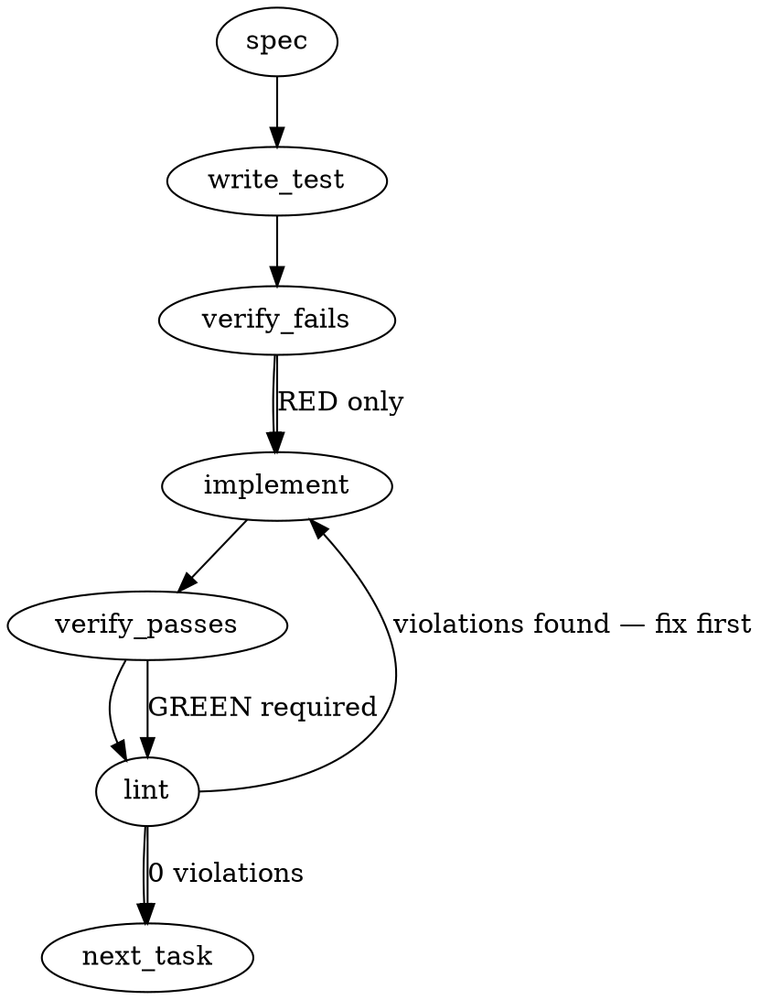

### Problem Statement

The `totem lesson compile` command currently overwrites lifecycle fields (`status`, `archivedReason`, `archivedAt`) during `--force` regeneration and lacks a mechanism to detect output-hash drift after manual or inline archiving. A new `--refresh-manifest` flag, an additive merge pass for lifecycle fields during recompilation, and a first-class `totem lesson archive <hash>` command must be implemented to support durable inline archiving without breaking `totem verify-manifest`.

### Architectural Context

This fix addresses three converging issues identified in #1587 and LC Claude Session (Items 7 and 8). It builds upon the input-hash drift precedent from #1348 and #1337. The atomic operation matches the primitive shape of `totem rules promote` added in #1581 (zero-trust workflow). Archive fields are considered part of the canonical rules subset and must continue to be included in the manifest hash to maintain integrity guarantees.

### Files to Examine

1. `packages/cli/src/commands/compile.ts` — Location of the compile command logic, where `--refresh-manifest` flag and `--force` lifecycle merging must be injected.
2. `packages/cli/src/commands/rule.ts` — Contains `rulePromoteCommand` which exports domain utilities (`loadCompiledRulesFile`, `generateOutputHash`, `readCompileManifest`, `writeCompileManifest`) that must be reused for the archive and refresh functions.
3. `packages/cli/src/commands/lesson.ts` — Location to register the new `totem lesson archive` atomic command.
4. `.claude/skills/postmerge/SKILL.md` — The workflow documentation that currently prescribes an unsupported hand-rolled script pattern which must be updated.

### Technical Approach & Contracts

1. **Compile Output Lifecycle Merge (`--force` fix):** Before writing the newly compiled rules to `compiled-rules.json`, the compile pipeline must read the existing `compiled-rules.json` (using `loadCompiledRulesFile`). For any rule hash/ID that still exists in the newly compiled output, map over the `status`, `archivedReason`, and `archivedAt` properties from the old state to the new state.
2. **Refresh Manifest Flag:** Add a boolean `--refresh-manifest` argument to the compile command. If true, bypass LLM compilation. Load `compiled-rules.json`, run `generateOutputHash()`, read `compile-manifest.json` via `readCompileManifest()`, update its `output_hash` and `compiled_at`, and save via `writeCompileManifest()`.
3. **Atomic Archive Command:** Implement `totem lesson archive <hash> [--reason <string>]`. This command will:
   - Use `loadCompiledRulesFile()` or `readJsonSafe()` to load current rules.
   - Find the rule by hash. If missing, fail fast.
   - Set `status: 'archived'`, `archivedReason: reason || 'Archived via CLI'`, and `archivedAt: new Date().toISOString()`.
   - Write back to `compiled-rules.json`.
   - Invoke the same `generateOutputHash` / `writeCompileManifest` logic used by the refresh flag.
   - Trigger the export regenerator.

**Data Contracts:**

```typescript
interface ArchiveCommandArgs {
  hash: string;
  reason?: string;
}

// Ensure the compiled rule type allows for lifecycle fields
interface CompiledRule {
  // ... existing fields ...
  status?: 'active' | 'archived';
  archivedReason?: string;
  archivedAt?: string;
}
```

### Edge Cases & Traps

- **Race conditions in Archive:** Modifying the JSON file manually outside the CLI while the `archive` command is running could result in lost data. Ensure read-modify-write happens synchronously or with file locks if available in the CLI context.
- **Dangling archives:** When merging lifecycle fields during `--force`, do NOT re-add archived rules whose underlying lessons have been deleted from `.totem/lessons.md`. Only apply the lifecycle fields to rules that survived the current `--force` compilation pass.
- **Manifest refresh bypassing:** If `--refresh-manifest` is used alongside regular compile flags (like `--force`), the CLI should prioritize the explicit explicit refresh action and exit, or enforce exclusivity. Strict exclusivity (error if combining with `--force`) is the safest architectural trap prevention.

### Implementation Tasks

- [ ] **Task 1: Implement `compile --refresh-manifest` flag**
  - Files to modify: `packages/cli/src/commands/compile.ts`
  - Update the CLI command builder to accept a boolean `--refresh-manifest` flag.
  - Implement the early exit branch: If `--refresh-manifest` is true, call `loadCompiledRulesFile`, `generateOutputHash`, update the manifest via `writeCompileManifest`, and exit 0.
    > TOTEM INVARIANT (CLI Primitive Contract): The `--refresh-manifest` flag must recompute `output_hash` without invoking the LLM or touching any lessons. It must be non-destructive.
    > TEST DIRECTIVE: Before implementing, write a failing test named `updates manifest output_hash without invoking compilation when --refresh-manifest is passed` proving the manifest hash syncs with a manually mutated rules file.
  - write test → verify fails → implement → verify passes → lint

- [ ] **Task 2: Preserve lifecycle fields during `--force` compile**
  - Files to modify: `packages/cli/src/commands/compile.ts` or the core compile orchestrator.
  - Inject a merge step right before the new `compiled-rules.json` is written.
  - Load the _existing_ compiled rules. Map the previous `status`, `archivedReason`, and `archivedAt` values onto the newly generated rules by matching their rule hash/ID.
    > TOTEM INVARIANT (Additive Lifecycle): `--force` must preserve `status`, `archivedReason`, and `archivedAt` additively. It must merge forward, not regenerate.
    > TEST DIRECTIVE: Before implementing, write a failing test named `preserves status and archived fields when compiling with force flag` ensuring existing archived rules stay archived after a `--force` recompile.
  - write test (or update existing) → verify fails → implement → verify passes → lint

- [ ] **Task 3: Create `totem lesson archive` command**
  - Files to modify: `packages/cli/src/commands/lesson.ts` (or `archive.ts`)
  - Create the command handler for `totem lesson archive <hash> [--reason]`.
  - Load rules, find the target rule, mutate `status: 'archived'` along with timestamp and reason.
  - Write rules, refresh manifest (using the same domain logic as Task 1), and trigger export regeneration.
    > TEST DIRECTIVE: Before implementing, write a failing test named `archives a lesson rule, updates output hash, and regenerates exports` proving that the atomic command correctly mutates all required downstream artifacts.
  - write test → verify fails → implement → verify passes → lint

- [ ] **Task 4: Update postmerge workflow documentation**
  - Files to modify: `.claude/skills/postmerge/SKILL.md`
  - Update Step 5. Remove instructions regarding `scripts/archive-bad-postmerge-*.cjs`.
  - Instruct the model/user to run `totem lesson archive <hash> --reason "..."` directly.
  - write test (N/A for markdown docs) → verify fails (N/A) → implement → verify passes (N/A) → lint

### Execution Flow (structural constraint)



### Verification (MANDATORY — do not skip)

Every implementation MUST end with these steps:

1. `totem lint` — deterministic rule check (zero LLM, ~2s). Fixes any violations.
2. `totem review` — AI-powered architectural review (~18s). Addresses any critical findings.
3. If using MCP, call `verify_execution` to confirm compliance before declaring the task done.

### Test Plan

- **Manifest Refresh Scenario:** Mutate an existing `compiled-rules.json` rule manually to simulate drift. Run `totem verify-manifest` to assert failure. Run `totem lesson compile --refresh-manifest`. Run `totem verify-manifest` again to assert success.
- **Force Merge Scenario:** Archive a rule. Run a full `totem lesson compile --force`. Assert that the rule still contains `status: 'archived'` and the correct `archivedReason` in the resulting output.
- **Atomic Archive Scenario:** Run `totem lesson archive <hash> --reason "testing"`. Assert that the target rule is updated, `compile-manifest.json` `output_hash` is correctly updated, and exports are regenerated seamlessly without drift errors.
- **Invalid Archive Scenario:** Run `totem lesson archive invalid-hash`. Assert that the CLI fails fast with a descriptive error and does not touch the manifest or exports.

## Implementation Design

### Scope

Implements the four-part fix for #1587: (1) `totem lesson compile --refresh-manifest` flag that recomputes `output_hash` without LLM invocation; (2) lifecycle-merge pass during `totem lesson compile --force` that preserves `status` / `archivedReason` / `archivedAt` on rules that survive the recompile; (3) new `totem lesson archive <hash> [--reason <string>]` atomic command matching the `rulePromoteCommand` (rule.ts:300-394) pattern; (4) `.claude/skills/postmerge/SKILL.md` step 5 rewrite to use the atomic command and retire the `scripts/archive-bad-postmerge-*.cjs` pattern.

Explicitly NOT in scope: changes to `nonCompilable` lifecycle semantics (tracked in #1627); unarchive / `totem lesson unarchive` command (future ticket); cross-bump of existing archived-at-null rules backfill (one-off, not load-bearing); modification to any non-CLI consumer of `compiled-rules.json`.

### Data model deltas

No new types. `CompiledRule` already carries `status`, `archivedReason`, `archivedAt` per the schema in `packages/core/src/compiler-schema.ts`. `archivedAt` preservation on schema round-trip shipped via #1589 (1.14.16).

No new required fields. The atomic archive command treats `archivedAt` as owned by the first archive transition (consistent with the #1625 archive-script fix): set on first archive, preserved on reruns. `archivedReason` refreshes on every invocation with the new reason.

No new state containers. All state flows through the existing `compiled-rules.json` + `compile-manifest.json` pair.

No reserved keys or sentinels introduced.

### State lifecycle

All state touched is **persistent** (on-disk JSON) with **command-scoped** mutation:

- **`compiled-rules.json`** — mutation owned by compile.ts (write paths: fresh compile, no-op refresh on input drift, --force regenerate, --refresh-manifest no-op) and the new lesson.ts archive command (write path: lifecycle field flip). Read by lint, review, verify-manifest, exports. Atomic writes via tmp + rename per `rulePromoteCommand` precedent.
- **`compile-manifest.json`** — mutation owned by compile.ts (four write paths above, plus the new --refresh-manifest primitive). Read by verify-manifest and the pre-push hook. Preflight-read-before-mutate pattern mandatory per #1601 CR finding.

No session-level or cross-request state. No state crossing lifecycle boundaries.

### Failure modes

| Failure                                                                                         | Category | Agent-facing surface                                                                                                       | Recovery                                                                |
| ----------------------------------------------------------------------------------------------- | -------- | -------------------------------------------------------------------------------------------------------------------------- | ----------------------------------------------------------------------- |
| `--refresh-manifest` combined with `--force` or other compile flags                             | runtime  | hard error `[Totem Error] --refresh-manifest is a no-LLM primitive and cannot combine with --force or other compile flags` | user drops the conflicting flag                                         |
| `--refresh-manifest` finds manifest already fresh                                               | runtime  | info log `Manifest already fresh — no changes` + exit 0                                                                    | none needed; no-op is success                                           |
| `totem lesson archive <hash>` — hash not found                                                  | runtime  | hard error `[Totem Error] No rule found matching '<id>'`                                                                   | user re-runs with correct hash                                          |
| `totem lesson archive <hash>` — ambiguous prefix                                                | runtime  | hard error `Ambiguous prefix 'X' matches N rules:` + list                                                                  | user provides more chars                                                |
| `totem lesson archive <hash>` — rule already archived                                           | runtime  | idempotent refresh (updates `archivedReason` to new value; preserves original `archivedAt`) + info log                     | none needed; idempotency is the point                                   |
| `totem lesson archive` — manifest read fails mid-command                                        | init     | hard error `[Totem Error] Cannot read compile-manifest.json` BEFORE any write to rules.json                                | compiled-rules.json preserved in pre-archive state; user fixes manifest |
| `--force` lifecycle merge — rule deleted between old and new compile (lesson removed from disk) | runtime  | silent skip (rule not in new output → no lifecycle to preserve)                                                            | none; intentional per dangling-archive trap                             |
| `--force` merge — corrupt existing compiled-rules.json                                          | init     | hard error `[Totem Error] Cannot parse existing compiled-rules.json` before LLM invocation                                 | user fixes JSON or runs fresh compile                                   |

No silent-degradation paths. Tenet 4 compliant.

### Invariants to lock in via tests

- `--refresh-manifest` recomputes `output_hash` from current `compiled-rules.json` without invoking the LLM; manually-archived rule's manifest drift clears after one call.
- `--refresh-manifest` with a fresh manifest is a no-op (no file write, no `compiled_at` bump).
- `--refresh-manifest` + `--force` exits with a hard error and touches no files.
- `--force` recompile preserves `status: 'archived'`, `archivedReason`, and `archivedAt` for rules whose `lessonHash` survives to the new output.
- `--force` recompile does NOT resurrect lifecycle fields onto rules whose source lesson was deleted (dangling-archive guard).
- `totem lesson archive <hash> --reason "X"` on a fresh rule: flips `status` to `archived`, sets `archivedReason` to `X`, sets `archivedAt` to now, refreshes manifest `output_hash`, regenerates copilot + junie exports.
- `totem lesson archive <hash> --reason "Y"` on already-archived rule: refreshes `archivedReason` to `Y`, preserves original `archivedAt` timestamp untouched.
- `totem lesson archive <unknown-hash>` exits non-zero and touches no files.
- After `totem lesson archive`, `totem verify-manifest` passes and `git push` pre-push hook clears.

### Open questions

- **Question:** Should `--refresh-manifest` and `--export` combine? (`--refresh-manifest --export` would refresh manifest AND regenerate copilot/junie exports.)
- **Options:**
  - (a) Allow the combination. `--refresh-manifest` stays a no-LLM primitive; `--export` is an independent output step that reads the rules file and emits markdown. Composable.
  - (b) Make `--refresh-manifest` always regenerate exports too (implicit). Matches `totem lesson archive`'s behavior, where exports regenerate as part of the atomic command.
  - (c) Make `--refresh-manifest` strictly refresh-only. Users who also want exports run `--export` on a separate call.
- **Recommendation:** (a). Keeps each flag's semantics crisp: `--refresh-manifest` touches only the manifest; `--export` touches exports. `totem lesson archive` bundles both because it's a workflow-atomic verb, not a primitive. This matches `rulePromoteCommand`'s shape (which doesn't touch exports; exports refresh via the next `--export` call).

- **Question:** Should the `totem lesson archive` command also run a lint or review pass after mutation to catch malformed rule state?
- **Options:**
  - (a) Yes, always. Archive command becomes longer-running (~2s lint); never ships a broken state.
  - (b) No, trust schema validation on load + the atomic write pattern.
  - (c) Optional `--verify` flag, off by default.
- **Recommendation:** (b). The atomic command doesn't introduce pattern validity changes — it only flips lifecycle fields. Lint already runs at push time. Adding it here duplicates work.

- **Question:** Should this all land as one PR or split into 2-3?
- **Options:**
  - (a) One PR (all 4 tasks). Largest diff but most atomic; skill doc can cite the new commands directly.
  - (b) Split: PR-1 (refresh-manifest + --force merge, core+compile), PR-2 (archive command + skill doc).
  - (c) Split 3: PR-1 (refresh-manifest), PR-2 (--force merge), PR-3 (archive command + skill doc).
- **Recommendation:** (a). All four tasks are tightly coupled (the archive command uses the refresh primitive; the skill doc references the archive command; --force merge shares the dangling-archive invariant with the archive command's idempotency contract). Splitting adds rebase / cross-ref overhead without reducing review burden per piece.
