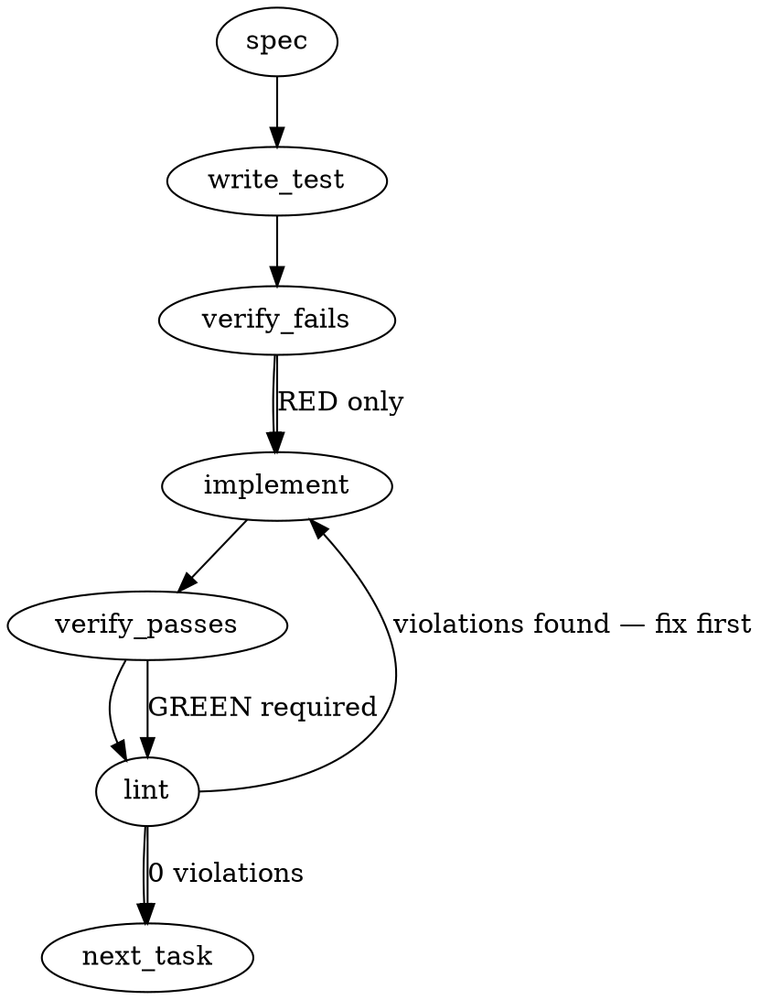

### Problem Statement

The `compile-worker` automatically derives a default applicability scope for new rules, but incorrectly assumes all lessons target standard application code (`!**/*.test.*`). This causes test-specific lessons (e.g., assertion rules, mocking contracts) to be explicitly excluded from the test files they are meant to govern.

### Architectural Context

This is a sibling to issue #1598 (context-sensitive lesson extraction gap). Both represent pattern-derivation failure modes in the compile worker. While #1598 addressed context guards in lesson prose, this issue addresses scope inversion.

### Files to Examine

1. `packages/core/src/compile-lesson.ts` — Core logic where the default scope heuristic currently lives and needs to be overridden.
2. `packages/cli/src/compile-templates.ts` — The compiler system prompts; determines if the LLM is explicitly instructed on how to handle test scopes.
3. `packages/cli/src/commands/compile.ts` — The orchestration layer for the compile worker.
4. `packages/cli/src/commands/wrap.ts` — Existing CLI command structure, useful as a reference for adding the new `rescope` command.

### Technical Approach & Contracts

1. **Scope Heuristic Utility:** Introduce a deterministic function `detectTestContract(lesson: LessonInput): boolean` to classify test lessons.
   - **Tags Signal:** Returns `true` if `lesson.tags` includes `testing`.
   - **Code Signal:** Returns `true` if `lesson.body` matches testing patterns (`/describe\(|it\(|test\(|expect\(/`).
   - **Keyword Signal:** Returns `true` if `lesson.title` contains `test`, `spec`, `assertion`, or `contract` (subject to edge-case mitigation).
2. **Compiler Injection:** Update `compileLesson` to apply the heuristic. If `detectTestContract` is `true`, alter the baseline scope from standard app code to test-inclusive: `**/*.test.ts, **/*.spec.ts, **/tests/**/*.ts, **/__tests__/**/*.ts`. Pass this signal explicitly to the prompt in `compile-templates.ts`.
3. **Rescope Command:** Create a `totem rule rescope` command. It will scan the compiled JSON corpus using `readJsonSafe` (from Shared Helpers), apply the heuristic, and surgically update the scope strings for mis-scoped test rules, avoiding a full recompile.

**Data Contracts:**

```typescript
interface ScopeHeuristicResult {
  isTestContract: boolean;
  suggestedScope: string;
}
```

### Edge Cases & Traps

- **The "Contract" False Positive:** The issue requests checking the title for the word "contract". However, lessons about "API Contracts" or "Data Contracts" will be incorrectly scoped to test files if triggered solely by this keyword. The heuristic _must_ pair the word "contract" with another signal (like test code patterns) or weight it lower than explicit `testing` tags.
- **LLM Specificity Loss:** If the LLM correctly infers a highly specific test scope (e.g., `packages/e2e/**/*.spec.ts`), blindly overwriting it with a generic `**/*.test.*` default will destroy that specificity. The heuristic should only invert the _default exclusions_ (`!**/*.test.*`), not wholesale replace custom inclusions.
- **Test Helpers Exclusion:** A scope of `**/*.test.*` misses test helper and fixture files. The injected scope must include directories conventionally used for testing (e.g., `**/test-utils/**`).
- **File Parsing Risks:** Manually parsing the rule corpus JSON files using `fs.readFileSync` combined with `JSON.parse` is unsafe. You must use the shared `readJsonSafe` helper.

### Implementation Tasks

- [ ] **Task 1: Implement the Test Scope Heuristic**
  - Create `packages/core/src/scope-heuristic.ts` and `packages/core/src/scope-heuristic.test.ts`.
  - Implement `detectTestContract(lesson: LessonInput): ScopeHeuristicResult`.
  - > TEST DIRECTIVE: Before implementing, write a failing test named `rejects false-positive test classification for generic API contract lessons` that proves lessons containing the word "contract" but lacking test-code patterns are NOT classified as test contracts.
  - Implement the regex and tag checking logic based on the candidate signals in the issue.
  - write test → verify fails → implement → verify passes → lint

- [ ] **Task 2: Integrate Heuristic into Compile Worker**
  - Modify `packages/core/src/compile-lesson.ts` and its corresponding test file.
  - Call `detectTestContract` before invoking `runOrchestrator` or `parseCompilerResponse`.
  - If a test contract is detected, adjust the fallback scope passed to the compiler to `**/*.test.ts, **/*.spec.ts, **/tests/**/*.ts`.
  - Update `packages/cli/src/compile-templates.ts` to instruct the LLM: "If the lesson is a testing contract, ensure the scope INCLUDES test files and EXCLUDES standard application code."
  - > TEST DIRECTIVE: Before implementing, write a failing test named `flips default scope exclusions to inclusions when test contract is detected` to ensure test files are no longer negated.
  - write test → verify fails → implement → verify passes → lint

- [ ] **Task 3: Create the `rule rescope` Command**
  - Create `packages/cli/src/commands/rule-rescope.ts` (and register it in the CLI entrypoint).
  - Implement a command that finds all compiled rule JSON artifacts in the local target (e.g., `.junie/skills/totem-rules/` or equivalent).
  - Use `readJsonSafe` from `@mmnto/totem` to read each rule JSON file. Do not use `JSON.parse`.
  - For each rule, re-evaluate its source lesson against `detectTestContract`. If it is a test contract _and_ its scope contains `!**/*.test.*`, rewrite the scope string and save.
  - > TEST DIRECTIVE: Before implementing, write a failing test named `updates mis-scoped test exclusions to inclusions without wiping custom rule paths` to ensure targeted scope fixes.
  - write test → verify fails → implement → verify passes → lint

### Execution Flow (structural constraint)



### Verification (MANDATORY — do not skip)

Every implementation MUST end with these steps:

1. `totem lint` — deterministic rule check (zero LLM, ~2s). Fixes any violations.
2. `totem review` — AI-powered architectural review (~18s). Addresses any critical findings.
3. If using MCP, call `verify_execution` to confirm compliance before declaring the task done.

### Test Plan

- **Heuristic Accuracy:** Ensure "Normalize temp paths for cross-platform equality" (from the issue) successfully triggers the test-contract flag based on code examples (`expect`, `test`), even if the title lacks keywords.
- **False-Positive Prevention:** Ensure a lesson titled "Define strict API Data Contracts" with no test tags or test code patterns generates a standard application scope (`!**/*.test.ts`).
- **Rescope CLI Mutation:** Create a mock `.junie/skills/totem-rules/rules.json` file with a test-contract lesson mapped to a `!**/*.test.ts` scope. Run `totem rule rescope` and assert the file is modified to `**/*.test.ts` via `readJsonSafe`.

---

## Implementation Design

### Scope

**Will do:** teach the compile-worker to emit test-inclusive `fileGlobs` when a lesson is a test-contract (behavior the lesson intends to govern inside test files). The fix surface is the compile prompt plus (pending open-question resolution) an optional deterministic post-emission validator.

**Will NOT do:** build a new `totem rule rescope` CLI command. Existing corpus repair uses `totem compile --upgrade <hash>` per affected rule. Also will not introduce a standalone `scope-heuristic.ts` module unless the user picks Option B below.

### Data model deltas

**Option A (prompt-only).** Zero deltas. `fileGlobs` schema unchanged. LLM emits test-inclusive globs when the prompt teaches it to.

**Option B (prompt + deterministic validator).** One new module:

- `packages/core/src/scope-heuristic.ts` — pure function `detectTestContract(input: LessonClassifierInput): { isTestContract: boolean; signals: string[] }`.
  - Holds: classification logic + signal provenance (for audit/logging).
  - Written by: the function body; stateless.
  - Read by: `compile-lesson.ts` post-LLM-response hook.
  - Invariants: deterministic; no side effects; no I/O; signal strings are stable for logging.

No new fields on `CompilerOutputSchema`, `CompiledRule`, or `NonCompilableEntry`. `fileGlobs` continues to carry scope as today.

### State lifecycle

**Option A:** no new state.

**Option B:** `detectTestContract` is pure / stateless. Called once per `compileLesson` invocation; result is consumed in the same call and discarded. No persistence. No cross-lifecycle coupling.

### Failure modes

| Failure                                                                                      | Category               | Agent-facing surface                                                                                                                        | Recovery                                                                                                                                                                  |
| -------------------------------------------------------------------------------------------- | ---------------------- | ------------------------------------------------------------------------------------------------------------------------------------------- | ------------------------------------------------------------------------------------------------------------------------------------------------------------------------- |
| LLM emits non-test globs despite test-contract lesson (Option A)                             | runtime                | silent degradation — rule ships with `!**/*.test.*`                                                                                         | Manual `totem compile --upgrade <hash>` after detection. Same as status quo for other LLM drift.                                                                          |
| LLM emits non-test globs despite test-contract lesson (Option B)                             | runtime                | warning — post-emission validator logs "scope inversion detected: lesson X classified as test-contract but emitted fileGlobs exclude tests" | Operator runs `totem compile --upgrade <hash>` with updated prompt. Validator emits a reasonCode for ledger traceability (no schema change; reuses prose `reason`).       |
| `detectTestContract` false-positive on "API Contracts" / "Data Contracts" lessons (Option B) | runtime                | warning (noisy) — misclassifies app-code lesson as test-contract                                                                            | Heuristic tuning: require tag OR code-signal alongside keyword. Unit tests lock this in (see Invariants below).                                                           |
| Prompt guidance not picked up by LLM                                                         | transient              | silent degradation identical to current state                                                                                               | Temperature variance; fix is prompt re-tuning + regression tests on mocked LLM responses.                                                                                 |
| Existing corpus rules remain mis-scoped after prompt fix                                     | permanent until action | no surface; rules continue to silently not fire                                                                                             | One-shot `totem compile --upgrade <hash>` per affected rule (two known exhibits: "Normalize temp paths" + "Spy on logger contracts"). Filed as follow-up task in PR body. |

### Invariants to lock in via tests

- **Test-code signal is necessary for test-contract classification** when the title contains ambiguous words like "contract". A lesson titled "Define strict API Data Contracts" with no test tags, no describe/it/test/expect in examples, and no test fileGlobs MUST NOT be classified as test-contract.
- **Test-code signal is sufficient** when paired with any glob-compatible scope. A lesson whose `goodExample`/`badExample` contains `expect(` or `describe(` patterns MUST be classified as test-contract regardless of title.
- **Test-contract classification inverts exclusions, not inclusions.** If the LLM emits `packages/e2e/**/*.spec.ts` (a narrow test scope), the validator MUST NOT blanket-replace it with `**/*.test.*, **/*.spec.*, **/tests/**/*.*, **/__tests__/**/*.*`. Only `!**/*.test.*`-style exclusions get flipped; narrow test globs pass through untouched.
- **`testing` tag is a short-circuit positive signal.** Tag presence alone classifies as test-contract; no further code-pattern check required.
- **Known exhibits compile with test-inclusive scope.** Mocked compile of "Normalize temp paths for cross-platform equality" and "Spy on logger contracts in tests" both emit fileGlobs that include `**/*.test.*`-style patterns.
- **Prompt does not bias toward inversion.** Compile-templates.ts fileGlobs examples MUST include at least one `**/*.test.*`-inclusive example for the classifier to learn from.

### Open questions

- **Question 1:** Option A (prompt-only fix) vs Option B (prompt + deterministic post-emission validator)?
  - **Options:**
    - **A (prompt-only):** smallest surface, 2 files touched (compile-templates.ts + its test). Matches #1598's scope exactly. Risk: LLM drift — a future model or temperature run could regress without a deterministic guard. Regression tests mock the LLM response and test only the prompt-text invariants (e.g., "classifier section present, test-inclusive example present").
    - **B (prompt + validator):** catches LLM drift deterministically. Adds `packages/core/src/scope-heuristic.ts` + integration in `compile-lesson.ts`. ~4 files touched. Validator logs a warning and MAY override the LLM's fileGlobs. Robustness win; new audit-point cost.
  - **Recommendation:** **Option A.** Matches #1598 precedent, keeps PR size tight, easier bot-review round. Defer Option B to a follow-up if drift is observed empirically. The PR body enumerates Option B's rationale so the user can file a tier-3 follow-up ticket if they want the guard.

- **Question 2:** Retriage strategy for the two known mis-scoped rules ("Normalize temp paths", "Spy on logger contracts in tests")?
  - **Options:**
    - **Defer to follow-up PR** (recommended). The two exhibits are called out in the PR body; land the prompt fix first, then `totem compile --upgrade <hash>` for each affected rule in a separate PR. Keeps this PR scoped to the prevention fix.
    - **Bundle in this PR.** Run upgrade, commit the resulting `compiled-rules.json` diff, run pre-push review. Adds data-churn noise to the PR.
  - **Recommendation:** Defer. Prevention and cure are different concerns; bundling increases review scope without benefit.

- **Question 3:** Test-helper directories (`test-utils/`, `__tests__/`) in the default test-inclusive globs?
  - **Options:**
    - **Include by default:** `**/*.test.*, **/*.spec.*, **/tests/**/*.*, **/__tests__/**/*.*`. Covers monorepo test layouts without case-by-case tuning.
    - **Minimal default:** `**/*.test.*, **/*.spec.*`. Simpler; catches conventional file-suffix naming. Operators needing test-utils scope author the glob manually.
  - **Recommendation:** Include the broader set. Memory lesson `lesson-4ecb26b7` flagged that broad `!**/test/**` exclusions miss nested-package test directories; by symmetry, broad inclusion avoids the inverse miss.
