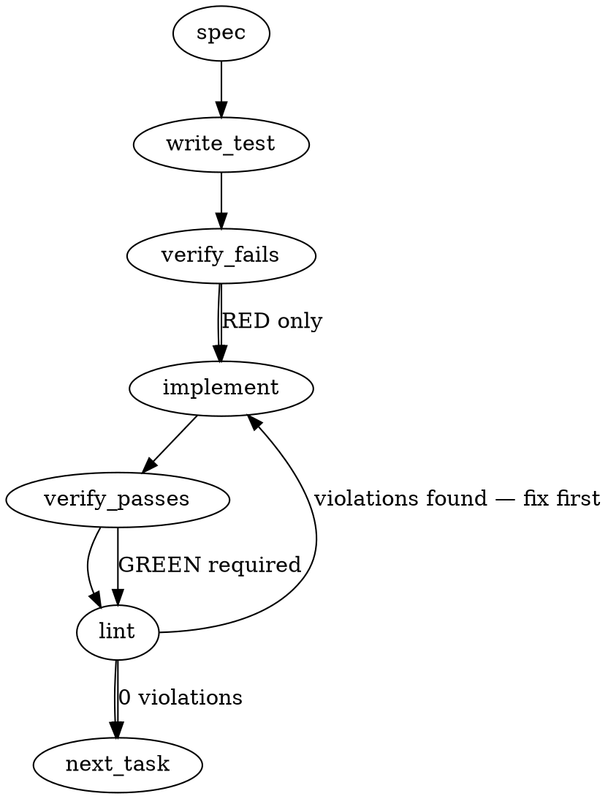

### Problem Statement

The `totem lesson compile` command currently instructs the LLM to generate rules with a default `"warning"` severity, failing to honor lessons where authors explicitly declare `Severity: error` in the prose. We need to structurally parse the declared severity from the lesson markdown and explicitly pass it into the compilation prompt to force the LLM to emit the author's intended severity.

### Architectural Context

None found in provided context.

### Files to Examine

1. `packages/cli/src/commands/compile-templates.ts` — Contains the `COMPILER_SYSTEM_PROMPT` and the user prompt generation logic where structured inputs (tags/scope) are injected.
2. `packages/cli/src/commands/compile.ts` — Houses `compileCommand`, iterating over lessons and calling the LLM; where the new parsing helper will be invoked.
3. `packages/core/src/compile-lesson.ts` — Core logic orchestrating lesson compilation; check if prompt assembly happens here instead of `compile.ts`.

### Technical Approach & Contracts

**1. Prose Parsing (Option A):**
Introduce a pure function `parseSeverityFromProse` in `@mmnto/totem` core. It will use a regex to tolerate case-insensitive variations, markdown bolding (`**`, `__`), italics (`*`, `_`), and trailing punctuation (e.g., `.**`).

_Data Contract: Parse Utility_

```typescript
export function parseSeverityFromProse(body: string): 'error' | 'warning' | null;
```

**2. Prompt Injection:**
Update the user prompt generator (likely `buildCompilerPrompt` or similar in `compile-templates.ts`) to accept `declaredSeverity` alongside `tags`/`scope`/`fileGlobs`. Add an explicit instruction to the LLM:
`"Mandatory Directive: Emit \"severity\": \"${declaredSeverity ?? 'warning'}\" in your JSON output."`

**3. Execution Integration:**
Before dispatching a compilation request in `compileCommand` (or `compile-lesson.ts`), pass the `lesson.body` (or `lesson.content`) through `parseSeverityFromProse` and feed the result into the prompt builder.

### Edge Cases & Traps

- **Markdown Formatting Chaos:** The string could be `**Severity:** error`, `Severity: **error**`, `*Severity*: error.`, or even `**Severity: error**`. The regex must cleanly ignore markdown boundary markers.
- **Multiple Declarations:** A lesson might mention "severity" multiple times (e.g., "This prevents an error"). Ensure the regex strictly matches `Severity:` as a key-value declaration, ideally at the start of a line or paragraph, and take the _first_ match.
- **Prompt Injection Weakness:** The LLM might ignore soft suggestions. Use strong directive language in the prompt ("Mandatory Directive: You MUST emit...") to ensure the requested severity overrides its default behaviors.
- **Silent Fallback:** If the regex fails to match, it must return `null`, allowing the system to fall back to the `'warning'` default exactly as it behaves today.

### Implementation Tasks

- [ ] **Task 1: Implement Prose Severity Parser**
      Modify `packages/core/src/utils/severity-parser.ts` (create if it doesn't exist) and export `parseSeverityFromProse(body: string)`. Use a robust regex matching `severity` followed by an optional colon and markdown, capturing `error` or `warning`.

  > TEST DIRECTIVE: Before implementing, write a failing test named `returns error when severity is wrapped in bold markdown with a trailing period` that proves `**Severity:** error.` correctly extracts `'error'`. Add another test `returns null when no strict severity key is declared` to prove text like "this causes an error" doesn't falsely trigger.
  - write test → verify fails → implement → verify passes → lint

- [ ] **Task 2: Inject Structured Severity into Compile Prompt**
      Modify `packages/cli/src/commands/compile-templates.ts`. Locate the function/template generating the user prompt (where `tags` and `scope` are passed). Add an optional `declaredSeverity: 'error' | 'warning' | null` parameter. Add a mandatory output directive for the severity field based on this parameter (defaulting to `'warning'`).

  > TEST DIRECTIVE: Before implementing, write a failing test named `injects explicit error severity directive into compiler prompt` to ensure the prompt string contains the exact required constraint.
  - update existing test → verify fails → implement → verify passes → lint

- [ ] **Task 3: Plumb Parser into Compilation Loop**
      Modify `packages/cli/src/commands/compile.ts` (or `packages/core/src/compile-lesson.ts` if the loop lives there). Locate where the lesson text is prepared for the LLM. Call `parseSeverityFromProse(lesson.body)` and pass the resulting value into the template/prompt builder.
  > TEST DIRECTIVE: Before implementing, write a failing test named `passes parsed prose severity to compiler prompt builder` in the compile command test suite. Mock the LLM payload and ensure the instruction contains the extracted severity from a dummy lesson body.
  - write test → verify fails → implement → verify passes → lint

### Execution Flow (structural constraint)



### Verification (MANDATORY — do not skip)

Every implementation MUST end with these steps:

1. `totem lint` — deterministic rule check (zero LLM, ~2s). Fixes any violations.
2. `totem review` — AI-powered architectural review (~18s). Addresses any critical findings.
3. If using MCP, call `verify_execution` to confirm compliance before declaring the task done.

### Test Plan

- Unit test `parseSeverityFromProse` against exactly:
  - `**Severity:** error`
  - `Severity: error.` (trailing period)
  - `Severity: warning`
  - `**Severity:** WARNING` (case insensitivity)
  - `This lesson prevents a severe error.` (should return `null`)
- End-to-End Compile test: Provide a mocked lesson with `**Severity:** error` in the prose to `totem lesson compile` and assert the compiled `compiled-rules.json` file contains `"severity": "error"` for that specific rule output. Ensure a secondary lesson with no severity marker compiles with `"severity": "warning"`.

---

## Implementation Design

### Scope

**Will do:** thread the existing-but-discarded `lesson.frontmatter.severity` through the compile pipeline so compiled rules emit the declared severity. Do this at two layers: (a) prompt directive so the LLM emits the right severity in its JSON response, (b) post-LLM override in `buildCompiledRule` as a deterministic safety net when the LLM drifts.

**Will NOT do:** build a new prose parser. `extractField` + `buildFrontmatterFromLegacy` already do this and are battle-tested. Also will NOT add a first-class `severity:` YAML frontmatter field (Option B in the upstream write-up) — deferred to a future ticket. Also will NOT add a severity-mismatch warning surface in this PR — listed as Open Question 2 below.

### Data model deltas

No new types. Two existing-interface extensions:

- **`CompileLessonDeps` (or `compileLesson` signature)** — gains access to `lesson.frontmatter.severity`. The call site in `compile.ts` already has `lesson.frontmatter` in scope (it constructed or loaded the lesson); the extension is "pass it through" rather than "re-parse it."
- **`buildCompiledRule`'s `lesson` parameter** currently `{ hash: string; heading: string }`. Extension: `{ hash: string; heading: string; declaredSeverity?: 'error' | 'warning' }`. Declared severity stays optional; absence preserves the current `parsed.severity ?? 'warning'` fallback.

No new state container. No new module variables.

### State lifecycle

Declared severity is per-compile-invocation, per-lesson. Derived at lesson-load time (already) and consumed at compile time. Lifetime is the duration of the compile call. No cross-lifecycle coupling.

### Failure modes

| Failure                                                                   | Category                                | Agent-facing surface                                                                                                                                                                         | Recovery                                                            |
| ------------------------------------------------------------------------- | --------------------------------------- | -------------------------------------------------------------------------------------------------------------------------------------------------------------------------------------------- | ------------------------------------------------------------------- |
| LLM ignores prompt directive and emits `warning` despite declared `error` | runtime                                 | silent — post-LLM override in `buildCompiledRule` replaces with declared severity                                                                                                            | Automatic; the override is deterministic. Telemetry event recorded. |
| Lesson prose declares malformed severity (not `error` or `warning`)       | init                                    | silent — `buildFrontmatterFromLegacy` already returns `undefined` for anything else (line 103: `if (severity === 'error' \|\| severity === 'warning')`); compile falls back to LLM / default | This is existing behavior. No change.                               |
| Lesson has YAML frontmatter with different severity than prose            | runtime                                 | frontmatter wins (prose-derived severity is only populated when YAML is absent per `lesson-io.ts:81,123`)                                                                                    | Existing architecture; no change required.                          |
| Post-LLM override silently changes the LLM's severity                     | (new failure mode if we emit a warning) | Open Question 2 — see below                                                                                                                                                                  | Depends on OQ2 answer                                               |
| `buildCompiledRule` caller passes wrong/no declared severity              | dev error                               | default `'warning'` ships; no visible signal at runtime                                                                                                                                      | Not user-facing; caught by tests                                    |

### Invariants to lock in via tests

- A lesson with prose `**Severity:** error` and LLM response `{"severity": "warning"}` compiles to a rule with `severity: 'error'`. The post-LLM override is authoritative.
- A lesson with no severity prose and LLM response `{"severity": "warning"}` compiles to a rule with `severity: 'warning'`. No override fires.
- A lesson with prose `**Severity:** error` and LLM response without a severity field compiles to `severity: 'error'`.
- A lesson whose prose contains text like "this prevents a severe error" (no `Severity:` key) does NOT classify as declared `'error'`. `extractField`'s mandatory-colon invariant covers this; the test locks it in against future regressions.
- Compile prompt contains an explicit directive to emit declared severity when the caller supplies one. Prompt text assertion mirrors #1626's pattern.
- YAML-frontmatter severity wins over prose severity. Existing `lesson-io.ts:81,123` logic already does this; test confirms it survives the new plumbing.

### Open questions

- **Question 1:** Where does the override live — `buildCompiledRule` or the caller in `compile.ts`?
  - **Options:**
    - **A (in `buildCompiledRule`):** override happens inside core, applied uniformly to every compile path (Pipeline 2 LLM, Pipeline 3 LLM, cloud worker). One code-path touch; zero divergence between local + cloud paths. Signature change: `lesson` parameter gains `declaredSeverity`.
    - **B (in `compile.ts` caller):** override applied after `buildCompiledRule` returns. No core-package signature change. But needs mirroring in the cloud-worker result handler, same divergence risk #1640 fought. Shorter diff if single-caller; risk if the mirroring is missed.
  - **Recommendation:** **A.** Matches #1640's precedent of routing classification policy inside core, not CLI. Avoids local/cloud drift.

- **Question 2:** Should a "severity mismatch between prose and LLM" warning emit when the override fires?
  - **Options:**
    - **A (silent override):** override quietly replaces `parsed.severity` with `lesson.frontmatter.severity`. User sees the right severity in `compiled-rules.json`; no log noise.
    - **B (warn on mismatch):** log a `totem-context: LLM drift — overrode severity from X to Y` when the override actually changes anything. Observable signal that the prompt directive isn't holding.
    - **C (telemetry only):** structured telemetry event `type: 'severity-override'` in `.totem/temp/telemetry.jsonl` (same sink as regex-safety), no user-visible log. Observable for debugging without noise.
  - **Recommendation:** **C.** Keeps user output clean while preserving an audit signal for prompt-tuning feedback. If the override fires frequently, the telemetry shows it and the prompt can be strengthened in a follow-up.

- **Question 3:** Add a prompt-level directive, a post-LLM override, or both?
  - **Options:**
    - **A (prompt only):** compile prompt gains a directive "when declared severity is provided, emit it." Depends on LLM compliance. If LLM drifts, the fix silently fails.
    - **B (override only):** skip the prompt directive, do deterministic override in `buildCompiledRule`. LLM-output-agnostic; works even on legacy models or prompt-cache-staleness.
    - **C (both):** prompt directive reduces the frequency of drift; override handles residual drift.
  - **Recommendation:** **C.** Belt-and-suspenders. The prompt directive is cheap (one section in the templates file) and reduces wasted LLM work on drift. The override enforces the declared value even when the LLM does not.
