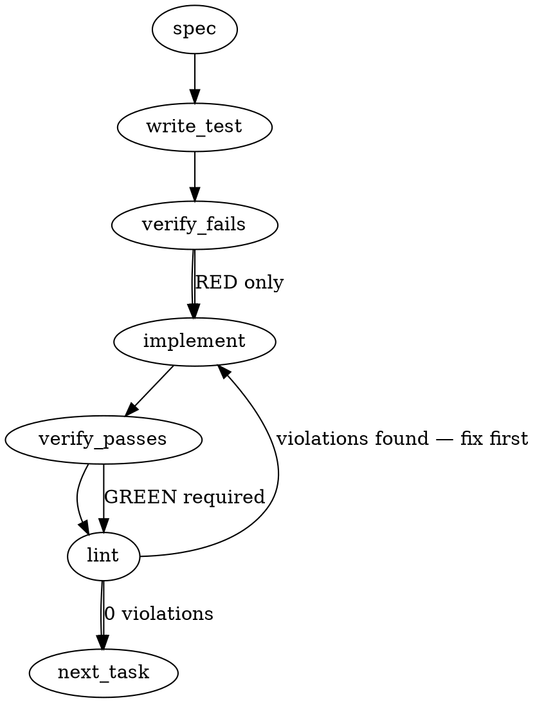

### Problem Statement

The lesson schema and frontmatter parser need to be extended to recognize, validate, and extract an `applies-to` field containing a predefined list of architectural roles. Additionally, a filtering mechanism must be introduced during bot prompt construction to ensure reviewers only receive lessons mapped to the specific role of the function they are evaluating, falling back safely to `any` for untagged lessons.

### Architectural Context

This feature aligns with strategy item 020 and the Proposal 248 prereqs. It ties directly into the `Extract` stage of the five-stage ingestion funnel defined in **ADR-091 Ingestion Pipeline Refinements**. Because back-compatibility for the existing 1,159 lessons is a hard constraint, the extraction phase must natively default missing definitions to `['any']` without mutating the source files.

### Files to Examine

1. `packages/core/src/compile-lesson.ts` — Examines the extraction pipeline where frontmatter is processed and `CompileLessonResult` is formed.
2. `packages/mcp/src/tools/add-lesson.ts` — Validates if the new field impacts the raw lesson string payload ingested via the MCP server.
3. `packages/core/src/types/lesson.ts` (or equivalent schema file) — Locates the Zod schema governing `LessonFrontmatter` to define the new contract.
4. `packages/core/src/prompt/builder.ts` (or equivalent bot-prompt constructor) — Identifies where the filtered lesson payload is injected into bot prompts.

### Technical Approach & Contracts

**1. Zod Contract for Roles:**
Define a strict Zod enum for the taxonomy.

```typescript
export const LessonRoleSchema = z.enum([
  'mutator',
  'boundary',
  'aggregator',
  'hot-path',
  'boundary-test',
  'infrastructure',
  'presentation',
  'any',
]);
```

**2. Frontmatter Coercion Logic:**
The frontmatter schema must intercept raw values (which could be YAML lists, YAML scalars, or comma-separated prose strings) and coerce them into a standardized `LessonRole[]`.

```typescript
appliesTo: z.preprocess((val) => {
  if (val === undefined || val === null) return ['any'];
  // Handle prose or YAML scalar
  if (typeof val === 'string') return val.split(',').map((s) => s.trim().toLowerCase());
  // Handle YAML array
  if (Array.isArray(val)) return val.map((s) => String(s).trim().toLowerCase());
  return val;
}, z.array(LessonRoleSchema)).default(['any']);
```

**3. Prompt Filtering Utility:**
Introduce a pure function `filterLessonsByRole(lessons: Lesson[], targetRole?: LessonRole): Lesson[]`. If `targetRole` is provided, it returns only lessons where `appliesTo` includes `targetRole` OR `any`. If omitted, it returns all lessons.

### Edge Cases & Traps

- **Prose Frontmatter Delimiters:** Prose frontmatter doesn't natively parse arrays like YAML. A raw string like `applies-to: mutator, hot-path` must be split and trimmed during the Zod `preprocess` phase to avoid validation failures.
- **Case Sensitivity:** `applies-to: ANY` or `applies-to: Mutator` must not throw ingestion errors. The preprocessor must lowercase inputs before validation against the enum.
- **Empty Arrays:** `applies-to: []` is an edge case. If a user explicitly provides an empty list, it logically maps to `['any']` or should fail validation. Standardize on falling back to `['any']` to prevent silent omissions in review prompts.
- **Field Naming Convention:** The spec demands `applies-to` (kebab-case) for the frontmatter key. The internal TypeScript representation must be camelCase (`appliesTo`).

### Implementation Tasks

- [ ] **Task 1: Define Role Taxonomy Contract**
      Modify the core lesson schema file (e.g., `packages/core/src/types/lesson.ts`). Export the `LessonRoleSchema` enum and update the internal `Lesson` interface to include `appliesTo: z.infer<typeof LessonRoleSchema>[]`.

  > TEST DIRECTIVE: Before implementing, write a failing test named `rejects invalid role definitions in appliesTo schema` that proves an unknown role string throws a Zod validation error.
  > write test (or update existing) → verify fails → implement → verify passes → lint

- [ ] **Task 2: Implement Coercing Frontmatter Parser**
      Modify the frontmatter Zod schema to include the `appliesTo` field using a `z.preprocess` block that handles scalar-to-array conversion, lowercase normalization, comma-split parsing for prose, and defaults missing values to `['any']`.

  > TEST DIRECTIVE: Before implementing, write a failing test named `coerces comma-separated prose strings into lowercased role arrays` that proves `applies-to: MUTATOR, hot-path` parses cleanly to `['mutator', 'hot-path']`.
  > write test (or update existing) → verify fails → implement → verify passes → lint

- [ ] **Task 3: Implement Backwards-Compatibility Fallback**
      In the same frontmatter extraction test suite, ensure the default behavior triggers properly.

  > TEST DIRECTIVE: Before implementing, write a failing test named `defaults missing applies-to field to any array` proving that old lessons without the field still output `appliesTo: ['any']`.
  > write test (or update existing) → verify fails → implement → verify passes → lint

- [ ] **Task 4: Implement Prompt Filtering Logic**
      Locate the prompt construction utilities (or create a new helper `packages/core/src/utils/role-filter.ts`). Implement `filterLessonsByRole(lessons, targetRole)`.

  > TEST DIRECTIVE: Before implementing, write a failing test named `includes lessons with matching role or any and drops strict mismatches` proving that a lesson tagged `['mutator']` is excluded when filtering for `boundary`, but `['any']` is included.
  > write test (or update existing) → verify fails → implement → verify passes → lint

- [ ] **Task 5: Integrate Filter into Bot Review Pipeline**
      Update the orchestrator or bot-prompt construction phase to accept a `functionRole` context and invoke the filter utility from Task 4 before rendering lessons into the system prompt.
  > TEST DIRECTIVE: Before implementing, write a failing test named `only renders role-applicable lessons in compiled bot prompt` that verifies the generated prompt string omits lessons irrelevant to the injected target role.
  > write test (or update existing) → verify fails → implement → verify passes → lint

### Execution Flow (structural constraint)



### Verification (MANDATORY — do not skip)

Every implementation MUST end with these steps:

1. `totem lint` — deterministic rule check (zero LLM, ~2s). Fixes any violations.
2. `totem review` — AI-powered architectural review (~18s). Addresses any critical findings.
3. If using MCP, call `verify_execution` to confirm compliance before declaring the task done.

### Test Plan

- **Extraction Tests:**
  - Parse YAML frontmatter with `applies-to: [mutator, boundary]`.
  - Parse YAML frontmatter with `applies-to: mutator` (scalar).
  - Parse prose frontmatter with `applies-to: mutator, hot-path`.
  - Parse frontmatter with missing `applies-to` (expect `['any']`).
  - Parse frontmatter with invalid role `applies-to: database` (expect validation error).
- **Filter Tests:**
  - Provide a list of lessons with diverse roles. Query for `mutator` and assert that only `['mutator']` and `['any']` tagged lessons are returned.
  - Query without a role parameter and assert all lessons are returned unmodified.

## Implementation Design

### Scope

**Will:** Extend `LessonFrontmatterSchema` (`packages/core/src/types.ts:173`) with an `appliesTo` field carrying a `LessonRole` enum; coerce YAML scalar / YAML list / comma-separated prose / mixed-case input into a canonical lowercase `LessonRole[]` defaulting to `['any']`; thread the same field through the legacy prose parser (`buildFrontmatterFromLegacy`) so existing 1,159 prose-format lessons can opt in without a YAML migration; expose a pure `filterLessonsByRole(lessons, targetRole)` utility in a new `packages/core/src/lesson-role-filter.ts` module; export `LessonRole` / `LessonRoleSchema` / the filter from `@mmnto/totem`; extend `mcp__totem-dev__add_lesson` (and the CLI prose-emit path it shares) to accept an optional `applies_to` argument that serializes to frontmatter `applies-to:`.

**Will NOT:** Integrate the filter into bot-prompt construction — the integration needs a function-role classifier (file-path + AST kind + decorator hints per item 020 §103-104) which the issue body explicitly puts out of scope ("Heuristic role detection from lesson content"). Will NOT backfill existing lessons (separate sweep, deferred per issue OoS). Will NOT wire bot-side enforcement (out of scope per issue body — bots interpret the field, no totem-side gate). The classifier becomes a follow-up ticket; the bot-prompt-integration ticket sits behind the classifier.

### Data model deltas

| Item                                        | Type / shape                                                                                                          | Holds                  | Writer                                                 | Reader                                        | Invariant                                                                                                             |
| ------------------------------------------- | --------------------------------------------------------------------------------------------------------------------- | ---------------------- | ------------------------------------------------------ | --------------------------------------------- | --------------------------------------------------------------------------------------------------------------------- |
| `LessonRoleSchema`                          | `z.enum(['mutator', 'boundary', 'aggregator', 'hot-path', 'boundary-test', 'infrastructure', 'presentation', 'any'])` | Closed role taxonomy   | Schema definition only                                 | All schema consumers                          | Closed enum; unknown values fail Zod validation, then fail-open per ADR-070                                           |
| `LessonRole`                                | `z.infer<typeof LessonRoleSchema>`                                                                                    | Type alias             | —                                                      | All TS consumers                              | —                                                                                                                     |
| `LessonFrontmatter.appliesTo`               | `LessonRole[]` (non-empty)                                                                                            | Role list for a lesson | YAML parser, prose parser, MCP `add_lesson` serializer | `filterLessonsByRole`, future bot-prompt ctor | Always non-empty (default `['any']`); always lowercase; closed-enum members only; element order preserved as authored |
| `filterLessonsByRole(lessons, targetRole?)` | `(Lesson[], LessonRole?) => Lesson[]`                                                                                 | Pure function          | —                                                      | Future bot-prompt construction                | Pure (no mutation, no side effects); idempotent; `targetRole === undefined` returns input unchanged                   |

No new state containers. No reserved keys / sentinel values: `'any'` is a real enum member, not a sentinel. Empty array `[]` is normalized to `['any']` at preprocess time so an explicit empty doesn't silently mean "no roles." Casing is normalized to lowercase before enum validation so authoring forgiveness doesn't bleed downstream as case-variant role strings.

The `LessonRoleSchema` enum lives in `types.ts` (alongside `LessonFrontmatterSchema`) so MCP, CLI, and core all share a single canonical source. Exporting from `@mmnto/totem` is required because Proposal 248's pack-authoring follow-ups (`@mmnto/pack-bot-coderabbit`, `@mmnto/pack-bot-gemini-code-assist`) need to author lessons against this enum.

### State lifecycle

- **`LessonFrontmatter.appliesTo`.** Per-lesson, lifetime tied to the lesson markdown file on disk. Created when YAML or prose parse runs (read path); written when authors edit lesson markdown directly OR when `mcp__totem-dev__add_lesson` serializes a new lesson with the optional `applies_to` arg. Cleared/destroyed when the lesson file is deleted. Same lifecycle as every other frontmatter field — no cross-lifecycle state.
- **`filterLessonsByRole`.** Stateless pure function. Called per bot-prompt-construction (when integrated downstream). No persistence, no caching, no module-level vars.
- **No cross-lifecycle hazards.** No consumed-once flags, no init-time-but-persistent state, no caching with invalidation requirements. The 2026-04-07 schema-evolution lesson (`lesson-400fed87.md`) flags "format-extension cascades" as a failure mode — the ownership story here is "every helper that reads `LessonFrontmatter` automatically picks up the new field via Zod's structural typing," with no manual fan-out required at consumer sites.

### Failure modes

| Failure                                                                                                         | Category        | Agent-facing surface                                                                                                                      | Recovery                                   |
| --------------------------------------------------------------------------------------------------------------- | --------------- | ----------------------------------------------------------------------------------------------------------------------------------------- | ------------------------------------------ |
| YAML `applies-to: [foo, bar]` where `foo` is not in enum                                                        | runtime / parse | Warning emitted via `onWarn`; entire frontmatter falls back to defaults per ADR-070 fail-open (whole-frontmatter behavior, not per-field) | Author fixes lesson; re-parse on next read |
| YAML `applies-to: []` (explicit empty array)                                                                    | runtime / parse | Preprocess normalizes to `['any']`; no warning (treated as omission)                                                                      | n/a — by design                            |
| Prose `**Applies-to:** badRole, mutator`                                                                        | runtime / parse | Per-field warn + per-field default to `['any']`; other prose fields stay valid (legacy parser semantics)                                  | Author fixes prose form                    |
| Mixed-case prose `**Applies-to:** Mutator, ANY`                                                                 | runtime / parse | Preprocess lowercases; parses cleanly to `['mutator', 'any']`                                                                             | n/a                                        |
| Whitespace-only prose `**Applies-to:**   `                                                                      | runtime / parse | Empty after split+filter → default `['any']`                                                                                              | n/a                                        |
| Field omitted entirely (existing 1,159 lessons)                                                                 | runtime / parse | Default `['any']`; no warning, no telemetry                                                                                               | n/a — backwards-compat path                |
| `filterLessonsByRole(lessons, undefined)`                                                                       | runtime         | Returns `lessons` unchanged                                                                                                               | n/a                                        |
| `filterLessonsByRole(lessons, 'mutator')` with no `mutator`-tagged lessons but `['any']`-tagged lessons present | runtime         | Returns only `['any']`-tagged lessons                                                                                                     | n/a                                        |
| MCP `add_lesson` called with `applies_to: ['unknown-role']`                                                     | runtime / API   | Zod rejects at the tool boundary; `isError: true` returned to caller with field-specific error                                            | Caller fixes argument                      |

All ADR-070 contract preserved: invalid YAML frontmatter keeps the lesson loadable with defaults; the `shield` and `compile` loops never break on a bad `applies-to:`. No "silent degradation" rows — the YAML-fallback path emits a warning and the prose-fallback path emits a warning. Default-to-`['any']` for omitted-field is the contract, not a degradation.

The asymmetry between YAML (whole-frontmatter fallback) and prose (per-field fallback) is inherited from ADR-070's existing parser shapes; this PR doesn't change it.

### Invariants to lock in via tests

- **Round-trip parity across wire formats.** YAML `applies-to: [mutator, boundary]`, YAML scalar `applies-to: mutator`, prose `**Applies-to:** mutator, boundary`, prose scalar `**Applies-to:** mutator` all parse to identical `LessonRole[]` after canonical comparison.
- **Empty-array → default-array.** `applies-to: []` (explicit) and the field omitted entirely both produce `['any']`. There is no observable downstream difference.
- **Closed enum.** Unknown role string emits a warning (testable via `onWarn` callback spy) and falls back to defaults — does NOT throw, does NOT silently coerce to `'any'` per-element, does NOT corrupt other fields on the same lesson.
- **Case-insensitive on input, lowercase canonical.** `'MUTATOR'`, `'Mutator'`, `'mutator'` all parse to canonical `'mutator'`.
- **Element order preservation.** `applies-to: [boundary, mutator]` and `applies-to: [mutator, boundary]` are NOT canonicalized to the same order — author intent on ordering is preserved (consistent with existing `tags` field).
- **Filter behavior:**
  - `filterLessonsByRole(L, undefined)` returns `L` unchanged (referential or structural equality, preference: structural).
  - `filterLessonsByRole(L, 'mutator')` includes lessons where `appliesTo.includes('mutator')` OR `appliesTo.includes('any')`.
  - `filterLessonsByRole([], 'mutator')` returns `[]`.
  - Filter is pure — does not mutate input array, does not mutate elements.
- **Backwards compat across the existing corpus.** Reading every lesson under `.totem/lessons/` (1,159 files; none have `applies-to:`) yields `appliesTo: ['any']` deterministically, with no warnings emitted on the missing-field path.
- **MCP boundary.** `add_lesson` with valid `applies_to` round-trips through frontmatter serialization → file read → parse and produces the same `LessonRole[]`.

### Open questions

1. **Question:** Do we extend the prose-frontmatter parser (`buildFrontmatterFromLegacy`) with `**Applies-to:**` extraction, or only support the new field in the YAML-frontmatter path?
   - **Options:**
     - (a) Extend prose parser. Authors can adopt the field on legacy lessons without YAML migration. Consistent with item 020 which shows both wire formats explicitly.
     - (b) YAML-only. Forces authors toward the post-ADR-070 canonical form; cleaner end state.
   - **Recommendation:** (a). 1,159 lessons currently use the prose form. YAML-only would create a two-class system where legacy lessons can never opt in until they migrate, contradicting the issue's "no migration needed" stance. Item 020's worked example uses the prose form for the `lesson-03ff4b88.md` exhibit.

2. **Question:** Where does `filterLessonsByRole` live?
   - **Options:**
     - (a) New module `packages/core/src/lesson-role-filter.ts`. Clean SRP, easy to grow if future role utilities need to compose.
     - (b) Add as exported function in `packages/core/src/lesson-frontmatter.ts` since it operates on frontmatter shape.
   - **Recommendation:** (a). Frontmatter parsing and lesson filtering are different concerns; future role-classifier ticket and bot-prompt-integration ticket would also live near the filter, so a dedicated module gives them a home. Modules are cheap.

3. **Question:** Should the V1 PR export `LessonRole` / `LessonRoleSchema` / `filterLessonsByRole` from `@mmnto/totem` (public surface), or keep them internal until a downstream consumer ships?
   - **Options:**
     - (a) Export. Pack authors and CLI integrations get the canonical enum from day one.
     - (b) Internal-only. Lock the surface until bot-prompt integration ships.
   - **Recommendation:** (a). Proposal 248's `@mmnto/pack-bot-*` follow-ups will need this enum to author lessons with the right `applies-to:`. Exporting in V1 unblocks pack work without a second cycle. Public-surface additions are low-risk because the enum is closed and the filter signature is conservative.

4. **Question:** Does the MCP `add_lesson` argument naming follow snake_case (`applies_to`) per item 020 §101 ("snake_case is conventional for MCP arg names"), or kebab-case (`applies-to`) for parity with the on-disk frontmatter key?
   - **Options:**
     - (a) `applies_to` (snake_case) at the MCP boundary, serialized to `applies-to:` in frontmatter. Item 020 explicitly recommends this.
     - (b) `applies-to` (kebab-case) end-to-end. Single name, no naming-context-shift.
   - **Recommendation:** (a). MCP convention favors snake_case (every existing arg follows it: `lesson_text`, `linked_index`); kebab-case as an MCP arg name would be the outlier. The boundary serialization is one line of code.

### Follow-up tickets to file at acceptance

Filed when this PR merges, not before:

- **Function-role classifier** — heuristic mapper from file-path + AST kind + decorator hints to `LessonRole`. Powers the bot-prompt integration. Tier-2.
- **Bot-prompt integration** — wire `filterLessonsByRole` into the prompt-construction code path with the classifier as input. Depends on classifier ticket. Tier-2.
- **Lesson backfill sweep** — opportunistic backfill of `applies-to:` declarations on existing 1,159 lessons. Off-path; deferred per issue OoS. Tier-3.
