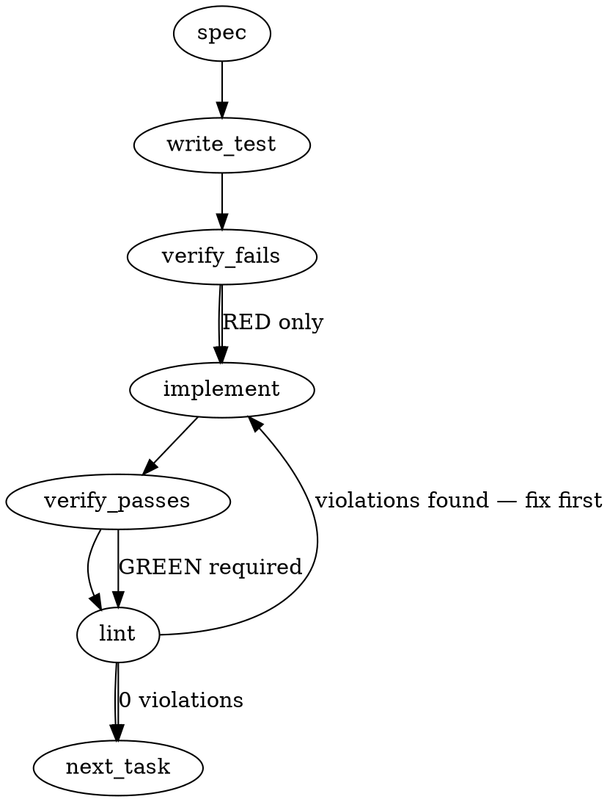

### Problem Statement

The compile pipeline currently skips lessons silently if their compiled regex matches `totem-ignore` or `totem-context` (self-suppressing), leaving no audit trail in the `nonCompilable` ledger. We need to introduce a new `reasonCode` (`self-suppressing-pattern`), intercept these self-suppressing patterns during compilation to emit the new code, and treat it as a terminal (non-retryable) failure so it properly writes to the ledger.

### Architectural Context

None found in provided context.

### Files to Examine

1. `packages/core/src/schemas.ts` (or `packages/core/src/schemas/compiler.ts`) — To locate `CompilerOutputBaseSchema` and the `reasonCode` enum.
2. `packages/core/src/constants.ts` (or equivalent where `LEDGER_RETRY_PENDING_CODES` is defined) — To verify ledger write-policy lists.
3. `packages/core/src/compile-lesson.ts` — To locate the existing silent skip logic and update `compileLesson` to intercept self-suppressing patterns.
4. `packages/cli/src/commands/compile.ts` — To understand how the orchestrator processes the `CompileLessonResult` and writes to the ledger.

### Technical Approach & Contracts

1. **Schema Extension**: Update `CompilerOutputBaseSchema` (a Zod schema) to include `'self-suppressing-pattern'` in its `reasonCode` enum.
2. **Ledger Write-Policy**: Locate `LEDGER_RETRY_PENDING_CODES`. Deliberately _exclude_ `'self-suppressing-pattern'` from this list so the orchestrator treats it as a terminal failure, logging it to `compiled-rules.json` and skipping it in future compile runs.
3. **Compile Worker Interception**: In `packages/core/src/compile-lesson.ts`, find where the LLM response is evaluated. If the parsed response is `compilable: true` but the generated regex/pattern contains the literal strings `totem-ignore` or `totem-context`, override the output to:
   ```typescript
   {
     compilable: false,
     reasonCode: 'self-suppressing-pattern',
     reason: 'Pattern contains totem-ignore or totem-context and would self-suppress at runtime.'
   }
   ```
   This interception must occur _before_ the result is passed to `buildCompiledRule` or returned to the orchestrator, ensuring the existing ledger orchestration natively handles the `compilable: false` state.

### Edge Cases & Traps

- **TypeScript Discriminated Unions**: `CompilerOutput` is likely a discriminated union based on `compilable: boolean`. You cannot simply mutate `parsed.compilable = false`; you must overwrite the `parsed` object with a new object that satisfies the `compilable: false` union branch to avoid TypeScript errors.
- **Incomplete Checks**: Ensure the check looks for _both_ `totem-ignore` and `totem-context`. A simple `.includes()` check on the compiled pattern string is sufficient, but do not accidentally check the lesson body instead of the generated regex.
- **Orchestrator Blindspots**: If the existing silent skip was located inside `buildCompiledRule`, removing it there and hoisting the check up to `compileLesson` is required so the `nonCompilable` ledger tuple (`{ hash, title, reasonCode }`) is properly constructed by the orchestrator.

### Implementation Tasks

- [ ] **Task 1: Extend Compiler Schema and Verify Write Policy**
  - Locate `CompilerOutputBaseSchema` and append `'self-suppressing-pattern'` to the `reasonCode` Zod enum.
  - Locate `LEDGER_RETRY_PENDING_CODES` and confirm `'self-suppressing-pattern'` is NOT added (ensuring it remains terminal).
  - Modify `packages/core/src/schemas.ts` (or the equivalent schema file).
  - Update `packages/core/src/schemas.spec.ts` (or the equivalent test file).
    > TEST DIRECTIVE: Before implementing, write a failing test named `validates self-suppressing-pattern reasonCode` that proves the Zod schema accepts the new code and rejects typos.
  - write test → verify fails → implement → verify passes → lint

- [ ] **Task 2: Intercept Self-Suppressing Patterns in Compile Worker**
  - Modify `packages/core/src/compile-lesson.ts`.
  - Inside `compileLesson`, immediately after parsing the compiler response (via `parseCompilerResponse`), check if the output is compilable AND the resulting regex contains `totem-ignore` or `totem-context`.
  - If true, reassign the parsed object to `{ compilable: false, reasonCode: 'self-suppressing-pattern', reason: '...' }` before it is passed to `buildCompiledRule`.
  - Remove any legacy silent skip logic that previously handled this inside `buildCompiledRule`.
  - Update `packages/core/src/compile-lesson.spec.ts`.
    > TEST DIRECTIVE: Before implementing, write a failing test named `intercepts self-suppressing patterns and emits terminal reasonCode` that proves an LLM response containing `totem-ignore` in the regex results in a non-compilable object with the correct reasonCode.
  - write test → verify fails → implement → verify passes → lint

### Execution Flow (structural constraint)



### Verification (MANDATORY — do not skip)

Every implementation MUST end with these steps:

1. `totem lint` — deterministic rule check (zero LLM, ~2s). Fixes any violations.
2. `totem review` — AI-powered architectural review (~18s). Addresses any critical findings.
3. If using MCP, call `verify_execution` to confirm compliance before declaring the task done.

### Test Plan

- **Schema Validation**: Parse an object with `compilable: false` and `reasonCode: 'self-suppressing-pattern'` through the updated Zod schema to ensure it passes.
- **Compile Interception**: Mock an LLM dependency that returns a valid, compilable regex containing `totem-context`. Execute `compileLesson` and assert the return value explicitly flags it as `compilable: false` with the `self-suppressing-pattern` reasonCode.
- **Orchestration / Ledger (Integration)**: Run the compile orchestrator on a known self-suppressing lesson (e.g., `lesson-a00d6b65`) and assert that the `nonCompilable` array in the resulting ledger JSON contains the exact `{ hash, title, reasonCode }` tuple.
