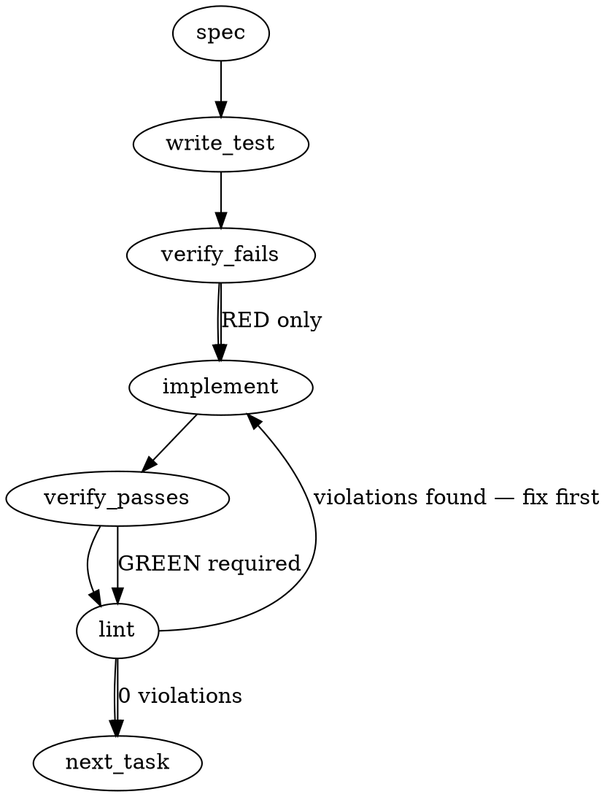

### Problem Statement

The compile pipeline is silently dropping exclusion globs (e.g., `!**/*.test.*`) from a lesson's declared `Scope:` field when generating the compiled rule's `fileGlobs`. The validation smoke-gate currently uses a permissive superset check that allows these omissions to pass, requiring an update to strict set-of-strings equality to catch both dropped exclusions (this issue) and missing auto-inclusions (Issue #1626).

### Architectural Context

This is the inverse of Issue #1626 (shipped in 1.15.4, PR #1652 `3037591d`), which handled auto-_adding_ test inclusions for test-contract lessons. The pipeline currently enforces scope correctness via a smoke-gate check inside the compile stage. Moving to strict set-of-strings equality enforces determinism: the pipeline's derived expected scope MUST perfectly match the compiled `fileGlobs`—no missing exclusions, no hallucinated additions.

### Files to Examine

1. `packages/core/src/compile-lesson.ts` — Contains the compile smoke-gate validation and the `buildCompiledRule` function. This is where the superset check must be replaced and the dropping bug fixed.
2. `packages/core/src/compile-lesson.test.ts` — Must be updated with fixtures proving the set equality gate works in both directions.
3. `packages/cli/src/commands/compile-templates.ts` — (If prompt-based) To inspect if the compiler system prompt is actively omitting `!` prefixed strings.

### Technical Approach & Contracts

1. **Implement Set Equality Helper:** We need a deterministic `isGlobSetEqual(expected: string[], actual: string[]): boolean` helper that ignores array order and duplicate elements.
2. **Update the Smoke-Gate Validation:** Locate the post-LLM validation phase in `compileLesson` or `buildCompiledRule`. It currently checks if the source-declared globs are a subset/superset of the compiled `fileGlobs`. Replace this with `isGlobSetEqual`.
3. **Diagnose and Fix the Drop:**
   - _If the drop is programmatic:_ Search `buildCompiledRule` for any `.filter()` or normalization logic stripping strings starting with `!`.
   - _If the drop is LLM-induced:_ Do not rely purely on prompting. Instead, programmatically inject/merge the source's explicit exclusion globs (and the derived test inclusions from #1626) into `parsed.fileGlobs` before the equality check to guarantee architectural compliance.
   - _Recommendation:_ Programmatic enforcement is strictly superior to prompt engineering. The pipeline should compute the `expectedGlobs` (Source Scope + Test Inclusions from #1626) and strictly overwrite or validate the LLM's `fileGlobs` against it.

### Edge Cases & Traps

- **Order Dependency Regression:** Glob arrays might be generated in different orders `['**/*.ts', '!**/*.spec.ts']` vs `['!**/*.spec.ts', '**/*.ts']`. The set-equality check MUST ignore order.
- **Duplicate Globs:** `['**/*.ts', '**/*.ts']` must equal `['**/*.ts']`. Use `Set` internally.
- **The #1626 Inverse Trap:** Issue #1626 _dynamically adds_ test globs based on the lesson payload. Your `expectedGlobs` calculation must account for these dynamic additions before performing the set-equality check against the final `fileGlobs`, otherwise legitimate test-contract rules will fail the strict gate.

### Implementation Tasks

- [ ] **Task 1: Implement `isGlobSetEqual` Helper**
  - Create a pure function `isGlobSetEqual(a: string[], b: string[])` in `packages/core/src/compile-lesson.ts` (or a dedicated util file if preferred).
  - Convert both arrays to `Set`s. Return `false` if `Set.size` differs. Return `false` if any element in `Set A` is not in `Set B`.
    > TEST DIRECTIVE: Before implementing, write a failing test named `isGlobSetEqual correctly identifies equivalent sets regardless of order and duplicates` in `compile-lesson.test.ts`.
  - write test → verify fails → implement → verify passes → lint

- [ ] **Task 2: Upgrade Smoke-Gate to Strict Equality**
  - Locate the validation step in `compileLesson` (or `buildCompiledRule`) that checks scope validity. It likely uses `.every()` or an `isSuperset` utility.
  - Replace the permissive check with `isGlobSetEqual(derivedExpectedScope, compiledFileGlobs)`.
    > TEST DIRECTIVE: Before implementing, write a failing test named `compile smoke-gate rejects output that drops exclusion globs` demonstrating that a missing `!**/*.test.*` glob now correctly throws a compile validation error.
  - write test → verify fails → implement → verify passes → lint

- [ ] **Task 3: Fix Exclusion Drop & Reconcile Dynamic Scope**
  - Diagnose why exclusions drop. If the LLM omits them, ensure the pipeline's expected derived scope (which merges explicitly declared source exclusions + #1626 test inclusions) forcefully reconciles with `parsed.fileGlobs`.
  - Ensure the pipeline explicitly assigns the correctly calculated explicit + derived globs to the final rule output so it passes the strict gate introduced in Task 2.
    > TEST DIRECTIVE: Before implementing, write a failing test named `compiles lesson with explicit test exclusions successfully` and `compiles test-contract lesson with auto-included test patterns successfully` (ensuring both directions of the #1626 / #1665 spec work flawlessly).
  - write test (or update existing) → verify fails → implement → verify passes → lint

### Execution Flow (structural constraint)

### Verification (MANDATORY — do not skip)

Every implementation MUST end with these steps:

1. `totem lint` — deterministic rule check (zero LLM, ~2s). Fixes any violations.
2. `totem review` — AI-powered architectural review (~18s). Addresses any critical findings.
3. If using MCP, call `verify_execution` to confirm compliance before declaring the task done.

### Test Plan

1. **The Dropped Exclusion Scenario (Issue #1665):** Compile a mocked lesson that specifies `Scope: ['**/*.ts', '!**/*.spec.ts']`. Verify the compiled rule's `fileGlobs` perfectly mirrors this array.
2. **The Auto-Addition Scenario (Issue #1626):** Compile a mocked test-contract lesson (triggering the #1626 behavior). Verify the auto-added test globs exist in the output and the strict equality gate does _not_ throw a validation error.
3. **Invalid Subset Rejection:** Mock LLM output that forgets an exclusion glob. Ensure the compilation throws the smoke-gate error and fails the build.

## Implementation Design

### Scope

**Will:** Parse source `**Scope:**` from the lesson body programmatically (reusing `extractManualPattern`'s comma-split + filter-Boolean logic, exposed as a standalone helper). In `buildCompiledRule` (Pipeline 2/3), when the source declares Scope, use the source-derived list as authoritative `fileGlobs` and override the LLM's emission. Wire a `scopeOverride` marker on `BuildRuleResult` patterned after #1656's `severityOverride` so CLI telemetry records LLM divergence without blocking compile. Add an `isGlobSetEqual(a: string[], b: string[]): boolean` pure helper for set-of-strings comparison (used by the divergence detector, not as a gate).

**Will NOT:** Flip compile to fail on divergence (too strict for incremental rollout — see Open Q1). Will NOT touch Pipeline 1 (`extractManualPattern` already handles Scope exclusions correctly). Will NOT re-architect #1626's test-contract classifier (orthogonal — that path applies when source omits Scope; this fix applies when source declares Scope). Will NOT change the compile-templates prompt in this PR.

### Data model deltas

| Item                                      | Type / shape                                                 | Holds                                     | Writer                       | Reader                               | Invariant                                                                                                                                                       |
| ----------------------------------------- | ------------------------------------------------------------ | ----------------------------------------- | ---------------------------- | ------------------------------------ | --------------------------------------------------------------------------------------------------------------------------------------------------------------- |
| `parseDeclaredScope(body)`                | `(string) => string[] \| undefined`                          | Parsed source Scope: glob list            | —                            | `buildCompiledRule`                  | Returns `undefined` when no `**Scope:**` line OR empty value; returns non-empty `string[]` otherwise. Preserves order; preserves `!` exclusion entries verbatim |
| `isGlobSetEqual(a, b)`                    | `(string[], string[]) => boolean`                            | Pure helper                               | —                            | `buildCompiledRule` divergence check | Set semantics: order-insensitive, duplicate-insensitive                                                                                                         |
| `BuildRuleResult.scopeOverride?`          | `{ from: string[] \| undefined; to: string[] } \| undefined` | Telemetry marker                          | `buildCompiledRule`          | CLI telemetry callback               | Populated only when LLM emission differs from source-Scope set (mirrors `severityOverride` discipline from #1656)                                               |
| `BuildCompiledRuleOptions.lessonBody?`    | `string \| undefined`                                        | Source lesson body for parseDeclaredScope | Caller (compile-lesson loop) | `buildCompiledRule`                  | Optional for backwards compat; when omitted, override path inactive                                                                                             |
| `CompileLessonCallbacks.onScopeOverride?` | `(override) => void`                                         | Telemetry callback                        | —                            | CLI `writeScopeOverrideTelemetry`    | Mirrors `onSeverityOverride` shape from #1656                                                                                                                   |

No new state containers. No reserved keys. `scopeOverride` marker fires only when override actually changed the outcome (skip-on-no-divergence parity with #1656).

### State lifecycle

- **`parseDeclaredScope` + `isGlobSetEqual`** — pure / stateless. No persistence.
- **`scopeOverride` marker** — per-lesson-compile lifetime, bounded by `buildCompiledRule` return value. Caller observes; nothing accumulates.
- **CLI telemetry append** — appends to `.totem/temp/telemetry.jsonl` with `type: 'scope-override'`, mirroring #1656's `type: 'severity-override'` pattern. Same write semantics, same path-redaction behavior.

### Failure modes

| Failure                                               | Category              | Agent-facing surface                                                                          | Recovery                                  |
| ----------------------------------------------------- | --------------------- | --------------------------------------------------------------------------------------------- | ----------------------------------------- |
| Source `**Scope:**` malformed / empty value           | parse                 | Returns `undefined`; LLM emission used as-is (current behavior preserved)                     | Author fixes lesson; rerun compile        |
| LLM emits `fileGlobs` that diverges from source-Scope | drift                 | Override applied + `scopeOverride` telemetry marker fires; final rule uses source-derived set | None needed — author's intent always wins |
| Source has no `**Scope:**` line                       | n/a (legitimate path) | LLM emission used unchanged; #1626 test-contract auto-include path stays active               | n/a                                       |
| `sanitizeFileGlobs` drops `'!'` alone                 | normalize             | Existing behavior — empty/whitespace entries filtered                                         | n/a                                       |
| Caller forgets to pass `lessonBody` option            | runtime               | Override path inactive; LLM emission used (graceful degradation, current behavior)            | Caller wires `lessonBody`                 |

No "silent degradation" rows. The override is the LOUD path — telemetry fires, marker visible to callers. The graceful-degradation case (caller forgets to wire `lessonBody`) preserves current behavior, not silently worse.

### Invariants to lock in via tests

- **`isGlobSetEqual` pure semantics:**
  - Empty vs empty equal.
  - `['a','b']` vs `['b','a']` equal (order-insensitive).
  - `['a','a']` vs `['a']` equal (duplicate-insensitive).
  - `['a']` vs `['a','b']` not equal.
  - `['!**/*.test.*']` vs `['**/*.test.*']` not equal (sign matters; `!` is part of the string).
- **`parseDeclaredScope` parser:**
  - `**Scope:** A, B, !C` → `['A', 'B', '!C']` (preserves order + `!`).
  - No `**Scope:**` line → `undefined`.
  - `**Scope:**   ` (whitespace-only) → `undefined`.
  - `**Scope:** A,,B` → `['A', 'B']` (filter Boolean drops empty entries).
- **`buildCompiledRule` override behavior:**
  - Source `[A, B, !C]` + LLM `[A, B]` → final `fileGlobs: [A, B, !C]`, marker `scopeOverride: { from: [A, B], to: [A, B, !C] }`.
  - Source `[A, B, !C]` + LLM `[A, B, !C]` → final `fileGlobs: [A, B, !C]`, marker absent (no divergence).
  - Source undefined + LLM `[A, B]` → final `fileGlobs: [A, B]`, marker absent (no override path).
  - Source `[A]` + LLM undefined → final `fileGlobs: [A]`, marker `{ from: undefined, to: [A] }`.
- **Pipeline 1 unaffected:** `extractManualPattern` regression test pins existing Scope-preservation behavior so the override path doesn't accidentally touch the manual flow.
- **Telemetry callback fires once per override** with the correct `from`/`to` arrays. Path-redaction matches `severity-override` precedent.

### Open questions

1. **Question:** Override-and-log vs strict-fail on divergence?
   - **Options:** (a) Override + telemetry — author intent always wins, no compile failures. (b) Strict equality gate — compile fails on divergence, forces LLM retry per spec recommendation.
   - **Recommendation:** (a). The bug is "silent drop"; override fixes it deterministically. Strict-fail blocks legitimate edge cases (e.g., LLM legitimately omits an entry the author also forgot to declare and the gate would re-fire). Telemetry surfaces drift without breaking author flows. If telemetry shows persistent LLM drift after this lands, tighten to strict-fail in a follow-up.

2. **Question:** `parseDeclaredScope` — new module or add to `lesson-pattern.ts`?
   - **Options:** (a) Extract method into lesson-pattern.ts, export alongside `extractManualPattern`. (b) New module `packages/core/src/scope-derivation.ts`.
   - **Recommendation:** (a). lesson-pattern.ts already owns the Scope-parsing logic inside `extractManualPattern`; pulling the comma-split + filter into a standalone helper is a refactor that also unblocks Pipeline 2/3. New module is premature.

3. **Question:** Naming — `parseDeclaredScope` vs `parseSourceScope` vs `extractScopeGlobs`?
   - **Options:** parseDeclaredScope (parity with #1656's parseDeclaredSeverity), parseSourceScope (descriptive), extractScopeGlobs (matches existing `extract*` family).
   - **Recommendation:** `parseDeclaredScope`. Direct parity with `parseDeclaredSeverity` from #1656 + matching semantics ("the author's declaration in prose, parsed deterministically").

4. **Question:** Should `scopeOverride` mirror `severityOverride`'s telemetry shape exactly, or use a different schema?
   - **Options:** (a) Mirror — same `{ from, to }` shape, same callback discipline, same telemetry file. (b) Bespoke — perhaps include source-line info or rejection-reason category.
   - **Recommendation:** (a). Mirror reduces cognitive load, reuses tested telemetry plumbing, lets future analysis treat both override classes uniformly. Add bespoke fields only if a concrete use case emerges.

### Follow-up tickets to file at acceptance

- **Compile-prompt Scope guidance refinement** — once telemetry shows the divergence rate, tighten the prompt instructions on `compile-templates.ts` to honor source `**Scope:**` more reliably. Tier-3.
- **Strict-fail compile gate** (if telemetry indicates the override is masking authoring problems rather than LLM drift). Tier-3, dependent on telemetry data.
- **Pipeline 1 audit** — verify no existing Pipeline 1 lesson silently drops exclusions during the manual flow (sanity check). Tier-3.
