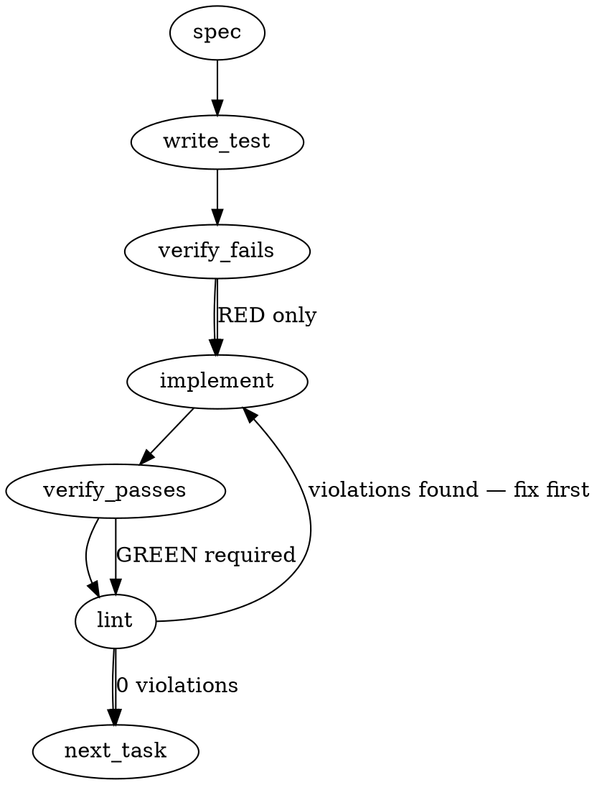

### Problem Statement

The `totem triage-pr` command incorrectly deduplicates findings based on a `(path, line, author)` tuple, which causes distinct findings on the same line (e.g., multiple GCA high-severity issues) to collapse into a single item, hiding critical summary data. The deduplication identity must be updated to use the deterministic API `comment_id` as the primary key, with a body-hash fallback exclusively for synthesized review-body findings that lack a comment ID.

### Architectural Context

None found in provided context. (Strictly adhering to Strategy upstream-feedback item 024 from the issue description).

### Files to Examine

1. `packages/cli/src/commands/triage-pr.ts` — Contains the `normalizeBotFindings` and `formatTriageOutput` functions where the deduplication pass currently resides.
2. `packages/cli/src/adapters/github-cli-pr.ts` (if available) — To verify how `id` / `comment_id` is parsed from the GitHub CLI/API response.
3. `packages/cli/src/commands/triage-pr.test.ts` (or equivalent test file) — To implement the necessary TDD fixtures.

### Technical Approach & Contracts

To correctly handle deduplication without data loss, we must implement a **Two-Pass Hybrid Deduplication Strategy**. This prevents order-of-processing bugs where a synthesized review-body finding might be evaluated before its inline counterpart.

**Data Contracts:**
The internal `CategorizedFinding` (and the input `CommentThread` interface if necessary) must be explicitly typed to include:

```typescript
{
  commentId?: string; // thread_id for inline, comment id for top-level, undefined for synthesized
  // ... existing fields (body, path, line, author, etc.)
}
```

**Two-Pass Deduplication Logic in `normalizeBotFindings`:**

1. **Pass 1 (Primary - Deterministic IDs):** Iterate through all findings that _have_ a `commentId`.
   - Keep them all.
   - Track their IDs in `seenCommentIds = new Set<string>()` (to catch API duplication anomalies).
   - Compute a SHA-256 hash of their _normalized_ body: `const hash = createHash('sha256').update(stripHtmlWrappers(finding.body)).digest('hex')`.
   - Add this hash to `seenBodyHashes = new Set<string>()`.
2. **Pass 2 (Fallback - Synthesized Findings):** Iterate through findings that _lack_ a `commentId`.
   - Compute their body hash using the exact same normalization.
   - If `seenBodyHashes.has(hash)`, **DROP** the finding (it collapses into the inline version).
   - If `!seenBodyHashes.has(hash)`, **KEEP** the finding, and add its hash to `seenBodyHashes` (to deduplicate identical synthesized findings against each other).
3. **Re-assemble:** Combine the results of Pass 1 and Pass 2, sorting them to maintain the original expected output order (typically by path/line or chronologically).

### Edge Cases & Traps

- **Order-of-Operations Trap:** If you process a single pass and a synthesized finding appears in the array before its inline counterpart, the synthesized one is kept, and the inline one (which has a unique ID) is _also_ kept, failing the deduplication requirement. You **must** do a two-pass approach or explicitly sort inline findings before synthesized ones.
- **Normalization Trap:** Hashing the raw `.body` will cause deduplication to fail if inline comments have different HTML wrapper artifacts than synthesized comments. You must hash the output of the existing `stripHtmlWrappers(html)` helper.
- **Generic Lint Trap (Data Loss):** Never apply the `body-hash` deduplication to findings that _do_ have a `commentId`. Doing so will silently drop identical generic lint errors that legitimately occur on different lines. The `body-hash` drop rule ONLY applies to findings lacking a `commentId`.

### Implementation Tasks

- [ ] **Task 1: Define Contracts & Write Failing Tests**
  - Update types in `packages/cli/src/commands/triage-pr.ts` (or the respective types file) to include `commentId?: string` on findings.
  - Locate `packages/cli/src/commands/triage-pr.test.ts`.
    > TEST DIRECTIVE: Before implementing, write a failing test named `retains distinct findings on the same line` that mocks two findings sharing the same `(path, line, author)` but possessing unique `commentId`s.
    > TEST DIRECTIVE: Before implementing, write a failing test named `collapses synthesized review-body finding when identical inline finding exists` that mocks an inline finding (with `commentId`) and a synthesized finding (without `commentId`) sharing the same body.
  - write test → verify fails → implement → verify passes → lint

- [ ] **Task 2: Extract `commentId` in Adapter / Mapping**
  - Modify the logic that maps raw GitHub `CommentThread` items into findings inside `normalizeBotFindings` (or prior to it).
  - Ensure the GitHub `id` or `node_id` is correctly mapped to the `commentId` property. Synthesized `(review body)` findings should leave this explicitly `undefined`.
  - write test (or update existing) → verify fails → implement → verify passes → lint

- [ ] **Task 3: Implement Two-Pass Deduplication**
  - In `packages/cli/src/commands/triage-pr.ts`, locate the deduplication loop inside `normalizeBotFindings`.
  - Remove the old `const dedupKey = ${path}:${line}:${author}` logic.
  - Implement the Pass 1 / Pass 2 logic using `crypto.createHash('sha256')` and `stripHtmlWrappers(body)`.
  - Ensure the final array maintains proper sorting.
  - write test (or update existing) → verify fails → implement → verify passes → lint

### Execution Flow (structural constraint)



### Verification (MANDATORY — do not skip)

Every implementation MUST end with these steps:

1. `totem lint` — deterministic rule check (zero LLM, ~2s). Fixes any violations.
2. `totem review` — AI-powered architectural review (~18s). Addresses any critical findings.
3. If using MCP, call `verify_execution` to confirm compliance before declaring the task done.

### Test Plan

- **Same-Line Unique Findings:** Provide 2 mocked GCA finding objects. `path="foo.ts"`, `line=10`, `author="gca"`. Give them different `commentId`s and different bodies. Assert that `normalizeBotFindings` returns length 2.
- **Synthesized vs Inline Collapse:** Provide 1 inline finding (`commentId="123"`, `body="Fix typo"`) and 1 review-body finding (`commentId=undefined`, `body="Fix typo"`). Assert `normalizeBotFindings` returns length 1, and the kept finding is the one with `commentId="123"`.
- **Generic Lint Duplication (Negative Test):** Provide 2 inline findings with identical bodies (`body="Missing semicolon"`) but different lines (`line=5`, `line=10`) and different `commentId`s. Assert `normalizeBotFindings` returns length 2.

## Implementation Design

### Scope

**Will:** Replace `deduplicateFindings` in `packages/cli/src/parsers/triage-dedup.ts` so the dedup primary key is `rootCommentId` for inline review-thread findings. Two findings with different `rootCommentId` are ALWAYS distinct, even if their bodies are byte-identical and they anchor at the same `(file, line)`. For findings without `rootCommentId` (synthesized review-body findings — `file === '(review body)'`), fall back to `(file, body-hash)` as the dedup primitive. Update the existing 14 dedup tests to match the new semantics (some will assert distinct findings where they previously asserted merged).

**Will NOT:** Add a `--no-dedup` / `--raw` CLI flag (deferred — separate UX concern). Will NOT update the summary line to surface "dedup collapsed N findings" (deferred). Will NOT update `triage-pr --help` docs (deferred — same follow-up). Will NOT touch `bot-review-parser.ts` — `rootCommentId` is already populated correctly at every producer site.

### Data model deltas

| Item                          | Type / shape              | Holds          | Writer                | Reader                   | Invariant                                                                                                                                                                                                                                                   |
| ----------------------------- | ------------------------- | -------------- | --------------------- | ------------------------ | ----------------------------------------------------------------------------------------------------------------------------------------------------------------------------------------------------------------------------------------------------------- |
| `CategorizedFinding.dedupKey` | `string` (existing field) | Dedup identity | `deduplicateFindings` | Downstream display layer | After this PR: prefixed with `'id:'` for `rootCommentId` keys, `'body-hash:'` for body-hash fallback keys, `'review-body:'` for the legacy `(file, body)` synthesized path. Uniqueness invariant: two distinct findings always produce distinct dedup keys. |
| (no new types)                | —                         | —              | —                     | —                        | —                                                                                                                                                                                                                                                           |

No new state containers. No new module-level vars. The `mergedWith` field on `CategorizedFinding` becomes a no-op output (always undefined or empty) under strict-by-id semantics — keeping the field for backward compat avoids forcing every downstream consumer into a coordinated update.

The `dedupKey` prefix is non-load-bearing for correctness — it's a debugging aid so a reader of the output can tell which dedup path produced a given key. The uniqueness invariant lives on the unprefixed core (`rootCommentId` itself, or `${file}|${body-hash}` for fallback).

### State lifecycle

- `deduplicateFindings` is a pure function — input array in, output array out. No persisted state, no module vars.
- `dedupKey` lives on the returned `CategorizedFinding[]`; lifetime tied to the caller's display loop. Same as today.
- `Set<string>` of seen keys is per-invocation, garbage-collected when the function returns. Not a state container in the design-doc sense.

### Failure modes

| Failure                                                                                                    | Category       | Agent-facing surface                                     | Recovery                                                                                                                                                                     |
| ---------------------------------------------------------------------------------------------------------- | -------------- | -------------------------------------------------------- | ---------------------------------------------------------------------------------------------------------------------------------------------------------------------------- |
| `rootCommentId` is `undefined` for an inline finding (shouldn't happen — bot-review-parser always sets it) | runtime        | Falls back to body-hash path, treated as synthesized     | Bot-review-parser fix (out of scope; doesn't currently happen)                                                                                                               |
| Two findings with same `rootCommentId` (shouldn't happen — IDs are GitHub-assigned)                        | runtime        | Second one dropped (existing-key collision) — first wins | n/a; would indicate upstream API bug                                                                                                                                         |
| Body-hash collision between two distinct review-body findings                                              | runtime / rare | Second one dropped silently                              | Body-hash collision rate is negligible; fallback is per-(file, body) so collisions limited to identical-body findings on the same `(review body)` pseudo-path. Not blocking. |
| Empty input array                                                                                          | runtime        | Returns `[]`                                             | n/a                                                                                                                                                                          |
| All findings have `triageCategory` resolution failures                                                     | runtime        | Categorization is unchanged from today's behavior        | Existing path                                                                                                                                                                |

No "silent degradation" rows. Body-hash collisions are theoretically possible but the input space (synthesized review-body findings only) is small enough that a collision implies the bot literally posted two identical review-body lines — which is itself a duplicate.

### Invariants to lock in via tests

- **The LC#80 R3 exhibit reproduction:** 6 GCA findings on `compiled-rules.json:598`, distinct `rootCommentId`s, identical or near-identical bodies. Result must be 6 distinct entries (was: 1 after fuzzy merge).
- **Strict-by-id distinctness:** Two findings with different `rootCommentId` are NEVER merged, regardless of file/line/body similarity.
- **Body-hash fallback invariant:** Two synthesized review-body findings (`file === '(review body)'`, both lacking `rootCommentId`) with identical body collapse to one. With distinct bodies, stay distinct.
- **No-id × has-id mixed case:** A synthesized finding (no id) and an inline finding (has id) with the same body do NOT merge — the id-keyed finding wins on its own track.
- **Order independence:** dedup output order matches input order (first-seen wins on collision); sorting stability preserved.
- **Categorization unchanged:** `triageCategory` mapping for each surviving finding matches today's behavior — only the merge step is rewritten.
- **`mergedWith` field invariant under strict-id mode:** Empty / undefined for all output. Backward-compat shim to avoid breaking downstream consumers that read it.

### Open questions

1. **Question:** Should `mergedWith` be removed entirely, kept as undefined-only for backward compat, or kept and populated (as a "would have been merged under fuzzy semantics" debug surface)?
   - **Options:** (a) Remove from `CategorizedFinding` schema. (b) Keep as undefined/empty everywhere — no producer writes it, downstream readers naturally skip it. (c) Keep and populate as fuzzy-merge audit trail for the deferred `--raw` flag's debug output.
   - **Recommendation:** (b). Removing breaks downstream readers (every consumer of `CategorizedFinding` would need updating). Populating creates two parallel truths. Leaving it inert is the smallest possible change that lands the fix.

2. **Question:** Cross-bot dedup — should a CR finding and a GCA finding with similar bodies on the same line ever merge?
   - **Options:** (a) Never merge across bots — `rootCommentId` is sufficient. (b) Keep the today's cross-bot Jaccard merge as a separate optional layer.
   - **Recommendation:** (a). Cross-bot independent agreement is now the _signal we want to surface_ (per strategy bot-nuance pattern 1: "Cross-bot agreement = elevated finding confidence"). Merging them across bots would mask exactly the high-confidence pattern strategy Claude documented. Today's fuzzy-merge collapses them silently — that's the opposite of the desired behavior.

3. **Question:** Body-hash function — full SHA-256, truncated SHA-256 (first 12 chars), or just the body string itself as the map key?
   - **Options:** (a) Full SHA-256. (b) Truncated SHA-256 (12 hex). (c) Use the body string directly.
   - **Recommendation:** (c). Bodies are bounded (review comments are typically <2KB), JS Map handles string keys natively, no crypto cost. Hashing is unnecessary unless we need the key to be compact for telemetry — and we don't (the key is per-invocation, never persisted).

4. **Question:** Defer `--no-dedup` / `--raw` flag and summary-line update to follow-ups, or include them in this PR?
   - **Options:** (a) Defer (smallest PR). (b) Include — they're related to the same UX fix.
   - **Recommendation:** (a). The primary fix is the correctness change; the flag is a debugging convenience. Smaller PR = faster bot review = clean session cap. File a follow-up at merge.

### Follow-up tickets to file at acceptance

- **`--no-dedup` / `--raw` flag** for `triage-pr` to bypass dedup entirely. Tier-3 UX.
- **Summary-line dedup-count surface** ("dedup collapsed N findings — see --raw"). Tier-3 UX, depends on the flag.
- **`triage-pr --help` doc** that explains the dedup primitive. Tier-3 docs.
