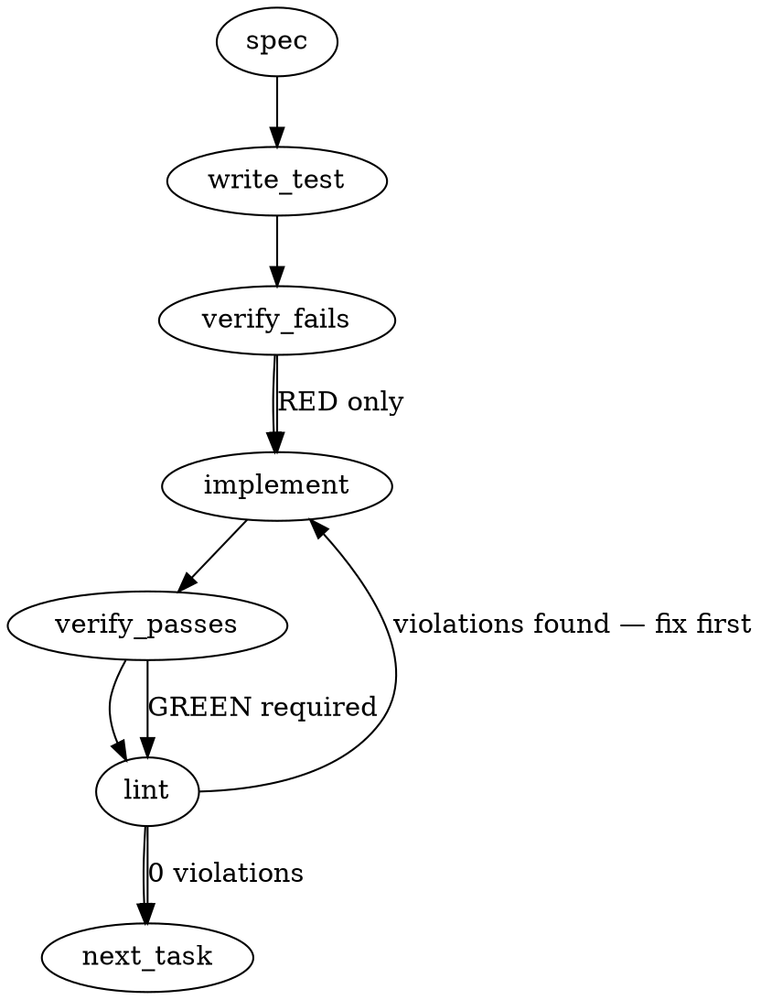

### Problem Statement

The Stage 4 verification pipeline needs a configuration mechanism to define its "verification baseline"—the specific set of files (e.g., test files, fixtures, out-of-scope files) where a compiled rule is strictly expected _not_ to trigger. This requires adding a consumer override configuration field (`review.stage4Baseline`), extending `.totemignore` parser semantics, and implementing a deterministic resolver function, while strictly enforcing the term "baseline" over "allowlist" across all code surfaces.

### Architectural Context

- **ADR-091 Ingestion Pipeline Refinements:** Stage 4 verification enforces rule safety by running compiled rules against the codebase. The verification baseline acts as the control group.
- **GCA Naming Finding (PR #1607):** The term `allowlist` was flagged as counter-intuitive in this context. All schema fields, types, documentation, and error messages MUST use `baseline` framing. `allowlist` is treated as a severe naming regression.
- **Stubbed T1 Baseline:** `packages/core/src/stage4-verifier.ts` currently contains `interface Stage4Baseline` and `getDefaultBaseline()` which must be refactored to consume the new `resolveStage4Baseline` logic.

### Files to Examine

1. `packages/core/src/stage4-verifier.ts` — Contains the existing `Stage4Baseline` interface and `getDefaultBaseline()` stub that must be updated.
2. `packages/core/src/config.ts` (or equivalent config definition file) — Where the Zod configuration schema for `totem.config.ts` resides.
3. `packages/cli/src/ignore.ts` (or equivalent `.totemignore` parser) — Needs extension to parse `# stage4-baseline:` directives.
4. `docs/wiki/cli-reference.md` — Requires documentation for the `.totemignore` extension syntax.

### Technical Approach & Contracts

We will implement `resolveStage4Baseline(config, lesson, ignoreDirectives)` which returns an evaluated baseline object capable of deterministic `isBaseline(filePath)` checks.

**Data Contracts:**

1. **Config Schema Extension** (Zod):
   ```typescript
   export const Stage4BaselineConfigSchema = z.object({
     extend: z.array(z.string()).default([]),
     exclude: z.array(z.string()).default([]),
   });
   // Inside ReviewConfigSchema
   stage4Baseline: Stage4BaselineConfigSchema.optional();
   ```
2. **Resolver Interface**:

   ```typescript
   export interface Stage4Baseline {
     // Explicit list of positive and negative globs for logging/debugging
     globs: string[];
     // O(1) evaluation wrapper around glob matching
     isBaseline: (filePath: string) => boolean;
   }

   export function resolveStage4Baseline(
     config: TotemConfig,
     lesson: Lesson,
     ignoreDirectives?: string[], // from .totemignore
   ): Stage4Baseline;
   ```

**Sequence Logic for `resolveStage4Baseline`:**

1. **Gather Default Positives:** `['**/*.test.*', '**/*.spec.*', '**/tests/**/*.*', '**/__tests__/**/*.*', '**/fixtures/**', '**/__fixtures__/**']`
2. **Apply `.totemignore` Extends:** Append `ignoreDirectives` parsed from `# stage4-baseline: <glob>`.
3. **Apply Config `extend`:** Append `config.review.stage4Baseline.extend`.
4. **Apply Config `exclude`:** Append as negated globs `config.review.stage4Baseline.exclude.map(g => g.startsWith('!') ? g : \`!\${g}\`)`.
5. **Apply Lesson Overrides (The "Test-Contract" Scope):** If `lesson.fileGlobs` explicitly targets test/fixture patterns, append those specific `lesson.fileGlobs` as negated globs so they are removed from the baseline.
6. **Apply Implicit Out-of-Scope Rules:** Within `isBaseline(filePath)`, the first check MUST be: `if (!matches(filePath, lesson.fileGlobs)) return true;`. Files outside the lesson's target scope are implicitly baseline.

### Edge Cases & Traps

- **The "Allowlist" Trap:** Developers often subconsciously use `allowlist` in internal variable names, test descriptions, or CLI error outputs. Code review tools or Linters will flag this. Ensure zero presence of the string `allowlist` in the PR.
- **`.totemignore` Whitespace:** Comments might have arbitrary whitespace: `#stage4-baseline:glob`, `# stage4-baseline: glob`, or trailing spaces. The regex must handle `/^#\s*stage4-baseline:\s*(.+)$/` cleanly.
- **Negative Glob Precedence:** `exclude` patterns must be appended _after_ `extend` and default patterns so that glob matchers evaluate them as strict overrides.
- **Implicit Exclusion Race:** Make sure `isBaseline` evaluates the "is it outside `lesson.fileGlobs`?" rule _before_ standard glob matching, as an out-of-scope file is always baseline regardless of user `extend`/`exclude` configuration.

### Implementation Tasks

- [ ] **Task 1: Extend Configuration Schema**
  - Modify `packages/core/src/config.ts` (or relevant config file) to add `review.stage4Baseline` to the main Zod schema.
  - Define `extend: z.array(z.string())` and `exclude: z.array(z.string())`.
  - Add strict typings to `TotemConfig` interface.
    > TOTEM INVARIANT (Schema-name discipline): Every public surface must use "baseline" framing. No `allowlist` aliases permitted in schema keys or type properties.
    > TEST DIRECTIVE: Before implementing, write a failing test named `rejects_allowlist_key_in_stage4_config` that ensures using `allowlist` throws a Zod error, and another named `validates_extend_and_exclude_arrays` for the happy path.
  - write test (or update existing) → verify fails → implement → verify passes → lint

- [ ] **Task 2: Parse `.totemignore` Directives**
  - Modify the `.totemignore` parsing logic (likely `packages/cli/src/ignore.ts` or similar core utility).
  - Add a regex extractor for `/^#\s*stage4-baseline:\s*(.+)$/` that runs line-by-line.
  - Expose a `getStage4BaselineDirectives(ignoreFileContent: string): string[]` helper.
    > TEST DIRECTIVE: Before implementing, write a failing test named `parses_stage4_baseline_comments_with_variable_whitespace` that asserts `['src/temp/**', 'e2e/**']` is extracted from mixed-whitespace comment lines.
  - write test (or update existing) → verify fails → implement → verify passes → lint

- [ ] **Task 3: Implement `resolveStage4Baseline`**
  - Update `packages/core/src/stage4-verifier.ts`.
  - Create `resolveStage4Baseline(config, lesson, ignoreDirectives)` adhering to the Sequence Logic defined in Technical Approach.
  - Return the `Stage4Baseline` interface containing both the composed `.globs` array and the `isBaseline(filePath)` evaluator function.
  - Ensure `isBaseline` returns `true` immediately if the file does not match `lesson.fileGlobs`.
    > TEST DIRECTIVE: Before implementing, write a failing test named `removes_test_files_from_baseline_if_explicitly_in_lesson_globs` ensuring that if a lesson explicitly targets `**/*.test.ts`, `isBaseline('foo.test.ts')` returns false.
  - write test (or update existing) → verify fails → implement → verify passes → lint

- [ ] **Task 4: Wire Verifier Stub and Documentation**
  - Update `getDefaultBaseline()` in `packages/core/src/stage4-verifier.ts` to act as a backward-compatible wrapper or replace it entirely with `resolveStage4Baseline` calls in the verifier.
  - Update `docs/wiki/cli-reference.md` under the `.totemignore` section. Document the new `# stage4-baseline: <glob>` syntax and the explicit warning against using the word "allowlist".
  - write test (or update existing) → verify fails → implement → verify passes → lint

### Execution Flow (structural constraint)



### Verification (MANDATORY — do not skip)

Every implementation MUST end with these steps:

1. `totem lint` — deterministic rule check (zero LLM, ~2s). Fixes any violations.
2. `totem review` — AI-powered architectural review (~18s). Addresses any critical findings.
3. If using MCP, call `verify_execution` to confirm compliance before declaring the task done.

### Test Plan

- **Config Validations:** Tests proving Zod rejects `allowlist`, validates `extend` and `exclude` as arrays of strings.
- **Parsing Robustness:** Tests passing strings with `#stage4-baseline:`, `# stage4-baseline:   `, and ensuring standard comments are ignored.
- **Resolver Logic (The "Truth Table"):**
  - `filePath` outside `lesson.fileGlobs` -> returns `true`.
  - `filePath` inside `lesson.fileGlobs` AND matches default test globs -> returns `true`.
  - `filePath` inside `lesson.fileGlobs` AND matches test globs AND lesson explicitly targets test globs -> returns `false`.
  - `filePath` matches `config.extend` -> returns `true`.
  - `filePath` matches `config.exclude` -> returns `false`.

---

## Implementation Design

### Scope

**Will do:** T2 baseline overrides (`#1683`) + matchesGlob consolidation (`#1758`) + manifest self-match exclusion (`#1765`) bundled in one PR. All three touch `packages/core/src/stage4-verifier.ts` overlapping surfaces — the matchesGlob site, the classifyFile site, and the listFiles consumption site — and bundling avoids three sequential CR cycles on the same file.

**Will NOT do:** Per-rule baseline overrides (a single rule defining its own baseline outside the consumer-level config) — defer per `#1683` Out of Scope. The `.totem/lessons*.md` exclusion question raised in `#1765` open question — this PR ships only `.totem/compiled-rules.json` exclusion (the demonstrated case from the AC #1 probe); further manifest paths get added in a follow-up if/when self-match surfaces on lessons.md too. T3 (`#1684`) `.totem/rule-metrics.json` schema. T4/T5 verifier UX/perf.

### Data model deltas

**New types (exported from `@mmnto/totem`):**

| Type                                       | Holds                                                                                                                                                                                                                                          | Writers                               | Readers                                                           | Invariants                                                                                                                                                                                                           |
| ------------------------------------------ | ---------------------------------------------------------------------------------------------------------------------------------------------------------------------------------------------------------------------------------------------- | ------------------------------------- | ----------------------------------------------------------------- | -------------------------------------------------------------------------------------------------------------------------------------------------------------------------------------------------------------------- |
| `Stage4BaselineConfig` (Zod-inferred)      | `{ extend: string[], exclude: string[] }`                                                                                                                                                                                                      | User via `totem.config.ts`            | `resolveStage4Baseline`                                           | Both arrays default to `[]`. Both Zod-validated. No `allowlist` aliases anywhere on the type chain.                                                                                                                  |
| `Stage4Baseline` (existing, mutated shape) | Was `{ excludeFileGlobs: readonly string[] }`. Becomes `{ excludeFileGlobs: readonly string[]; extendedFromIgnoreFile: readonly string[]; extendedFromConfig: readonly string[]; excludedFromConfig: readonly string[] }` for telemetry/debug. | `resolveStage4Baseline` (sole writer) | `classifyFile` (reads `excludeFileGlobs` only) + telemetry hooks. | All four arrays read-only. The three "extended/excluded" arrays are debug surfaces — `classifyFile` does NOT read them; they exist so `totem doctor` (T4) and trace events can show provenance without re-resolving. |

**Modified types:**

- `ReviewConfigSchema` (in `config-schema.ts`) gains `stage4Baseline: Stage4BaselineConfigSchema.optional()`. Schema rejects unknown sibling keys via Zod's strict mode IF currently strict — current `ReviewConfigSchema` uses `.passthrough()`, so unknown keys silently survive. Per the GCA naming-discipline AC, I should ALSO add a Zod refinement that rejects an `allowlist` key under `stage4Baseline` with an explicit error message naming `#1683`. (Cheap, prevents future regression.)

- `Stage4VerifierDeps.listFiles` callback contract: SAME shape, but the CLI integration site at `compile.ts` filters `.totem/compiled-rules.json` from the returned set. The verifier itself does NOT filter — keeping the contract surface clean — but exposes a new exported constant `STAGE4_MANIFEST_EXCLUSIONS = ['.totem/compiled-rules.json']` so callers have a single source of truth.

**No new state containers** (no maps/sets/module-level variables). The resolver is a pure function.

**Reserved keys / sentinel values:** None. The `extend`/`exclude` arrays are user-glob-strings; collision with default baseline globs is fine (extend is union, exclude is set-difference).

### State lifecycle

| State                                          | Scope                 | Lifetime                                                                | Owner                                 |
| ---------------------------------------------- | --------------------- | ----------------------------------------------------------------------- | ------------------------------------- |
| `Stage4BaselineConfig` from `totem.config.ts`  | Per-process           | Loaded at config-parse time, immutable thereafter                       | `loadConfig`                          |
| `.totemignore` `# stage4-baseline:` directives | Per-resolver-call     | Read at `resolveStage4Baseline` invocation, not cached                  | `parseStage4BaselineDirectives` (new) |
| Resolved `Stage4Baseline`                      | Per-rule-verification | Computed once per `verifyStage4` call, discarded after the call returns | `resolveStage4Baseline`               |

**Cross-boundary state:** None. The `.totemignore` directive parser is invoked synchronously from within `resolveStage4Baseline`; no caching needed because Stage 4 verification runs once per compile cycle, not per file.

### Failure modes

| Failure                                                                                                | Category | Agent-facing surface                                                                                               | Recovery                                                                                        |
| ------------------------------------------------------------------------------------------------------ | -------- | ------------------------------------------------------------------------------------------------------------------ | ----------------------------------------------------------------------------------------------- |
| `review.stage4Baseline.extend` is not an array of strings                                              | init     | `TotemConfigError` at config-parse time — Zod issues bubble up via `loadConfig`'s existing pathway                 | Fix `totem.config.ts` and re-run                                                                |
| `review.stage4Baseline.exclude` contains a non-string element                                          | init     | Same as above                                                                                                      | Same                                                                                            |
| `review.stage4Baseline.allowlist` (legacy/regression)                                                  | init     | `TotemConfigError` with explicit "use 'baseline' framing per `mmnto-ai/totem#1683`" hint                           | Rename the key                                                                                  |
| `.totemignore` directive has malformed glob (e.g., empty after `:`)                                    | init     | `log.warn` (non-fatal) — resolver skips the empty entry, continues with rest                                       | The empty directive is logged but doesn't break the resolver. Caller fixes their `.totemignore` |
| `.totemignore` file missing                                                                            | init     | Silent — `parseStage4BaselineDirectives` returns `[]` when the file doesn't exist                                  | No recovery needed; it's an optional surface                                                    |
| Caller passes both `STAGE4_MANIFEST_EXCLUSIONS`-listed file AND in-scope source files                  | runtime  | The CLI's `listFiles` adapter filters the manifest before the verifier sees it. The verifier itself runs unchanged | N/A — defended at CLI boundary                                                                  |
| `classifyFile` called with a path that doesn't match any glob in either `lesson.fileGlobs` or baseline | runtime  | Returns `'in-scope'` (current behavior preserved)                                                                  | N/A                                                                                             |

No silent degradation. Every config error is fail-loud per Tenet 4.

### Invariants to lock in via tests

- `ReviewConfigSchema` rejects an `allowlist` key under `stage4Baseline` with an error message that mentions `#1683`. (Discipline guard.)
- `Stage4BaselineConfigSchema.extend` defaults to `[]` when the field is omitted; same for `exclude`.
- `parseStage4BaselineDirectives(content)` extracts globs from `# stage4-baseline: <glob>` lines with arbitrary whitespace (e.g., `#stage4-baseline:foo`, `# stage4-baseline: foo`, `#  stage4-baseline:  foo  `) and ignores other comment lines.
- `parseStage4BaselineDirectives(content)` skips empty/whitespace-only directives without throwing; returns the non-empty entries.
- `resolveStage4Baseline` composes `defaults ∪ extend(ignore) ∪ extend(config) ∖ exclude(config)`.
- `resolveStage4Baseline` returns the same `excludeFileGlobs` shape that the existing T1 verifier reads, so `classifyFile` is unchanged.
- `STAGE4_MANIFEST_EXCLUSIONS` is exported as a named constant and contains `.totem/compiled-rules.json` exactly. Future additions are append-only.
- `classifyFile` (refactored to use `fileMatchesGlobs` from `rule-engine.ts`) preserves the T1 baseline classification behavior on a fixed test matrix: same in-scope/baseline classification for the same input set as the pre-PR matchesGlob.
- The CLI integration site filters `STAGE4_MANIFEST_EXCLUSIONS` from `listFiles` output before passing to the verifier.
- Re-running the AC #1 probe (`mmnto-ai/totem#1761`) post-PR3 with the manifest filter active routes the LC `init_resource` rule to `candidate-debt` (3 in-scope hits, 0 baseline matches), matching the `EXCLUDE_MANIFEST=1` mode of the original probe.

### Open questions

- **Q1: Should `parseStage4BaselineDirectives` live in `@mmnto/totem` (core) or `@mmnto/cli`?**
  - **Options:** core (with the resolver) vs cli (with other ignore-file parsers).
  - **Recommendation:** core. The resolver lives there, `.totemignore` content is a `string` input (no fs access required from the parser itself), and core consumers (MCP, future tools) may want to re-use. Cli reads the file and hands the content to core. Same pattern as `verifyAgainstCodebase`'s callback shape.
- **Q2: Should the `Stage4Baseline` debug fields (`extendedFromIgnoreFile`, etc.) ship in T2 or defer to T4 (`totem doctor` UX)?**
  - **Options:** Ship in T2 (lightweight, used by trace events) vs defer (less type churn now, T4 adds them when it needs them).
  - **Recommendation:** Ship in T2. The cost is one type extension; the value is that T4 doesn't have to break the `Stage4Baseline` shape later. Aligns with `feedback_avoid_two_step_type_evolution.md` if it exists.
- **Q3: `fileMatchesGlobs` consolidation — keep `matchesGlob` private to `stage4-verifier.ts` and just call `fileMatchesGlobs` from `rule-engine.ts`, or fully delete `stage4-verifier.ts`'s local copy?**
  - **Options:** Keep + delegate vs delete + import.
  - **Recommendation:** Delete + import. The current `stage4-verifier.ts:matchesGlob` is the regex-based glob matcher; `rule-engine.ts:fileMatchesGlobs` is the canonical pattern-based one. Keep one source of truth per `mmnto-ai/totem#1758`. Requires exporting `fileMatchesGlobs` from `rule-engine.ts` (currently file-local, not exported). Cheapest to ship is to add `export` to the function declaration plus a barrel re-export in `packages/core/src/index.ts`.
- **Q4: Postmerge ride-along (`postmerge/1743-1747-1745-1749`) — bundle in this PR or separate?**
  - **Options:** Bundle (per session plan + memory) vs separate small PR.
  - **Recommendation:** Bundle. The held branch is metadata-only (compiled-rules.json + nonCompilable additions + agent-mirror docs). Bundling keeps the postmerge fresh and avoids a metadata-stale rebase later. Per `feedback_bundle_locally_avoid_pr_churn.md`. Note: `pnpm run format` will need to run + amend on the auto-generated agent-mirror docs (`.github/copilot-instructions.md` + `.junie/skills/totem-rules/rules.md`) per claude-0008's bundling note in MEMORY.md.

### Known limitations (deferred to T3/T4)

Tracker tickets: `mmnto-ai/totem#1684` (T3 metrics) / `mmnto-ai/totem#1685` (T4 doctor UX).

**Strict-subset rule scope vs baseline glob.** `classifyFile`'s baseline-subtraction (CR `#1766` R3, commit `65a8b4b7`) uses **byte-equal** matching (`Array.includes`) when subtracting `ruleFileGlobs` entries from `baseline.excludeFileGlobs`. This is intentional — the contract is "an explicit `fileGlobs` entry that matches a baseline entry is the rule's way of claiming that part of the baseline as its own." Glob-subset relationships are NOT resolved.

Practical consequence: a rule with `fileGlobs: ['**/*.test.ts']` (a strict-subset of the default baseline entry `**/*.test.*`) does NOT subtract the broader baseline entry. The rule's hits on `foo.test.ts` will still be classified as baseline → outcome flips to `out-of-scope` → rule archived on its own intended corpus.

Workarounds today:

- The rule author can declare `fileGlobs: ['**/*.test.*']` (byte-equal to the baseline entry) — the broader claim wins back the corpus.
- Or the consumer can `exclude: ['**/*.test.*']` from their baseline in `review.stage4Baseline.exclude` — the baseline entry goes away entirely.

Tracker: T3 (`#1684`) introduces `.totem/rule-metrics.json` and the install→lint promotion path; T4 (`#1685`) adds `totem doctor` Stage 4 UX. The strict-subset case is a candidate for inclusion in either:

- T3 could surface a metric ("rule shipped with strict-subset baseline overlap") to flag the misclassification class to compile-worker authors.
- T4 could surface a doctor finding ("rule X archived as out-of-scope but its `fileGlobs` is a strict subset of baseline glob Y; consider broadening to `Y`") to the human triage UX.

Pre-T3/T4, this is non-blocking — confirmed corpus today shows the byte-equal case (test-contract rules with `fileGlobs: ['**/*.test.*']`) is the dominant shape, not the strict-subset case. Consumer compile-worker LLM scope-derivation (`#1626`) tends to emit the broader form anyway.
