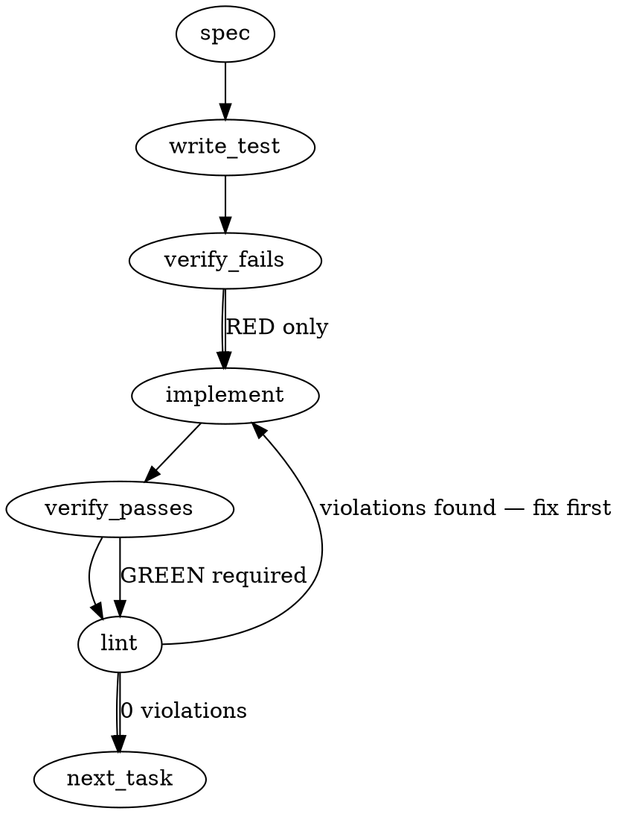

### Problem Statement

Pack rules installed from the cloud lack codebase context, meaning they cannot be trusted to fire safely until empirically verified against the consumer's repository. This feature introduces a `pending-verification` state during installation and leverages the first `totem lint` or `totem review` run to silently execute the Stage 4 verifier, promoting or demoting the rules based on the outcome while persisting results to `.totem/verification-outcomes.json`.

### Architectural Context

This work operationalizes the "Bootstrap Semantics" defined in ADR-091 and enforces the zero-trust default from ADR-089. From the provided Totem context, this interacts directly with the newly established compile pipeline (via `#1682` Stage 4 verifier, referenced in `applyStage4` logic from `packages/core/src/compile-lesson.ts`). Verification-outcomes persistence provides the memoization layer ensuring we only pay the verification cost once per rule-hash.

### Files to Examine

1. `packages/core/src/types.ts` (or equivalent schema definition file) — To update the `RuleStatus` enum and define the verification-outcomes Zod schemas.
2. `packages/core/src/compile-lesson.ts` — To observe the existing `applyStage4` verifier footprint.
3. `packages/cli/src/commands/install.ts` (or equivalent pack install logic) — To inject the `pending-verification` stamp and activation message.
4. `packages/core/src/linter.ts` (or engine orchestrator) — To intercept pending rules, trigger verification, and ensure unpromoted rules remain inert.

### Technical Approach & Contracts

We will implement an interceptor-based promotion flow during lint initialization, backed by a persistent metrics store.

**1. Data Contracts:**
Update the `CompiledRule` core schema:

```typescript
const RuleStatusSchema = z.enum(['active', 'archived', 'pending-verification']);
```

Create the `.totem/verification-outcomes.json` schema:

```typescript
const RuleVerificationOutcomeSchema = z.enum([
  'no-match',
  'stage4-out-of-scope-match',
  'in-scope-bad-example',
  'in-scope-non-bad-example',
]);

const VerificationOutcomeEntrySchema = z.object({
  hash: z.string(),
  verifiedAt: z.string().datetime(),
  outcome: RuleVerificationOutcomeSchema,
  baselineMatchPaths: z.array(z.string()).optional(),
});

export const VerificationOutcomesStoreSchema = z.record(z.string(), VerificationOutcomeEntrySchema);
// Key: Rule hash
```

**2. Approach & Trade-offs:**

- _Approach A (In-memory evaluation only)_: Re-run verification every time. Rejected, violates acceptance criteria and scales poorly.
- _Approach B (Manifest rewrite + metrics file)_: Update the `status` in the local manifest (`compiled-rules.json`) upon promotion AND write to `.totem/verification-outcomes.json`. Subsequent runs check the local manifest. Re-verification triggers if the hash in the manifest differs from the metrics file. **(Recommended)**. This maintains a single source of truth for the rule's local state while memoizing the historical outcome.

**Execution Sequence:**

1. `totem install pack/<name>` writes to local manifest with `status: 'pending-verification'`.
2. `totem lint` starts, loads the local manifest.
3. Linter identifies rules with `status === 'pending-verification'` (or where `metrics.hash !== rule.hash`).
4. Linter invokes Stage 4 verifier for each identified rule.
5. Verifier outcomes map directly to manifest mutations (e.g., `archived` + `reasonCode`, or `active` + `confidence/severity`).
6. Linter persists the local manifest AND writes to `.totem/verification-outcomes.json`.
7. Linter drops any rules from the active pipeline that failed verification or threw errors, keeping them inert.

### Edge Cases & Traps

- **Concurrent CI Writes (Race Condition):** When multiple lint processes run in CI simultaneously, they will race to write `.totem/verification-outcomes.json`. Writing must be atomic (write to a temporary file, then `fs.renameSync`) to avoid file corruption.
- **Hash Desync Trap:** If a pack author updates a rule (changing its hash) and a consumer updates the pack, the rule must drop back to `pending-verification`. The interceptor must explicitly compare the rule's current hash against the hash recorded in the metrics file.
- **Verifier Failure Inertness:** If the Stage 4 verifier throws an exception (e.g., network timeout during AST parsing), the rule MUST remain `pending-verification` and MUST NOT be fed to the engine. It must remain inert.
- **Missing Totem Directory:** The `.totem` directory might not exist yet during a CI run. The metrics writer must use `fs.mkdirSync(dir, { recursive: true })`.

### Implementation Tasks

- [ ] **Task 1: Define Contracts and Schemas**
  - Update the rule status schema in `packages/core/src/types.ts` to include `pending-verification`.
  - Add literal options for `confidence` (`untested-against-codebase`) and `reasonCode` (`stage4-out-of-scope-match`).
  - Create the `VerificationOutcomesStoreSchema` using Zod.
    > TEST DIRECTIVE: Before implementing, write a failing test named `rejects invalid verification-outcomes schema payloads` that proves malformed JSON is caught by Zod.
  - write test → verify fails → implement → verify passes → lint

- [ ] **Task 2: Implement Verification-Outcomes Persistence**
  - Create `packages/core/src/verification-outcomes.ts`.
  - Implement `readVerificationOutcomes()` using the shared `readJsonSafe<Record<string, VerificationOutcomeEntry>>('.totem/verification-outcomes.json', VerificationOutcomesStoreSchema)`. Catch `ENOENT` / TotemParseError and return an empty object `{}`, do not crash.
  - Implement `writeVerificationOutcomes()` with atomic file writing (`fs.writeFileSync` to a `.tmp` file, then `fs.renameSync`) to handle CI race conditions. Ensure `.totem` directory creation.
    > TEST DIRECTIVE: Before implementing, write a failing test named `writes metrics atomically and creates missing directories` to prevent CI file corruption.
  - write test → verify fails → implement → verify passes → lint

- [ ] **Task 3: Pack Installer Status Stamping**
  - Modify the install logic in `packages/cli/src/commands/install.ts` (or respective file).
  - Force imported rules into `status: 'pending-verification'`.
  - Output to stdout: "Run \`totem lint\` to activate pack rules".
    > TEST DIRECTIVE: Before implementing, write a failing test named `forces installed pack rules to pending-verification status and prints activation message`.
  - write test → verify fails → implement → verify passes → lint

- [ ] **Task 4: Engine Execution Inertness Enforcement**
  - Modify rule filtering in the lint/review engine `packages/core/src/linter.ts`.
  - Strip out any rules with `status === 'pending-verification'` before they are handed to the execution engine.
    > TEST DIRECTIVE: Before implementing, write a failing test named `prevents pending-verification rules from firing during lint execution` to ensure inertness.
  - write test → verify fails → implement → verify passes → lint

- [ ] **Task 5: First-Lint Promotion Interceptor**
  - In the linter setup phase, before execution filtering, scan for rules requiring verification (`status === 'pending-verification'` OR `rule.hash !== metrics[rule.hash]`).
  - For each matching rule, invoke the Stage 4 verifier.
  - Apply the four outcomes directly to the rule object in memory (`active`/`archived`, updating `confidence`, `severity`, and `reasonCode`).
  - If a verifier throws an error, catch it, log a warning, and leave the rule as `pending-verification`.
  - Accumulate outcomes, then call `writeVerificationOutcomes()`.
  - Save the updated local manifest (`compiled-rules.json`).
    > TEST DIRECTIVE: Before implementing, write a failing test named `promotes pending rules to active with candidate debt on in-scope non-bad-example match`.
  - write test → verify fails → implement → verify passes → lint

### Execution Flow (structural constraint)



### Verification (MANDATORY — do not skip)

Every implementation MUST end with these steps:

1. `totem lint` — deterministic rule check (zero LLM, ~2s). Fixes any violations.
2. `totem review` — AI-powered architectural review (~18s). Addresses any critical findings.
3. If using MCP, call `verify_execution` to confirm compliance before declaring the task done.

### Test Plan

- **Installer Stamping:** Verify `totem install pack/test-pack` correctly modifies the local manifest to `pending-verification` and does not default to `active`.
- **Inertness:** Provide a codebase containing a known violation of a `pending-verification` rule. Verify `totem lint` ignores it and returns clean.
- **Promotion to Debt:** Provide a baseline violation of a `pending-verification` rule (non-badExample shape). Verify `totem lint` triggers promotion, changes status to `active` with `severity: warning`, and outputs the Candidate Debt.
- **Demotion to Archived:** Provide an out-of-scope baseline violation. Verify rule transitions to `archived` with `reasonCode='stage4-out-of-scope-match'` and no engine execution occurs for it.
- **Memoization:** Verify the second `totem lint` run does not invoke the Stage 4 verifier again by stubbing the verifier and asserting it is called 0 times.
- **Hash Invalidation:** Manually alter the rule hash in the local manifest. Verify `totem lint` re-invokes the verifier.

---

## Implementation Design

### Scope

This implementation adds a `pending-verification` rule status, the install→lint promotion machinery that runs the **existing** Stage 4 verifier (shipped via `mmnto-ai/totem#1682` / `#1683` / `#1766`) on first-touch of pack-installed rules, and the `.totem/verification-outcomes.json` persistence layer that memoizes outcomes across runs. Out of scope: any `totem doctor` UX surfaces (`mmnto-ai/totem#1685`), Stage 4 perf hardening (`mmnto-ai/totem#1686`), Sigstore signing (`mmnto-ai/totem#1492`), or modifications to the verifier itself (callers only — the verifier API is frozen as `verifyAgainstCodebase` + `resolveStage4Baseline`).

### Data model deltas

**1. `CompiledRule.status` enum extension** (`packages/core/src/compiler-schema.ts:117`)

- Current (post-#1682): `z.enum(['active', 'archived', 'untested-against-codebase']).optional()`
- New: `z.enum(['active', 'archived', 'untested-against-codebase', 'pending-verification']).optional()`
- Semantic: rule is in the local manifest but the Stage 4 verifier has never run against the consumer's codebase. Inert at lint time exactly the way `'archived'` and `'untested-against-codebase'` are.
- **Writer:** `installCommand` in `packages/cli/src/commands/install.ts` — stamps every rule from a pack manifest at install time, **before** `mergeRules` writes to `.totem/compiled-rules.json`.
- **Reader:** the existing inertness filter at `packages/core/src/compiler.ts:132` (`loadCompiledRules` archived-filter) gets extended to also drop `pending-verification` rules from the engine pipeline. Plus the new first-lint promotion interceptor.
- **Invariant:** a rule MUST NOT remain `pending-verification` after the Stage 4 verifier has run successfully on it — exactly one of the four outcome statuses replaces it. If the verifier throws on that rule, the status stays `pending-verification` and the next lint retries.

> **Spec correction note:** Gemini's auto-generated spec above proposed `RuleStatusSchema = z.enum(['active', 'archived', 'pending-verification'])` — that drops the existing `'untested-against-codebase'` value shipped by #1682. The actual delta is an EXTENSION of the existing enum, not a replacement. The implementation follows the existing schema's vocabulary verbatim.

**2. `VerificationOutcomesStore` schema** (new file `packages/core/src/verification-outcomes.ts`)

```typescript
import { z } from 'zod';

// Mirrors Stage4Outcome from stage4-verifier.ts EXACTLY (same string literals).
// Keeping storage vocabulary aligned with the runtime type avoids a translation
// layer that would drift.
export const Stage4OutcomeStored = z.enum([
  'no-matches',
  'out-of-scope',
  'in-scope-bad-example',
  'candidate-debt',
]);

export const VerificationOutcomeEntrySchema = z.object({
  ruleHash: z.string().min(1),
  verifiedAt: z.string().datetime(),
  outcome: Stage4OutcomeStored,
  baselineMatches: z.array(z.string()).default([]),
  inScopeMatches: z.array(z.string()).default([]),
  candidateDebtLines: z.array(z.string()).default([]),
});

export const VerificationOutcomesFileSchema = z.object({
  version: z.literal(1).default(1),
  outcomes: z.record(z.string(), VerificationOutcomeEntrySchema),
});
export type VerificationOutcomeEntry = z.infer<typeof VerificationOutcomeEntrySchema>;
export type VerificationOutcomesFile = z.infer<typeof VerificationOutcomesFileSchema>;
```

- **Writer:** first-lint promotion interceptor — single atomic write per lint pass that touched ≥1 pending rule.
- **Reader:** lint startup — loads metrics to skip re-verification on rules whose `ruleHash` matches the current rule.
- **Invariant:** when `metrics[ruleHash]` exists and `rule.lessonHash === ruleHash`, no re-verification is invoked.
- **No reserved keys.** Direct `record<hash, entry>` shape. The `version` field is the forward-compat handle.
- **Schema-version bump policy:** structural changes to `VerificationOutcomeEntrySchema` increment `version` and the loader treats older versions as "no metrics" (re-verify everything). No silent migration in v1.
- **Vocabulary alignment with Gemini's spec:** Gemini proposed outcome literals `'no-match' | 'stage4-out-of-scope-match' | 'in-scope-bad-example' | 'in-scope-non-bad-example'` — those don't match the actual `Stage4Outcome` type (`'no-matches' | 'out-of-scope' | 'in-scope-bad-example' | 'candidate-debt'`). The implementation uses the actual type's literals to avoid a redundant translation layer.

**3. Activation message** (`packages/cli/src/commands/install.ts`)

Plain stdout addition after the existing `Installed ${packName}.` success line: `Run \`totem lint\` to activate pack rules`. Not a data type — but locked in via test (Invariant #8).

### State lifecycle

| State piece                         | Scope                                                                   | Lifetime                                                                                                                                                                   | Owner                                                                    |
| ----------------------------------- | ----------------------------------------------------------------------- | -------------------------------------------------------------------------------------------------------------------------------------------------------------------------- | ------------------------------------------------------------------------ |
| `pending-verification` on rule      | Persistent (`.totem/compiled-rules.json`)                               | Created at install; cleared on first successful Stage 4 outcome; persists across sessions; survives pack reinstall (re-stamped)                                            | `installCommand` (creates); `firstLintPromote` (clears, one per outcome) |
| `.totem/verification-outcomes.json` | Persistent (per-repo, **committable** per ADR-091 § Bootstrap CI-first) | Created on first lint with pending rules; mutated on every lint pass that runs the verifier; never auto-deleted (`mmnto-ai/totem#1685` will surface 30-day-stale warnings) | `firstLintPromote` (writes); `loadVerificationOutcomes` (reads)          |
| In-memory verification result       | Per-process (per lint invocation)                                       | Created during interceptor; consumed for status mutation + atomic write; discarded at process exit                                                                         | `firstLintPromote` only                                                  |

**Crossing-boundary call-out:** install-time status stamps on `compiled-rules.json` are consumed by a later separate process (`totem lint`). This is the canonical Totem lifecycle pattern (already used by `'archived'` flagging) — no new pattern introduced. The two state files (`compiled-rules.json` + `verification-outcomes.json`) are linked by `lessonHash`; never co-mutated in the same write transaction (each has its own atomic write).

### Failure modes

| Failure                                                                                                                      | Category              | Agent-facing surface                                                                               | Recovery                                                                                                         |
| ---------------------------------------------------------------------------------------------------------------------------- | --------------------- | -------------------------------------------------------------------------------------------------- | ---------------------------------------------------------------------------------------------------------------- |
| `installCommand` cannot write `.totem/compiled-rules.json` (perm/disk)                                                       | runtime               | hard error via `TotemError` (existing path, unchanged)                                             | manual fix; pack stays uninstalled                                                                               |
| Concurrent CI writes to `.totem/verification-outcomes.json`                                                                  | runtime (race)        | rare; corruption hazard                                                                            | atomic write: `fs.writeFileSync('.tmp')` then `fs.renameSync(.tmp, final)`; corrupt-read → re-verify all pending |
| `verifyAgainstCodebase` throws on a single rule                                                                              | runtime (transient)   | `log.warn` + leave rule as `pending-verification`                                                  | next `totem lint` retries; per-rule try/catch isolates the failure; lint pass MUST complete                      |
| `.totem/` directory missing in fresh CI checkout                                                                             | runtime (init)        | silent `fs.mkdirSync(dir, { recursive: true })` before write                                       | idempotent                                                                                                       |
| `verification-outcomes.json` schema validation fails on read (corrupt / older version / hand-edit)                           | permanent file state  | `log.warn` + treat as empty store; re-verify all pending rules; OVERWRITE on next successful write | self-healing on next lint pass                                                                                   |
| Pack-installed rule hash differs from `metrics[hash]` (pack updated)                                                         | runtime               | rule re-enters verification path; old `metrics[oldHash]` becomes orphan                            | orphan-prune is a `totem doctor` concern (`#1685`), not in this PR                                               |
| Lint pass with zero pending rules                                                                                            | runtime (common case) | no-op fast path                                                                                    | n/a                                                                                                              |
| `.totem/verification-outcomes.json` exists but `metrics[ruleHash]` is missing for a rule still marked `pending-verification` | runtime               | re-verify the rule (treat as fresh)                                                                | normal operation                                                                                                 |

All silent-degradation rows justified vs Tenet 4: corrupt `verification-outcomes.json` is recoverable per-machine cache state (re-verify is cheap and produces identical outcomes); verifier-throw is recoverable (next lint retries); rule status itself is **never** silently degraded — every status mutation is explicit and deterministic.

### Invariants to lock in via tests

1. **Install-time stamping**: `installCommand` on a pack containing N rules produces exactly N entries in the consumer's `compiled-rules.json` with `status === 'pending-verification'`. No rule slips through with `'active'` or undefined status.
2. **Inertness**: `loadCompiledRules` filters out `pending-verification` rules the same way it filters `'archived'`. The engine never sees them.
3. **Four-outcome status mutation** — each Stage 4 outcome maps deterministically:
   - `'no-matches'` → `status: 'untested-against-codebase'` (existing T1 semantic)
   - `'out-of-scope'` → `status: 'archived'` + `archivedReason: 'stage4-out-of-scope-match'` + `archivedAt: <iso>`
   - `'in-scope-bad-example'` → `status: 'active'` + `confidence: 'high'`
   - `'candidate-debt'` → `status: 'active'` + `severity: 'warning'` (force-override regardless of authored severity)
4. **Memoization across runs**: second `totem lint` after a successful first-lint promotion invokes `verifyAgainstCodebase` ZERO times; outcomes pulled from `verification-outcomes.json` exclusively.
5. **Hash-invalidation re-verify**: when `metrics[ruleHash]` is absent for a `pending-verification` rule, the verifier IS invoked. (Pack-content change → new `lessonHash` → metrics absent → re-verify.)
6. **Atomic write**: `writeVerificationOutcomes` writes via temp+rename; simulated mid-write interrupt does not corrupt the prior valid file.
7. **Verifier-throw isolation**: when one rule's verifier throws, other rules' verification proceeds; the thrown rule remains `pending-verification`; the lint pass completes cleanly (no process exit).
8. **Activation message exact-match**: `totem install pack/<name>` stdout contains the literal string `Run \`totem lint\` to activate pack rules`. Locked in via exact-substring assertion.
9. **Empty-pending fast path**: `totem lint` with zero `pending-verification` rules in the manifest does NOT read `.totem/verification-outcomes.json` (file-read penalty avoided in the common case).
10. **Corrupt-metrics resilience**: load with deliberately-malformed `verification-outcomes.json` produces `log.warn` + empty store + re-verifies all pending; subsequent lint write overwrites the corrupted file with valid v1 content.
11. **Byte-stable serialization across runs** (strategy-Claude observation, 2026-05-01): a second `totem lint` immediately after a successful first-lint promotion produces a **byte-identical** `.totem/verification-outcomes.json`. Achieved via canonical-key-order JSON serialization on write. Locks the committable-file-without-phantom-diff property at the file level so consumer repos don't see noise diffs on every CI run.

### Open questions

- **Q1 — Where does the first-lint promotion interceptor module live?**
  - **Options:**
    - (a) `packages/core/src/rule-engine.ts` — colocate with `applyRulesToAdditions`. Already imports verifier; smaller import graph delta.
    - (b) New file `packages/core/src/first-lint-promote.ts` exporting a single `promotePendingRules(deps)` entry point. Clean module boundary, easier unit testing, separable failure modes from the rule-engine hot path.
    - (c) Inside the CLI lint command (`packages/cli/src/commands/lint.ts`). Couples promotion semantics to CLI.
  - **Recommendation:** (b). The promotion logic owns its own state (verification-outcomes IO), its own failure modes (verifier-throw isolation + atomic write), and its own tests. Keeping it in core means MCP / `totem review` / future test runners can reuse the promotion path. (c) is wrong because it ties lifecycle policy to a CLI command. (a) bloats `rule-engine.ts`.

- **Q2 — Which baseline does the interceptor pass to `verifyAgainstCodebase` for pack-installed rules?**
  - **Options:**
    - (a) Consumer's `review.stage4Baseline` config (resolver from `#1683` already covers this).
    - (b) Pack-author-supplied baseline metadata (would require pack manifest extension).
  - **Recommendation:** (a). The whole point of pending-verification is that verification happens **against the consumer's codebase** — so the consumer's baseline is the right one. The existing `resolveStage4Baseline(config, lesson)` already takes `(config, lesson)` and produces the right baseline; pack rules are just compiled lessons and reuse this surface unchanged. (b) would re-introduce the cloud-compile bootstrap gap that ADR-091 § Bootstrap Semantics solves.

- **Q3 — Should `verification-outcomes.json` be `.gitignore`'d or committable?**
  - **Options:**
    - (a) `.gitignore`'d — per-machine state; CI re-verifies fresh.
    - (b) Committable — ticket says "the file is committable so subsequent CI runs and local runs share the verification result."
  - **Recommendation:** (b). Per the ticket and ADR-091 § Bootstrap CI-first explicit text. Documenting in `docs/wiki/cli-reference.md` install section is in scope; updating `.gitignore` to NOT-ignore the file is the deliverable.

- **Q4 — `installCommand` currently merges pack rules into the consumer manifest before any status manipulation. Where is the cleanest seam to inject the `pending-verification` stamp?**
  - **Options:**
    - (a) Mutate the pack-rules array in-memory pre-`mergeRules` call (`installCommand` in `install.ts`). Two-line change; the pack's manifest on disk is unchanged.
    - (b) Push the stamp into `mergeRules` itself with a flag (e.g., `mergeRules(target, source, { stampPending: true })`). Keeps the install-flow simple but bloats core API.
    - (c) Stamp post-merge in the consumer manifest. Requires a second pass over the merged result.
  - **Recommendation:** (a). Lowest surface-area change. The pack's on-disk manifest is read-only from the installer's perspective; mutating the in-memory copy before merge is local, testable, and doesn't change `mergeRules` semantics for non-install consumers.

- **Q5 — Test coverage for the lint integration: should the first-lint interceptor be unit-tested in core (with mocked verifier), or end-to-end via a real CLI lint pass?**
  - **Options:**
    - (a) Core unit tests with mocked `Stage4VerifierDeps` (the existing pattern from `stage4-verifier.test.ts`). Fast, deterministic, low friction.
    - (b) Full CLI integration test that installs a fake pack, runs `totem lint`, asserts verification-outcomes output. High fidelity, slow.
    - (c) Both — unit for the four-outcome mutation + atomic write semantics; one end-to-end smoke test for the full pipeline.
  - **Recommendation:** (c). Same pattern as the existing Stage 4 substrate (`mmnto-ai/totem#1757`).

Five open questions, none blocking — all carry a recommendation.
