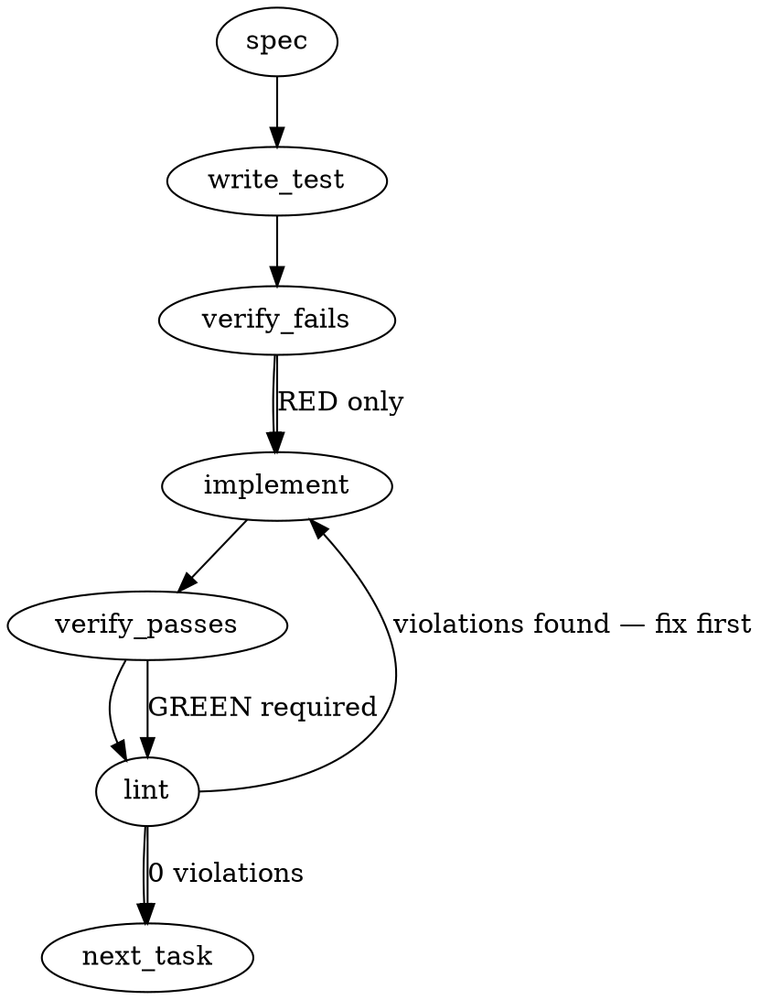

### Problem Statement

The hardcoded `.strategy` git submodule creates unnecessary downstream CI costs and pull request noise for pure strategy repository updates. We need to replace it with a configurable `STRATEGY_ROOT` resolver that dynamically locates the strategy repository (prioritizing sibling directories and environment variables) while explicitly handling missing-strategy states with actionable errors across all programmatic consumers.

### Architectural Context

- **ADR-088 (Actionable Error UX):** Demands fail-loud, actionable error messages instead of silent omissions or raw stack traces when dependencies (like the strategy repo) are missing.
- **Gemini Styleguide (Declined Patterns):** Mandates avoiding Zod schemas for small parsers or data structures (<10 fields). The MCP strategy extraction payload updates must use standard TS types rather than introducing new Zod schemas.

### Files to Examine

1. `packages/mcp/src/state-extractors.ts` — Currently hardcodes `.strategy` in `extractStrategyPointer`; must be updated to use the new resolver and return the new graceful-degrade payload.
2. `packages/cli/src/utils/governance.ts` — Contains `resolveGovernancePaths`, which already scaffolds into `.strategy`; needs to flip its default and integrate the actionable fail-loud error.
3. `totem.config.ts` — Contains the `linkedIndexes` array; needs to accept dynamic paths or gracefully skip missing ones.
4. `scripts/benchmark-compile.ts` & `scripts/bench-lance-open.ts` — Need to be pointed to the new resolver instead of hardcoded paths.
5. `docs/architecture.md` & `CONTRIBUTING.md` — Require documentation updates for the sibling-clone expectation.

### Technical Approach & Contracts

**1. The Resolver Function (`packages/core/src/strategy-resolver.ts`)**
Create a central utility `resolveStrategyRoot(cwd: string): StrategyRootStatus` that checks paths in this strict order:

1. `process.env.STRATEGY_ROOT` (resolved absolutely against `cwd`)
2. `totem.config.ts` configured path (if present)
3. Sibling path: `path.join(resolveGitRoot(cwd) || cwd, '../totem-strategy')`
4. Submodule fallback: `path.join(resolveGitRoot(cwd) || cwd, '.strategy')`

**Data Contracts:**

```typescript
export type StrategyRootStatus =
  | { resolved: true; path: string; source: 'env' | 'config' | 'sibling' | 'submodule' }
  | { resolved: false; reason: string };

// Updated MCP Payload for describe_project
export type StrategyPointer =
  | { resolved: true; sha: string | null; latestJournal: string | null }
  | { resolved: false; reason: string };
```

**2. Consumer Updates**

- **MCP (`state-extractors.ts`):** Call `resolveStrategyRoot`. If `resolved: false`, return `{ resolved: false, reason: status.reason }`. Do not throw.
- **Governance (`governance.ts`):** Call `resolveStrategyRoot`. If `resolved: false`, throw a `TotemError` with instructions to clone `totem-strategy` as a sibling directory.
- **Doctor Command:** Add a diagnostic step that calls `resolveStrategyRoot` and yields a warning if unresolved.
- **Federated Search / LanceDB Config:** If `resolveStrategyRoot` fails, emit a console warning and omit the strategy index from the array rather than crashing the search process.

### Edge Cases & Traps

- **Relative Path Resolution Context:** A sibling fallback `../totem-strategy` resolved against `cwd` will fail if the CLI is invoked deeply inside the repo (e.g., `cd packages/core && totem proposal new`). You _must_ resolve the sibling path against the repository root using the shared `resolveGitRoot(cwd)` helper.
- **Path Exists but is a File:** Checking `fs.existsSync` is not enough. You must use `fs.statSync(path).isDirectory()` to prevent catastrophic failures when `STRATEGY_ROOT` accidentally points to a file.
- **Missing `git` context:** If `resolveGitRoot` returns `null` (e.g., running from a non-git directory), the resolver must handle it gracefully (fallback to `cwd`).
- **`totem.config.ts` schema constraints:** If adding a property to `totem.config.ts`, ensure its internal Zod schema (already existing) is updated to accept `strategyRoot?: string`.

### Implementation Tasks

- [ ] **Task 1: Core Strategy Resolver**
      Create `packages/core/src/strategy-resolver.ts` and export `resolveStrategyRoot`. Add `strategyRoot?: z.string().optional()` to the configuration schema if one exists.

  > TOTEM INVARIANT (Reuse Shared Helpers): You MUST use `resolveGitRoot(cwd)` to determine the repository root before appending `../totem-strategy` or `.strategy`.
  > TEST DIRECTIVE: Before implementing, write a failing test named `returns unresolved status when all target directories are missing or are files instead of directories` in `packages/core/test/strategy-resolver.test.ts`.
  > write test → verify fails → implement → verify passes → lint

- [ ] **Task 2: Update MCP Extractors**
      Modify `packages/mcp/src/state-extractors.ts` to use `resolveStrategyRoot`. Update the `StrategyPointer` TypeScript return type.

  > TOTEM INVARIANT (Gemini Styleguide): Do not use Zod to validate the returned `StrategyPointer` object; rely purely on TypeScript types since it has <10 fields.
  > TEST DIRECTIVE: Before implementing, write a failing test named `returns resolved false payload when strategy root is missing` in `packages/mcp/test/state-extractors.test.ts`.
  > write test → verify fails → implement → verify passes → lint

- [ ] **Task 3: Update Governance Scaffolding**
      Modify `packages/cli/src/utils/governance.ts` (`resolveGovernancePaths`). Replace the hardcoded dual-mode logic with `resolveStrategyRoot`.

  > TOTEM INVARIANT (ADR-088): You MUST throw a `TotemError` with a clear, actionable message detailing the sibling clone instruction if the strategy root is unresolved. Do not let it throw a generic filesystem error.
  > TEST DIRECTIVE: Before implementing, write a failing test named `throws TotemError with sibling-clone instructions when strategy root is unresolvable` in `packages/cli/test/governance.test.ts`.
  > write test → verify fails → implement → verify passes → lint

- [ ] **Task 4: Update config and Federated Search**
      Modify `totem.config.ts` logic that configures `linkedIndexes`. Map it to use the new resolver, filtering out the strategy index with a logged warning if unresolvable.

  > TEST DIRECTIVE: Before implementing, write a failing test named `omits strategy index and warns when strategy root is unresolvable` in the relevant search configuration test suite.
  > write test (or update existing) → verify fails → implement → verify passes → lint

- [ ] **Task 5: Update Scripts & Totem Doctor**
      Update `scripts/benchmark-compile.ts` and `scripts/bench-lance-open.ts` to use the resolver. Add a new diagnostic in `totem doctor` that warns about unresolved strategy paths.

  > TEST DIRECTIVE: Before implementing, write a failing test named `reports unresolvable strategy root as an advisory warning not a hard failure` in `packages/cli/test/doctor.test.ts`.
  > write test → verify fails → implement → verify passes → lint

- [ ] **Task 6: Documentation Updates**
      Update `CONTRIBUTING.md` to add the "Strategy repo expectations" section. Update `docs/architecture.md` to reflect the configurable nature of the strategy root.
      write test (N/A) → verify fails (N/A) → implement → verify passes (N/A) → lint

### Execution Flow (structural constraint)



### Verification (MANDATORY — do not skip)

Every implementation MUST end with these steps:

1. `totem lint` — deterministic rule check (zero LLM, ~2s). Fixes any violations.
2. `totem review` — AI-powered architectural review (~18s). Addresses any critical findings.
3. If using MCP, call `verify_execution` to confirm compliance before declaring the task done.

### Test Plan

- **Environment Override:** Set `STRATEGY_ROOT=/tmp/mock-strategy`, verify `resolveStrategyRoot` prioritizes it and returns `{ resolved: true, source: 'env' }`.
- **Deep CWD Execution:** Execute `totem proposal new` from inside `packages/mcp/src/` with a sibling strategy repo. Verify it resolves to the git root's sibling, not `packages/mcp/src/../totem-strategy`.
- **Missing Directory Handled Gracefully:** Remove the `.strategy` folder and sibling folder. Run `describe_project` via MCP and verify the payload contains `strategy: { resolved: false, reason: "..." }` rather than crashing.
- **Doctor Diagnostic:** Run `totem doctor` with no strategy repo present. Verify it exits with code 0 but lists the missing strategy repo as a warning.

---

## Implementation Design

### Scope

**This PR ships:** `resolveStrategyRoot()` in `@mmnto/totem` core with a `StrategyRootStatus` discriminated-union return type, a new optional `TotemConfig.strategyRoot?: string` field, ports of all four programmatic consumers (state-extractors, governance, MCP linkedIndexes init, scripts) to the resolver, conversion of `StrategyPointerSchema` to a `z.discriminatedUnion('resolved', ...)`, a `totem doctor` strategy-root diagnostic, and a `CONTRIBUTING.md` "Strategy repo expectations" section.

**This PR does NOT ship:** removal of `.gitmodules` / `.strategy` gitlink (separate follow-up after the resolver settles); pack-distribution of strategy artifacts (Proposal 247 / 1.16.0 territory); replacement of the `linkedIndexes` array with a multi-strategy-style federated mechanism (out of scope per the issue's "Out of scope" section).

### Data model deltas

**1. New type `StrategyRootStatus` (in `packages/core/src/strategy-resolver.ts`, re-exported from `@mmnto/totem`):**

```typescript
export type StrategyRootStatus =
  | { resolved: true; path: string; source: 'env' | 'config' | 'sibling' | 'submodule' }
  | { resolved: false; reason: string };
```

- **Holds:** Resolved absolute path + which precedence layer matched, OR a reason string.
- **Writer:** `resolveStrategyRoot(cwd, options?)` — sole writer; pure function, no caching.
- **Readers:** `extractStrategyPointer` (MCP), `resolveGovernancePaths` (CLI governance), MCP `initContext` (linkedIndexes), `totem doctor`, `scripts/benchmark-compile.ts`, `scripts/bench-lance-open.ts`.
- **Invariants:** `path` is absolute (resolver normalizes via `path.resolve(<gitRoot>, raw)`). `source` is exhaustively one of four literals. When `resolved: false`, callers MUST NOT read `path` (TS discriminated union enforces).

**2. New optional field `TotemConfig.strategyRoot` (in `packages/core/src/config-schema.ts:281`-region):**

```typescript
strategyRoot: z.string().optional(),
```

- Resolved against `<gitRoot>` (or `cwd` as last-ditch fallback if outside a git repo).
- Read once during `loadConfig`; runtime is read-only.

**3. `StrategyPointerSchema` shape change** (in `packages/mcp/src/schemas/describe-project.ts:42-48`):

```typescript
export const StrategyPointerSchema = z.discriminatedUnion('resolved', [
  z.object({
    resolved: z.literal(true),
    sha: z.string().nullable(),
    latestJournal: z.string().nullable(),
  }),
  z.object({
    resolved: z.literal(false),
    reason: z.string(),
  }),
]);
```

- **BREAKING change** to MCP `describe_project` rich-state payload. Consumers must inspect `strategyPointer.resolved` before reading `sha` / `latestJournal`. Documented in changeset and CHANGELOG.
- Auto-spec proposed dropping Zod entirely; rejected — `StrategyPointerSchema` is embedded in `RichProjectStateSchema.strategyPointer` (line 92), which is the contract for the entire rich-state output. Discriminated-union is the canonical Zod tagged-union form and preserves the validation contract.

**No new state containers (no maps, sets, module-level vars, singletons). No reserved keys / sentinels.**

### State lifecycle

**`StrategyRootStatus` (per-call value):** Scope per-request. Created at the call site by `resolveStrategyRoot`, returned as a value, GC'd after the consumer reads it. No mutation. No cross-boundary lifecycle.

**`TotemConfig.strategyRoot` (loaded-config field):** Same lifetime as the loaded `TotemConfig` — server-lifetime in MCP, per-invocation in CLI commands. Read-only at runtime; user edits the file to change.

**MCP `linkedStores` map (UNCHANGED — server-lifetime):** Existing behavior. The resolver is consulted ONCE per linkedIndex entry during `initContext` (`packages/mcp/src/context.ts:216`) when the entry's path matches the literal `'.strategy'` (or any path the resolver would produce). Init-time errors continue to land in `linkedStoreInitErrors` and surface on first query — no lifecycle change.

No state crosses lifecycle boundaries.

### Failure modes

| Failure                                                                               | Category | Agent-facing surface                                                                                 | Recovery                                                                  |
| ------------------------------------------------------------------------------------- | -------- | ---------------------------------------------------------------------------------------------------- | ------------------------------------------------------------------------- |
| `STRATEGY_ROOT` env var points to a nonexistent path                                  | runtime  | `resolveStrategyRoot` returns `{resolved: false, reason}`; downstream consumers degrade per contract | Set env var to a real path or unset to fall through                       |
| `STRATEGY_ROOT` env var points to a file (not a directory)                            | runtime  | Same — `fs.statSync(...).isDirectory()` guard                                                        | Same                                                                      |
| `TotemConfig.strategyRoot` points to a nonexistent path                               | runtime  | Same                                                                                                 | Edit `totem.config.ts`                                                    |
| Sibling `../totem-strategy` missing AND `.strategy/` missing                          | runtime  | `{resolved: false, reason: 'no strategy root found...'}`                                             | Clone sibling per `CONTRIBUTING.md`                                       |
| `cwd` outside a git repo AND no env/config override                                   | runtime  | Unresolved status (resolver bails on `resolveGitRoot(cwd) === null`)                                 | Run from inside totem checkout, or set `STRATEGY_ROOT` env var explicitly |
| `extractStrategyPointer` reads unresolved status                                      | runtime  | MCP rich-state returns `strategyPointer: {resolved: false, reason}` (visible to agent — Tenet 4)     | Agent surfaces "no strategy resolvable" instead of stale pointer          |
| `resolveGovernancePaths` reads unresolved status                                      | runtime  | Throws `TotemError(CONFIG_MISSING)` with sibling-clone hint string                                   | User clones sibling, retries                                              |
| `linkedIndexes: ['.strategy']` resolves unresolvable in MCP init                      | init     | Existing `linkedStoreInitErrors` map captures; per-query warning surfaces                            | Existing recovery (clone or remove from config)                           |
| `totem doctor` runs without strategy root resolvable                                  | runtime  | New advisory `warn` diagnostic listing affected surfaces                                             | Actionable; not a hard fail (matches existing `checkLinkedIndexes` UX)    |
| Resolver called from deep cwd (e.g., `packages/mcp/src/`)                             | runtime  | Resolver anchors at `resolveGitRoot(cwd)`, NOT literal cwd                                           | N/A — handled by anchoring at git root                                    |
| `STRATEGY_ROOT` set globally in shell across multiple repos                           | runtime  | Resolver still respects the env var; consumer that touches it sees the precedence-1 hit              | Per-repo override via `totem.config.ts:strategyRoot`                      |
| Bench scripts (`benchmark-compile.ts`, `bench-lance-open.ts`) called outside the repo | runtime  | Resolver returns `unresolved`; scripts log a clear error and exit non-zero                           | Run scripts from inside the totem checkout                                |

All failure modes are init-time or runtime — none are silent-degradation. The MCP `strategyPointer.resolved: false` payload IS a signal to the agent (Tenet 4 fail-loud), not silence.

### Invariants to lock in via tests

**`resolveStrategyRoot` (`packages/core/src/strategy-resolver.test.ts`):**

- Returns `{resolved: false}` when ALL of: env unset, config field unset, sibling missing, submodule missing.
- Precedence is exactly env → config → sibling → submodule. Each layer short-circuits the rest. (Test 4 fixture pairs.)
- Returns `{resolved: false, reason}` (not throws) when `cwd` is outside a git repo AND no env/config override is set.
- Rejects (returns `unresolved`) a path that exists but is a FILE not a directory.
- Resolves relative env-var values against `<gitRoot>`, not deep-cwd. (Run from `packages/mcp/src` with `STRATEGY_ROOT=../totem-strategy` → resolves to `<gitRoot>/../totem-strategy`.)
- `path` is absolute on the `resolved: true` branch (resolver normalizes via `path.resolve`).

**`extractStrategyPointer` (`packages/mcp/src/state-extractors.test.ts`):**

- Returns `{resolved: false, reason}` when resolver returns unresolved.
- Returns `{resolved: true, sha, latestJournal}` when resolver returns resolved (with `sha`/`latestJournal` nullable per existing graceful-degrade inside the strategy dir).

**`resolveGovernancePaths` (`packages/cli/test/governance.test.ts`):**

- Throws `TotemError(CONFIG_MISSING)` with sibling-clone instruction string when resolver returns unresolved.
- Succeeds for both `submodule` and `sibling` source values without code-path divergence (the resolver hides the source).

**MCP `initContext`** (existing test surface in `packages/mcp/src/context.test.ts` or `tools/search-knowledge.test.ts`):

- Skips the strategy linkedIndex with a warning when the resolver returns unresolved (existing per-query warning path; no new surface needed).

**`totem doctor` (`packages/cli/src/commands/doctor.test.ts`):**

- New `Strategy Root` diagnostic returns `pass` when resolved, `warn` (NOT `fail`) when unresolved, surfacing affected consumers and remediation.

**`StrategyPointerSchema` (`packages/mcp/src/schemas/describe-project.test.ts`):**

- Discriminated union accepts both `{resolved: true, sha, latestJournal}` and `{resolved: false, reason}`.
- Rejects malformed mixes (e.g., `{resolved: true, reason: 'x'}`, `{resolved: false, sha: null}`).

### Open questions

**Q1 — Env-var name: `STRATEGY_ROOT` (per ticket) or `TOTEM_STRATEGY_ROOT` (namespace hygiene)?**

- **Options:** A) `STRATEGY_ROOT` (literal from issue). B) `TOTEM_STRATEGY_ROOT` (matches existing `TOTEM_TEST_*` convention; less likely to collide with arbitrary shell envs).
- **Recommendation:** B with A as accepted alias. Read `process.env.TOTEM_STRATEGY_ROOT ?? process.env.STRATEGY_ROOT`. Document the canonical form as `TOTEM_STRATEGY_ROOT` in CONTRIBUTING.md; mention `STRATEGY_ROOT` works for backward-shorthand. Cheap to support both, prevents the namespace footgun.

**Q2 — Multi-PR scope. Single PR or split?**

- **Options:** A) Single PR (resolver + 4 consumers + schema flip + doctor + tests + docs). B) Two PRs: (1) substrate (resolver + `StrategyPointerSchema` discriminated union + tests), (2) consumer port (state-extractors + governance + MCP linkedIndexes init + scripts + doctor + CONTRIBUTING.md). C) Three+ PRs (more granular).
- **Recommendation:** B. Substrate PR is small, deterministic, easy to review — and it ships the breaking schema change cleanly with one bot review cycle. Consumer-port PR has wider surface but each consumer is independently testable. Both qualify as "meaningful release candidates" per `feedback_bundle_locally_avoid_pr_churn.md`. C burns bot quota for marginal review-context gains; A risks a long bot-review tail on a single PR (the `StrategyPointerSchema` change is bot-bait).

**Q3 — Submodule fallback in resolver from day one, or sibling-only with consumer-side legacy fallback?**

- **Options:** A) Resolver supports `submodule` source (per spec). B) Resolver is sibling-only; legacy `.strategy/` access stays in consumers and is removed in the gitlink-removal PR.
- **Recommendation:** A. The resolver IS the abstraction layer that lets us flip cleanly. With the submodule fallback in the resolver, the `.gitmodules` removal PR is a one-line change to drop the fallback case + delete `.gitmodules`. Option B forces consumers to know about both paths during transition, defeating the purpose of the resolver.

**Q4 — `StrategyPointer` shape. Drop Zod (auto-spec recommendation) or convert to discriminated union?**

- **Options:** A) Drop Zod, use TS-only types (auto-spec). Loosens `RichProjectStateSchema.strategyPointer` to `z.any()` or removes validation. B) Keep Zod, convert to `z.discriminatedUnion('resolved', [...])`.
- **Recommendation:** B. The MCP rich-state output is a Zod-validated contract; loosening one field would regress the validation surface. Sixth recurrence of the auto-spec gap pattern (after `mmnto-ai/totem#1665` / `#1688` / `#1690` / `#1713` / `#1731`); design doc supersedes auto-spec per `feedback_auto_spec_gap.md`.

**Q5 — `totem.config.ts:68` `linkedIndexes: ['.strategy']` literal: leave it, or replace with a resolver-aware mechanism in this PR?**

- **Options:** A) Leave literal `'.strategy'`. The resolver kicks in inside `initContext` when iterating linkedIndexes — if the entry equals `'.strategy'`, the iterator consults the resolver to get the actual path, with graceful skip on unresolved. B) Replace the literal with a sentinel (e.g., `linkedIndexes: ['<strategy>']` or a config field `linkedStrategy: true`). C) Drop the entry and have the resolver auto-add the strategy index when resolvable.
- **Recommendation:** C, with the literal removed from `totem.config.ts:68`. Cleanest separation of concerns: the resolver owns "where is strategy", and the federated-search machinery auto-includes strategy when resolvable. `linkedIndexes` array stays for genuinely-third-party indexes (none today, but the surface remains). This requires a small change in `initContext` to inject the resolved strategy path into the iteration loop, and the user no longer hand-edits `totem.config.ts` to wire the strategy mesh — the resolver does it.
- **Alternative:** A is the defensive choice if you want zero behavior change to the linkedIndexes loop. Tradeoff: keeps a hardcoded `.strategy` literal in `totem.config.ts` that contradicts the "configurable resolver" goal.

**Q6 — Bench scripts behavior on unresolved strategy root?**

- **Options:** A) Hard error, exit non-zero (benchmarks need a real path). B) Soft warning + use a temp dir (writes the report somewhere even if strategy is missing). C) Skip the benchmark entirely.
- **Recommendation:** A. Benchmarks are dev-tooling; running them without a strategy repo is operator error and a clear fail-loud message ("set STRATEGY_ROOT or clone sibling") is the right UX. Matches Tenet 4.

---

## Triage decision

**Architectural — Phase 3 design doc drafted above.**

Six open questions surfaced (Q1-Q6). Stopping at Phase 4 approval gate before any code.
