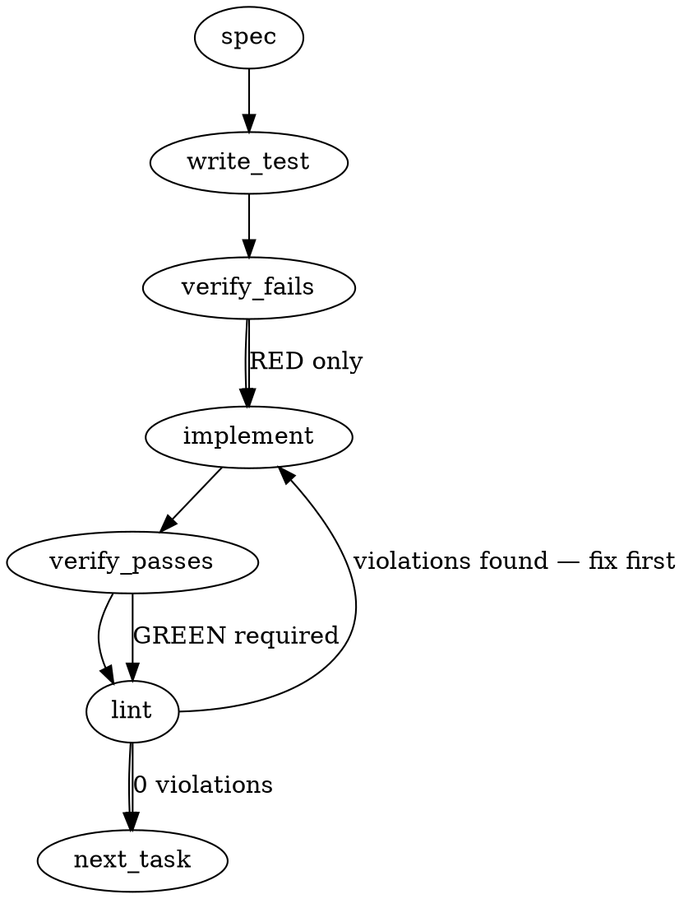

### Problem Statement

The system lacks a workflow circuit breaker to prevent massive, expensive bot-review loops (e.g., 20+ rounds) characterized by "comment drift." We need a new CLI command, `totem retrospect <pr>`, that analyzes a PR's review history when a round-count threshold is breached, using an LLM to categorize findings, suggest stop conditions, and selectively route non-critical findings into follow-up issues to unblock the PR.

### Architectural Context

None found in provided context. (Though `reviewLearnCommand` and `triagePrCommand` establish patterns for `GitHubCliPrAdapter` and LLM structured extraction).

### Files to Examine

1. `packages/cli/src/adapters/github-cli-pr.ts` — Defines the interface for fetching PR review and comment data. We must understand what thread metadata is available.
2. `packages/cli/src/commands/review-learn.ts` — Demonstrates extracting and filtering bot comments via the PR adapter.
3. `packages/cli/src/commands/triage-pr.ts` — Shows command initialization, configuration resolution, and option parsing.

### Technical Approach & Contracts

**Sequence Logic:**

1. **Invocation:** User runs `totem retrospect <pr> --threshold 5 --auto-file`.
2. **Extraction:** Use `GitHubCliPrAdapter` to fetch all reviews and comments for the PR.
3. **Round Calculation:** Group comments chronologically or by Review ID to calculate the "round count". If `roundCount < threshold`, print a benign skip message and exit (unless a `--force` flag is used).
4. **Context Minimization:** To avoid LLM context-window exhaustion (the very problem this command mitigates), map the comments to a lightweight payload. Strip out large diff snippets and code blocks using regex, retaining only the human/bot author, timestamp, and textual finding.
5. **AI Evaluation:** Transmit the minimized history to the LLM orchestrator, enforcing a Zod JSON schema to classify findings and extract metrics.
6. **Presentation:** Render the metrics (dedup rate, finding distribution), stop-condition suggestions, and route-out vs in-PR lists to the console using `picocolors`.
7. **Resolution:** If `--auto-file` is passed, iterate through the `routeOutCandidates` and execute `gh issue create` using the `safeExec` shared helper.

**Data Contracts:**

```typescript
import { z } from 'zod';

export const RetrospectAnalysisSchema = z.object({
  findingDistribution: z.object({
    perClass: z.record(z.string(), z.number()), // e.g., { 'security': 2, 'style': 5 }
    dedupRate: z.number(), // Percentage of comments repeating prior concepts
    overrideFrequency: z.number(), // How often the author rejected/ignored findings
  }),
  routeOutCandidates: z.array(
    z.object({
      findingSummary: z.string(),
      originalCommentUrl: z.string().optional(),
      reasonForRoutingOut: z.string(),
      suggestedIssueTitle: z.string(),
      suggestedIssueBody: z.string(),
    }),
  ),
  inPrFixes: z.array(
    z.object({
      findingSummary: z.string(),
      reasonForInPr: z.string(),
    }),
  ),
  stopConditions: z.array(z.string()), // e.g., ["If next round flags only naming conventions, approve."]
});

export type RetrospectAnalysis = z.infer<typeof RetrospectAnalysisSchema>;

export interface RetrospectOptions {
  threshold?: number; // Default: 5
  force?: boolean; // Bypass threshold
  autoFile?: boolean;
}
```

### Edge Cases & Traps

- **Context Window Exhaustion:** The exact scenario triggering this command is a massive PR history. Submitting the raw `gh pr view` JSON to the LLM will result in token-limit errors. You _must_ implement a strict string-minimization step before the AI call.
- **Interactive Stalling in CI:** Ensure the command operates purely deterministically if `--auto-file` is passed, avoiding blocking prompts.
- **Race Condition on PR State:** The PR might be merged or closed between rounds. The command should check PR state and warn if it's already closed.
- **No Bot Comments:** The round count might be artificially high due to human-to-human discussion. The round calculation must filter specifically for bot-driven feedback loops.

### Implementation Tasks

- [ ] **Task 1: Define Contracts & Command Scaffold**
  - Create `packages/cli/src/commands/retrospect.ts` and export a basic `retrospectCommand(prNumber: string, options: RetrospectOptions)` function.
  - Define the `RetrospectOptions` interface and the `RetrospectAnalysisSchema` Zod contract in the same file.
  - Register the command in the CLI entry point (likely `packages/cli/src/index.ts` or `cli.ts`).
  - write test (or update existing) → verify fails → implement → verify passes → lint

- [ ] **Task 2: Adapter Enhancements & Round Calculation**
  - Update `GitHubCliPrAdapter` (if required) to ensure it can return a flat or chronological list of all PR comments.
  - Implement a `calculateBotReviewRounds` utility that processes the adapter output, groups comments by time/review, and filters for bot authors.
    > TEST DIRECTIVE: Before implementing, write a failing test named `calculates correct round count filtering only bot-driven review loops` that proves human conversations don't artificially inflate the threshold.
  - write test (or update existing) → verify fails → implement → verify passes → lint

- [ ] **Task 3: Payload Minimization & AI Invocation**
  - Implement a `minimizeReviewContext` function that strips markdown code blocks (` ```...``` `) from comment bodies to save tokens.
    > TEST DIRECTIVE: Before implementing, write a failing test named `strips large code blocks from comment payloads before LLM submission` that proves we avoid context window exhaustion.
  - Call the LLM orchestrator using the minimized context and enforce the `RetrospectAnalysisSchema`.
  - write test (or update existing) → verify fails → implement → verify passes → lint

- [ ] **Task 4: Output Rendering & Circuit Breaker Logic**
  - Implement the early exit logic: if `rounds < threshold` and `!options.force`, print a skip message and return.
  - Use `picocolors` to print the parsed `RetrospectAnalysis` output to the terminal, separating metrics, stop conditions, and route-out candidates clearly.
  - write test (or update existing) → verify fails → implement → verify passes → lint

- [ ] **Task 5: Auto-Filing Follow-ups**
  - Implement the `--auto-file` execution block.
  - For each item in `routeOutCandidates`, utilize the `safeExec` shared helper to execute `gh issue create --title "..." --body "..."`.
    > TEST DIRECTIVE: Before implementing, write a failing test named `executes gh issue create sequentially for approved followups via safeExec` that proves `--auto-file` delegates to the shell correctly without manual interactive prompts.
  - write test (or update existing) → verify fails → implement → verify passes → lint

### Execution Flow (structural constraint)



### Verification (MANDATORY — do not skip)

Every implementation MUST end with these steps:

1. `totem lint` — deterministic rule check (zero LLM, ~2s). Fixes any violations.
2. `totem review` — AI-powered architectural review (~18s). Addresses any critical findings.
3. If using MCP, call `verify_execution` to confirm compliance before declaring the task done.

### Test Plan

- **Round Thresholds:** Create a mock adapter response with 4 bot rounds and 10 human rounds. Verify the command skips analysis when `--threshold 5` is set.
- **Context Truncation:** Provide a mock review thread containing 5,000 lines of diffs inside markdown blocks. Verify the payload sent to the mocked LLM contains less than 1,000 characters.
- **Auto-Filing Execution:** Mock `safeExec` and trigger `--auto-file` with 3 route-out candidates. Verify `safeExec` is called exactly 3 times with the correct CLI arguments.

---

## Implementation Design

> **Auto-spec gap notice (4th recurrence after #1665 / #1688 / #1690).** The Gemini-generated section above proposes an LLM-driven analyzer with `--auto-file` that shells out to `gh issue create`. This contradicts the design intent recorded in memory (deterministic slice of `.totem/recurrence-stats.json`) and the no-LLM-import pattern locked in by sibling #1714 `review --estimate`. Per `feedback_auto_spec_gap.md`, this design doc supersedes the auto-spec. The substrate-leverage approach below is what ships.

### Scope (2 sentences)

`totem retrospect <pr>` is a **deterministic** circuit-breaker that fetches a PR's bot-review history live, groups findings into rounds, enriches each finding with cross-PR-recurrence flags from `.totem/recurrence-stats.json` (read-only) plus rule-coverage flags from `compiled-rules.json`, and emits a console report classifying findings as **route-out** vs **in-PR-fix** based on a multi-signal heuristic (severity x round-position x cross-PR-recurrence x rule-coverage). It explicitly does NOT call any LLM, write to any file (except optional `--out <path>` JSON), mutate the trap ledger, or auto-file follow-up issues.

### Data model deltas

**New Zod schemas (in `packages/core/src/retrospect.ts` -- pure helpers, mirrors `recurrence-stats.ts`):**

| Schema                           | Holds                                                                                                                                                                                                                                                                                                                                                            | Written by                       | Read by                          | Invariants                                                                                            |
| -------------------------------- | ---------------------------------------------------------------------------------------------------------------------------------------------------------------------------------------------------------------------------------------------------------------------------------------------------------------------------------------------------------------- | -------------------------------- | -------------------------------- | ----------------------------------------------------------------------------------------------------- |
| `RetrospectRoundSchema`          | `roundNumber: int >= 1`, `submittedAt: ISO`, `headSha?: string`, `findingCount: int >= 0`                                                                                                                                                                                                                                                                        | `runRetrospect` (in-memory only) | report renderer                  | `roundNumber` monotonically increasing; `submittedAt` ISO-8601                                        |
| `RetrospectClassificationSchema` | enum `'route-out'` / `'in-pr-fix'` / `'undetermined'`                                                                                                                                                                                                                                                                                                            | classifier                       | report renderer                  | enum                                                                                                  |
| `RetrospectFindingSchema`        | normalized finding + `roundNumber: int` + `crossPrRecurrence: int >= 0` (count of OTHER PRs sharing this signature, from substrate) + `coveredByRule: boolean` + `classification: RetrospectClassification` + `routeOutReason?: string`                                                                                                                          | classifier                       | report renderer                  | `crossPrRecurrence` >= 0; `coveredByRule` requires substrate or compiled-rules read to have succeeded |
| `RetrospectReportSchema`         | `version: 1`, `prNumber: string`, `generatedAt: ISO`, `threshold: int`, `rounds: RetrospectRound[]`, `totalFindings: int`, `dedupRate: number in [0,1]`, `findingDistribution: { byTool, bySeverity, byClassification }`, `routeOutCandidates: RetrospectFinding[]`, `inPrFixes: RetrospectFinding[]`, `stopConditions: string[]`, `substrateAvailable: boolean` | command                          | optional `--out <path>` consumer | shape stable; `dedupRate` is `1 - (uniqueSignatures / totalFindings)` clamped to [0,1]                |

**No new state containers.** Substrate (`.totem/recurrence-stats.json`) is read-only; substrate file is owned by `totem stats --pattern-recurrence`. Trap-ledger reads are read-only and reuse `readLedgerEvents` from `@mmnto/totem`.

**No reserved keys / sentinel values.** The `'undetermined'` classification value is a distinct enum member, not a sentinel `null`; a finding lands there when no heuristic signal fires (cleaner than re-using `'in-pr-fix'` as the default).

### State lifecycle

| State                          | Scope          | Lifetime                                                                                                            | Owner                                  |
| ------------------------------ | -------------- | ------------------------------------------------------------------------------------------------------------------- | -------------------------------------- |
| `RetrospectReport` (in-memory) | per-invocation | created at run; never persisted unless `--out <path>` passed; GC at process exit                                    | `runRetrospect`                        |
| `recurrenceStats` (read)       | per-invocation | loaded from `.totem/recurrence-stats.json` if present; absence is graceful-degrade with `substrateAvailable: false` | reader function inside `runRetrospect` |
| `compiledRules` (read)         | per-invocation | loaded via shared `loadCompiledRules`; absence disables `coveredByRule` enrichment only                             | reader                                 |
| Trap-ledger overrides (read)   | per-invocation | filtered to entries with `prNumber === target` (if event carries that field)                                        | reader                                 |

No state crosses the lifecycle boundary. No file mutation. Read-only command.

### Failure modes

| Failure                                             | Category            | Agent-facing surface                                                                                                                | Recovery                                          |
| --------------------------------------------------- | ------------------- | ----------------------------------------------------------------------------------------------------------------------------------- | ------------------------------------------------- |
| `gh` not on PATH                                    | init                | hard error via `requireGhCli` (existing helper)                                                                                     | user installs `gh`                                |
| `gh pr view <N>` fails (no auth / 404 / network)    | init                | hard error via existing `handleGhError`                                                                                             | error message points to `gh auth login`           |
| Target PR has zero reviews                          | runtime             | warning + early-return with empty report (no rounds, `totalFindings: 0`)                                                            | benign -- nothing to retrospect on                |
| Target PR has reviews but zero bot comments         | runtime             | warning + report with `totalFindings: 0` and zero counts; classification skipped                                                    | benign                                            |
| `.totem/recurrence-stats.json` missing              | runtime             | warning + report with `substrateAvailable: false`; cross-PR enrichment skipped (every finding gets `crossPrRecurrence: 0`)          | run `totem stats --pattern-recurrence` first      |
| `.totem/recurrence-stats.json` malformed (Zod fail) | runtime             | warning + treat as missing; do NOT abort                                                                                            | regenerate via `totem stats --pattern-recurrence` |
| `compiled-rules.json` missing/malformed             | runtime             | warning + report continues with `coveredByRule: false` for every finding                                                            | benign -- coverage check disabled                 |
| Round-count below `--threshold`                     | runtime (by design) | benign skip message + exit 0 unless `--force`                                                                                       | user passes `--force` to inspect anyway           |
| PR is closed/merged between fetch and analysis      | transient           | report still emits (we already have the data); add `prState` field to report so users can see they are retrospecting on a frozen PR | none needed -- read-only                          |
| `--out <path>` write fails (ENOSPC / EACCES)        | runtime             | hard error                                                                                                                          | fix path/perms                                    |

**Tenet 4 (Fail Loud) check.** Three rows show `warning + degraded report`: substrate missing, compiled-rules missing, malformed substrate. Justification: each is a downstream-data-absent condition where the report is still useful (the user invoked retrospect specifically because round count is high; emitting a hard error is worse than emitting a partial report with `substrateAvailable: false` clearly surfaced). The pattern matches `runRecurrenceStats` step 6 ("missing/malformed `compiled-rules.json` disables coverage routing only"). Every degraded path sets a top-level boolean flag in the report so the consumer can see the degradation explicitly -- not silent.

### Invariants to lock in via tests

1. **No LLM import, defense-in-depth (mirrors #1714).** Static-source grep on `commands/retrospect.ts` + `core/src/retrospect.ts` MUST NOT match `from '@mmnto/totem-orchestrator'`, `getOrchestrator`, `Anthropic`, `OpenAI`, `gemini`. PLUS a runtime test that mocks the orchestrator factory and asserts it is NEVER called during a retrospect run.
2. **No write to disk by default.** After a `runRetrospect` call without `--out`, no file under `.totem/` is created or modified (use `fs.statSync` mtimes).
3. **Substrate-missing graceful degrade.** With `.totem/recurrence-stats.json` absent, the command exits 0, emits report with `substrateAvailable: false`, and every finding has `crossPrRecurrence: 0`.
4. **Round grouping is push-based.** Two reviews submitted on the same head SHA collapse into the same round; reviews on different head SHAs are different rounds. Ordering is by earliest review timestamp per SHA.
5. **Sub-threshold skip is exit 0, not exit 1.** A circuit-breaker that fails CI on every invocation below threshold defeats the purpose. `--force` overrides skip.
6. **Cross-PR-recurrence count excludes the target PR.** A signature seen 5x on the target PR and 0x elsewhere has `crossPrRecurrence: 0`, not 5. Otherwise the route-out heuristic would self-fire.
7. **Severity buckets reuse `recurrence-stats.ts` `toSeverityBucket`** -- single source of truth across the bot-tax cluster (#1715, #1714, #1713).
8. **Route-out classifier is deterministic and table-driven.** Given the same finding + same substrate state, classification is identical across invocations. Table: `(severityBucket, roundPosition, crossPrRecurrenceBucket, coveredByRule)` -> `('route-out' | 'in-pr-fix' | 'undetermined')` + reason string. Test enumerates the table.
9. **Stop-conditions are deterministic strings keyed off the report shape.** No prose generation; templates with substituted counts.
10. **Numeric PR sort applies** to `routeOutCandidates` and `inPrFixes` ordering when round-position ties (`lesson-26935d32` per substrate).

### Open questions — RESOLVED 2026-04-29

All 6 confirmed by Gemini-via-relay; original recommendations stand. Locked answers:

- Q1 → (c) head_sha grouping
- Q2 → (b) defer `--auto-file` to follow-up ticket
- Q3 → 5
- Q4 → ship `--out <path>` JSON
- Q5 → no inline comment-drift heuristic
- Q6 → branch off `postmerge/1727-1729-1732`

Detail below kept for traceability.

- **Q1: Round-grouping semantic.** What constitutes a "round"?
  - Options:
    - (a) One submission per `gh pr reviews --json` entry -- over-counts when CR and GCA fire in quick succession on the same push.
    - (b) Group reviews submitted within a fixed time window (e.g., 5 min) -- fragile.
    - (c) Group reviews by `head_sha` of the PR at review time -- matches the user mental model ("each push triggers a round of bot reviews").
  - **Recommendation:** (c). Requires `gh api repos/.../pulls/N/reviews` for `commit_id`. Aligns with the issue framing where a "round" = one push-triggered review wave.

- **Q2: `--auto-file` for follow-up issues.** Auto-spec recommends a flag that shells out to `gh issue create` for every `routeOutCandidate`. Memory `feedback_file_followups_at_will` permits HUMAN judgment for follow-ups but says nothing about command-driven mass-filing.
  - Options:
    - (a) Ship `--auto-file` in v0.1 as auto-spec proposed.
    - (b) Defer `--auto-file` to a follow-up ticket; v0.1 surfaces SUGGESTED issue titles + bodies in the report (user copy-paste or pipe).
    - (c) `--out json` only; user composes `gh issue create` via `jq`.
  - **Recommendation:** (b). Auto-file at scale is irreversible (issue floods are hard to clean up). v0.1 emits suggestions; follow-up ticket adds interactive `--auto-file` with per-candidate confirm.

- **Q3: Threshold default.** Issue says "sensible default like 5+ rounds." Auto-spec uses 5. `recurrence-stats.ts` uses `DEFAULT_THRESHOLD = 5`.
  - **Recommendation:** 5. Same default as the substrate command. Configurable via `--threshold`. Override via `--force`.

- **Q4: `--out <path>` JSON output.** Should v0.1 ship a machine-readable `--out`?
  - **Recommendation:** Yes. Mirrors `totem lint --format json --out`. One `JSON.stringify` + `writeFileSync`. Enables `jq` and GitHub Actions composition today.

- **Q5: Comment-drift heuristic from upstream-feedback 033.** Should #1713 implement any drift detection inline?
  - **Recommendation:** No. 033 is a `totem review` feature, not retrospect. v0.1 retrospect classifies on severity/round/recurrence/coverage axes only. Cross-link 033 in the PR body.

- **Q6: Postmerge curation ride-along.** Memory says the postmerge branch (`9cb52c56` -- 33 lessons + 3 net new rules) rides along on this PR per Matt's directive.
  - **Recommendation:** Branch off `postmerge/1727-1729-1732` for the feature work so the postmerge commit is the immediate parent. Final PR includes both the feature + postmerge curation. Confirm at Phase 4 gate.

### Implementation surface (file map)

- **`packages/core/src/retrospect.ts`** (new, pure): Zod schemas, `classifyFinding(finding, signals): { classification, routeOutReason? }` table, `groupFindingsByRound(reviewSubmissions, comments): RetrospectRound[]`, `buildStopConditions(report): string[]`, `dedupSignatures(findings): { unique, dedupRate }`. Mirrors `recurrence-stats.ts` (pure, no I/O).
- **`packages/core/src/retrospect.test.ts`** (new): unit tests for the classifier table (it.each over the 4-axis cube), round grouping, stop-condition templates, dedup math.
- **`packages/cli/src/commands/retrospect.ts`** (new): command shell, dynamic imports, `gh` orchestration via `GitHubCliPrAdapter`, optional substrate read, console renderer (mirrors `recurrence-stats.ts` voice via `log.info` + `log.dim` with `TAG = 'Retrospect'`), optional `--out` JSON write.
- **`packages/cli/src/commands/retrospect.test.ts`** (new): integration-shaped tests with mocked adapter + mocked `fs` for substrate scenarios; static-source grep for no-LLM-import guard; runtime mock asserting orchestrator never called; `--threshold` skip behavior; `--force` override; `--out` write path.
- **`packages/cli/src/index.ts`**: register `retrospect <pr>` top-level command with `--threshold`, `--force`, `--out`, `--yes` (placeholder for future `--auto-file`); `requireGhCli` gate.
- **`docs/wiki/cli-reference.md`**: add `totem retrospect` section under the bot-review cluster.

### Out of scope (negative scope)

- Any LLM call (orchestrator import is a banned dependency in this command).
- Any GitHub mutation (`gh issue create`, `gh pr comment`, `gh pr review`) -- read-only.
- Any file mutation outside the optional `--out <path>` JSON write.
- Comment-drift detection (upstream-feedback 033, separate ticket on `totem review`).
- Auto-batch follow-up issue filing (`--auto-file`) -- defer to follow-up ticket per Q2.
- New severity buckets or rule-coverage heuristics -- reuse what `recurrence-stats.ts` already exports.
- Trap-ledger writes -- read-only.
