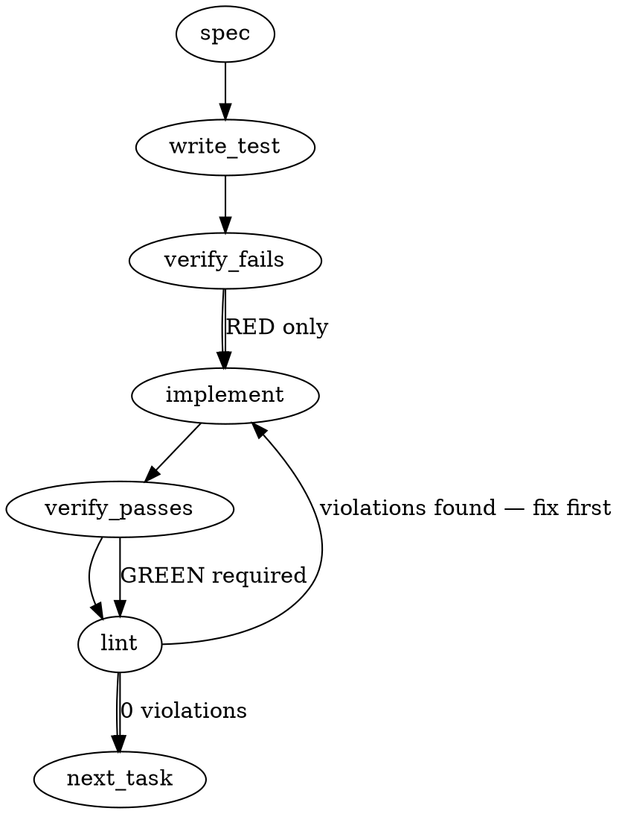

### Problem Statement

Contributors lack visibility into which automated review rules will fire on their PRs, leading to slow, multi-round bot reviews for predictable violations. The `totem review` command needs an `--estimate` pre-flight mode that deterministically cross-checks the local diff against the compiled rule corpus and outputs predicted findings without invoking the LLM verification layer.

### Architectural Context

- **Determinism Mandate (`feedback_axiom_mandate.md`):** Predicted findings must strictly rely on deterministic rule matches from `compiled-rules.json`, strictly avoiding LLM mediation.
- **Implicit Diff Source Contract (`upstream-feedback/029`):** When the diff source is implicit (e.g., no explicit files or PR provided), the tool must surface this fact to the user to prevent false-positive escalation.
- **Staged-vs-Working Drift (`upstream-feedback/025`):** The estimator must respect existing staging rules: it must evaluate staged changes if they exist, and only fall back to the working directory if the staging area is empty.
- **Verification Layer Context Caching (Proposal 217):** Reminds us that standard `totem review` operations load the entire `compiled-rules.json` payload; the estimator intercepts this before the verification layer payload is ever constructed or transmitted.

### Files to Examine

1. `packages/cli/src/commands/review.ts` — Primary command entry point; needs the new `--estimate` flag and early-exit logic to bypass LLM invocation.
2. `packages/cli/src/commands/run-compiled-rules.ts` — Prior art for how the CLI deterministically evaluates compiled rules.
3. `.totem/compiled-rules.json` (in any local project) — To understand the expected structural contract of the compiled rule corpus.

### Technical Approach & Contracts

**Approach:**
We will augment the `totem review` command with an `--estimate` flag. When present, the command resolves the diff source exactly as it currently does. If the diff source is implicit, it logs a prominent warning. It then fetches the diff using `getGitDiff`, extracts the changed files via the `extractChangedFiles` shared helper, and loads `.totem/compiled-rules.json` using `readJsonSafe`. By matching the changed files against the `appliesTo` paths/globs of the compiled rules, it predicts which rules the bot will evaluate. It prints these citations and exits cleanly (Code 0), entirely bypassing the LLM-based Verification Layer.

**Data Contracts:**
We will define Zod schemas to safely read the compiled rules payload:

```typescript
import { z } from 'zod';

export const EstimatorCompiledRuleSchema = z.object({
  id: z.string(),
  severity: z.enum(['error', 'warning', 'info', 'critical']).catch('warning'),
  description: z.string(),
  appliesTo: z.array(z.string()).optional(),
});

// Using a fallback to array to handle both wrapped and unwrapped JSON structures
export const CompiledRulesRegistrySchema = z.union([
  z.object({ rules: z.array(EstimatorCompiledRuleSchema) }),
  z.array(EstimatorCompiledRuleSchema),
]);
```

**Trade-offs:**

- _Full Regex Evaluation vs. Scope Matching:_ We could run the actual deterministic regexes embedded inside `compiled-rules.json` against the diff content, OR we can just match the file paths against the rule scopes (`appliesTo`).
  _Recommendation:_ **Scope Matching**. Predicting that a rule _will be evaluated_ because the file changed perfectly satisfies the "visibility into what bot findings will likely fire" requirement without duplicating the heavy `runCompiledRules` regex logic or risking false negatives.

### Edge Cases & Traps

- **Staged vs. Working Drift (Trap):** Using `getGitDiff('all', cwd)` incorrectly merges staged and unstaged changes. If the user has explicitly staged files for a PR but has unrelated unstaged files, evaluating both causes false positives. You MUST check `getGitDiff('staged', cwd)` first. If empty, fallback to `getGitDiff('all', cwd)` ONLY when the diff source is implicit.
- **LLM Trigger Regressions:** If the early return logic is placed too late, the CLI might accidentally initialize or call the Verification Layer API, violating the determinism mandate and wasting API credits.
- **Missing Compilation:** Running `--estimate` before `totem compile` has ever run means `compiled-rules.json` doesn't exist. This must be caught gracefully by `readJsonSafe` (which throws a `TotemParseError`), translating it into a friendly prompt to run `totem compile`.
- **Zero-Diff Execution:** If the extracted changed files array is empty, the estimator must exit 0 immediately with a "No changes detected" message rather than iterating over an empty list.

### Implementation Tasks

- [ ] **Task 1: Add `--estimate` flag to Review Command**
  - Modify `packages/cli/src/commands/review.ts` and its test file.
  - Add `estimate?: boolean` to the `ReviewOptions` interface.
  - Register the `--estimate` flag in the commander setup.
    > TEST DIRECTIVE: Before implementing, write a failing test named `parses estimate flag correctly and propagates to options`.
  - write test → verify fails → implement → verify passes → lint

- [ ] **Task 2: Resolve Diff and Detect Implicit Source**
  - Modify `packages/cli/src/commands/review.ts`.
  - Intercept command flow if `options.estimate` is true.
  - Resolve the diff using the shared helper `getGitDiff(mode, cwd)`. Fetch `'staged'` first; if empty, fetch `'all'`.
    > TOTEM INVARIANT (upstream-feedback/029): The estimator surfaces implicit diff sources rather than producing silent low-confidence findings.
  - If no explicit target (files/PR) was provided, emit a standard warning: `Implicit diff source detected: evaluating based on current local changes.`
  - Extract file paths using the shared helper `extractChangedFiles(diff)`. Handle empty returns by logging "No changes detected" and exiting cleanly.
    > TEST DIRECTIVE: Before implementing, write a failing test named `surfaces implicit diff source warning when no explicit target provided`.
  - write test → verify fails → implement → verify passes → lint

- [ ] **Task 3: Load Rules and Cross-Check Deterministically**
  - Modify `packages/cli/src/commands/review.ts`.
    > TOTEM INVARIANT (feedback_axiom_mandate.md): Predicted findings should be deterministic-substrate-grounded, not LLM-mediated.
  - Define `CompiledRulesRegistrySchema` and load rules using the shared helper `readJsonSafe('.totem/compiled-rules.json', CompiledRulesRegistrySchema)`.
  - Wrap in a `try/catch` to handle missing files, catching `TotemParseError` to output: `Error: No compiled rules found. Run 'totem compile' first.`
  - Filter the loaded rules to identify which apply to the paths in the `extractChangedFiles` list (e.g., checking if the file paths match the rule's `appliesTo` scopes).
    > TEST DIRECTIVE: Before implementing, write a failing test named `maps changed files to deterministic rule citations without invoking LLM`.
  - write test → verify fails → implement → verify passes → lint

- [ ] **Task 4: Format Estimator Output and Bypass LLM**
  - Modify `packages/cli/src/commands/review.ts`.
  - Iterate over the matched rules. Output the predicted findings to the console citing the Rule ID, Severity, Description, and the specific changed files it applies to.
  - Ensure the function explicitly `return`s immediately after printing, completely bypassing the downstream Verification Layer (LLM invocation).
    > TEST DIRECTIVE: Before implementing, write a failing test named `exits cleanly with code 0 after printing estimates and bypasses LLM verification`.
  - write test → verify fails → implement → verify passes → lint

### Execution Flow (structural constraint)



### Verification (MANDATORY — do not skip)

Every implementation MUST end with these steps:

1. `totem lint` — deterministic rule check (zero LLM, ~2s). Fixes any violations.
2. `totem review` — AI-powered architectural review (~18s). Addresses any critical findings.
3. If using MCP, call `verify_execution` to confirm compliance before declaring the task done.

### Test Plan

- **Staging precedence:** Create a staged change and an unstaged change. Run `totem review --estimate` implicitly. Assert that only the staged file is evaluated and logged.
- **Empty diff source:** Run estimator on a clean git tree. Assert it exits 0 with "No changes detected".
- **Implicit warning:** Run without explicit targets. Assert the console output contains the implicit diff source warning.
- **LLM bypass validation:** Mock the LLM client or Verification layer. Run `--estimate`. Assert the mock is never called.
- **Missing compiled-rules:** Delete `.totem/compiled-rules.json` in a test fixture. Run `--estimate`. Assert it fails gracefully with a message to run `totem compile`.

---

## Implementation Design

### Scope (2 sentences)

`totem review --estimate` runs the existing deterministic rule engine (`runCompiledRules`) against the diff resolved by `totem review`'s existing diff-source chain, prints `[Estimate]`-tagged predicted findings with file:line citations, and returns immediately without any LLM/orchestrator initialization. **Out of scope for this PR:** the optional pattern-history overlay (cross-checking `.totem/recurrence-stats.json` for clusters not yet covered by a compiled rule) per AC bullet 3 — file as a follow-up ticket.

### Data model deltas

| Addition                           | Holds               | Writes                    | Reads                             | Invariants                                                                                                                                                                                                                                                                                                          |
| ---------------------------------- | ------------------- | ------------------------- | --------------------------------- | ------------------------------------------------------------------------------------------------------------------------------------------------------------------------------------------------------------------------------------------------------------------------------------------------------------------- |
| `ShieldOptions.estimate?: boolean` | flag from commander | `index.ts` action handler | `shieldCommand` early-exit branch | Optional, undefined ≡ false. Mutually compatible with `--diff`, `--staged`, `--out`. Mutually **incompatible** with `--learn`, `--auto-capture`, `--mode`, `--override`, `--suppress`, `--fresh`, `--raw` — these only mean things in the LLM path. CLI surfaces a `TotemConfigError` on incompatible combinations. |

No new types in `@mmnto/totem`. No new fields on `CompiledRule`. No new module-level state. No new files in `core/`. New helper module `packages/cli/src/commands/shield-estimate.ts` (or inline branch in `shield.ts`, decision below) that wraps the diff-resolve → `runCompiledRules` → estimate-formatted output sequence.

### State lifecycle

No new state. The estimator is a pure pass-through: read `compiled-rules.json` (per-invocation, already cached behind `loadCompiledRules`), evaluate against in-memory diff additions, write stdout/file via existing `writeOutput`, return. Trap-ledger and rule-metrics writes from `runCompiledRules` (`appendLedgerEvent` on suppressions, `recordEvaluation` per rule) **continue to fire under `--estimate`** — this is desirable: the estimator dogfoods the same telemetry surface, so an estimator run looks identical to a real lint pass on the metrics side. Open question O2 below if Matt wants estimate runs excluded from metrics.

### Failure modes

| Failure                                                       | Category | Agent-facing surface                                                                            | Recovery                                             |
| ------------------------------------------------------------- | -------- | ----------------------------------------------------------------------------------------------- | ---------------------------------------------------- |
| `compiled-rules.json` missing                                 | init     | hard error (`TotemError` `NO_RULES`, identical to `totem lint`'s)                               | Run `totem compile` first.                           |
| `compiled-rules.json` corrupt JSON                            | init     | hard error via existing `loadCompiledRules` parse path (Zod failure → `TotemParseError`)        | Re-run `totem compile` or restore from git.          |
| Diff source empty (no changes anywhere in the fallback chain) | runtime  | `log.warn('No changes detected. Nothing to review.')` + return code 0                           | Make a change. Same surface as `totem review` today. |
| Explicit `--diff <range>` produces empty diff                 | runtime  | `log.warn` + return 0 (already handled by `getDiffForReview`)                                   | Pass a non-empty range.                              |
| Diff exceeds `REVIEW_DIFF_TRUNCATION_THRESHOLD` (50KB)        | runtime  | warning at resolution layer (already emitted by `getDiffForReview` since `mmnto-ai/totem#1717`) | Narrow `--diff <range>`.                             |
| Regex rule has invalid pattern                                | runtime  | hard error via existing `applyRulesToAdditionsBounded` `TotemParseError` branch                 | Re-run `totem lesson compile` or archive the rule.   |
| Regex timeout on a rule-file pair (strict mode)               | runtime  | warning + non-zero exit (existing `runCompiledRules` strict-mode contract)                      | Narrow scope or `--timeout-mode lenient`.            |
| One or more violations found                                  | runtime  | non-zero exit via existing `SHIELD_FAILED` `TotemError` path                                    | Fix or `// totem-context:` suppress.                 |
| Incompatible flags (`--estimate --learn`, etc.)               | init     | `TotemConfigError` `CONFIG_INVALID` at command entry                                            | Drop the incompatible flag.                          |

Every failure mode reuses an existing surface. No new error classes, no new exit codes.

### Invariants to lock in via tests

- `--estimate` never imports / never instantiates the orchestrator, the embedding client, or the LanceDB store. Test asserts none of `runOrchestrator`, `requireEmbedding`, `LanceStore` constructors are called on the estimate path (mock + assert-not-called).
- `--estimate` produces identical violation set as `totem lint` for the same diff input. Test fixtures: same diff, same `compiled-rules.json`; assert `violations` array shape-equals.
- `--estimate` honors `getDiffForReview`'s full resolution chain: explicit `--diff` wins, then `--staged`, then working-tree, then branch-vs-base. One test per branch.
- `--estimate` exit code matches `totem lint` semantics: 0 on PASS or warnings-only, non-zero on errors. The output verdict line is labeled `Estimate` (vs `Verdict`) so consumers don't conflate this with the LLM verdict.
- `--estimate` is incompatible with `--learn`, `--auto-capture`, `--override`, `--suppress`, `--fresh`, `--mode`, `--raw` — each combination throws `TotemConfigError` before any work runs. Table-driven test.
- Implicit-diff-source path emits a stderr `log.info` `Diff source: <chosen>` line (already done by `getDiffForReview`); `--estimate` doesn't suppress it. Existing `mmnto-ai/totem#1717` tests already cover this for `totem review`; we add coverage on the `--estimate` branch.

### Open questions

- **Q1: Inline branch in `shield.ts` vs new `shield-estimate.ts` module?**
  - Options: (a) add a `if (options.estimate) { ... return; }` block early in `shieldCommand` after `getDiffForReview` resolves the diff, (b) extract a `runEstimate(options, config, cwd)` helper into `shield-estimate.ts` that `shieldCommand` delegates to.
  - **Recommendation: (b).** `shield.ts` is already 1100+ lines; the estimate path is a self-contained branch with its own tests. New module keeps `shield.ts`'s LLM path uncluttered and parallels the `shield-classify`/`shield-hints`/`shield-templates` pattern.
- **Q2: Should `--estimate` writes to `rule-metrics.json` and the trap ledger?**
  - Options: (a) yes, transparent dogfood — estimator runs look identical to lint runs in metrics; (b) no, gate metric writes behind a `recordMetrics: boolean` option threaded into `runCompiledRules` and pass `false` for estimate.
  - **Recommendation: (a).** Estimator runs ARE deterministic-rule evaluations against real diffs; recording them is honest. If we later want to distinguish, add a metrics-source field rather than silencing the write.
- **Q3: Default output verdict label — `[Estimate] PASS` vs `[Review] PASS`?**
  - Options: (a) reuse `[Review]` DISPLAY_TAG so muscle memory carries; (b) distinct `[Estimate]` tag so log lines are unambiguously a forecast.
  - **Recommendation: (b).** The whole point is to make "this is a prediction, not a final verdict" unmistakable in stdout. Add `ESTIMATE_DISPLAY_TAG = 'Estimate'`.
- **Q4: Pattern-history overlay scope — file follow-up ticket now or wait until after merge?**
  - Options: (a) file follow-up `mmnto-ai/totem#NEXT` immediately so the AC bullet 3 has a tracking handle; (b) leave the AC bullet open, file later.
  - **Recommendation: (a).** Follow-up ticket gives the bot-tax cluster (#1713 retrospect, #1714 estimate, future #NEXT pattern overlay) a clean shape. File during this PR's commit chain.
