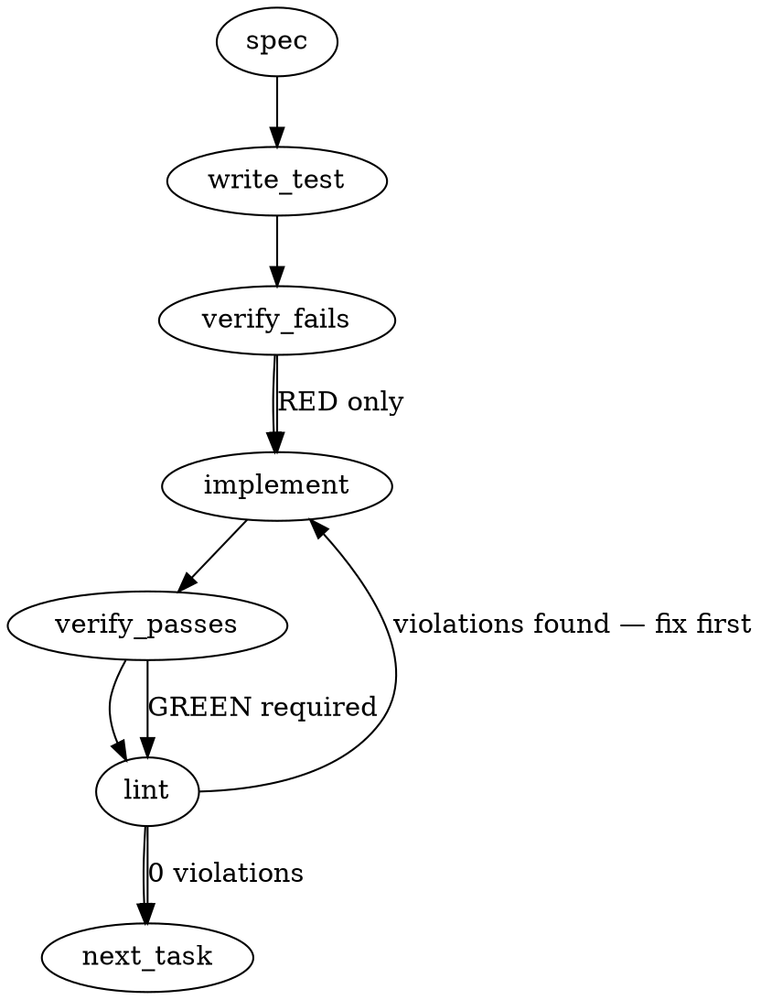

### Problem Statement

Extend the `totem review --estimate` command to optionally overlay historically recurring, un-ruled patterns against the current diff's additions. This requires reading `.totem/recurrence-stats.json`, tokenizing the diff against pattern samples to calculate Jaccard similarity (threshold 0.4), and emitting a visually distinct warning for matches, with an opt-out `--no-history` flag.

### Architectural Context

- **Gemini Styleguide for Totem — Declined Patterns (Zod):** The styleguide prohibits using Zod for small internal data structures, but explicitly mandates it at "system boundaries (config files, API contracts)." Since `.totem/recurrence-stats.json` is generated by a separate process (`totem stats`) and read from disk, it represents a system boundary. We will use Zod via the `readJsonSafe` shared helper, keeping the schema strictly limited to the required fields.
- **Feedback Axiom Mandate:** The overlay relies purely on aggregated historical data and deterministic tokenization (Jaccard similarity), avoiding LLM inference to comply with the mandate.

### Files to Examine

1. `packages/cli/src/commands/shield-estimate.ts` — Houses `runEstimate`, where the pattern-history layer must be injected after the compiled-rules pass.
2. `packages/cli/src/index.ts` — Where CLI commands and options are registered; needs the `--no-history` flag.
3. `docs/wiki/cli-reference.md` — Needs documentation updates for the new flag and behavior.

### Technical Approach & Contracts

**Data Contracts:**
Define the schema for the file read to enforce the system boundary constraint:

```typescript
import { z } from 'zod';

export const PatternRecurrenceSchema = z.object({
  patterns: z.array(
    z.object({
      signature: z.string(),
      occurrences: z.number(),
      prs: z.array(z.string()),
      coveredByRule: z.boolean().optional(),
      sampleBodies: z.array(z.string()),
    }),
  ),
});

export type PatternRecurrence = z.infer<typeof PatternRecurrenceSchema>;
```

**Execution Logic:**

1. Retrieve git root via `resolveGitRoot(cwd)`. If null, exit the history layer silently.
2. Attempt to read `${gitRoot}/.totem/recurrence-stats.json` using `readJsonSafe(path, PatternRecurrenceSchema)`. Wrap in a `try/catch` and use `log.dim` on failure/missing.
3. Extract strictly _added_ lines from the diff. **Regex**: `/^\+(?!\+\+)(.*)$/gm`.
4. Tokenize the diff additions into a `Set` of lowercase words.
5. Filter `patterns` to those where `!coveredByRule` and `sampleBodies.length > 0`.
6. For each pattern, tokenize `sampleBodies[0]` and calculate Jaccard Similarity against the diff addition tokens (`intersection.size / union.size`).
7. If the score is `>= 0.4`, push to a `matches` array.
8. Output matches under a bold `[Estimate] Pattern-history match` header to visually delineate them from deterministic rule results.

### Edge Cases & Traps

- **Division by Zero:** Jaccard calculation will divide by zero if both the diff additions and sample bodies yield zero tokens (e.g., they only contain punctuation). The calculation MUST guard against empty unions and return `0`.
- **Diff Header Collisions:** Simple `+` matching will capture diff headers like `+++ b/src/file.ts`. The extraction regex MUST use a negative lookahead `(?!\+\+)` to prevent file paths from poisoning the token pool.
- **Missing Substrate File:** The absence of `.totem/recurrence-stats.json` is normal for users who haven't opted into stats tracking. It must not crash the `--estimate` process. Catch `TotemParseError` or standard `ENOENT` errors from `readJsonSafe` and swallow them gracefully.
- **Coverage Regression:** A pattern that was recently converted to a rule will have `coveredByRule: true`. If this is ignored, the CLI will emit duplicate warnings (one deterministic, one historical).

### Implementation Tasks

- [ ] **Task 1: CLI Flags and Schema Definition**
  - Modify `packages/cli/src/index.ts` to register `--no-history` on the `review` command options.
  - Export `PatternRecurrenceSchema` from `packages/cli/src/commands/shield-estimate.ts` (or a colocated types file).
    > TEST DIRECTIVE: Before implementing, write a failing test named `parses --no-history flag correctly without breaking existing review options` in the CLI index tests.
  - write test → verify fails → implement → verify passes → lint

- [ ] **Task 2: Diff Extraction & Jaccard Utility**
  - Create a utility function to extract addition tokens: ignores `+++` headers, lowercases, and splits by `\w+`.
  - Create a utility `calculateJaccard(setA, setB)` that handles the empty-union division-by-zero trap.
    > TEST DIRECTIVE: Before implementing, write failing tests named `jaccard safely returns 0 when union is empty` and `diff tokenizer strictly ignores +++ file headers`.
  - write test → verify fails → implement → verify passes → lint

- [ ] **Task 3: Integration into `runEstimate`**
  - In `packages/cli/src/commands/shield-estimate.ts`, implement the pattern-history pass directly after the `runCompiledRules` pass.
  - Skip execution if `options.noHistory === true`.
  - Use shared helpers ONLY: `resolveGitRoot` to find the directory, and `readJsonSafe` to parse the file.
  - Implement the `try/catch` block that emits a `log.dim` and gracefully returns on missing files or validation failures.
    > TOTEM INVARIANT (Zod for small parsers): Zod is permitted here explicitly because reading from the filesystem is a system boundary.
    > TEST DIRECTIVE: Before implementing, write a failing test named `silently skips history layer when recurrence-stats.json is missing` in the shield-estimate tests.
  - write test → verify fails → implement → verify passes → lint

- [ ] **Task 4: Jaccard Matching & Visual Output**
  - Loop through parsed patterns, filter out `coveredByRule === true`, and match `sampleBodies[0]` tokens against diff tokens.
  - For scores `>= 0.4`, print the distinct stanza using the CLI's UI logger. Example format: `[Estimate] Pattern-history match: <signature> (<occurrences> occurrences in <prs.join>)`.
    > TEST DIRECTIVE: Before implementing, write a failing test named `filters out patterns where coveredByRule is true from jaccard matching`.
  - write test → verify fails → implement → verify passes → lint

### Execution Flow (structural constraint)



### Verification (MANDATORY — do not skip)

1. `totem lint` — deterministic rule check (zero LLM, ~2s). Fixes any violations.
2. `totem review` — AI-powered architectural review (~18s). Addresses any critical findings.
3. If using MCP, call `verify_execution` to confirm compliance before declaring the task done.

### Test Plan

- **Isolation:** Test Jaccard calculator against 100% match, 0% match, partial match, and div-by-zero scenarios.
- **Diff Parsing:** Provide a raw diff with removed lines (`-`), context lines, and file headers (`+++`); verify only added line tokens exist in the resultant Set.
- **End-to-End:** Run `runEstimate` in a mock directory _without_ `.totem/recurrence-stats.json` to verify silence.
- **End-to-End:** Run `runEstimate` in a mock directory _with_ the JSON file, ensuring the output distinctly prints the `[Estimate] Pattern-history match` stanza for uncovered patterns above the 0.4 threshold. Verify `--no-history` correctly suppresses it.

---

## Implementation Design

### Auto-spec deviations declared upfront

The Gemini auto-spec above has two load-bearing errors that this design supersedes:

1. **Schema reuse, not redefinition.** Auto-spec defines a local `PatternRecurrenceSchema` with a 5-field subset of the substrate. `RecurrenceStatsSchema` is already exported from `@mmnto/totem` (`packages/core/src/recurrence-stats.ts:122`) with the full version-stamped contract (`version`, `lastUpdated`, `thresholdApplied`, `historyDepth`, `prsScanned`, `patterns`, `coveredPatterns`). Reusing it is single-source-of-truth alignment with `mmnto-ai/totem#1715` substrate. The retrospect command (`mmnto-ai/totem#1713`) defines a local `RecurrenceStatsFileSchema` for the same purpose; we'll inline the same 4-field projection (`patterns[].signature`, `patterns[].sampleBodies`, `patterns[].occurrences`, `patterns[].prs`) keyed off the canonical type so any drift surfaces at compile time.

2. **Containment, not Jaccard, over whole-diff additions.** Whole-diff Jaccard `|A ∩ B| / |A ∪ B|` is mathematically broken here: a typical PR has 500-2000 added tokens; a `sampleBody` has 20-50; `|A ∪ B| ≈ |B|` so `Jaccard ≈ |A|/|B|` is always near zero. The 0.4 threshold would never fire. The right asymmetric metric is the **containment coefficient** `|pattern_tokens ∩ diff_tokens| / |pattern_tokens|` — "what fraction of the pattern's significant tokens appear somewhere in the diff additions." Bounded [0,1], intuitive, threshold-stable. Issue's 0.4 default maps to "40% of the pattern's vocabulary is in the diff."

### Scope (2 sentences)

`totem review --estimate` gains a second pass that runs after `runCompiledRules`: load `.totem/recurrence-stats.json`, tokenize diff additions, and emit a `[Estimate] Pattern-history match` stanza for any uncovered pattern whose tokens are present in the diff above a containment threshold. This explicitly will NOT modify the substrate, will NOT touch the LLM path, will NOT change `--estimate`'s exit code or trap-ledger semantics, and will NOT extend the substrate's schema.

### Data model deltas

**Module-level constant** in `packages/cli/src/commands/shield-estimate.ts`:

- `PATTERN_HISTORY_CONTAINMENT_THRESHOLD = 0.4` — bounded [0,1], required, cluster-tokens-in-diff coverage gate. Mirrors the existing `RULE_COVERAGE_JACCARD_THRESHOLD = 0.6` constant in `recurrence-stats.ts`. Looser than coverage by design — issue-driven.

**New field on `ShieldOptions`** (`packages/cli/src/commands/shield.ts`):

- `history?: boolean` — written by Commander on `review --no-history` (Commander auto-inverts negative flags to `false`); read by `runEstimate`; default `undefined` → enable. Semantically opt-out only when explicitly `false`.

**New local interface** in `shield-estimate.ts` (private, not exported from `@mmnto/totem`):

- `PatternHistoryMatch` — `{ signature: string; occurrences: number; prs: string[]; sampleBody: string; containment: number }`. Pure render-time projection, never persisted.

**Reused, NOT new:**

- `RecurrenceStatsFileSchema` projection (inline like `retrospect.ts:124` — 4-field sub-shape of `RecurrenceStatsSchema`).
- `tokenizeForJaccard` from `@mmnto/totem` — same stopwords + length filter so the overlay's vocabulary matches the substrate's coverage check.
- `jaccard` from `@mmnto/totem` — kept available even though we're using containment, because the auto-spec's intent of "is this pattern present in the diff" can also be validated against Jaccard for tests.

### State lifecycle

| State                                                         | Scope          | Lifetime                                                    | Owner                                                                    |
| ------------------------------------------------------------- | -------------- | ----------------------------------------------------------- | ------------------------------------------------------------------------ |
| Loaded `RecurrenceStats` substrate                            | per-invocation | parsed once after `runCompiledRules` returns; never mutated | `runPatternHistoryOverlay` (new pure helper inside `shield-estimate.ts`) |
| Pre-tokenized `patternTokenSets: Map<signature, Set<string>>` | per-invocation | computed once, read N times during diff matching            | `runPatternHistoryOverlay` local                                         |
| Tokenized diff additions                                      | per-invocation | computed once per `runEstimate` call                        | `runPatternHistoryOverlay` local                                         |

No state crosses lifecycle boundaries. No cache. No persistence.

### Failure modes

| Failure                                                            | Category                           | Agent-facing surface                                                                                            | Recovery                                                                                 |
| ------------------------------------------------------------------ | ---------------------------------- | --------------------------------------------------------------------------------------------------------------- | ---------------------------------------------------------------------------------------- |
| `recurrence-stats.json` missing                                    | runtime / opt-in substrate         | `log.dim` ("pattern-history layer skipped: run `totem stats --pattern-recurrence` to enable")                   | none — substrate is opt-in; deterministic pass already ran                               |
| `recurrence-stats.json` malformed (parse error)                    | permanent / data corruption        | `log.warn` ("pattern-history layer skipped: <message>")                                                         | user re-runs `totem stats --pattern-recurrence` to overwrite                             |
| `recurrence-stats.json` Zod-fails projection                       | permanent / schema drift           | `log.warn` ("pattern-history layer skipped: substrate schema mismatch")                                         | same — re-run to overwrite                                                               |
| Diff additions tokenize to empty set (e.g., punctuation-only diff) | runtime / degenerate input         | silent skip (no matches possible by definition)                                                                 | none — degenerate input is not an error                                                  |
| Pattern's `sampleBodies[0]` tokenizes to empty set                 | runtime / degenerate substrate row | skip that pattern (continue with rest)                                                                          | none — `tokenizeForJaccard` strips noise; empty token set means nothing to match against |
| `--no-history` set                                                 | user-elected                       | silent skip, no log line                                                                                        | n/a                                                                                      |
| `runCompiledRules` already errored (non-zero exit)                 | upstream / propagated              | overlay never reached — `runCompiledRules` exits the process via `SHIELD_FAILED` semantics inherited from #1714 | n/a                                                                                      |

Tenet 4 (Fail Loud) audit: every silent-degrade path surfaces a `log.dim`/`log.warn` with the remediation; degradation is observable, not silent. The `--no-history` user-elected silence is intentional and documented.

### Invariants to lock in via tests

- `--no-history` produces zero pattern-history log output regardless of substrate presence.
- Missing `recurrence-stats.json` on the estimate path emits exactly one `log.dim` and continues to a clean exit; the deterministic-pass output is byte-identical to a run without the substrate.
- Malformed `recurrence-stats.json` emits exactly one `log.warn` and continues to a clean exit.
- Containment coefficient is computed asymmetrically: a pattern with 5 tokens, all present in a 2000-token diff, scores 1.0 — NOT 5/2000.
- Patterns from `coveredPatterns[]` (already rule-covered) are NOT loaded into the matcher (pre-filter at substrate-read time, not per-pattern at match time).
- The `[Estimate] Pattern-history match` stanza renders below the deterministic-rule output with a clear separator line so users cannot conflate "rule X will fire at file:line" with "this PR's diff resembles a recurrent unrule'd pattern" (AC bullet 4).
- No-LLM defense-in-depth: static-source-grep on `shield-estimate.ts` blocks `from '@mmnto/totem-orchestrator'`, `getOrchestrator`, `Anthropic`, `OpenAI`, `gemini`. Runtime `vi.mock` of `../orchestrators/orchestrator.js` factories asserts `toHaveBeenCalledTimes(0)` across an end-to-end `runEstimate` invocation that exercises the new overlay path. Mirrors the `mmnto-ai/totem#1714`/`#1713` pattern.

### Open questions

- **Q1: Whole-diff containment vs. per-line Jaccard vs. per-hunk Jaccard?**
  - Whole-diff containment `|A ∩ B| / |A|` (the design above): cheap, threshold-stable, well-suited to "is this pattern's vocabulary present in the diff." Cannot cite a specific line.
  - Per-line Jaccard with max-over-lines: closer to how bots actually fire (per-line citations possible). Higher cost (N_patterns × N_added_lines tokenize/compare). Still has the asymmetry problem on long lines.
  - Per-hunk Jaccard: middle ground. Hunks are usually ~5-30 lines so the asymmetry is gone; can cite the hunk header. More implementation surface.
  - **Recommendation: whole-diff containment.** Cheapest, threshold-stable, matches the issue's "pattern-history clusters whose tokens overlap the diff" framing. Cannot cite a line, but the `[Estimate]` tag already telegraphs "forecast not verdict" so the user knows to investigate themselves. We can revisit if the per-line variant turns out to be load-bearing.

- **Q2: Use only `sampleBodies[0]`, or union all up-to-3 sample bodies for the matcher?**
  - `[0]` only: simpler, deterministic, matches the issue spec literally.
  - Union of all: better recall — three bodies of the same cluster will have overlapping vocabulary, union gives a more complete picture of the pattern's vocabulary.
  - **Recommendation: union of all `sampleBodies`.** Cluster signature is computed over normalized bodies, so the bodies are guaranteed to share the same gist. Union gives a better matcher with no real downside.

- **Q3: Skip `coveredPatterns[]` (already rule-covered) entirely, or include them with a different label?**
  - Skip entirely: cleanest. Covered patterns will already fire (or have already-explainable absence) in the deterministic pass.
  - Include as informational: shows "this pattern recurred but has a rule covering it" — but the deterministic pass already shows the rule firing if it matches.
  - **Recommendation: skip.** Issue says "headline clusters not yet covered by a compiled rule" — only `patterns[]`, not `coveredPatterns[]`.

- **Q4: Output stanza shape — what's the precise layout?**
  - **Recommendation:** Section header + per-match block:
    ```
    [Estimate] ─── Pattern-history layer ───
    [Estimate] 3 historical pattern(s) match this diff (uncovered by current rules):
    [Estimate]
    [Estimate]   <signature> — Nx in PRs #1, #2, #3 (containment: 0.62)
    [Estimate]     "<sampleBodies[0] truncated to 120 chars>"
    [Estimate]
    [Estimate]   <next pattern>
    ```
    A blank `[Estimate]` line above and below the section header creates the visual separator AC bullet 4 calls for. Truncation at 120 chars matches `runRecurrenceStats`'s 80-char log preview slightly extended (more room since this stanza is the headline, not a summary).

- **Q5: Default behavior when substrate is missing — `log.dim` (per retrospect.ts) or full silent (per issue's "Missing recurrence-stats.json is silent")?**
  - Issue's "silent" means "does not regress the deterministic pass" — i.e., does not crash, does not change exit code. It does not necessarily mean zero log output.
  - **Recommendation: `log.dim` ("pattern-history layer skipped: run `totem stats --pattern-recurrence` to enable").** Discoverable for users who don't yet know about the substrate, dimmer than a warning, doesn't pollute the verdict surface. Matches `retrospect.ts:305-308` precedent. AC bullet 3 is satisfied because the deterministic pass output is unchanged.

- **Q6: Is this a `--no-history` flag on `totem review` (so `totem review` without `--estimate` rejects it as incompatible) or on `--estimate` only?**
  - Per `mmnto-ai/totem#1714`'s incompatibility table at `shield.ts:38-58`: any flag that's `--estimate`-specific gets rejected when `--estimate` is not set, OR is silently ignored on the LLM path. `--no-history` is `--estimate`-only, but it's a Commander flag on `review` so combining it with non-`--estimate` review needs a decision.
  - **Recommendation: silently ignore on the non-estimate path.** Adding `--no-history` to the incompatibility table for non-`--estimate` runs would emit a confusing error ("--no-history is incompatible with non-estimate review") that creates more friction than it solves. The flag has no effect on the LLM path; the LLM path doesn't read the substrate. Document the no-op explicitly in the `--help` text: "Only effective with --estimate."

### Files touched (estimate)

1. `packages/cli/src/commands/shield-estimate.ts` — main runtime + helpers + threshold constant.
2. `packages/cli/src/commands/shield.ts` — `ShieldOptions.history?: boolean` field.
3. `packages/cli/src/index.ts` — Commander `.option('--no-history', '...')` wiring on the `review` command.
4. `packages/cli/src/commands/shield-estimate.test.ts` — unit tests (24 → ~38 tests; mirror the substrate-optional + no-LLM-import patterns from `mmnto-ai/totem#1714` + `mmnto-ai/totem#1713`).
5. `docs/wiki/cli-reference.md` — `--no-history` flag docs + the pattern-history layer description in the `--estimate` section.
6. `.changeset/1731-pattern-history-overlay.md` — patch-level changeset for `@mmnto/cli`.

### Test surface (concrete)

- `runs pattern-history overlay after deterministic rule pass` — fixture substrate with one matching pattern; expect both the rule output and the history stanza in order.
- `silently skips overlay when --no-history is set` — same fixture; assert zero pattern-history log lines.
- `gracefully handles missing recurrence-stats.json` — fixture with no substrate; assert `log.dim` mentions remediation; deterministic pass output unchanged.
- `gracefully handles malformed recurrence-stats.json` — fixture with truncated JSON; assert `log.warn`; clean exit.
- `gracefully handles Zod-failing recurrence-stats.json` — fixture with schema drift; assert `log.warn`; clean exit.
- `containment coefficient is asymmetric` — pattern `{a,b,c}` against diff `{a,b,c, ...500 unrelated tokens}` → containment 1.0 (NOT Jaccard 0.006).
- `skips coveredPatterns[]` — fixture with one match in `patterns[]` and one in `coveredPatterns[]`; assert only the former renders.
- `degrades silently on empty diff token set` — fixture with whitespace-only diff additions; assert no overlay output.
- `degrades silently on empty pattern token set` — fixture pattern with `sampleBodies` of pure stopwords; assert that pattern doesn't render but others still do.
- No-LLM defense-in-depth (static-source-grep + runtime mock with `toHaveBeenCalledTimes(0)`) — mirrors the `mmnto-ai/totem#1714` pattern.
