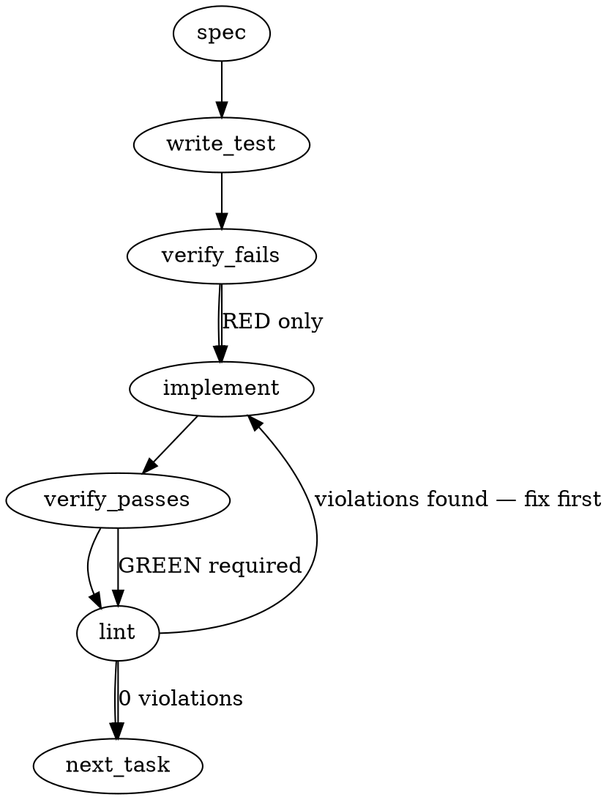

### Problem Statement

The `sanitizeForTerminal` helper is currently isolated in the CLI package but is required by the MCP package to sanitize `strategyStatus.reason`. This feature must be migrated into the `@mmnto/totem` core package, re-exported, and all 5 consumers across CLI and MCP updated to import from the centralized core location instead of duplicating regex logic.

### Architectural Context

The unidirectional package dependency structure requires that shared utilities exist in `@mmnto/totem` (core). `@mmnto/mcp` and `@mmnto/cli` may depend on core, but never on each other. Moving this utility to core enforces this boundary and aligns with the established pattern of consolidating system-wide formatting helpers in the core package.

### Files to Examine

1. `packages/cli/src/terminal-sanitize.ts` — The original utility file to be relocated.
2. `packages/cli/src/terminal-sanitize.test.ts` — The unit tests that must migrate with the source.
3. `packages/core/src/index.ts` — Core package entrypoint where the helper will be exported.
4. `packages/cli/src/commands/doctor.ts` — CLI consumer using dynamic imports that need consolidation.
5. `packages/mcp/src/context.ts` — MCP file (specifically lines 283-290) where the regex is currently dangerously inlined.
6. `packages/cli/src/commands/retrospect.ts`, `packages/cli/src/commands/shield-estimate.ts`, `packages/cli/src/utils/governance.ts` — CLI consumers requiring static import updates.

### Technical Approach & Contracts

1. **Migration**: Move `terminal-sanitize.ts` and `terminal-sanitize.test.ts` from `packages/cli/src/` to `packages/core/src/`.
2. **Contract Update**: Export the function in `packages/core/src/index.ts` using the signature: `export function sanitizeForTerminal(value: string): string;`
3. **Consumer Refactor**: Replace all relative imports in the `@mmnto/cli` package with `@mmnto/totem`.
4. **Regex Replacement**: Rip out the inline regex in `packages/mcp/src/context.ts` and replace it with a direct call to the core-provided `sanitizeForTerminal` method.

### Edge Cases & Traps

- **Overlapping Dynamic Imports:** In `packages/cli/src/commands/doctor.ts`, `checkStrategyRoot` currently awaits `import('@mmnto/totem')` and `import('../terminal-sanitize.js')` on separate lines. These MUST be destructured into a single `import('@mmnto/totem')` await call to avoid redundant asynchronous module resolution.
- **Node ESM Resolution:** When adding the export statement to `packages/core/src/index.ts`, you MUST use the `.js` extension (i.e., `export * from './terminal-sanitize.js';`). Using `.ts` or omitting the extension will break the build.
- **Phantom Test Dropping:** Ensure `terminal-sanitize.test.ts` is physically moved and executes successfully within the `packages/core` test suite. Do not accidentally delete it during the migration.

### Implementation Tasks

- [ ] **Task 1: Migrate Helper and Tests to Core**
  - Move `packages/cli/src/terminal-sanitize.ts` to `packages/core/src/terminal-sanitize.ts`.
  - Move `packages/cli/src/terminal-sanitize.test.ts` to `packages/core/src/terminal-sanitize.test.ts`.
  - Add `export { sanitizeForTerminal } from './terminal-sanitize.js';` to `packages/core/src/index.ts`.
  - write test (or update existing) → verify fails → implement → verify passes → lint

- [ ] **Task 2: Refactor Static CLI Consumers**
  - Update `packages/cli/src/commands/retrospect.ts`, changing the relative import to `import { sanitizeForTerminal } from '@mmnto/totem';`.
  - Update `packages/cli/src/commands/shield-estimate.ts` in the same way.
  - Update `packages/cli/src/utils/governance.ts` in the same way.
  - write test (or update existing) → verify fails → implement → verify passes → lint

- [ ] **Task 3: Consolidate Dynamic CLI Consumers**
  - Open `packages/cli/src/commands/doctor.ts`.
  - Locate `checkStrategyRoot` and find the overlapping dynamic imports.
  - Merge the destructured variables into: `const { resolveStrategyRoot, sanitizeForTerminal } = await import('@mmnto/totem');`.
  - write test (or update existing) → verify fails → implement → verify passes → lint

- [ ] **Task 4: Refactor MCP Context Inline Logic**
  > TEST DIRECTIVE: Before implementing, write a failing test named `context strips ANSI escape codes from strategyStatus.reason` in `packages/mcp/src/context.test.ts` that proves the regression is caught if the inline regex is removed without successfully calling the helper.
  - Update `packages/mcp/src/context.ts` to import `sanitizeForTerminal` from `@mmnto/totem`.
  - Find the inlined regex block (around lines 283-290) responsible for cleaning `strategyStatus.reason` before pushing to `linkedStoreInitErrors`.
  - Replace the inline regex `.replace(...)` invocation with `sanitizeForTerminal(...)`.
  - write test (or update existing) → verify fails → implement → verify passes → lint

### Execution Flow (structural constraint)

### Verification (MANDATORY — do not skip)

Every implementation MUST end with these steps:

1. `totem lint` — deterministic rule check (zero LLM, ~2s). Fixes any violations.
2. `totem review` — AI-powered architectural review (~18s). Addresses any critical findings.
3. If using MCP, call `verify_execution` to confirm compliance before declaring the task done.

### Test Plan

- **Core Tests:** Run `terminal-sanitize.test.ts` directly from `packages/core` to guarantee behavioral stability.
- **CLI Resolution:** Run the CLI test suite (`npm run test --workspace=@mmnto/cli`) to verify all `ERR_MODULE_NOT_FOUND` errors are cleared and module paths resolve to the new core export correctly.
- **MCP Context Coverage:** Run the MCP test suite (`npm run test --workspace=@mmnto/mcp`) specifically asserting that mocked strategy responses with aggressive ANSI color codes are cleanly formatted when processed by `context.ts`.

## Implementation Design

### Scope (2 sentences)

Move `terminal-sanitize.ts` + its test from `packages/cli/src/` to `packages/core/src/`, add a named export to `packages/core/src/index.ts`, and update all five consumers (4 cli + 1 mcp) to import the helper from `@mmnto/totem`. Will NOT consolidate the inline `flatten/collapse/trim` post-processing that `doctor.ts` and `mcp/src/context.ts` apply on top of `sanitizeForTerminal` — that's a separate hygiene ticket if desired, since it changes the helper's public-surface contract and the issue scope is the CSI/control-byte strip only.

### Data model deltas

None. No new types, no new fields, no new state containers. Pure file-relocation + import-path updates.

### State lifecycle

N/A — pure function, no state.

### Failure modes

| Failure                                                                                                                                                         | Category            | Agent-facing surface                                                                  | Recovery                                                                                                                                                                              |
| --------------------------------------------------------------------------------------------------------------------------------------------------------------- | ------------------- | ------------------------------------------------------------------------------------- | ------------------------------------------------------------------------------------------------------------------------------------------------------------------------------------- |
| `packages/cli/src/utils.ts` re-export removed; downstream test mocks that `vi.importActual('../utils.js')` lose `sanitizeForTerminal` from the spread           | init                | TypeScript build error or test failure on next run                                    | Either keep the re-export pointing at `@mmnto/totem`, OR accept that the test's `...actual` spread no longer includes the symbol (downstream tests must import it directly if needed) |
| `shield-estimate.test.ts` orchestrator-graph guard test fires after import-path swap                                                                            | runtime (test-only) | Test failure                                                                          | Update the `allowedDynamicImports` allowlist: remove `'../terminal-sanitize.js'` (file deleted), keep `'@mmnto/totem'` (already allowed)                                              |
| MCP `packages/mcp/src/context.ts` inline regex replaced with `sanitizeForTerminal()` call but the post-processing flatten/collapse/trim is dropped accidentally | runtime             | Multi-line newlines surface in agent-rendered text instead of single-line diagnostics | Preserve the existing `.replace(/[\t\n]+/g, ' ').replace(/ {2,}/g, ' ').trim()` chain after the helper call; explicit test for the flatten survives                                   |

### Invariants to lock in via tests

1. `sanitizeForTerminal` exported from `@mmnto/totem` returns the same output as the deleted cli copy on the existing test corpus (the test file moves with the source, so this is automatic — no behavior change).
2. `shield-estimate.ts` does not statically or dynamically import any orchestrator-loading module path. The existing `does not statically or dynamically import any orchestrator-loading module path` test must continue to PASS after the import-path swap.
3. MCP `context.ts` `strategyStatus.reason` rendering still strips ANSI/control bytes AND flattens `\n`/`\t` to single spaces (the second step is preserved inline at the call site).

### Open questions

- **Q1: Keep or drop the `cli/src/utils.ts` re-export of `sanitizeForTerminal`?**
  - **Options:**
    - (a) Drop the re-export; update `retrospect.ts` to destructure `sanitizeForTerminal` from its existing `@mmnto/totem` dynamic import. Cleaner — no transitive forwarder.
    - (b) Keep the re-export but switch its source to `@mmnto/totem`. Backward-compatible with test mocks that spread utils.
  - **Recommendation:** (a). Issue's Definition of Done says "the four cli consumers updated to import from `@mmnto/totem`" — the re-export becomes vestigial. Test mock works either way (the spread doesn't NEED sanitizeForTerminal in it; consumers just import directly).

- **Q2: Should `shield-estimate.ts` / `doctor.ts` / `retrospect.ts` switch from dynamic to static imports of `sanitizeForTerminal` now that it's in core?**
  - **Options:**
    - (a) Keep dynamic — preserves the lazy-load pattern; no functional change.
    - (b) Switch to static — `@mmnto/totem` is already imported statically elsewhere in cli; one less dynamic import.
  - **Recommendation:** (a) for shield-estimate (the lazy-load is part of the no-orchestrator-on-estimate-path invariant — keeping symmetry with the other dynamic imports inside `runPatternHistoryOverlay`); (a) for doctor and retrospect (both already use dynamic imports for their @mmnto/totem destructures, so adding `sanitizeForTerminal` to that existing destructure is the minimal change). No new static imports introduced.

- **Q3: The `flatten + collapse + trim` post-processing duplicated between `doctor.ts` and `mcp/src/context.ts` — consolidate as a second helper now or defer?**
  - **Options:**
    - (a) Defer to a follow-up ticket. Keep this PR scoped to what `mmnto-ai/totem#1744` actually says.
    - (b) Add a `flattenForTerminal` helper to core in this PR.
  - **Recommendation:** (a). The issue is scoped to the CSI/control-byte strip helper; the post-processing has different semantics per call site (mcp wants single-line agent-text; doctor wants single-line CLI output). File a tier-3 follow-up ticket if the duplication starts to matter.
