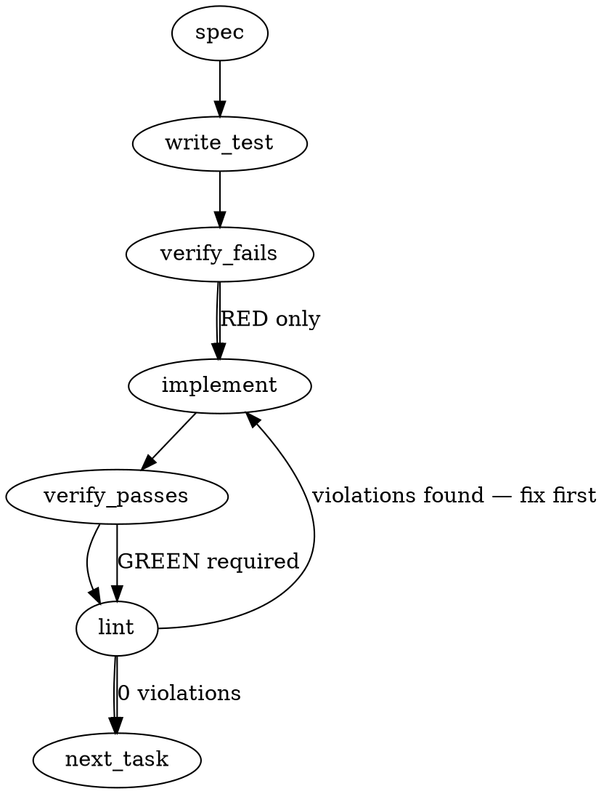

### Problem Statement

Implement a fail-closed Bash interlock (A-slice) and a `totem pr merge` CLI wrapper (B-slice) that together prevent merging unsafe pull requests by consuming the shared autoclose receipt evaluator (`reconcile` in core).

### Architectural Context

- **E-lever addendum (issue #1762)**: Under blank squash postures, the remote server might compose an empty PR body, bypassing remote checks. Therefore, local/client-side validation using the shared receipt evaluator in `packages/core/src/autoclose/receipt.ts` is required before committing the merge.
- **Sensors, Not Actuators**: Totem provides the evaluation framework, but we wire the hard blocks. The interlock must be deterministic and fail-closed to stop execution if verification fails or errors out.
- **Shared Helpers**: The CLI wrapper and interlock runner must use the `safeExec` wrapper for calling `gh` and `git` binaries, and `resolveGitRoot` to find the context.

### Files to Examine

- `packages/core/src/autoclose/receipt.ts` — Contains the `reconcile` evaluator logic for checking if autoclose rules are met.
- `packages/cli/src/commands/pr.ts` — The command file where `totem pr merge` CLI options, arguments, and execution flow will be integrated.
- `bin/totem-interlock.sh` — The target destination for the fail-closed Bash interlock hook/wrapper.

### Technical Approach & Contracts

To achieve a completely fail-closed mechanism, we will split the implementation into two slices:

1. **A-Slice: The Bash Interlock (`bin/totem-interlock.sh`)**
   - The script must use `set -euo pipefail` to ensure any error immediately halts execution.
   - It will detect if a Totem configuration exists (using `resolveGitRoot` logic). If so, it invokes the local CLI wrapper with a `--check-only` flag. If verification fails or exit code is non-zero, it blocks the git merge/commit action.

2. **B-Slice: The CLI Wrapper `totem pr merge` (`packages/cli/src/commands/pr.ts`)**
   - Implements a wrapper around the GitHub CLI `gh pr merge` command.
   - It retrieves the current PR information using `gh pr view --json body,comments,reviews,state`.
   - It runs the shared `reconcile` evaluator on the body and metadata.
   - If validation passes, it proceeds to invoke `gh pr merge` using `safeExec`.
   - If `--check-only` is passed, it only performs the validation and exits with `0` (success) or `1` (failure).

#### Data Contracts

```typescript
import { z } from 'zod';

export const GhPrViewSchema = z.object({
  body: z.string().default(''),
  comments: z
    .array(
      z.object({
        body: z.string(),
      }),
    )
    .default([]),
  state: z.enum(['OPEN', 'CLOSED', 'MERGED']),
  number: z.number(),
});

export type GhPrView = z.infer<typeof GhPrViewSchema>;

export interface InterlockResult {
  allowed: boolean;
  reason?: string;
}
```

---

### Edge Cases & Traps

1. **Empty / Blank Squash Message Posture**: GitHub CLI/API may return an empty PR body for squash merges depending on repository settings. The validator must check the actual PR body retrieved via `gh pr view` prior to the merge execution, rather than relying on git's post-merge commit message.
2. **Missing `gh` CLI or Credentials**: If the user does not have `gh` installed or authenticated, `safeExec` will throw. The CLI wrapper must handle this gracefully but _fail-closed_ (exit code 1) to prevent accidental unverified merges.
3. **Detached HEAD or Non-PR Branch**: If run outside a PR branch, `gh pr view` will fail. The wrapper must identify if there is no open PR for the current branch using `getGitBranch` and fail closed unless a `--force` or `--local-only` bypass is specified.

---

### Implementation Tasks

- [ ] **Task 1: Define Validation Schemas & Types**
      Define the data contract for parsing `gh pr view` outputs using Zod.
  - Modify: `packages/core/src/autoclose/types.ts` (or create if missing, or use `packages/core/src/autoclose/receipt.ts`)
  - Test file: `packages/core/test/autoclose-schema.test.ts`
    > TEST DIRECTIVE: Before implementing, write a failing test named `rejectsMalformedGhCliOutput` to verify that invalid JSON or missing fields from the CLI command trigger a validation error.
  - Implement Zod schema `GhPrViewSchema`.
  - Export types.
  - Run tests -> verify fails -> implement -> verify passes -> lint.

- [ ] **Task 2: Build the CLI Evaluator Core Hook**
      Create a shared evaluation wrapper function that takes the current branch, queries git and `gh`, and runs `reconcile`.
  - Modify: `packages/core/src/autoclose/receipt.ts`
  - Test file: `packages/core/test/receipt.test.ts`
    > TOTEM INVARIANT (Sensors, Not Actuators): Ensure the core receipt validation function only returns evaluation state and does not execute system-altering commands directly.
  - Import `safeExec`, `getGitBranch`, and `resolveGitRoot` from the shared helpers.
  - Implement `evaluateCurrentBranchPr(cwd: string): Promise<ReconcileResult>` which executes `gh pr view` using `safeExec`, parses with `readJsonSafe` or Zod parsing, and reconciles the body.
  - Run tests -> verify fails -> implement -> verify passes -> lint.

- [ ] **Task 3: Implement the `totem pr merge` CLI Command**
      Expose the `pr merge` command in the Totem CLI.
  - Modify: `packages/cli/src/commands/pr.ts` (or equivalent CLI command registration file)
  - Test file: `packages/cli/test/commands-pr.test.ts`
    > TEST DIRECTIVE: Before implementing, write a failing test named `abortsMergeOnFailedAutocloseEvaluation` that mocks a failed receipt check and ensures `gh pr merge` is never executed.
  - Add `merge` subcommand to `totem pr`.
  - Accept option `--check-only` (boolean).
  - Use the core evaluation hook from Task 2. If validation fails, exit with status `1`.
  - If validation passes and not in `--check-only` mode, invoke `gh pr merge` via `safeExec`.
  - Run tests -> verify fails -> implement -> verify passes -> lint.

- [ ] **Task 4: Implement Fail-Closed Bash Interlock**
      Create the shell interlock wrapper script.
  - Modify: `bin/totem-interlock.sh`
  - Test file: `packages/cli/test/interlock.test.ts`
  - Write a robust Bash script with `set -euo pipefail`.
  - Have it locate the repository root. If `totem` CLI is installed, execute `totem pr merge --check-only`.
  - Ensure any execution failure in the node command bubbles up and exits the script with status `1`.
  - Run tests -> verify fails -> implement -> verify passes -> lint.

---

### Execution Flow



---

### Verification

Every implementation MUST end with these steps:

1. `totem lint` — deterministic rule check (zero LLM, ~2s). Fixes any violations.
2. `totem review` — AI-powered architectural review (~18s). Addresses any critical findings.

---

### Test Plan

- **Unit Tests (`packages/core/test/receipt.test.ts`)**:
  - Test `evaluateCurrentBranchPr` with mocked `safeExec` responses for standard PRs, squashed PRs, and blank PR bodies.
  - Verify `reconcile` behavior on empty PR bodies under squash configuration options.
- **Integration CLI Tests (`packages/cli/test/commands-pr.test.ts`)**:
  - Run CLI command with `--check-only` mock environment and assert proper exit codes (0 for valid, 1 for invalid receipt/autoclose state).
  - Verify command execution is blocked when no PR is found or when `gh` CLI errors out.
- **Bash Interlock Tests (`packages/cli/test/interlock.test.ts`)**:
  - Execute `bin/totem-interlock.sh` under simulated failure environments (e.g. invalid config, failed check) and assert exit code is strictly non-zero.

---

## Implementation Design

**Contract corrections to the generated briefing above** (binding sources:
ADR-082 Amendment 1 @ strategy `82d6228`, merged spec `.totem/specs/1762.md`,
seam note in `packages/core/src/autoclose/matcher.ts`): the A-slice is a
**harness-boundary PreToolUse interlock** (agent-only by construction), NOT a
`bin/*.sh` git wrapper; comment bodies are NEVER scanned (the briefing's
`comments` field is dropped); there is NO `--force`/`--local-only` bypass (a
free suppression boolean violates license condition 3 — the structured escape
is the `totem-close` marker).

### Scope

A: a rendered PreToolUse hook (Claude `Bash` matcher + Gemini
`run_shell_command` parity) that DENIES raw `gh pr merge` / raw merge-API
invocations at the harness boundary, routing to `totem pr merge`. B: the
`totem pr merge` command — the sanctioned actuator that asserts posture,
validates title+body via the shared evaluator against `totem-close` markers,
and merges squash-only with NO body flags. NOT in scope: D2 arming, reopen
logic, human-terminal enforcement (humans never transit PreToolUse), and
alias/injected-spawn seams (mmnto-ai/totem#2460 class — bounded-surface claim
recorded in the hook header), compiled-rule mirror of C (frozen).

RECORDED MATCHER GAPS (bounded-surface honesty, condition 2 — also in the core
matcher header): (1) a VISIBLE-TOKEN splice a shell concatenates back into the
keyword (`gh pr me''rge`, a `bash -c` re-quoting layer); (2) a command SUBSTITUTION
replacing the SUBCOMMAND word (`gh $(echo pr) merge`, `gh "$SUB" merge`) — the
`pr`/`api` token is produced by expansion the matcher cannot see. The boundary is the
SUBCOMMAND, not the binary: `$GH pr merge` DOES block (lookbehind admits it) and
`gh pr $(…)` is denied-on-undecidable. D1/D2 are the loud backstop for both classes.
(The round-3 NOSEP-cap padding gap is GONE — the bounded `{0,2000}?` span was replaced
by the linear single-pass scanner, which has no length-based allow; a padded
`gh api …/pulls/{n}/merge` now BLOCKS like the bare form. codex delta-4, operator-ruled.)

RECORDED FRICTION (round-2 re-review, kimi NB-2 — a defensible false-DENY, not a
gap): a `merge`-valued flag placed BEFORE the subcommand (`gh pr --label merge
list`) BLOCKS, because deny-on-undecidable answers "deny" on the ambiguous
`merge`-token binding; the natural `gh pr list --label merge` order stays clean.

ROUND-2 COVERAGE (re-review — the matcher now recognizes these previously-bypassing
forms, matching the header + changeset claims): quoted `=value` flags
(`--repo='o/r'`, `--repo="$REPO"`), glued short-flag values (`-Rowner/name`, the
pflag tokenization), cmd.exe `%PR%` / `!PR!` variable merge-API paths, a wholly
variable `gh api` endpoint, and `\`+LF / `^`+LF continuations spliced anywhere in a
merge-API / GraphQL path. A flag value never crosses a `;`/`|`/`&` separator, and
the detector is provably LINEAR: disjoint-class FLAGRUN for the regex arms + a
single-pass scanner (`findApiMergePaths`) for the merge-API paths (de-fold → per-
segment anchor → one bounded in-segment scan) with NO length-based allow. Adversarial
perf fixtures assert <50 ms — the earlier nested-quantifier shape backtracked
multi-second at ~26 repeated flag groups, and the bounded `{0,2000}?` span it was
replaced with became a padding ALLOW past ~2 KB (codex delta-3 #3, now closed).

### Data model deltas

- `packages/core/src/autoclose/command-matcher.ts` (NEW, sibling of
  `matcher.ts`): `MERGE_COMMAND_REGEX_SOURCE` (string, canonical) +
  `findMergeInvocations(command: string): MergeInvocation[]` where
  `MergeInvocation = { form: 'gh-pr-merge' | 'gh-api-merge' | 'gh-pr-undecidable'
| 'gh-api-undecidable'; index: number }` (the two `*-undecidable` forms are the
  deny-on-undecidable arms — a `$`/backtick/variable continuation after `gh pr` or
  `gh api`).
  Written by core, read by B's tests, D-glue if ever needed, and the rendered
  A templates. The regex arms + `API_ANCHOR_SOURCE` are inlined via `JSON.stringify`
  and the `findApiMergePaths` single-pass scanner verbatim (the drift-locked local-
  mirror shape licensed for C); `init.test.ts` + the artifact-parity test assert both
  rendered templates AND both committed hosts inline them. The scanner (not a regex
  span) detects the raw merge-API paths so the padding bypass has no length cap to
  clear (codex delta-4).
- `packages/cli/src/commands/pr.ts` (NEW): `PrMergeOptions { checkOnly:
boolean; closeDeclared: boolean }`; `PrViewSchema` (zod: `title`, `body`,
  `state`, `number`, `headRefOid` — NO comments field). Pure
  `evaluatePrMerge({title, body}): { ok, findings, declaredByMarker,
undeclared }` reusing `findAutoCloseRefs` + `parseDeclaredCloseIntent` from
  core — no new pattern copies (license condition 1).
- `init-templates.ts`: `CLAUDE_MERGE_INTERLOCK` + a Gemini BeforeTool
  extension (shell-command arm), plus a new committed `.claude/settings.json`
  PreToolUse entry (matcher `Bash` → `node .totem/hooks/merge-interlock.cjs`)
  — team-level like PreWriteShield (mmnto-ai/totem#1846 OQ2 asymmetry), NOT
  `settings.local.json`.

No new persisted state anywhere: no flag files, no cache, no network in A
(ADR-082 Decisions 1–4 untouched).

### State lifecycle

A is stateless per-invocation (reads stdin JSON, regex match, exit). B is
per-invocation: fetch → evaluate → act; the only durable mutation is the
merge (and opt-in declared closes) performed via `gh` itself. Nothing crosses
lifecycle boundaries.

### Failure modes

| Failure                                                         | Category  | Agent-facing surface                                                            | Recovery                                                                                                                                              |
| --------------------------------------------------------------- | --------- | ------------------------------------------------------------------------------- | ----------------------------------------------------------------------------------------------------------------------------------------------------- |
| A: stdin unparseable / not a shell tool call                    | runtime   | allow (exit 0), stderr note                                                     | fail-soft is licensed here: A guards ONE invocation shape; unrecognizable payloads are out of its bounded claim; B + D1 + D2 remain the layered gates |
| A: command contains `gh pr merge` (any flags, incl. bodyless)   | —         | BLOCK exit 2, message names `totem pr merge` as the sanctioned path             | agent re-runs via wrapper                                                                                                                             |
| A: command contains raw merge API (`gh api … /pulls/{n}/merge`) | —         | BLOCK exit 2                                                                    | same                                                                                                                                                  |
| A: `gh pr` + command-substitution/undecidable continuation      | —         | BLOCK exit 2 (deny-on-undecidable, condition 2)                                 | agent rewrites the command plainly                                                                                                                    |
| B: `gh` absent / unauthenticated / PR lookup fails              | init      | hard error exit 1, NO merge attempted                                           | fix env; fail-closed is trivial — merge is the action                                                                                                 |
| B: posture drift (not PR_TITLE+BLANK+squash-only)               | runtime   | hard error exit 1 naming the drifted field (`evaluateMergeConfigPosture` reuse) | operator fixes repo settings                                                                                                                          |
| B: undeclared close-keyword ref in title/body                   | runtime   | hard error exit 1 listing refs + marker recovery instruction                    | author adds `totem-close` marker or rewords                                                                                                           |
| B: `gh pr merge --squash` itself fails                          | transient | exit 1, gh stderr passed through                                                | rerun                                                                                                                                                 |
| B `--check-only`                                                | —         | exit 0/1, no mutation                                                           | n/a                                                                                                                                                   |

The single silent-degradation row (A stdin fail-soft) is justified against
Tenet 4 by the bounded-surface honesty requirement of condition 2: A claims
exactly "block recognizable raw-merge invocations at this harness", and the
layered D1/D2 sensors keep the loud path. Recorded in the hook header.

### Invariants to lock in via tests

- Any command string containing a recognizable `gh pr merge` invocation exits
  2 — bodyless, `--body`, `--body-file`, `-F`, here-string, and
  PowerShell-quoted variants alike (fixture list from the ruled carryforward:
  negation/emphasis/quotation/qualified/multiple/PowerShell-quoting/
  hidden-body).
- `gh pr view`, `gh pr merge`-as-substring-of-a-word, and unrelated commands
  never block (no over-fire).
- B never constructs a `gh pr merge` argv containing `-b/--body/-F/-t` under
  ANY input (asserted structurally on the spawned argv, not on behavior). The
  argv DOES carry `--repo <owner/repo>` (same identity as the `gh pr view`
  lookup — no cross-repo confused deputy) and `--match-head-commit <headRefOid>`
  (snapshot binding).
- CLAIM BOUNDARY (condition 2 — claim no larger than the mechanism): B's safety
  assertion is EVALUATION-TIME. The evaluator runs on the title/body read ONCE by
  `gh pr view`. HEAD drift between evaluation and merge is closed by
  `--match-head-commit <headRefOid>` (the merge refuses if HEAD moved → exit 1 with
  a re-evaluate instruction). BODY-TEXT drift (a body edited after the read) is NOT
  proven by B — D1 (PR-time required check) + D2 (post-merge reconciliation) are the
  loud backstop. B never claims a merge-TIME text guarantee.
- B treats a merge-queue landing as UNSETTLED: after `gh pr merge` returns 0 it
  re-reads `state` and only a `MERGED` PR proceeds to the declared-close phase; a
  queued/auto-merge-armed PR DEFERS closes and exits 0.
- A `--close-declared` run that fails any requested close continues through all
  targets (the merge is irreversible) but exits 1 with a summary naming the
  failed target(s) — no false all-actions-success signal.
- B's evaluation reuses core's `AUTO_CLOSE_REGEX_SOURCE` path — asserted by
  importing the same symbols, plus the rendered-template parity test.
- Both rendered hosts (Claude + Gemini) carry `MERGE_COMMAND_REGEX_SOURCE`
  verbatim (≥1 non-Claude host fixture).
- A title-only keyword (`PR_TITLE` squash subject) is still caught by B.
- Tenet 9: A+B ship UNARMED as advisory? NO — A blocks at the harness, but the
  ARMING SURFACE differs by host and the claim is scoped to match the mechanism
  (condition 2 honesty; codex round-2 4c):
  - **Claude = armed-at-merge, team-level.** The `Bash` MergeInterlock entry lands
    in committed `.claude/settings.json`, so every Claude seat is armed the moment
    this PR merges — no per-developer step.
  - **Gemini = armed at init/upgrade.** `.gemini/settings.json` is gitignored, so
    the BeforeTool registration is NOT team-level yet. It arms on `totem init` AND
    on the ordinary consumer upgrade (`prepare` → `totem hook install`, mechanized
    by 4b — the shared `registerGeminiBeforeTool` migration + registration), so no
    developer has to rerun interactive init. Per the strategy-claude ruling on
    `mmnto-ai/totem-strategy#619` (2026-07-22: a minimal team-level
    `.gemini/settings.json` is APPROVED, but its un-ignore + seat migration is a
    SEPARATE follow-up slice), Gemini becomes armed-at-trust (team-level, like
    Claude) once that slice lands; until then it is armed-at-init/upgrade.
    A only ever reroutes (deny + name the wrapper; nothing is lost), and B refuses
    only on evaluator findings. The legitimacy-gate evidence (provenance = 5
    incidents + round; positive/negative controls = this test suite + matcher
    fixtures) is recorded in the PR body per condition 4.

### Open questions

- **Question:** should `totem pr merge` execute the declared `gh issue close`
  actions after a successful merge?
- **Options:** (a) never — print the exact commands (status quo of the ruled
  workflow, operator executes); (b) opt-in `--close-declared` flag executing
  closes for marker-declared targets only; (c) always.
- **Recommendation:** (b) — reference-bound (marker names the exact set),
  explicit at invocation, and keeps (a)'s behavior as the default.
- **RULED (operator, 2026-07-21):** (b) — `--close-declared` stays opt-in,
  default off (prints the exact commands). Question closed; not a panel fork.

### OPTION 1 ruling — A stripped, B ships alone (operator, 2026-07-22)

After five review/fix rounds on the A-slice command-interception — each round's
fix spawning a same-class sibling on the hand-rolled shell parser (the
wrong-altitude signal) — the operator ruled OPTION 1: **ship B, arm D2 later,
drop A's command-interception.** The A code (core `command-matcher`, the
rendered `.totem/hooks/merge-interlock.cjs` PreToolUse host, the Gemini
BeforeTool `.cjs` interlock rewrite, and the init/hook-install adoption
machinery) is stripped from this branch; its history remains in the PR's
pre-strip commits (through `913ad2af`).

Grounding (derived live 2026-07-22) — every keyword vector is covered by a
simpler, mostly server-side layer:

1. **PR-body wording** → C write-time guard (shipped 1.103.0) + D1, verified
   ENROLLED as a required check in the active `main-required-checks` ruleset.
2. **Merge-time body** → repo config verified flipped: squash-only
   (`allow_merge_commit=false`, `allow_rebase_merge=false`) with
   `squash_merge_commit_message=BLANK` — the default merge path physically
   carries no body text. The residue is a DELIBERATE `--body`/UI override
   (outside the accidental threat model), reversible, and caught by D2.
3. **Direct push to main** → branch protection (PR reviews required,
   enforce-admins on, no force pushes).

A's interception defended only vector 2's deliberate-override case — behind
four simpler layers, on an undecidable parsing surface.

Follow-ups routed OUT of this PR:

- **Posture-drift sensor** (strategy#482 parity row, unfiled): assert the
  config invariant (squash-only + BLANK + D1 enrolled) — config drift is the
  only way vector 2 returns. One API read replaces the parser.
- **Gemini `BeforeTool.js` ESM defect** (real, A-independent): the shipped
  C-layer hook crashes (`require is not defined`) in a consumer repo whose
  `package.json` is `"type": "module"`; Gemini treats the crash as a warning
  and proceeds. Fix = `.js`→`.cjs` rename + registration migration in its own
  small slice — the round-2/3 adoption machinery stripped here is why it must
  not ride another PR.
- **D2 arming** per the four falsifiable criteria in `.totem/specs/1762.md`
  §Arming gate (unchanged by this ruling).
