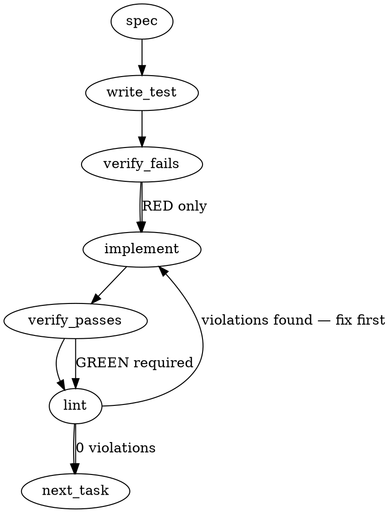

### Problem Statement

The Totem CLI fails to invoke `loadInstalledPacks()` across all command surfaces that consume AST rules and chunk strategies. As a result, pack registration callbacks never run, language extensions (like `.rs`) are not mapped to the registry, and end-to-end pack consumption is entirely broken despite successful installation.

### Architectural Context

- **ADR-097 Q5 / §10 (Pack Discovery Phase):** Establishes the contract that `loadInstalledPacks()` is the canonical boot entry and MUST fail-loud synchronously on callback errors.
- **Idempotency Requirement:** Test harnesses run multiple CLI commands inside the same Node process. Because `loadInstalledPacks()` intentionally throws if called after the engine is sealed, we must guarantee idempotency at the CLI wiring layer via an `isEngineSealed()` check.

### Files to Examine

1. `packages/core/src/pack-discovery.ts` — Contains `loadInstalledPacks` and the `engineSealed` state. You will need to expose a getter for the sealed state.
2. `packages/cli/src/commands/lint.ts` — The primary CLI consumer; demonstrates where config is loaded and where bootstrapping must occur.
3. `packages/cli/src/utils/bootstrap-engine.ts` — New file to be created.
4. `packages/cli/src/commands/shield.ts`, `shield-estimate.ts`, `compile.ts`, `lint-lessons.ts` — Other CLI command surfaces requiring the same boot logic.
5. `packages/cli/src/ingest/pipeline.ts` — Chunking entry point requiring the boot logic before `createChunker` is called.

### Technical Approach & Contracts

**Recommended Approach: Option B (Shared Helper)**
Instead of duplicating the boot logic across seven different surfaces, implement a centralized `bootstrapEngine(config, projectRoot)` helper in the CLI layer. This guarantees uniform boot sequence constraints and handles process-level idempotency to support testing environments.

**Data Contracts:**

```typescript
// packages/cli/src/utils/bootstrap-engine.ts
import { loadInstalledPacks, isEngineSealed } from '@mmnto/totem';
import type { TotemConfig } from '@mmnto/totem';

export function bootstrapEngine(config: TotemConfig, projectRoot: string): void {
  if (isEngineSealed()) return;

  loadInstalledPacks({
    projectRoot,
    totemDir: config.totemDir,
  });
}
```

**Sequence Logic:**

1. A CLI command is invoked.
2. Command parses CLI arguments and locates the configuration file.
3. Command invokes `await loadConfig(configPath)`.
4. **IMMEDIATELY AFTER**, command invokes `bootstrapEngine(config, projectRoot)`.
5. `bootstrapEngine` checks `isEngineSealed()`. If true (test re-entry), it safely returns.
6. If false, it invokes `loadInstalledPacks`, which executes all pack `register()` callbacks and populates the `LANG_REGISTRY`.
7. The command continues executing engine surface operations (e.g., `runCompiledRules`, `createChunker`).

### Edge Cases & Traps

- **Trap — Test Harness Re-entry Throws:** `loadInstalledPacks()` throws if called after the engine has started serving requests. Without the `isEngineSealed()` guard, running two E2E CLI tests in the same Node process will crash the test suite on the second invocation.
- **Trap — Incorrect Configuration Root:** When calling `bootstrapEngine`, ensure the `projectRoot` passed exactly matches the root directory resolved during `loadConfig()`. Passing `process.cwd()` universally will break monorepo setups where the command is invoked from a sub-directory but targeting a parent config.
- **Trap — Missing Exports:** `isEngineSealed` is likely a local variable (`engineSealed`) inside `pack-discovery.ts`. It must be explicitly exported as a getter function and surfaced in the `@mmnto/totem` (`packages/core/src/index.ts`) barrel export.

### Implementation Tasks

- [ ] **Task 1: Expose `isEngineSealed` from the Core Engine**
  - Modify `packages/core/src/pack-discovery.ts` to export `function isEngineSealed(): boolean { return engineSealed; }`.
  - Export `isEngineSealed` from `packages/core/src/index.ts`.
  - Update `packages/core/test/pack-discovery.test.ts` to verify the getter accurately reflects the seal state.
  - write test → verify fails → implement → verify passes → lint

- [ ] **Task 2: Implement `bootstrapEngine` Utility**
  - Create `packages/cli/src/utils/bootstrap-engine.ts`.
  - Implement the `bootstrapEngine(config, projectRoot)` helper logic.
    > TEST DIRECTIVE: Before implementing, write a failing test named `skips loadInstalledPacks when engine is already sealed` in `packages/cli/test/bootstrap-engine.test.ts` that proves the idempotency guard prevents double-invocation exceptions.
  - write test → verify fails → implement → verify passes → lint

- [ ] **Task 3: Wire Bootstrapper into Primary Commands (`lint`, `compile`)**
  - Modify `packages/cli/src/commands/lint.ts` and `packages/cli/src/commands/compile.ts`.
  - Inject `bootstrapEngine(config, configRoot)` immediately following `loadConfig(...)`.
    > TEST DIRECTIVE: Before implementing, write a failing test named `lint command invokes bootstrapEngine immediately after config load` that proves pack registration is triggered during command execution.
  - write test → verify fails → implement → verify passes → lint

- [ ] **Task 4: Wire Bootstrapper into Shield Commands (`shield`, `shield-estimate`)**
  - Modify `packages/cli/src/commands/shield.ts` and `packages/cli/src/commands/shield-estimate.ts`.
  - Inject `bootstrapEngine` invocation following config load.
  - write test (or update existing) → verify fails → implement → verify passes → lint

- [ ] **Task 5: Wire Bootstrapper into remaining AST & Ingest paths**
  - Modify `packages/cli/src/commands/lint-lessons.ts` and `packages/cli/src/ingest/pipeline.ts`.
  - Inspect `packages/cli/src/runners/first-lint-promote-runner.ts`. If it acts as an independent entry point bypassing CLI commands, wire it there as well.
  - Inject `bootstrapEngine` in these files before any AST rules or `createChunker` paths execute.
  - write test (or update existing) → verify fails → implement → verify passes → lint

### Execution Flow (structural constraint)



### Verification (MANDATORY — do not skip)

Every implementation MUST end with these steps:

1. `totem lint` — deterministic rule check (zero LLM, ~2s). Fixes any violations.
2. `totem review` — AI-powered architectural review (~18s). Addresses any critical findings.
3. If using MCP, call `verify_execution` to confirm compliance before declaring the task done.

### Test Plan

- **Idempotency E2E:** A test running `totem lint` programmatically twice in the same process to ensure `bootstrapEngine` correctly skips the second registration and prevents the "engine sealed" exception.
- **Boot Sequence Validation:** Unit tests mocking `loadInstalledPacks` that assert it is called precisely after `loadConfig` but before `applyAstRulesToAdditions` or `createChunker` in the CLI commands.
- **Integration Test:** With an `inMemoryPacks` mock containing a `.rs` registry callback, running `totem lint` over a `.rs` file successfully parses the AST rather than throwing `ASTGREP_RUST_LANGUAGE_MISSING`.

---

## Implementation Design (Phase 3 — totem-Claude addendum)

### Corrections to auto-spec

- `isEngineSealed` is **already** exported from `packages/core/src/index.ts:103` (and from `pack-discovery.ts:292`). Auto-spec Task 1 ("Expose `isEngineSealed` from the Core Engine") is unnecessary — drop it.
- `lint-lessons.ts` validates lesson frontmatter only (`validateLessons`); no AST rule execution. Drop from the wiring set.
- `packages/cli/src/ingest/pipeline.ts` does not exist — the chunker pipeline lives in `packages/core/src/ingest/pipeline.ts`. CLI never calls `createChunker` directly; chunker dispatch is core-internal under `runRetrieval` paths invoked via search/index commands. Out of scope for this PR (those run as subprocess from `add-lesson`).
- `first-lint-promote-runner.ts` is invoked from inside `lint.ts`, not as a standalone entry. Wiring `lint.ts` covers it.

### Scope

**WILL:** Add `bootstrapEngine(config, projectRoot)` helper in `packages/cli/src/utils/bootstrap-engine.ts`. Wire it after `loadConfig` and before any rule-execution surface in 5 CLI commands: `lint`, `shield`, `shield-estimate`, `compile`, `test-rules`. Add a unit test for the helper plus one integration test per wired command verifying the boot sequence. Add a changeset (minor — surfaces a previously-unfulfilled API promise).

**WILL NOT:** Modify `pack-discovery.ts` or any core surface (no API changes needed). Wire into manifest-read-only commands (`doctor`, `rule`, `explain`, `retrospect`, `stats`, `recurrence-stats`, `lesson`, `import`). Touch core's `ingest/pipeline.ts` chunker dispatch (no consumer in PR-A's CLI execution surfaces). Reify `extends` traversal into `loadConfig` (Option C, rejected per separation of concerns).

### Data model deltas

None. No new types, no new fields, no new state containers in core. The only addition is a single CLI-side function:

```ts
export function bootstrapEngine(config: TotemConfig, projectRoot: string): void;
```

All persistent state (`PACK_REGISTRY`, `engineSealed`) already exists in `pack-discovery.ts` with documented invariants. The CLI helper is a pure caller.

### State lifecycle

Existing module-level state in `pack-discovery.ts` (already documented there):

| State           | Scope           | Lifetime                                                          | Ownership           |
| --------------- | --------------- | ----------------------------------------------------------------- | ------------------- |
| `PACK_REGISTRY` | engine-lifetime | populated by `loadInstalledPacks()` → sealed                      | `pack-discovery.ts` |
| `engineSealed`  | engine-lifetime | starts `false` → flips to `true` at end of `loadInstalledPacks()` | `pack-discovery.ts` |

**Behavior change:** today `engineSealed` never flips to `true` from CLI invocations (only from tests that call `loadInstalledPacks` directly). After this PR, it flips exactly once per CLI invocation immediately after `loadConfig`, before any rule execution. **Cross-boundary consideration**: production CLI invocations are fresh Node processes, so single-shot seal is correct. In-process re-entry under test harnesses (Vitest running multiple commands sequentially in one process) is handled by the `isEngineSealed()` short-circuit — bootstrapEngine returns silently rather than throwing.

### Failure modes

All failure modes already exist in `loadInstalledPacks`. The change is that they now surface at the CLI boundary (right after `loadConfig`) instead of at first AST dispatch deep inside a rule run. This is the desired behavior: fail loud at boot.

| Failure                                              | Category | Agent-facing surface                              | Recovery                   |
| ---------------------------------------------------- | -------- | ------------------------------------------------- | -------------------------- |
| `installed-packs.json` missing                       | init     | silent (treat as no packs); `totem sync` reminder | run `totem sync`           |
| `installed-packs.json` malformed JSON                | init     | hard error with file path + parse failure point   | fix manifest or sync       |
| Manifest fails Zod (unknown key, wrong shape)        | init     | hard error naming the field                       | fix manifest or sync       |
| Pack file at `resolvedPath` missing                  | init     | hard error naming pack + path                     | reinstall pack             |
| Pack `require()` throws                              | init     | hard error naming pack + cause                    | pack-side bug              |
| Pack `peerDependencies` engine range mismatch        | init     | structured error per ADR-097 § 5 Q6               | upgrade pack or pin engine |
| Pack `register()` callback throws                    | init     | hard error naming pack + cause                    | pack-side bug              |
| Pack `register()` callback returns Promise           | init     | hard error per ADR-097 § 5 Q5                     | pack-side bug              |
| Two packs collide on chunker name                    | init     | hard error naming both packs                      | one pack must rename       |
| Two packs collide on extension                       | init     | hard error naming both packs + lang values        | one pack must drop         |
| Pack registers a built-in extension                  | init     | hard error (built-ins immutable)                  | pack-side bug              |
| `bootstrapEngine` re-entry after seal (test harness) | init     | silent short-circuit (return early)               | by design                  |

Tenet 4 audit: every row except "manifest missing" (intentional silent for pre-sync repos) and "re-entry after seal" (intentional silent for test ergonomics) is fail-loud.

### Invariants to lock in via tests

1. `bootstrapEngine` calls `loadInstalledPacks` exactly once when `isEngineSealed()` is false at entry.
2. `bootstrapEngine` returns silently without calling `loadInstalledPacks` when `isEngineSealed()` is true at entry.
3. `bootstrapEngine` propagates pack-callback errors verbatim — does not catch, swallow, or rewrap them.
4. `bootstrapEngine` passes `config.totemDir` and `projectRoot` through to `loadInstalledPacks` correctly (configRoot in monorepo subpackages must match the directory containing `.totem/installed-packs.json`).
5. `lint`, `shield`, `shield-estimate`, `compile`, `test-rules` each invoke `bootstrapEngine` after `loadConfig` and before the first rule-execution surface (`runCompiledRules` / `runRuleTests` / smoke-gate AST dispatch).
6. End-to-end: with an `inMemoryPacks` mock pre-seeding a `.rs` language registration, `lint` over a `.rs` file successfully dispatches the registered language rather than throwing `ASTGREP_RUST_LANGUAGE_MISSING`.
7. Idempotency: invoking `lintCommand` twice in the same Node process does not throw "engine sealed" on the second call.

### Open questions

1. **Test override path for `inMemoryPacks`.**
   - **Question:** `loadInstalledPacks` accepts an `inMemoryPacks` test escape hatch. How should tests for the wired CLI commands inject pack registration without writing fixture packages to disk?
   - **Options:** (a) accept an optional `bootstrapOpts` argument on `bootstrapEngine` that forwards `inMemoryPacks`; (b) tests call `loadInstalledPacks({ inMemoryPacks })` directly before invoking the command, relying on the `isEngineSealed()` short-circuit inside `bootstrapEngine` to skip the second call.
   - **Recommendation: (b).** Keeps the production helper API minimal. Aligns with the existing `pack-discovery.test.ts` pattern. No production code carries test-only optionality.

2. **Wiring placement in `compile.ts`.**
   - **Question:** Compile fans out to a worker pool with concurrency. Wire `bootstrapEngine` once at the top of `compileCommand` after `loadConfig`, or inside each worker?
   - **Options:** (a) once at top — workers inherit sealed engine state via module-level singletons; (b) inside each worker — workers run in same process via `Promise.all` so module state is shared anyway.
   - **Recommendation: (a).** Same process, same module instance, single seal. Identical to lint's single-shot pattern. Worker fan-out doesn't fork processes.

3. **Should `lesson compile --upgrade <hash>` and other compile sub-commands inherit the wiring?**
   - **Question:** `compileCommand` is invoked by `runSelfHealing` (doctor's PR auto-fix path). Does that subprocess path also need wiring, or does it fork as a separate process?
   - **Options:** (a) wire only `compileCommand` itself, trust subprocess invocations to bootstrap independently when they re-enter `compileCommand`; (b) wire at every `runSelfHealing` call site explicitly.
   - **Recommendation: (a).** The wiring lives at the entry point `compileCommand`. Any path that calls `compileCommand` (subprocess or in-process) inherits it automatically. No call-site duplication.

4. **Behavior under `TOTEM_LITE=1` standalone binary.**
   - **Question:** The lite binary degrades AST gracefully when WASM is unavailable. Does pack discovery surface new failures in that mode?
   - **Options:** (a) bootstrap unconditionally — pack manifest read is unaffected by WASM availability; (b) skip bootstrap under `TOTEM_LITE=1`.
   - **Recommendation: (a).** Manifest read and `register()` invocation are pre-WASM. The graceful degradation in `runCompiledRules` (lines 343-348) already handles WASM unavailability when AST rules execute. Pack registration that lazy-loads grammar via `wasmLoader` thunks won't fire until ast-grep dispatch — so the lite binary's WASM-unavailable path simply skips dispatch as today. No new degradation.

### Implementation plan (sequencing)

1. Write failing test for `bootstrapEngine` helper (idempotency + invocation propagation).
2. Implement `bootstrapEngine` in `packages/cli/src/utils/bootstrap-engine.ts` (~15 lines).
3. Wire into `lint.ts` after `loadConfig`. Run lint integration tests; LC's failing case (`.rs` over `inMemoryPacks` mock) should pass.
4. Wire into `shield.ts`, `shield-estimate.ts`, `compile.ts`, `test-rules.ts` in turn. Each wiring is a 2-line edit (import + call).
5. Add changeset (minor: "Wire pack registration into CLI command boot sequence per ADR-097 § 10").
6. `pnpm run format` → `totem lint` → `totem review` → push.

---

## Phase 4 Approval Gate

Design doc drafted at `.totem/specs/1794.md`. Open questions: 4. All have recommendations with rationale; no question is a binary user-judgment fork.

Awaiting user approval before writing implementation code.
