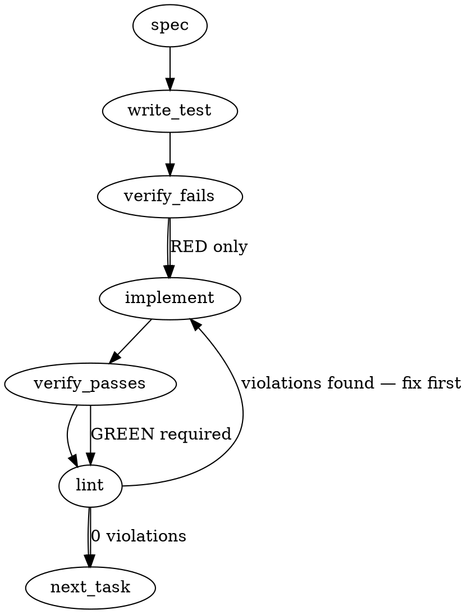

### Problem Statement

The `totem sync` command currently couples deterministic pack-resolution with LLM-dependent vector-store embedding, causing CI environments without API keys to fail when trying to update their pack manifest (`installed-packs.json`) after a cohort version bump. This operational impossibility prevents `totem lint` from recognizing newly registered Tree-sitter languages, requiring an architectural separation of the two sync phases so pack-resolution can be run independently.

### Architectural Context

- **Architecture > Configuration Tiers**: Totem auto-detects capability tiers from the environment. Bundling embedding (Tier 2/3) with pack resolution (Tier 1) violates tier boundaries because baseline environments (like CI) are blocked from performing deterministic manifest updates.
- **1.26.0 — Pack Ecosystem Graduation**: This fix is critical for "deterministic-substrate hardening", ensuring rule classes encoded via packs are independently verifiable without LLM access.

### Files to Examine

1. `packages/core/src/sync.ts` (or `packages/core/src/sync/index.ts`) — Contains the `runSync` orchestrator where the two concerns are currently coupled.
2. `packages/cli/src/commands/sync.ts` — CLI entry point where flags need to be added.
3. `packages/core/src/pack-discovery.ts` — Defines the manifest schema and loads the packs; requires a new schema field to track the cohort version.
4. `packages/core/src/pack-manifest-writer.ts` — Writes the manifest; must be updated to stamp the current running cohort version.
5. `packages/core/src/rule-engine.ts` (or equivalent parser error handler) — Where the `TotemParseError` originates and needs to be intercepted for the UX nudge.

### Technical Approach & Contracts

We will decouple the sync concerns via **Option 5 (Shape A)**, introducing mutually exclusive `--packs-only` and `--index-only` flags, layered with **Option 1 (CLI Nudge)** to catch the stale-manifest error.

**Trade-offs (Shape A vs Shape B):**

- _Shape A (`totem sync --packs-only`)_: Minimizes CLI router changes, extends an existing command cleanly, and maps 1:1 with `runSync` options. Keeps the CLI surface area small.
- _Shape B (`totem packs sync`)_: True noun-verb CLI architecture, segregating concerns at the router level, but requires scaffolding a new top-level `packs` command root and deprecating parts of `sync`.
- **Recommendation:** Proceed with **Shape A**. It solves the CI operational impossibility immediately with minimal regression risk while maintaining composite behavior by default.

**Data Contracts:**
The `installed-packs.json` schema must be updated to track the Totem version that generated it.

```typescript
// packages/core/src/pack-discovery.ts
export const InstalledPacksSchema = z.object({
  cohort: z.string().optional(), // NEW: Tracks the @mmnto/totem version used during generation
  packs: z.array(PackSchema),
});
```

**Sequence Logic:**

1. `pack-manifest-writer.ts` stamps the executing Totem version into the manifest's `cohort` field.
2. `runSync` intercepts `packsOnly` to completely bypass embedding client initialization.
3. If `totem lint` encounters `TotemParseError: no Tree-sitter language is registered`, it uses `readJsonSafe` to check `.totem/installed-packs.json`. If the `cohort` is missing or mismatched against the running version, it throws a structured diagnostic suggesting `totem sync --packs-only`.

### Edge Cases & Traps

- **Eager Embedding Client Initialization:** If `runSync` or its dependencies initialize the embedding client or validate API keys at module-load or at the very top of the function, the `--packs-only` flag will still fail in CI. The embedding instantiation _must_ be strictly deferred inside an `if (!options.packsOnly)` block.
- **Missing vs Stale Manifest:** In a fresh CI clone that restored `node_modules` but not `.totem/installed-packs.json`, the manifest won't just be stale—it won't exist. The error handler must gracefully catch the `ENOENT` from `readJsonSafe` and emit the same CLI nudge rather than crashing with a raw filesystem error.
- **Mutually Exclusive Flags:** Passing both `--packs-only` and `--index-only` is nonsensical and must hard-fail early in the CLI layer.

### Implementation Tasks

- [ ] **Task 1: Update Manifest Schema and Writer**
  - Modify `packages/core/src/pack-discovery.ts` to add `cohort: z.string().optional()` to the manifest schema.
  - Modify `packages/core/src/pack-manifest-writer.ts` to inject the current `@mmnto/totem` package version into the `cohort` field when saving `installed-packs.json`.
    > TEST DIRECTIVE: Before implementing, write a failing test named `writes cohort version to installed-packs.json` that proves the cohort field is saved.
  - write test → verify fails → implement → verify passes → lint

- [ ] **Task 2: Decouple Core Sync Logic (`runSync`)**
  - Modify `packages/core/src/sync.ts` (or the equivalent orchestrator).
  - Add `packsOnly?: boolean` and `indexOnly?: boolean` to the `runSync` options interface. Throw an error if both are true.
  - Wrap the pack manifest resolution step in `if (!options.indexOnly)`.
    > TOTEM INVARIANT (Architecture > Configuration Tiers): Commands must respect capability tiers auto-detected from the environment. `totem sync --packs-only` must function in the baseline tier without requiring LLM/embedding API keys.
  - Wrap the vector-store embedding logic—**including the client initialization**—in `if (!options.packsOnly)`.
    > TEST DIRECTIVE: Before implementing, write a failing test named `runSync bypasses embedding client initialization when packsOnly is true` that proves no API key or LLM capability is evaluated.
  - write test → verify fails → implement → verify passes → lint

- [ ] **Task 3: Wire CLI Flags**
  - Modify `packages/cli/src/commands/sync.ts`.
  - Add `--packs-only` and `--index-only` boolean flags to the Commander definition.
  - Pass the mapped flags into the `runSync` call.
    > TEST DIRECTIVE: Before implementing, write a failing test named `syncCommand routes packs-only and index-only flags to runSync` that proves the CLI boundary maps the options correctly.
  - write test → verify fails → implement → verify passes → lint

- [ ] **Task 4: Implement the UX Nudge Diagnostic**
  - Modify `packages/core/src/rule-engine.ts` (or the parser module throwing the error).
  - Catch `TotemParseError` instances where the message includes `"no Tree-sitter language is registered"`.
  - Use `readJsonSafe` from `@mmnto/totem` shared helpers to read `.totem/installed-packs.json`. Catch missing file errors.
  - If the manifest is missing, or if `manifest.cohort !== currentTotemVersion`, throw a new structured error: `[Totem Error] No language registered for '[ext]' but installed-packs.json is stale... Fix: run \`pnpm exec totem sync --packs-only\` to re-resolve the manifest, then retry.`
  - If the cohort matches perfectly, rethrow the original error (the user simply lacks the pack).
    > TEST DIRECTIVE: Before implementing, write a failing test named `emits structured stale manifest diagnostic when Tree-sitter registration fails and cohort mismatches` that proves the raw error is intercepted and transformed correctly.
  - write test → verify fails → implement → verify passes → lint

### Execution Flow (structural constraint)



### Verification (MANDATORY — do not skip)

Every implementation MUST end with these steps:

1. `totem lint` — deterministic rule check (zero LLM, ~2s). Fixes any violations.
2. `totem review` — AI-powered architectural review (~18s). Addresses any critical findings.
3. If using MCP, call `verify_execution` to confirm compliance before declaring the task done.

### Test Plan

- **Primary CLI Independence Test:** Execute `totem sync --packs-only` in a test shell with `ANTHROPIC_API_KEY` and all other embedding keys explicitly unset. Assert exit code `0` and verify `installed-packs.json` is updated with the `cohort` field.
- **Mutex Test:** Execute `totem sync --packs-only --index-only`. Assert exit code `1` and validation error.
- **Diagnostic Nudge Test:** Scaffold a mock project with a `package.json` specifying an old `@mmnto/totem` version, but execute the current version's `totem lint` against a `.rs` file. Assert the error thrown is the structured UX nudge advising `--packs-only`, not the raw Tree-sitter error.
- **Genuine Missing Pack Test:** Run `totem lint` on an `.unknown` extension with an up-to-date manifest cohort. Assert the raw Tree-sitter error is thrown, proving the diagnostic doesn't mask legitimate missing-pack errors.

---

## Implementation Design

> Drafted 2026-05-04 (claude-0022) from `mmnto-ai/totem#1811` per `mmnto-ai/totem-strategy:.handoff/totem-claude/inbox/2026-05-03T2200Z`. Substrate for `mmnto-ai/totem-strategy:adr/adr-101-totem-sync-architectural-separation.md` (slot **101** — ADR-100 is now `adr-100-substrate-repo-extraction.md` per strategy-Claude relay 2026-05-04).

### Scope (2 sentences)

Split `totem sync` into two independently-runnable phases — **Phase A** (pack-resolution + manifest write, deterministic, no API keys) and **Phase B** (vector-store embedding sync, requires API keys) — exposed via mutually-exclusive `--packs-only` / `--index-only` flags on the existing `totem sync` command (Shape A, not Shape B). Will **NOT** rename or split into a new `totem packs sync` top-level command, will **NOT** change `runSync`'s purely Phase B responsibilities, will **NOT** reuse the cohort field for pack ABI compatibility (that's already covered by ADR-097 § Q6 `engines['@mmnto/totem']` per-pack range).

### Architectural insight (corrects spec framing)

The spec describes wrapping `runSync`'s "pack manifest resolution step" in `if (!options.indexOnly)`. **Empirically, pack-resolution is NOT inside `runSync`** — it's already at the CLI layer in `packages/cli/src/commands/sync.ts:97-123`, called AFTER `runSync` but independent of it. `runSync` itself lives in `packages/core/src/ingest/pipeline.ts` and is purely Phase B (file walk + embedding loop). The split therefore lands cleanly at the CLI orchestrator, not inside `runSync`. This is **Option B** in the OQ1 below.

### Data model deltas

**One new optional field on `InstalledPacksManifestSchema`** (in `packages/core/src/pack-discovery.ts:62`):

| Field    | Type                             | Holds                                                  | Writer                                                                                                      | Reader                                                                | Invariant                                                                                                                                                                                                |
| -------- | -------------------------------- | ------------------------------------------------------ | ----------------------------------------------------------------------------------------------------------- | --------------------------------------------------------------------- | -------------------------------------------------------------------------------------------------------------------------------------------------------------------------------------------------------- |
| `cohort` | `z.string().optional()` (semver) | `@mmnto/totem` package version that wrote the manifest | `pack-manifest-writer.ts:writeInstalledPacksManifest` (stamped at write time from `resolveEngineVersion()`) | The new stale-manifest UX nudge in `rule-engine.ts` parser-error path | Optional for forward-compat with pre-1.27.0 manifests; when present, must be a semver-valid string. Manifest schema stays at `version: 1` (no breaking change because the field is additive + optional). |

**No new types, no new state containers, no new module-level variables.** The cohort is read transactionally during the UX-nudge fast-path; not cached.

**Reserved-key check:** `cohort` doesn't collide with `version` (schema sentinel) or `packs` (the pack list). The `.strict()` schema means readers will accept the new optional field; pre-1.27.0 readers seeing a manifest with `cohort` would FAIL strict validation — but since older totem versions can't read newer manifests anyway (ADR-097 § Q6 engine-range cross-check fires first on per-pack mismatches), this is academic.

### State lifecycle

The cohort field is **persistent state** (lives on disk in `.totem/installed-packs.json`).

| Lifecycle phase | What happens                                                                                                                                                                                                                  |
| --------------- | ----------------------------------------------------------------------------------------------------------------------------------------------------------------------------------------------------------------------------- |
| Created         | When `totem sync` (with or without `--packs-only`) writes the manifest. Stamped with the running `@mmnto/totem` version via `resolveEngineVersion()` (already exists in `pack-discovery.ts:415` — reuse, don't re-implement). |
| Mutated         | Re-written on every subsequent `totem sync` invocation. Atomic via temp + rename (existing `writeInstalledPacksManifest` semantics).                                                                                          |
| Read            | Lazily, on the parser-error-intercept fast-path in `rule-engine.ts` when a Tree-sitter language miss happens. Not read at boot (boot uses the per-pack `declaredEngineRange` cross-check, which is independent).              |
| Cleared         | Never. The field disappears only if the user manually deletes the manifest, at which point `loadInstalledPacks` ENOENT-paths to "no packs" and the UX nudge can detect the missing manifest.                                  |

**No state crosses lifecycle boundaries** — the cohort is per-manifest, written at sync time, read at lint time, no in-memory carry.

### Failure modes

| Failure                                                                                                 | Category                               | Agent-facing surface                                                                                             | Recovery                                                                                                                            |
| ------------------------------------------------------------------------------------------------------- | -------------------------------------- | ---------------------------------------------------------------------------------------------------------------- | ----------------------------------------------------------------------------------------------------------------------------------- |
| `--packs-only` + `--index-only` both set                                                                | init (CLI flag validation)             | `TotemError('FLAG_CONFLICT', ...)` hard error at command entry, exit code 1                                      | Re-run with one flag                                                                                                                |
| `--packs-only` invoked but `requireEmbedding(config)` was already called                                | init (regression — eager init)         | `TotemConfigError` from `GeminiEmbedder` constructor (existing) — undermines fix                                 | The fix MUST move `requireEmbedding` inside the `if (!packsOnly)` branch. Test asserts no embedder construction when `--packs-only` |
| `--packs-only` + `--full` both set                                                                      | init (CLI flag validation)             | Open question (OQ4) — recommend: hard error symmetrically with `--packs-only --index-only`                       | Re-run without `--full`                                                                                                             |
| `--packs-only` + `--prune` both set                                                                     | init (CLI flag validation)             | Open question (OQ5) — recommend: hard error (prune is index-side)                                                | Re-run without `--prune`                                                                                                            |
| Tree-sitter language miss during lint, manifest missing                                                 | runtime (lint-time)                    | New `TotemError('STALE_MANIFEST', ...)` with structured nudge: "run `totem sync --packs-only`"                   | User runs the suggested command                                                                                                     |
| Tree-sitter language miss during lint, manifest present, cohort missing or differs from running version | runtime (lint-time)                    | Same `TotemError('STALE_MANIFEST', ...)` nudge                                                                   | User runs the suggested command                                                                                                     |
| Tree-sitter language miss during lint, cohort matches running version                                   | runtime (lint-time)                    | Original `TotemParseError` re-thrown unchanged (genuine missing pack — user lacks the right `@mmnto/pack-*` dep) | User installs the pack via `pnpm add -D @mmnto/pack-<lang>-architecture`                                                            |
| Manifest cohort field is malformed (not a semver string)                                                | runtime (lint-time, schema validation) | Treat as missing (defensive fallback) — emit STALE_MANIFEST nudge                                                | User runs `totem sync --packs-only` to regenerate                                                                                   |
| Pack-resolution succeeds, embedder client init fails on subsequent `totem sync` (no `--packs-only`)     | runtime (Phase B)                      | Existing `TotemConfigError` from embedder (unchanged)                                                            | User configures API keys, OR uses `--packs-only` if they only need pack-manifest refresh                                            |

**No silent-degradation rows.** Every failure surfaces a hard error or a structured nudge. Tenet 4 (Fail Loud) preserved.

### Invariants to lock in via tests

1. **`--packs-only` does not construct any embedder, ever.** Asserted by spying `requireEmbedding` and any embedder constructor (`GeminiEmbedder`, `OpenAIEmbedder`, etc.) — call count must be 0 when the flag is set. This is the load-bearing CI-unblock guarantee.
2. **`--packs-only` and `--index-only` are mutually exclusive at the CLI layer.** Hard error before any sync logic runs; covers `--full` and `--prune` co-flag conflicts symmetrically (per OQ4 + OQ5 dispositions).
3. **Manifest cohort is stamped on every successful pack-manifest write.** Asserted by reading the written JSON post-`syncCommand` and confirming `cohort === resolveEngineVersion()`.
4. **Forward-compatibility:** an old manifest without `cohort` parses cleanly under the new schema. Asserted by feeding a pre-1.27.0 fixture manifest into `InstalledPacksManifestSchema.safeParse` and confirming success.
5. **UX nudge fires only on the cohort-mismatch path; cohort-match passes through to the original Tree-sitter error.** Asserted by two parallel test cases with identical setups except for the cohort value.
6. **Default `totem sync` (no flags) behavior is byte-identical to today** — no regression in the existing happy path. Asserted by comparing the manifest written by today's `totem sync` against the manifest written by tomorrow's flag-less `totem sync`.

### Open questions

- **OQ1: Where does the Phase A / Phase B split live — inside `runSync` (spec's framing) or at the CLI layer (empirical)?**
  - _Options:_
    - **(A) Spec's path:** add `packsOnly?: boolean` / `indexOnly?: boolean` to `runSync`'s options; move pack-resolution INTO `runSync`. Pro: single orchestration point. Con: forces `runSync` to learn about pack-resolution (it currently doesn't); larger blast radius; requires moving code from `cli/sync.ts` into `core/ingest/pipeline.ts`.
    - **(B) CLI-layer split:** add the flags only at the CLI layer (`commands/sync.ts`); `runSync`'s API doesn't change. Skip the `runSync` call when `--packs-only`; skip `resolveInstalledPacks` + `writeInstalledPacksManifest` when `--index-only`. Pro: minimal blast radius, pack-resolution stays at CLI where it already lives, `runSync` keeps its single responsibility. Con: CLI command is the only orchestration point; programmatic consumers (MCP, scripts) calling `runSync` directly don't get the split.
  - _Recommendation:_ **(B)**. Programmatic consumers calling `runSync` are already calling Phase B only; they don't need a split. The CLI is the orchestrator. This is also the smaller change — Phase B (`runSync`) is left alone, and the `installed-packs.json` write happens BEFORE `runSync` (today it happens after; we'll move it to before so `--packs-only` can short-circuit cleanly). This re-ordering is part of the design.

- **OQ2: Cohort match comparison — exact, semver-minor, or semver-major?**
  - _Options:_
    - **(A) Exact** (spec's literal framing — `manifest.cohort !== currentTotemVersion`): catches every mismatch including patch bumps. Spurious nudge on `1.26.1 → 1.26.2` even when no packs changed.
    - **(B) Semver minor** (`semver.minor(manifest.cohort) !== semver.minor(currentTotemVersion)` OR major diff): tolerates patch drift. Aligns with caret-range semantics packs use.
    - **(C) Semver major** (`semver.major(...)` only): tolerates minor drift. Possibly too lax — some 1.x → 1.y bumps DO change pack ABI in practice (e.g., 1.22.0 → 1.23.0 broke `peerDependencies` semantics per `mmnto-ai/totem#1776`).
  - _Recommendation:_ **(B) semver minor.** Aligns with caret-range packs. Patch bumps don't trigger nudges, minor/major bumps do. Implementation: `semver.major(a) !== semver.major(b) || semver.minor(a) !== semver.minor(b)`.

- **OQ3: Re-ordering Phase A / Phase B — write manifest BEFORE `runSync`?**
  - _Context:_ Today's CLI runs Phase B (`runSync`) FIRST, then Phase A (manifest write). For `--packs-only` to work cleanly without invoking embedding, manifest write needs to happen BEFORE the embedding-gated `runSync`. This is a re-order, not a content change.
  - _Tradeoff:_ The today-order means `runSync` operates against the OLD manifest's pack registrations (loaded at boot), and the NEW manifest is written for next time. Re-ordering means `runSync` STILL operates against the OLD manifest (boot already happened) — re-ordering doesn't change runSync's effective registrations. So the re-order is observably equivalent for the default case but enables clean `--packs-only` short-circuit.
  - _Recommendation:_ Yes, re-order. Manifest write moves to BEFORE `runSync`. Default behavior is byte-equivalent; `--packs-only` exits cleanly after Phase A.

- **OQ4: `--packs-only` mutex with `--full`?**
  - _Recommendation:_ Yes. `--full` is "rebuild the index from scratch," which is purely Phase B. `--packs-only --full` is nonsensical; hard error symmetrically with `--packs-only --index-only`.

- **OQ5: `--packs-only` mutex with `--prune`?**
  - _Recommendation:_ Yes. `--prune` is lesson-drift detection against the index, also purely Phase B. Same hard-error treatment.

- **OQ6: Capability tier reclassification.**
  - _Context:_ `docs/architecture.md` currently lists `sync` in the **Standard** tier (requires embedding key). After this change, `sync --packs-only` belongs in **Lite** (no API key required); `sync` (no flag) and `sync --index-only` stay in Standard.
  - _Recommendation:_ Update the tier table to reflect: `sync --packs-only` in Lite, `sync` / `sync --index-only` in Standard. This is part of the same PR (docs co-located with code change). Matches the **Configuration Tiers** invariant referenced in the spec's TEST DIRECTIVE (Task 2).

- **OQ7: ADR-101 timing — draft now (alongside this PR) or after the implementation lands?**
  - _Context:_ Strategy-Claude's `2026-05-03T2200Z` handoff sequenced ADR draft FIRST, then implementation children. This Implementation Design section IS most of the architectural material; transcribing into ADR-101 is mostly mechanical now.
  - _Recommendation:_ Draft ADR-101 in parallel (after this Implementation Design is approved). The ADR is the cross-repo durable record; this implementation design is the in-spec working artifact. Both can land before code.
