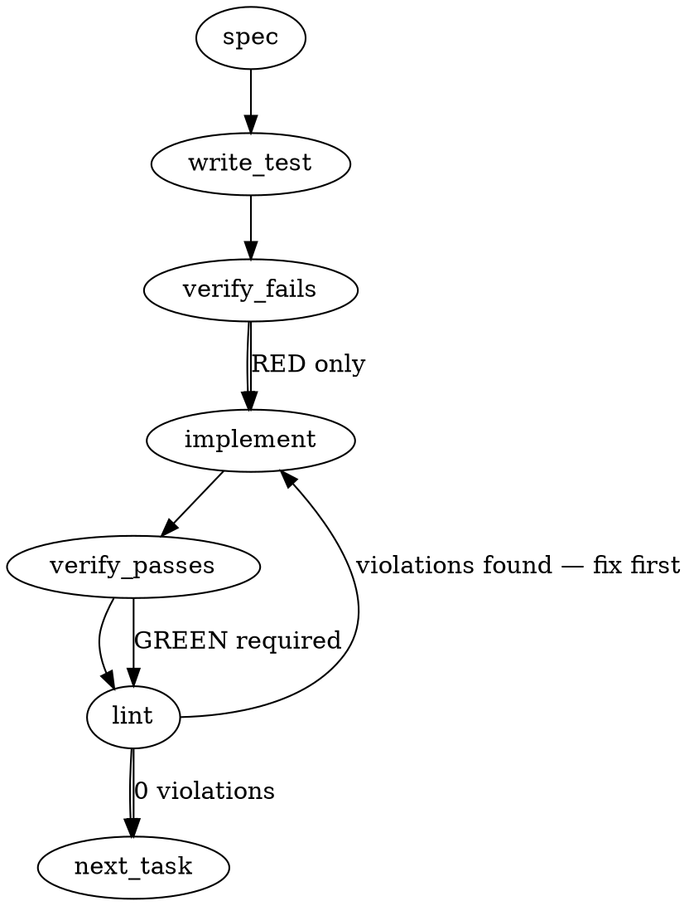

### Problem Statement

`totem init` currently installs a `SessionStart` hook for Gemini to provide orientation context (via `totem describe`) but fails to do so for Claude Code, leaving Claude sessions starting "cold". The fix requires symmetrically installing a `.claude/hooks/SessionStart.cjs` script and idempotently wiring it into `.claude/settings.json`.

### Architectural Context

- **Model-Stack Agnosticism (Tenet 16):** Emphasized in the issue. Both Gemini and Claude must have symmetric orientation capabilities at startup.
- **Eject Parity Trap:** The issue correctly identifies what needs to change in `init.ts`, but omits the corresponding cleanup required in `eject.ts`. Totem's architecture mandates that anything `init` installs, `eject` must cleanly remove.
- **ESM Node Resolution:** The `.cjs` extension is a load-bearing requirement due to `type: module` strictness in modern repositories, which will fail to `require()` standard `.js` files in hook execution environments.

### Files to Examine

1. `packages/cli/src/commands/init.ts` — Contains the `installClaudeHooks` function where the hook script and settings modifications will be implemented.
2. `packages/cli/src/commands/eject.ts` — Contains `scrubClaudeSettings` which must be updated to clean up the newly added `.claude/settings.json` hook.

### Technical Approach & Contracts

**1. Hook Script Generation**
Define a `CLAUDE_SESSION_START` constant in `init.ts` containing the CJS payload. It must:

- Route `stderr` to `stdout` to avoid noisy prompt errors.
- Wrap execution of `@mmnto/cli describe` in a `try/catch` and fail gracefully if the CLI is missing or errors out.

**2. Settings Injection (Idempotent Merge)**
Modify `installClaudeHooks` to process `.claude/settings.json` (note: not `.local.json`).
Contract structure required for the payload:

```typescript
type ClaudeSettings = {
  hooks?: {
    SessionStart?: Array<{
      hooks: Array<{ type: string; command: string; timeout: number }>;
    }>;
    [key: string]: any;
  };
  [key: string]: any;
};
```

Read the file. If missing, create it. If present, parse it, ensure the `hooks.SessionStart` array exists, and append the hook object _only if_ an entry with `command: "node .claude/hooks/SessionStart.cjs"` does not already exist.

**3. Ejection Cleanup**
Update `eject.ts` to explicitly delete `.claude/hooks/SessionStart.cjs` and surgically remove the corresponding entry from the `hooks.SessionStart` array in `.claude/settings.json`. If the array or `hooks` object becomes empty, delete the parent key to leave a clean file.

### Edge Cases & Traps

- **Destructive Settings Merge:** Simply overwriting `.claude/settings.json` or `hooks.SessionStart` will wipe out a user's custom Claude Code hooks. Deep, idempotent merging is mandatory.
- **Missing Eject Logic:** The issue explicitly requests changes to `init`, but adding configuration without adding corresponding `eject` cleanup will break the state contract of `totem eject` and fail CI health checks.
- **File Extension Strictness:** Using `.js` instead of `.cjs` will cause an `ERR_REQUIRE_ESM` crash when Claude triggers the hook in a repo using `"type": "module"`.
- **JSON Formatting Preservation:** When rewriting `.claude/settings.json`, use `JSON.stringify(data, null, 2)` to preserve readability for the committed configuration file.

### Implementation Tasks

- [ ] **Task 1: Define CJS Hook Payload & Write Script File**
  - Modify `packages/cli/src/commands/init.ts` to include a `CLAUDE_SESSION_START` constant matching the `totem-strategy` reference (stderr routed to stdout, graceful fallback).
  - Update `installClaudeHooks` to write this payload to `.claude/hooks/SessionStart.cjs`.
  - Add this file to the returned `HookInstallerResult[]` array.
    > TEST DIRECTIVE: Before implementing, write a failing test named `writes Claude SessionStart hook with .cjs extension` that proves `init.ts` scaffolds the script file correctly.
  - write test (or update existing) → verify fails → implement → verify passes → lint

- [ ] **Task 2: Idempotently Wire Hook into Settings JSON**
  - Modify `installClaudeHooks` in `packages/cli/src/commands/init.ts` to check if `.claude/settings.json` exists.
  - Read and parse the file (or create an empty object).
  - Traverse and ensure `hooks.SessionStart` exists as an array.
  - Append the `node .claude/hooks/SessionStart.cjs` hook config if it is not already in the array.
  - Write the file back using `JSON.stringify(..., null, 2)`.
    > TEST DIRECTIVE: Before implementing, write a failing test named `idempotently merges Claude SessionStart hook into existing settings.json` that proves existing hooks are preserved and duplicate injections do not occur.
  - write test (or update existing) → verify fails → implement → verify passes → lint

- [ ] **Task 3: Implement Eject Cleanup for Claude Settings**
  - Modify `scrubClaudeSettings` in `packages/cli/src/commands/eject.ts` (or add a companion function) to target `.claude/settings.json` (in addition to `settings.local.json`).
  - Read and parse the file. Filter out the `SessionStart` entry targeting `SessionStart.cjs`.
  - If `hooks.SessionStart` becomes empty, delete the `SessionStart` key.
  - Remove `.claude/hooks/SessionStart.cjs` using `fs.unlinkSync` if it exists.
    > TEST DIRECTIVE: Before implementing, write a failing test named `scrubs injected Claude SessionStart hook without removing user hooks` that proves the `eject` command cleans up only the Totem-injected configuration.
  - write test (or update existing) → verify fails → implement → verify passes → lint

### Execution Flow (structural constraint)



### Verification (MANDATORY — do not skip)

Every implementation MUST end with these steps:

1. `totem lint` — deterministic rule check (zero LLM, ~2s). Fixes any violations.
2. `totem review` — AI-powered architectural review (~18s). Addresses any critical findings.
3. If using MCP, call `verify_execution` to confirm compliance before declaring the task done.

### Test Plan

- **Init Idempotency:** Run `totem init` twice on a mock repo. Verify `.claude/settings.json` contains exactly one instance of the `SessionStart.cjs` hook.
- **Init Preservation:** Seed a mock repo with a `.claude/settings.json` containing a dummy `SessionStart` hook (e.g., `echo "custom"`). Run `totem init` and verify both the dummy hook and the new Totem hook exist in the array.
- **Init Extension Validation:** Assert the hook script is generated with `.cjs`, not `.js`.
- **Eject Integrity:** Run `totem init` then `totem eject`. Assert `.claude/settings.json` does not contain the `SessionStart.cjs` hook and `.claude/hooks/SessionStart.cjs` is physically deleted. Assert `.claude/settings.local.json` cleanup is unaffected.

---

## Implementation Design

> **Slice 1 of Phase C 3-way split.** Per locked sequencing: slice 1 = symmetric Claude SS hook (this PR), slice 2 = `describe`-canonical reconciliation, slice 3 = session-utility skill suite distribution. Slices 2 + 3 are out of scope here.

### Scope (2 sentences)

This PR scaffolds a Claude Code `SessionStart` hook (`.claude/hooks/SessionStart.cjs`) and merges its entry into committed `.claude/settings.json` so `totem init` produces parity with the Gemini-side install (which has scaffolded `.gemini/hooks/SessionStart.js` since pre-Phase-B). Eject parity for the new SessionStart entry + script is included; **eject cleanup for Phase B's `PreWriteShield` (the same architectural class of gap, tracked at `mmnto-ai/totem#1852`) is OUT of scope** — see OQ 1.

### Data model deltas

- **`CLAUDE_SESSION_START`** (new module constant in `init-templates.ts`) — the CJS payload, ported verbatim from `mmnto-ai/totem-strategy:.claude/hooks/SessionStart.cjs` with project name parameterized to "Totem" instead of "Totem Strategy". Carries `TOTEM_FILE_MARKER` for `scaffoldFile` idempotency.
  - **Holds:** the literal hook script content.
  - **Writes:** `init.ts:installClaudeHooks` (via `scaffoldFile`).
  - **Reads:** Claude Code at session-start (executes via `node .claude/hooks/SessionStart.cjs`).
  - **Invariants:** filename MUST be `.cjs` (load-bearing per spec — `package.json` `type: module` repos otherwise resolve `.js` as ESM and reject the CJS `require()` calls in the hook); marker MUST be present in the rendered output for `scaffoldFile` to detect prior install.
- **`CLAUDE_SESSION_START_ENTRY`** (new module constant in `init-templates.ts`) — the JSON entry shape merged into `.claude/settings.json#hooks.SessionStart`:
  ```json
  {
    "hooks": [
      { "type": "command", "command": "node .claude/hooks/SessionStart.cjs", "timeout": 30000 }
    ]
  }
  ```

  - **Note:** SessionStart entries have NO `matcher` field (unlike `PreToolUse` entries). The existing `mergeClaudePreToolUseEntry` + `preToolUseHasMatcher` helpers are PreToolUse-shaped and can't be reused as-is — sibling needed (see OQ 4).
- **`ClaudeSettingsSchema`** extension (in `init.ts`) — add optional `hooks.SessionStart: Array<{ hooks: Array<HookCommand> }>` validation. Passthrough already preserves the field on round-trip; explicit shape buys validation on merge.
- **`TOTEM_SCAFFOLDED_FILES`** (in `eject.ts`) — append `.claude/hooks/SessionStart.cjs`. Marker-checked delete still gates against user-owned content.
- **No new state containers.** All state is per-`init` invocation; no module variables, singletons, or shared mutable state.

### State lifecycle

- **Hook script file** (`.claude/hooks/SessionStart.cjs`): persistent, written at `totem init` time, deleted at `totem eject` time. Marker-checked on both ends.
- **Settings JSON entry** (`.claude/settings.json#hooks.SessionStart[N]`): persistent, merged at `totem init` time (idempotent on duplicate runs), removed at `totem eject` time. Other `SessionStart` entries (user-defined) preserved.
- No state crosses lifecycle boundaries.

### Failure modes

| Failure                                                                            | Category                  | Agent-facing surface                                                                                | Recovery                                                                                         |
| ---------------------------------------------------------------------------------- | ------------------------- | --------------------------------------------------------------------------------------------------- | ------------------------------------------------------------------------------------------------ |
| `.claude/settings.json` already contains the Totem `SessionStart.cjs` entry        | runtime (idempotent path) | `'skipped'` ScaffoldOutcome (no message change)                                                     | none needed — re-runs are no-ops                                                                 |
| `.claude/settings.json` exists but is invalid JSON                                 | permanent                 | `'skipped'` with structured `err` propagated to `initCommand` log                                   | user fixes the JSON manually                                                                     |
| `.claude/settings.json` shape doesn't match `ClaudeSettingsSchema` after extension | permanent                 | `'skipped'` with Zod-issue detail in `err`                                                          | user fixes the shape                                                                             |
| `.claude/hooks/SessionStart.cjs` exists without Totem marker (user-authored)       | permanent                 | `scaffoldFile` returns `'skipped'` with no overwrite                                                | user explicitly removes their hook OR accepts the marker conflict                                |
| Hook script execution fails at session-start (cli not installed)                   | runtime (degraded)        | hook prints `'[Totem] @mmnto/cli not installed...'` to stdout, exits 0                              | `pnpm install`                                                                                   |
| Hook script execution throws (process error)                                       | runtime (degraded)        | hook prints `'[Totem] Briefing unavailable: <err>'` to stdout, exits 0                              | depends on err                                                                                   |
| Hook script timeout (>30s)                                                         | transient                 | Claude Code aborts hook, session continues without orientation                                      | next session re-runs                                                                             |
| Eject: `.claude/hooks/SessionStart.cjs` exists without marker                      | runtime                   | `removeScaffoldedFiles` skips, records in summary                                                   | user removes manually if intended                                                                |
| Eject: `.claude/settings.json` filtered to empty `hooks.SessionStart`              | runtime                   | array key deleted; if `hooks` becomes empty, delete `hooks` key; if file becomes empty `{}`, unlink | already handled by existing `scrubClaudeSettings` cleanup pattern (mirror it for committed file) |

No silent-degradation rows. The two `runtime (degraded)` rows are explicit `process.stdout.write` messages with `[Totem]` prefix — visible breadcrumb at session start, not silent. Justified against Tenet 4 because session-start orientation is non-load-bearing for correctness; cold start is acceptable.

### Invariants to lock in via tests

- **Init: `.cjs` extension preserved.** Hook file scaffolded with `.cjs`, not `.js`. (Load-bearing per spec.)
- **Init: settings.json entry merge is idempotent.** Running `totem init` twice on an empty repo produces exactly one `SessionStart.cjs` entry.
- **Init: settings.json entry merge preserves user hooks.** Pre-seeded `SessionStart` entry with `command: "echo custom"` survives `totem init`; new Totem entry sits alongside.
- **Init: settings.json entry merge coexists with PreWriteShield.** Pre-seeded `PreToolUse` entry (Phase B's PreWriteShield) is untouched by SessionStart install.
- **Init: hook script content matches the canonical reference shape.** Contains the `@mmnto/cli` not-installed fallback message AND the process-error fallback. Routes stderr to stdout (substring assertion on `process.stdout.write((result.stdout || '') + (result.stderr || ''))`).
- **Eject: SessionStart entry removed without affecting Phase B's PreWriteShield entry.** Filter is shape-specific (matches by `command` substring, not by index/position).
- **Eject: SessionStart hook script is physically deleted only when marker present.** User-authored hook (no marker) preserved.
- **Eject: settings.json file unlink-on-empty contract preserved.** Cleanup chain `delete entry → maybe delete SessionStart array → maybe delete hooks → maybe unlink file` matches the existing `.local.json` pattern.

### Open questions

1. **Scope: close `mmnto-ai/totem#1852` (Phase B PreWriteShield eject parity) in this PR, or leave for that ticket?**
   - **Background:** Phase B added init-side scaffolding for `.claude/hooks/PreWriteShield.cjs` + `.claude/settings.json#hooks.PreToolUse[Write|Edit]` but never updated eject. This PR adds eject cleanup for the new SessionStart entry; if I touch the same `scrubClaudeSettings` shape for committed-file cleanup, it's a small additional delta to also handle PreWriteShield + add `.claude/hooks/PreWriteShield.cjs` to `TOTEM_SCAFFOLDED_FILES`.
   - **Options:** (a) Strict slice 1 — only handle SessionStart eject; leave the PreWriteShield eject gap to `#1852`. (b) Close `#1852` in this PR — a few lines extra. The eject helper for committed `settings.json` is naturally shared.
   - **Recommendation:** **(b)** — close `#1852`. The eject asymmetry is real, the additional shape is tiny (one more matcher predicate, one more file in `TOTEM_SCAFFOLDED_FILES`), and shipping slice 1 with a known eject inconsistency on its own committed-settings.json surface invites bot review noise ("Why does this PR's eject scrub SessionStart but not PreWriteShield from the same file?"). Closing `#1852` here is the cleaner architectural posture.
   - **Tradeoff:** widens diff slightly; adds one more entry to PR body's "Closes" line. Acceptable.

2. **Hook content: how closely mirror the `totem-strategy` reference?**
   - **Options:** (a) Verbatim port, with project name parameterized to "Totem" or generic. (b) Strip the project-specific orientation message and use a generic "[Totem] @mmnto/cli not installed; run `pnpm install`" — no per-project README pointer. (c) Make project-name fully parametric via init prompt (overengineered).
   - **Recommendation:** **(b)** — generic. The strategy reference's "Read README.md, design-tenets.md, ..." line is `totem-strategy`-specific; baking it into `totem init` would propagate strategy-repo conventions into every consumer. Generic message says: cli not installed → install it; cli installed but errored → here's the error. Project-specific orientation is the job of `totem describe` itself, not the fallback message.
   - **Tradeoff:** consumers who already retrofitted the strategy version will see slightly different fallback text after re-init; their content has the `[totem]` marker, so `scaffoldFile` will return `'exists'` and skip — they won't actually get the new generic version unless they delete + re-init (per `claude-0032` MEMORY pattern + `#1854`).

3. **Idempotency probe: dedup based on `command` substring match, mirroring `hasPreWriteShield`?**
   - **Options:** (a) Substring `"SessionStart.cjs"` match. (b) Substring `"node .claude/hooks/SessionStart.cjs"` (full command). (c) Exact entry deep-equal.
   - **Recommendation:** **(a)** — substring `"SessionStart.cjs"`. Mirrors `hasPreWriteShield`'s pattern. Robust against future timeout tuning or quoting variants of the command. Stricter than (c) which would re-merge if the user added their own `timeout` override.
   - **Tradeoff:** false-skip if a user has their own SessionStart hook also named `SessionStart.cjs`. Edge case; matches the existing project convention.

4. **Merge helper: extend `mergeClaudePreToolUseEntry` to support SessionStart, or sibling function?**
   - **Options:** (a) Generalize `mergeClaudePreToolUseEntry` → `mergeClaudeSettingsEntry(filePath, hookKind, entry, alreadyInstalled)`. (b) Sibling `mergeClaudeSessionStartEntry(filePath, entry, alreadyInstalled)` that mirrors the merge logic but writes to `hooks.SessionStart` instead of `hooks.PreToolUse`. (c) Extract a deeper helper `mergeClaudeHooksKey(filePath, key, entry, alreadyInstalled)` and have both call it.
   - **Recommendation:** **(c)** — extract `mergeClaudeHooksKey`. Both PreToolUse and SessionStart land in `.claude/settings.json#hooks.<key>`; the merge logic (read → safeparse → idempotency probe → append → write) is identical except for the key name. Existing `mergeClaudePreToolUseEntry` becomes a thin wrapper for backward compat (still callable from `scaffoldClaudeHooks` + `scaffoldClaudeWriteShield`); new `mergeClaudeSessionStartEntry` becomes a sibling thin wrapper. One source of truth for the JSON merge logic, mirroring Phase B's discipline.
   - **Tradeoff:** small refactor of working code. Risk: (a) is a wider blast radius; (b) duplicates ~30 lines. (c) is the right factoring — Phase B already established the "shared merge helper" pattern; extending it once is cheaper than the duplication tax of (b) compounding next time we add a hook key.

5. **Settings file: committed `.claude/settings.json` (matching Phase B's PreWriteShield)?**
   - **Options:** (a) Committed `.claude/settings.json`. (b) Per-developer `.claude/settings.local.json`.
   - **Recommendation:** **(a)** — committed. Per `claude-0032` MEMORY (`feedback_settings_file_asymmetry_architecturally_correct`): committed `settings.json` IS team-level guarantee, `settings.local.json` IS per-developer environment safety. Orientation IS a team-level guarantee — every team member's Claude session should boot with the same `totem describe` context. PR body should annotate this explicitly so reviewers don't flag the choice as inconsistent with the legacy shield-gate placement in `.local.json`.
   - **Tradeoff:** committed file means consumers who already committed their own `settings.json` see merge attempts; idempotent so safe.

6. **TSDoc / README: surface that init now writes a committed `settings.json` SessionStart entry?**
   - **Options:** (a) PR body + changeset only. (b) Update `docs/wiki/installation.md` or similar to document the file. (c) Both.
   - **Recommendation:** **(a)** — PR body + changeset. Wiki docs are out of scope for slice 1; the changeset entry IS the user-facing docs surface for `init` behavior changes per established `1.30.0`/`1.31.0`/`1.32.0` cohort pattern.
   - **Tradeoff:** documentation deferred to slice 2 / 3 if those slices touch related surfaces.
