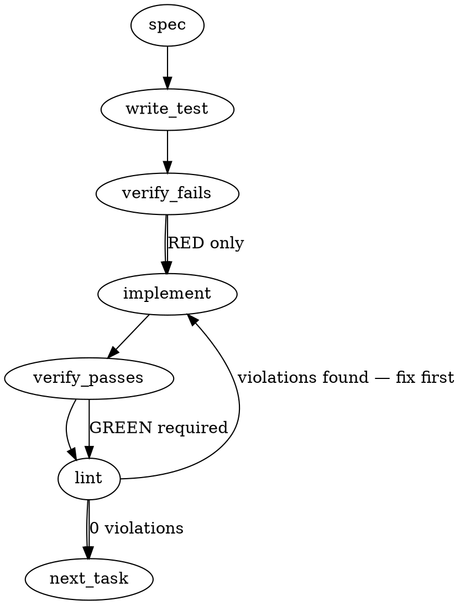

### Problem Statement

We need to shift `xrepo-qualify-refs` enforcement from commit-time to write-time to eliminate an agent friction loop where the AI writes a file, attempts to commit, fails the lint rule, and has to rewrite. This will be implemented by extending `totem init` to install AI-aware file-write interception hooks (`PreToolUse` for Claude, `BeforeTool` for Gemini) that block bare issue references (e.g., `#247`) in substrate-participating paths before they hit the disk.

### Architectural Context

- **docs/wiki/enforcement-model.md:** Defines the `PreToolUse` hook as the preferred platform primitive for agent-aware code verification, establishing that determinism at the write-boundary is standard pattern.
- **packages/cli/src/commands/init.ts:** Contains the `initCommand` entry point which will drive the templating and installation of these hooks.

### Files to Examine

1. `packages/cli/src/commands/init.ts` — Core command where hook installation and configuration generation logic must be injected.
2. `packages/core/src/rules/xrepo-qualify-refs.ts` (or equivalent core rule file) — To extract the bare-ref Regex into a shared constant for single-source-of-truth.
3. `packages/cli/src/templates/claude-settings.json` (or inline equivalent in `init.ts`) — For injecting the new hook matcher.
4. `packages/cli/src/templates/gemini-before-tool.js` (or inline equivalent in `init.ts`) — For extending the Gemini interception logic.

### Technical Approach & Contracts

**1. Single Source of Truth for Regex:**
Mirror the canonical regex from `mmnto-ai/totem-strategy:.totem/compiled-rules.json` (lessonHash `xrepo-qualify-refs`, sealed at `mmnto-ai/totem-strategy#145`, seal SHA `c488888b`): `(?<!\b[\w-]+/[\w-]+)#(\d+)(?![-\w])`. Inline this as `BARE_REF_REGEX_SOURCE` in `init-templates.ts` for embedding into the hook templates. Per the design's OQ 1 resolution (inline literal), this avoids the chicken-and-egg of freshly-init'd repos lacking compiled-rules.json. Drift is bounded by `totem init` re-run.

> **Note on the prior preamble:** an earlier draft of this section (auto-generated by `totem spec` before the Implementation Design appendix was written) referenced a regex of the form `/(^|[^a-zA-Z0-9/_-])#(\d{2,4})([^0-9]|$)/g`. That sketch is **NOT** the canonical pattern and has been corrected here. The compiled rule's `\d+` (one-or-more digits) is canonical; `\d{2,4}` would over-restrict (single-digit refs like `#1` and long refs like `#12345` are intentionally caught by the lint rule).

**2. Claude Hook Generation:**

- Generate `.claude/hooks/PreWriteShield.cjs`.
- The script must intercept `Write` and `Edit`.
- Path check MUST normalize separators (handle both `/` and `\`) or use `/\.(handoff|journal)[\\/]/i` to account for Windows paths.
- Content extraction must safely check `input.content || input.new_string || ''` and ensure it's a string before running `matchAll`.

**3. Gemini Hook Extension:**

- Modify the `.gemini/hooks/BeforeTool.js` file generated by `init`.
- Add an `if` block for `['write_file', 'edit_file'].includes(toolName)`.
- Apply the identical regex logic, throwing an Error with the formatted message if violations are found.

**4. Settings Merging Contract:**
When `init` runs, it must update `.claude/settings.json` idempotently.

- Use the shared helper `readJsonSafe` to read existing settings (avoids parse crashes).
- Check if the matcher for `Write|Edit` mapped to `PreWriteShield.cjs` already exists. If not, push it to the `hooks` array.

### Edge Cases & Traps

- **Windows File Paths:** The issue's regex `/\.(handoff|journal)\//i` fails on Windows tool inputs using backslashes. **Trap:** Must use `[\\/]` for cross-platform matching.
- **Non-String Input Data:** If `input.content` is an array or object due to tool-calling hallucinations, `matchAll` will crash the hook with a confusing TypeError. Ensure a `typeof` check or string coercion.
- **Idempotency Destructions:** Re-running `totem init` must not duplicate the Claude hook configuration in `.claude/settings.json` or create duplicate `if` blocks in Gemini's `BeforeTool.js`.
- **Regex `lastIndex` State:** Because the regex is dynamic and uses the `g` flag, if you were to use `exec()` or `test()` repeatedly on a single RegExp instance, it would fail randomly. `matchAll()` circumvents this, but be careful not to extract the regex incorrectly.

### Implementation Tasks

- [ ] **Task 1: Extract Shared Bare Ref Regex**
  - Modify `packages/core/src/rules/xrepo-qualify-refs.ts` (or relevant rule constants file).
  - Export the bare ref regex as a constant string `BARE_REF_REGEX_SOURCE`.
  - Update the existing lint rule to consume this constant.
    > TEST DIRECTIVE: Before implementing, write a failing test named `exports and utilizes shared bare ref regex` in the core rules test file.
  - write test → verify fails → implement → verify passes → lint

- [ ] **Task 2: Claude PreWriteShield Script Generation**
  - Modify `packages/cli/src/commands/init.ts` (or its template module) to generate `.claude/hooks/PreWriteShield.cjs`.
  - Inject `BARE_REF_REGEX_SOURCE` directly into the template string.
  - Apply the `[\\/]` fix for Windows paths in the `filePath` regex.
  - Add strict type checking: if `content` is not a string, coerce it before `matchAll`.
    > TEST DIRECTIVE: Before implementing, write a failing test named `generates PreWriteShield.cjs with windows path support` in the `init.ts` test suite.
  - write test → verify fails → implement → verify passes → lint

- [ ] **Task 3: Update Claude Settings.json**
  - Modify `init.ts`. Check for existing `.claude/settings.json` using the `readJsonSafe` shared helper.
  - Define a Zod schema for the settings file if one doesn't exist to ensure type safety.
  - Append the `PreToolUse` hook definition for `Write|Edit` if not already present.
  - Write back out cleanly.
    > TEST DIRECTIVE: Before implementing, write a failing test named `merges PreWriteShield hook into existing claude settings idempotently` in `init.test.ts`.
  - write test → verify fails → implement → verify passes → lint

- [ ] **Task 4: Update Gemini BeforeTool Script**
  - Modify the `.gemini/hooks/BeforeTool.js` template in `init.ts` (or template files).
  - Append the interception block for `write_file` and `edit_file`.
  - Inject the same regex constant and logic as Claude.
    > TEST DIRECTIVE: Before implementing, write a failing test named `generates Gemini BeforeTool with write interception logic` in `init.test.ts`.
  - write test → verify fails → implement → verify passes → lint

### Execution Flow (structural constraint)

### Verification (MANDATORY — do not skip)

Every implementation MUST end with these steps:

1. `totem lint` — deterministic rule check (zero LLM, ~2s). Fixes any violations.
2. `totem review` — AI-powered architectural review (~18s). Addresses any critical findings.
3. If using MCP, call `verify_execution` to confirm compliance before declaring the task done.

### Test Plan

- **Init Command Unit Tests:** Run `totem init` in a mock environment. Verify `.claude/hooks/PreWriteShield.cjs` is created with proper file content.
- **Idempotency Test:** Run `totem init` twice. Verify `.claude/settings.json` does not contain duplicate hook entries.
- **Hook Execution Tests (Integration):**
  - Execute `node .claude/hooks/PreWriteShield.cjs` with `CLAUDE_TOOL_NAME="Write"`, `CLAUDE_TOOL_INPUT='{"file_path":".journal/test.md", "content": "Checking #247"}'`. Assert exit code 1.
  - Execute with `CLAUDE_TOOL_INPUT='{"file_path":".journal\\test.md", "content": "Checking #247"}'` (Windows). Assert exit code 1.
  - Execute with `CLAUDE_TOOL_INPUT='{"file_path":"src/index.ts", "content": "Checking #247"}'`. Assert exit code 0 (bypassed path).
  - Execute with `CLAUDE_TOOL_INPUT='{"file_path":".journal/test.md", "content": "Checking owner/repo#247"}'`. Assert exit code 0 (qualified ref).

---

## Implementation Design

### Scope

**Will:** Add a new write-time `xrepo-qualify-refs` enforcement hook to `totem init` for both Claude (`PreToolUse` on `Write|Edit`) and Gemini (`BeforeTool` on `write_file|edit_file`), scoped to substrate-participating paths (`.handoff/**`, `.journal/**`, `*.md`). New template constants in `packages/cli/src/commands/init-templates.ts`; new scaffold function in `packages/cli/src/commands/init.ts`; tests in `init.test.ts` + new hook-level tests; Zod schema extension in `ClaudeSettingsSchema`.

**Will NOT:** Re-implement the rule in totem-core source (the rule lives in totem-strategy compiled-rules.json data); add a programmatic core API for rule lookup (deferred until a second hook needs it); migrate the existing shield-gate hook; modify the lint-side `xrepo-qualify-refs` rule itself; introduce a new hook lifecycle event (uses existing `PreToolUse` / `BeforeTool` primitives only); add suppression mechanism for verbatim-quotation cases beyond the rule's existing directive (the hook respects the same directive by skipping content after directive lines).

### Data model deltas

- **`BARE_REF_REGEX_SOURCE`** (new exported string constant in `init-templates.ts`)
  - **What it holds:** Regex pattern source mirroring the compiled rule.
  - **Who writes it:** Static export.
  - **Who reads it:** new `CLAUDE_PREWRITESHIELD` template + `GEMINI_BEFORE_TOOL` extension. Inlined into hook scripts at template-generation time.
  - **Invariants:** Required, non-empty. Drift risk vs `mmnto-ai/totem-strategy:.totem/compiled-rules.json` rule pattern is bounded by re-running `totem init` (same drift model as `AI_PROMPT_BLOCK`'s `REFLEX_VERSION` cycle). Comment in the constant must point at the rule's lessonHash so readers know where to update both.

- **`CLAUDE_PREWRITESHIELD`** (new template string, sibling of `CLAUDE_SHIELD_GATE`)
  - **What it holds:** CommonJS hook script source. Reads JSON from stdin, parses `{tool_name, tool_input}`, applies path-scope check + bare-ref regex. Exits 2 with stderr message on violation; exit 0 otherwise.
  - **Path scope check:** uses `[\\\\/]` separator class for cross-platform behavior per Gemini-spec trap noted.

- **`CLAUDE_PREWRITESHIELD_ENTRY`** (new exported settings entry, sibling of `CLAUDE_PRETOOLUSE_ENTRY`)
  - **What it holds:** `{matcher: 'Write|Edit', hooks: [{type: 'command', command: 'node .claude/hooks/PreWriteShield.cjs'}]}`.
  - **Who reads it:** `scaffoldClaudeHooks` (extended).

- **`scaffoldClaudeHooks` extension**
  - Existing function processes ONE matcher. Refactor to iterate over an array of `{entry, identityProbe}` pairs OR add a sibling `scaffoldClaudeWriteShield`. Lean toward refactor for one source of truth, but explicit: this changes the signature only if existing call sites adopt the new shape.
  - The deduplication probe for `xrepo-qualify-refs` is independent from the existing `hasTotemShield` probe (different matcher + different hook command).

- **`GEMINI_BEFORE_TOOL` extension**
  - Append a second branch to the existing `module.exports = function beforeTool(toolName, toolInput)` block. New branch matches `['write_file', 'edit_file'].includes(toolName)`, applies the same regex check, throws on violation. NOT a sibling file — same `BeforeTool.js` per Gemini's BeforeTool single-export contract.

### State lifecycle

- All new state is per-tool-call: each hook invocation reads its input, runs the regex, exits. Zero session-level or persistent state.
- Hook scripts are **generated once at `totem init` time** and live as files under `.claude/hooks/` and `.gemini/hooks/`. Re-running `totem init` regenerates them with the latest template constants. Same lifecycle as `shield-gate.cjs` and `BeforeTool.js` today.
- Settings entries live in `.claude/settings.local.json` (current scaffold target) — **proposing to migrate to committed `.claude/settings.json` for write-time enforcement so the gate propagates across the team.** See OQ 2.

### Failure modes

| Failure                                                                | Category | Agent-facing surface                                                                                                                           | Recovery                                                                 |
| ---------------------------------------------------------------------- | -------- | ---------------------------------------------------------------------------------------------------------------------------------------------- | ------------------------------------------------------------------------ |
| Hook receives empty stdin (no JSON)                                    | runtime  | exit 0 (treat as no-input → allow); legacy compat with `process.env.TOOL_INPUT` fallback if env var present                                    | none needed; matches existing shield-gate pattern                        |
| `JSON.parse(stdin)` throws                                             | runtime  | exit 0 with stderr warning `[totem PreWriteShield] could not parse stdin JSON; allowing`                                                       | re-init or report bug                                                    |
| `tool_input.file_path` not in scope (`.handoff` / `.journal` / `*.md`) | runtime  | exit 0 (allow)                                                                                                                                 | none needed                                                              |
| `tool_input.content` (or `new_string` for Edit) is a non-string        | runtime  | exit 0 with stderr warning; coerce-or-allow per Tenet-4 considerations                                                                         | re-init or report bug                                                    |
| Bare-ref regex matches in scoped content                               | runtime  | exit 2 with stderr message naming up-to-5 matched refs + `mmnto-ai/totem-strategy#145` reference + suppression-directive escape valve          | agent re-emits Write/Edit with qualified refs                            |
| Hook script throws unexpected error (e.g., regex compile fails)        | runtime  | exit 1 (NOT exit 2) — distinguishes hook-internal failure from intentional block; agent harness can surface as warning instead of policy block | fix hook                                                                 |
| Hook receives oversized content (>1MB markdown)                        | runtime  | regex applies normally; latency proportional to content size; no special-case                                                                  | bounded — markdown writes >1MB are vanishingly rare; no preemptive guard |
| Gemini hook throws on `write_file`/`edit_file` violation               | runtime  | hard error blocks the tool call; agent surfaces error message                                                                                  | agent re-emits with qualified refs                                       |

**Tenet 4 (Fail Loud) consideration:** Every "exit 0 with stderr warning" row is a **deliberate fail-soft** for hook-internal failure modes. The reasoning: the hook is a substrate guard, not the lint rule itself. If the hook's parsing fails or input is malformed, blocking the agent's Write/Edit would be a worse outcome than allowing through and letting `totem lint` (commit-time) catch the real violation. The hook tightens the loop where it can; it does not weaken the existing commit-time gate. Stderr warnings are still emitted so silent degradation is detectable.

### Invariants to lock in via tests

1. **Hook generation is idempotent.** Re-running `totem init` does NOT add a duplicate `Write|Edit` matcher to `.claude/settings.json` and does NOT duplicate the `if (['write_file', 'edit_file'].includes(toolName))` block in `BeforeTool.js`.
2. **Settings file shape is preserved.** Any unrelated `PreToolUse` matchers (e.g., user-added custom hooks) survive the merge unchanged.
3. **Stdin JSON shape correctly parsed.** Hook reads `{tool_name, tool_input: {file_path, content?, new_string?}}` shape; correctly extracts `content` for Write and `new_string` for Edit.
4. **Path-scope check is cross-platform.** Tests pass with both `.journal/foo.md` (POSIX) and `.journal\\foo.md` (Windows); out-of-scope paths (`src/index.ts`) bypass the check.
5. **Regex matches the same shape as the lint rule.** Both `#247` and `# 247` are caught (after stripping whitespace per the rule's pattern). `mmnto-ai/totem#247` is NOT caught (qualified). Match the rule's behavior empirically (verify against `mmnto-ai/totem-strategy:.totem/compiled-rules.json` regex).
6. **Exit code semantics.** Violation → exit 2 (Claude Code blocking convention). Hook-internal error → exit 1. No-input / out-of-scope → exit 0.
7. **Stderr message format.** Block message names up-to-5 matched refs + cites the seal (`mmnto-ai/totem-strategy#145`) + describes the qualified-ref shape + mentions the suppression directive as the escape valve.
8. **Suppression directive bypass.** Content with the existing rule's suppression directive directly preceding (or co-located on) a line containing a bare ref is allowed through. Mirrors the `rule-engine.ts isSuppressed` semantics (line + preceding line window, per banked memory `feedback_totem_context_directive_placement`).

### Open questions

1. **Question:** Should the bare-ref regex be inlined as a literal string in the hook template (drift via `totem init` re-run), OR should the hook read `<configRoot>/.totem/compiled-rules.json` at runtime to look up the rule by `lessonHash: "xrepo-qualify-refs"`?
   - **Options:**
     - **Inline literal in template (`BARE_REF_REGEX_SOURCE` const):** Fast, simple, no runtime dependency on compiled-rules.json existing in target repo. Drift bounded by `totem init` re-run cadence.
     - **Runtime read from compiled-rules.json:** Always-current; but freshly-init'd repos don't have compiled-rules.json yet (chicken-and-egg). Adds I/O + JSON parse + regex compile per hook invocation. Path resolution complexity (sediment-aware? per-repo?).
   - **Recommendation:** **Inline literal (Option 1).** Pragmatic for v1. If drift becomes a measurable problem, lift to a `@mmnto/totem` core export reading from compiled-rules at module-load time as a second iteration.

2. **Question:** Should the `Write|Edit` matcher entry land in `.claude/settings.local.json` (gitignored, per-developer) OR `.claude/settings.json` (committed, propagates to team)?
   - **Options:**
     - **`settings.local.json` (current scaffold target):** Consistent with existing `shield-gate.cjs` install path. Per-developer, no cross-team propagation. Each new contributor must run `totem init` to get the gate.
     - **`settings.json` (committed):** Write-time enforcement propagates to the entire team automatically. Risk: developers without the hook script get a settings entry pointing at a missing file.
     - **Hybrid: hook entry in `settings.json`, hook script in `.claude/hooks/PreWriteShield.cjs`, both committed.** This is the cleanest model: the entry references the script which lives in tree, so a fresh clone has both immediately. Re-running `totem init` is no longer required for new contributors.
   - **Recommendation:** **Hybrid (Option 3).** Write-time enforcement IS a team-level guarantee per the seal at `mmnto-ai/totem-strategy#145`; per-developer opt-in defeats the purpose. The Claude `.claude/hooks/` directory is already de-facto committed in family repos (totem-strategy, totem-substrate, arhgap11 all have `.claude/hooks/SessionStart.cjs` checked in). Settings entry to match. Surface as a follow-up if it conflicts with `mmnto-ai/totem#1845` slice 1's symmetric Claude SS hook concern; otherwise ship.

3. **Question:** Refactor `scaffoldClaudeHooks` to iterate over multiple PreToolUse entries (Bash, Write|Edit, future), OR add a sibling `scaffoldClaudeWriteShield`?
   - **Options:**
     - **Refactor to iterate:** One source of truth for the merge-and-deduplicate logic. Future PreToolUse hooks slot in cleanly. More change surface in this PR.
     - **Sibling function:** Smaller diff. Code duplication if a third hook lands later.
   - **Recommendation:** **Refactor to iterate.** The function is small, the duplication cost grows fast, and `mmnto-ai/totem#1845` slice 3 (session-utility skill suite distribution) may add more PreToolUse entries. Refactor pays back inside the same epic.

4. **Question:** Should the hook handle regex global-flag pitfalls per Gemini's spec note?
   - **Options:**
     - Use `String.prototype.matchAll(regex)` per spec — fresh iteration each invocation; no lastIndex state.
     - Use `RegExp.prototype.exec()` in a loop — risk of lastIndex drift if regex is reused.
   - **Recommendation:** **`matchAll`** per spec. Fresh invocation per hook call; correct semantics + readable.
