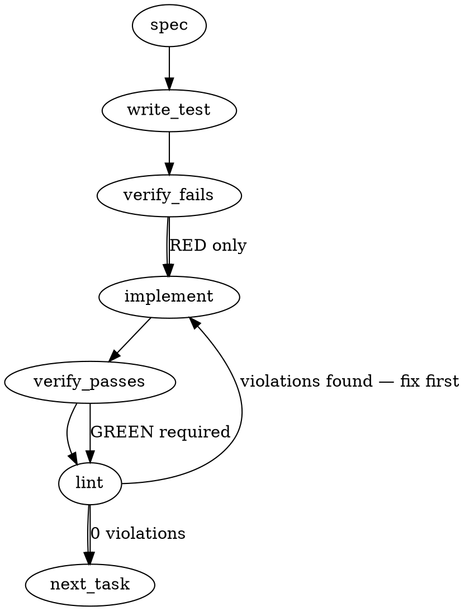

### Problem Statement

The `LazyEmbedder` fallback chain correctly degrades to a `TotemConfigError` when configured cloud SDKs and local Ollama are both missing, but consumers perceive this well-formed error as a crash and apply vendor-coupling workarounds (installing the cloud SDK directly). This requires proactively surfacing the Ollama-as-floor expectation via `totem doctor` and locking the fallback error contract with an empirical regression test to prevent future silent breakages.

### Architectural Context

This feature reinforces **Tenet 16 (Model-Stack Agnosticism)** by preventing consumer-side coupling to specific vendor SDKs like `@google/genai`. The existing fallback chain (shipped in `#522`) architecturally supports this agnosticism via dynamic imports, but requires the UX discoverability gap closed to be effective in practice. None of the retrieved Totem specific lessons mandate a new pattern here, but the architectural intent heavily prioritizes explicit graceful degradation without blocking.

### Files to Examine

1. `packages/core/src/embedders/embedder.ts` — Contains `LazyEmbedder`, the target of the empirical regression test, and likely the `isOllamaAvailable` logic.
2. `packages/core/src/embedders/embedder.spec.ts` (or `.test.ts`) — Where the new regression test asserting the `TotemConfigError` fallback chain will live.
3. `packages/cli/src/commands/doctor.ts` — The primary surface for Ask 1 to inject the proactive Ollama probe.
4. `packages/cli/src/commands/init.ts` — The secondary surface for Ask 1 to scaffold expectations at repo creation time.

### Technical Approach & Contracts

**Approach:**

1. **Ollama Network Probe:** Implement or expose a lightweight, timeout-bounded HTTP probe to `http://localhost:11434/api/tags` to assert Ollama's presence without hanging CLI commands if the port is blackholed.
2. **Surface via Doctor & Init:** Invoke the probe during `totem doctor` (and `totem init`). Output the specific diagnostic message defining the "Ollama-as-floor" expectation.
3. **Fallback Regression Test:** Write an isolated test simulating the dual-failure state (vendor SDK missing + Ollama unreachable). Assert on the specific error code (`CONFIG_MISSING`) and the presence of the 3-step remediation in the error message.

**Contracts:**

- **Diagnostic Probe Interface:**
  ```typescript
  type OllamaDiagnosticResult = {
    isAvailable: boolean;
    recommendationMsg: string; // "Totem can use a cloud embedder... Ollama is the recommended floor..."
  };
  ```
- **Error Assertion Contract:**
  The `TotemConfigError` thrown by the fallback chain MUST adhere to:
  ```typescript
  interface ExpectedFallbackError {
    name: 'TotemConfigError';
    code: 'CONFIG_MISSING';
    message: string; // Must include "No embedding provider available"
    hint: string; // Must include numbered remediation steps
  }
  ```

### Edge Cases & Traps

- **Trap — Infinite/Long Network Hangs:** Probing `localhost:11434` can hang indefinitely if the routing is weird or the port is blackholed. The probe **must** use an `AbortController` with a strict timeout (e.g., `500ms` or `1000ms`).
- **Trap — IPv6/IPv4 Resolution Conflicts:** `localhost` can resolve to `::1` or `127.0.0.1` depending on the Node version and OS, occasionally failing if Ollama only binds to one. Relying strictly on Node's native `fetch` usually handles this gracefully, but the probe must silently catch `fetch` network errors without bubbling them up and crashing `totem doctor`.
- **Trap — Test Environment Pollution:** Mocking dynamic imports for `@google/genai` to test the fallback chain can permanently poison the module cache for subsequent tests. The mock must be strictly isolated (e.g., using `vi.resetModules()` or Jest equivalent).

### Implementation Tasks

- [ ] **Task 1: Implement Time-Bounded Ollama Probe**
  - **Files:** `packages/core/src/utils/ollama.ts` (or existing `packages/core/src/embedders/embedder.ts` if `isOllamaAvailable` is there), `packages/core/src/utils/ollama.spec.ts`
  - **Steps:**
    - Extract or create the `isOllamaAvailable` function using native `fetch`.
    - Inject an `AbortController` bounded to an 800ms timeout.
    - Catch all network errors, timeouts, and `ECONNREFUSED` internally, returning `false` instead of throwing.
      > TEST DIRECTIVE: Before implementing, write a failing test named `returns false when Ollama endpoint times out after 800ms` that proves the timeout boundary works without throwing.
  - write test (or update existing) → verify fails → implement → verify passes → lint

- [ ] **Task 2: Inject Floor Expectation into Doctor & Init Commands**
  - **Files:** `packages/cli/src/commands/doctor.ts`, `packages/cli/src/commands/init.ts`, their respective test files.
  - **Steps:**
    - Import the probe function from Task 1.
    - In `doctor.ts`, add the diagnostic check to the environment output. If `false`, append the floor message defined in the issue.
    - In `init.ts`, optionally append the exact prompt message to the setup summary/flow.
      > TEST DIRECTIVE: Before implementing, write a failing test named `doctor command outputs ollama-as-floor recommendation when probe returns false` that proves the UX copy surfaces.
  - write test (or update existing) → verify fails → implement → verify passes → lint

- [ ] **Task 3: Lock LazyEmbedder Fallback Contract via Regression Test**
  - **Files:** `packages/core/src/embedders/embedder.spec.ts` (or `.test.ts`)
  - **Steps:**
    - Set up an isolated test block asserting `LazyEmbedder` execution.
    - Mock `provider: 'gemini'` configuration.
    - Mock the dynamic import of `@google/genai` to throw a `MODULE_NOT_FOUND` error.
    - Mock `isOllamaAvailable()` to return `false`.
    - Try/catch the `.embed()` call and assert the error object matches the `ExpectedFallbackError` contract (code `CONFIG_MISSING`, message contains "No embedding provider available", and text contains the 3-step remediation).
      > TEST DIRECTIVE: Before implementing, write a failing test named `throws CONFIG_MISSING TotemConfigError with 3-step remediation when cloud SDK and Ollama are both absent` that proves the fallback chain is empirically locked.
  - write test (or update existing) → verify fails → implement → verify passes → lint

### Execution Flow (structural constraint)



### Verification (MANDATORY — do not skip)

Every implementation MUST end with these steps:

1. `totem lint` — deterministic rule check (zero LLM, ~2s). Fixes any violations.
2. `totem review` — AI-powered architectural review (~18s). Addresses any critical findings.
3. If using MCP, call `verify_execution` to confirm compliance before declaring the task done.

### Test Plan

- **Ollama Probe Timeout:** Ensure network delays >800ms resolve to `false` and do not hang the test suite or throw unhandled exceptions.
- **Doctor Diagnostics:** Ensure `totem doctor` captures the missing Ollama state and prints the exact URI to `https://ollama.com` in its diagnostic readout.
- **Fallback Regression Test:** Directly instantiating `LazyEmbedder` under simulated dual-failure conditions MUST throw the exact expected `TotemConfigError` structure, guaranteeing future changes to `embedder.ts` cannot silently regress to throwing standard JS TypeErrors or opaque stack traces.

---

## Implementation Design

> **PR-1 scope only.** Per locked sequencing, this PR ships `totem doctor` Ollama probe + `LazyEmbedder` regression test. Ask 1's `totem init` prompt is **PR-2** (separate stack). Both surfaces are in the issue body; only `doctor` lands here.

### Scope (2 sentences)

This PR adds a runtime Ollama probe to `totem doctor` (surfacing the floor expectation diagnostically) and a regression test that locks the documented `LazyEmbedder` `TotemConfigError` contract under dual-failure conditions. It does **not** touch `totem init`, does **not** add Transformers.js to the fallback chain (ADR-042 deferred work), and does **not** auto-install Ollama or change any user-facing copy outside doctor's own diagnostic line.

### Data model deltas

- **Export** `isOllamaAvailable(baseUrl?: string): Promise<boolean>` from `@mmnto/totem` (currently private in `embedder.ts:28`). No signature change. New public API surface.
  - **Holds:** nothing (pure function).
  - **Writes:** N/A.
  - **Reads:** `cli/doctor.ts` (new check). No other consumers in PR-1.
  - **Invariants:** never throws; bounded by `AbortSignal.timeout`. Default `baseUrl` = `http://localhost:11434` (matches `OLLAMA_DEFAULTS.baseUrl`).
- **No new types.** Reuses existing `DiagnosticResult` shape (`{ name, status, message, remediation? }`).
- **No new state containers.** Probe is fire-and-forget per `doctor` invocation.
- **No new reserved keys / sentinels.**

### State lifecycle

- Probe result: **per-`totem doctor` invocation.** Created at check time, consumed once into the `DiagnosticResult`, discarded. No caching, no persistence. Owned by `doctor.ts` check function.
- No state crosses lifecycle boundaries.

### Failure modes

| Failure                                                              | Category          | Agent-facing surface                                                                         | Recovery                                            |
| -------------------------------------------------------------------- | ----------------- | -------------------------------------------------------------------------------------------- | --------------------------------------------------- |
| Ollama daemon down (ECONNREFUSED)                                    | runtime           | `warn` with floor-recommendation message                                                     | user installs/starts Ollama OR configures cloud SDK |
| Ollama probe times out (>3s default; spec proposes 800ms — see OQ 3) | transient         | same `warn` (probe returns `false`)                                                          | next `doctor` run re-probes                         |
| Ollama returns non-2xx                                               | runtime           | same `warn` (probe returns `false`)                                                          | same                                                |
| `fetch` itself throws (DNS, IPv6/IPv4 conflict)                      | runtime           | same `warn` (caught internally, returns `false`)                                             | same                                                |
| `provider: 'ollama'` configured but daemon down                      | runtime           | **changes** from current `pass` (config-only) → new `fail`/`warn` (runtime-aware) — see OQ 4 | same                                                |
| Test mock leakage poisons module cache                               | init (tests only) | test failure                                                                                 | `vi.resetModules()` in `beforeEach`/`afterEach`     |

No "silent degradation" rows — every failure produces a visible `DiagnosticResult` with explicit status.

### Invariants to lock in via tests

- **Probe never throws.** Network errors, timeouts, ECONNREFUSED, malformed responses all resolve to `false`.
- **Probe respects timeout.** A blackholed endpoint returns `false` within the configured budget; does not hang the test suite or `doctor` invocation.
- **`LazyEmbedder` fallback contract:** when `provider: 'gemini'` is configured AND the dynamic import of `@google/genai` rejects with `MODULE_NOT_FOUND` AND `isOllamaAvailable()` returns `false`, the first `embed([...])` call rejects with a `TotemConfigError` whose:
  - `code === 'CONFIG_MISSING'`
  - message contains the literal `"No embedding provider available"`
  - hint contains all three numbered remediation steps (`(1) Install the SDK`, `(2) Install and start Ollama`, `(3) Set provider: 'ollama'`)
- **`LazyEmbedder` `warn` callback fires** with the cloud-failure + falling-back-to-Ollama message before the terminal throw (asserts the documented warning surface, not just the terminal error).
- **`doctor` Ollama probe surfaces a stable check name** (e.g., `'Ollama'`) — load-bearing because `doctor.test.ts` enumerates check names by string at line 316.

### Open questions

1. **Probe placement: new check vs. extend `checkEmbeddingConfig`?**
   - **Options:** (a) Add new sibling `checkOllamaProbe(cwd)` to the `results` array. Additive; current `checkEmbeddingConfig` semantics unchanged. (b) Extend `checkEmbeddingConfig` to runtime-probe when `provider: 'ollama'` (closes the false-pass gap noted above) AND/OR when no provider configured (Lite tier still benefits from knowing Ollama is up).
   - **Recommendation:** **(a)** for PR-1. New `Ollama` check; always probes (regardless of configured provider) because Ollama IS the floor per Tenet 16. Leave `checkEmbeddingConfig` untouched. The false-`pass` gap is real but is its own ticket (file Tier-3 follow-up); folding it into PR-1 widens the diff and changes existing behavior visible in `doctor.test.ts:316` enumeration.
   - **Tradeoff:** sibling check duplicates the "Ollama configured?" branch slightly. Acceptable for additive scope discipline.

2. **Probe export shape: re-export `isOllamaAvailable` vs. new `probeOllama()` returning richer object?**
   - **Options:** (a) Export `isOllamaAvailable` as-is (boolean). Cli converts boolean → diagnostic message inline. (b) New public `probeOllama()` returning `{ available, baseUrl, latencyMs, recommendation }` typed object.
   - **Recommendation:** **(a)** for PR-1. Smallest API surface, matches existing in-tree pattern. Richer object can ride a future PR if needed (e.g., `doctor` perf hardening or `init` UX).
   - **Tradeoff:** future-extensibility cost is low because the function signature can grow with optional params without breaking callers.

3. **Probe timeout: 800ms (spec) vs. 3000ms (existing)?**
   - **Options:** (a) Keep existing 3000ms — `LazyEmbedder` and `doctor` use the same value. (b) 800ms for `doctor` only (interactive context, user is waiting). (c) 800ms everywhere.
   - **Recommendation:** **(a)** for PR-1. The existing 3000ms is empirically working in `LazyEmbedder`; the spec's 800ms is a sketch from Gemini. Doctor's other checks (e.g., `checkSecretLeaks`, `checkLinkedIndexes`) are not optimized for sub-second budgets. If profiling later shows `doctor` is slow, tune then. **Pre-emptive defense against bot review:** the spec preamble's `800ms` is a sketch, not canonical truth — see `feedback_spec_preamble_canonical_consistency.md` (claude-0032 pattern). PR body should annotate this.
   - **Tradeoff:** 3s is long for a CLI probe. Mitigated because (i) the probe runs once per invocation, (ii) it's parallel-eligible if needed.

4. **`provider: 'ollama'` configured-but-down: in-scope for PR-1?**
   - **Options:** (a) Out of scope — file separate ticket, leave `checkEmbeddingConfig` unchanged. (b) Patch the false-`pass` here (smallest possible diff in `checkEmbeddingConfig`).
   - **Recommendation:** **(a)** for PR-1, file Tier-3. Reasoning: PR-1's headline ask is _additive_ discoverability (surface the floor); patching `checkEmbeddingConfig` is a _behavior change_ (existing `pass` → `fail`/`warn`) that could trip CI in consumer repos with stale env. Two clean PRs > one mixed.

5. **Regression test mock approach: `vi.mock` on dynamic import vs. inject probe?**
   - **Options:** (a) `vi.mock('./gemini-embedder.js', () => { throw ... })` + `vi.spyOn(global, 'fetch')` to force `isOllamaAvailable` → false. Closest to real fallback chain. (b) Refactor `LazyEmbedder` to take an injectable `probeOllama` for testability.
   - **Recommendation:** **(a)** for PR-1. The trap (module-cache poisoning) is mitigated with `vi.resetModules()` per `afterEach`. The test asserts the _integration_ (real dynamic-import path → real probe path → real terminal throw), which is what "regression test" means in the spec.
   - **Tradeoff:** (b) is more isolated but changes production code shape just for test ergonomics — Tenet 6 (don't bend production for tests).

6. **Do we lock the warn-callback message text in the test, or only the terminal throw?**
   - **Options:** (a) Assert only terminal `TotemConfigError` (spec's literal ask). (b) Also assert that `onWarn` fired with the cloud-failure + falling-back message (richer regression coverage, but couples test to warning copy).
   - **Recommendation:** **(b)** with substring match (`"unavailable"` + `"Falling back to Ollama"`), not full-string. The warning surface IS the agent-facing breadcrumb when fallback happens; if a future refactor swallows it, consumers lose the diagnostic chain. Substring-match keeps copy edits cheap.

7. **Probe baseUrl source for `doctor`: hard-code `OLLAMA_DEFAULTS.baseUrl` or read from config when `provider: 'ollama'` with custom `baseUrl`?**
   - **Options:** (a) Hard-code `http://localhost:11434`. Simplest. (b) Read `embedding.baseUrl` from config when present, fallback to default.
   - **Recommendation:** **(b)** — minimal cost (config is already loaded in `doctor.ts:1547` for `staleRuleWindow`/`strategyRoot`), respects user intent. False-positive `down` reports for users with a custom Ollama URL would be confusing and erode trust in the diagnostic.

8. **(Discovered mid-preflight) Regression test scope: `LazyEmbedder` fallback chain doesn't fire for Gemini-SDK-missing — only for API-key-missing. Which contract do we lock?**
   - **Discovery:** `tryBuildEmbedder()` returns successfully for `provider: 'gemini'` even when `@google/genai` is absent, because `gemini-embedder.ts:47-60` defers the SDK import inside `embed()` via `importGeminiSdk()`. By contrast, `openai-embedder.ts:1` has a top-level static `import OpenAI from 'openai';` so SDK-missing rejects the dynamic `import('./openai-embedder.js')` and triggers fallback. The 3-step `TotemConfigError` documented in the issue therefore only surfaces today for: (i) OpenAI SDK-missing, (ii) OpenAI API-key-missing, (iii) Gemini API-key-missing. The status-Gemini scenario (Gemini API key set, SDK missing, Ollama down) hits a different code path with a less-helpful error from `importGeminiSdk()` itself that doesn't mention Ollama at all.
   - **Disposition:** Test the API-key-missing path only (locks the actual contract that fires today). File Tier-2 follow-up for the Gemini SDK-missing → fallback asymmetry as the _real_ underlying Tenet 16 bug. Filed as `mmnto-ai/totem#1859`.
   - **Why not C (fix-in-PR-1):** Lifting the `@google/genai` import from inside `embed()` to module-top trades the deferred-load benefit for symmetry. Needs its own design pass (e.g., catch the lazy-import failure inside `GeminiEmbedder.embed` and re-throw as a triggerable signal up to `LazyEmbedder`). Out of scope for additive discoverability.
