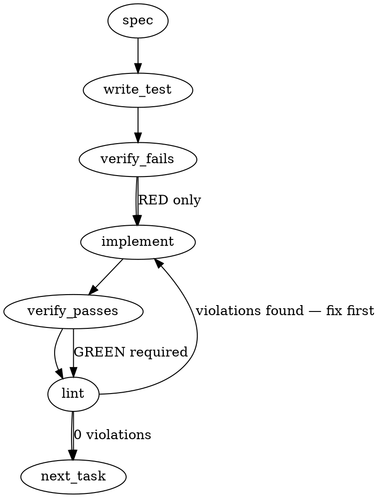

### Problem Statement

The `LazyEmbedder` gracefully degrades to local Ollama when cloud SDKs (e.g., `@google/genai`) are missing, but consumers perceive its terminal failure state—when Ollama is also absent—as an opaque crash, prompting them to manually install cloud SDKs and violate vendor agnosticism. We must surface Ollama as the expected baseline via `totem doctor` diagnostics and permanently lock the fallback error contract (`TotemConfigError` with `CONFIG_MISSING`) via a strict empirical regression test.

### Architectural Context

This aligns directly with **Tenet 16 — Model-Stack Agnosticism**. The architecture successfully avoids vendor-coupling natively, but the _discoverability gap_ creates consumer-side workarounds (manually installing `@google/genai`). No relevant specific `add_lesson` artifacts were found in the context for this issue, but the overarching theme is proactive graceful degradation.

### Files to Examine

1. `packages/core/src/embedders/embedder.ts` — contains the `LazyEmbedder` implementation and its `initPromise` resolution logic.
2. `packages/cli/src/commands/doctor.ts` — contains the `checkOllama` diagnostic check which needs to proactively surface the floor expectation message.

### Technical Approach & Contracts

**1. Doctor Diagnostic Update:**
Modify the `checkOllama` diagnostic in `totem doctor` to unconditionally check Ollama availability (even if a cloud provider is configured) and append explicit UX messaging when Ollama is not found:

- _Message Contract:_ "Totem can use a cloud embedder (Gemini, OpenAI) or fall back to local Ollama. Ollama is the recommended floor — no API key, no quota, runs locally. Detected: [yes/no]. Install: https://ollama.com."

**2. Empirical Fallback Lock (Regression Test):**
Implement a test scenario that forces the `LazyEmbedder` into its terminal fallback state.

- _Test Contract:_ Mock the dynamic import of `@google/genai` to reject (simulating absent peer dependency) and mock `isOllamaAvailable` to return `false`.
- _Error Contract:_ Await `embedder.embed(...)`. Catch the error and assert it is a `TotemConfigError` satisfying:
  ```typescript
  expect(err.code).toBe('CONFIG_MISSING');
  expect(err.message).toMatch(/No embedding provider available/);
  expect(err.hint).toMatch(/1\..*@google\/genai/);
  expect(err.hint).toMatch(/2\..*Ollama/);
  expect(err.hint).toMatch(/3\..*provider:\s*'ollama'/);
  ```

### Edge Cases & Traps

- **Lazy Initialization Trap:** `LazyEmbedder` resolves its provider asynchronously in `initPromise` on the _first_ call to `embed()`. The test must not expect the constructor to throw; it must await an `embed()` operation to trigger the terminal state.
- **Module Mocking Leakage:** Dynamically mocked imports for `@google/genai` must be correctly isolated using `vi.mock()` or `jest.resetModules()` to avoid polluting other test suites that expect the provider to exist.
- **Conditional Doctor Checks:** Ensure the updated `checkOllama` logic in `doctor.ts` executes _regardless_ of the configured provider. If it is currently gated behind `config?.embedding?.provider === 'ollama'`, that gate must be removed so it surfaces diagnostically for cloud users too.

### Implementation Tasks

- [ ] **Task 1: Update `totem doctor` Ollama-as-floor messaging**
  - Files to modify: `packages/cli/src/commands/doctor.ts`
  - Test files to update: `packages/cli/src/commands/doctor.test.ts` (or equivalent diagnostic test file).
    > TEST DIRECTIVE: Before implementing, write a failing test named `surfaces Ollama floor recommendation regardless of configured provider` that asserts the specific floor messaging is present in the diagnostic result when `isOllamaAvailable` is false.
  - Modify `checkOllama` to evaluate `isOllamaAvailable` and attach the proactive "Ollama is the recommended floor..." string to the diagnostic output, removing any early returns that bypass it when `provider === 'gemini'` or `openai`.
  - write test → verify fails → implement → verify passes → lint

- [ ] **Task 2: Lock LazyEmbedder terminal fallback chain contract**
  - Files to modify: (Test only) `packages/core/src/embedders/embedder.test.ts`
    > TEST DIRECTIVE: Before implementing, write a failing test named `throws TotemConfigError with 3-step remediation when cloud SDK and Ollama are both unavailable`.
  - In the test, properly mock `@google/genai` to throw `MODULE_NOT_FOUND` and mock `isOllamaAvailable` (from `@mmnto/totem` or internal utility) to return `false`.
  - Instantiate `LazyEmbedder` with `provider: 'gemini'`.
  - Await `.embed(['test'])` and catch the error.
  - Assert the error is an instance of `TotemConfigError`, `.code` is `CONFIG_MISSING`, `.message` contains "No embedding provider available", and `.hint` explicitly contains the 3 numbered remediation steps.
  - If the existing implementation in `embedder.ts` fails to construct the error correctly (e.g., missing code or hint fields), implement the exact contract in `embedder.ts` to satisfy the test.
  - write test → verify fails → implement → verify passes → lint

### Execution Flow (structural constraint)



### Verification (MANDATORY — do not skip)

Every implementation MUST end with these steps:

1. `totem lint` — deterministic rule check (zero LLM, ~2s). Fixes any violations.
2. `totem review` — AI-powered architectural review (~18s). Addresses any critical findings.
3. If using MCP, call `verify_execution` to confirm compliance before declaring the task done.

### Test Plan

- **Doctor Output Scenario:** Run `totem doctor` in an environment without Ollama running. Verify the output contains "Ollama is the recommended floor — no API key, no quota, runs locally. Detected: no. Install: https://ollama.com."
- **Terminal Fallback Mock Scenario:** Run the `LazyEmbedder` regression suite. Confirm the fallback test intercepts the `embed()` call, encounters the mocked missing `@google/genai`, falls back to the mocked missing Ollama, and ultimately throws the tightly structured `CONFIG_MISSING` `TotemConfigError`. Ensure no other tests break due to module mock leakage.
