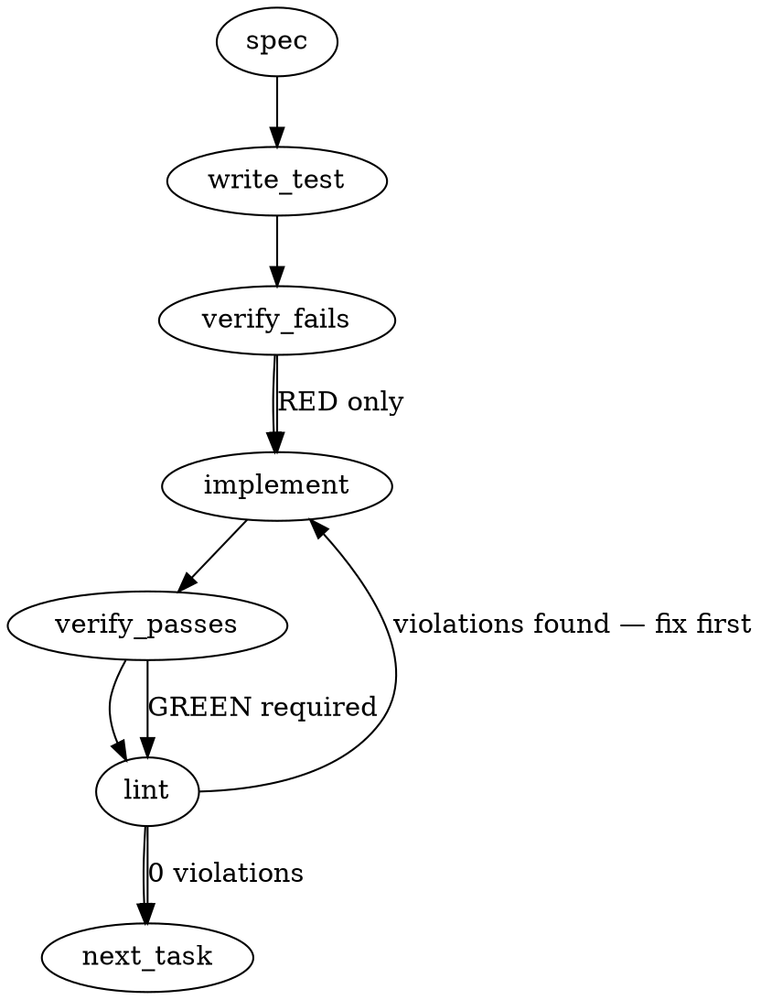

### Problem Statement

The `compile --export` command inconsistently drops rules with `status: "archived"` from the compiled lessons markdown digest (`.claude/docs/totem-compiled-lessons.md`). The fix requires including archived rules unconditionally in the export to preserve their prose for LLM agent context, while stripping their `pattern` and `example` fields to prevent them from triggering false-positive matches in the agent's context window.

### Architectural Context

- **Lint vs. Context Boundary:** The `loadCompiledRules` function actively filters archived rules so they don't fire during `totem lint`. However, the export digest serves a different purpose: it is the LLM's knowledge surface. Archiving a rule implies the zero-LLM regex is too noisy, but the underlying architectural prose remains valid and necessary for the agent.
- **State Mutation Asymmetry (Symptom A vs B):** The bug exhibits order-of-execution variance during the `compile` loop (Symptom A) and deterministic filtering on re-runs (Symptom B). This points to an architectural trap where the export list is either being populated using a filtered getter (`loadCompiledRules`) on re-runs, and mutating state out-of-sync during the first run.

### Files to Examine

1. `packages/cli/src/commands/compile.ts` — Orchestrates the compile loop and invokes the export. Likely contains the filter or passes a filtered list to the export function.
2. `packages/core/src/export.ts` (or equivalent file exporting `exportLessons`) — Contains the Markdown template generation where we need to format archived rules safely.
3. `packages/core/src/compile-lesson.ts` — Contains `applyStage4`, useful for understanding how `status` and `archivedReason` mutate during the compilation loop.

### Technical Approach & Contracts

To satisfy the "lint-clean export" constraint while preserving agent context, we will adopt the **Alternative** approach suggested in the issue: keep the rule prose in the digest, but strip the pattern/example fields.

**Step 1: Eliminate the Filter Asymmetry**
Currently, `compileCommand` (or the underlying load mechanism) drops archived rules before passing them to `exportLessons`. This causes Symptom B (drop on re-export). Symptom A occurs because rules auto-archived _late_ in the compilation loop are dropped, but rules archived _early_ are kept—likely because the array being exported is populated or filtered inconsistently as `applyStage4` mutates the rules in place.
We will modify the data retrieval so `exportLessons` receives the _unfiltered_ array of all rules directly from the final state of `compiled-rules.json` (or the fully resolved memory state after all compile loops finish).

**Step 2: Modify `exportLessons` Formatting Contract**
Update the Markdown generator inside `exportLessons` to handle `CompiledRule` objects where `status === 'archived'`.

- Add an archival annotation to the rule's header: `### [Rule Title] *(Archived: {archivedReason})*`.
- Conditionally omit the rendering of the `pattern`, `antiPattern`, and `example` blocks if `status === 'archived'`.
- Always render the `lesson` prose.

### Edge Cases & Traps

- **Agent Context Pollution (Lint Trap):** If you include the `pattern` for an archived rule, the agent reading the markdown might trigger its own internal linting or misinterpret the pattern as active. The `pattern` block **must** be stripped for archived rules.
- **Accidental Re-activation:** Ensure that modifying the export array does not accidentally leak archived rules back into the active `lint` engine. The `loadCompiledRules` filter must remain intact for linting; only the _export_ payload should bypass the filter.
- **Missing `archivedReason`:** The schema for `CompiledRule` might have `archivedReason` as optional. The formatter must gracefully fallback to `*(Archived)*` if the reason is undefined or empty.

### Implementation Tasks

- [ ] **Task 1: Unify Rule Retrieval for Export**
      Modify the `compileCommand` (and any other callers of `exportLessons` like `lessonArchiveCommand`) to ensure the array passed to `exportLessons` contains all rules, explicitly bypassing any `status !== 'archived'` filters.
  - Inspect `packages/cli/src/commands/compile.ts` to see how rules are gathered for `--export`.
  - Ensure the rules passed to `exportLessons` represent the final post-mutation state of all rules.
    > TEST DIRECTIVE: Before implementing, write a failing test named `compile export includes both active and archived rules` that mocks a state with mixed rules and asserts the export function is called with the full unfiltered array.
    > write test → verify fails → implement → verify passes → lint

- [ ] **Task 2: Format Archived Rules in Markdown Generation**
      Update the Markdown template logic inside `exportLessons` (likely in `packages/core/src/export.ts` or similar).
  - Add logic: `if (rule.status === 'archived')`.
  - Modify the title output to include `*(Archived: ${rule.archivedReason ?? 'No reason provided'})*`.
  - Wrap the rendering of code blocks (`pattern`, `antiPattern`, `example`) in a check so they are omitted for archived rules.
  - Keep the lesson prose rendering intact.
    > TEST DIRECTIVE: Before implementing, write a failing test named `exportLessons formats archived rules without pattern blocks` that passes an archived rule to the formatter and asserts the output contains the archival reason but does NOT contain the regex pattern string.
    > write test → verify fails → implement → verify passes → lint

- [ ] **Task 3: Integration Validation**
      Create an integration test or update existing tests for `totem lesson compile --export` to verify both Symptom A and Symptom B are resolved.
  - Simulate a run where a rule transitions to Stage-4 archived during the loop. Assert it appears in the final output markdown (Symptom A fixed).
  - Simulate a re-run with no compilation changes (reading directly from memory). Assert the archived rule remains in the final markdown (Symptom B fixed).
    write test → verify fails → implement → verify passes → lint

### Execution Flow (structural constraint)

### Verification (MANDATORY — do not skip)

Every implementation MUST end with these steps:

1. `totem lint` — deterministic rule check (zero LLM, ~2s). Fixes any violations.
2. `totem review` — AI-powered architectural review (~18s). Addresses any critical findings.
3. If using MCP, call `verify_execution` to confirm compliance before declaring the task done.

### Test Plan

- **Markdown Generation Test:** Unit test `exportLessons` directly with an array containing one active rule and one archived rule. Verify the active rule has pattern blocks, the archived rule has the `*(Archived...)*` header and NO pattern blocks, and both have their lesson prose.
- **Export Filter Test:** Unit test the `compileCommand` `--export` flag logic to ensure it pulls all rules (e.g., bypassing `loadCompiledRules`'s default filter if it uses it, perhaps by passing a `includeArchived: true` flag or reading the raw JSON).
- **Idempotency Test:** Verify that running `compile --export` twice in a row on the exact same `compiled-rules.json` file produces the exact same `.claude/docs/totem-compiled-lessons.md` file, with archived rules present both times.

---

## Implementation Design

### Scope (2 sentences)

This implementation will remove the `archived`-status filter from the `compile --export` path so Stage-4-archived lessons appear in the agent-facing digest at `.claude/docs/totem-compiled-lessons.md`, eliminating both Symptom A and Symptom B in one change. It will NOT touch the `untested-against-codebase` filter (per OQ 1 below), will NOT change the lint-time `loadCompiledRules` filter, will NOT introduce a new export-rendering branch for archived rules (the current bullet format already omits pattern/example), and will NOT touch `lessonArchiveCommand`'s parallel filter at `lesson.ts:115-130` (will leave that for a follow-up PR once design is locked).

### Data model deltas

**No new types. No schema changes. No new state containers.**

The existing surfaces:

- `CompiledRule.status: 'active' | 'archived' | 'untested-against-codebase' | 'pending-verification'` — schema unchanged
- `CompiledRule.archivedReason?: string` — already optional, will be referenced in the optional `(archived: <reason>)` suffix (OQ 2)
- `ParsedLesson` (from `drift-detector.ts`) — unchanged. The export-time array is `lessons: ParsedLesson[]`; format is one-line bullets via `formatLessonsAsMarkdown`.

**Existing collision hazard surfaced during review:** the export filter currently treats `archived` and `untested-against-codebase` as equivalent via `r.status === 'archived' || r.status === 'untested-against-codebase'`. This implementation will split that predicate. The two states have different semantics:

- `archived` — pattern was wrong/over-broad (Stage 4 false-positive sink, or human curation). Lesson prose is still valid guidance.
- `untested-against-codebase` — Stage 4 saw zero hits in the baseline; rule behavior is unverified. Per CR mmnto-ai/totem#1757 R2, including this in agent context risks the agent relying on unproven guidance.

### State lifecycle

No new state. The change is a single-predicate flip in `compile.ts:1791`. The lifecycle of `inertHashes`:

- **Scope:** function-local to `compileCommand`'s export phase
- **Lifetime:** built fresh from `loadCompiledRulesFile(rulesPath)` at the top of Phase 2, used once to filter `lessons`, discarded
- **Ownership:** `compileCommand` itself; no cross-function mutation

### Failure modes

| Failure                                                              | Category  | Agent-facing surface                                                                                                                               | Recovery                                                                                                |
| -------------------------------------------------------------------- | --------- | -------------------------------------------------------------------------------------------------------------------------------------------------- | ------------------------------------------------------------------------------------------------------- |
| `loadCompiledRulesFile` throws (corrupt JSON, missing file)          | runtime   | hard error via `TotemParseError`                                                                                                                   | unchanged — preflight validates before export phase                                                     |
| Export target path uncreatable (permission, disk full)               | runtime   | hard error via `fs.writeFileSync`                                                                                                                  | unchanged — bubble to caller                                                                            |
| Archived rule has missing `archivedReason`                           | runtime   | optional suffix omitted; rule still appears in digest                                                                                              | graceful — bullet text shows just heading + body                                                        |
| Lesson hash drifts between compile and export (Symptom A root cause) | latent    | with this fix: harmless (filter no longer applied to archived). Without the fix: archived lessons appear/disappear based on hash collision timing. | This PR sidesteps the drift bug; the drift itself remains a separate concern (filed as follow-up below) |
| `untested-against-codebase` rule's prose missing from digest         | by design | silent omission (continues current behavior)                                                                                                       | n/a — explicitly preserved per OQ 1                                                                     |

**Tenet 4 check:** no new silent degradation. The previous silent drop of archived rules from the digest IS the bug being fixed; this PR makes the export behavior loud (archived rules visible to operators in the digest).

### Invariants to lock in via tests

- **A1.** A rule with `status: 'archived'` MUST appear in the export digest. Its bullet contains the lesson heading and body verbatim from the source `.md`.
- **A2.** A rule with `status: 'untested-against-codebase'` MUST NOT appear in the export digest (existing behavior preserved).
- **A3.** A rule with `status: 'active'` (or unset) MUST appear in the export digest (existing behavior preserved).
- **A4.** Re-running `compile --export` over an already-archived rule produces an identical digest on each run (Symptom B regression-test — idempotent re-export with no state drift).
- **A5.** A rule archived during the same compile run as the export phase MUST appear in the resulting digest (Symptom A regression-test — first-run archival included regardless of hash-drift behavior).
- **A6.** If `archivedReason` is set on an archived rule, it MAY surface in the bullet's rendered text per OQ 2. If unset, the bullet renders as a plain active-shaped entry.

### Open questions

- **OQ 1: Should we also remove the `untested-against-codebase` filter, or keep it scoped to `archived` only?**
  - Options:
    - (a) Remove only the `archived` portion of the filter. Stage 4 zero-hit rules stay suppressed (preserves CR mmnto-ai/totem#1757 R2 rationale).
    - (b) Remove both filters. Operator sees everything in `compiled-rules.json`.
    - (c) Add a config flag (`exports[*].includeInert`) to make this a per-target choice.
  - **Recommendation: (a).** The lc-Claude argument in `upstream-feedback/074` specifically targets _archived_ rules ("the archival is about pattern-matching false positives, not lesson-prose invalidity"). It does NOT extend to `untested-against-codebase`, where the rule has never been validated against a real codebase — the prose may still describe a real risk, but Stage 4 produces zero supporting evidence. Keeping the untested filter respects the existing CR rationale and minimizes blast radius.

- **OQ 2: Should archived bullets carry a visible annotation like `(archived: <reason>)`?**
  - Options:
    - (a) No annotation. Archived bullets are indistinguishable from active ones in the digest. Simplest change; matches what lc-Claude described as the minimum acceptable fix.
    - (b) Inline suffix on the bullet: `- **Heading** - Body _(archived: <reason>)_`. Visible to agents; lets them down-weight if they choose.
    - (c) Render archived bullets in a separate `## Archived Guidance` section beneath the active list. Maximum clarity, biggest schema delta.
  - **Recommendation: (b).** The export format already uses `_(tag1, tag2)_` italic suffixes for lesson tags (see `exporter.ts:32-33`). Adding `_(archived: reason)_` reuses the same convention, is two lines of formatter change, and gives agents a signal without restructuring the digest. (a) is too quiet (Tenet 4 spirit — be loud); (c) is over-engineered for this PR.

- **OQ 3: Symptom A's hash-drift bug — fix here or file separately?**
  - Context: when archived rules are kept in the export (this PR), Symptom A becomes unobservable because nothing is being filtered by hash. But the underlying hash-drift remains — the same drift could silently mis-filter the `untested-against-codebase` rules we DO want to keep filtered (per OQ 1 recommendation).
  - Options:
    - (a) File as new Tier-3 follow-up ticket; this PR closes #1873 by sidestepping the bug.
    - (b) Investigate and fix in this PR. Likely root cause: lesson body trim/normalize between `readAllLessons` and `hashLesson` at compile-time vs export-time.
  - **Recommendation: (a).** Scope-creep risk. The drift bug deserves its own narrow PR with a focused regression test. This PR's scope is the export-filter semantics fix.

- **OQ 4: `lessonArchiveCommand` (`lesson.ts:115-130`) has the same archive-filter. Update in this PR or follow-up?**
  - Context: when an operator runs `totem lesson archive <hash>`, the command regenerates exports using the same filter pattern (lines 122-128: `archivedHashes.size === 0 ? lessons : lessons.filter(...)`). If we change `compile --export` semantics, `lesson archive` must match or the two commands produce drifting digests.
  - Options:
    - (a) Update both in this PR (consistency at a low cost — ~5 lines).
    - (b) Update `lesson archive` in a follow-up PR.
  - **Recommendation: (a).** The two filters are mirror surfaces with shared rationale (cited in code comments referencing each other). Keeping them in lockstep is cheap and avoids a "PR-N changed compile but lesson archive still drops archived rules" reviewer finding.

### Plan summary (assuming user approves recommendations)

1. **`compile.ts:1789-1797`** — Change the filter predicate: keep `r.status === 'untested-against-codebase'` in `inertHashes`, drop the `r.status === 'archived'` half. Update the surrounding comment block citing mmnto-ai/totem#1873 + the design distinction.
2. **`lesson.ts:115-130`** — Apply the symmetric change so `totem lesson archive` no longer scrubs the newly-archived rule from the regenerated export.
3. **`exporter.ts:formatLessonsAsMarkdown`** — If OQ 2 = (b), accept an optional `archivedHashes: Set<string>` second param so the formatter can render `_(archived: <reason>)_` suffix. Callers in `compile.ts` and `lesson.ts` pass it.
4. **Tests** —
   - `compile-export-archive-filter.test.ts`: invert the existing `archived` test (A1); keep the `untested-against-codebase` test (A2); keep the no-op test (A3).
   - Add **A4** (Symptom B regression — idempotent re-export).
   - Add **A5** (Symptom A regression — same-run archival reaches digest).
   - Add **A6** if OQ 2 = (b) — annotation rendering check.
5. **Changeset** — patch bump (`@mmnto/totem`), routes to `packages/cli/CHANGELOG.md` since the change is in the CLI export path (lesson learned from #1869 R1: changeset frontmatter routes the entry; CLI changes belong in CLI changelog).
6. **Filings** — open Tier-3 follow-up for OQ 3 hash-drift bug.
