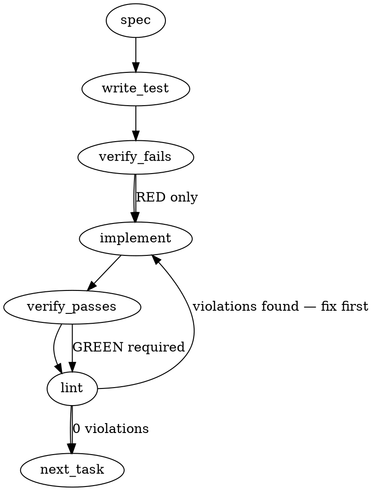

### Problem Statement

The `totem doctor` command needs a `--strict` mode that strictly enforces repo-state checks (like `checkAgentsMdCanonical` from #1907) by exiting with code 1 upon failure. This strict validation must be wired into three execution surfaces: local manual runs, the automated `pre-push` git hook, and a dedicated GitHub Actions CI workflow to ensure repo-state compliance builds on the Proposal 273 two-axis framework (environment vs. strictness).

### Architectural Context

- **Enforcement Model (No LLM in Git Hooks):** The pre-push hook must remain stateless, entirely air-gapped, and execute with zero LLM calls. `doctor --strict` must rely solely on deterministic checks (like `checkAgentsMdCanonical`).
- **Two-Axis Framework (Proposal 273):** Diagnostics now span two axes: Execution Environment (Local vs CI/Hook) and Severity (Standard vs Strict). Strict mode forces standard warnings to become blocking errors.

### Files to Examine

1. `packages/cli/src/commands/doctor.ts` — Requires updating the `DoctorOptions` interface and command implementation to respect `--strict` and map failures to exit code 1.
2. `packages/cli/src/commands/install-hooks.ts` — Contains `buildPrePushHook`; needs modification to run `totem doctor --strict` when the hook tier is strict.
3. `packages/cli/src/diagnostics/checkAgentsMdCanonical.ts` (or equivalent #1907 file) — The diagnostic provider that needs to be registered into the `doctorCommand` pipeline.
4. `.github/workflows/totem-repo-state.yml` (To be created) — The CI surface for the third sub-surface.

### Technical Approach & Contracts

1. **Contract Update (`DoctorOptions`):**

   ```typescript
   export interface DoctorOptions {
     strict?: boolean;
     // existing options...
   }

   export interface DiagnosticResult {
     name: string;
     status: 'pass' | 'fail' | 'warn';
     message: string;
     // strict mode forces 'warn' -> 'fail' for certain checks
   }
   ```

2. **CLI Modification:** Update the `doctorCommand` in `doctor.ts` to accept the `--strict` argument. When `--strict` is enabled, loop through the `DiagnosticResult[]`. If any result is `fail` (or a `warn` promoted to `fail` by strict mode), ensure the process exits with `1`.
3. **Consumer Wiring:** Inject `checkAgentsMdCanonical()` into the `doctorCommand` diagnostic pipeline.
4. **Hook Integration:** In `buildPrePushHook`, inject `totem doctor --strict` alongside `totem lint` and `totem verify-manifest` to ensure state changes are caught locally before push.
5. **CI Workflow:** Implement a GitHub Actions workflow that executes `totem doctor --strict` on `pull_request` and `push` to `main`.

### Edge Cases & Traps

- **Process Exit Masking:** If `doctor` is called programmatically, calling `process.exit(1)` directly might kill the parent CLI process unexpectedly before cleanup. Use standard Totem CLI error-throwing conventions (e.g., returning an exit code to the CLI entry point or throwing a specific `TotemDiagnosticError`).
- **Execution Outside a Repo:** The doctor command runs repo-state checks. If run outside a git repository, `checkAgentsMdCanonical` might fail cryptically. Ensure `resolveGitRoot(process.cwd())` is used to validate repo context before running checks.
- **Air-Gapped Compliance:** Ensure `checkAgentsMdCanonical` absolutely makes no network/LLM calls. If it does, the pre-push hook will hang or fail for offline developers.

### Implementation Tasks

- [ ] **Task 1: Update Doctor Contracts and CLI Flags**
      Update `packages/cli/src/commands/doctor.ts` (and corresponding CLI entry point) to accept the `--strict` boolean flag.

  > TEST DIRECTIVE: Before implementing, write a failing test named `parses strict flag and surfaces it in DoctorOptions` that proves the CLI layer correctly delegates the flag.
  - Modify `DoctorOptions` to include `strict?: boolean`.
  - Update the command parser (e.g., Commander or yargs setup) to recognize `--strict`.
  - write test (or update existing) → verify fails → implement → verify passes → lint

- [ ] **Task 2: Wire checkAgentsMdCanonical into Doctor Pipeline**
      Update `packages/cli/src/commands/doctor.ts` to execute `checkAgentsMdCanonical` as part of the diagnostic suite.

  > TOTEM INVARIANT (Enforcement Model): Diagnostics run via doctor in strict mode must be stateless and zero-LLM to support air-gapped git hook execution.
  > TEST DIRECTIVE: Before implementing, write a failing test named `doctorCommand fails execution with code 1 when strict mode is active and checkAgentsMdCanonical fails` that proves strict enforcement blocks bad state.
  - Use `resolveGitRoot(cwd)` to ensure the command is running in a valid repository; if null, exit gracefully or bypass repo-state checks.
  - Execute `checkAgentsMdCanonical`.
  - Map its output to `DiagnosticResult`. If `--strict` is true and the check fails, throw an error or return an aggregate failure status that results in `process.exit(1)` at the CLI edge.
  - write test (or update existing) → verify fails → implement → verify passes → lint

- [ ] **Task 3: Integrate into Pre-Push Hook**
      Modify `buildPrePushHook` in `packages/cli/src/commands/install-hooks.ts`.

  > TEST DIRECTIVE: Before implementing, write a failing test named `buildPrePushHook injects doctor strict command when tier is strict` that proves the hook generation includes the new command.
  - Locate the `if [ "$is_agent" = "1" ] || [ "$TOTEM_HOOK_TIER" = "strict" ]; then` block.
  - Append `npx totem doctor --strict` (or equivalent localized binary execution) alongside the existing `totem verify-manifest` and `totem lint` calls.
  - write test (or update existing) → verify fails → implement → verify passes → lint

- [ ] **Task 4: Create CI Workflow for Repo-State Checks**
      Create `.github/workflows/totem-repo-state.yml`.
  - Define a standard GitHub Actions workflow triggered on `push` to main and `pull_request`.
  - Checkout the code.
  - Install dependencies.
  - Run `npx totem doctor --strict` (or the equivalent package manager execution).
  - No TDD required for YAML structure, but validate syntax locally.
  - implement → verify passes → lint

### Execution Flow (structural constraint)



### Verification (MANDATORY — do not skip)

Every implementation MUST end with these steps:

1. `totem lint` — deterministic rule check (zero LLM, ~2s). Fixes any violations.
2. `totem review` — AI-powered architectural review (~18s). Addresses any critical findings.
3. If using MCP, call `verify_execution` to confirm compliance before declaring the task done.

### Test Plan

1. **Unit Tests:** Execute `doctor --strict` against a mock file system where `agents.md` is non-canonical. Assert it throws or returns an error state mapped to exit code 1.
2. **Unit Tests:** Execute `doctor` (no strict flag) against the same mock file system. Assert it returns a warning but exits with code 0.
3. **Hook Tests:** Generate the pre-push hook script using `install-hooks` and assert string presence of `doctor --strict`.
4. **Integration Test (Manual/Local):** Disconnect internet, run `totem doctor --strict`. Ensure it passes/fails instantly based on local state without timing out on network requests.

## Implementation Design

### Scope (2 sentences)

Ship `totem doctor --strict` (exit non-zero on any `fail` diagnostic) plus opt-in pre-push hook wiring (strict-tier gated, mirroring the existing `totem review` shieldBlock pattern at `install-hooks.ts:308-313`) plus a `.github/workflows/totem-doctor.yml` cohort-consumable template.

**Out of scope:** per-check `severity` field (issue body's open question — defer until calibration data exists); promoting `warn` results to `fail` under `--strict`; `doctrine/bot-protocols.md` documentation update (cross-repo to `mmnto-ai/totem-strategy`, separate PR); per-repo enrollment policy decisions (per #1908 § Out of scope).

### Data model deltas

| Type / surface                                       | Delta                                                                                                                    | Writer                                            | Reader                    | Invariant                                                                                                                                       |
| ---------------------------------------------------- | ------------------------------------------------------------------------------------------------------------------------ | ------------------------------------------------- | ------------------------- | ----------------------------------------------------------------------------------------------------------------------------------------------- |
| `DoctorOptions` interface (`doctor.ts:~165`)         | Add `strict?: boolean`                                                                                                   | CLI flag parser (commander)                       | `doctorCommand` exit path | Optional, defaults to `false` (preserves existing informational behavior)                                                                       |
| `doctorCommand` return                               | Unchanged (still `Promise<DiagnosticResult[]>`)                                                                          | —                                                 | —                         | The exit-code semantics live at the CLI entry point, NOT inside `doctorCommand` itself (avoid process-exit-masking trap from spec § Edge Cases) |
| CLI entry point (`packages/cli/src/index.ts`)        | New: `if (options.strict && results.some(r => r.status === 'fail')) process.exitCode = 1;` after `doctorCommand` returns | CLI runner                                        | OS / shell                | `process.exitCode` set, not `process.exit()` — lets the natural event loop drain                                                                |
| `buildPrePushHook` template (`install-hooks.ts:306`) | Inject `$TOTEM_CMD doctor --strict \|\| exit 1` inside the existing strict-tier `shieldBlock`                            | `generateHookHelpers` / `installEnforcementHooks` | shell at push time        | Must be inside the `is_agent OR TOTEM_HOOK_TIER=strict` guard (calibration period)                                                              |
| `.github/workflows/totem-doctor.yml`                 | New file                                                                                                                 | this PR                                           | GitHub Actions runner     | Standalone workflow; mirrors `lint.yml` shape; checkout → setup pnpm + node → install → build → `totem doctor --strict`                         |

**No new state containers, sets, or module-level variables.** The exit-code decision is computed from in-memory `DiagnosticResult[]` at the CLI edge — no persistence, no caching.

**No reserved keys / sentinels.** `strict: boolean` is its own field, not a magic value on an existing field.

### State lifecycle

- **`DoctorOptions.strict`** — per-invocation; lives only inside one CLI command run; created when commander parses argv, mutated never, destroyed at process exit.
- **`process.exitCode`** — process-lifetime; written once after diagnostic loop, read by OS at process termination. Setting `exitCode` instead of calling `process.exit()` avoids killing in-flight async cleanup (e.g., the optional `--pr` self-healing path at `doctor.ts:113`).
- **Pre-push hook shell variables** (`$TOTEM_HOOK_TIER`, `$is_agent`, `$TOTEM_CMD`) — already exist; this PR adds one more conditional command inside them, no new lifecycle.

No state crosses lifecycle boundaries.

### Failure modes

| Failure                                                                  | Category                           | Agent-facing surface                                                                                                                                | Recovery                                                       |
| ------------------------------------------------------------------------ | ---------------------------------- | --------------------------------------------------------------------------------------------------------------------------------------------------- | -------------------------------------------------------------- |
| `--strict` passed, all checks `pass`                                     | runtime (success path)             | exit 0 + formatted summary on stderr                                                                                                                | n/a                                                            |
| `--strict` passed, ≥1 check is `fail`                                    | runtime (gating fire)              | exit 1 + formatted summary + remediation hints                                                                                                      | operator fixes failed check, re-runs                           |
| `--strict` passed, all `warn` (no `fail`)                                | runtime (warns are not gating)     | exit 0 + warnings shown                                                                                                                             | n/a — by design, `warn` ≠ `fail`                               |
| `--strict` passed outside a git repo                                     | init (resolveGitRoot returns null) | individual checks return `skip` / `fail` per their own contract; aggregate exit follows the rule above                                              | matches existing `totem doctor` behavior — no new failure path |
| Pre-push hook fires `doctor --strict` and a check fails                  | runtime                            | hook exits 1, push blocked, doctor output printed                                                                                                   | operator fixes or `--no-verify` (last resort)                  |
| `$TOTEM_CMD` empty inside hook (totem not on PATH and no `package.json`) | init                               | hook prints `[Totem] totem not found...` and continues without doctor — preserves existing `buildResolveBlock` behavior at `install-hooks.ts:54-58` | install totem or run `totem init`                              |
| CI workflow runs `doctor --strict` and a check fails                     | runtime                            | workflow step exits non-zero → required-status-check blocks merge                                                                                   | author addresses the failing check                             |
| CI workflow on a repo without `.totem/` config                           | init                               | `checkConfig` returns `fail` → workflow exits 1; correct because repo isn't initialized                                                             | run `totem init`                                               |

**No silent-degradation rows.** Every path either succeeds, exits non-zero with a remediation pointer, or matches existing pre-`--strict` behavior. Tenet 4 compliant.

### Invariants to lock in via tests

1. **`--strict` with zero `fail` results exits 0** — even if `warn` results exist (warns are non-gating by design).
2. **`--strict` with ≥1 `fail` result sets `process.exitCode = 1`** — using `process.exitCode`, not `process.exit()` (verify via spy that `process.exit` is NOT called during normal path).
3. **Default mode (no `--strict`) exits 0 regardless of fail count** — preserves current advisory behavior; existing callers / docs unchanged.
4. **`buildPrePushHook` with `tier: 'strict'` emits `doctor --strict` inside the agent/strict guard** — string-presence assertion; the line must be inside the `if [ "$is_agent" = "1" ] || [ "$TOTEM_HOOK_TIER" = "strict" ]` block, not outside.
5. **`buildPrePushHook` with `tier: 'standard'` (or omitted) does NOT emit `doctor --strict` unconditionally** — the line is gated; standard-tier users get unchanged behavior.
6. **GitHub Actions workflow YAML is syntactically valid** — `actionlint` (or equivalent) clean; smoke-test via local YAML parse.
7. **CLI flag `--strict` is wired through commander** — `totem doctor --strict` parses to `DoctorOptions { strict: true }`; bare `totem doctor` parses to `DoctorOptions { strict: false | undefined }`.
8. **`process.exit(1)` is not called inside `doctorCommand`** — the function returns the results array; exit-code decisions live at the CLI edge.

### Open questions

- **Question:** Should `--strict` promote `warn` to gating, or only act on `fail`?
  - **Options:**
    - **(A)** Only `fail` gates. Keeps the semantic clean: `warn` = informational, `fail` = bug. (Recommended)
    - **(B)** All `warn`+`fail` gate under `--strict`. Stricter but conflates env-dependent warns (Ollama not running) with real bugs.
    - **(C)** Per-check `severity` / `strictByDefault` field. Most flexible; out of scope for v1 per spec.
  - **Recommendation:** (A). Matches issue #1908's plain reading ("exits non-zero when any check returns status: FAIL"). Defer (C) to a follow-up once we have data on which warns SHOULD gate.

- **Question:** Should the pre-push hook fire `doctor --strict` unconditionally, or only in strict tier?
  - **Options:**
    - **(A)** Strict-tier only (`is_agent=1` OR `TOTEM_HOOK_TIER=strict`). Calibration-friendly; matches the existing `shieldBlock` pattern at `install-hooks.ts:308`. (Recommended)
    - **(B)** Unconditional, like `totem lint`. More aggressive; would fail for cohort consumers mid-migration.
  - **Recommendation:** (A). Per Proposal 273 § 6 Q2: "Operator-invoked is the default for new checks while behavior calibrates. Promote to auto-fired once empirical false-positive rate is acceptable."

- **Question:** Where does the CI workflow live — only in `mmnto-ai/totem` (template), or copied into each cohort repo?
  - **Options:**
    - **(A)** Author one workflow in `mmnto-ai/totem/.github/workflows/totem-doctor.yml` as the dogfood/template. Cohort consumers copy or reference. (Recommended; matches #1908 § Out of scope: "per-repo enrollment is a separate operational decision.")
    - **(B)** Composite GitHub Action published from `mmnto-ai/totem`. Cleaner consumer surface but requires publish + versioning machinery.
  - **Recommendation:** (A). Start with template; promote to composite action if cohort adoption justifies it.

- **Question:** Single PR or slice (flag → hook → CI)?
  - **Options:**
    - **(A)** Single PR — all three sub-surfaces ship together. Issue #1908 lists them as one deliverable; the surfaces share scaffolding. (Recommended)
    - **(B)** Three PRs — flag, then hook, then CI. Easier per-PR review but adds admin overhead.
  - **Recommendation:** (A). Scope is well-bounded (~5 files); the three sub-surfaces are tightly coupled (hook + CI both consume the flag). Splitting only helps if review surface explodes.

- **Question:** Should the `doctrine/bot-protocols.md` update happen this PR (cross-repo into `mmnto-ai/totem-strategy`) or be filed as a follow-up?
  - **Options:**
    - **(A)** Follow-up dispatch to strategy-Claude with the doctrine § proposal. This PR ships only `mmnto-ai/totem` changes. (Recommended)
    - **(B)** Cross-repo PR pair. More work; strategy-Claude owns the doctrine surface anyway.
  - **Recommendation:** (A). Matches established cohort-coordination pattern (substrate dispatch with "here's what landed, here's the doctrine surface implication").
