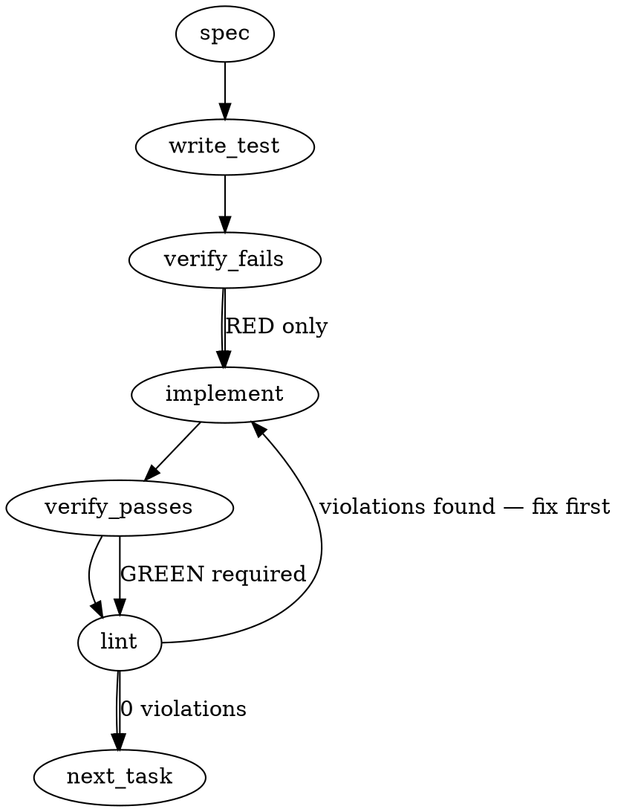

### Problem Statement

The system must mechanically verify `img.shields.io/badge/` URLs added to `README.md` during the pre-push hook phase. It must block or warn if the badge uses a niche/invented shape, claims support for a tool without a corresponding integration file in the repository, or circularly links a standard-claim badge to an internal document.

### Architectural Context

This feature implements Doctrine Tenet 15 (Axiom Mandate: encode rules as mechanism, not prose) and Tenet 19 (Claim Discipline: every claim names its falsifying metric), directly addressing the failure class from PRs #1923/#1925 where unverified badges were shipped. Existing pre-push hooks run stateless checks without LLM calls (`totem lint`, `totem verify-manifest`). This verification must also be stateless, fast, and deterministic.

### Files to Examine

1. `packages/cli/src/commands/install-hooks.ts` — Location of `buildPrePushHook`. We must inject our new check here.
2. `packages/core/src/rule-tester.ts` — Example of core domain logic executing deterministic validations without CLI layer pollution.
3. `packages/cli/src/commands/first-lint-promote-runner.ts` — Example CLI command implementation pattern to follow for the new `verify-badges` command.

### Technical Approach & Contracts

We will implement a standalone CLI command `totem verify-badges` invoked by the pre-push hook.

**Data Contracts:**

```typescript
import { z } from 'zod';

export const ToolIntegrationConfigSchema = z.record(
  z.string(), // Tool name (e.g., "claude")
  z.array(z.string()), // Allowed file paths (e.g., [".claude/", "CLAUDE.md"])
);

export const BadgeVerificationResultSchema = z.object({
  valid: z.boolean(),
  errors: z.array(z.string()),
  warnings: z.array(z.string()),
});

export type ToolIntegrationConfig = z.infer<typeof ToolIntegrationConfigSchema>;
export type BadgeVerificationResult = z.infer<typeof BadgeVerificationResultSchema>;
```

**Sequence Logic:**

1. **Diff Extraction:** Call `getGitDiff('all', cwd)`. Pass the output to `extractChangedFiles`. If `README.md` is not present, exit cleanly (0).
2. **Line Parsing:** Parse the diff payload specifically for lines starting with `+` in `README.md` that match `/https:\/\/img\.shields\.io\/badge\/[^)\s"]+/i`.
3. **Badge Decoding:** Decode the URL path (handling `_` as space, `%20`, etc.) to extract the label and message. Extract the surrounding markdown link `[](<link_target>)` if present.
4. **Verification A (Tool Claims):** Check the decoded text against a predefined `ToolIntegrationConfig`. If matched, check file existence via `fs.existsSync`.
5. **Verification B (Self-Reference):** If label matches standard claims (`AGENTS.md`, `MIT`, `Apache-2.0`) and the `<link_target>` includes internal paths (`mmnto-ai/*`, `./docs/adr`, etc.), flag as error/warning.
6. **Verification C (Shape Threshold):** Run `gh api "search/code?..."` via `safeExec`. Parse total count. Block if < 10.

**Trade-offs:**

- _Diff Context vs. Full File Parsing:_ Parsing only added lines from the diff regex is faster and isolates the hook to _new_ claims, but complex markdown structures (e.g., multiline link definitions) might be missed by simple regex. _Recommendation:_ Stick to line-by-line diff regex to maintain stateless pre-push speed. Warn loud, don't silently ignore if parsing is ambiguous.

### Edge Cases & Traps

- **GitHub API Rate Limits & Availability:** The `gh` CLI might not be installed, authenticated, or could hit aggressive search API rate limits. The mechanism MUST gracefully degrade to a loud warning rather than blocking the push entirely if `safeExec` throws an error or returns a 403.
- **URL Encoding Variability:** Shields.io URLs use specific encoding (e.g., `--` for `-`, `_` for space). The parser must decode these correctly before checking for tool names (e.g., `Claude--Cursor` means "Claude-Cursor").
- **Case Sensitivity:** Tool claims in badges might be "claude", "Claude", or "CLAUDE". Tool config keys must be normalized (lowercased) before matching.
- **Git Diff Helper Constraint:** The shared helper `getGitDiff` only supports `staged` or `all`. Since pre-push validates committed code, you must use `getGitDiff('all', cwd)` to approximate the working set changes, then isolate `README.md`.
- **Markdown Target Extraction:** Identifying the link target requires matching the outer markdown structure `[](target)`. Watch out for trailing punctuation.

### Implementation Tasks

- [ ] **Task 1: Define Contracts and Base Parser Utilities**
  - Create `packages/core/src/badge-verifier.ts`.
  - Implement the `ToolIntegrationConfigSchema` and `BadgeVerificationResultSchema`.
  - Implement a helper `extractBadgesFromDiff(diffText: string)` that extracts the badge URL, decoded label/message, and link target from `+` lines.
    > TEST DIRECTIVE: Before implementing, write a failing test named `extracts url, decoded text, and link target from complex multiline diffs` that proves shields.io URL encoding (`_`, `--`) is correctly handled.
  - write test → verify fails → implement → verify passes → lint

- [ ] **Task 2: Implement Tool/Library Claim Verification**
  - In `packages/core/src/badge-verifier.ts`, implement `verifyToolClaims(badges, config, repoRoot)`.
  - Iterate through badges. If the text contains known tools (case-insensitive), verify at least one specified path exists using `fs.existsSync(path.join(repoRoot, relativePath))`.
    > TOTEM INVARIANT (Claim Discipline): Every claim names its falsifying metric. The existence of the file is the falsifying metric for the badge claim.
  - write test → verify fails → implement → verify passes → lint

- [ ] **Task 3: Implement Self-Reference Link Detector**
  - Implement `verifySelfReferenceLinks(badges)` in `packages/core/src/badge-verifier.ts`.
  - Check if the badge text contains standard claims (`AGENTS.md`, `MIT`, `Apache-2.0`).
  - If so, check if the link target contains `mmnto-ai`, `totem`, or starts with `./docs/` or `./internal/`. If it does, push an error.
    > TEST DIRECTIVE: Before implementing, write a failing test named `rejects AGENTS.md badge pointing to internal ADR instead of canonical standard` that proves circular claim validation.
  - write test → verify fails → implement → verify passes → lint

- [ ] **Task 4: Implement Shape Threshold Verification via GitHub API**
  - Implement `verifyShapeUsage(badges)` in `packages/core/src/badge-verifier.ts`.
  - For each unique shape, construct the query: `gh api "search/code?q=\"<prefix>\"+in:file+filename:README.md" --jq ".total_count"`.
  - Execute using `safeExec`. Wrap in a `try/catch`. If `gh` is missing or fails (rate limit), append a warning to the result instead of an error.
  - If successful and `< 10`, append an error.
    > TEST DIRECTIVE: Before implementing, write a failing test named `gracefully degrades to a warning when gh api rate limits or is unauthenticated` that proves the pre-push hook won't hard-block developers without network/gh access.
  - write test → verify fails → implement → verify passes → lint

- [ ] **Task 5: Create CLI Command Interface**
  - Create `packages/cli/src/commands/verify-badges.ts`.
  - Wire the command to use `resolveGitRoot`, `getGitDiff('all', cwd)`, and `extractChangedFiles` (from shared helpers).
  - If `README.md` is in the changed files, extract the added lines, pass to the core verifications, and log results.
  - Exit with code 1 if `errors.length > 0`, otherwise exit 0.
  - write test → verify fails → implement → verify passes → lint

- [ ] **Task 6: Wire into Pre-Push Hook**
  - Modify `packages/cli/src/commands/install-hooks.ts`.
  - In `buildPrePushHook`, inject the execution of `totem verify-badges` alongside the existing `totem lint` and `totem verify-manifest` checks.
    > TOTEM INVARIANT (Axiom Mandate): Encode rules as mechanism, not prose. The pre-push hook must execute deterministically without bypass flags in the standard tier.
  - write test → verify fails → implement → verify passes → lint

### Execution Flow (structural constraint)



### Verification (MANDATORY — do not skip)

Every implementation MUST end with these steps:

1. `totem lint` — deterministic rule check (zero LLM, ~2s). Fixes any violations.
2. `totem review` — AI-powered architectural review (~18s). Addresses any critical findings.
3. If using MCP, call `verify_execution` to confirm compliance before declaring the task done.

### Test Plan

- **Diff Parser Tests:** Assert that `-` (removed) lines are ignored. Assert that badges without markdown links do not crash the parser. Assert shields.io URL encoding translations (`Claude--Cursor` -> `Claude-Cursor`).
- **Tool Claim Tests:** Mock `fs.existsSync` to return false. Provide a badge with `Claude · Cursor`. Assert the verifier returns 2 errors explicitly naming the missing integrations.
- **Self-Reference Tests:** Provide an `AGENTS.md` badge linked to `https://github.com/mmnto-ai/totem/blob/main/docs/ADR-038.md`. Assert verifier catches and flags it as a self-referential error.
- **Fallback Tests:** Mock `safeExec` to throw a command-not-found error for `gh`. Assert the verification completes, pushing a warning instead of a hard error. Check rate-limit JSON responses equally downgrade to warnings.

---

## Implementation Design

### Scope

This implementation will ship a pre-push deterministic verifier (`totem verify-badges`) for shields.io badges added to `README.md`, covering tool-claim file existence and self-reference link detection. It will NOT ship the gh-api shape-usage threshold check (Verification C in the spec) — that lands as a separate follow-on once tool-claim verification has empirical fire data on main.

### Data model deltas

| Surface                               | New                   | Holder                                | Reader                                                                    | Invariants                                                                                                                                                                                                                                    |
| ------------------------------------- | --------------------- | ------------------------------------- | ------------------------------------------------------------------------- | --------------------------------------------------------------------------------------------------------------------------------------------------------------------------------------------------------------------------------------------- |
| `ToolIntegrationConfigSchema` (Zod)   | new exported schema   | `packages/core/src/badge-verifier.ts` | `verify-badges` CLI + tests                                               | tool-name keys lowercased before lookup; values are non-empty arrays of repo-relative paths                                                                                                                                                   |
| `ToolIntegrationConfig` (TS type)     | inferred from Zod     | same                                  | same                                                                      | same                                                                                                                                                                                                                                          |
| `BadgeVerificationResultSchema` (Zod) | new exported schema   | same                                  | CLI exit-code logic + tests                                               | `valid === errors.length === 0`; warnings do not affect exit code                                                                                                                                                                             |
| `BadgeVerificationResult` (TS type)   | inferred from Zod     | same                                  | same                                                                      | same                                                                                                                                                                                                                                          |
| `DEFAULT_TOOL_INTEGRATIONS` (const)   | new exported const    | `packages/core/src/badge-verifier.ts` | `verify-badges` CLI when no override config                               | shape: `{ claude: ['.claude/', 'CLAUDE.md'], gemini: ['.gemini/', 'GEMINI.md'], cursor: ['.cursor/'], windsurf: ['.windsurfrules'], copilot: ['.github/copilot-instructions.md'] }` — sourced from `mmnto-ai/totem#1924`'s integration matrix |
| `Badge` (internal type, not exported) | new module-local type | `badge-verifier.ts`                   | `extractBadgesFromDiff` → `verifyToolClaims` + `verifySelfReferenceLinks` | `{ rawUrl, label, message, linkTarget?: string, sourceLine: number }`                                                                                                                                                                         |

No new persistent state. No new module-level mutable state. No reserved keys or sentinel values. The `DEFAULT_TOOL_INTEGRATIONS` const is read-only; CLI passes it (or an override) explicitly to verifier functions — no implicit global lookup.

### State lifecycle

This is a _stateless_ verifier — per ADR-083, no SHA-stamped flag files, no cache files. Every run recomputes from current diff. Inputs:

- Diff payload from `getGitDiff('all', cwd)` — per-invocation, transient.
- Repo root from `resolveGitRoot(cwd)` — per-invocation.
- Tool-integration config — module-static (read-only const) OR optional override passed by CLI.

Output: `BadgeVerificationResult`. CLI consumes synchronously and exits.

No state crosses an invocation boundary. No state crosses a lifecycle boundary inside a single run.

### Failure modes

| Failure                                                               | Category  | Agent-facing surface | Recovery                                                                                                         |
| --------------------------------------------------------------------- | --------- | -------------------- | ---------------------------------------------------------------------------------------------------------------- |
| `getGitDiff` throws (git not on PATH, not a repo)                     | runtime   | hard error, exit 1   | upstream — surfaces via `safeExec`'s existing error class; same shape as `lint`/`verify-manifest` failures today |
| `README.md` not in diff                                               | normal    | silent exit 0        | n/a; expected on most pushes                                                                                     |
| README diff has no shields.io badge lines                             | normal    | silent exit 0        | n/a; expected when README change is text-only                                                                    |
| Badge URL malformed (regex matches but decode fails)                  | runtime   | warning, exit 0      | the badge is preserved in output; verifier skips the malformed one and continues                                 |
| Tool claim matched, no integration file exists in repo                | runtime   | hard error, exit 1   | author must either (a) add the integration files OR (b) drop the tool from the badge                             |
| Self-reference link detected (e.g., `AGENTS.md` badge → internal ADR) | runtime   | hard error, exit 1   | author must point badge at canonical standard OR drop the badge                                                  |
| `ToolIntegrationConfig` Zod parse fails (override config invalid)     | init      | hard error, exit 1   | author fixes the config; verifier doesn't silently fall back to defaults                                         |
| `fs.existsSync` throws (permissions)                                  | transient | hard error, exit 1   | rare; same surface as other fs-touching CLI commands                                                             |

Every "silent" outcome is bounded to the "no badge claims were verified" case (no badges → nothing to check). There is no silent degradation on a _verified_ badge — every checked badge produces either pass, warning, or error.

### Invariants to lock in via tests

1. **Only added (`+`) lines from `README.md` enter verification.** Removed (`-`) lines and context lines are ignored. (Prevents verifier from flagging badges that are being _removed_ in the diff.)
2. **Tool-name matching is case-insensitive and shields.io-encoding-aware.** `Claude--Cursor` in the badge decodes to `Claude-Cursor`, and both `Claude` and `claude` match the `claude` key.
3. **Falsifying metric for a tool claim is at least one config-listed path existing.** For `claude`, presence of EITHER `.claude/` OR `CLAUDE.md` satisfies the claim; both missing fails.
4. **Self-reference detection fires when a standard-claim badge (`AGENTS.md`, `MIT`, `Apache-2.0`) links to internal repo paths.** Standard-claim badges must link to canonical upstream standards, not internal docs.
5. **`BadgeVerificationResult.valid` is equivalent to `errors.length === 0`.** Warnings do not affect `valid` or the CLI exit code.
6. **Pre-push hook injection is gated on `.totem/compiled-rules.json` existing** (same gate as the `lint` block in `buildPrePushHook`). Repos that haven't installed Totem pipelines don't fire badge verification.
7. **CLI exit code: 0 if `errors.length === 0`, 1 if `errors.length > 0`.** Warnings emit to stderr but don't affect exit.

### Open questions

1. **Should we ship Verification C (gh-api shape-threshold) in this PR or defer to a follow-on?**
   - _Options:_
     - **Defer** — ship A + B in this PR; file follow-on issue for C. Lower scope, faster catch loop, empirical signal on A+B before adding network-bound check. The known catalyst failure (#1925 R1) was a tool-claim — verification A would have caught it. Verification B catches #1925 R2 (`AGENTS.md` badge → internal ADR). The empirical anchor is 2/3 for A+B, 1/3 for C.
     - **Bundle** — ship A + B + C in one PR. Catches the `Tool-agnostic` shape-invention class natively; but introduces network dependency (gh-cli auth, rate limits) into pre-push.
   - **Recommendation: Defer.** A + B mechanizes the empirical-anchor majority. C is the right _shape_ but its risk surface (network, gh-cli auth, rate-limits → graceful-degrade) deserves its own PR description and its own test plan. Velocity: A+B is ~1 day; A+B+C is ~2 days. Splitting buys cleaner attribution if a regression appears.

2. **Should `verify-badges` be a standalone CLI command, or should it be a new `totem lint` rule?**
   - _Options:_
     - **Standalone command.** Matches spec. Simpler test surface. Wired explicitly into `buildPrePushHook`. Surface: `pnpm exec totem verify-badges`.
     - **`totem lint` rule.** Per Proposal 273 § 7 routing matrix, diff-shape + auto + local = `lint`. Fits the doctrinal taxonomy cleanly. But: `lint` rules are ast-grep or regex patterns on file content; this verification is structural (parse → decode → fs-check → optionally network-check). Doesn't fit the existing lint-rule shape without expanding the rule type system.
   - **Recommendation: Standalone command** for this PR, with a note in the PR description that this is the _first_ repo-aware diff-shape check that wasn't an ast-grep/regex pattern. If a class of these emerges, generalizing into a `lint` plugin slot is a separate doctrine question.

3. **Where does `DEFAULT_TOOL_INTEGRATIONS` source-of-truth live, and how does `mmnto-ai/totem#1924`'s integration work coordinate?**
   - _Options:_
     - **Hard-coded in `badge-verifier.ts`.** Simple. New tools require code change. But: this is THE list whose mismatch with badge claims is the failure class.
     - **Sourced from `totem.config.ts`.** User-extensible. But: most users don't add new tool integrations; the `totem` repo itself authoring the list is the load-bearing case.
     - **Hard-coded with override.** Default const lives in `badge-verifier.ts`; CLI accepts `--config <path>` for repos with custom integrations.
   - **Recommendation: Hard-coded with override.** Default covers the 5 tools named in `#1924`; override path supports user extension without re-implementing the verifier. Default-list updates ride alongside `#1924`'s integration work — same place tools get a real integration is the place they get added to the badge-verify default.

4. **Tier behavior: standard or strict-only?**
   - _Options:_
     - **Standard tier (default on for every push).** Same as `lint` + `verify-manifest`. Fires for every push that touches README.md.
     - **Strict tier only** (gated by `is_agent=1` or `TOTEM_HOOK_TIER=strict`). Same as `doctor --strict` + `review`. Lower friction for human developers calibrating.
   - **Recommendation: Standard tier.** The catalyst (#1925 R1 + R2 + #1923) was _standard-tier_ operator behavior — humans and agents shipped without strict tier. Gating strict-only means the failure class is still possible in the default workflow. The verification is also cheap (no network in A+B), so the "lower friction" argument is thin.

5. **Does this need a new wiki/docs surface or a CHANGELOG note?**
   - _Options:_
     - **CHANGELOG only.** Standard `.changeset/` entry for the @mmnto/cli + @mmnto/core packages.
     - **CHANGELOG + brief README mention.** Adds 1-2 sentences to README's "What Totem does" section noting pre-push badge verification.
     - **CHANGELOG + dedicated wiki page.** Full docs on the verifier (config shape, opt-out, failure modes).
   - **Recommendation: CHANGELOG only for this PR.** Wiki/README docs land alongside `#1924` (multi-tool integrations) or after this verification has empirical data on main — premature documentation invites the same "config schema vs. prose" mismatch the preflight skill calls out.
