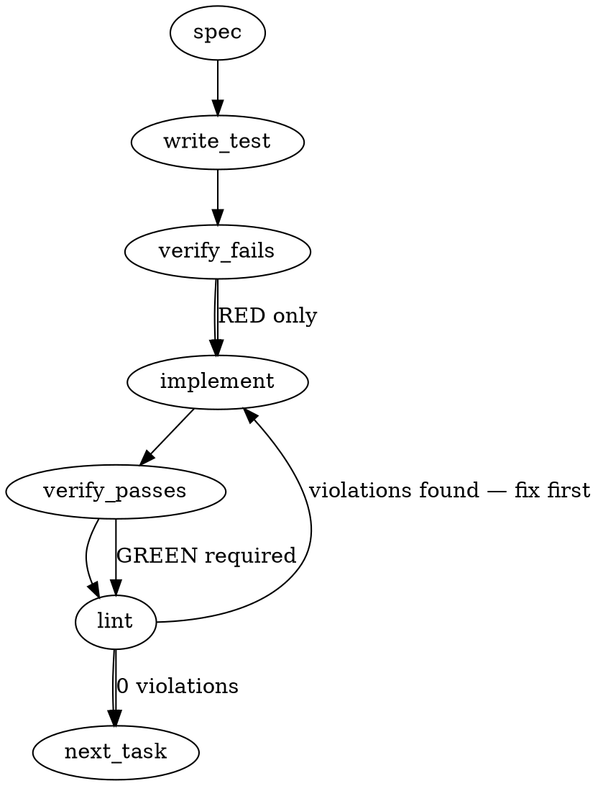

### Problem Statement

Totem needs a pre-push check that intercepts and blocks git pushes when a developer bumps a dependency in `package.json` but fails to commit the regenerated `pnpm-lock.yaml`. This ensures durability for cohort-sync operations and prevents inevitable `ERR_PNPM_OUTDATED_LOCKFILE` failures in `--frozen-lockfile` CI environments.

### Architectural Context

- **Tenet 15 (Axiom Mandate):** The decision to move this from a prose-based memory (`feedback_strategy_claude_canonical_cohort_sync`) to a mechanistic check fulfills the axiom that mechanism is durable while prose memory is weak.
- **Hook Tiering:** Per `packages/cli/src/commands/install-hooks.ts`, hooks have 'strict' and 'standard' tiers. This check must run within the standard pipeline but fail predictably.

### Files to Examine

1. `packages/cli/src/commands/install-hooks.ts` — To understand how the pre-push hook surface is generated and how it delegates to the CLI.
2. `packages/cli/src/commands/pre-push.ts` (or equivalent hook runner) — To locate where the new lockfile validation check should be injected into the existing pre-push lifecycle.

### Technical Approach & Contracts

**Core Mechanism:**
The validation will be built as a standalone, deterministic TS function `checkLockfileSync` that parses the git diff of the commits about to be pushed.

**Data Contracts:**

```typescript
export interface PrePushContext {
  readonly cwd: string;
  readonly localSha: string;
  readonly remoteSha: string;
}

export interface ValidationResult {
  readonly pass: boolean;
  readonly reason?: string;
}
```

**Sequence Logic:**

1. **Resolve Range:** If `remoteSha` is `0000000000000000000000000000000000000000` (new branch push), fallback to diffing against `getDefaultBranch(cwd)`.
2. **Fast-Fail (Not Tracked):** Execute `git ls-files pnpm-lock.yaml` via `safeExec`. If empty, the repo does not track the lockfile; return `{ pass: true }`.
3. **Diff Extraction:** Execute `git diff --name-only <range>` via `safeExec`.
4. **Fast-Fail (Lockfile Included):** If `pnpm-lock.yaml` is in the diff, return `{ pass: true }`.
5. **Fast-Fail (No Package.json):** If no file ending in `package.json` is in the diff, return `{ pass: true }`.
6. **Deep Inspection:** Execute `git diff <range> -- "*package.json"` to get the unified diff.
7. **Regex Evaluation:** Scan the unified diff for line additions matching dependency bumps. A safe regex for this within unified diffs is: `/^\+\s*"[^"]+"\s*:\s*"[\^~]?\d+/m`.
8. **Result:** If a match is found, return `{ pass: false, reason: "Tracked lockfile detected. Run `pnpm install` and stage pnpm-lock.yaml before pushing." }`.

**Shared Helpers Required:**

- `safeExec` (MUST be used for all git commands)
- `resolveGitRoot` (to ensure operations run from the repo root)
- `getDefaultBranch` (to handle the zero-SHA new branch edge case)

### Edge Cases & Traps

- **The Zero-SHA Trap:** Git pre-push passes `0000000000000000000000000000000000000000` as the remote SHA when pushing a newly created branch. Diffing against this throws a fatal error. You must intercept this and diff against the default branch instead.
- **Monorepo Sub-packages:** The check must catch a bump in `packages/core/package.json` while validating the root `pnpm-lock.yaml`. Do not restrict the package.json check to the root.
- **File Deletions:** Removing a dependency creates a line starting with `-` in the diff. The regex MUST strictly match `+` additions to avoid false positives when a dev uninstalls a package without regenerating (though they should, standard CI won't necessarily fail on lockfile drift for removals like it does for missing new pins).
- **Whitespace Only Diffs:** Ensure the regex requires an actual version string format (e.g., matching a digit after a quote/caret) to prevent blocking on Prettier formatting changes in `package.json`.

### Implementation Tasks

- [ ] **Task 1: Scaffold Validation Context and Interfaces**
  - **Files:** Create `packages/cli/src/checks/lockfile-sync.ts` and `packages/cli/src/checks/lockfile-sync.test.ts`
  - **Action:** Define the `PrePushContext` and `ValidationResult` interfaces. Export an empty `checkLockfileSync(ctx: PrePushContext): ValidationResult` function that returns `{ pass: true }`.
  - write test → verify fails → implement → verify passes → lint

- [ ] **Task 2: Implement Range Resolution & Zero-SHA Fallback**
  - **Files:** `packages/cli/src/checks/lockfile-sync.ts`, `packages/cli/src/checks/lockfile-sync.test.ts`
  - **Action:** Implement the logic to derive the git diff range. Use `getDefaultBranch(ctx.cwd)` if `remoteSha` is forty zeros.
    > TEST DIRECTIVE: Before implementing, write a failing test named `resolves to default branch when remoteSha is forty zeros` using a mocked `getDefaultBranch`.
  - write test → verify fails → implement → verify passes → lint

- [ ] **Task 3: Implement Lockfile Tracking & Diff Presence Fast-Fails**
  - **Files:** `packages/cli/src/checks/lockfile-sync.ts`, `packages/cli/src/checks/lockfile-sync.test.ts`
  - **Action:** Use `safeExec` to run `git ls-files pnpm-lock.yaml` and `git diff --name-only <range>`. If lockfile isn't tracked, or if lockfile IS in the diff, return pass.
    > TEST DIRECTIVE: Before implementing, write a failing test named `passes early when pnpm-lock.yaml is in the changed files diff`.
  - write test → verify fails → implement → verify passes → lint

- [ ] **Task 4: Implement Deep Package.json Diff Inspection**
  - **Files:** `packages/cli/src/checks/lockfile-sync.ts`, `packages/cli/src/checks/lockfile-sync.test.ts`
  - **Action:** If a `package.json` is modified, run `safeExec` to get the unified diff: `git diff <range> -- "*package.json"`. Apply the regex `/^\+\s*"[^"]+"\s*:\s*"[\^~]?\d+/m`. If it matches, return a failure with the exact error message from the spec.
    > TEST DIRECTIVE: Before implementing, write a failing test named `rejects when caret bump in nested package.json lacks root pnpm-lock.yaml diff`.
    > TEST DIRECTIVE: Before implementing, write a failing test named `passes when package.json diff only contains deletions`.
  - write test → verify fails → implement → verify passes → lint

- [ ] **Task 5: Integrate Check into Pre-push Runner**
  - **Files:** `packages/cli/src/commands/pre-push.ts` (or equivalent runner file)
  - **Action:** Wire `checkLockfileSync` into the execution chain. Extract `localSha` and `remoteSha` from stdin (which git passes to pre-push hooks). If validation fails, `console.error` the reason and `process.exit(1)`.
  - write test → verify fails → implement → verify passes → lint

### Execution Flow (structural constraint)



### Verification (MANDATORY — do not skip)

Every implementation MUST end with these steps:

1. `totem lint` — deterministic rule check (zero LLM, ~2s). Fixes any violations.
2. `totem review` — AI-powered architectural review (~18s). Addresses any critical findings.
3. If using MCP, call `verify_execution` to confirm compliance before declaring the task done.

### Test Plan

- **Zero-SHA New Branch:** Verify a simulated `00000000...` remote ref correctly falls back to `main`/`master` and checks diffs from branching point.
- **Monorepo Nesting:** Verify `git diff ... -- "*package.json"` correctly captures an addition of `+ "foo": "^1.2.3"` in `apps/web/package.json` and fails the push.
- **Legitimate Diff:** Verify that if BOTH `package.json` and `pnpm-lock.yaml` are modified in the range, the push succeeds.
- **Untracked Lockfile:** Verify that if `pnpm-lock.yaml` exists but is gitignored, the push succeeds regardless of `package.json` bumps.

---

## Implementation Design

### Scope

WILL: add a sibling pre-push gate `totem verify-lockfile-sync` that fails if any committed `package.json` in the local-ahead-of-default-branch range contains added/modified dependency version pins while `pnpm-lock.yaml` is tracked but absent from the same range. Hook generator (`install-hooks.ts:buildPrePushHook`) injects one new line slotted before the WWND claim-discipline gate.

WILL NOT: read git push stdin (per-ref iteration); cover npm/yarn/bun lockfiles (pnpm-only per issue § NOT in scope); run `pnpm install` automatically; add a doctor sub-mode; add a `--strict`/`--standard` tier distinction (gate is universally applicable when the precondition fires).

### Data model deltas

No new persistent state. No schema additions. Two new internal types in the command module:

| Type                              | Holds                                       | Writer               | Reader                             | Invariants                                                                                                                                                  |
| --------------------------------- | ------------------------------------------- | -------------------- | ---------------------------------- | ----------------------------------------------------------------------------------------------------------------------------------------------------------- |
| `LockfileSyncContext` (interface) | `cwd: string`, `baseBranch: string \| null` | CLI command driver   | `verifyLockfileSync` pure function | `cwd` is absolute path. `baseBranch` may be null when git/remote unavailable — falls through to a fast-pass per Tenet 4 carve-out (init/transient surface). |
| `LockfileSyncResult` (interface)  | `pass: boolean`, `reason?: string`          | `verifyLockfileSync` | CLI wrapper / tests                | When `pass: false`, `reason` MUST be present and end in actionable text (the "Run `pnpm install`" sentence).                                                |

Neither type is exported on a public API surface — internal to the command module. The check itself is a pure function (no state container), invoked once per push.

### State lifecycle

No state crosses session/request boundaries. Each invocation:

1. **Scope**: per-invocation
2. **Lifetime**: created at command entry, GC'd at return
3. **Ownership**: `verifyLockfileSync` (pure function, no module-level state)

No state hazards.

### Failure modes

| Failure                                                                     | Category                 | Agent-facing surface            | Recovery                                                                                                      |
| --------------------------------------------------------------------------- | ------------------------ | ------------------------------- | ------------------------------------------------------------------------------------------------------------- |
| `pnpm-lock.yaml` not tracked (e.g., gitignored, not in the index)           | precondition not met     | silent pass (exit 0)            | n/a — gate does not apply                                                                                     |
| `git ls-files` errors (not a repo, exec fails)                              | init                     | warning to stderr, exit 0       | best-effort per Tenet 4 carve-out (same shape as verify-manifest's `getDefaultBranch` try/catch fall-through) |
| `getDefaultBranch` fails (no remote, detached HEAD)                         | init                     | warning to stderr, exit 0       | best-effort fall-through                                                                                      |
| `git diff --name-only` exec fails                                           | transient                | warning to stderr, exit 0       | best-effort fall-through                                                                                      |
| `package.json` has dep-pin addition AND `pnpm-lock.yaml` missing from range | **load-bearing**         | hard error (TotemError, exit 1) | "Run `pnpm install` and stage `pnpm-lock.yaml` before pushing."                                               |
| `package.json` has dep-pin addition AND `pnpm-lock.yaml` present in range   | expected legitimate diff | silent pass                     | n/a                                                                                                           |
| No `package.json` in diff range                                             | gate not applicable      | silent pass                     | n/a                                                                                                           |

The best-effort fall-throughs match the verify-manifest pattern at `verify-manifest.ts:127-131` (the `getDefaultBranch` try/catch). That carve-out is explicitly justified there against Tenet 4 — init-class transient failures that block legitimate pushes are worse than the gate occasionally no-op'ing when git's local state is degraded.

### Invariants to lock in via tests

1. Zero-SHA detection — not exercised (we don't read stdin), so the equivalent invariant is: **diff range resolves to `origin/<default>...HEAD` regardless of git push state**.
2. **Pure passes when lockfile is gitignored** — even if package.json has caret bumps, no false positive.
3. **Monorepo nested package.json triggers the gate** — `apps/web/package.json` bumping `^1.2.3` with no root `pnpm-lock.yaml` diff must fail.
4. **Deletions don't trigger the gate** — regex must reject `-` lines; uninstall-without-lockfile-regen is not in scope and must not false-positive.
5. **Whitespace/prettier-only diffs don't trigger** — regex requires digit-after-quote-or-tilde.
6. **Both files in range passes** — legitimate `pnpm install` commits show both files; gate must pass.
7. **Best-effort fall-through on git failures returns pass** — simulated `safeExec` throw must not break the push.
8. **Hook script wires the gate before the WWND claim-discipline gate** — install-hooks.test.ts asserts the new line is present in `buildPrePushHook` output.

### Open questions

1. **Question:** Bypass mechanism — should `verify-lockfile-sync` honor `TOTEM_GATE_BYPASS_JUSTIFICATION` like the WWND gate, or no bypass at all?
   - **Options:** (a) No bypass — running `pnpm install` is the standard fix, mechanical class. (b) Honor `TOTEM_GATE_BYPASS_JUSTIFICATION` for consistency with cohort doctrine. (c) New `--allow-lockfile-drift` flag mirroring `verify-manifest --allow-compile-drift`.
   - **Recommendation:** (a) No bypass. Failure mode is purely mechanical (run one command); a bypass invites the exact discipline drift the gate exists to prevent. If urgency strikes, `git push --no-verify` already exists as the universal escape hatch (and is explicitly banned in AGENTS.md, so the cost is visible).

2. **Question:** Module location — `packages/cli/src/checks/lockfile-sync.ts` (per auto-spec) or `packages/cli/src/commands/verify-lockfile-sync.ts` (mirrors verify-manifest/verify-badges siblings)?
   - **Options:** (a) commands/ directory matching siblings; (b) new checks/ directory per spec.
   - **Recommendation:** (a) commands/ — no precedent for a `checks/` directory; verify-manifest is itself a "check" and lives in commands/. Simpler is better.

3. **Question:** Command name — `verify-lockfile-sync` vs `verify-lockfile` vs `verify-lockfile-pin`?
   - **Options:** All three valid; `-sync` emphasizes the relationship between pkg.json and lockfile; `-pin` emphasizes the version pin trigger.
   - **Recommendation:** `verify-lockfile-sync` — clearest about what's being verified (their relationship, not the lockfile alone).

4. **Question:** Hook order — slot between `verify-badges` and the WWND claim-discipline gate, OR after both?
   - **Options:** (a) before WWND (fast-fail on mechanical issue before walking the prose surface); (b) after WWND (preserve existing order, append at end).
   - **Recommendation:** (a) before WWND. Mechanical gates should fail first because they're cheap and unambiguous; the prose-discipline gate is slower and has nuance.
