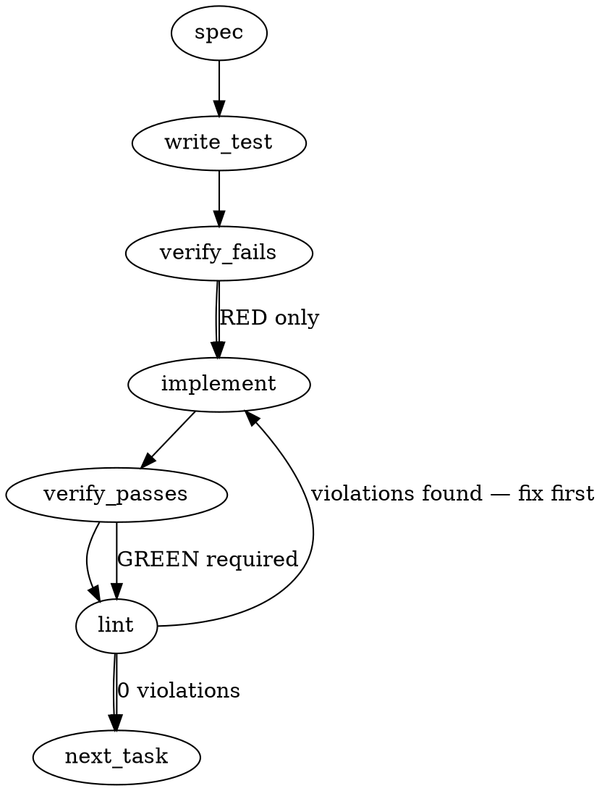

### Problem Statement

The `totem init` command currently performs a destructive, all-or-nothing scaffolding that overwrites existing cohort repo configurations (`.claude/settings.json`, `.mcp.json`) and silently auto-installs new hooks and lesson packs. It needs an "incremental" mode that preserves user modifications and existing MCP registrations, defaults to safe merging on already-initialized repos, and exposes targeted flags (e.g., `--refresh-skills`, `--install-hooks`) for selective updates.

### Architectural Context

None found in provided context.

### Files to Examine

1. `packages/cli/src/commands/init.ts` — Main orchestration for `totem init`. Contains `initCommand` and calls out to scaffold various artifacts.
2. `packages/cli/src/commands/eject.ts` — Reference for how `.claude/settings.json` and other artifacts are currently located and parsed (e.g., `scrubCommittedClaudeSettings`).

### Technical Approach & Contracts

**1. Detection & Modes**
Introduce a dynamic check for an "already initialized" repository.

```typescript
const isAlreadyInitialized =
  fs.existsSync(path.join(cwd, '.totem')) ||
  fs.existsSync(path.join(cwd, '.claude/skills/signoff/SKILL.md'));
```

The command will calculate an `effectiveScaffoldMode`: `options.scaffoldMode || (isAlreadyInitialized ? 'incremental' : 'full')`.

**2. Targeted Refresh Logic (Layer 2)**
Determine if the user is requesting a specific sub-operation.

```typescript
const isTargetedRefresh = Boolean(
  options.refreshSkills ||
  options.refreshReflexes ||
  options.installHooks ||
  options.installBaselines,
);
```

If `isTargetedRefresh` is true, the `init` command skips the standard pipeline and _only_ executes the explicitly requested generators.

**3. Data Contracts (Options Update)**
Update the options interface for `initCommand`:

```typescript
export interface InitOptions {
  bare?: boolean;
  pilot?: boolean;
  strict?: boolean;
  global?: boolean;
  _homeDir?: string;
  // NEW CONTRACTS
  scaffoldMode?: 'full' | 'incremental';
  refreshSkills?: boolean;
  refreshReflexes?: boolean;
  installHooks?: boolean;
  installBaselines?: string | boolean;
}
```

**4. JSON Merging & `readJsonSafe`**
Use the `readJsonSafe` shared helper to safely ingest existing `.claude/settings.json` and `.mcp.json`. Because `readJsonSafe` throws on missing files, we must wrap it in an `fs.existsSync` check.

_Settings merge contract:_
Merge arrays for `permissions.allow` by creating a `Set` to prevent duplicate allowance entries. Preserve all other unrecognized keys verbatim.

_MCP server deduplication contract:_
When generating `.mcp.json`, read the existing file. Inspect `mcpServers`. If any existing server has a `command` of `node` and its `args` includes `node_modules/@mmnto/mcp` or `node_modules/@mmnto/totem`, skip injecting the global fallback (`npx -y ...`) server entirely.

### Edge Cases & Traps

- **Trap: `readJsonSafe` missing file throw.** It will throw `TotemParseError` if the file doesn't exist. You _must_ guard reads with `fs.existsSync`.
- **Race Condition/Blast Radius:** If the user specifies `--refresh-skills`, they expect _only_ skills to refresh. If the script accidentally triggers `installClaudeHooks` during a targeted refresh, the scope creep bug persists. Strict branching based on `isTargetedRefresh` is required.
- **Trap: Legacy Array matches:** Ensure array merging in `settings.json` (`permissions.allow`) strips exact duplicate strings but doesn't accidentally overwrite objects if the schema evolves.
- **Trap: `--install-baselines` type:** The CLI parser will pass a string if the user specifies a language (`--install-baselines rust`), or a boolean if used as a flag. Handle both gracefully in the baseline installer logic.

### Implementation Tasks

- [ ] **Task 1: Add new init flags and detection logic**
  - **Files:** `packages/cli/src/commands/init.ts`, `packages/cli/src/index.ts` (or CLI entry point where flags are parsed)
  - **Steps:**
    - Update `InitOptions` with `scaffoldMode`, `refreshSkills`, `refreshReflexes`, `installHooks`, `installBaselines`.
    - In `initCommand`, implement `isAlreadyInitialized`.
    - Define `effectiveScaffoldMode` and `isTargetedRefresh`.
    - Wrap the existing generation flow in an `if (!isTargetedRefresh)` block.
    - Below that, add standalone execution blocks for the targeted refresh flags (e.g., `if (options.refreshSkills) { await generateSkills(...) }`).
      > TEST DIRECTIVE: Before implementing, write a failing test named `initCommand bypasses standard scaffold when targeted refresh flags are passed` that proves `isTargetedRefresh` correctly isolates execution.
  - write test → verify fails → implement → verify passes → lint

- [ ] **Task 2: Implement defensive merging for `.claude/settings.json`**
  - **Files:** `packages/cli/src/commands/init.ts` (or the specific settings generator file if abstracted)
  - **Steps:**
    - Locate where `settings.json` is written.
    - Add an `fs.existsSync` check. If it exists, use `readJsonSafe<any>` to load it.
    - If in `incremental` mode (or simply merging by default), combine the existing `permissions.allow` array with the new required entries using a `Set` to deduplicate.
    - Retain all other existing keys in the user's config object, overriding only the specific Totem-managed defaults if they are missing.
    - Write back the merged object.
      > TEST DIRECTIVE: Before implementing, write a failing test named `initCommand preserves unrecognized keys and merges permissions.allow in existing settings.json` that proves user config is retained.
  - write test → verify fails → implement → verify passes → lint

- [ ] **Task 3: Implement duplicate-detection for `.mcp.json`**
  - **Files:** `packages/cli/src/commands/init.ts` (or the MCP generator module)
  - **Steps:**
    - Locate the MCP scaffold logic.
    - Before generating the fallback `npx -y @mmnto/mcp` entry, check `fs.existsSync` for `.mcp.json`.
    - If present, parse with `readJsonSafe<any>`.
    - Iterate over `mcpServers` values. Check if any has `command: 'node'` and an `args` array containing the string `node_modules/@mmnto/mcp` or `node_modules/@mmnto/totem`.
    - If found, skip adding the fallback npx entry.
      > TEST DIRECTIVE: Before implementing, write a failing test named `initCommand skips fallback npx mcp server registration if project-local server exists` that proves the fallback is suppressed.
  - write test → verify fails → implement → verify passes → lint

- [ ] **Task 4: Gate Hooks and Lessons behind opt-in / full mode**
  - **Files:** `packages/cli/src/commands/init.ts`
  - **Steps:**
    - Wrap the call to `installClaudeHooks` in `if (effectiveScaffoldMode === 'full' || options.installHooks)`.
    - Wrap the baseline lesson injection in `if (effectiveScaffoldMode === 'full' || options.installBaselines)`.
    - Ensure that if `options.installBaselines` is a string (e.g., 'rust'), the specified language pack is installed. If boolean `true`, install the universal baseline.
      > TEST DIRECTIVE: Before implementing, write a failing test named `initCommand does not install hooks on already initialized repos without explicit flag` that proves scope creep is halted.
  - write test → verify fails → implement → verify passes → lint

### Execution Flow (structural constraint)



### Verification (MANDATORY — do not skip)

Every implementation MUST end with these steps:

1. `totem lint` — deterministic rule check (zero LLM, ~2s). Fixes any violations.
2. `totem review` — AI-powered architectural review (~18s). Addresses any critical findings.
3. If using MCP, call `verify_execution` to confirm compliance before declaring the task done.

### Test Plan

- **Detection Test:** `init` on an empty directory sets `effectiveMode=full` and scaffolds everything.
- **Already-Initialized Test:** `init` on a directory with `.totem/` sets `effectiveMode=incremental` and does NOT write `.claude/hooks/*` or inject `baseline.md`.
- **Targeted Scope Test:** `init --refresh-skills` generates skills but does NOT touch `.mcp.json` or `.claude/settings.json`.
- **Merge Preservation Test:** `init` with an existing `.claude/settings.json` containing `permissions.allow: ["custom_mcp_call"]` results in a file containing _both_ the new defaults and `"custom_mcp_call"`.
- **MCP De-dupe Test:** `init` with an existing `.mcp.json` containing a project-local Totem install skips adding the generic `npx` Totem MCP registration.

---

## Implementation Design (W3.5 narrow scope)

> **NB:** The Gemini-generated spec above describes the BROAD #2008 issue (Layer 1 + Layer 2). This section narrows the implementation surface to **W3.5 only**, per strategy-claude's explicit confirmation at `2026-05-22T1642Z-totem-claude-ack-narrow-w3.5-plus-mail-system-refactor-incoming.md` ("Do not widen W3.5"). The Layer 1 defensive merging and Layer 2 refresh-flag cohort stay queued in `#2008` as a separate cycle.

### Scope (2 sentences)

This implementation adds a single CLI flag `totem init --force-skill-refresh` that overrides `scaffoldClaudeSkill`'s `preserved` outcome — when the flag is set, skill files lacking the canonical end marker are overwritten with canonical content instead of being preserved. This explicitly does NOT implement Layer 1 defensive merge defaults (`.claude/settings.json`, `.mcp.json` dedup, opt-in hooks, opt-in baselines) or the Layer 2 refresh-flag cohort (`--refresh-skills` / `--refresh-reflexes` / `--install-hooks` / `--install-baselines`) — those stay queued in `#2008`.

### Data model deltas

1. **`InitOptions.forceSkillRefresh?: boolean`** — new optional field on the existing options type at `packages/cli/src/commands/init.ts`.
   - **Holds:** explicit user opt-in to overwrite skill files that lack canonical markers
   - **Writes:** CLI parser in the Commander definition (`packages/cli/src/index.ts` or wherever `init` is registered)
   - **Reads:** `initCommand` → `installClaudeHooks` → per-skill iteration → `scaffoldClaudeSkill(filePath, canonicalContent, { force })`
   - **Invariant:** `undefined | false` preserves the current "skip files without canonical markers" contract; `true` overwrites them. Default is `undefined` so the current behavior contract is unchanged for unflagged callers.

2. **`scaffoldClaudeSkill` signature widening** — third parameter (purely additive).
   - **Current:** `scaffoldClaudeSkill(filePath: string, canonicalContent: string)`
   - **New:** `scaffoldClaudeSkill(filePath: string, canonicalContent: string, options?: { force?: boolean })`
   - **Semantics:** when `options?.force === true`, the `preserved` outcome branch is suppressed and the file is written as if it were a fresh `created` outcome.

3. **`scaffoldClaudeSkill` return type** — **NO new enum value**.
   - The function already returns `{ action: 'created' | 'refreshed' | 'unchanged' | 'preserved'; err?: string }`. Force-mode writes will map to existing values: `'refreshed'` when the file existed (with or without markers), `'created'` when it did not. Per `feedback_default_to_subtraction`: reuse outcomes rather than add a `'force-replaced'` value. The summary line text differentiates the action for the user.

4. **`installClaudeHooks` summary line widening** — when `force` was passed AND the file was rewritten without markers, the summary entry's `action` text MUST surface the force consent ("Force-overwritten (no canonical markers found — user content overwritten)"). This is the only place where the force semantics need user-visible disambiguation.

### State lifecycle

The `force` parameter is per-invocation only — no persistent state, no module-level mutation, no caching.

- **Scope:** per-command (single `totem init` invocation)
- **Lifetime:** parsed at CLI start → consumed during the per-skill iteration in `installClaudeHooks` → discarded at command end
- **Ownership:** value-passed through the call chain (CLI parser → `initCommand(options)` → `installClaudeHooks(cwd, rl, { tier, force })` → `scaffoldClaudeSkill(path, content, { force })`)

No state crosses lifecycle boundaries. There is no "force-mode session" — each invocation is independent.

### Failure modes

| Failure                                                            | Category  | Agent-facing surface                                                                                                                                                                                    | Recovery                                           |
| ------------------------------------------------------------------ | --------- | ------------------------------------------------------------------------------------------------------------------------------------------------------------------------------------------------------- | -------------------------------------------------- |
| Flag passed but no skill files exist on disk (fresh repo)          | runtime   | silent — flag is a no-op on the `created` path                                                                                                                                                          | None needed                                        |
| Flag passed and file write succeeds                                | runtime   | summary line shows `Force-overwritten (no canonical markers found — user content overwritten)`                                                                                                          | None needed                                        |
| Flag passed and file-write fails (permission denied, ENOSPC, etc.) | permanent | inherits existing `scaffoldClaudeSkill` `{ err }` surface; per-skill failure logged via `log.error('Totem Error', …)` and surfaced in summary; OTHER skills in the iteration still attempt their writes | User fixes underlying fs issue, re-runs            |
| Flag passed AND file has below-end-marker user customization       | runtime   | **Cross-marker content preserved per existing marker logic** — force ONLY suppresses the no-marker preservation guard, not the below-marker preservation contract                                       | None needed; intentional                           |
| Flag passed AND file is marker-less AND has unsaved local edits    | permanent | **WARNING + overwrite** — overwriting marker-less file destroys user content; user must commit/stash before running force                                                                               | Out-of-band: user `git restore` or `git stash pop` |

Note on row 4 (cross-marker invariant): the convention "everything after the end marker is user customization" stays intact under force. Force-mode suppresses the file-level preservation gate (`preserved` outcome for marker-less files), NOT the within-file marker semantics for marker-bearing files. A heavier hammer (overwrite-everything-including-below-marker) is explicitly out of scope; if needed, a separate flag like `--force-skill-replace` can land in a future cycle.

Per Tenet 4 (Fail Loud): row 5 surfaces the destructive overwrite via the summary line, not silently. The flag NAME (`--force-`) is itself the loud opt-in signal.

### Invariants to lock in via tests

1. **Default behavior is unchanged** — `totem init` without `--force-skill-refresh` continues to skip marker-less skill files via the `preserved` outcome (existing tests at `init.test.ts:1685-1745` stay green; `forceSkillRefresh: undefined` is the default).
2. **Force overrides preservation for marker-less files** — `totem init --force-skill-refresh` on a repo with a marker-less skill file produces a file whose content is byte-identical to the canonical embedded string, and a summary entry whose `action` mentions the force.
3. **Force on a fresh repo is a no-op** — `--force-skill-refresh` with no pre-existing skill files yields `created` outcomes for all skills (same as the unflagged fresh-init path).
4. **Force preserves below-end-marker user content** — for files WITH canonical markers, force does NOT additionally overwrite content below the end marker; only the inside-marker section is refreshed (same as the default `refreshed` path).
5. **Force on marker-bearing files matches default refresh path** — if a file has canonical markers and would already be `refreshed` (or `unchanged`), force-mode produces the same outcome string (no spurious `'refreshed'` when nothing changed).
6. **Per-skill failure isolation** — if one skill's write fails under force, the OTHER skills in `DISTRIBUTED_CLAUDE_SKILLS` still attempt their writes.
7. **CLI flag round-trip** — Commander parses `--force-skill-refresh` per the existing flag convention (`bare` / `pilot` / `strict`). All truthy checks in the code path use `force === true` (NOT `force !== false`) so the invariant holds regardless of whether absence parses to `undefined` or `false`.
8. **Warning fires ONLY on the suppression path** — the per-file `log.warn` is emitted exclusively for files that WOULD have hit the `preserved` branch and were force-suppressed. For marker-bearing files where force rides through the normal `refreshed` (or `unchanged`) path, NO warning is emitted. This locks the signal-to-noise discipline into the suite — invariant 5 plus invariant 8 together prevent noisy warning drift.

### Dispositions (sealed at 2026-05-23T1819Z by strategy-claude)

The three open questions below received explicit dispositions in `2026-05-23T1819Z-totem-claude-w3.5-spec-dispositions.md`. Captured here so the spec is self-contained:

- **Q1 — per-file warn:** YES (option a), narrowed: warn ONLY when the no-marker guard is being suppressed (not on marker-bearing refresh path). Align warn-text + summary-text punctuation/verb for grep parity.
- **Q2 — skills only:** YES (option a). Reflex force-mode, if ever needed, lands as a parallel `--force-reflex-refresh` with its own design pass — NOT bundled here.
- **Q3 — surfaced in --help:** YES (option a). Description text: `Force-overwrite skill files lacking canonical markers (may destroy user content; review git diff after).`
- **Asymmetry call** (force suppresses no-marker guard ONLY; below-marker user content is part of the marker contract and stays intact): STRONGLY AGREED. Bulldoze-everything semantics belong to a different command (`--force-skill-replace` or `--scrub`), out of W3.5 scope.

### Updated failure-modes / summary-line text (refinement from Q1 disposition)

Per the alignment refinement, both the per-file warn AND the summary-line action use **identical phrasing**. Final text:

- **Per-file warning** (emitted only on suppression path):
  `log.warn('Totem', 'Force-overwriting <relative-path>: no canonical markers found, user content overwritten')`
- **Summary-line action** (only on suppression path; `refreshed` outcome under force):
  `'Force-overwritten: no canonical markers found, user content overwritten'`

Same colon + comma structure + same verb stem ("overwrite") in both. An operator can grep `force-overwrit` (or `Force-`) to surface every destructive event from both surfaces.

### Open questions

1. **Question:** Should the flag emit a per-file pre-write warning (one line per force-overwritten marker-less file) before performing the destructive write?
   - **Options:**
     - (a) **YES** — print `log.warn('Totem', 'Force-overwriting <relative-path> (no canonical markers found; user content overwritten)')` before each force-write
     - (b) **NO** — silent overwrite (flag is the consent); only the post-init summary line surfaces the action
   - **Recommendation:** (a). The destructive-by-consent action gets a loud explicit log line per-file. Cheap; high signal; matches the "Fail Loud, Never Drift" tenet posture. The summary line is also retained as the structured artifact.

2. **Question:** Does the flag apply ONLY to `DISTRIBUTED_CLAUDE_SKILLS`, or also to `injectReflexes` (CLAUDE.md / GEMINI.md reflex blocks)?
   - **Options:**
     - (a) **Skills only** — flag name says `--force-skill-refresh`; reflexes have their own outdated-version prompt path
     - (b) **Skills + reflexes** — broaden the semantics now since both use marker-based replacement
   - **Recommendation:** (a). The narrow scope is "skills". `injectReflexes` already has an interactive upgrade-prompt path that handles outdated reflex blocks (lines around `init.ts:469-540`); it's a different UX contract and bringing it under the same flag breaks the cohort skill-template focus W3.5 was authorized for. Reflex force-refresh stays queued for a future Layer 2 cycle if user demand surfaces.

3. **Question:** Where does the flag live in the Commander `init` definition — should it be hidden (advanced flag) or surfaced in `--help`?
   - **Options:**
     - (a) **Surfaced** — visible in `totem init --help` with a short description
     - (b) **Hidden** — present but unlisted to avoid encouraging routine force-mode use
   - **Recommendation:** (a). Hiding it would defeat the discoverability needed for cohort consumers hitting the exact problem #2008 documents. Description text should include the "user content overwritten" caveat to reinforce consent semantics.
   - **Sealed at 1819Z:** option (a) accepted; description text `Force-overwrite skill files lacking canonical markers (may destroy user content; review git diff after).`
