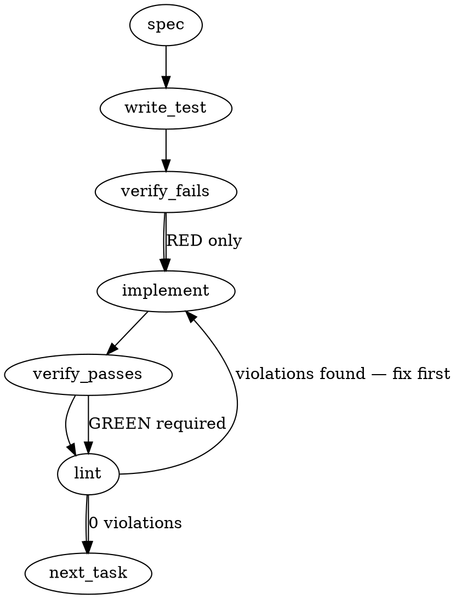

### Problem Statement

The `totem mail` command currently only supports reading cross-repo mail, lacking an actuator to compose and send outbound messages. As a result, users are forced to hand-author markdown files with undocumented conventions (ADR-098 schema, specific timestamp naming, specific directory structures), leading to drift; implementing `totem mail send` and `totem mail reply` commands will enforce these conventions structurally and eliminate the silent no-op fall-through when users attempt to send mail today.

### Architectural Context

- **ADR-106 & Tenet 13 (Sensor without Actuator):** The absence of a send command creates a structural inability to comply with protocol. This violates the `totem_validation_criterion` by creating unbounded glue cost.
- **Totem Signoff (Gemini parity) > Cross-repo handoffs:** Established the pattern for outbound communication pathing (`<repoRoot>/.totem/orchestration/<agent-id>/outbox/`) and requires the `to: <recipient-agent-id>` frontmatter.
- **Discrepancy Resolution:** The issue requires the filename convention `<UTC>Z-<recipient>-<slug>.md`, which slightly alters the older Signoff spec's `<YYYY-MM-DDTHHMMZ>-<your-agent-id>.md`. We will honor the issue's updated `<UTC>Z-<recipient>-<slug>.md` convention as it represents the modern ADR-106 coordination standard.

### Files to Examine

1. `packages/cli/src/commands/mail.ts` — Current entry point; contains the trap where `totem mail send` falls through to the read command.
2. `packages/cli/src/commands/mail.test.ts` — Existing test interfaces (`MailEntry`, `OutboxFile`) that the new commands must cleanly integrate with.
3. `.totem/session.json` (or equivalent session state file) — Source of truth for the `claude-00NN` / session sequence signature needed for auto-filling the frontmatter.

### Technical Approach & Contracts

To structurally enforce the consumer doctrine, we will introduce a strict subcommand router to `totem mail`.

**Data Contracts:**

1. **Zod Schema (`Adr098FrontmatterSchema`):**
   ```typescript
   export const Adr098FrontmatterSchema = z.object({
     schema: z.literal('adr-098-v0.4'),
     to: z.string(),
     subject: z.string(),
     seq: z.string().optional(),
     inReplyTo: z.string().optional(),
     priority: z.string().optional(),
     related: z.array(z.string()).optional(),
   });
   ```

**Sequence Logic:**

1. **Routing:** Upgrade the command parser for `totem mail` to explicitly demand `send` or `reply` subcommands. If executed with no subcommand, it executes the existing read behavior. If an unknown argument (e.g., `send` currently) is passed without being registered, throw a hard error.
2. **Path Resolution:** Use the shared helper `resolveGitRoot(process.cwd())` to locate the workspace root. Compute the self agent ID (via `TOTEM_AGENT_ID` env var or falling back to local config).
3. **Draft Assembly:**
   - Extract the current seq (e.g., `claude-00NN`) via `readJsonSafe` against the active session state.
   - Construct the frontmatter using `Adr098FrontmatterSchema`.
   - Read body from `--body-file`, or fallback to empty string (or `stdin` if available).
4. **Actuation:** Write the templated markdown to `.totem/orchestration/<self>/outbox/<UTC>Z-<recipient>-<slug>.md`.

### Edge Cases & Traps

- **Silent Fall-through Trap:** The most critical regression to avoid is `totem mail send` acting as a no-op read. The CLI router _must_ throw an error for unknown subcommands or positional arguments.
- **Filename Collision (Race Condition):** If an agent fires two messages to the same recipient in the same minute, `<UTC>Z-<recipient>-<slug>.md` will collide. The implementation must append a short random hex or the `seq` signature to the filename to guarantee uniqueness.
- **Missing Directories:** The `outbox/` directory may not exist on a fresh clone or new agent initialization. The write operation must use `fs.mkdirSync(outboxPath, { recursive: true })`.
- **Unknown Agent Identity:** If `<self>` cannot be resolved, the command must fail with a clear error rather than writing to `.totem/orchestration/undefined/outbox/`.
- **Gitignore assumption:** The outbox directory may be gitignored. Avoid any automatic `git add` operations inside this command.

### Implementation Tasks

- [ ] **Task 1: Fix CLI Subcommand Routing & Silent Fall-through**
      Modify the CLI argument parsing in `packages/cli/src/commands/mail.ts` to separate the default read behavior from the new `send` and `reply` commands. Throw a hard error if an unregistered positional argument is provided.

  > TEST DIRECTIVE: Before implementing, write a failing test named `rejects unknown positional arguments and prevents silent fall-through` that proves `totem mail invalid_arg` throws an error instead of executing the read command.
  > _Steps:_ write test (in `mail.test.ts`) → verify fails → implement → verify passes → lint

- [ ] **Task 2: Define ADR-098 Zod Contracts & File Helpers**
      Define the `Adr098FrontmatterSchema` using Zod and a helper function to construct the markdown payload. Implement session state reading using the `readJsonSafe` shared helper to extract the `seq` value.
      _Steps:_ write test → verify fails → implement → verify passes → lint

- [ ] **Task 3: Implement `totem mail send` Actuator**
      Implement the `send` command. Parse flags (`--to`, `--subject`, `--body-file`, etc.). Use `resolveGitRoot` to find the workspace root. Ensure the target directory exists.

  > TOTEM INVARIANT (Totem Signoff / Cross-repo handoffs): When dispatching a message to another agent, write to your own outbox at `<repoRoot>/.totem/orchestration/<agent-id>/outbox/...` with `to: <recipient-agent-id>` in the frontmatter.
  > TEST DIRECTIVE: Before implementing, write a failing test named `writes valid adr-098-v0.4 markdown to the correct agent outbox path` that verifies directory creation, collision-free naming, and frontmatter validation.
  > _Steps:_ write test → verify fails → implement → verify passes → lint

- [ ] **Task 4: Implement `totem mail reply` Syntactic Sugar**
      Implement the `reply` command. It must take a target file (`--in-reply-to <file>`), read it (using `readJsonSafe` or standard file reading for markdown frontmatter), infer the `--to` (from the original `from`) and `--subject` (prefixing `Re: `), and then invoke the logic from Task 3.
  > TEST DIRECTIVE: Before implementing, write a failing test named `infers recipient and subject correctly from original mail message` that tests the automated field mapping.
  > _Steps:_ write test → verify fails → implement → verify passes → lint

### Execution Flow (structural constraint)



### Verification (MANDATORY — do not skip)

Every implementation MUST end with these steps:

1. `totem lint` — deterministic rule check (zero LLM, ~2s). Fixes any violations.
2. `totem review` — AI-powered architectural review (~18s). Addresses any critical findings.
3. If using MCP, call `verify_execution` to confirm compliance before declaring the task done.

### Test Plan

- **Routing Isolation:** Run `totem mail send` without flags and assert it fails with "missing required arguments" rather than executing a successful read.
- **Contract Adherence:** Assert that output written to the file system strictly passes the `Adr098FrontmatterSchema` Zod parse.
- **Collision Avoidance:** Call `send` identically twice in the same millisecond; assert two distinct files exist in the outbox.
- **Reply Sugar inference:** Provide a mock inbound mail file. Run `reply` on it. Assert the newly generated file correctly points the `to:` field to the original sender and includes `inReplyTo: <original-file>`.
- **Missing Directory:** Mock an empty filesystem for the `.totem` directory. Assert `send` recursively creates the orchestration tree before writing.

---

## Implementation Design

> Grounded against the real code (`mail.ts:parseHeader`, `orchestration-resolver.ts:resolveSelfAgents`) + ADR-098 v0.4. **Three spec fabrications corrected:** (1) no `seq:` wire field — `claude-00NN` is the journal-filename signature, never mail frontmatter; (2) wire uses kebab `in-reply-to`, not `inReplyTo`; (3) the `Adr098FrontmatterSchema` in the spec body ignores the v0.3/v0.4/de-facto split (see OQ-1).

### Scope

Add `totem mail send` + `totem mail reply` subcommands that compose a validated ADR-098 dispatch into the sender's own outbox, and fix the silent `totem mail <unknown>` fall-through (the #2042 trap). The write-side validator is **fail-open** (invariant 6): content-validation doubt → warn-and-write, never block. **Explicitly NOT in scope:** `totem mail ack` and read-side mark-on-read / handled-state (ADR-106 A1.3 — separate lane); message-body templating beyond `--body-file`/stdin; any cross-agent writes (single-writer invariant holds).

### Data model deltas

- **`MailSendOptions` (cli, new):** `{ to: string; from?: string; subject: string; bodyFile?: string; inReplyTo?: string; priority?: string; related?: string[]; repoRoot?: string; env?: …; now?: () => Date }`. `now`/`repoRoot`/`env` are test-injection seams (deterministic timestamp). Written by the CLI action from flags; read by `mailSend()`.
- **Emitted frontmatter schema (Zod, new):** shape is OQ-1. Validator reads it; nobody persists it in memory.
- **`validateDispatchWellFormed(header, knownAgents): { wellFormed: boolean; warnings: string[] }` (new, pure):** T1 predicates ONLY (inv1/Tenet 9) — recipient ∈ `knownAgents` (exact set membership), required fields present (schema/enum), refs match a format regex. **Never throws, never blocks.** Returns `warnings`; the caller writes regardless. Invariant: emits "well-formed" framing, **never** "valid"/"will-deliver" (inv2 — no unverified authority signal).
- **`composeDispatch(header, body): string` (new, pure):** deterministic frontmatter+body serializer — the round-trip anchor (its output must parse back through `parseHeader`).
- **No new state container.** The only durable artifact is the written outbox file: append-only to `<repoRoot>/.totem/orchestration/<from>/outbox/`, never mutated/cleared by this command.

### State lifecycle

- **Scope:** per-invocation. **Lifetime:** compose → validate (warn) → mkdir-recursive → atomic write (temp+rename, per ADR-106 "writes are atomic") → exit. **Ownership:** `mailSend()` owns the write; `mailReply()` reads the source dispatch, infers `to`/`subject`/`in-reply-to`, then delegates to `mailSend()`. No state crosses an invocation boundary.

### Failure modes

| Failure                                                 | Category                        | Agent-facing surface                                  | Recovery                         |
| ------------------------------------------------------- | ------------------------------- | ----------------------------------------------------- | -------------------------------- |
| missing `--to` / `--subject`                            | usage                           | **hard error** (compose-blocked)                      | supply flag                      |
| ambiguous self (>1 mapped agent, no `--from`/env)       | usage                           | **hard error** ("specify --from")                     | supply `--from`                  |
| unresolvable self (`resolveSelfAgents` → none)          | usage                           | **hard error** (no `.../undefined/outbox` write)      | set `TOTEM_SELF_AGENT`           |
| `--body-file` unreadable                                | usage                           | **hard error** (intended body lost)                   | fix path                         |
| unknown subcommand (`totem mail bogus`)                 | usage                           | **hard error** (fixes the #2042 fall-through)         | correct command                  |
| recipient ∉ known-agent set                             | content-validation              | **WARN + write anyway** (inv6 fail-open)              | dispatch lands; warning surfaced |
| malformed `--related` / `--in-reply-to` ref (on `send`) | content-validation              | **WARN + write anyway**                               | lands; warn                      |
| `reply` source file missing/unparseable                 | usage (reply needs it to infer) | **hard error**                                        | fix `--in-reply-to`              |
| outbox dir absent                                       | runtime (expected)              | mkdir-recursive, proceed                              | created                          |
| filename collision (same minute+recipient+slug)         | runtime                         | disambiguate suffix (short counter)                   | unique name                      |
| **write fails (EACCES/ENOSPC)**                         | permanent                       | **hard error** (dispatch did NOT land — Tenet 4 loud) | fix FS                           |

**Fail-open's exact boundary (the load-bearing inv6 reading):** fail-open on _validation uncertainty_ (a malformed-but-delivered dispatch is recoverable; a blocked one is the #2119 catastrophe). Fail-**loud** on _actuation failure_ (a write that didn't land is silent drop — the opposite failure). No row is "silent degradation."

**Two validity classes (strategy-claude concur 1740Z, ADR-098 owner):**

- **Structural** (schema / timestamp / expected-action present + shaped): enforced **by construction** — the actuator _builds_ the shape, so a structurally-invalid dispatch is **unrepresentable**, not rejected-after-the-fact. The strongest form of ADR-098 "enforce via substrate"; inv2 realized; **inv6 doesn't apply** (nothing to fail on).
- **Content** (recipient ∉ known-agent set, unresolvable refs): can't be guaranteed at construction → **loud-warn + write** (inv6). **The warn MUST surface at emit-time on CLI stderr**, not as a silent frontmatter note — a typo'd recipient writes to the outbox under a wrong name and is undelivered-but-not-errored (the silent-fail class). Loud-warn-and-write (sender catches the typo) ≠ block.
- Three composing layers, none violating inv6: **structural = correct-by-construction · content = loud-warn-and-deliver · reader (`pollMail` A1.2 scan-errors-always-warn) = never-silent-drop backstop.**

### Invariants to lock in via tests

- A dispatch to an **unknown recipient is still written**, with a warning (inv6 fail-open — the headline test).
- The validator returns `wellFormed:false` yet **never throws and never blocks** the write (inv2 + inv6).
- `totem mail <unknown>` / unknown subcommand **hard-errors, never falls through to read** (the #2042 trap).
- **Sensor↔actuator round-trip:** a file emitted by `send` is immediately surfaced by `pollMail` (the actuator emits exactly what the sensor reads — the "one enumeration, two readers" guarantee).
- `reply` infers `to:=orig.from`, `subject:=Re: <orig>`, sets `in-reply-to:=<source path>`.
- Ambiguous-self without `--from` hard-errors (no `undefined` outbox write).
- A write failure surfaces as a **hard error**, not a swallowed warning (fail-loud on actuation).
- Two sends in the same minute → two distinct files (collision-free).

### Open questions

- **OQ-1 (load-bearing — which frontmatter shape does the actuator emit?).** The reader (`parseHeader`) consumes `to/from/subject/date`; ADR-098 v0.4 mandates `schema:`/`timestamp:`(replacing `date:`)/`expected-action:`; the **de-facto wire** is `to/from/date/in-reply-to/related-issues/subject` (v0.4-noncompliant — what every live dispatch, incl. the reader, actually uses).
  - **Options:**
    - **1a (de-facto):** emit `to/from/date/subject` + optional `in-reply-to`/`related-issues`. Reader-paired today, ships independently, but bakes in a knowingly-v0.4-noncompliant emitter.
    - **1b (v0.4-compliant):** emit `schema: adr-098-v0.4`/`timestamp:`/`expected-action:` + the rest, **and** teach `parseHeader` to read `timestamp:` (date: fallback). Makes totem the first v0.4-compliant emitter and the enforcement substrate the amendment called for — but widens scope to the reader and touches strategy's doctrine (ADR-098 ownership).
  - **Recommendation:** **1b, coordinated with strategy** — the actuator is the natural v0.4 enforcement point, and shipping a non-compliant emitter at the one moment we can fix the drift is the wrong precedent. I'd dispatch the exact emit-shape to strategy-claude for ADR-098 concurrence (the same spec→strategy-review pattern as every #474 slice) **before** building, since 1b modifies the reader contract they own. Fallback to 1a only if you want the actuator to ship this session decoupled from the reader change.
  - **RULED (satur8d, 2026-06-09): 1b — v0.4-compliant, coordinate first.** Build is HELD pending strategy-claude's ADR-098 concurrence on the emit-shape + the `parseHeader` `timestamp:` read. Emit-side v0.4 compliance is **structural** (the actuator always writes `schema:`/`timestamp:`/`expected-action:` by construction — nothing to reject); fail-open (inv6) therefore governs only the _content-validation_ predicates (unknown recipient, malformed refs), reconciling ADR-098's "enforce via substrate" with inv6's "never block transport."
- **OQ-2 (coordination timing):** dispatch the OQ-1 emit-shape to strategy for concurrence before building (adds a round-trip but de-risks a reader-contract change on their doctrine), or build 1a now and treat 1b as a fast-follow? **Recommendation:** if you pick 1b, coordinate first; if 1a, build now.
