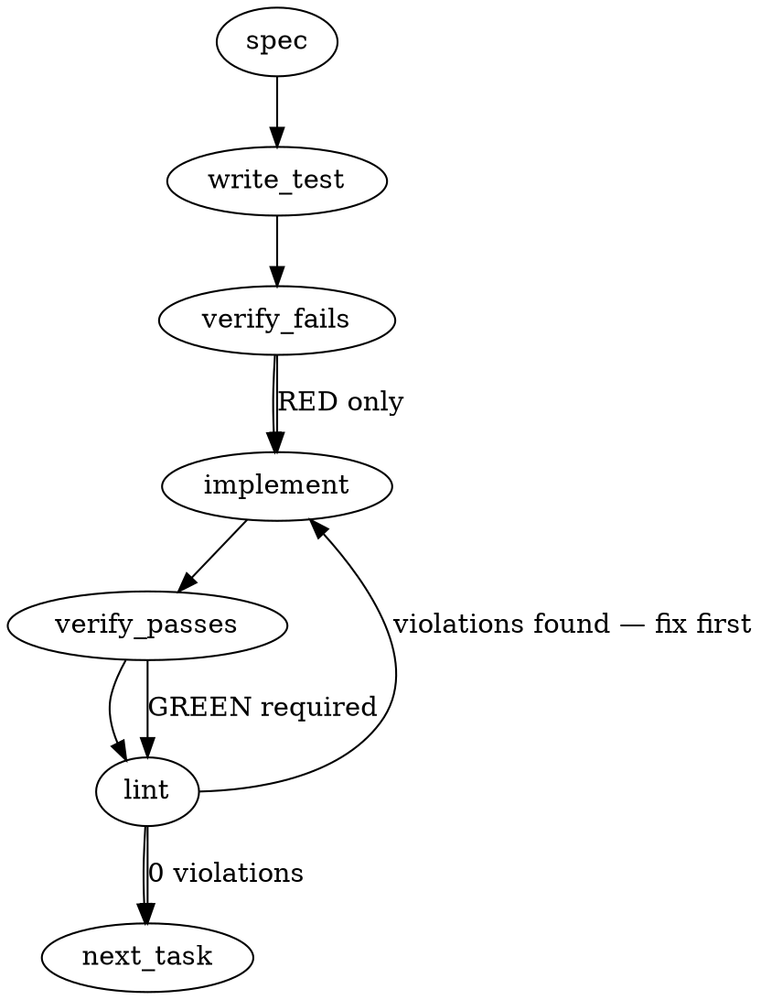

### Problem Statement

The generated `pre-push` git hook incorrectly checks for a global `totem` executable in the system `PATH` before checking for a local workspace build. This causes the Totem monorepo (and consumer monorepos) to execute stale global binaries against HEAD code during git hooks, leading to false-positive linting and rule enforcement errors.

### Architectural Context

This bug is the root cause of the "global-vs-local lint divergence" (lesson `1ef06d16`). The discriminator for which binary to use must be "workspace-membership" (are we developing `@mmnto/cli`?), followed by "local installation" (does the consumer repo have a pinned version?), falling back to the global installation only as a last resort.

_Note on Upgrades:_ As defined in the issue, the cohort of repositories with stale hooks will self-heal via the versioned-hooks upgrade mechanism (#1854). This spec focuses strictly on correcting the resolution template logic and ensuring the workspace bin links correctly.

### Files to Examine

1. `packages/cli/src/commands/install-hooks.ts` — Contains `buildResolveBlock`, which generates the flawed bash resolution order.
2. `package.json` (Totem root) — Needs `@mmnto/cli` added to devDependencies to ensure `pnpm exec totem` does not fall through to the global scope.

### Technical Approach & Contracts

We will correct the priority cascade within the bash template generated by `buildResolveBlock`. The hook runs natively in `bash`/`sh` at the git root, so all relative paths must be evaluated from the repository root.

**Target Bash Resolution Order Contract:**

1. **Workspace Dogfooding (HEAD):** Check if `packages/cli/package.json` exists, declares `"name": "@mmnto/cli"`, and `packages/cli/dist/index.js` is present. If true, run `node packages/cli/dist/index.js`.
2. **Pinned Local Bin (NPM/Yarn/PNPM Root):** Check if `node_modules/.bin/totem` exists. If true, run `node_modules/.bin/totem`.
3. **Consumer Workspace Sub-package:** Check if `pnpm-workspace.yaml` exists and `pnpm exec totem --version` succeeds. If true, run `pnpm exec totem`.
4. **Stale Global (Fallback):** Check if `command -v totem` exists. If true, run `totem`.
5. **Generic Fallback:** Use the provided fallback command (e.g., `npx -y @mmnto/cli`).

Additionally, we must add `@mmnto/cli` as a `workspace:*` devDependency to the Totem monorepo's root `package.json` to create the proper `.bin` symlink at the root level, stopping manual `pnpm exec totem` commands from silently using the global binary.

### Edge Cases & Traps

- **Windows Executable Checks:** Git Bash on Windows handles the `-x` (executable) flag inconsistently for `.cmd` shim files and symlinks in `node_modules/.bin`. Use `-f` (file exists) instead of `-x` when checking for `node_modules/.bin/totem` to prevent Windows from bypassing the local binary check.
- **grep Formatting Trap:** The `package.json` might have spaces after the colon. Use `grep -q '"name": *"@mmnto/cli"'` to ensure robust matching.
- **Hook Upgrade Separation:** Do NOT attempt to write logic that finds and upgrades existing `.git/hooks/pre-push` files in this task. That is explicitly handled by #1854. Focus only on the template.

### Implementation Tasks

- [ ] **Task 1: Correct the Bash Resolution Hierarchy in the Hook Template**
  - **Files to modify:** `packages/cli/src/commands/install-hooks.ts`, `packages/cli/src/commands/__tests__/install-hooks.test.ts`
    > TEST DIRECTIVE: Before implementing, write a failing test named `prioritizes workspace HEAD over local and global binaries in resolve block` that asserts the generated bash script string follows the new 5-step if/elif cascade.
  - Update the `buildResolveBlock` function to return the correctly ordered bash cascade defined in the Technical Approach.
  - Ensure you use `[ -f "node_modules/.bin/totem" ]` instead of `-x` for Windows compatibility.
  - write test → verify fails → implement → verify passes → lint

- [ ] **Task 2: Link Workspace CLI to Root**
  - **Files to modify:** `package.json` (repository root)
  - Add `"@mmnto/cli": "workspace:*"` to the `devDependencies` of the root `package.json`.
  - Run `pnpm install` at the root of the repository to generate the local workspace symlink in `node_modules/.bin/totem`. (This acts as a secondary defense layer for local CLI usage).
  - No explicit unit test required for package.json structural changes, but ensure lint passes.
  - implement → verify passes → lint

### Execution Flow (structural constraint)

### Verification (MANDATORY — do not skip)

Every implementation MUST end with these steps:

1. `totem lint` — deterministic rule check (zero LLM, ~2s). Fixes any violations.
2. `totem review` — AI-powered architectural review (~18s). Addresses any critical findings.
3. If using MCP, call `verify_execution` to confirm compliance before declaring the task done.

### Test Plan

- **Unit Tests:** `install-hooks.test.ts` should snapshot or string-match the newly generated bash block to guarantee order.
- **Manual Verification:**
  1. From the totem monorepo root, run `node packages/cli/dist/index.js install-hooks --force`.
  2. Inspect `.git/hooks/pre-push`.
  3. Temporarily edit `packages/cli/dist/index.js` to print `"TEST_ECHO"` at the top.
  4. Run `git push` (or trigger the hook directly via `.git/hooks/pre-push`).
  5. Verify `"TEST_ECHO"` prints, proving the hook invoked the local `dist` build rather than the globally installed `npm i -g @mmnto/cli`.

---

## Implementation Design (totem-claude, 2026-06-03)

> **Seam settled.** strategy-claude **concurred** the full cascade incl. the ADR-072 §2 1↔2
> inversion (T1726Z). Framing (their reframe): local-pinned/workspace-HEAD beating ambient PATH is
> **Tenet 14** (never tie governance to volatile state) applied at the resolver — `lesson-1ef06d16`
> (stale global shadowing a newer build) is exactly that foot-gun. The "standalone binary never
> shipped → `command -v totem` is always the npm-global at 1.53.4" point is a de-risking footnote,
> not the justification. ADR-072 §2 amendment is strategy's follow-up — **not** a gate on this design.

### Scope (2 sentences)

Rewrite the bash cascade in `buildResolveBlock` (`install-hooks.ts`) to a 5-tier order —
**workspace-HEAD → local-pinned `node_modules/.bin` → `pnpm exec` → PATH-global → `fallbackCmd`** —
so generated hooks prefer the lockfile-pinned / in-tree build over a volatile ambient global; and add
`@mmnto/cli: workspace:*` to the monorepo-root devDeps so `node_modules/.bin/totem` actually links
(the other half of the bug). It will **NOT** touch already-installed hooks (cohort self-heals via
#1854), change any non-resolve hook logic, add runtime version-comparison, or alter
`buildResolveBlock`'s signature.

### Data model deltas

None. `buildResolveBlock(fallbackCmd: string): string` keeps its signature; only the emitted bash
string changes. One build-graph delta: root `package.json` gains `"@mmnto/cli": "workspace:*"` in
`devDependencies` (writer: this PR; reader: `pnpm install` → links `node_modules/.bin/totem`;
invariant: workspace-internal, **non-circular** — root is the private `@mmnto/totem-monorepo`, deps `{}`).

### State lifecycle

None — `buildResolveBlock` is a pure per-invocation template builder; the hooks it emits are written
at `totem hooks` / `init` time (unchanged). Side-effect-free.

### Failure modes

| Failure                                                           | Category       | Agent-facing surface                                                                                             | Recovery                           |
| ----------------------------------------------------------------- | -------------- | ---------------------------------------------------------------------------------------------------------------- | ---------------------------------- |
| workspace-HEAD `dist/index.js` absent (dev clone not built)       | runtime (hook) | tier-1 guard fails → falls to local-pinned / pnpm-exec / PATH                                                    | `pnpm build`, or a lower tier runs |
| `node_modules/.bin/totem` absent (no install)                     | runtime        | tier-2 `-f` guard fails → falls to pnpm-exec / PATH                                                              | `pnpm install`                     |
| no tier resolves                                                  | runtime        | `TOTEM_CMD=""` → hook **skips** totem steps, never exits early / blocks the push (existing fail-soft, preserved) | install totem                      |
| Windows `.cmd` shim — `-x` false-negative                         | runtime        | use `-f` (file-exists) not `-x` for the `.bin` check                                                             | n/a (spec trap)                    |
| `packages/cli` exists in a _consumer_ repo but isn't `@mmnto/cli` | runtime        | tier-1 also greps `"name": *"@mmnto/cli"` → no false-match → falls through                                       | n/a                                |

- No new silent-degradation path (Tenet 4): the `TOTEM_CMD=""` skip is the pre-existing intentional
  fail-soft (a hook must not hard-block when totem is genuinely absent); every tier transition is a
  deterministic guard, not a swallow.

### Invariants to lock in via tests

- Emitted block tries tiers **in order**: `node packages/cli/dist/index.js` → `node_modules/.bin/totem`
  → `pnpm exec totem` → `command -v totem` → `fallbackCmd` (assert relative positions in the string).
- Tier-1 guard requires **both** `packages/cli/package.json` name == `@mmnto/cli` **and**
  `packages/cli/dist/index.js` present (no consumer false-match; unbuilt dev clone falls through).
- Tier-2 uses `[ -f … ]` not `[ -x … ]` (Windows shim compat).
- `TOTEM_CMD=""` fall-through preserved (never exits early; chained hooks still run).
- All hook types embedding the block (pre-push, post-merge, post-checkout) carry the new cascade
  (shared via `buildResolveBlock` — one fix, all hooks).
- Root `package.json` declares `@mmnto/cli: workspace:*` in `devDependencies`.

### Open questions

The load-bearing one (ADR-072 ordering) is **RESOLVED** (strategy concur, T1726Z). Remaining minor
calls, each with a clear default:

1. **Tier-1 invocation form** — `node packages/cli/dist/index.js` (explicit) vs a resolved `.bin`.
   **Rec:** explicit `node …/dist/index.js` — the only form guaranteed to hit HEAD in the monorepo
   (the `.bin` shim is exactly what's unreliable here); matches the workspace-build idiom already
   used for `review`/`search`.
2. **Path base** — hooks run at the git root, so tier-1/2 paths are root-relative. **Rec:** keep
   root-relative (the block already assumes git-root cwd); no `cd` / `rev-parse` gymnastics.
3. **Root devDep in same PR vs split** — **Rec:** same PR (it's the other half of the same bug —
   without it `pnpm exec` still falls through to global; the two are tested together).
