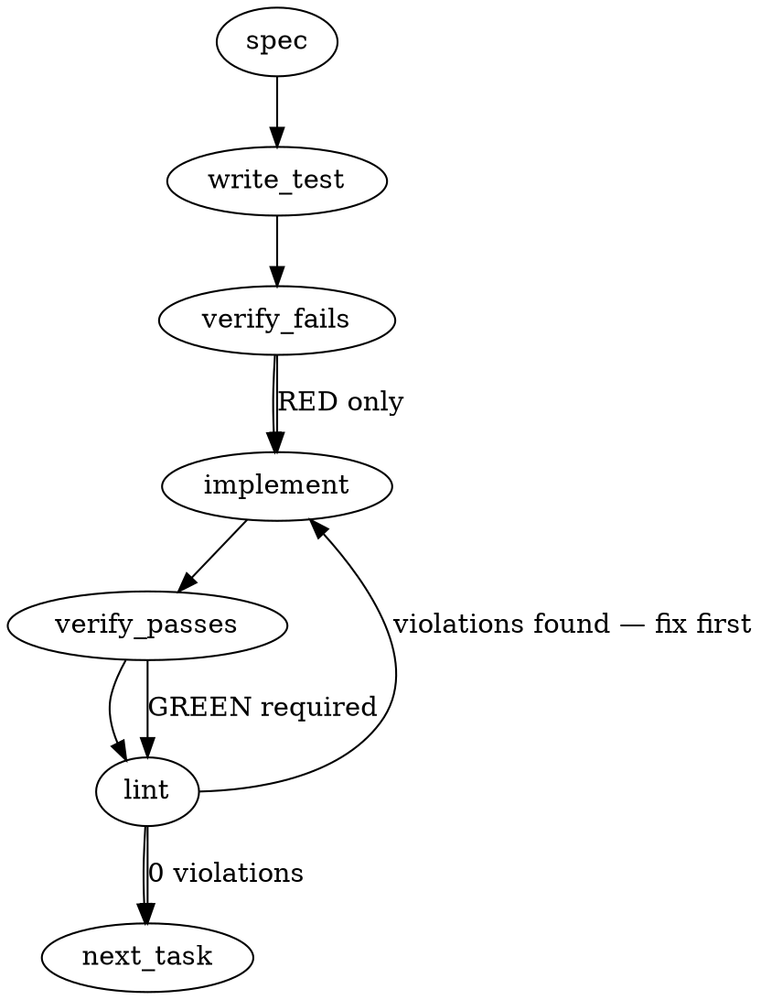

### Problem Statement

The `totem review` and `totem lint` commands compute their diffs against the local default branch (e.g., `main...HEAD`). Because the local default branch is frequently stale in feature-branch workflows, this approach incorrectly re-includes already-merged code into the diff, manufacturing false-CRITICAL gate failures and artificially triggering the 50k diff truncation threshold.

### Architectural Context

- **Merge-Base Prior Art:** The `doctor-claim-discipline` command already encountered branch resolution traps. Its `resolveDiffChangedFiles` function implements a robust fallback sequence (trying `merge-base HEAD @{upstream}`) to avoid stale local refs. We must lift and standardize this approach for the review diffs.
- **Lazy Load CLI Imports:** The `It Never Happens Again` documentation and `verifyLockfileSyncCommand` code demonstrate that CLI commands strictly enforce lazy-loaded static imports (`await import(...)`) to maintain CLI startup performance.

### Files to Examine

1. `packages/totem/src/git.ts` — Contains the `REVIEW_DIFF_TRUNCATION_THRESHOLD` and the core diff generation logic for reviews. This is where the fix lives.
2. `packages/cli/src/commands/doctor-claim-discipline.ts` — Review the `resolveDiffChangedFiles` function to see the existing prior art for robust `merge-base` resolution.

### Technical Approach & Contracts

To guarantee the diff only contains net-new changes for the PR, we must shift from a hardcoded `<local-default>...HEAD` approach to an active `merge-base` computation against the upstream tracking ref.

**Contracts & Utility Types:**

```typescript
// Proposed interface for the new helper in packages/totem/src/git.ts
export interface ResolveMergeBaseOptions {
  cwd: string;
  defaultBranch: string;
  timeoutMs?: number; // Default 3000
}

export function resolveReviewBase(options: ResolveMergeBaseOptions): string;
```

**Sequence Logic (`resolveReviewBase`):**

1. **Fetch (Best Effort):** Attempt a fast `git fetch origin <default-branch>` with a strict 3-second timeout. Swallow errors (handles offline/airgapped/missing origin).
2. **Upstream Merge Base:** Attempt `git merge-base HEAD origin/<default-branch>`.
3. **Local Merge Base (Fallback 1):** Attempt `git merge-base HEAD <default-branch>`.
4. **Direct Ref (Fallback 2):** If all `merge-base` calls fail (e.g., disconnected history or initial commits), fallback to `<default-branch>`.

**Applying the Base:**
Update the diff generation function (which emits `Diff source: branch-vs-base (main...HEAD)`) to call `resolveReviewBase`. Construct the diff using `git diff <resolved-base>...HEAD` (or `<resolved-base>` if working-tree changes are desired, matching existing behavior) instead of the hardcoded branch name.

### Edge Cases & Traps

- **Airgapped / Offline Executions:** The `git fetch` operation _will_ hang or fail if the network is down or the origin is unreachable. It must be wrapped in `safeExec` with a `timeout` option and a `try/catch` that silently proceeds to the local fallback.
- **Detached HEAD / CI:** In some CI environments, the checkout might be detached, or `origin/main` might not be fetched by the default checkout action. The fallback cascade to standard `merge-base` must safely handle this.
- **Log Verbiage Regressions:** The truncation log currently prints `(main...HEAD)`. If you replace `main` with a raw commit hash (e.g., `a1b2c3d...HEAD`), ensure the log remains legible and traceable for debugging.

### Implementation Tasks

- [ ] **Task 1: Implement `resolveReviewBase` utility**
  - **Files:** Modify `packages/totem/src/git.ts`, update tests in `packages/totem/src/__tests__/git.test.ts`.
    > TEST DIRECTIVE: Before implementing, write a failing test named `resolveReviewBase falls back to local merge-base when fetch fails` that proves network failures do not crash the resolution.
  - Implement `resolveReviewBase(cwd: string, defaultBranch: string)` following the sequence logic outlined above.
  - Use `safeExec` exclusively for all shell calls (pass `{ timeout: 3000 }` to the fetch command).
  - write test → verify fails → implement → verify passes → lint

- [ ] **Task 2: Wire merge-base into Review Diff Generation**
  - **Files:** Modify `packages/totem/src/git.ts` (locate the review diff function handling `REVIEW_DIFF_TRUNCATION_THRESHOLD`). Modify CLI consumers if necessary.
    > TOTEM INVARIANT (Lazy load CLI commands): If modifying any file in `packages/cli/src/commands/`, all imports to `@mmnto/totem` or core modules MUST be dynamically imported inside the command execution function.
    > TEST DIRECTIVE: Before implementing, write a failing test named `review diff uses resolved merge-base instead of hardcoded default branch` that proves the underlying git call uses the exact output of `resolveReviewBase`.
  - Update the diff generation logic to retrieve the default branch via `getDefaultBranch(cwd)`.
  - Resolve the true base via `resolveReviewBase`.
  - Update the `git diff` arguments to use the resolved base commit.
  - Update the "Diff source: branch-vs-base" log to print `(${defaultBranch} [${resolvedBase.slice(0, 7)}]...HEAD)`.
  - write test → verify fails → implement → verify passes → lint

### Execution Flow (structural constraint)



### Verification (MANDATORY — do not skip)

Every implementation MUST end with these steps:

1. `totem lint` — deterministic rule check (zero LLM, ~2s). Fixes any violations.
2. `totem review` — AI-powered architectural review (~18s). Addresses any critical findings.
3. If using MCP, call `verify_execution` to confirm compliance before declaring the task done.

### Test Plan

- **Offline Fallback:** Mock `safeExec` to throw an error on `git fetch`, ensuring the function continues and returns the local `merge-base`.
- **Stale Local State:** Mock `git merge-base HEAD origin/main` to return `commit-A` and `git merge-base HEAD main` to return `commit-B`. Assert that `resolveReviewBase` prefers `commit-A`.
- **End-to-End Truncation Bypass:** In an integration context or CLI test, mock the returned diff for the accurate base to be under 50,000 characters, proving that the `REVIEW_DIFF_TRUNCATION_THRESHOLD` warning is successfully avoided when merged code is stripped out.

---

> **⚠️ The generated spec above over-builds.** It assumes a new `resolveReviewBase` helper in
> `packages/totem/src/git.ts` with a best-effort `git fetch`. Ground truth (read this session): the
> bug has a **single root site** and three-dot diff already gives merge-base semantics, so the fix is
> a **ref-order reorder**, not a new function + network call. Build to the design below.

## Implementation Design (totem-claude, 2026-06-03)

### Root cause (verified against code, not the issue prose)

`getGitBranchDiff` — `packages/core/src/sys/git.ts:120-146` — builds `const refs = [baseBranch,
\`origin/${baseBranch}\`]`and returns the **first** ref whose`git diff ${ref}...HEAD`succeeds. The
**local**`<default>`is tried first; on a feature-branch workflow that ref is never checked out, so
it's **stale** (or absent).`git diff main...HEAD`against a stale local`main`*succeeds* (doesn't
throw) and three-dot resolves merge-base(stale-main, HEAD) = stale-main → the diff **re-includes
already-merged code** → false-CRITICALs (#2054) + inflated diff hitting the 50k truncation. The
remote-tracking`origin/<default>` is only reached when the local ref **throws** (absent). Single fix
site; **`review`+`lint`both inherit it** through the shared`getDiffForReview` (`cli/git.ts:179`),
and `verify-badges` (`verify-badges.ts:55`) too.

### Scope (2 sentences)

Reorder `getGitBranchDiff`'s ref preference to **`origin/<default>` first, local `<default>` as
fallback**, so the implicit `branch-vs-base` diff is computed against the current remote base instead
of a stale local ref. It will **NOT** add a `resolveReviewBase` function, **NOT** introduce a network
`git fetch` into the gate path (strategy gate-no-fetch steer, T0156Z), and **NOT** touch the
`--diff` / `--staged` / uncommitted paths (only the `branch-vs-base` fallback).

### Data model deltas

None. No new types, fields, or state containers — a one-line reorder of an existing local `refs`
array, plus its comment + the `TotemGitError` recovery-hint wording, plus an honesty tweak to the
cli `Diff source: branch-vs-base (…)` log so it names the resolved ref. (The spec's heavier cascade
WOULD add a `resolveReviewBase` export + a transient fetch failure mode — this design rejects that.)

### State lifecycle

None — `getGitBranchDiff` is a pure per-invocation git read; no state crosses a boundary.

### Failure modes

| Failure                                                         | Category  | Agent-facing surface                                                                                        | Recovery                                          |
| --------------------------------------------------------------- | --------- | ----------------------------------------------------------------------------------------------------------- | ------------------------------------------------- |
| `origin/<default>` ref absent (no remote / shallow CI no-fetch) | runtime   | falls through to local `<default>` (today's behavior)                                                       | preserves CI-origin-only + offline paths          |
| both `origin/<default>` and local `<default>` absent            | runtime   | `TotemGitError` + `git fetch origin <base>` hint (unchanged)                                                | user fetches / passes `--base`                    |
| `origin/<default>` stale (user hasn't fetched)                  | transient | correct-but-slightly-old base — strictly fresher than never-updated local `main`; no forced fetch by design | user `git fetch` (out of scope; not a regression) |
| `getDefaultBranch` can't resolve                                | runtime   | existing `TotemGitError` (unchanged)                                                                        | `git remote set-head` / `--base`                  |

No new silent-degradation path (Tenet 4) — the reorder only changes **which** ref wins when both exist.

### Invariants to lock in via tests

- Both refs exist **and diverge** (local stale) → diff computed against **`origin/<default>`**; the
  already-merged code is **not** re-included.
- `origin/<default>` **absent** → falls back to local `<default>`, no throw (CI/offline preserved).
- **Neither** exists → existing `TotemGitError` (with fetch hint) still throws.
- `review` and `lint` both inherit the fix via the shared `getDiffForReview`.
- Three-dot semantics preserved: base is `origin/<default>...HEAD` (merge-base-relative), not two-dot.

### Open questions

1. **Approach — minimal ref-flip vs the spec's `resolveReviewBase` + best-effort fetch.**
   - **(a)** Reorder to origin-first, no fetch, no new API **[rec]**; **(b)** new `resolveReviewBase`
     with `git fetch origin <default>` (3s timeout) + merge-base cascade.
   - **Rec: (a).** Three-dot already yields merge-base semantics, so origin-first is sufficient and
     correct; a forced fetch contradicts strategy's gate-no-fetch steer, adds gate latency + a network
     failure surface, and origin-first is strictly better than today even with a slightly-stale
     origin. (b) stays a later opt-in if origin-staleness ever bites.
2. **Lesson inversion — `lesson-8d9946e1` ("local refs before remote-tracking… _unless a full audit
   of stale merge-base risks is performed_").** This fix IS that audit, counterbalanced by the
   CI/`origin`-fallback lessons. No compiled rule enforces ref-order (verified against
   `compiled-rules.json`), so `totem lint` won't flag it — but `totem review` + bots will see the
   tension. **Rec:** document the inversion inline at the reorder site (a comment citing #2054 + the
   audit) and in the PR body; no `totem-ignore`.
3. **Blast radius — `verify-badges` also calls `getGitBranchDiff`.** Reorder benefits it too (it
   wants the true base), but it's a behavior change to a second gate. **Rec:** accept it; add a
   regression assertion that verify-badges' diff resolves origin-first. Confirm acceptable.
