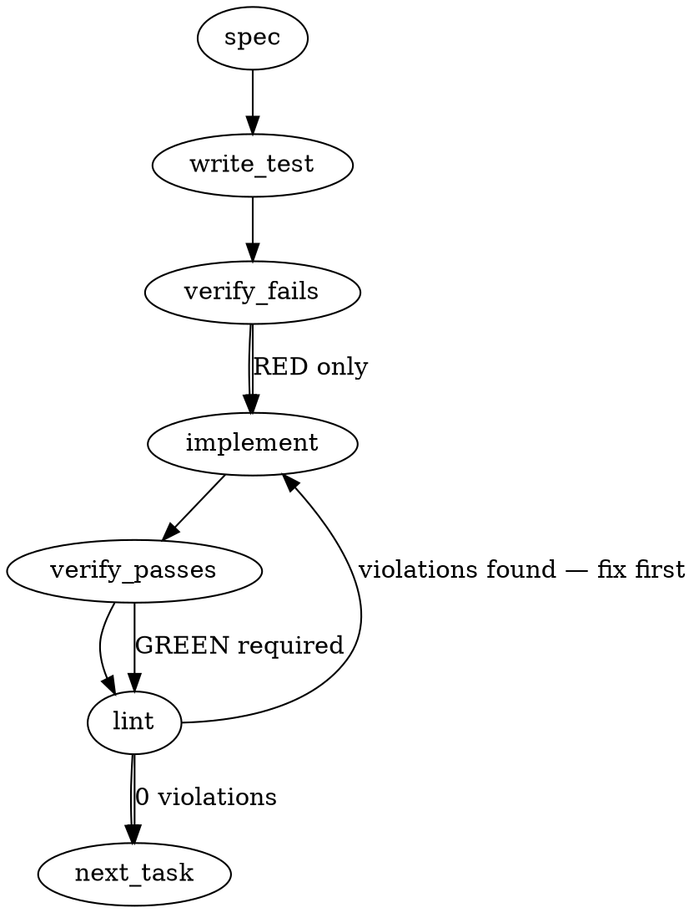

### Problem Statement

The `totem doctor --parity` feature currently only evaluates `version-pinned` contracts and leaves the remaining tractability classes incomplete. This task requires implementing the `mechanical` (structural/content diffing against local templates) and `manual-attestation` (informational skip) evaluation slices, overriding `governance-doctrine` evaluations to `info` to avoid network/access blindspots, and cutting a changeset to trigger the v1.53.3 release.

### Architectural Context

- **Strategy #448 & #511/#518 (Federation):** Cross-repo governance-doctrine reads are currently blocked by a canonical-vs-forkable design constraint and an access-class blind spot (Proposal 291 §5.2). Therefore, `governance-doctrine` verdicts MUST parse as `info` and never `fail` until this is resolved.
- **Dependency Isolation:** Mechanical diffs are restricted to LOCAL `node_modules` (`@mmnto/cli` templates) as a subset, explicitly avoiding remote network fetches.
- **License Correction (#2072):** This publish acts as the carrier for the corrected Apache-2.0 license.

### Files to Examine

1. `packages/core/src/parity-detect.ts` — Houses the existing `detectVersionPinnedContract`. The new `detectMechanicalContract` and `detectManualAttestationContract` must live here.
2. `packages/cli/src/commands/doctor-parity.ts` — Contains `checkParity()`, which iterates over the manifest. Needs routing logic to dispatch to the new detect functions based on tractability class.

### Technical Approach & Contracts

1. **Contract Definitions**:
   Extend the expected types (if not already fully defined) to handle tractability classes:

   ```typescript
   export type TractabilityClass = 'version-pinned' | 'mechanical' | 'manual-attestation';

   // Context signature identical to existing detectVersionPinnedContext
   export interface ParityDetectContext {
     repoId?: string;
     cwd: string;
     strict: boolean;
   }
   ```

2. **`detectManualAttestationContract`**: A pure function that always returns a verdict of `status: 'skip'` (or `'info'` if stale flags are present in the future). It never returns `'fail'`.
3. **`detectMechanicalContract`**:
   - Resolves the target file path in the consumer's repository.
   - Resolves the canonical template file path via local `node_modules/@mmnto/cli/templates/`.
   - Reads both files as strings.
   - Normalizes line endings (`\r\n` -> `\n`) and trims whitespace.
   - Performs a strict equality check. If they match, `status: 'pass'`. If they differ or the consumer file is missing, `status: 'fail'` (unless `strict` is false, in which case it may just warn).
4. **The Doctrine Override**: Immediately intercept any contract where `contract.id === 'governance-doctrine'` or `contract.class === 'doctrine'` (depending on exact schema) and force the final status to `'info'`, preventing cross-repo fetch failures from failing the doctor check.
5. **CLI Wiring**: Update `checkParity()` in `doctor-parity.ts` to switch on `contract.tractability` and route to the appropriate detector.

### Edge Cases & Traps

- **`ENOENT` Crashes**: Reading the local file or the template file will throw if the file doesn't exist. These exceptions must be caught and converted into a `'fail'` verdict (or `'info'` for doctrine), not allowed to crash the CLI process.
- **Cross-Platform Line Endings**: Windows `\r\n` vs Unix `\n` will cause false positive diffs. Both strings must be normalized before comparison.
- **Blind Spot Loophole**: Attempting to fetch from `totem-strategy` canonical sources will fail in environments without private repo access. The `governance-doctrine` info-override is a hard requirement to prevent `strict` mode CI failures across the cohort.

### Implementation Tasks

- [ ] **Task 1: Implement `detectManualAttestationContract` stub**
  - Modify `packages/core/src/parity-detect.ts`.
  - Add `export function detectManualAttestationContract(contract: ParityContract, ctx: ParityDetectContext): ParityContractVerdict`.
  - Hardcode the return payload to yield `{ status: 'skip', message: 'Manual attestation required (stub)' }`.
  - Add tests in `packages/core/src/__tests__/parity-detect.test.ts`.
  - write test → verify fails → implement → verify passes → lint

- [ ] **Task 2: Implement `detectMechanicalContract` core evaluation**
  - Modify `packages/core/src/parity-detect.ts`.
  - Add `export function detectMechanicalContract(contract: ParityContract, ctx: ParityDetectContext): ParityContractVerdict`.
  - Implement file reading: resolve consumer path (`ctx.cwd + contract.path`) and canonical path (`ctx.cwd + node_modules/@mmnto/cli/templates/...`).
  - Normalize line endings (`.replace(/\r\n/g, '\n')`) and perform string equality.
  - Wrap file reads in `try/catch` to handle `ENOENT` (yielding a `fail` verdict).
    > TEST DIRECTIVE: Before implementing, write a failing test named `detectMechanicalContract handles missing local files gracefully by returning a fail verdict instead of throwing` that proves the regression is caught.
  - write test → verify fails → implement → verify passes → lint

- [ ] **Task 3: Apply the `governance-doctrine` override**
  - Modify `packages/core/src/parity-detect.ts`.
  - At the end of `detectMechanicalContract` (or within an overarching routing wrapper), check if `contract.id === 'governance-doctrine'`.
  - If true, mutate the verdict status to `'info'` and prepend `[BLIND SPOT]` to the message, regardless of structural equality or missing files.
    > TEST DIRECTIVE: Before implementing, write a failing test named `forces info verdict for governance-doctrine contracts regardless of content mismatch` that proves the regression is caught.
  - write test → verify fails → implement → verify passes → lint

- [ ] **Task 4: Wire routing in `checkParity()`**
  - Modify `packages/cli/src/commands/doctor-parity.ts`.
  - Locate the loop evaluating `loadParityManifest()` contracts.
  - Add a `switch(contract.tractability)` statement.
  - Route `'version-pinned'` to `detectVersionPinnedContract`.
  - Route `'mechanical'` to `detectMechanicalContract`.
  - Route `'manual-attestation'` to `detectManualAttestationContract`.
  - Ensure the aggregated result correctly increments the pass/fail/skip counts based on the new verdicts.
  - write test → verify fails → implement → verify passes → lint

- [ ] **Task 5: Cut Release Changeset**
  - Create a new changeset file `.changeset/parity-completion.md`.
  - Mark a `patch` bump for `@mmnto/cli` (and any other affected packages) to trigger version `1.53.3`.
  - Add description: "Complete totem doctor --parity evaluation for mechanical and manual-attestation slices, and apply Apache-2.0 license."
  - write test (N/A) → verify fails (N/A) → implement → verify passes → lint

### Execution Flow (structural constraint)



### Verification (MANDATORY — do not skip)

Every implementation MUST end with these steps:

1. `totem lint` — deterministic rule check (zero LLM, ~2s). Fixes any violations.
2. `totem review` — AI-powered architectural review (~18s). Addresses any critical findings.
3. If using MCP, call `verify_execution` to confirm compliance before declaring the task done.

### Test Plan

- **Mechanical Equality:** Provide mock file systems where a consumer file matches a template perfectly (Unix to Unix), perfectly (Windows to Unix), mismatches slightly, and doesn't exist. Assert `pass`, `pass`, `fail`, `fail`.
- **Doctrine Fallback:** Evaluate a `governance-doctrine` mechanical contract with completely mismatched content and assert the final status is `info`.
- **Manual Attestation:** Provide a manual tractability contract and assert the doctor run increments the `skip` count.
- **Integration:** Run `checkParity()` against a fixture manifest containing all three tractability classes and assert the returned summary counts match expectations.

---

> **⚠️ The auto-generated spec above is directionally right but IMPRECISE — superseded by the Implementation Design below.** Five corrections the design encodes: (1) the canonical template is an **inline string export** (`SIGNOFF_SKILL_CONTENT`, `SKILL_MARKER_START`-delimited) compiled into the running `@mmnto/cli`, **not** a `node_modules/@mmnto/cli/templates/*.md` file; the doctor extracts the **managed-block between markers**, not a whole file. (2) Mechanical drift → **`warn`** (sensor-not-gate), unreadable-canonical → **`unknown`** (the Stale-Doctor-Paradox honest state), intentional-fork → **`info`** — **never `fail`** from the detector (`fail` is the CLI-edge `--strict`+`blocking` promotion only, exactly as PR-1 wired it). (3) `governance-doctrine`/`agent-memory-doctrine` are **`manual-attestation`** after strategy#526 — they route to the manual-attestation detector (skip/info), **not** a mechanical-override `[BLIND SPOT]` hack. (4) There is **no `contract.path` field** — the consumer artifact path is derived from the contract id/dimension. (5) Publish is the **#2073 tail**, not part of the first mechanical PR; the cohort floor is **1.53.5**, next bump 1.53.6.

## Implementation Design — Mechanical Slice (totem-claude, 2026-06-03)

> Built on the strategy-claude green-light (2026-06-04T0000Z, 3-lane BLIND round): the doctor is **strictly local-read-only** (Tenet 6) and must honor the 7 round-surfaced requirements. This is the **first** mechanical PR (call it PR-2), not the whole mechanical class — see the slice-width open question.

### Scope (2 sentences)

Add a **managed-block content-equality** detector (`detectMechanicalContract`) that compares a consumer's installed distributed artifact (the bytes **between** its `<!-- totem:…-start/-end -->` markers) against the running `@mmnto/cli`'s own canonical template, normalized for CRLF/LF + trailing whitespace, and reports a per-contract verdict in the new `pass`/`warn`/`info`/`unknown`/`skip` vocabulary — wired first for the **skills** contracts (`claude-skills`, `review-reply-skill-content`), the clean static-string case. It will **NOT** network (canonical is the in-process template — local-read-only), gate by default (drift → `warn`; only `--strict`+`blocking` promotes to `fail` at the CLI edge, unchanged from PR-1), handle the **parameterized hook** contracts (`git-hooks`, `session-start-orientation`) or the file-value-equality / structural-presence sub-classes (deferred — open Q1), add a version **sidecar** to skill/hook blocks (distribution-side; deferred — open Q2), or touch the manual-attestation slice / governance-doctrine / publish (the #2073 tail).

### Data model deltas

- **`ParityContractVerdict.status`** (existing union in `parity-detect.ts`) — **add `'info'` and `'unknown'`** → `'pass' | 'warn' | 'fail' | 'info' | 'unknown' | 'skip'`. Writer: the detectors. Reader: `doctor-parity.ts` render loop + `--strict` promotion. Invariant: the **detector** still never emits `'fail'` (CLI-edge only, unchanged); `'unknown'` is the Stale-Doctor-Paradox state (canonical unreadable → the doctor can't prove drift OR currency, so it self-reports ignorance rather than a false `pass`); `'info'` = intentional fork (req #7) — both are **non-gating** (never promoted, even under `--strict`).
- **`MechanicalArtifact` descriptor** (new, core, per managed-block contract) — `{ contractId; consumerPaths: string[]; markers: { start; end }; canonical: () => string }`. Holds: which on-disk file(s) a contract maps to + the marker pair + a thunk returning the running doctor's canonical block. Writer: a static registry in core keyed by contract id (only the contracts this slice handles resolve one; others → `skip`, mirroring `packageNameForContract`'s undefined-gates-skip pattern). Reader: `detectMechanicalContract`. Invariant: a contract with no registry entry is **out of slice** → `skip`, never a fabricated verdict.
- **`ParityDetectContext`** addition — the mechanical detector needs `cwd` (consumer root) + a `readFile` seam + the running-`@mmnto/cli` `version` **and resolved binary path** (for req #6 hash reporting **and** the req-#5 self-report). Reuse the injectable-seam style already in `DetectVersionPinnedContext` (every fs read injectable for fixture tests).
- **Binary self-report (req #5, skills collapse — confirmed strategy 0158Z).** For the in-process skills canonical there is no external artifact to resolve, so req #4 does not apply and req #5 collapses to a **one-line provenance self-report** on the verdict: "computed by `@mmnto/cli@<version>` at `<resolvedPath>`". This is the Stale-Doctor-Paradox guard for the case where the _doctor itself_ is a shadowed/stale global binary silently supplying a stale canonical — cheap, not a resolver cascade. The **full ADR-072 cascade (#4+#5) is the on-disk hooks case (PR-3)**, not skills.
- **Fork/override marker convention** (new, req #7) — `<!-- totem:fork reason="…" owner="…" attested="YYYY-MM-DD" -->` parsed from inside/adjacent to the managed block. Parsed into `{ reason; owner; attested }`. Writer: consumer (hand-added this PR; auto-distribution is later). Reader: the detector → drift becomes `info` (reported with the attested date), not `warn`. **Separate fields, not a reserved key** (per preflight collision guidance). Whitespace-tolerant regex (mirrors `REFLEX_VERSION_RE`).
- **No new state containers** (no module-level maps/singletons beyond the static `MechanicalArtifact` registry, which is a frozen const) — pure file-reading functions, matching `parity-detect.ts`.

### State lifecycle

- **`MechanicalArtifact` registry:** server-lifetime frozen const (like `DEP_FIELDS` / `MMNTO_SCOPE`), never mutated.
- **Read artifacts (consumer file bytes, canonical block, fork marker):** per-invocation, in-memory, discarded after the verdict renders. **Side-effect-free** (Tenet 13 sensor parity with PR-1 + the gate engine). No state crosses a lifecycle boundary.
- **The canonical block** is sourced from the **running doctor's own** compiled `init-templates.ts` export (the doctor _is_ the pinned `@mmnto/cli`), so "the canonical" lives the lifetime of the process — no fetch, no node_modules reach-in for the skills case.

### Failure modes

| Failure                                                                                | Category  | Agent-facing surface                                                                                                                        | Recovery                                                                                       |
| -------------------------------------------------------------------------------------- | --------- | ------------------------------------------------------------------------------------------------------------------------------------------- | ---------------------------------------------------------------------------------------------- |
| consumer artifact file absent (`.claude/skills/<n>/SKILL.md` missing)                  | runtime   | `skip` — "artifact not installed (cohort permits absence)"                                                                                  | `totem init` to install; or drift-`warn` once consumers verified (kept distinct, as PR-1 does) |
| consumer file present but **no start/end markers**                                     | runtime   | `warn` — "managed block markers absent — unmanaged/forked file"                                                                             | re-`init` or add a fork marker                                                                 |
| consumer block **differs**, no fork marker                                             | runtime   | `warn` — drift, reports both short content-hashes (req #6)                                                                                  | reconcile to canonical (re-`init`)                                                             |
| consumer block differs, **fork marker present**                                        | permanent | `info` — "intentional fork (attested YYYY-MM-DD, owner …)" — never `warn`/`fail`                                                            | n/a (attested)                                                                                 |
| canonical export **unreadable** (running binary lacks the template / corrupt)          | runtime   | **`unknown`** — "cannot resolve canonical from @mmnto/cli@<v> — verdict unprovable" + reports the **resolved binary path/version** (req #5) | re-install `@mmnto/cli`; surfaces a stale/shadowed binary instead of self-certifying           |
| consumer file read throws (EACCES etc.)                                                | runtime   | `skip`/`warn` (never crash) — degrade like `readPackageJson`                                                                                | fix perms                                                                                      |
| contract id not in the `MechanicalArtifact` registry (hooks, value-equality, presence) | init      | `skip` — "mechanical sub-class not yet implemented (<dimension>)"                                                                           | follow-on slice                                                                                |

- **No silent degradation** (Tenet 4): every path is a loud `warn`/`info`/`unknown`/`skip` line. The **`unknown`** state is the explicit anti-self-certification guard — an unreadable canonical is _never_ rendered as `pass`.

### Invariants to lock in via tests (fixtures, not the live cohort)

- Consumer block byte-equal to canonical after CRLF/LF + trailing-ws normalization → exactly one `pass`; a **CRLF consumer vs LF canonical that are otherwise identical → `pass`** (req #3 — the win32 false-positive guard, asserted explicitly).
- Consumer block differs, no fork marker → `warn`, message carries both short hashes; `--strict`+`blocking:true` on that contract → CLI renders `fail` + non-zero (reuse PR-1's `blockingDriftIds` edge, unchanged).
- Fork marker present + content differs → `info` (with attested date), **never `warn`/`fail`**, **never promoted** under `--strict`.
- Canonical unreadable → `unknown` (never `pass`, never `skip`); the verdict names the resolved `@mmnto/cli` version/path.
- Artifact file absent → `skip` ("cohort permits absence"), kept **distinct** from the not-a-consumer skip (the PR-1 distinction holds).
- Markers absent in a present file → `warn` (unmanaged), not `pass`.
- A contract with no registry entry → `skip` ("not yet implemented"), never a fabricated content verdict — the slice boundary is observable.
- Detector **never emits `fail`** (CLI-edge invariant preserved) and **never throws** (every read degrades) and **never networks** (no fetch, no node_modules reach-in for skills).

### Open questions (need judgment before coding)

1. **Slice width of the first mechanical PR.**
   - **Options:** (a) **skills only** (`claude-skills` + `review-reply-skill-content`) — the clean static-string case, full 7-requirement machinery, smallest blast radius; (b) skills **+** the parameterized hook contracts (`git-hooks`, `session-start-orientation`) — but those are generated per-repo (`buildResolveBlock`), so "content equality" needs a parameterization-aware normalizer (more design); (c) skills **+** the trivial **file-value-equality** bot-config contracts (`cr-profile`/`gca`/`greptile`) — different sub-class, but dead-simple (read a YAML/JSON key, compare to the manifest literal).
   - **Recommendation:** **(a) skills only.** It exercises every one of the 7 requirements on the cleanest substrate while the green-light guidance is fresh, ships real cohort value (skill drift is live — review-reply just changed in #497), and establishes the machinery (normalize + content-hash + fork-marker + `unknown`) that the hook and value-equality sub-classes reuse as fast-follows (PR-3 hooks, PR-4 value-equality + presence). The #2073 tail (manual-attestation + governance-doctrine info + publish) lands last and triggers the release.
2. **Sidecar now, or content-hash now + sidecar later (req #2).**
   - **Context:** reflexes already carry `<!-- totem:reflexes:version:N -->` (req #2's exact shape); **skills/hooks do not.** Content-hash satisfies req #2's _spirit_ (machine-readable bytes, **no prose-parsing**) without a version integer; a version sidecar adds "you're on v3, canonical is v5" precision and is what **#1854**'s versioned-upgrade engine needs to decide whether to re-distribute.
   - **Options:** (a) **content-hash now**, file the skill/hook version-sidecar as a follow-on **co-owned with #1854** (the sidecar's other consumer); (b) add the sidecar to skill/hook blocks in _this_ PR — but that's a distribution-side change + a cohort re-`init`, coupling the sensor to a distribution rollout.
   - **Recommendation:** **(a) content-hash now.** Ships drift detection without a cohort re-distribution; the sidecar graduates the verdict precision later, naturally bundled with #1854. The doctor still **reads + reports** the reflexes version where it exists.
3. **Fork/override marker shape (req #7).** Proposed `<!-- totem:fork reason="…" owner="…" attested="YYYY-MM-DD" -->`. This is a **new cross-vendor convention** — worth a one-line confirm before it sets precedent (it'll want a doctrine home in `bot-protocols.md`-adjacent or a new note, and eventually auto-distribution). **Recommendation:** ship the _reader_ in this PR (consumers hand-add); propose the convention to strategy-claude in parallel (their distribution/doctrine lane), don't block the sensor on it.

### Resolutions (2026-06-04 — strategy-claude dispatch 0158Z, in reply to my 0152Z)

- **Q2 — RESOLVED: content-hash-now (option a).** 292's machine-readable sidecar is the sensor input for the **doctrine rows** (`governance-doctrine`/`agent-memory-doctrine`, landing at `.totem/doctrine/`), **NOT** the skills/hooks mechanical blocks — for those the **content-hash IS the machine-readable record** (#2's spirit: bytes, zero prose-parsing). Coupling 292's sidecar into this slice would tie a sensor to a distribution rollout for zero sensor gain (Tenet 13 + Tenet 3). The skill/hook **version**-sidecar (the version integer) is **#1854's** versioned-upgrade lane; read+report the reflexes version where it already exists.
- **Q3 — RESOLVED: fork-marker shape approved, ship the reader.** 292 defers its sidecar schema to implementation (§5.1/§7 — not yet drafted), so there is nothing to match yet. The fork-marker (consumer's hand-added per-file `warn`→`info` deviation) and the 292 sidecar (publisher's generated currency record) are **siblings, not one block** — different author/lifecycle/purpose. strategy-claude owns the 292 schema and **commits to aligning field names** (shared `totem:` namespace, `attested` = ISO-8601, `owner` = same semantics) to `<!-- totem:fork reason="…" owner="…" attested="YYYY-MM-DD" -->`. No collision.
- **Q1 — slice width: pending satur8d.** strategy-claude concurs skills-only is clear to ship; the width call is satur8d's at the approval gate.
- **Req #5 refinement folded in** (see Data model deltas) — the skills verdict carries a one-line `@mmnto/cli@<v>` binary self-report (Stale-Doctor-Paradox guard for a shadowed doctor); the full ADR-072 cascade is deferred to the hooks PR (PR-3).

---

## Implementation Design — Hooks Slice / PR-3 (totem-claude, 2026-06-04)

> Built on strategy-claude's 2026-06-04T1734Z steer (relayed via satur8d): **stale-hook-version drift IS in scope** (the detection half of mmnto-ai/totem#1854; doctor detects, #1854 remediates — Tenet 13). The `git-hooks` manifest contract already specifies "match the current generator's output, not a frozen string." Reuses the shipped skills-slice machinery (verdict vocabulary, normalize/hash/fork-marker helpers) — this is mostly a CLI-side canonical-generation + a new presence-aware core detector.
>
> **Pre-coding accuracy correction (like the skills slice's 5):** the `git-hooks` manifest `canonical-source: …init-templates.ts#hooks` is **imprecise** — the git hooks are generated by `packages/cli/src/commands/install-hooks.ts` (`buildPrePushHook` / `buildPreCommitHook` / `buildHookContent` / `buildPostCheckoutHookContent` / `buildResolveBlock`), NOT `init-templates.ts`. The detector reads the **in-process generator output** (same as the skills detector reads the in-process template export, not the locator path); the locator is informational provenance. Flag to strategy as a manifest observation (their file) — not a blocker.

### Scope (2 sentences)

Add a presence-aware, **parameterized-canonical** content-equality detector for the `git-hooks` contract: for each of the four git hooks (`pre-commit`, `pre-push`, `post-merge`, `post-checkout`) under `.git/hooks/`, regenerate the canonical via the running `@mmnto/cli`'s own `build*Hook(getFallbackCommand(gitRoot), resolvedTier)` and compare to the on-disk hook, honoring presence semantics + the `pass`/`warn`/`info`/`unknown`/`skip` split. It will **NOT** handle the `session-start-orientation` contract (OQ1 — the cleaner whole-file-static `.claude`/`.gemini` SessionStart case; fast-follow PR-4 reuses the same whole-file primitive), hook-manager installs (`.totem/hooks/*.sh` for husky/lefthook/simple-git-hooks — OQ2), precise extraction of a totem block appended inside a user-modified pre-commit/pre-push hook (→ `unknown`, OQ3), the file-value-equality bot-configs / structural-presence dimensions, manual-attestation / governance-doctrine / publish (the #2073 tail), or add any version sidecar to hooks (content-hash IS the stale-detection; the version integer is #1854's lane).

### Data model deltas

- **`DetectGeneratedArtifactContext`** (new, core, `parity-detect.ts`) — `{ canonicalContent: string | undefined; consumerPath: string; ownershipMarker: string; endMarker?: string; binary?: {version; path}; readFile?: seam }`. Holds the regenerated canonical (CLI supplies it — core can't import cli's `install-hooks`, wrong dep direction, same constraint as skills), the consumer path, the totem **ownership/presence token** (e.g. `TOTEM_PREPUSH_MARKER` `[totem] pre-push hook`), and an optional **end marker** (post-merge/checkout have one; pre-commit/pre-push do not). Writer: `detectGeneratedArtifactContract`. Reader: same. Invariant: `canonicalContent === undefined` → `unknown`; never a fabricated verdict.
- **`detectGeneratedArtifactContract(ctx)`** (new, core, exported) — sibling to `detectMechanicalContract`. The managed-block detector won't serve hooks: (a) hooks use **whole-file** compare when totem-owned, not a marker-delimited slice; (b) **presence semantics differ** — a hook present _without_ a totem marker is a pure user hook → `skip` ("totem not installed here"), NOT the skills `warn`-unmanaged; (c) the start-only marker on pre-commit/pre-push breaks `extractManagedBlock` (needs both). Reuses the **exported** `normalizeManagedBlock` / `parseForkMarker` / `hashManagedBlock` (req #3/#6/#7) unchanged.
- **No new core type for the verdict** — reuses `ParityContractVerdict` (already `pass|warn|fail|info|unknown|skip`; detector never emits `fail`).
- **CLI (`doctor-parity.ts`)** — extend the `c.tractability === 'mechanical'` branch: route `c.id === 'git-hooks'` to a new `gitHookArtifactsFor(gitRoot, tier, fallbackCmd, build*Hook fns, markers)` that returns one descriptor per hook (canonical = `build<Hook>(fallbackCmd, tier)`, consumerPath = `.git/hooks/<name>`, ownershipMarker + endMarker per hook). Lazy-import `install-hooks` (build fns + marker consts + `getFallbackCommand`) on the `ok` path only (cold-start guideline, same as `init-templates`). `claude-skills` keeps `mechanicalArtifactsFor` unchanged.
- **Tier resolution (new CLI read):** resolve `tier` = `config.hooks?.tier ?? 'standard'` — the SAME resolution `hooksCommand` does. A hook on disk that doesn't match the **configured** tier is genuine drift (`warn`), which is correct (catches a strict-configured repo running a standard hook). Not an open question — a deliberate contract.

### State lifecycle

- **Canonical (regenerated hook content):** per-invocation, in-memory, discarded after the verdict. **No fetch, no node_modules reach-in** — generated from the running CLI's own `build*Hook` (the doctor IS the pinned `@mmnto/cli`; this is the ADR-072 "canonical generator = the resolved pinned binary" double-duty strategy noted).
- **`fallbackCmd` / `tier`:** derived per-invocation from the repo's lockfiles (`getFallbackCommand`) + config (`config.hooks?.tier`) — deterministic local reads, the same inputs the installer used, so a pnpm-vs-npm or tier difference never false-positives.
- **No new module-level state** — pure functions, side-effect-free (Tenet 13 sensor parity with PR-1 + the skills slice).

### Failure modes

| Failure                                                                                                                  | Category  | Agent-facing surface                                                                                                          | Recovery                                                                          |
| ------------------------------------------------------------------------------------------------------------------------ | --------- | ----------------------------------------------------------------------------------------------------------------------------- | --------------------------------------------------------------------------------- |
| canonical generator throws / returns empty (build fn bug, shadowed binary)                                               | runtime   | **`unknown`** — "cannot regenerate canonical hook from running @mmnto/cli — verdict unprovable" + binary self-report (req #5) | reinstall @mmnto/cli; surfaces a stale/shadowed doctor instead of self-certifying |
| consumer hook file absent                                                                                                | runtime   | `skip` — "git hook not installed (cohort permits absence)"                                                                    | `totem hooks` to install                                                          |
| hook present but **no totem ownership marker** (pure user hook)                                                          | runtime   | `skip` — "<name> hook present but not totem-managed — cohort permits absence" (presence semantics; NOT skills `warn`)         | n/a (user-owned)                                                                  |
| totem-owned whole-file hook **matches** regenerated canonical                                                            | —         | `pass` — "matches canonical — hash <h>" + binary self-report                                                                  | n/a                                                                               |
| totem-owned whole-file **differs**, no fork marker (incl. the stale pre-#2053 PATH-first resolve order — the #1854 case) | runtime   | `warn` — "drift — consumer <h> != canonical <h>" (both hashes)                                                                | re-run `totem hooks --force` to regenerate                                        |
| totem-owned whole-file differs, **`totem:fork` marker present**                                                          | permanent | `info` — "intentional fork (attested …, owner …)" — never `warn`/`fail`                                                       | n/a (attested)                                                                    |
| totem block **appended** inside a user hook, **end marker present** (post-merge/checkout)                                | runtime   | extract marker→endMarker block, normalize-compare → `pass`/`warn`/`info`                                                      | as above                                                                          |
| totem block **appended**, **no end marker** (pre-commit/pre-push) — can't cleanly isolate                                | runtime   | **`unknown`** — "totem block embedded in a user-modified hook — can't isolate for comparison" + binary self-report            | move totem hook to a manager / re-init; OQ3 may add precise extraction later      |
| consumer file read throws (EACCES)                                                                                       | runtime   | `skip` (never crash) — degrade like `readFileText`                                                                            | fix perms                                                                         |
| contract id not `git-hooks`/`claude-skills` (session-start, value-equality, presence)                                    | init      | `skip` — "not yet implemented for this sub-class"                                                                             | follow-on slice                                                                   |

- **No silent degradation (Tenet 4):** every path is a loud `pass`/`warn`/`info`/`unknown`/`skip`. `unknown` (canonical unprovable, or appended-can't-isolate) is the anti-self-certification guard — never rendered `pass`. **Detector never emits `fail`** (CLI-edge `--strict`+`blocking` only) and **never throws**.

### Invariants to lock in via tests (fixtures, not the live cohort)

- A pnpm+standard repo whose `.git/hooks/pre-push` is the current `buildPrePushHook('pnpm dlx @mmnto/cli','standard')` output → exactly one `pass`; the same content with CRLF line-endings → `pass` (win32 guard, req #3).
- **The #1854 stale-detection keystone:** a pre-push hook frozen at the **pre-#2053 PATH-first resolve order** (or any older generator output) → `warn` drift — the sensor MUST catch the most common real-world hook staleness. Asserted explicitly.
- **Parameterized canonical (no false drift):** an **npm** repo (`getFallbackCommand` → `npx @mmnto/cli`) whose hook matches `buildPrePushHook('npx @mmnto/cli','standard')` → `pass` — the detector regenerates with the repo's own `fallbackCmd`, so a pnpm-canonical does NOT false-`warn` an npm-repo hook.
- **Tier drift caught:** config `hooks.tier: strict` but the on-disk hook is the standard build → `warn` (genuine drift against the configured tier).
- Hook absent → `skip`; a present hook with no `[totem]` marker → `skip` (NOT `warn`); a `totem:fork`-marked divergent owned hook → `info` (never promoted under `--strict`).
- Appended pre-push (totem block after user content, no end marker) → `unknown`, **never a false `warn`**; appended post-merge (has end markers) → extracts + compares correctly.
- Canonical generator throwing → `unknown` (never `pass`, never a crash). Detector **never emits `fail`**, **never throws**, **never networks**.
- A `git-hooks` `warn` under `--strict`+`blocking:true` → CLI renders `fail` + non-zero, tagged once at the contract id (reuse PR-1/skills `blockingDriftIds` edge, unchanged); `info`/`unknown` never promote.

### Open questions (need judgment before coding)

1. **Slice width.** (a) **`git-hooks` only** — the parameterized + stale-resolver-detection heart strategy steered on; (b) `git-hooks` + `session-start-orientation` (whole-file-static `.claude`/`.gemini` SessionStart — cleaner, but two vendor-file artifacts + the question of whether totem's own custom `session-context.mjs` counts as the contract or is dogfooding-only). **Recommendation: (a).** It carries the high-value #1854 detection and the new presence-aware whole-file primitive; session-start is a fast-follow PR-4 that reuses that primitive on a simpler (unparameterized) substrate.
2. **Hook-manager installs.** Check `.git/hooks/*` only (the cohort's no-manager case) vs also `.totem/hooks/*.sh` (husky/lefthook/simple-git-hooks). **Recommendation: `.git/hooks/*` only for PR-3**, `log` the limitation (no-silent-caps); add the `.totem/hooks/*.sh` path as a follow-on if any cohort consumer adopts a manager (none do today). The detector's "present-without-marker → skip" already keeps a manager repo honest (no false drift).
3. **Appended-hook (no end marker) handling.** `unknown` (claim-class-tight — assert only what we can prove) vs reuse `upgradePrePushHookIfNeeded`'s if/fi-depth balancer to extract the block precisely vs add end-markers to the pre-commit/pre-push templates. **Recommendation: `unknown` for PR-3.** Adding end-markers couples the sensor to a cohort re-distribution (strategy's Q2 resolution explicitly rejected that coupling); the if/fi balancer is real complexity better justified once we see a real appended-hook cohort case. `unknown` is honest and matches the Stale-Doctor-Paradox philosophy.

---

## Implementation Design — Manual-Attestation Slice / PR-5 (totem-claude, 2026-06-04)

> The completing **detection** slice before the orientation fast-follow + the changeset/publish that closes #2073. Replaces the manual-attestation `stub` (`doctor-parity.ts` ~L509–512, currently `skip` "drift detection not yet implemented") with the honest non-gating surface the canonical manifest's `detection-method` specifies. Grounded in the four real `tractability: manual-attestation` contracts in `mmnto-ai/totem-strategy:doctrine/parity-manifest.yaml` (read on disk, not memory).
>
> **The four contracts split into TWO sub-classes** (verified against the manifest):
>
> - **Doctrine rows** — `governance-doctrine`, `agent-memory-doctrine`: `package` UNSET, `canonical-source` is a cross-repo `mmnto-ai/totem-strategy:AGENTS.md[#memory-model]` the **local-read-only** doctor must not fetch (the 3-lane BLIND gate). Detection-method: _"surfaces 'last attested <date/SHA>' and flags staleness only (no pin mechanism yet)."_ Graduate to `version-pinned` when strategy#511 doctrine-distribution ships.
> - **Vendor-SDK couplings** — `google-genai-coupling` (`@google/genai`), `anthropic-sdk-coupling` (`@anthropic-ai/sdk`, `consumers: [totem, liquid-city]`): `package` SET → the doctor **can** read the consumer's local pin. Detection-method: _"surfaces each consumer's pin + last-attested; flags staleness only."_ No agreed cohort floor (Tenet 16 — attest, do not enforce).

### Scope (2 sentences)

Add a core `detectManualAttestationContract(contract, ctx)` detector (sibling to `detectVersionPinnedContract` / `detectMechanicalContract`) whose verdict ceiling is **`info` or `skip` ONLY — never `pass`/`warn`/`fail`/`unknown`** (the claim-class floor: there is no mechanical sensor, so the doctor may surface and flag, never assert drift or currency), wired into the `c.tractability === 'manual-attestation'` CLI branch for both sub-classes: doctrine rows → an `info` doctrine-currency surface (no cross-repo read); vendor-SDK couplings → an `info` that reuses the version-pinned `package.json` range + installed-version read **minus the floor compare** (reuse `findDeclaredRange` + `resolveInstalledVersion`). It will **NOT** compute a date-based **staleness flag** (no `attested` field exists in the schema yet — Tenet 19, deferred to a follow-on gated on a strategy `last-attested:` field), read any cross-repo `canonical-source` (local-read-only), emit `pass`/`warn`/`fail` from this detector (structurally cannot gate, even under `--strict`), touch the orientation fast-follow or the changeset/publish (the remaining #2073 tail), or add a `last-attested` schema field (strategy's manifest lane).

### Data model deltas

- **`DetectManualAttestationContext`** (new, core, `parity-detect.ts`) — `{ cwd: string; repoId?: string; packageName?: string; canonicalSource: string | null; attested?: string; readPackageJson?: seam; resolveInstalled?: seam }`. Holds: consumer root (vendor-SDK pin read), the cohort repo id (consumers-scope guard), the contract's explicit `package` (sub-class discriminant — set ⇒ vendor-SDK, unset ⇒ doctrine row), the `canonicalSource` (doctrine-row info surface text only, **never resolved as a path**), and an OPTIONAL `attested` ISO date (absent today — the schema has no field; reserved seam for the staleness follow-on so its shape is locked now). Writer: the CLI branch. Reader: `detectManualAttestationContract`. Invariant: `attested === undefined` ⇒ "last attested: not recorded", **never** a fabricated date or a staleness verdict.
- **`detectManualAttestationContract(contract, ctx)`** (new, core, exported) — returns `ParityContractVerdict` constrained to `{ status: 'info' | 'skip', … }`. Reuses (no new code) the module-private `findDeclaredRange` / `resolveInstalledVersion` / `readPackageJson` already in `parity-detect.ts` (same file). Reuses the **consumers-scope guard** verbatim from `detectVersionPinnedContract` (repoId-unresolvable → `skip`; not-in-consumers → `skip` "cohort permits absence").
- **No new verdict status** — reuses `ParityContractVerdict` (the `info`/`skip` subset of the existing `pass|warn|fail|info|unknown|skip` union; the detector simply never constructs the other four).
- **No new state containers** — pure file-reading function, side-effect-free (Tenet 13 sensor parity with PR-1/skills/hooks).
- **CLI (`doctor-parity.ts`)** — replace the fall-through `stub(...)` with an explicit `if (c.tractability === 'manual-attestation')` branch calling the detector with `{ cwd, repoId, packageName: c.package, canonicalSource: c.canonicalSource }` (no `attested` yet). A truly-unknown future tractability still hits the `stub` fall-through (the slice boundary stays observable). `info` never enters `blockingDriftIds` (only `warn`+`blocking` does — unchanged), so manual-attestation is **structurally incapable of failing** `--strict`, which IS the contract.

### State lifecycle

- **Read pin (vendor-SDK declared range + installed version):** per-invocation, in-memory, discarded after the verdict. Local-only `package.json` + `node_modules` reads (the SAME reads the version-pinned detector does), no fetch.
- **Doctrine-row path:** reads **nothing** on disk — emits the info surface purely from the contract fields (`canonicalSource`, `trackingIssue`). The local-read-only invariant is satisfied trivially (zero I/O).
- **No new module-level state** — no maps/singletons; matches `parity-detect.ts`.

### Failure modes

| Failure                                                                                  | Category  | Agent-facing surface                                                                                                                                                                             | Recovery                                                  |
| ---------------------------------------------------------------------------------------- | --------- | ------------------------------------------------------------------------------------------------------------------------------------------------------------------------------------------------ | --------------------------------------------------------- |
| repoId unresolvable, contract has `consumers`                                            | runtime   | `skip` — "cannot determine applicability — repo id unresolvable; scoped to [consumers]"                                                                                                          | resolve repo id (run in a cohort repo)                    |
| repoId not in `consumers` (e.g. `anthropic-sdk-coupling` outside `[totem, liquid-city]`) | runtime   | `skip` — "cohort permits absence here (<repoId> not in consumers)"                                                                                                                               | n/a (not an applicable consumer)                          |
| vendor-SDK: `package` declared + installed resolvable                                    | runtime   | `info` — "<pkg> coupling tracked — declared <range>, installed <version>; no cohort floor (Tenet 16, attest only). last attested: not recorded"                                                  | n/a (visibility surface)                                  |
| vendor-SDK: `package` declared, installed UNresolvable                                   | runtime   | `info` — "<pkg> coupling tracked — declared <range>, installed: unresolved; attest only"                                                                                                         | `pnpm install` to resolve                                 |
| vendor-SDK: applicable consumer but `package` NOT declared in `package.json`             | runtime   | **`skip`** — "<pkg> coupling not present here (cohort permits vendor spread)" — **NOT `warn`** (the key difference from version-pinned's applicable-but-missing: manual-attestation never warns) | n/a (vendor spread is permitted)                          |
| doctrine row (`package` unset)                                                           | permanent | `info` — "doctrine currency tracked — <canonicalSource>; no local pin mechanism (pending strategy#511). last attested: not recorded"                                                             | n/a (graduates to version-pinned when distribution ships) |
| consumer `package.json` read throws (EACCES)                                             | runtime   | `skip` (never crash) — degrade like `readPackageJson` returning undefined                                                                                                                        | fix perms                                                 |

- **No silent degradation (Tenet 4):** every path is a loud `info`/`skip` line. There is no `pass` (no currency claim to make), no `warn`/`fail` (no mechanical sensor — gating an unprovable predicate is the ADR-109 anti-pattern), and no `unknown` (the detector isn't _trying_ to prove a canonical and failing — it is definitionally non-mechanical, so `info`/`skip` is the honest pair).

### Invariants to lock in via tests (fixtures, not the live cohort)

- **Claim-class ceiling (the keystone):** across **every** branch + input, `detectManualAttestationContract` emits ONLY `'info'` or `'skip'` — **never** `pass`/`warn`/`fail`/`unknown`. Asserted exhaustively (a property-style sweep over all four real contracts + the absent/unresolvable cases).
- Vendor-SDK with `package` declared + installed → `info` whose message names the package, the declared range, and the installed version, and states "no cohort floor (attest only)".
- Vendor-SDK applicable consumer with `package` **absent** from `package.json` → `skip`, **not `warn`** (explicitly asserted — this is the contract's "attest, do not enforce" boundary; a false `warn` here would be the over-claim).
- `anthropic-sdk-coupling` in a repo **not** in `consumers: [totem, liquid-city]` → `skip` "cohort permits absence"; repoId unresolvable → `skip` (consumers-guard parity with version-pinned).
- Doctrine row (`governance-doctrine`) → `info` naming `canonicalSource` + the pending-pin (strategy#511) note, and **no read of the `canonicalSource` path is attempted** (assert via a throwing `readFile` seam that the doctrine path never calls it — proves local-read-only).
- `attested` absent → message reads "last attested: not recorded"; **no fabricated date, no staleness verdict** (Tenet 19). (Forward-compat: an `attested` present still yields `info`, never a `warn` — staleness is a _message_ refinement, not a status change.)
- Under `--strict` + `blocking:true`, a manual-attestation `info` **never** promotes to `fail` and never enters `blockingDriftIds` — structurally cannot gate.
- Detector **never throws** (package.json read degrades to `skip`).

### Open questions (need judgment before coding)

1. **Staleness-date source / scope (load-bearing — the input gap).** The manifest's detection-method says "flags staleness," but **no `attested`/`last-attested` field exists in the schema today**, so a _computed_ staleness flag isn't buildable without fabricating a date (Tenet 19).
   - **Options:** (a) **surface-only now** — ship the `info` surfaces with "last attested: not recorded", defer date-staleness to a follow-on gated on a strategy `last-attested:` schema field (the `attested` seam is reserved in the context now so it's a drop-in); (b) block this slice on strategy adding the field first.
   - **Recommendation: (a).** It ships the honest never-warn surface + the claim-class ceiling now, **unblocks the publish** (the #2073 tail), and leaves staleness as a clean drop-in. Flag the `last-attested:` schema addition to strategy in parallel (their manifest lane — same against-the-schema clause that added `package`/`consumers`). Couples nothing to a cohort re-distribution.
2. **Verdict ceiling per sub-class — `info`, not `pass`/`skip`.** Should a healthy vendor-SDK pin read `pass` (reassuring) and a doctrine row `skip` (quiet)?
   - **Recommendation: `info` for both.** A vendor-SDK `pass` would imply a **currency assertion the contract explicitly disclaims** ("no agreed cohort floor; attest, do not enforce") — the detector must not manufacture a pass it can't back (the claim-class through-line from the #2079 Greptile round). A doctrine `skip` would hide the pending-deliverable the contract exists to make _visible_ ("doctrine-currency visibility") — `info` honors the detection-method's "surfaces" intent. `info` is the one honest verdict for both: present, non-gating, no overclaim.
3. **Slice width — both sub-classes in this one slice?**
   - **Recommendation: yes, both.** They share the single `manual-attestation` branch + the `info`/`skip`-only ceiling; the vendor-SDK pin-read is a thin reuse of shipped version-pinned machinery. Replacing the whole tractability stub in one slice is the clean completing **detection** unit; the orientation fast-follow (whole-file `.claude`/`.gemini` SessionStart, reusing the #2079 primitive) + the changeset/publish are the remaining #2073 tail after this.

### Resolutions (2026-06-04T2045Z — strategy-claude concur; satur8d + strategy signed off → cleared to build)

- **OQ1 — RESOLVED: surface-only now.** Ship the `info` lines reading "last attested: not recorded" + reserve the `attested?: string` seam in the detector context. **strategy owns the follow-on** `last-attested:` field added to each manual-attestation contract (separate small `parity-manifest.yaml` PR; non-blocking on this slice; the seam reads it when it lands). **No local currency signal ships today** (the 292 §9 / #530 doctrine sidecar is the right eventual home but isn't distributed — Proposal 292 Active, impl pending; `totem:corroborate` isn't emitted yet), so do NOT couple this slice to a distribution rollout (same Q2 logic as the mechanical slice).
- **Seam-shape nuance to bake in (strategy 2045Z):** the two **doctrine rows graduate OFF manual-attestation entirely** → `version-pinned` when 292 doctrine-distribution ships (#511 / #526), so `last-attested:` is a **stopgap** for them. The **vendor-SDK couplings stay manual-attestation indefinitely** (no agreed cohort floor — attest-don't-enforce is their honest end state), so the seam is most **durable** there. Concretely: the doctrine-row `info` message should name the **transient** posture (e.g. "tracked pending 292 graduation to version-pinned" rather than implying permanent attestation); the vendor-SDK `info` is the durable attest-only surface.
- **OQ2 — RESOLVED: `info` for both (strong concur).** A vendor-SDK `pass` manufactures a currency claim the contract disclaims; a doctrine `skip` hides the pending-deliverable the row exists to surface. `info` is the one honest, non-gating verdict (the #2079 Greptile claim-class through-line).
- **OQ3 — RESOLVED: one slice, both sub-classes (concur).** Shared branch + `info`/`skip` ceiling; the Tenet-21 completing detection cut.
- **Net:** the `info`/`skip`-only never-fail ceiling (structurally cannot enter `blockingDriftIds`) is the right claim-class boundary — surface + flag, never assert. Completes the doctor (#448) detection layer; unblocks the publish that closes #2073.

---

## Implementation Design — Orientation Fast-Follow + Completing Slice / PR-6 (totem-claude, 2026-06-04)

> The **completing slice** that closes #2073. Per strategy-claude's 2323Z advice — do the orientation fast-follow and **fold it into the completing slice** so #2073 closes with full drift-coverage (all 3 tractability classes **plus** whole-file SessionStart parity) in **ONE publishable cut**. **Cost-call (mine, RESOLVED → fold in):** the #2079 `detectGeneratedArtifactContract` reuses cleanly — a 1-line principled generalization of `isOwnedGeneratedFile` + CLI wiring that mirrors the git-hooks branch on a **simpler** (static, unparameterized) substrate. Not a balloon → strategy's escape-hatch (separate fast-follow) is NOT needed.
>
> **Artifacts (verified on disk):** the two whole-file-static SessionStart hooks — `.claude/hooks/SessionStart.cjs` (canonical `CLAUDE_SESSION_START`) + `.gemini/hooks/SessionStart.js` (canonical `GEMINI_SESSION_START`), both opening with the `// [totem] auto-generated` marker. Unlike git-hooks these are **not parameterized** (no package-manager / tier substitution) — the canonical is a static in-process string. In THIS repo `.gemini/...js` exists; `.claude/...cjs` does not (→ honest `skip` — cohort permits absence).

### Scope (2 sentences)

Wire the `session-start-orientation` mechanical contract into the doctor-parity mechanical branch via the **reused** `detectGeneratedArtifactContract`, for the two whole-file SessionStart hook artifacts (static canonical from `CLAUDE_SESSION_START` / `GEMINI_SESSION_START`, ownership marker `// [totem] auto-generated`, no end marker), with one small core generalization so a marker-at-file-start JS template reads as **owned** (the shell-shebang heuristic doesn't fit JS), and **carry the completing-slice changeset** that closes #2073. It will **NOT** parameterize the canonical (static — no `fallbackCmd`/tier), add a version sidecar, verify the `.claude/settings.json` hook **registration** (`CLAUDE_SESSION_START_ENTRY` — a structural-presence sub-class, deferred), touch hook-manager paths, or carry any license payload (Apache-2.0 already on `@latest`).

### Data model deltas

- **`isOwnedGeneratedFile(content, marker)`** (core, `parity-detect.ts`) — **generalize**: today it returns `true` only when the marker is preceded by a shell shebang (`/^#![^\n]*\n#[ \t]*$/`). Extend to ALSO return `true` when nothing meaningful precedes the marker (`before.trim().length === 0`) — the whole-file JS templates whose `// [totem] auto-generated` marker **opens the file** (no shebang). Preserves both prior cases: a shell hook (`#!/bin/sh\n# <marker>`) still matches the shebang branch; an **appended** totem block (user content before the marker) still returns `false` (→ `unknown`). The ONLY behavior change: a marker-at-start file is owned, so a drifted JS SessionStart reads as `warn` (drift), not `unknown`. This is the slice keystone.
- **CLI (`doctor-parity.ts`)** — new `SessionStartTemplateSource { claude: string; gemini: string; marker: string }` lazy-imported from `init-templates` (`CLAUDE_SESSION_START` / `GEMINI_SESSION_START`, kept off the cold-start graph). New `sessionStartArtifactsFor(gitRoot, templates)` → two `GeneratedArtifact` descriptors (`.claude/hooks/SessionStart.cjs` ← claude, `.gemini/hooks/SessionStart.js` ← gemini), each `{ consumerPath, canonicalContent: <static>, ownershipMarker: marker, lineName, endMarker: undefined }`. Wire `c.id === 'session-start-orientation'` into the existing mechanical branch (mirror the `git-hooks` arm: per-artifact `detectGeneratedArtifactContract`, one `blockingDriftIds` tag at most). No new core verdict type (reuses `ParityContractVerdict` + the existing detector).
- **No new state containers** — pure functions, static canonical in-process (no fetch, no regeneration).
- **Changeset** — `.changeset/<slug>.md`: the completing-slice publish payload. Bump level is OQ2 (satur8d's call — his publish gate). Closes #2073.

### State lifecycle

- **Canonical (CLAUDE/GEMINI_SESSION_START):** static in-process strings, lazy-imported on the `ok` path only (cold-start guideline). No regeneration, no `fallbackCmd`/tier (the simplification vs git-hooks).
- **Consumer reads:** per-invocation, in-memory, discarded after the verdict. Side-effect-free (Tenet 13 sensor parity).

### Failure modes (reuses `detectGeneratedArtifactContract`'s table, now JS-owned-aware)

| Failure                                                                     | Surface                                                                   |
| --------------------------------------------------------------------------- | ------------------------------------------------------------------------- |
| canonical (`CLAUDE/GEMINI_SESSION_START`) unresolvable                      | `unknown` (Stale-Doctor-Paradox guard)                                    |
| hook file absent (e.g. `.claude/hooks/SessionStart.cjs` not installed here) | `skip` — cohort permits absence                                           |
| present, no `// [totem] auto-generated` marker (a user's own SessionStart)  | `skip` — present but not totem-managed                                    |
| owned whole-file **matches** canonical                                      | `pass`                                                                    |
| owned whole-file **differs**, no fork marker                                | `warn` (drift) — **the JS case the generalization fixes (was `unknown`)** |
| owned whole-file differs, `totem:fork` present                              | `info` (attested fork)                                                    |

- No silent degradation (Tenet 4); detector still never emits `fail` (CLI-edge), never throws, never networks.

### Invariants to lock in via tests (fixtures, not the live cohort)

- **`isOwnedGeneratedFile` generalization (keystone):** a JS file opening `// [totem] auto-generated\n…` → owned (`true`); a shell hook `#!/bin/sh\n# <marker>…` → still owned (`true`, **preserved**); a user file with real content before the marker → appended (`false`, **preserved**); leading blank lines before the marker → owned; marker absent → `false`.
- **Whole-file JS drift → `warn`, NOT `unknown`** (the fix; asserted explicitly via `detectGeneratedArtifactContract` on a drifted JS SessionStart fixture).
- A SessionStart matching its canonical → `pass`; CRLF vs LF identical → `pass` (win32 guard, req #3 carried).
- `session-start-orientation` routes to exactly **two** lines (Claude + Gemini); absent Claude `.cjs` → `skip`; a present-but-divergent Gemini → `warn`; a present unmarked file → `skip`; a `totem:fork`-marked divergent → `info`.
- `--strict` + `blocking:true` on a drifted SessionStart → CLI `fail` + non-zero (tag the contract id once, reuse the git-hooks edge); `info`/`unknown` never promote.

### Open questions (need judgment before coding)

1. **Cost call — fold in vs escape-hatch (RESOLVED by me; confirm).** The #2079 reuse is clean (1-line `isOwnedGeneratedFile` generalization + CLI wiring mirroring git-hooks; static canonical, simpler than hooks). **Rec: FOLD IN** (strategy's primary advice) — orientation rides the completing slice; the escape-hatch (separate fast-follow) isn't warranted.
2. **Changeset bump level (satur8d's call — his publish gate).** patch vs minor for "totem doctor --parity complete." **Rec: patch** — the cohort has shipped the parity slices on the 1.53.x patch line; the completing cut is the same feature family, and a dev-ops sensor completing doesn't warrant a minor. (But it's his release.)
3. **Publish coupling — does the changeset ride THIS PR?** Folding per strategy's "one publishable cut" means the orientation PR **carries** the changeset, so **merging the PR is the publish-go** that closes #2073 (the changesets release pipeline cuts one version covering orientation + the 3 prior unpublished slices). **Rec: yes, carry it** — one cut, no double-publish; the merge is the explicit publish-go. Alternative: ship orientation changeset-free, then a tiny separate changeset PR as the publish trigger (decouples the orientation review from the release), but that's an extra step for no gain.
4. **`.claude/settings.json` hook registration (`CLAUDE_SESSION_START_ENTRY`).** The contract's detection-method says "SessionStart hook present **and invokes `totem orient --session`**." The hook FILE content-equality covers "invokes orient --session" (it's in the template body). The settings.json **entry-presence** (is the hook registered?) is a separate structural-presence check. **Rec: scope to the hook FILE content-equality** (matches every other mechanical artifact); the entry-presence is a structural-presence sub-class, deferred (no cohort consumer relies on the doctor for it today).
