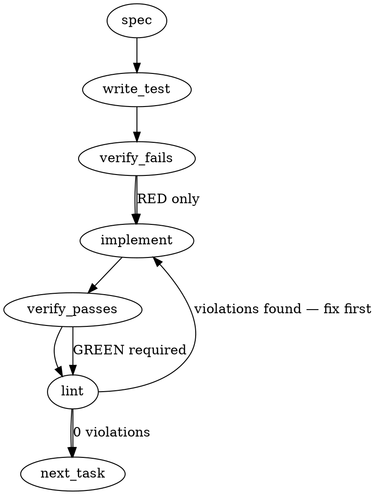

### Problem Statement

The `totem doctor --strict` command currently bypasses the parity sensor, resulting in a "green-by-not-checking" false positive in consumer CI pipelines. This needs to be fixed by wiring the existing `doctorParityCliCommand` into the `--strict` execution path at the CLI edge, gating it to run only when `orient.parityManifest` is explicitly configured in the repo.

### Architectural Context

- **ADR-109 / Tenet 13**: Exit decisions and process-terminating throw-gates must live at the CLI edge (`packages/cli/src/index.ts` or equivalent command routers), not deep within core logic. This drives the decision to reuse `doctorParityCliCommand` natively at the CLI layer rather than embedding `checkParity` into the core 12-check suite.

### Files to Examine

1. `packages/cli/src/index.ts` — The CLI router where `doctor` options are parsed and routed (specifically around line 1091+).
2. `packages/cli/src/commands/doctor-parity.ts` — Contains the `doctorParityCliCommand` to be invoked.
3. `packages/cli/src/utils.ts` — Contains the `loadConfig` helper needed to evaluate the configuration guard.

### Technical Approach & Contracts

1. **Target the Routing Layer**: Intercept the `doctor` command handling in `packages/cli/src/index.ts`. The current flow likely checks `if (options.parity) { return doctorParityCliCommand(options); }` and then falls through to the core suite.
2. **Inject the Guarded Execution**: After (or immediately before) the 12-check suite runs for `--strict`, dynamically load the Totem config for the current working directory using `loadConfig(cwd)`.
3. **Evaluate the Flag**: Check if `config?.orient?.parityManifest` is truthy.
4. **Execute**: If configured and `--strict` is passed, `await doctorParityCliCommand(options)`. By reusing the CLI command verbatim, we inherit its existing terminal rendering and the `blockingDriftIds` throw-gate without duplicating presentation or exit logic.
5. **No Contract Changes**: Because the schema for `orient.parityManifest` was already introduced in #2073, no Zod schema or data contract modifications are required.

**Trade-offs Considered**:

- _Executing parity before vs. after the 12-check suite_: Running it _after_ is recommended. The 12-check suite is generally faster and catches foundational configuration errors. Running parity last ensures it only evaluates against a structurally sound repository.

### Edge Cases & Traps

- **Silent Failures on Missing Config Loader**: If the config cannot be parsed, `loadConfig` might throw. Ensure the config loading handles missing configs gracefully or rely on the fact that if a config is missing, `orient.parityManifest` evaluates to `undefined`, correctly skipping the parity check.
- **Process Exit Trap**: `doctorParityCliCommand` throws an error on failure (which the CLI edge catches to exit with code 1). Do not wrap this in a `try/catch` that swallows the error. Let it bubble up to enforce the `--strict` CI failure.
- **Double Execution**: Ensure that invoking `doctor --parity --strict` doesn't execute the parity check twice. The existing early-return for `--parity` must remain mutually exclusive or safely exit before the `--strict` fall-through logic is reached.

### Implementation Tasks

- [ ] **Task 1: Add execution guard tests for `--strict` parity integration**
      Modify `packages/cli/tests/doctor.test.ts` (or the equivalent CLI routing test file).

  > TEST DIRECTIVE: Before implementing, write a failing test named `doctor --strict runs parity sensor when orient.parityManifest is configured` that mocks `loadConfig` returning the flag and verifies `doctorParityCliCommand` is called.
  > TEST DIRECTIVE: Before implementing, write a failing test named `doctor --strict skips parity sensor when orient.parityManifest is absent` that proves no parity execution occurs for non-adopters.
  > write test → verify fails → implement → verify passes → lint

- [ ] **Task 2: Wire configuration guard and invocation into CLI router**
      Modify `packages/cli/src/index.ts`.
  > TOTEM INVARIANT (CLI Edge Exit Responsibility): Exit decisions and throw-gates live at the CLI edge. You must call `doctorParityCliCommand` directly rather than invoking `checkParity` and reimplementing the blocking logic.
  1. Locate the `--strict` fall-through block for the `doctor` command (around line 1091).
  2. Import `loadConfig` from `../utils.js` (or ensure it's available).
  3. Load the configuration for the active `cwd`.
  4. Add the execution condition: `if (options.strict && config?.orient?.parityManifest)`.
  5. `await doctorParityCliCommand(options)` inside the condition, placing it _after_ the primary 12-check suite completes.
     write test (or update existing) → verify fails → implement → verify passes → lint

### Execution Flow (structural constraint)

### Verification (MANDATORY — do not skip)

Every implementation MUST end with these steps:

1. `totem lint` — deterministic rule check (zero LLM, ~2s). Fixes any violations.
2. `totem review` — AI-powered architectural review (~18s). Addresses any critical findings.
3. If using MCP, call `verify_execution` to confirm compliance before declaring the task done.

### Test Plan

- **Scenario A**: Run `totem doctor --strict` in a mock project _without_ `orient.parityManifest`. Verify output is identical to `main` (no parity output, no parity execution).
- **Scenario B**: Run `totem doctor --strict` in a mock project _with_ `orient.parityManifest`. Verify `doctorParityCliCommand` fires, renders its standard output, and correctly throws if parity drift is detected.
- **Scenario C**: Run `totem doctor --parity --strict`. Verify the existing early-return logic still fires and does not result in duplicate executions.

---

## Implementation Design

> Authored by totem-claude (controller). Refines the auto-spec above in one place: config resolution is **single-sourced inside `doctor-parity.ts`**, not re-derived at the CLI edge (the auto-spec's `loadConfig(cwd)` at the edge would duplicate checkParity's resolution and risk diverging from its global-leak guard, `doctor-parity.ts:343-345`).

### Scope

Fold the parity sensor into `totem doctor --strict` **at the CLI edge** (`index.ts`): when a repo-local `orient.parityManifest` is configured, `--strict` runs `doctorParityCliCommand` (reusing its render + `blockingDriftIds` throw-gate verbatim) after the 12-check suite. It will **NOT** distribute the manifest (292 S1–S3), change any consumer's CI invocation, alter the standalone `--parity` mode, touch `doctor.ts`'s 12-check suite, or re-derive config resolution at the CLI edge.

### Data model deltas

- **`ParityCheckResult.configured: boolean`** (NEW required field)
  - **Holds:** whether a _repo-local_ `orient.parityManifest` field was set — i.e. `configValue !== undefined` after the existing resolution (`doctor-parity.ts:336-357`). NOT whether the manifest file _loaded_: a configured-but-broken manifest is `configured: true`, so `--strict` surfaces the parse error rather than silently no-op'ing.
  - **Writer:** `checkParity` (every return path). **Reader:** `doctorParityCliCommand`.
  - **Invariant:** `configured === (configValue !== undefined)`; single-sourced in checkParity, which already applies the `isGlobalConfigPath` guard so a global-only profile yields `configured: false`.
- **`ParityCliOptions.onlyWhenConfigured?: boolean`** (NEW optional option; default falsy)
  - **Holds:** caller's request to no-op (render nothing, throw nothing, exit 0) when `configured` is false — the folded-into-`--strict` mode.
  - **Writer:** the CLI edge (`index.ts`) on the strict-fold call. **Reader:** `doctorParityCliCommand`.
  - **Invariant:** default (omitted) preserves the standalone `--parity` behavior byte-for-byte (still renders the "no parity manifest configured" SKIP). Only the strict-fold caller sets it true.

No reserved keys / sentinels — two separate fields, no flag reuse.

### State lifecycle

Both values are **per-invocation**, request-scoped, never persisted, never mutated after construction, no module-level/singleton state. `configured` is owned by `checkParity` (computed once); `onlyWhenConfigured` is owned by the CLI-edge caller (read-only in the command). Nothing crosses a lifecycle boundary — so no "one-shot flag consumed before its work succeeded" hazard.

### Failure modes

| Failure                                                    | Category                | Agent-facing surface                                                                           | Recovery                                                        |
| ---------------------------------------------------------- | ----------------------- | ---------------------------------------------------------------------------------------------- | --------------------------------------------------------------- |
| Manifest configured but file missing/corrupt (strict-fold) | runtime                 | existing parity warn/error line renders; if blocking → throw → exit 1                          | fix/reconcile the manifest file (same as standalone `--parity`) |
| Config missing/corrupt entirely                            | runtime                 | `configured: false` → `onlyWhenConfigured` no-op (no line, exit 0) — honest-absent             | n/a (non-adopter; no contract to check)                         |
| Blocking parity drift (strict-fold)                        | runtime (intended gate) | `TotemError` → `handleError` → exit 1                                                          | reconcile the blocking contract vs its canonical                |
| `checkParity` throws a defective/sentinel error            | permanent               | propagates unchanged — fails loud                                                              | fix the underlying defect                                       |
| Double execution under `--parity --strict`                 | prevented               | the existing `if (opts.parity) {…; return}` fires first; the strict-fold branch is unreachable | n/a                                                             |

No silent-degradation rows. The `configured: false` no-op is **not** degradation (Tenet 4): absence of the field means there is structurally no parity contract for that repo — the standalone `--parity` still renders a visible SKIP; only the _folded_ context renders silence, to honor the explicit zero-churn approval condition (see OQ2).

### Invariants to lock in via tests

1. `--strict` + configured manifest → parity sensor runs (lines render); a **blocking** drift → non-zero exit (TotemError thrown).
2. `--strict` + NO manifest → output byte-identical to pre-change (no parity line, no throw, exit 0) — the non-adopter zero-churn invariant.
3. `--parity --strict` → the exclusive early-return fires; parity runs **exactly once** (strict-fold branch never double-fires).
4. Configured-but-broken manifest under `--strict` → `configured: true` → sensor runs and surfaces the load/parse problem (never a silent no-op).
5. `configured === (orient.parityManifest field present)`, independent of whether the file loads.
6. A repo with only a GLOBAL-profile `parityManifest` (no repo-local field) → `configured: false` → no-op (the global-leak guard holds inside the fold).

### Open questions

- **OQ1 — call site.** strategy's 0303Z said "conditional-inside-`doctorCommand`." But `DoctorOptions:1274` + ADR-109/Tenet 13 put exit/throw decisions at the CLI edge, and `doctorCommand` returns `DiagnosticResult[]` whose `CheckStatus` lacks `info`/`unknown` (parity's richer set).
  - **Options:** (a) CLI edge (`index.ts`), beside the existing `--parity` branch — reuses parity's render+gate verbatim, doctor.ts untouched; (b) inside `doctorCommand` — forces a `CheckStatus` widening or status map + embeds a throw-gate in a function documented as composable/side-effect-free.
  - **Recommendation:** **(a) CLI edge** — the architecturally-faithful reading of strategy's intent (parity stops being an exclusive mode; `--strict` exercises it). The auto-spec independently reached the same site. I'll note the divergence-from-phrasing to strategy when the PR is up.
- **OQ2 — non-adopter output.** `--strict` + no manifest: render nothing (no-op) vs. render the honest-absent SKIP line.
  - **Options:** (a) no-op — byte-identical to today, honors the explicit "zero consumer-CI churn / no-op until opt-in" approval; (b) always SKIP — maximal visibility but adds a line to every non-adopter's `--strict` output.
  - **Recommendation:** **(a) no-op.** Approval was conditioned on no-churn; the standalone `--parity` SKIP still covers the "I explicitly asked for parity" case.
- **OQ3 — config-resolution single-sourcing.** The auto-spec resolves config at the CLI edge; my design self-gates inside the command via `configured` + `onlyWhenConfigured`.
  - **Recommendation:** **self-gate** — one source of truth for "is parity configured here," no risk of the edge diverging from checkParity's global-leak guard. (Folded into the design above; listed here only so the deviation from the auto-spec is explicit.)
