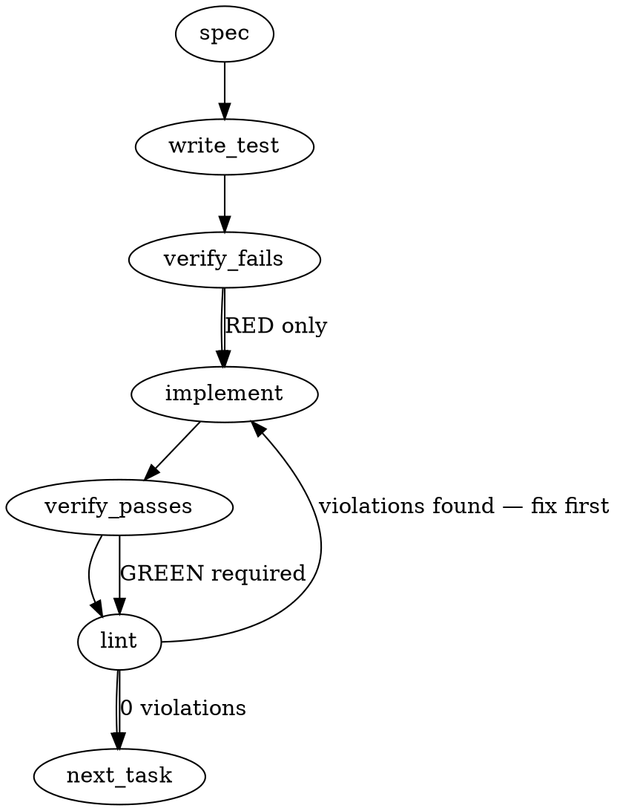

### Problem Statement

When `totem lint` runs locally with uncommitted changes, it implicitly scopes its evaluation to only the working tree diff, silently ignoring files that are committed to the local branch but not yet pushed. This creates a false-positive local "PASS" that will eventually fail at the pre-push gate (which evaluates the full branch-vs-base diff), confusing developers.

### Architectural Context

This addresses the `#2055` (local PASS must be trustworthy) initiative and aligns with the **Governing AI Agents > The Tradeoff** paradigm: the pre-push gate acts as a tripwire catching all violations on the branch. To preserve developer trust in local tools, the local lint verdict must not deceptively hide failures that the gate will catch. A warning restores "honest-by-default" behavior without fundamentally altering the flexible local workflow.

### Files to Examine

1. `packages/cli/src/commands/lint.ts` — Where the diff source is determined and where the warning logic should be injected when operating in `uncommitted` mode.
2. `packages/cli/src/git.ts` — The appropriate home for the git diff resolution helper comparing branch commits against the base.
3. `packages/cli/src/ui.js` (or `.ts`) — To understand the logger/warning API used to emit the standard warning message.

### Technical Approach & Contracts

**Approach**
We will introduce a helper to safely compute the list of files modified on the current branch compared to the base branch. In the lint command, when the resolved diff mode is `uncommitted` (or equivalent working tree mode), we will fetch these branch files and subtract the uncommitted files already slated for linting. If the remainder (files modified in commits but not in the working tree) is greater than 0, we emit the warning.

**Data Contracts / Signatures**

```typescript
// packages/cli/src/git.ts
/**
 * Safely resolves files changed between the current branch and the default branch base.
 * Swallows git errors (e.g., shallow clones, no upstream) to return an empty array,
 * ensuring lint operations never crash due to git heuristics.
 */
export function getBranchVsBaseFiles(cwd: string): string[];
```

**Sequence Logic**

1. User executes `totem lint`.
2. CLI determines diff source is `uncommitted` and resolves `filesToLint` (the working tree changes).
3. CLI calls `getBranchVsBaseFiles(cwd)`.
   - Resolves default branch via `getDefaultBranch(cwd)`.
   - Computes `git merge-base HEAD origin/{defaultBranch}`.
   - Computes `git diff --name-only {base}...HEAD`.
4. CLI calculates `unlintedBranchFiles` by filtering out any files already present in `filesToLint`.
5. If `unlintedBranchFiles.length > 0`, emit:
   `log.warn('Linting uncommitted changes only — the pre-push gate checks the full branch (N more file(s)). Lint a clean tree or use `totem lint --branch` to match.')` (where N is `unlintedBranchFiles.length`).

### Edge Cases & Traps

- **Overlapping Modifiers (The Intersection Trap):** A file can be modified in a branch commit AND have uncommitted changes. The issue asks for "N more file(s)". Do not blindly count branch files. You MUST compute the set difference (`branchFiles \ uncommittedFiles`) to avoid exaggerating the unlinted count.
- **Git State Failures (The Crash Trap):** If the repo is a shallow clone, has a detached HEAD, or lacks an `origin` remote, `git merge-base` will fail. The lint command must **not** crash. All git branch-diff logic must be wrapped in a `try/catch` that returns an empty array.
- **Warning Spam on Explicit Flags:** If a user explicitly runs `totem lint --uncommitted` (if such a flag exists), warning them might be redundant. However, to ensure gate-correctness, emitting the warning is still strictly beneficial to remind them of the pre-push disparity. Apply the warning universally when the active lint scope relies purely on the uncommitted working tree.

### Implementation Tasks

- [ ] **Task 1: Create `getBranchVsBaseFiles` helper**
  - Modify `packages/cli/src/git.ts`.
  - Export `getBranchVsBaseFiles(cwd: string): string[]`.
  - Use shared helpers: `getDefaultBranch` and `safeExec`.
  - Wrap in a `try/catch` returning `[]` on any exception.
  - Split the `safeExec` output by newline, trim, and filter boolean values to yield an array of strings.
    > TEST DIRECTIVE: Before implementing, write a failing test named `returns empty array when git merge-base throws instead of crashing` that stubs `safeExec` to throw, proving the lint run is protected from git heuristic failures.
  - write test (or update existing) → verify fails → implement → verify passes → lint

- [ ] **Task 2: Inject warning logic into lint command**
  - Modify `packages/cli/src/commands/lint.ts`.
  - Identify where the diff source resolves to `uncommitted` (and the `filesToLint` array is established).
  - Compute `const branchFiles = getBranchVsBaseFiles(cwd)`.
  - Compute `const unlinted = branchFiles.filter(f => !filesToLint.includes(f))`.
  - If `unlinted.length > 0`, use the UI logger to emit:
    `Linting uncommitted changes only — the pre-push gate checks the full branch (${unlinted.length} more file(s)). Lint a clean tree or use \`totem lint --branch\` to match.`
    > TEST DIRECTIVE: Before implementing, write a failing test named `emits warning with correct count of unlinted branch files excluding overlapping uncommitted files` that verifies the exact string output when 2 branch files exist, but 1 overlaps with the uncommitted set (should output "1 more file(s)").
  - write test (or update existing) → verify fails → implement → verify passes → lint

### Execution Flow (structural constraint)



### Verification (MANDATORY — do not skip)

Every implementation MUST end with these steps:

1. `totem lint` — deterministic rule check (zero LLM, ~2s). Fixes any violations.
2. `totem review` — AI-powered architectural review (~18s). Addresses any critical findings.
3. If using MCP, call `verify_execution` to confirm compliance before declaring the task done.

### Test Plan

1. **Git Failure Resilience:** Mock `safeExec` to throw an error when running `git merge-base`. Verify `totem lint` succeeds without warnings or crashes.
2. **Accurate File Mathematics:** Mock a scenario with uncommitted files `['A.ts', 'B.ts']` and branch-modified files `['B.ts', 'C.ts', 'D.ts']`. Verify the warning outputs exactly `(2 more file(s))` and does not count `B.ts`.
3. **Clean Baseline:** Mock a scenario where branch files and uncommitted files are identical, or branch files are empty. Verify no warning is emitted.

## Implementation Design

> Designed jointly with #2091 — see `.totem/specs/2091.md` § Implementation Design for the
> combined doc (scope, data model, failure modes, invariants, open questions). One PR closes both.
> Corrections to the generated spec above: the seam is `getDiffForReview`
> (`packages/cli/src/git.ts:138`, shared lint/review resolver), NOT a new `getBranchVsBaseFiles`
> helper in isolation; and the file count must derive from the **post-ignore-filter** branch diff
> (`filterDiffByPatterns` → `extractChangedFiles`) so N matches what the pre-push gate would
> actually lint — a raw `git diff --name-only` overcounts ignored files.
