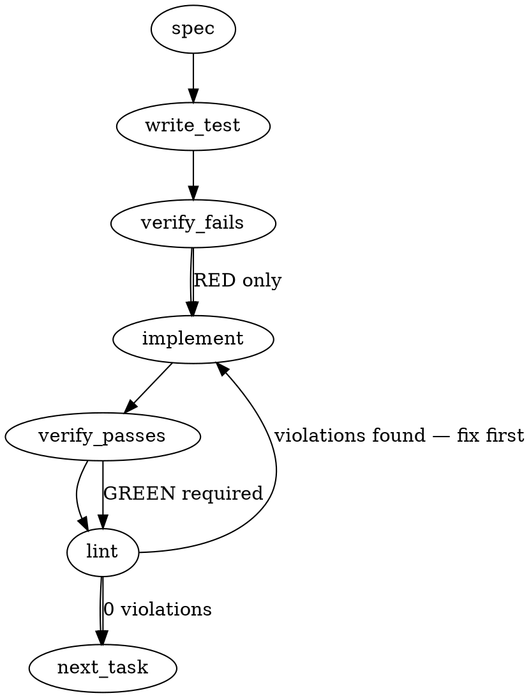

### Problem Statement

The auto-selection logic for `totem lint` and `totem review` scopes defaults to branch-vs-base only when the working tree is completely clean, making it difficult to test the exact pre-push gate locally when uncommitted changes exist. This feature introduces explicit `--branch` and `--base <ref>` flags to forcefully override the auto-selector and diff against the base branch regardless of the working tree state.

### Architectural Context

- **mmnto-ai/totem#2054 (from `getGitBranchDiff` snippet):** The underlying diff logic prefers remote-tracking refs over local branches because local bases in feature-branch workflows are often stale (never checked out). The explicit `--base` flag must pass through to this existing `getGitBranchDiff` function to maintain this architectural guarantee.
- **Enforcement Model (Pre-Push Gate):** The pre-push hook operates statelessly and deterministically. This new CLI flag brings that deterministic gate logic into the local development loop on demand.

### Files to Examine

1. `packages/cli/src/index.ts` — Command definitions (`reviewOptions`, `lintOptions`) where the new flags must be registered.
2. `packages/core/src/sys/git.ts` — Houses `getGitBranchDiff(cwd, base)` and `getDefaultBranch`, which provide the actual git operations required for this feature.
3. `packages/cli/src/utils/diff-selector.ts` (or equivalent command action handlers) — Where the diff-source auto-selection logic lives and must be intercepted.

### Technical Approach & Contracts

We will modify the command option definitions for both `lint` and `review` to accept the new scope modifiers. We will then intercept the diff-source auto-selection logic so that providing either of these flags bypasses working-tree checks entirely and delegates directly to `getGitBranchDiff`.

**Data Contract Changes:**
Update the shared or command-specific option interfaces (e.g., `LintOptions` and `ReviewOptions`) to include the new scoping flags:

```typescript
export interface DiffScopeCliOptions {
  branch?: boolean;
  base?: string;
  // Existing flags...
  staged?: boolean;
  all?: boolean;
}
```

**Sequence Logic (Diff Resolution):**

1. Check for mutually exclusive flags: If `--branch` or `--base` is used alongside an explicit working-tree flag like `--staged` or `--all`, throw an error (Fail Fast).
2. If `--base <ref>` is provided, imply `--branch = true`.
3. If `--branch === true`:
   - Bypass all checks for uncommitted files.
   - Execute and return `getGitBranchDiff(cwd, options.base)`.
4. Fall back to existing auto-selector logic (which checks working tree state).

### Edge Cases & Traps

- **Implied `--branch` from `--base`:** Users will frequently type `--base main` without `--branch`. The system must recognize `--base` as an implicit enabler of branch-scope mode.
- **Mutually Exclusive Scopes:** Using `--branch` alongside `--staged` or `--all` (if such flags exist) creates an impossible state. The CLI must reject this eagerly rather than silently prioritizing one over the other.
- **Detached HEAD / Initial Repo State:** Ensure `getGitBranchDiff` exceptions bubble up cleanly if the git repo lacks a base branch or commits, rather than resulting in a cryptic null-pointer error.
- **Shared Diff Logic:** Both `lint` and `review` MUST use the exact same diff resolution logic. Do not duplicate the logic across the two command handlers.

### Implementation Tasks

- [ ] **Task 1: Add Flags to CLI Interfaces and Command Definitions**
  - Files to modify: `packages/cli/src/index.ts` (and interfaces file if separated)
  - Test files: `packages/cli/test/index.spec.ts` (or equivalent CLI parsing test)
    > TEST DIRECTIVE: Before implementing, write a failing test named `rejects --branch and --staged combined` that proves conflicting scope flags throw an error.
  - Update `reviewOptions` and the equivalent `lintOptions` in the Commander setup to include `.option('--branch', 'Force branch-vs-base diff scope')` and `.option('--base <ref>', 'Explicit base branch override')`.
  - Update the typescript interfaces for the command options to include `branch?: boolean` and `base?: string`.
  - write test → verify fails → implement → verify passes → lint

- [ ] **Task 2: Update Shared Diff-Source Resolution Logic**
  - Files to modify: The file containing the diff auto-selection logic (e.g., `packages/cli/src/utils/diff.ts` or directly in the command action utility)
  - Test files: `packages/cli/test/diff.spec.ts` (or equivalent diff logic test)
    > TOTEM INVARIANT (Enforcement Model): The pre-push hook runs stateless checks. The `--branch` flag must identically reproduce the push-gate diff scope by ignoring uncommitted files completely.
    > TEST DIRECTIVE: Before implementing, write a failing test named `uses getGitBranchDiff bypassing uncommitted files when branch flag is true` that verifies `getGitBranchDiff` is called even when unstaged files mock-exist.
  - Modify the logic:
    1. If `options.base` is defined, treat `options.branch` as true.
    2. Throw a validation error if `options.branch` is true AND working-tree flags (like `staged` or `all`) are true.
    3. If `options.branch` is true, return `getGitBranchDiff(cwd, options.base)`.
    4. Otherwise, retain existing auto-selection behavior.
  - write test → verify fails → implement → verify passes → lint

- [ ] **Task 3: Wire Updated Diff Logic to `totem lint`**
  - Files to modify: `packages/cli/src/commands/lint.ts` (or where lint action is defined)
  - Test files: `packages/cli/test/commands/lint.spec.ts`
  - Pass the parsed `branch` and `base` options from the command invocation into the diff resolution function.
  - Ensure any strict-mode gate failures are respected on the returned diff.
  - write test → verify fails → implement → verify passes → lint

- [ ] **Task 4: Wire Updated Diff Logic to `totem review`**
  - Files to modify: `packages/cli/src/commands/review.ts` (or where review action is defined)
  - Test files: `packages/cli/test/commands/review.spec.ts`
  - Pass the parsed `branch` and `base` options from the command invocation into the diff resolution function.
  - write test → verify fails → implement → verify passes → lint

### Execution Flow (structural constraint)



### Verification (MANDATORY — do not skip)

1. `totem lint` — deterministic rule check (zero LLM, ~2s). Fixes any violations.
2. `totem review` — AI-powered architectural review (~18s). Addresses any critical findings.
3. If using MCP, call `verify_execution` to confirm compliance before declaring the task done.

### Test Plan

- **Conflict Test:** Run `totem lint --branch --staged` -> assert fails with mutually exclusive error.
- **Base Implies Branch Test:** Run `totem lint --base main` with uncommitted files present -> assert uncommitted files are ignored and scope is exactly `main...HEAD`.
- **Force Push-Gate Scope Test:** Run `totem review --branch` with uncommitted changes in the working tree -> assert output corresponds ONLY to the diff between `origin/main` (or default branch) and `HEAD`, proving working-tree bypass.

## Implementation Design

> Combined design for #2091 (`--branch`/`--base` flags) **and** #2090 (scope-mismatch warning).
> Both land in the same seam: `getDiffForReview` (`packages/cli/src/git.ts:138`), the shared
> diff resolver for `lint` and `review`, plus flag registration in `packages/cli/src/index.ts`.
> One PR, `Closes #2090, Closes #2091`. The generated spec sections above guessed at file paths
> (`diff-selector.ts`, `core/src/sys/git.ts` helpers); this section reflects the real code.

### Scope

Add `--branch` / `--base <ref>` to `totem lint` and `totem review` (forced push-gate scope), and emit a
one-line scope-mismatch warning when **lint** auto-selects the `uncommitted`/`staged` source while
branch-vs-base would cover more files. Will NOT: change the auto-selection cascade, perform any `git fetch`
(strategy steer: no-fetch, fix at gate-honesty), modify the pre-push hook template, or add the warning to
`review` (see OQ1).

### Data model deltas

- `DiffForReviewOptions` (`packages/cli/src/git.ts:93`) gains two **optional** fields:
  - `branch?: boolean` — written by Commander flag parsing; read only by `getDiffForReview`. No invariant beyond truthiness.
  - `base?: string` — explicit base **branch name** (run through `getGitBranchDiff`'s existing `origin/<base>`-preference resolution, #2054/#2074 — NOT a raw ref range). Non-empty when present; leading-`-` values rejected (flag-injection hardening, same as `getGitDiffRange`).
  - Invariant: `base` set ⇒ branch mode (implied). `branch`/`base` are mutually exclusive with `staged` and with `diff` — enforced eagerly with a hard error before any git work.
- `DiffForReviewOptions` gains `warnNarrowScope?: boolean` — set `true` only by the lint command; gates the #2090 warning so review is unaffected (see OQ1).
- No new `DiffForReviewSource` value: the forced path reports `'branch-vs-base'` (it IS that scope; downstream consumers branch on source and must treat forced/auto identically). The log line discloses the forcing: `Diff source: branch-vs-base (--branch)`.
- No reserved keys or sentinels.

### State lifecycle

No new state containers. All additions are per-invocation option fields (created at Commander parse, read once inside `getDiffForReview`, garbage with the call). Nothing crosses lifecycle boundaries.

### Failure modes

| Failure                                                                         | Category  | Agent-facing surface                                                                                                                                                            | Recovery                                      |
| ------------------------------------------------------------------------------- | --------- | ------------------------------------------------------------------------------------------------------------------------------------------------------------------------------- | --------------------------------------------- |
| `--branch`/`--base` combined with `--staged` or `--diff`                        | init      | hard error (TotemError, exit ≠0) before any git work                                                                                                                            | re-run with one scope selector                |
| `--base` value empty or leading `-`                                             | init      | hard error (flag-injection guard)                                                                                                                                               | re-run with a valid branch name               |
| `--base <ref>` resolves to no usable ref (both `origin/<ref>` and `<ref>` fail) | runtime   | existing typed `TotemGitError` from `getGitBranchDiff` with "git fetch origin <ref>" hint — bubbles through the CLI error edge                                                  | fetch/create the base ref                     |
| Forced branch diff is empty (branch == base)                                    | runtime   | existing "No changes detected" warn + null return (exit 0)                                                                                                                      | none needed — honest empty                    |
| #2090 warning computation fails (no merge-base, detached HEAD, git error)       | transient | **silent skip of the warning only** — lint verdict, scope, and exit code unaffected                                                                                             | none — next run on a healthy repo warns again |
| #2090 warning fires with N computed from unfiltered file list                   | —         | (prevented by design: N derives from the **post-ignore-filter** branch diff via `filterDiffByPatterns` → `extractChangedFiles`, so N matches what the gate would actually lint) | —                                             |

Tenet-4 justification for the one silent row: the warning is a best-effort advisory _about_ scope, not a verdict
input; the failure cases (detached HEAD, no base) are exactly the states where branch-vs-base scope is
undefined, so there is no honest warning to emit. Lint's own verdict path is untouched.

### Invariants to lock in via tests

- `--base X` forces branch scope even with a dirty working tree (uncommitted content never enters the diff).
- `--branch` + `--staged` (and `--branch` + `--diff`) error out before any git subprocess is spawned.
- `--base` with a leading `-` is rejected (flag injection).
- Forced path and auto-fallback path produce the same `source: 'branch-vs-base'` value (downstream parity).
- Warning N = |branchFiles \ currentScopeFiles| computed on post-ignore-filter sets; overlap files are not double-counted.
- No warning when the set difference is empty, when the source is `branch-vs-base`/`explicit-range`, or when `warnNarrowScope` is unset (review path).
- A throw inside the warning computation never changes lint's verdict, output diff, or exit code.

### Open questions

- **Question 1:** Should the #2090 narrow-scope warning also fire for `totem review`?
  - **Options:** (a) lint-only via `warnNarrowScope` opt-in; (b) both commands unconditionally.
  - **Recommendation:** (a) lint-only. The issue names lint; lint is the push-gate mirror. Review's narrow scopes are routinely _intentional_ (staged-slice review is the documented truncation-cliff workaround, upstream-feedback 029) — warning every such run trains ignore.
- **Question 2:** `--branch` vs `--diff <range>` when both given?
  - **Options:** (a) hard error (both are explicit scope selectors); (b) `--diff` wins silently.
  - **Recommendation:** (a) hard error — silent precedence is exactly the implicit-scope dishonesty #2055 exists to kill.
- **Question 3:** Does `--staged` + the warning need special-casing (#2090 spec's "warning spam" note)?
  - **Options:** (a) warn in both `uncommitted` and `staged` lint modes; (b) `uncommitted` only.
  - **Recommendation:** (a) — for lint both modes are narrower than the gate and the issue's rationale ("no one has to hold the scope distinction in their head") applies equally; review is already excluded by OQ1.
