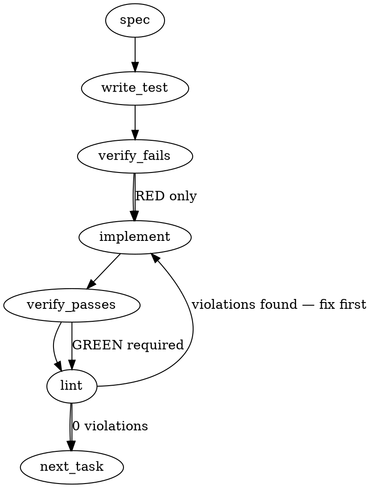

### Problem Statement

We need to emit a deterministic, content-addressed JSON artifact for every orchestrator run under `.totem/artifacts/` that captures the exact inputs, grounding provenance, backend configuration, and execution outputs. This immutable record will serve as the foundation for exact reruns (preventing silent context drift) and output comparisons across different models or prompts.

### Architectural Context

From the Totem Reliability Model: The system strictly separates the "Deterministic Substrate" from non-deterministic LLM execution. The orchestrator artifact acts as the immutable bridge between these layers, providing a verifiable, offline record of exactly what was sent to the non-deterministic provider and what was returned. Any schema changes to this artifact post-Phase 2 will be expensive, so it must be aggressively versioned (`schemaVersion`) and strictly validated via Zod.

### Files to Examine

1. `packages/cli/src/utils.ts` — Contains `runOrchestrator`. We will need to wrap or extend this to capture the required inputs, intercept the `OrchestratorResult`, and emit the artifact.
2. `packages/core/src/types.ts` (or equivalent core types file) — To review existing `OrchestratorResult` types so we can accurately map its metrics (tokens, duration, finish reason) into the new artifact schema.

### Technical Approach & Contracts

We will implement an immutable run ledger stored in `.totem/artifacts/runs/`. Artifact filenames will be the SHA-256 hash of their contents to guarantee content-addressability.

**Data Contracts:**
Create `packages/core/src/artifacts/schema.ts`:

```typescript
import { z } from 'zod';

export const BackendConfigSchema = z.object({
  identity: z.string(),
  admissionClass: z.enum(['completion_only', 'self_grounding_agent']),
  taskProfile: z.string(),
  model: z.string(),
  provider: z.string(),
  temperature: z.number(),
});

export const RunArtifactSchema = z.object({
  schemaVersion: z.literal('1.0.0'),
  inputBundle: z.object({
    prompt: z.string(),
    diffScope: z.string().optional(), // From lint/review --branch
    retrievedContext: z.string().optional(),
    specContract: z.string().optional(),
  }),
  inputHash: z.string(),
  grounding: z.object({
    hash: z.string(),
    provenanceSummary: z.string(), // Day-one requirement (e.g., "similarity-only")
  }),
  backend: BackendConfigSchema,
  output: z.object({
    raw: z.string(),
    parsedResult: z.unknown().optional(), // Pluggable parse shape
    metrics: z.object({
      promptTokens: z.number().optional(),
      completionTokens: z.number().optional(),
      durationMs: z.number(),
      finishReason: z.string().optional(),
    }),
  }),
});

export type RunArtifact = z.infer<typeof RunArtifactSchema>;
```

**Workflow:**

1. **Emit:** After `runOrchestrator` completes, stringify the `inputBundle` deterministically, hash it for `inputHash`. Do the same for grounding context. Assemble the full `RunArtifact` object. Deterministically stringify the full object, calculate its SHA-256 hash, and write it to `.totem/artifacts/runs/<hash>.json`.
2. **Rerun:** Expose a `rerunArtifact(hash)` primitive that uses the Shared Helper `readJsonSafe` to load the artifact, extracts the exact `inputBundle` and `backend` config, and executes a new run WITHOUT fetching new context (guaranteeing no drift).
3. **Compare:** Expose a `compareArtifacts(hashA, hashB)` primitive that loads two artifacts and returns a structured diff of their outputs and metrics.

### Edge Cases & Traps

- **JSON Key Ordering for Hashing:** Node's `JSON.stringify` does not guarantee key order. Hashing the raw object directly can result in different hashes for identical logical payloads. We MUST use a deterministic JSON stringify approach (e.g., sorting keys recursively) before generating the SHA-256 hash.
- **`.gitignore` Leakage:** The `.totem/artifacts/` directory will grow unbounded. The init/scaffold process must ensure `.totem/artifacts/` is added to the consumer project's `.gitignore`.
- **Date/Time Non-Determinism:** Do not include execution timestamps in the top-level hash payload if you want exact identical runs to map to the same artifact. If identical runs should produce the _same_ artifact hash (deduplication), exclude timestamps. Recommendation: Exclude execution timestamps from the hashable payload to allow native deduplication.
- **Rerun Context Leakage:** When rerunning from an artifact, the system must strictly bypass the live context retrieval pipeline. If the retrieval pipeline is accidentally invoked, silent context drift occurs, violating the core constraint of the rerun primitive.

### Implementation Tasks

- [ ] **Task 1: Define Artifact Contracts and Hash Utility**
  - Create `packages/core/src/artifacts/schema.ts` with the Zod schemas defined above.
  - Create `packages/core/src/artifacts/hash.ts` with a deterministic JSON stringification and SHA-256 hashing function (`calculateDeterministicHash(obj: unknown)`).
    > TEST DIRECTIVE: Before implementing, write a failing test named `guarantees identical hashes for objects with different key insertion orders` that proves the hash function is deterministic.
  - write test → verify fails → implement → verify passes → lint

- [ ] **Task 2: Implement Artifact Storage Service**
  - Create `packages/core/src/artifacts/storage.ts` exporting `saveRunArtifact(artifact: RunArtifact): string` and `loadRunArtifact(hash: string): RunArtifact`.
  - Use Node `fs` for saving to `.totem/artifacts/runs/`.
  - **MANDATORY**: Use the Shared Helper `readJsonSafe(filePath, RunArtifactSchema)` for loading.
    > TEST DIRECTIVE: Before implementing, write a failing test named `rejects loading corrupted or invalid schema artifacts` using an intentionally malformed JSON file.
  - write test → verify fails → implement → verify passes → lint

- [ ] **Task 3: Instrument Orchestrator to Emit Artifacts**
  - Modify `packages/cli/src/utils.ts` (in or around `runOrchestrator`).
  - Upon successful backend completion, construct the `RunArtifact` payload.
  - Call `saveRunArtifact` and return the `hash` alongside the existing `OrchestratorResult`.
    > TEST DIRECTIVE: Before implementing, write a failing test named `emits content-addressed artifact with valid schema after successful orchestrator run` that mocks the backend and verifies file creation.
  - write test → verify fails → implement → verify passes → lint

- [ ] **Task 4: Implement Rerun Primitive**
  - Create `packages/cli/src/orchestrator/rerun.ts` exporting `rerunArtifact(hash: string)`.
  - The function must load the artifact via `loadRunArtifact`, extract the `inputBundle`, and directly invoke the backend completion logic _bypassing_ all live retrieval steps.
    > TEST DIRECTIVE: Before implementing, write a failing test named `rerun executes using strictly cached bundle inputs without triggering retrieval` that spies on the retrieval module to ensure it is never called.
  - write test → verify fails → implement → verify passes → lint

- [ ] **Task 5: Implement Compare Primitive**
  - Create `packages/cli/src/orchestrator/compare.ts` exporting `compareArtifacts(hashA: string, hashB: string)`.
  - Return an object detailing the delta: `backendDiff`, `outputDiff` (string similarity or basic boolean match), and `metricsDiff` (token/duration delta).
    > TEST DIRECTIVE: Before implementing, write a failing test named `generates structural diff between two distinct artifact hashes` that compares two known mock artifacts.
  - write test → verify fails → implement → verify passes → lint

### Execution Flow (structural constraint)



### Verification (MANDATORY — do not skip)

Every implementation MUST end with these steps:

1. `totem lint` — deterministic rule check (zero LLM, ~2s). Fixes any violations.
2. `totem review` — AI-powered architectural review (~18s). Addresses any critical findings.
3. If using MCP, call `verify_execution` to confirm compliance before declaring the task done.

### Test Plan

- **Hashing Determinism:** Create two JSON objects with identical data but jumbled key order. Assert `calculateDeterministicHash` returns the exact same string.
- **Append-Only / Deduplication:** Run the orchestrator twice with the exact same prompt, diff, and temperature. Assert that the exact same artifact hash is generated and the file write is safely idempotent.
- **Schema Enforcement:** Attempt to load a `.totem/artifacts/runs/<hash>.json` file that is missing `schemaVersion` or has `schemaVersion: "0.9.0"`. Assert `readJsonSafe` throws a validation error.
- **Rerun Isolation:** Execute a rerun using a mocked orchestrator. Assert that the `inputBundle` from the artifact is perfectly reconstructed and passed to the backend, and that the retrieval service mock reports 0 invocations.

## Implementation Design

> Grounded against actual code 2026-06-07 (the generated spec above diverges from
> code reality in three places — corrected here; see "Spec corrections").

### Spec corrections (verified against source)

1. **`runOrchestrator` (`packages/cli/src/utils.ts:411`) returns `Promise<string | undefined>`, NOT `OrchestratorResult`.** The `OrchestratorResult` (tokens/duration/finishReason) is consumed _inside_ the function. Task 3's "return the hash alongside the existing OrchestratorResult" would change the return contract for all 12 call sites — forbidden by the #2106 constraint (additive-with-defaults; spec/review migrate first, every other caller compiles untouched). Emission must hook _inside_ `runOrchestrator`, where result, post-fallback `qualifiedModel`, and the DLP-masked prompt are all in scope.
2. **DLP:** the artifact must record `safePrompt`/`safeSystemPrompt` (post-`maskSecrets`, utils.ts:531) — what was actually sent — never the raw prompt. The generated spec misses this; recording raw would persist secrets to disk.
3. **Response cache (utils.ts:494–511):** a cache HIT short-circuits before `invoke` — no metrics exist, nothing ran. Cache hits emit NO artifact, and the rerun primitive must bypass the response cache (a "rerun" that replays the cache is silent drift — the same trap class as live-retrieval leakage).
4. Verified-correct claims: `readJsonSafe(filePath, schema?)` exists at `packages/core/src/sys/fs.ts:12` (Zod-aware) ✓; `totem review` routes to `shieldCommand` (`index.ts:493` → `shield.ts`), so slice-1 migration targets are `spec.ts` + `shield.ts`, both existing `runOrchestrator` callers ✓.

### Scope (2 sentences)

Emit an immutable, content-addressed run artifact from inside `runOrchestrator` for opted-in callers (`spec.ts` + `shield.ts` in this slice), plus library primitives `rerunArtifact(hash)` / `compareArtifacts(a, b)` with thin CLI verbs. NOT in scope: backend admission classes beyond recording the constant (`#2102`), real grounding provenance classes (`#2101` — this slice records `'similarity-only'` wholesale), structural post-checks (`#2103`), panel synthesis (`#2104`), any ledger/disposition semantics (Phase 2), and NO change to the `runOrchestrator` return type or any non-opted caller.

### Data model deltas

| New                                                                          | What it holds                                                                                                                                                                                                                                                                                                                                                                                                                                                    | Writes                              | Reads                                         | Invariants                                                                                                                |
| ---------------------------------------------------------------------------- | ---------------------------------------------------------------------------------------------------------------------------------------------------------------------------------------------------------------------------------------------------------------------------------------------------------------------------------------------------------------------------------------------------------------------------------------------------------------- | ----------------------------------- | --------------------------------------------- | ------------------------------------------------------------------------------------------------------------------------- |
| `RunArtifactSchema` (Zod, `packages/core/src/artifacts/schema.ts`)           | `schemaVersion` (semver string, written as `1.0.0`; see evolution policy below); `inputBundle` {maskedPrompt, maskedSystemPrompt?, diffScope?, specContract?}; `inputHash`; `grounding` {hash, provenanceSummary}; `backend` {provider, model, qualifiedModel, admissionClass, taskProfile (= tag), temperature?}; `output` {content, metrics {inputTokens?, outputTokens?, cacheReadInputTokens?, durationMs, finishReason?}}; `createdAt` (excluded from hash) | cli emission point                  | rerun/compare, downstream slices              | All required unless `?`; core never imports cli — cli maps `OrchestratorResult` fields at the edge                        |
| `opts.artifact?: ArtifactRequest` — additive field on `runOrchestrator` opts | caller-supplied bundle context: {diffScope?, specContract?, groundingHash, provenanceSummary, onEmitted?: (hash, path) => void}                                                                                                                                                                                                                                                                                                                                  | the 2 migrated callers              | `runOrchestrator` emission block              | `undefined` = today's behavior, byte-for-byte; return type unchanged                                                      |
| `.totem/artifacts/runs/<hash>.json` store                                    | one immutable artifact per actual LLM invoke                                                                                                                                                                                                                                                                                                                                                                                                                     | `saveRunArtifact` (write-if-absent) | `loadRunArtifact` via `readJsonSafe` + schema | append-only: existing file is NEVER rewritten (same hash ⇒ same content by construction); dir gitignored                  |
| `calculateDeterministicHash(obj)` (`packages/core/src/artifacts/hash.ts`)    | recursive key-sorted stringify → sha256 hex                                                                                                                                                                                                                                                                                                                                                                                                                      | —                                   | hashing inputBundle + content address         | content address computed over the artifact MINUS `createdAt` (dedup of identical runs; timestamps don't perturb identity) |

No reserved keys, no sentinels. `provenanceSummary` is `z.string()` with a documented `'similarity-only'` constant — #2101 owns the class enum; an enum here would force a schema bump when it lands.

**Schema-evolution policy (strategy review F1 — load-bearing).** The loader is version-tolerant within the major: `schemaVersion` validates as `^1\.` (not a `z.literal`), all post-1.0.0 fields are additive-optional, and `loadRunArtifact` carries a migration-on-read registry (empty at 1.0.0; a major bump REQUIRES a migration entry before the writer ships). Hard-reject only unknown majors / unparseable versions. Rationale: #2101's per-item provenance classes will bump the schema, and a hard `1.0.0` literal would orphan the accumulated eval-fixture corpus (the 2090/2091 exhibits) — an append-only ledger whose reader rejects its own history isn't append-only in practice.

### State lifecycle

- **Artifact files:** persistent, append-only. Created at successful `invoke` return (incl. quota-fallback success — recording the _resolved_ model); never mutated, never auto-deleted (growth bounded per-run, dir gitignored; pruning is a future verb, not this slice).
- **`opts.artifact` request:** per-call, owned by the caller, consumed once inside `runOrchestrator` after the invoke completes. No cross-lifecycle state.
- **No module-level state, no caches, no singletons.**

### Failure modes

| Failure                                                       | Category         | Agent-facing surface                                                         | Recovery                                                                                                                        |
| ------------------------------------------------------------- | ---------------- | ---------------------------------------------------------------------------- | ------------------------------------------------------------------------------------------------------------------------------- |
| Artifact dir create / file write fails                        | runtime          | `log.warn` (loud), run result still returned                                 | next run retries; Tenet-4 note: degradation is WARNED, never silent — and the run's primary output is not hostage to its ledger |
| Emission requested but response-cache HIT                     | by design        | `log.dim` "cache hit — no artifact"                                          | run with `--fresh` to force an invoke                                                                                           |
| `rerunArtifact`: hash not found                               | permanent        | hard `TotemParseError` (from `readJsonSafe`)                                 | operator supplies a valid hash (`totem artifact list`-style discovery deferred)                                                 |
| `rerunArtifact`: unknown schemaVersion MAJOR (or unparseable) | permanent        | hard Zod validation error naming the version                                 | add the migration entry (writer-side bug — see evolution policy)                                                                |
| `rerunArtifact`: known minor ≠ current                        | none (by design) | loads normally — additive-optional tolerance                                 | n/a (F1 policy)                                                                                                                 |
| `rerunArtifact`: provider/quota failure                       | transient        | existing orchestrator error path, unchanged                                  | retry; rerun NEVER writes over the source artifact (new run = new artifact)                                                     |
| `compareArtifacts`: either hash missing/invalid               | permanent        | hard error                                                                   | operator corrects                                                                                                               |
| DLP mask fails before invoke                                  | runtime          | existing hard `TotemOrchestratorError` (unchanged) — no invoke ⇒ no artifact | fix and rerun                                                                                                                   |

### Invariants to lock in via tests

- Identical logical payloads with different key-insertion order hash identically.
- An artifact emitted after a DLP redaction contains the MASKED prompt; the raw secret never reaches disk.
- A response-cache hit emits no artifact; `rerunArtifact` performs zero response-cache reads and zero live-retrieval calls (spy: 0 invocations).
- A non-opted `runOrchestrator` caller observes byte-identical behavior (return value, cache writes, telemetry) with the feature merged.
- After a quota fallback, the artifact records the fallback `qualifiedModel`, not the requested one.
- Emitting an artifact whose hash already exists leaves the existing file byte-identical (append-only).
- Artifact-write failure surfaces a warning AND the caller still receives the run content.
- A `1.0.0` artifact loads under a future `1.x` reader untouched (corpus survives minor bumps); an unknown-major artifact fails validation with the version named.
- `compareArtifacts` output is a pure function of its two inputs — byte/structural equality and numeric metric deltas only, no similarity scoring (F3 / Tenet 9).

### Review round (strategy-claude dispatch 2026-06-07T0253Z — design CONFORMS; three findings folded)

- **F1 (load-bearing):** version-tolerant loading — folded into the schema-evolution policy above.
- **F2:** the generated Test Plan's "run twice, assert same hash" dedup test is unrunnable as written against a live backend (a second run either response-cache-hits — no artifact, by this design — or re-invokes with nondeterministic output → different content address). It is valid ONLY under a deterministic mocked backend. **Where this Implementation Design and the generated sections above conflict, the Implementation Design supersedes.**
- **F3:** `compareArtifacts` stays deterministic: structural/byte diff + numeric metrics delta ONLY. The generated spec's "string similarity" suggestion would sneak a scorer into the deterministic substrate (Tenet 9); semantic similarity is eval-harness territory (#2103+), never a core primitive.

### Open questions — RESOLVED (operator rulings, satur8d, relayed via the 0253Z dispatch; settled)

- **CLI verbs in-slice: GO** — thin `totem artifact rerun <hash>` / `totem artifact compare <a> <b>`, JSON output, no interactivity. (The #474 ruling titled the slice "run-artifact + rerun/compare"; sensors nobody can invoke don't get dogfooded.)
- **Always-on emission for spec/review: GO** — a flag means fixtures exist only when remembered (Tenet 3).
- **`admissionClass: 'completion_only'` constant: GO** — day-one self-description; #2102 only changes who supplies the value.
