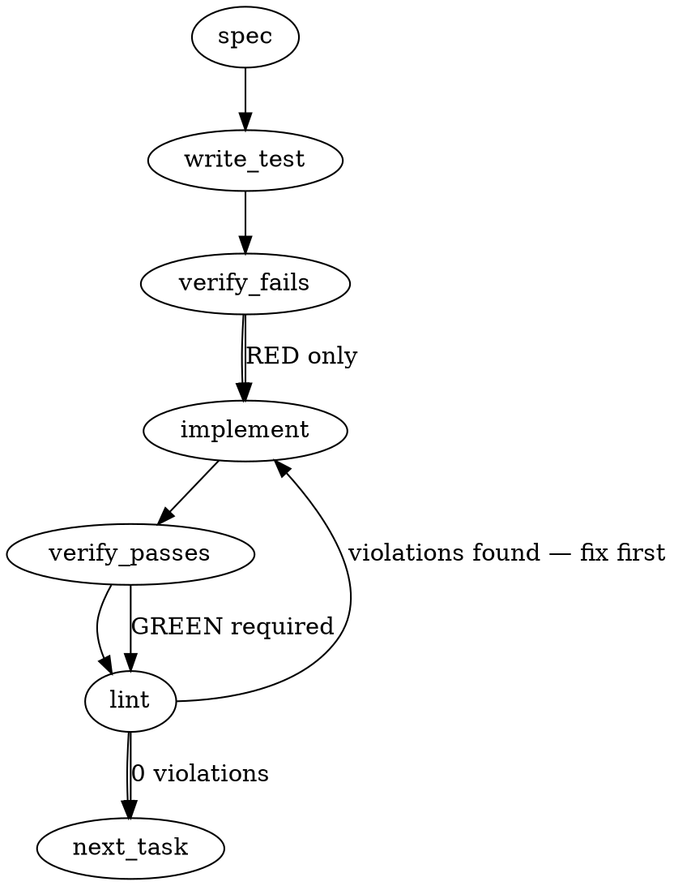

### Problem Statement

The deterministic context-assembly layer needs a formal `GroundingBundle` schema to explicitly classify the provenance of retrieved information (e.g., `similarity-only`, `structurally-verified`). Currently, fuzzy vector searches are passed to the LLM without strict classification; this work wraps existing retrievals honestly as `similarity-only` and deterministically hashes the resulting bundle so the artifact API can verify the grounding quality.

### Architectural Context

From provided context:

- **Structural Layers (Deep Dive):** Emphasizes the hard separation between the fuzzy semantic layer and the rigid deterministic layer. The deterministic layer must own the bundle classification.
- **`RunArtifactRequest` (packages/cli/src/utils.ts):** Already contains `groundingHash` and `provenanceSummary` fields from slice 1, expecting a SHA-256 hex and a provenance string (e.g., `PROVENANCE_SIMILARITY_ONLY`).

### Files to Examine

1. `packages/cli/src/utils.ts` — Contains the `RunArtifactRequest` interface which consumes the hash and summary.
2. `packages/cli/src/commands/spec.ts` — Currently retrieves LanceDB context; needs to wrap it in the new bundle schema.
3. `packages/cli/src/commands/shield.ts` — Also retrieves context; requires the same bundle wrapping.

### Technical Approach & Contracts

We will implement a standard Zod schema for the Grounding Bundle and a deterministic hashing utility.

**Data Contracts:**

```typescript
import { z } from 'zod';

export const ProvenanceClassSchema = z.enum([
  'similarity-only',
  'structurally-verified',
  'spec-contract',
  'compiled-rule',
]);

export const GroundingItemSchema = z.object({
  provenance: ProvenanceClassSchema,
  source: z.string(), // File path, URL, or identifier
  content: z.string(),
  // Optional metadata must be string-keyed if used, but strictly limited to avoid hashing instability
});

export const GroundingBundleSchema = z.object({
  items: z.array(GroundingItemSchema),
});

export type ProvenanceClass = z.infer<typeof ProvenanceClassSchema>;
export type GroundingItem = z.infer<typeof GroundingItemSchema>;
export type GroundingBundle = z.infer<typeof GroundingBundleSchema>;
```

**Sequence Logic:**

1. **Schema & Utilities:** Create a `grounding.ts` utility file in the CLI package. Implement a `hashGroundingBundle(bundle: GroundingBundle): string` function.
2. **Deterministic Hashing:** To avoid JSON key-order race conditions, the hashing function must map items to a strict array tuple before stringifying: `JSON.stringify(bundle.items.map(i => [i.provenance, i.source, i.content]))`, then hash with Node's `crypto.createHash('sha256')`.
3. **Command Integration (`spec` & `shield`):**
   - Intercept the LanceDB retrieval results.
   - Map them into `GroundingItem` records hardcoded to `similarity-only`.
   - Construct the `GroundingBundle` and calculate the `groundingHash`.
   - Derive the `provenanceSummary`. If the array is empty, it should explicitly report `PROVENANCE_EMPTY`. If all items are `similarity-only`, report `PROVENANCE_SIMILARITY_ONLY`.
   - Pass these into the `RunArtifactRequest` or equivalent artifact recording step.

### Edge Cases & Traps

- **JSON Serialization Instability:** Relying on `JSON.stringify(item)` directly for hashing is an architectural trap. Different V8 engines or minor code reshuffling can alter object key insertion order, mutating the hash for identical data. The approach must strictly serialize values in a guaranteed order (e.g., tuple extraction).
- **Honest-Absent Discipline:** If LanceDB returns no results, the system must NOT omit the bundle step. It must create an empty bundle, hash the empty state, and honestly report `PROVENANCE_EMPTY`.
- **Silent Upgrades:** The implementation must not provide a mechanism to default or auto-upgrade provenance. `similarity-only` must be explicitly passed by the caller.

### Implementation Tasks

- [ ] **Task 1: Define GroundingBundle Contracts & Hashing**
  - Create `packages/cli/src/grounding.ts`.
  - Export the Zod schemas (`ProvenanceClassSchema`, `GroundingItemSchema`, `GroundingBundleSchema`) and their inferred types.
  - Implement `hashGroundingBundle(bundle: GroundingBundle): string` using `crypto.createHash('sha256')` and strict tuple serialization `[provenance, source, content]`.
  - Implement `summarizeProvenance(bundle: GroundingBundle): string` (returns `PROVENANCE_EMPTY`, `PROVENANCE_SIMILARITY_ONLY`, or `PROVENANCE_MIXED`).
    > TEST DIRECTIVE: Before implementing, write a failing test named `generates identical hashes for bundles with different object key insertion orders` to prove the hashing mechanism is deterministic.
  - write test (in `packages/cli/src/__tests__/grounding.test.ts`) → verify fails → implement → verify passes → lint

- [ ] **Task 2: Integrate GroundingBundle into Spec Command**
  - Modify `packages/cli/src/commands/spec.ts`.
  - Import the schemas and utility functions from `grounding.ts`.
  - Locate the LanceDB retrieval logic. Map the raw semantic results into `GroundingItem` objects with provenance `'similarity-only'`.
    > TOTEM INVARIANT (Honest-absent discipline): A bundle with zero structurally-verified items says so; nothing upgrades provenance silently.
  - Generate the bundle, calculate the hash, and calculate the summary.
  - Inject `groundingHash` and `provenanceSummary` into the downstream artifact request.
    > TEST DIRECTIVE: Before implementing, write a failing test named `honestly reports PROVENANCE_EMPTY and valid hash when no semantic index results are found` in the spec command tests.
  - update existing test → verify fails → implement → verify passes → lint

- [ ] **Task 3: Integrate GroundingBundle into Shield Command**
  - Modify `packages/cli/src/commands/shield.ts`.
  - Apply the exact same wrapping logic used in Task 2 to the shield command's context retrieval.
  - Ensure the resulting hash and summary are passed to the shield's artifact submission payload.
    > TEST DIRECTIVE: Before implementing, write a failing test named `tags all retrieved context explicitly as similarity-only in shield artifact payload`.
  - update existing test → verify fails → implement → verify passes → lint

### Execution Flow (structural constraint)



### Verification (MANDATORY — do not skip)

Every implementation MUST end with these steps:

1. `totem lint` — deterministic rule check (zero LLM, ~2s). Fixes any violations.
2. `totem review` — AI-powered architectural review (~18s). Addresses any critical findings.
3. If using MCP, call `verify_execution` to confirm compliance before declaring the task done.

### Test Plan

1. **Deterministic Hashing:** Create two identical semantic context chunks but assign object keys in different orders (`{content, source, provenance}` vs `{provenance, source, content}`). Assert they produce the exact same SHA-256 hex.
2. **Empty States (Honest-Absent):** Mock the LanceStore to return 0 results. Assert the commands generate a valid SHA-256 hash representing an empty array and output `PROVENANCE_EMPTY`.
3. **Schema Rejection:** Attempt to parse a bundle containing an invalid provenance string (e.g., `similarity`) using `GroundingBundleSchema.parse()`. Assert it throws a Zod validation error, proving day-one immutability of the allowed classes.

## Implementation Design

> Supersedes three spec proposals after the verify-against-code pass: (1) classes are an **open string with canonical constants**, not `z.enum` — the issue says "(extensible)" and slice 1's `provenanceSummary` precedent exists precisely so additions land minor-not-major (the spec's own Test 3 would forbid that); (2) hashing reuses core's existing `calculateDeterministicHash` — the spec's hand-rolled tuple serialization would create a second hashing convention (the 292 §6/§9.1 "one enumeration, two readers" violation); (3) the schema lives in **core** (`packages/core/src/artifacts/`), beside the artifact schema it extends — CLI assembles, core defines and validates.

### Scope

Add a `GroundingBundle` schema (core) where every item self-describes its provenance class, assemble it caller-side in `spec`/`shield` wrapping today's retrieval honestly as `similarity-only`, hash the bundle into the run artifact, and derive `provenanceSummary` from the bundle instead of asserting it wholesale. NOT in scope: the structural resolvers (#344/#375 own populating `structurally-verified`), post-check enforcement (#2103), any re-classing of existing artifacts (day-one means day-one), provider-side changes (providers stay dumb pipes), new `totem artifact` verbs, and bundling shield's `fileContext`/`smartHints` (today's grounding hash covers `RetrievedContext` only; widening the surface is a separate, explicit decision).

### Data model deltas

- **`PROVENANCE_CLASSES` canonical constants (core):** `similarity-only` | `structurally-verified` | `spec-contract` | `compiled-rule`. Schema-level validation is `z.string().min(1)` (extensible without a major); the constants define the canonical vocabulary; honest-usage discipline (and future post-checks) governs values. `PROVENANCE_SIMILARITY_ONLY` is retained and becomes one of the four. **Fail-safe-down rider (strategy review F2, doctrine-line now, test rides #2103):** every consumer (summarize, eval thresholds, future sensing) treats a non-canonical class string as NOT-upgraded — lowest trust — so an invented class can never confer trust absent code-side graduation. Safe today because classes are builder-emitted constants, never model-supplied.
- **`GroundingItemSchema` (core, new):** `{ provenance: string, contentHash: sha256-hex, sourceType: string ('spec'|'session_log'|'code'|'lesson'), filePath: string, sourceRepo?: string }`. Written by `buildGroundingBundle` (core helper); read by conformance-sensing, the eval harness, and `artifact compare`. **Absent `sourceRepo` means the run's own repo** (strategy review F1) — cross-repo post-checks resolve `filePath` against the run's config root when the field is absent, deterministically. **Identity + hash only — no content bytes**: the artifact's `maskedPrompt` already carries the bytes once; duplicating them bloats every artifact and creates a second DLP surface. `contentHash` is sha256 of the raw retrieved snippet (hash of secret-bearing text is not reversible — same posture as `groundingHash` today).
- **`GroundingBundleSchema` (core, new):** `{ items: GroundingItem[] }`. **No stored summary/count fields** — counts are derived (derive-or-couple: a stored `classCounts` is a mirror that can drift from `items`).
- **`GroundingSchema` delta (core, additive):** gains `bundle: GroundingBundleSchema.optional()`. Old artifacts lack it (the F1 version-tolerant reader carries them); new artifacts always populate it.
- **`RunArtifactRequest` delta (cli, additive):** gains `bundle?: GroundingBundle`, passed through verbatim into `grounding.bundle`.
- **Derivation helpers (core, new):** `buildGroundingBundle(items: Array<{sourceType, result: SearchResult}>): GroundingBundle` — maps + **canonically sorts** items (by `sourceType`, `filePath`, `contentHash`) so retrieval order (score-dependent, nondeterministic across runs) never changes the hash; `summarizeProvenance(bundle): string` — sorted class-count string (`similarity-only:14` / `similarity-only:12,structurally-verified:2`), zero items → `'ungrounded'` (more honest than the spec's `PROVENANCE_EMPTY` — it names the epistemic state, not the mechanical one). Sorted counts beat the spec's `PROVENANCE_MIXED`: deterministic, parseable, and the eval harness can threshold on them.
- **Hash semantics change:** `grounding.hash` becomes `calculateDeterministicHash(bundle)` (was: hash of raw `RetrievedContext`). The bundle is the verifier's surface — the attestation must hash what the verifier will hash. Item content is covered transitively via per-item `contentHash`.
- **`RUN_ARTIFACT_SCHEMA_VERSION`:** minor bump (additive field + changed hash derivation is a meaning change worth a version marker). Migration registry stays empty by policy — the F1 reader parses both shapes; the bump is a marker, not a migration.

### State lifecycle

No new persistent state containers. The bundle is per-invocation: assembled in the command (after retrieval, before `runOrchestrator`), embedded in the immutable artifact at emission, never mutated. The rerun path (`run-artifacts.ts`) carries `source.grounding` — including `bundle` — **verbatim** (rerun makes no new grounding claim; one-line passthrough addition).

### Failure modes

| Failure                                       | Category                | Agent-facing surface                                                                                                                                  | Recovery                                          |
| --------------------------------------------- | ----------------------- | ----------------------------------------------------------------------------------------------------------------------------------------------------- | ------------------------------------------------- |
| Retrieval returns zero items                  | runtime (expected)      | bundle emitted with `items: []`, summary `'ungrounded'` — loud in the artifact, run proceeds (a spec run with no index hits is degraded, not invalid) | next run with populated index                     |
| Bundle fails schema validation at emission    | runtime (bug)           | existing #2100 contract: artifact emission warns and never fails the run                                                                              | fix + rerun; the warn is the signal               |
| Old artifact (no `bundle`) hits rerun/compare | permanent (by design)   | parses via version-tolerant reader; rerun carries grounding verbatim sans bundle; compare shows hash inequality vs new-format runs honestly           | none needed — old artifacts are immutable history |
| Caller passes a non-canonical class string    | runtime (future misuse) | schema accepts (extensible by design); conformance-sensing/post-checks (#2103) own flagging unknown classes                                           | doctrine + post-check, not schema rejection       |
| Item missing `filePath`/`sourceType`          | init (bug)              | hard Zod error at bundle build — identity fields are required, fabricated/absent identity is the illusion-of-grounding trap                           | fix at the call site                              |

### Invariants to lock in via tests

1. First-cut builder emits **only** `similarity-only` items — no input shape can produce an upgraded class (nothing upgrades provenance silently).
2. Same item set in different retrieval order → **identical bundle hash** (canonical sort inside the builder; `calculateDeterministicHash` key-sorts objects but is order-significant for arrays).
3. `summarizeProvenance` derives from `items` only; zero items → `'ungrounded'`; multi-class counts render in sorted class order (deterministic string).
4. `grounding.hash` recorded in the artifact equals `calculateDeterministicHash` of the recorded `grounding.bundle` — one enumeration, two readers (the gate-correctness cluster's generalization, applied at birth).
5. A slice-1 artifact (no `bundle`, wholesale summary) still parses, reruns, and compares (version tolerance).
6. Rerun of a bundled artifact carries `bundle` byte-identical (no new grounding claim).
7. Bundle items carry no content bytes (schema has no content field — asserted structurally).
8. Both callers (spec + shield) emit bundles whose item count equals their retrieved-context totals (no silent item drops between retrieval and bundle).

### Open questions

- **Q1 — Class vocabulary: open string + canonical constants (recommended) vs `z.enum`.** Open string matches the issue's "(extensible)", the slice-1 precedent, and lets #344/#375 graduate classes without majors; the schema stops validating vocabulary, which #2103's post-checks own. `z.enum` gives day-one rejection of typos but makes every future class a breaking schema change for old readers.
- **Q2 — `grounding.hash` semantics: switch to hash-of-bundle (recommended) vs keep hash-of-context and add a separate `bundleHash`.** Switching keeps ONE hash with one meaning (the verifier's surface); keeping both preserves slice-1 comparability across the boundary at the cost of two hashes that will be confused. Old-vs-new comparability is already broken by the format change either way.
- **Q3 — `RUN_ARTIFACT_SCHEMA_VERSION` minor bump: yes (recommended) vs no.** Bump marks the hash-semantics change observably; reader is tolerant either way. Cost: trivially touches the F1 test fixtures.
